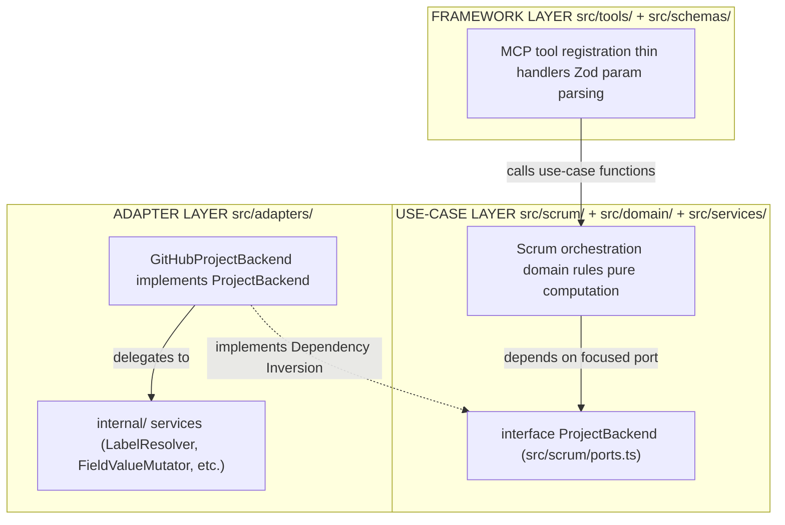

# AGENT.md

Project guidance for all coding agents. Concise by design - linked docs provide depth.

## Reference Documents

- `README.md` - Project installation.
- `tasks/TODO.md` - Active work items.
- `tasks/REFACTORING.md` - Ongoing refactor plan.
- `docs/proj-diagram.md` - Current module dependency diagram.
- `docs/ARCHITECTURE.MD` - Project architecture

## High-Level Architecture

Three layers. Inner layers never import outer.



- **Entry:** `src/index.ts` - bootstraps McpServer, registers tools, selects transport.

## Code Style

- **Imports:** Full relative paths with `.ts` extension; no bare specifiers for local modules.
- **Naming:** `PascalCase` types · `camelCase` functions/vars · `UPPER_SNAKE_CASE` constants.
- **Functions:** Arrow only - `const fn = (arg: Type): Return => {}`.
- **Errors:** Throw `GitHubApiError`; handlers return structured text via format helper.
- **Zod:** Always `.strict()` on object schemas.
- **Types:** No inline concrete types; define named types. Compose or extend existing ones.
- **Lint:** `deno lint` must pass before marking any task complete.
- **Readability:** Code must be clean, maintainable, and beautiful for the humans to read. No type or logic repetition. Keep things modular and extendable.

## Commands

```bash
mempalance search "your search string"  # semantic codebase search
deno lint                                # lint
deno task test                                # unit tests
deno fmt --check                         # format check
deno task diagram-gen                    # regenerate module dependency report
```
