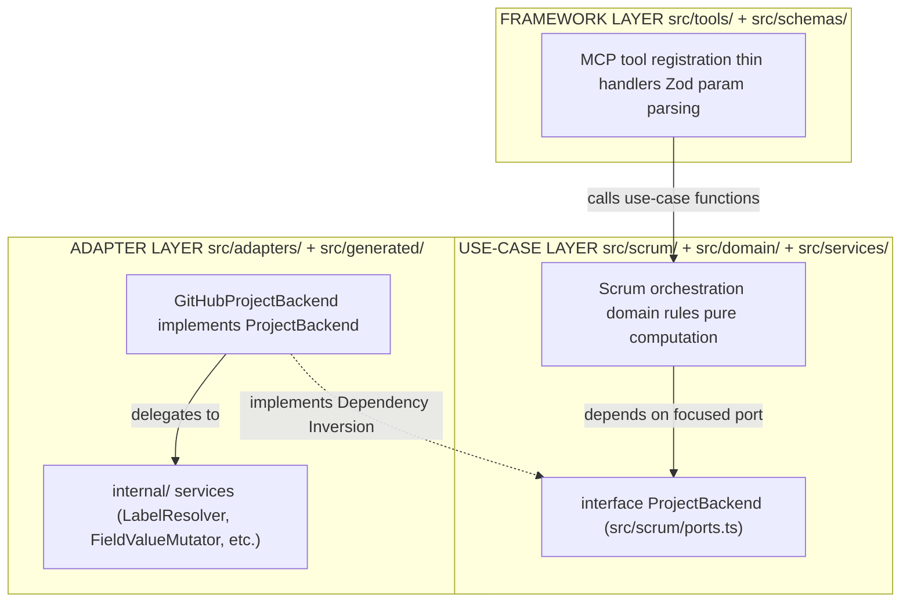

# AGENT.md

Guidance for coding agents working in this repository. Concise by design — see linked documents for depth.

## Reference Documents

- `README.md`: Project vision, domain model, tool surface design, interaction patterns.
- `skill/scrum-master-agent/SKILL.md`: Agentic Scrum prompts and ceremony playbooks.

## Context & Tool Rules

- **Read:** Max 500 lines/op; use offset/limit for large files. Max 2 ref files active at once.
- **Tasks:** On high context noise, break into tasks → `tasks/TODO.md`. Remove outdated entries when done.
- **Skills:** Check `.roo/skills/` first; load skill file before any large doc.
- **Search:** `searxng_*` tool to search the web. `mempalance_*` tool or command to perform a semantic search of the project. Never assume. Think, search, confirm, before response.

## Architecture

Three layers. Inner layers never import outer.



- **Entry:** `src/index.ts` — bootstraps McpServer, registers tools, selects transport
- **Refactor plan:** `tasks/REFACTORING.md`
- **Active tasks:** `tasks/TODO.md`
- **Current proj modules:** `docs/proj-diagram.md`

## Code Style

- Imports: Full relative paths with `.ts`; no bare specifiers.
- Naming: `PascalCase` types · `camelCase` functions/vars · `UPPER_SNAKE_CASE` constants.
- Functions: Arrow only — `const fn = (arg: Type): Return => {}`.
- Errors: Throw `GitHubApiError`; handlers return structured text via format helper.
- Zod: Always `.strict()`.
- Types: Avoid using concrete types (ex: `{ name: "name", val: 5 }`).
- Lint: Always ensure the linting test passes.

## Commonly Used Commands

```bash
# semantic search the project codebase
mempalace search "your search string"

# lint check
deno lint

# unit test
deno test

# code format check
deno fmt --check

# generate module dependency report
deno tast diagram-gen
```
