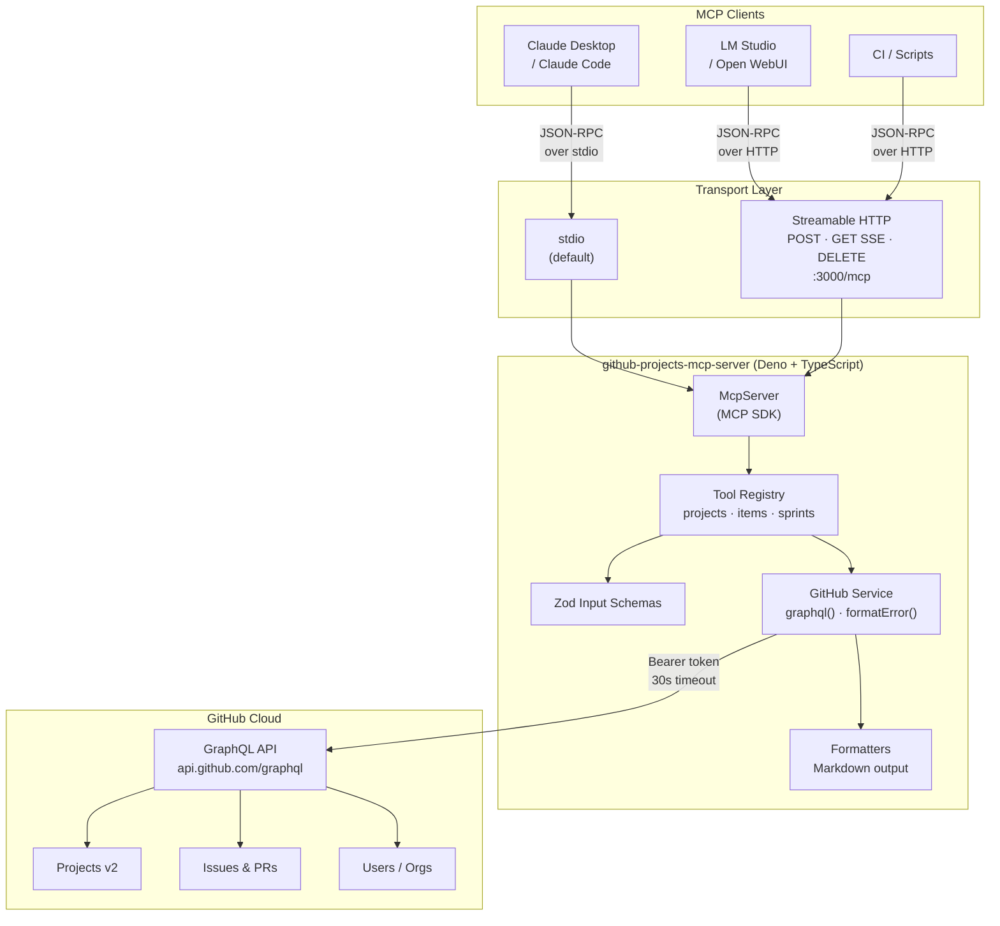
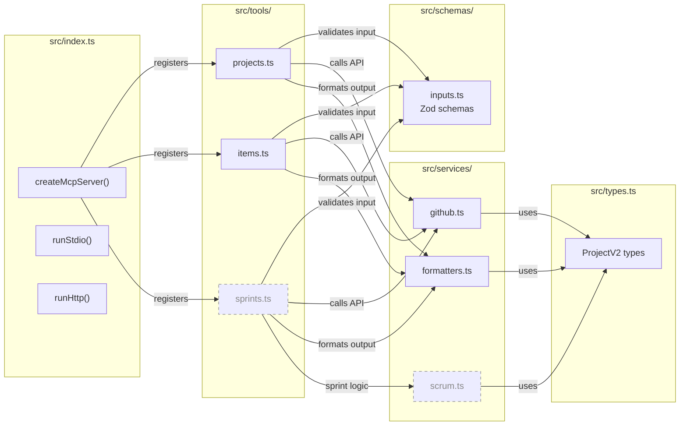
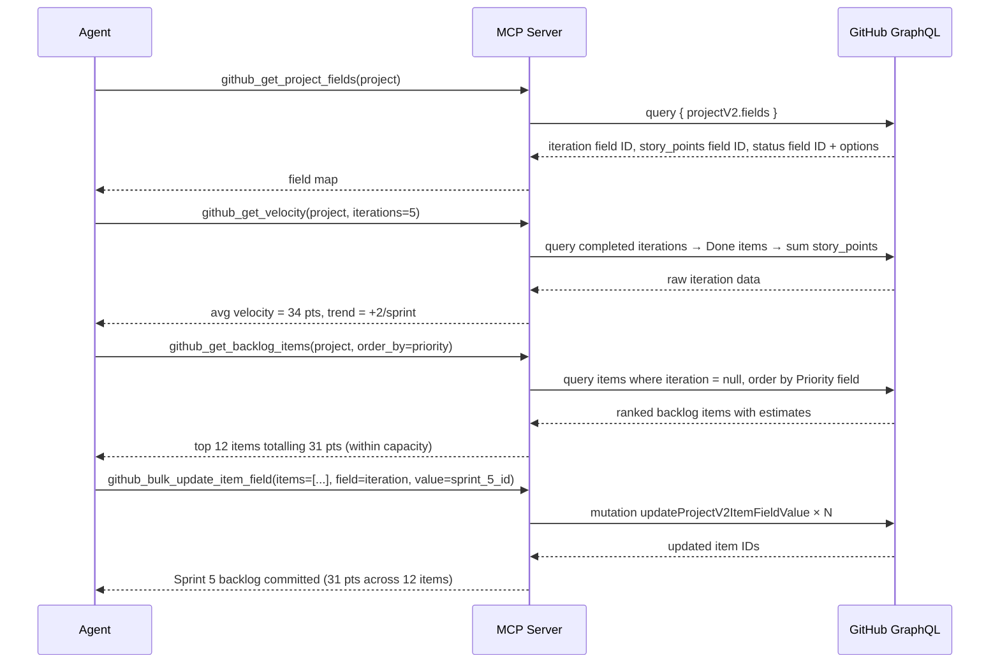
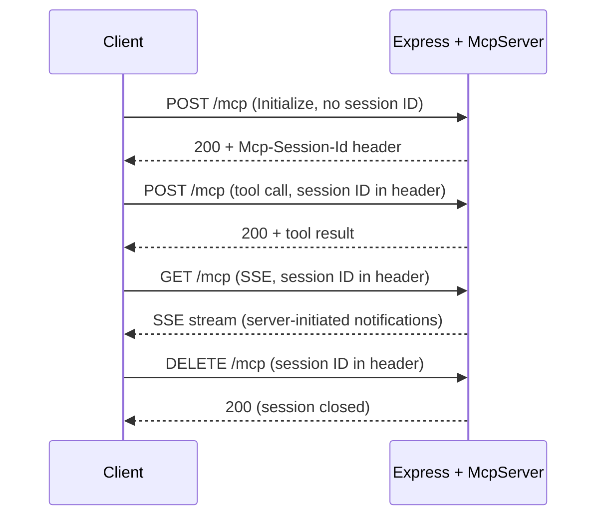

# GitHub Projects v2 MCP Server

A local [Model Context Protocol (MCP)](https://modelcontextprotocol.io/) server for operating on **GitHub Projects v2** via the GitHub GraphQL API. Designed to serve as the action layer for LLM agents performing autonomous SCRUM project management — sprint planning, backlog refinement, velocity tracking, and ceremony facilitation — without leaving the GitHub Projects ecosystem.

Supports two transports: **stdio** (Claude Desktop / Claude Code / LM Studio) and **Streamable HTTP** (Open WebUI / Docker / home lab).

---

## Related Documentation

- [GitHub Projects v2 — About Projects](https://docs.github.com/en/issues/planning-and-tracking-with-projects/learning-about-projects/about-projects)
- [GitHub Projects v2 — GraphQL API](https://docs.github.com/en/issues/planning-and-tracking-with-projects/automating-your-project/using-the-api-to-manage-projects)
- [Model Context Protocol Specification](https://modelcontextprotocol.io/docs)

---

## System Architecture

### High-Level: MCP Clients → Server → GitHub



### Internal Module Architecture



---

## Tool Reference

### Existing Tools

#### Project Management (`src/tools/projects.ts`)

| Tool | Type | Description |
|---|---|---|
| `github_list_projects` | Read | List all Projects v2 for a user or org, with pagination and closed-project filter |
| `github_get_project` | Read | Full project details: node IDs, field definitions, option IDs, README |
| `github_get_project_fields` | Read | All custom fields with their IDs, types, single-select options, and iteration configs |
| `github_update_project` | Write | Patch title, description, README, visibility, or open/closed status |

#### Item Management (`src/tools/items.ts`)

| Tool | Type | Description |
|---|---|---|
| `github_list_project_items` | Read | Paginated item list with full content and all field values; optional type filter |
| `github_add_item_to_project` | Write | Add an existing Issue or PR to a project by node ID |
| `github_add_draft_issue` | Write | Create a draft issue directly in a project with optional assignees |
| `github_update_item_field` | Write | Set or clear any field value: text, number, date, single-select, or iteration |
| `github_archive_project_item` | Write | Archive or unarchive an item (reversible; item stays in project) |
| `github_delete_project_item` | Write | Permanently remove an item from a project (irreversible) |
| `github_get_issue_node_id` | Read | Resolve a human-readable issue/PR number to a GraphQL node ID |
| `github_get_user_node_id` | Read | Resolve a GitHub login to a GraphQL node ID |

---

### Planned Tools

#### Sprint & SCRUM Layer (`src/tools/sprints.ts`)

These tools form the autonomous SCRUM management layer. They are read/aggregate or bulk-mutation operations that the agent cannot currently accomplish with existing tools without excessive multi-step reasoning.

| Tool | Type | Description |
|---|---|---|
| `github_get_sprint_status` | Read | Full state of one iteration: committed points, completed points, per-item status, blocked items, carry-over candidates |
| `github_get_velocity` | Read | Velocity series across last N completed iterations — story points done per sprint, rolling average, trend |
| `github_get_backlog_items` | Read | Items not assigned to any iteration, ordered by a priority field; the agent's view of the Product Backlog |
| `github_bulk_update_item_field` | Write | Set the same field value on a list of items in one call — used to commit a batch of items to a sprint |
| `github_close_sprint` | Write | Sprint close ceremony: moves incomplete items to a target iteration or clears them to backlog; optionally archives Done items |
| `github_generate_sprint_report` | Read | Synthesizes sprint review data into a structured document: goal, velocity, item-by-item outcome, carry-over list, retrospective scaffold |

#### Enhancements to Existing Tools

| Tool | Change | Reason |
|---|---|---|
| `github_list_project_items` | Add `iteration_id` and `status_option_id` filter params | Agent needs scoped queries (e.g. "all Blocked items in Sprint 4") without full-list post-filtering |
| `github_add_draft_issue` | Add optional `iteration_id` param | Create and assign to sprint in a single call during sprint planning |
| `github_get_project_fields` | Add optional `field_type` filter param | Agent frequently needs only the iteration field or only the story-points field — avoids scanning 30 fields |

---

## SCRUM Ceremony → Tool Mapping

```mermaid
flowchart TD
    subgraph Ceremonies["SCRUM Ceremonies"]
        SP["Sprint Planning"]
        DS["Daily Standup"]
        SR["Sprint Review"]
        RR["Retrospective"]
        REF["Backlog Refinement"]
    end

    subgraph ReadTools["Read / Aggregate Tools"]
        GBI["github_get_backlog_items"]
        GSS["github_get_sprint_status"]
        GV["github_get_velocity"]
        GPF["github_get_project_fields"]
        GLPI["github_list_project_items\n(+ iteration_id filter)"]
        GSR["github_generate_sprint_report"]
    end

    subgraph WriteTools["Write / Mutation Tools"]
        GBUF["github_bulk_update_item_field"]
        GUIF["github_update_item_field"]
        GADI["github_add_draft_issue\n(+ iteration_id)"]
        GCS["github_close_sprint"]
        GARC["github_archive_project_item"]
    end

    SP --> GBI
    SP --> GV
    SP --> GPF
    SP --> GBUF
    SP --> GADI

    DS --> GSS
    DS --> GLPI

    SR --> GSS
    SR --> GV
    SR --> GSR

    RR --> GSR
    RR --> GCS
    RR --> GARC

    REF --> GBI
    REF --> GUIF
    REF --> GADI
```



---

## Data Flow: Sprint Planning (Example Autonomous Workflow)



---

## GitHub API Constraints

These are hard limits imposed by the GitHub GraphQL API that shape what this server can and cannot do autonomously:

| Constraint | Detail |
|---|---|
| **Iteration creation** | Not supported via API. Sprints must be created manually in the GitHub Projects UI. The server can assign items to existing iterations but cannot create new ones. |
| **Backlog ordering** | GitHub Projects v2 has no native API for reordering items. Priority ordering is approximated via a numeric `Priority` or `Rank` custom field. |
| **Fine-grained tokens** | Classic PAT required — fine-grained tokens do not yet support the Projects v2 GraphQL mutations. |
| **Rate limits** | GitHub GraphQL API: 5,000 points/hour. Bulk operations count once per mutation call, not per item. |
| **Field creation** | Custom fields (story points, priority, etc.) must be created manually. The API supports reading and updating field values, not creating new field types. |

---

## Prerequisites

- **Deno** ≥ 1.40 (runtime)
- **Node.js** ≥ 20 (for MCP SDK compatibility)
- A **GitHub Personal Access Token (classic)** — fine-grained tokens do not support Projects v2 write operations

### Token Scopes

| Operation | Required Scope |
|---|---|
| Read projects | `read:project` |
| Write projects (add/update/delete items, update project) | `project` |
| Read issues/PRs (to add them by node ID) | `repo` or `public_repo` |

Generate at: **GitHub → Settings → Developer Settings → Personal access tokens (classic)**

---

## Quickstart

```bash
# Clone and install dependencies
deno install

# Run on stdio (for Claude Desktop / Claude Code / LM Studio)
GITHUB_TOKEN=ghp_yourtoken deno task start
```

### Claude Desktop / Claude Code (`~/.claude/config.json`)

```json
{
  "mcpServers": {
    "github-projects": {
      "command": "deno",
      "args": ["task", "start"],
      "cwd": "/path/to/github-projects-mcp-server",
      "env": { "GITHUB_TOKEN": "ghp_yourtoken" }
    }
  }
}
```

### LM Studio

In **LM Studio → Settings → MCP Servers**, add:

```json
{
  "name": "github-projects",
  "transport": "stdio",
  "command": "deno",
  "args": ["task", "start", "--cwd", "/path/to/github-projects-mcp-server"],
  "env": { "GITHUB_TOKEN": "ghp_yourtoken" }
}
```

---

## HTTP Mode (Home Lab / Docker)

```bash
# .env
GITHUB_TOKEN=ghp_yourtoken
MCP_TRANSPORT=http
PORT=3000
```

```bash
docker compose build
docker compose up
```

The server listens on `http://0.0.0.0:3000/mcp`. Expose through a reverse proxy (Nginx, Caddy, Traefik) with authentication.

### HTTP Session Lifecycle



### Open WebUI

In the Open WebUI environment, set:

```
MCP_SERVER_URL=http://github-projects-mcp:3000/mcp
```

Or via the UI: **Admin Panel → Settings → Tools → MCP Servers**.

---

## Development

```bash
deno task dev          # watch mode with TypeScript recompilation
deno task inspector    # MCP Inspector UI for interactive tool testing
```

---

## Project Structure

```
src/
├── index.ts                  # Entry point — transport selection, server factory
├── types.ts                  # TypeScript interfaces for GitHub GraphQL responses
├── tools/
│   ├── projects.ts           # Project-level tools (list, get, update, fields)
│   ├── items.ts              # Item-level tools (CRUD, field updates, node ID lookups)
│   └── sprints.ts            # ⟵ planned: SCRUM sprint & velocity tools
├── schemas/
│   └── inputs.ts             # Zod validation schemas for all tool inputs
└── services/
    ├── github.ts             # graphql<T>() executor, GitHubApiError, formatError()
    ├── formatters.ts         # GraphQL fragments + Markdown output formatters
    └── scrum.ts              # ⟵ planned: velocity, burndown, and report logic
```

---

## Environment Variables

| Variable | Default | Description |
|---|---|---|
| `GITHUB_TOKEN` | — | **Required.** GitHub classic PAT |
| `MCP_TRANSPORT` | `stdio` | `stdio` or `http` |
| `PORT` | `3000` | HTTP listen port (http mode only) |
