# GitHub Projects v2 MCP Server

A local [Model Context Protocol (MCP)](https://modelcontextprotocol.io/) server for operating on **GitHub Projects v2** via the GitHub GraphQL API. Designed to serve as the action layer for LLM agents performing autonomous SCRUM project management — sprint planning, backlog refinement, velocity tracking, and ceremony facilitation — without leaving the GitHub Projects ecosystem.

Supports two transports: **stdio** (Claude Desktop / Claude Code / LM Studio) and **Streamable HTTP** (Open WebUI / Docker / homelab).

## Related Documentation

- [GitHub Projects v2 — About Projects](https://docs.github.com/en/issues/planning-and-tracking-with-projects/learning-about-projects/about-projects)
- [GitHub Projects v2 — GraphQL API](https://docs.github.com/en/issues/planning-and-tracking-with-projects/automating-your-project/using-the-api-to-manage-projects)
- [Model Context Protocol Specification](https://modelcontextprotocol.io/docs)
- [The SCRUM Method](https://www.scrum.org/learning-series/what-is-scrum/)

## What is SCRUM?

> If you are just getting started, think of Scrum as a way to get work done as a team in small pieces at a time, with continuous experimentation and feedback loops along the way to learn and improve as you go. Scrum helps people and teams deliver value incrementally in a collaborative way. As an agile framework, Scrum provides just enough structure for people and teams to integrate into how they work, while adding the right practices to optimize for their specific needs.
>
> [From SCRUM.org](https://www.scrum.org/learning-series/what-is-scrum/)

A fully mapped SCRUM project composition will look something like the following:

```mermaid
erDiagram
%% ── CORE PROJECT STRUCTURE ──────────────────────────────────────────────

PROJECT {
 string id PK
 string name
 string vision
 enum status "Active|Paused|Completed|Archived"
 date start_date
 date end_date
}

TEAM {
 string id PK
 string project_id FK
 string name
}

MEMBER {
 string id PK
 string team_id FK
 string name
 string email
}

MEMBER_CAPACITY {
 string id PK
 string member_id FK
 string sprint_id FK
 float available_days
 int capacity_points
 string notes
}

ROLE_ASSIGNMENT {
 string id PK
 string member_id FK
 string sprint_id FK
 enum role "PO|SM|Developer"
}

%% ── BACKLOG HIERARCHY ───────────────────────────────────────────────────

PRODUCT_BACKLOG {
 string id PK
 string project_id FK
 string product_goal
 date last_refined
}

EPIC {
 string id PK
 string backlog_id FK
 string title
 string description
 enum priority "Must|Should|Could|Wont"
 enum status "Open|InProgress|Done"
}

USER_STORY {
 string id PK
 string epic_id FK
 string title
 string as_a
 string i_want
 string so_that
 int story_points
 enum status "Backlog|Ready|InSprint|Done|Blocked"
 enum priority "Must|Should|Could|Wont"
}

SPRINT_BACKLOG_ITEM {
 string id PK
 string sprint_id FK
 string story_id FK
 date added_date
 bool carried_over
 int committed_points
}

ACCEPTANCE_CRITERIA {
 string id PK
 string story_id FK
 string criterion
 bool passed
}

TASK {
 string id PK
 string story_id FK
 string assignee_id FK
 string title
 enum type "Feature|Bug|TechDebt|Spike|Research"
 enum status "Todo|InProgress|Blocked|Done"
 float hours_estimate
 float hours_actual
}

IMPEDIMENT {
 string id PK
 string sprint_id FK
 string task_id FK
 string story_id FK
 string raised_by FK
 string owner_id FK
 string description
 date raised_date
 date resolved_date
 enum status "Open|InProgress|Resolved"
}

%% ── SPRINT ──────────────────────────────────────────────────────────────

SPRINT {
 string id PK
 string project_id FK
 int number
 string goal
 date start_date
 date end_date
 int capacity_points
 int committed_points
 int completed_points
 enum status "Planned|Active|Closed"
}

%% ── CEREMONIES ──────────────────────────────────────────────────────────

CEREMONY {
 string id PK
 string sprint_id FK
 string facilitator_id FK
 enum type "Planning|Standup|Review|Retro|Refinement"
 datetime scheduled_at
 int duration_min
 string notes
}

CEREMONY_ATTENDANCE {
 string id PK
 string ceremony_id FK
 string member_id FK
 bool attended
}

STANDUP_ENTRY {
 string id PK
 string ceremony_id FK
 string member_id FK
 date date
 string done_yesterday
 string plan_today
 string blockers
}

RETRO_ENTRY {
 string id PK
 string ceremony_id FK
 string member_id FK
 enum category "WentWell|Improve|Start|Stop"
 string observation
}

RETRO_ACTION {
 string id PK
 string retro_entry_id FK
 string sprint_id FK
 string owner_id FK
 string description
 enum status "Open|Done|Deferred"
 string sprint_target_id FK
}

REVIEW_FEEDBACK {
 string id PK
 string sprint_id FK
 string ceremony_id FK
 string given_by
 string feedback
 string triggered_story_id FK
}

%% ── TRACKING ────────────────────────────────────────────────────────────

BURNDOWN_DATAPOINT {
 string id PK
 string sprint_id FK
 enum series "Ideal|Actual"
 date date
 int remaining_points
 int completed_points
}

VELOCITY_RECORD {
 string id PK
 string project_id FK
 string sprint_id FK
 int committed_points
 int completed_points
}

%% ── QUALITY ─────────────────────────────────────────────────────────────

DEFINITION_OF_DONE {
 string id PK
 string project_id FK
 string criterion
 string area
 int version
 date last_updated
}

DEFINITION_OF_READY {
 string id PK
 string project_id FK
 string criterion
 int version
 date last_updated
}

SPRINT_REPORT {
 string id PK
 string sprint_id FK
 string author_id FK
 date submitted_at
 string summary
 string commitment_next_sprint
}

%% ── RELATIONSHIPS ───────────────────────────────────────────────────────

PROJECT ||--o{ TEAM : "has"
PROJECT ||--|| PRODUCT_BACKLOG : "owns"
PROJECT ||--o{ SPRINT : "runs"
PROJECT ||--o{ DEFINITION_OF_DONE : "defines"
PROJECT ||--o{ DEFINITION_OF_READY : "defines"
PROJECT ||--o{ VELOCITY_RECORD : "tracks"

TEAM ||--o{ MEMBER : "includes"
MEMBER ||--o{ ROLE_ASSIGNMENT : "holds"
MEMBER ||--o{ MEMBER_CAPACITY : "has per sprint"
SPRINT ||--o{ ROLE_ASSIGNMENT : "scopes"
SPRINT ||--o{ MEMBER_CAPACITY : "allocates"

PRODUCT_BACKLOG ||--o{ EPIC : "contains"
EPIC ||--o{ USER_STORY : "breaks into"

USER_STORY ||--o{ ACCEPTANCE_CRITERIA : "verified by"
USER_STORY ||--o{ TASK : "decomposed into"
USER_STORY ||--o{ SPRINT_BACKLOG_ITEM : "pulled into"

SPRINT ||--o{ SPRINT_BACKLOG_ITEM : "contains"
SPRINT ||--o{ CEREMONY : "schedules"
SPRINT ||--|| SPRINT_REPORT : "documented in"
SPRINT ||--o{ VELOCITY_RECORD : "recorded in"
SPRINT ||--o{ BURNDOWN_DATAPOINT : "tracked by"
SPRINT ||--o{ IMPEDIMENT : "surfaces"

TASK }o--o{ IMPEDIMENT : "may cause"
USER_STORY }o--o{ IMPEDIMENT : "may cause"
MEMBER ||--o{ IMPEDIMENT : "owns"
MEMBER ||--o{ TASK : "assigned to"

CEREMONY ||--o{ CEREMONY_ATTENDANCE : "records"
CEREMONY ||--o{ STANDUP_ENTRY : "captures"
CEREMONY ||--o{ RETRO_ENTRY : "captures"
CEREMONY ||--o{ REVIEW_FEEDBACK : "captures"
MEMBER ||--o{ CEREMONY_ATTENDANCE : "attends"

RETRO_ENTRY ||--o{ RETRO_ACTION : "generates"
MEMBER ||--o{ RETRO_ACTION : "owns"
SPRINT ||--o{ RETRO_ACTION : "targets"

USER_STORY }o--o{ REVIEW_FEEDBACK : "triggered by"

SPRINT_REPORT }o--|| MEMBER : "authored by"
```



This project provides the necessary tools for a LLM to act as the SCRUM master assistant within the GitHub ecosystem. Removing the need for complex PM tools.

It is designed to be used with the `skill/scrum-master-assistant/` agentic skill as the orchestration layer.

This project requires significant refactoring, as it needs to be more flexible and functional in different project contexts.

## Refactoring Plan

### Diagnosis

The current codebase has two overlapping concerns that need to be separated.

**The server is doing Scrum reasoning instead of API wrapping.** `src/tools/sprints.ts` contains five tools — `github_get_sprint_status`, `github_get_velocity`, `github_get_backlog_items`, `github_close_sprint`, `github_generate_sprint_report` — that are aggregate operations combining filtering, sorting, inference, and in the case of close/report, LLM synthesis. None of these are GitHub API operations. They are Scrum workflows dressed as tools, and they crowd the agent's context with pre-baked logic the agent should derive itself from primitive API calls.

**The server owns project state it shouldn't own.** The `scrum://config`, `scrum://sprint/current`, and `scrum://sprint/archive/{n}` resources read from local files (`config/scrum.config.yml`, `config/project-board.config.json`, `config/sprint-current.md`). This makes the server stateful and couples it to a single project. Any team wanting to use the server against a different project must reconfigure and redeploy the server.

**The server can move cards but cannot read what is on them.** The entire GitHub repository layer is missing. Issues, pull requests, comments, and discussions are where the actual content of the project lives — user stories, acceptance criteria, blocker context, review feedback. Without reading this content, the agent cannot assess Definition of Ready, understand a blocked item, or write a meaningful sprint report.

**`src/types.ts` has manual typings that overlap with the generated schema.** At 451 lines alongside a 14,766-line `src/generated/github-types.ts`, there is redundancy that adds maintenance burden without value.

---

### Design Principles

**The server is a stateless GitHub API wrapper.** It holds no project state. All project context — sprint goals, scrum configuration, DoD/DoR criteria, team capacity — lives in the managed repository and is read by the agent on demand.

**Business logic belongs to the orchestrating agent skill, not the tool server.** The server exposes what the GitHub API can do. The Scrum Master skill (external to this server) interprets that data in Scrum terms, runs ceremonies, enforces DoR/DoD, and decides what actions to take.

**Reads are flexible; writes are structured.** A single raw GraphQL query tool (`github_graphql`) covers the entire read surface. The agent constructs queries using a curated fragment library (`.github/scrum/vocabulary.graphql`). Write operations remain typed, named tools with validated parameters — arbitrary mutation strings are not permitted.

**The agent bootstraps from its own context, not from server config.** The agent receives the target repository coordinates (`owner`, `repo`, `project_number`) via its context window — a system prompt, skill configuration, or memory entry. It passes these as arguments on every tool call. The server holds no record of which project it is serving. If these coordinates are absent from context when the agent needs to use a tool, it must ask the user to provide them explicitly rather than guessing or proceeding with incomplete information.

**Project context is loaded in tiers by recall frequency.** Constants (`config.yml`) are read once per session. Sprint context (`sprint-current.md` + active iteration ID) is read once per sprint. Board state is queried daily. Item detail is fetched on demand. Pre-write ID lookups are always fresh. This minimises API calls and context window consumption.

---

### Target Architecture

**Server bootstrap — environment variables only:**

```
GITHUB_TOKEN      # GitHub personal access token — the only secret the server holds
MCP_TRANSPORT     # "stdio" (default) or "http"
PORT              # HTTP port when MCP_TRANSPORT=http (default 3000)
```

`owner`, `repo`, and `project_number` are **not** environment variables. They are parameters passed by the agent on each tool call. The agent learns these coordinates from its own context — a system prompt, skill configuration, or memory entry pointing at the subject repository. This keeps the server project-agnostic: one running instance can serve any repository the token has access to.

**Repository-resident configuration (`.github/scrum/`):**

| File                  | Purpose                                                                            | Recall tier               |
| --------------------- | ---------------------------------------------------------------------------------- | ------------------------- |
| `config.yml`          | Project constants: field mappings, team, DoD/DoR, ceremony backend, autonomy level | Tier 1 — once per session |
| `vocabulary.graphql`  | Curated GraphQL fragment library for agent query construction                      | Tier 1 — once per session |
| `sprint-current.md`   | Human-authored sprint goal, capacity plan, role assignments                        | Tier 2 — once per sprint  |
| `sprint-archive-N.md` | Historical sprint records (velocity, retro commitments, goal outcomes)             | Tier 4 — on demand        |

The server exposes `github_get_repo_file` so the agent reads any of these files via the GitHub API. No local config files remain in the server codebase.

**Final tool inventory (9 tools):**

| Tool                            | File            | Operation | Notes                                                                                           |
| ------------------------------- | --------------- | --------- | ----------------------------------------------------------------------------------------------- |
| `github_graphql`                | `repository.ts` | Read      | Replaces all current read-only tools; agent passes owner/repo/project_number in query variables |
| `github_get_repo_file`          | `repository.ts` | Read      | Replaces all `scrum://` resources; accepts `owner`, `repo`, `path`                              |
| `github_update_item_field`      | `items.ts`      | Write     | Keep as-is                                                                                      |
| `github_bulk_update_item_field` | `items.ts`      | Write     | Keep as-is                                                                                      |
| `github_add_project_item`       | `items.ts`      | Write     | Merges `add_item_to_project` + `add_draft_issue`                                                |
| `github_create_issue`           | `repository.ts` | Write     | New                                                                                             |
| `github_update_issue`           | `repository.ts` | Write     | New                                                                                             |
| `github_create_comment`         | `repository.ts` | Write     | New — unified for issues, PRs, discussions                                                      |
| `github_write_repo_file`        | `repository.ts` | Write     | New — for sprint archive writes                                                                 |

**Removed tools (10):** The five tools in `sprints.ts` are deleted outright. `github_list_projects`, `github_get_project`, `github_get_project_fields`, `github_update_project`, `github_get_issue_node_id`, and `github_get_user_node_id` are superseded by `github_graphql` on the read side; they remain in place during Phase 2 as a regression safety net and are removed in Phase 3 once the new tool is verified.

**Removed resources (3):** `scrum://config`, `scrum://sprint/current`, `scrum://sprint/archive/{n}`

**Removed prompts (6):** `standup`, `backlog-refinement`, `sprint-planning`, `sprint-management`, `classify-intent`, `confirm-mutation` — workflow orchestration belongs in the Scrum Master skill file, not the tool server.

---

### The `github_graphql` Tool and the Vocabulary File

The `github_graphql` tool accepts a `query` string and an optional `variables` object. It executes a read-only GraphQL operation against the GitHub API and returns the raw JSON response. Any operation string containing the `mutation` keyword is rejected at the tool layer.

Rather than requiring the agent to derive queries from the 14,766-line `schema.graphql`, a curated fragment library in `.github/scrum/vocabulary.graphql` defines the four entity shapes the SM works with: `ProjectItemCore`, `ProjectFields`, `IssueDetail`, and `PRDetail`. The file also contains seven ready-to-use query templates (`GetBoardItems`, `GetProjectFields`, `GetIssue`, `GetPullRequest`, `ListIssues`, `GetDiscussion`, `ListDiscussions`, `GetUser`).

The `config.yml` provides the semantic layer: it maps Scrum concepts (`sprint`, `status`, `story_points`) to the exact field names configured in the GitHub project. When the agent reads a board item response and finds a `ProjectV2ItemFieldIterationValue` whose `field.name` matches `config.fields.sprint`, it knows that value is the sprint assignment.

These two files together are the agent's working schema. The full `schema.graphql` remains in the repo as a reference for edge cases but is never loaded into working context.

---

### Phase Plan

Each phase leaves the server in a working, testable state.

#### Phase 1 — Strip

Remove everything that encodes Scrum business logic or owns project state.

- Delete `src/tools/sprints.ts`
- Audit `src/services/formatters.ts` — delete if it only serves deleted tools
- Remove `src/services/scrum.ts` and `src/services/scrum_test.ts`
- Clear `src/resources/index.ts` — remove all `scrum://` registrations
- Clear `src/prompts/index.ts` — remove all prompt registrations
- Update `src/index.ts` to remove all references to deleted modules
- Delete the `config/` directory and its contents
- Remove the `sync-config` task from `deno.json`
- Run the test suite; fix broken imports

**Exit state:** Working server with the original project and item tools, no resources, no prompts, no local state.

#### Phase 2 — Repository Layer

Create `src/tools/repository.ts` with all new read and write tools. **No REST layer is needed** — the GitHub GraphQL API supports all required mutations (`createIssue`, `updateIssue`, `addComment`, `addDiscussionComment`, `createCommitOnBranch`), and file reading is covered by the `Blob` type in the query API. All six tools use the existing `graphql()` service in `src/services/github.ts`.

Tools to implement: `github_graphql`, `github_get_repo_file`, `github_create_issue`, `github_update_issue`, `github_create_comment`, `github_write_repo_file`.

Two tools perform an internal two-step GraphQL sequence transparent to the agent: `github_create_issue` first resolves the repository node ID (required by the `createIssue` mutation), and `github_write_repo_file` first queries the branch HEAD OID (required as an optimistic lock by `createCommitOnBranch`). All other tools are single-call.

Register all new tools in `src/index.ts`. Write tests. Manually test `github_graphql` against the vocabulary query templates, and `github_get_repo_file` against `.github/scrum/config.yml`.

**Exit state:** Server at ~16 tools (original tools still present + new repository tools). The agent can now read and write issues, comments, discussions, and repository files.

#### Phase 3 — Consolidate

Reduce from ~16 tools to the target 9.

- Merge `github_add_item_to_project` + `github_add_draft_issue` → `github_add_project_item`
- Verify `github_graphql` reproduces all read patterns from the retired project tools (write one representative query per retired tool and confirm the response shape)
- Remove `github_list_projects`, `github_get_project`, `github_get_project_fields`, `github_update_project`, `github_get_issue_node_id`, `github_get_user_node_id`
- Delete `src/tools/projects.ts` and its test file
- Update `src/index.ts` to the final 9-tool registration

**Exit state:** Server at target 9 tools. All tests passing.

#### Phase 4 — Type Cleanup

- Audit every type in `src/types.ts` against `src/generated/github-types.ts`: delete types with a generated equivalent, update all import sites, keep only types that are genuinely non-derivable
- Audit `src/schemas/inputs.ts`: keep Zod schemas that serve as tool argument validation; remove any that duplicate GraphQL input types and are no longer referenced
- Run `deno check` and the full test suite

**Exit state:** `src/types.ts` contains only non-derivable types. `src/schemas/inputs.ts` contains only tool argument schemas.

---

### Repository Config Files

Two files have been drafted and committed to `.github/scrum/` as part of the architecture work preceding this refactor:

- `.github/scrum/config.yml` — requires customisation before deployment: fill in actual project coordinates (`owner`, `repo`, `number`), team logins, and field names to match the GitHub project's exact configuration
- `.github/scrum/vocabulary.graphql` — ready to use as-is; fragments are valid against the current GitHub GraphQL schema

A `sprint-current.md` template should be added to `.github/scrum/` before Phase 1 begins. It should include placeholders for: sprint number, sprint goal, start and end dates, role assignments for this sprint, team capacity (available person-days), committed items narrative, and the retro commitment carried over from the previous sprint.

---

## Todo

### Repository Config

- [x] Customise `.github/scrum/config.yml` — fill in real `project.owner`, `project.repo`, `project.number`, `team` logins, and `fields.*` names to match the GitHub project
- [x] Create `.github/scrum/sprint-current.md` with template placeholders (sprint number, goal, dates, roles, capacity, committed items, prior retro commitment)

### Phase 1 — Strip

- [x] Delete `src/tools/sprints.ts`
- [x] Audit `src/services/formatters.ts` — determine if it is referenced by surviving tools; delete if not
- [x] Delete `src/services/scrum.ts` and `src/services/scrum_test.ts`
- [x] Remove all resource registrations from `src/resources/index.ts` (the three `scrum://` resources)
- [x] Remove all prompt registrations from `src/prompts/index.ts`
- [x] Update `src/index.ts` — remove all imports and `server.register*` calls for deleted tools, resources, and prompts
- [x] Delete `config/` directory and all contents
- [x] Remove `sync-config` task from `deno.json`
- [x] Run `deno test` — fix any broken imports or references
  - [x] Fix dangling reference in `tools/items.ts` for functions `github_list_project_items` and `github_add_draft_issue`

### Phase 2 — Repository Layer

- [x] Add Zod schemas for all 6 new tools to `src/schemas/inputs.ts`
- [x] Create `src/tools/repository.ts`
- [x] Implement `github_graphql` — accepts `query: string` and `variables?: object`; rejects any operation containing the `mutation` keyword; returns raw JSON response; silent all-null responses trigger a permission warning
- [x] Implement `github_get_repo_file` — accepts `owner`, `repo`, `path`; wraps `repository { object(expression) { ... on Blob { text oid } } }` query; returns decoded file text and blob OID
- [x] Implement `github_create_issue` — accepts `owner`, `repo`, `title`, `body?`, `labels?`, `assignees?`; internally resolves repository node ID then calls `createIssue` mutation; returns issue number and URL
- [x] Implement `github_update_issue` — accepts `issue_node_id`, patch object (`state?`, `title?`, `body?`, `label_ids?`, `assignee_ids?`); calls `updateIssue` mutation directly; returns confirmation
- [x] Implement `github_create_comment` — accepts `subject_id` (issue or PR or discussion node ID), `body`, `type: "issue" | "pr" | "discussion"`; routes to `addComment` or `addDiscussionComment`; returns comment URL
- [x] Implement `github_write_repo_file` — accepts `owner`, `repo`, `branch`, `path`, `content` (plain text, base64-encoded internally), `commit_message`; internally queries branch HEAD OID then calls `createCommitOnBranch`; returns new commit OID
- [x] Add `enrichError()` to `src/services/github.ts` — classifies `GitHubApiError` by status code and GraphQL error message patterns and appends a concrete `→ Fix:` hint; all repository tool handlers use it in place of `formatError()`
- [x] Register all new tools in `src/index.ts`
- [x] Create `src/tools/repository_test.ts` and write tests for each tool (109 total passing)
- [x] Manually run `GetProjectFields` query via `github_graphql` against the live project and confirm field IDs are returned correctly
- [x] Manually run `GetBoardItems` query and confirm item field values are readable using `config.yml` mappings
- [ ] Manually run `github_get_repo_file` against `.github/scrum/config.yml` and confirm decoded output

### Phase 3 — Consolidate

- [ ] Merge `github_add_item_to_project` and `github_add_draft_issue` into `github_add_project_item` in `src/tools/items.ts` — `content_id` parameter links an existing issue/PR; `draft` object parameter creates a draft issue
- [ ] Update `src/tools/items_test.ts` to cover the merged `github_add_project_item` tool
- [ ] Write one representative `github_graphql` query for each of the six tools being retired (`list_projects`, `get_project`, `get_project_fields`, `update_project`, `get_issue_node_id`, `get_user_node_id`) and confirm the response shape is equivalent
- [ ] Remove `github_list_projects`, `github_get_project`, `github_get_project_fields`, `github_update_project`, `github_get_issue_node_id`, `github_get_user_node_id` from `src/tools/projects.ts`
- [ ] Delete `src/tools/projects.ts` and `src/tools/projects_test.ts`
- [ ] Update `src/index.ts` to reflect the final 9-tool registration
- [ ] Run `deno test` — confirm all 9 tools registered and all tests pass

### Phase 4 — Type Cleanup

- [ ] Go through `src/types.ts` line by line; for each exported type annotate: (a) has generated equivalent in `github-types.ts` → remove and update imports, (b) no generated equivalent and still in use → keep, (c) only served deleted tools → remove
- [ ] Apply annotations — delete types and update all import sites across `src/`
- [ ] Audit `src/schemas/inputs.ts` — keep Zod schemas used as tool argument validators; remove anything that mirrors a GraphQL input type and is no longer referenced
- [ ] Run `deno check` — resolve any type errors
- [ ] Run `deno test` — confirm all tests pass after type cleanup
