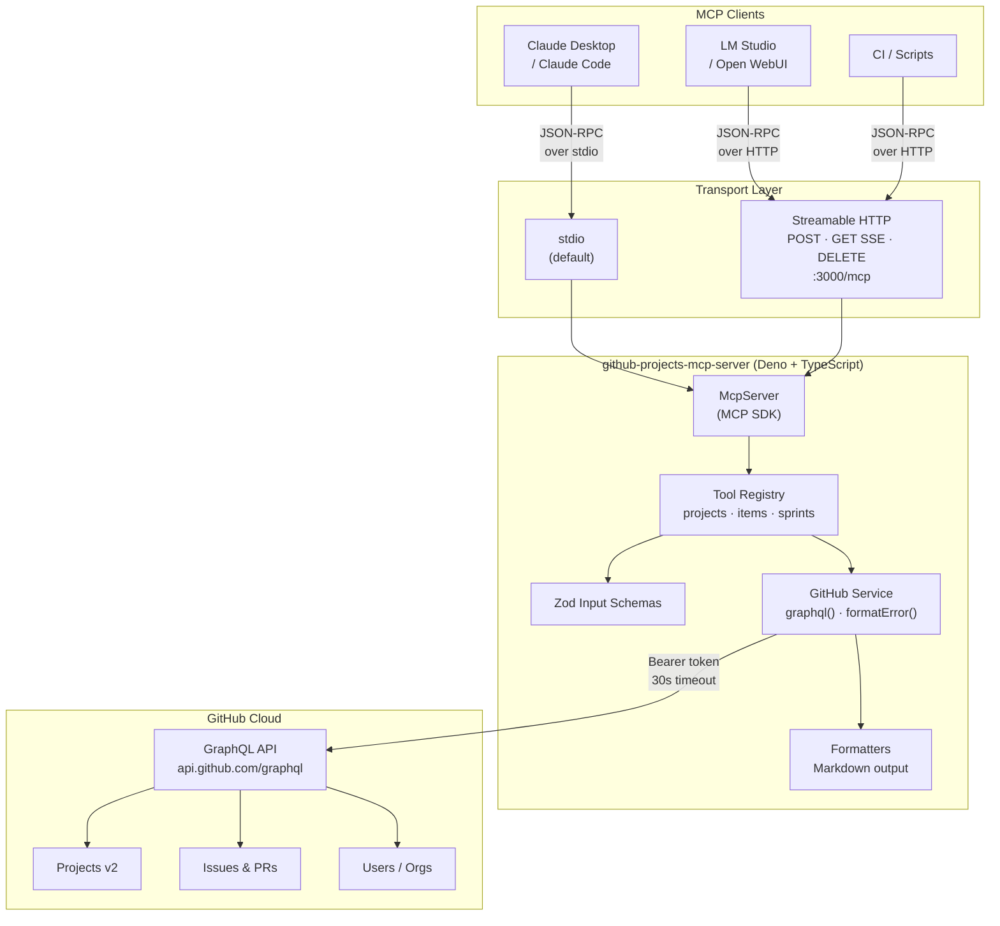
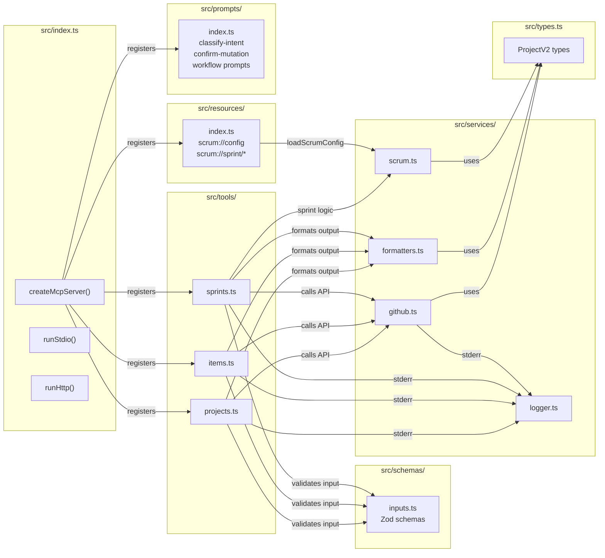
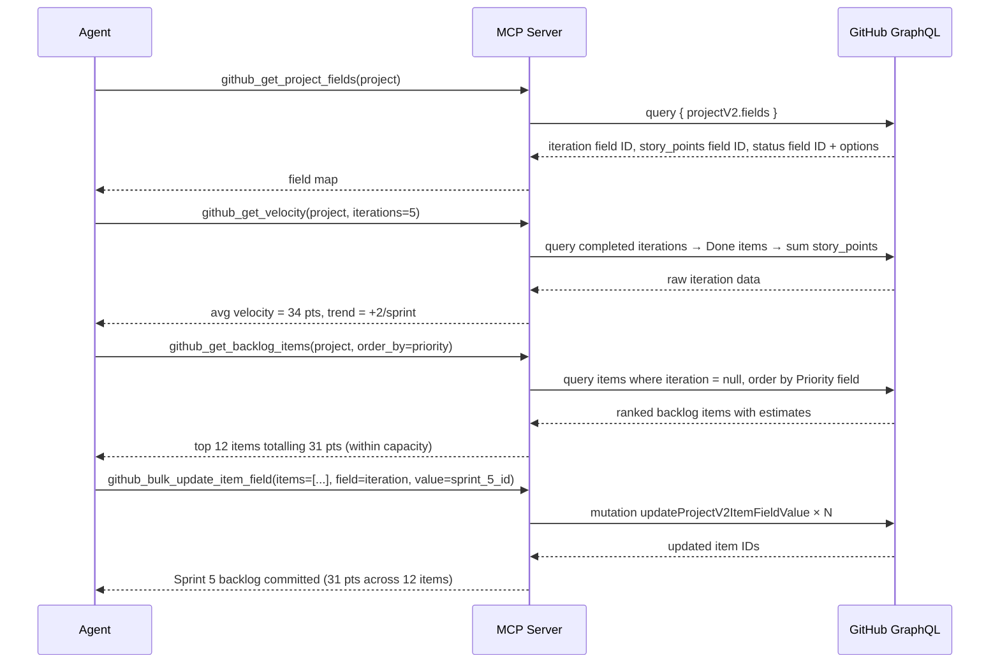
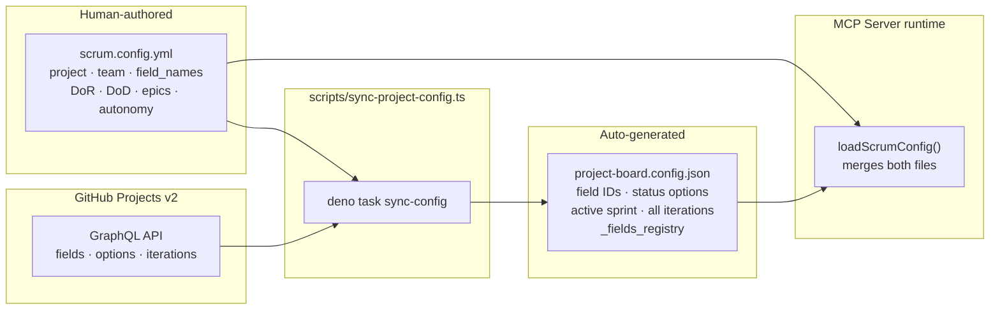
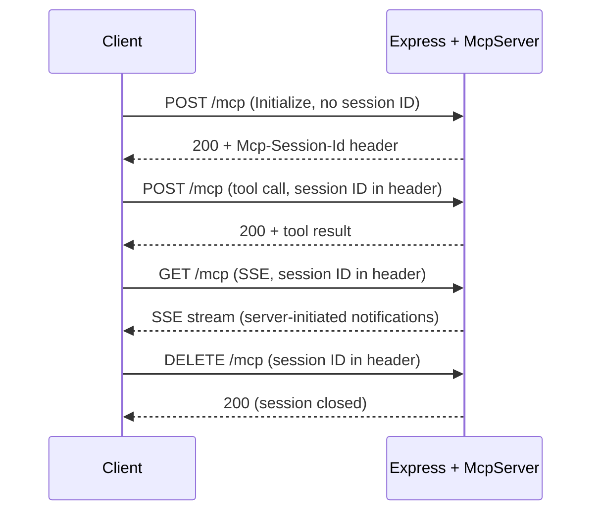

# GitHub Projects v2 MCP Server

A local [Model Context Protocol (MCP)](https://modelcontextprotocol.io/) server for operating on
**GitHub Projects v2** via the GitHub GraphQL API. Designed to serve as the action layer for LLM
agents performing autonomous SCRUM project management — sprint planning, backlog refinement,
velocity tracking, and ceremony facilitation — without leaving the GitHub Projects ecosystem.

Supports two transports: **stdio** (Claude Desktop / Claude Code / LM Studio) and **Streamable
HTTP** (Open WebUI / Docker / home lab).

## Related Documentation

- [GitHub Projects v2 — About Projects](https://docs.github.com/en/issues/planning-and-tracking-with-projects/learning-about-projects/about-projects)
- [GitHub Projects v2 — GraphQL API](https://docs.github.com/en/issues/planning-and-tracking-with-projects/automating-your-project/using-the-api-to-manage-projects)
- [Model Context Protocol Specification](https://modelcontextprotocol.io/docs)

## System Architecture

### High-Level: MCP Clients → Server → GitHub



### Internal Module Architecture



## Tool Reference

### Project Management (`src/tools/projects.ts`)

| Tool                        | Type  | Description                                                                                     |
| --------------------------- | ----- | ----------------------------------------------------------------------------------------------- |
| `github_list_projects`      | Read  | List all Projects v2 for a user or org, with pagination and closed-project filter               |
| `github_get_project`        | Read  | Full project details: node IDs, field definitions, option IDs, README                           |
| `github_get_project_fields` | Read  | All custom fields with IDs, types, options, and iteration configs; optional `field_type` filter |
| `github_update_project`     | Write | Patch title, description, README, visibility, or open/closed status                             |

### Item Management (`src/tools/items.ts`)

| Tool                          | Type  | Description                                                                                 |
| ----------------------------- | ----- | ------------------------------------------------------------------------------------------- |
| `github_list_project_items`   | Read  | Paginated item list; optional `filter_type`, `iteration_id`, and `status_option_id` filters |
| `github_add_item_to_project`  | Write | Add an existing Issue or PR to a project by node ID                                         |
| `github_add_draft_issue`      | Write | Create a draft issue; optional `iteration_id` assigns it to a sprint immediately            |
| `github_update_item_field`    | Write | Set or clear any field value: text, number, date, single-select, or iteration               |
| `github_archive_project_item` | Write | Archive or unarchive an item (reversible; item stays in project)                            |
| `github_delete_project_item`  | Write | Permanently remove an item from a project (irreversible)                                    |
| `github_get_issue_node_id`    | Read  | Resolve a human-readable issue/PR number to a GraphQL node ID                               |
| `github_get_user_node_id`     | Read  | Resolve a GitHub login to a GraphQL node ID                                                 |

### Sprint & SCRUM Layer (`src/tools/sprints.ts`)

These tools operate on project coordinates from `scrum.config.yml` — no `owner`/`project_number`
params needed. Requires `project-board.config.json` (`deno task sync-config` to generate).

| Tool                            | Type  | Description                                                                                                                        |
| ------------------------------- | ----- | ---------------------------------------------------------------------------------------------------------------------------------- |
| `github_get_sprint_status`      | Read  | Live sprint health: committed/completed points, per-item status grouped view, blocked items, carry-over risk                       |
| `github_get_velocity`           | Read  | Velocity series across last N completed iterations — points committed vs completed, rolling average, trend                         |
| `github_get_backlog_items`      | Read  | Items not assigned to any sprint, sorted by MoSCoW priority then estimated before unestimated; paginated                           |
| `github_bulk_update_item_field` | Write | Set the same field on up to 50 items; `project_id` optional (auto-resolves from scrum config) — primary sprint-planning write tool |
| `github_close_sprint`           | Write | Carry incomplete items to next sprint or backlog; optionally archive Done items. `dry_run: true` by default                        |
| `github_generate_sprint_report` | Read  | Full sprint review doc: goal assessment, velocity, item outcomes, carry-over, DoD checklist, retro scaffold                        |

---

## Resources & Prompts

### Resources (`src/resources/index.ts`)

MCP Resources provide stable, human-authored context the agent reads before acting. All sprint tools
that need project coordinates or field IDs should read `scrum://config` first.

| URI                          | MIME               | Description                                                                                                    |
| ---------------------------- | ------------------ | -------------------------------------------------------------------------------------------------------------- |
| `scrum://config`             | `application/json` | Merged `scrum.config.yml` + `project-board.config.json` — field IDs, status taxonomy, DoR, DoD, team, autonomy |
| `scrum://sprint/current`     | `text/markdown`    | Human-authored sprint goal, capacity plan, and out-of-band decisions (`config/sprint-current.md`)              |
| `scrum://sprint/archive/{n}` | `text/markdown`    | Historical sprint doc for sprint N (`config/sprint-archive-{n}.md`)                                            |

### Prompts (`src/prompts/index.ts`)

Prompts define workflow entry points with constrained write scopes and behavioral contracts. They
degrade gracefully when the MCP client doesn't surface them — tool descriptions carry the same
safety language as fallback.

| Prompt               | Write Scope                            | Purpose                                                                                                              |
| -------------------- | -------------------------------------- | -------------------------------------------------------------------------------------------------------------------- |
| `classify-intent`    | None                                   | Disambiguation gate for Slack/comment input — returns `direct_command \| contextual_reference \| incidental_mention` |
| `confirm-mutation`   | None                                   | Shows a structured preview and requires the literal string `"confirm"` before executing any write                    |
| `standup`            | None                                   | Read-only daily standup brief: sprint progress + blocked items + carry-over risk                                     |
| `backlog-refinement` | Story points, status, new draft issues | Estimate and prioritise the Product Backlog                                                                          |
| `sprint-planning`    | Sprint (iteration) field only          | Assign backlog items to a sprint iteration                                                                           |
| `sprint-close`       | Sprint field + archive                 | Close a sprint with dry-run preview and required confirmation                                                        |
| `sprint-management`  | All writes (autonomy-gated)            | Full sprint management with classify-intent on every informal message                                                |

---

## SCRUM Ceremony → Tool Mapping

```mermaid
flowchart TD
    subgraph Ceremonies["SCRUM Ceremonies"]
        SP["Sprint Planning"]
        DS["Daily Standup"]
        SR["Sprint Review"]
        RR["Retrospective"]
        REF["Backlog Refinement"]
    end

    subgraph ReadTools["Read / Aggregate Tools"]
        GBI["github_get_backlog_items"]
        GSS["github_get_sprint_status"]
        GV["github_get_velocity"]
        GPF["github_get_project_fields"]
        GLPI["github_list_project_items\n(+ iteration_id filter)"]
        GSR["github_generate_sprint_report"]
    end

    subgraph WriteTools["Write / Mutation Tools"]
        GBUF["github_bulk_update_item_field"]
        GUIF["github_update_item_field"]
        GADI["github_add_draft_issue\n(+ iteration_id)"]
        GCS["github_close_sprint"]
        GARC["github_archive_project_item"]
    end

    SP --> GBI
    SP --> GV
    SP --> GPF
    SP --> GBUF
    SP --> GADI

    DS --> GSS
    DS --> GLPI

    SR --> GSS
    SR --> GV
    SR --> GSR

    RR --> GSR
    RR --> GCS
    RR --> GARC

    REF --> GBI
    REF --> GUIF
    REF --> GADI
```



---

## Data Flow: Sprint Planning (Example Autonomous Workflow)



---

## GitHub API Constraints

These are hard limits imposed by the GitHub GraphQL API that shape what this server can and cannot
do autonomously:

| Constraint              | Detail                                                                                                                                                            |
| ----------------------- | ----------------------------------------------------------------------------------------------------------------------------------------------------------------- |
| **Iteration creation**  | Not supported via API. Sprints must be created manually in the GitHub Projects UI. The server can assign items to existing iterations but cannot create new ones. |
| **Backlog ordering**    | GitHub Projects v2 has no native API for reordering items. Priority ordering is approximated via a numeric `Priority` or `Rank` custom field.                     |
| **Fine-grained tokens** | Classic PAT required — fine-grained tokens do not yet support the Projects v2 GraphQL mutations.                                                                  |
| **Rate limits**         | GitHub GraphQL API: 5,000 points/hour. Bulk operations count once per mutation call, not per item.                                                                |
| **Field creation**      | Custom fields (story points, priority, etc.) must be created manually. The API supports reading and updating field values, not creating new field types.          |

---

## Configuration

The server uses a **two-file split** to cleanly separate what humans own from what GitHub owns.

### Source of truth

| File                        | Owner           | Contains                                                                    | Edit?                               |
| --------------------------- | --------------- | --------------------------------------------------------------------------- | ----------------------------------- |
| `scrum.config.yml`          | Human           | Project coordinates, team, field name map, DoR, DoD, epics, sprint settings | ✅ Yes — version-controlled         |
| `project-board.config.json` | GitHub (synced) | Field IDs, option lists, active sprint, iteration history                   | ❌ Never — generated by sync script |

### Sync workflow

```bash
# First-time setup — or after any change to GitHub Projects field names/options
GITHUB_TOKEN=ghp_xxx deno task sync-config

# Preview what would be written without writing it
GITHUB_TOKEN=ghp_xxx deno task sync-config:dry
```

The sync script (`scripts/sync-project-config.ts`):

1. Reads `scrum.config.yml` to get project coordinates and `field_names`
2. Queries the GitHub Projects v2 GraphQL API for live field metadata
3. Warns about any `field_names` entries that don't match a real board field (catches typos early)
4. Writes field IDs, option lists, iteration data, and `_fields_registry` to
   `project-board.config.json`
5. **Never touches** `scrum.config.yml` — your project spec is always preserved

### Config split diagram



### What each file controls

**`scrum.config.yml`** — the project specification. Edit this when you:

- Add or rename team members
- Update the Definition of Ready / Done
- Change the MoSCoW priority model or story point scale
- Add epics
- Change autonomy level or confirmation thresholds
- Rename a GitHub Projects field (then re-run `sync-config`)

**`project-board.config.json`** — live board state. Regenerate this when:

- You add or rename a field in GitHub Projects
- You add a new sprint (iteration) in the GitHub UI
- You change option names in a single-select field (Status, Priority, Type, Impediment)

---

## Prerequisites

- **Deno** ≥ 1.40 (runtime)
- **Node.js** ≥ 20 (for MCP SDK compatibility)
- A **GitHub Personal Access Token (classic)** — fine-grained tokens do not support Projects v2
  write operations

### Token Scopes

| Operation                                                | Required Scope          |
| -------------------------------------------------------- | ----------------------- |
| Read projects                                            | `read:project`          |
| Write projects (add/update/delete items, update project) | `project`               |
| Read issues/PRs (to add them by node ID)                 | `repo` or `public_repo` |

Generate at: **GitHub → Settings → Developer Settings → Personal access tokens (classic)**

---

## Quickstart

```bash
# Clone and install dependencies
deno install

# Run on stdio (for Claude Desktop / Claude Code / LM Studio)
GITHUB_TOKEN=ghp_yourtoken deno task start
```

### Claude Desktop / Claude Code (`~/.claude/config.json`)

```json
{
  "mcpServers": {
    "github-projects": {
      "command": "deno",
      "args": ["task", "start"],
      "cwd": "/path/to/github-projects-mcp-server",
      "env": { "GITHUB_TOKEN": "ghp_yourtoken" }
    }
  }
}
```

### LM Studio

In **LM Studio → Settings → MCP Servers**, add:

```json
{
  "name": "github-projects",
  "transport": "stdio",
  "command": "deno",
  "args": ["task", "start", "--cwd", "/path/to/github-projects-mcp-server"],
  "env": { "GITHUB_TOKEN": "ghp_yourtoken" }
}
```

---

## HTTP Mode (Home Lab / Docker)

```bash
# .env
GITHUB_TOKEN=ghp_yourtoken
MCP_TRANSPORT=http
PORT=3000
```

```bash
docker compose build
docker compose up
```

The server listens on `http://0.0.0.0:3000/mcp`. Expose through a reverse proxy (Nginx, Caddy,
Traefik) with authentication.

### HTTP Session Lifecycle



### Open WebUI

In the Open WebUI environment, set:

```
MCP_SERVER_URL=http://github-projects-mcp:3000/mcp
```

Or via the UI: **Admin Panel → Settings → Tools → MCP Servers**.

---

## Development

```bash
deno task dev              # watch mode with TypeScript recompilation
deno task inspector        # MCP Inspector UI for interactive tool testing
deno task sync-config      # sync GitHub board fields → project-board.config.json
deno task sync-config:dry  # preview sync output without writing
```

### Debugging

Set `DEBUG=1` to enable debug-level logging on stderr:

```bash
DEBUG=1 GITHUB_TOKEN=ghp_yourtoken deno task start
```

Debug output includes incoming tool calls with parsed parameters, outgoing GraphQL queries and
variables, raw API responses, and JSON-RPC wire traffic. All server output goes to stderr so it does
not interfere with the stdio JSON-RPC channel.

---

## Project Structure

```
github-projects-mcp-server/
├── config/
│   ├── scrum.config.yml           # Human-defined project spec — edit this
│   ├── project-board.config.json  # Auto-generated board state — do not edit
│   └── sprint-current.md          # Active sprint document (Scrum Master updates)
├── scripts/
│   └── sync-project-config.ts    # Syncs GitHub field metadata → project-board.config.json
├── deno.json                      # Tasks, imports, compiler options
└── src/
    ├── index.ts                   # Entry point — transport, server factory, all registrations
    ├── types.ts                   # TypeScript interfaces for GitHub GraphQL responses + SCRUM
    ├── tools/
    │   ├── projects.ts            # Project-level tools (list, get, update, fields)
    │   ├── items.ts               # Item-level tools (CRUD, field updates, node ID lookups)
    │   └── sprints.ts             # SCRUM sprint tools (status, velocity, backlog, close, report)
    ├── resources/
    │   └── index.ts               # MCP Resources: scrum://config, scrum://sprint/*
    ├── prompts/
    │   └── index.ts               # MCP Prompts: classify-intent, confirm-mutation, workflows
    ├── schemas/
    │   └── inputs.ts              # Zod validation schemas for all tool inputs
    └── services/
        ├── github.ts              # graphql<T>() executor, GitHubApiError, formatError()
        ├── logger.ts              # Structured stderr logger; set DEBUG=1 for debug-level output
        ├── formatters.ts          # GraphQL fragments + Markdown output formatters
        └── scrum.ts               # loadScrumConfig(), resolveFields(), fetchAllItems(), helpers
```

---

## Environment Variables

| Variable        | Default | Description                                                                               |
| --------------- | ------- | ----------------------------------------------------------------------------------------- |
| `GITHUB_TOKEN`  | —       | **Required.** GitHub classic PAT                                                          |
| `MCP_TRANSPORT` | `stdio` | `stdio` or `http`                                                                         |
| `PORT`          | `3000`  | HTTP listen port (http mode only)                                                         |
| `DEBUG`         | unset   | Set to `1` to enable debug-level logging (tool calls, GraphQL ops, JSON-RPC wire traffic) |

## Todo

- [ ] Implement GitHub repository API tools
- [ ] Refactor the config type system to be dynamic (derived from the fetched JSON file rather than
      manually coded)
- [ ] Refactor the codebase to be shorter and "human-readable"
- [ ] Add `github_update_draft_issue` to `src/tools/items.ts`; signature:
      `(draft_issue_id, title?, body?, assignee_ids?)`.
  - [ ] The tool must accept the draft issue's _content node ID_ (returned by
        `github_add_draft_issue`), not the project item ID.
  - [ ] Prevents models from hallucinating tool names when they need to edit a draft issue title or
        body.
- [ ] Fix Transport Label Logging (`http:undefined`)
  - [ ] Update `wrapTransportLogging` in `src/index.ts` to use a lazy `getLabel()` closure that
        reads `transport.sessionId` at log-call time instead of capturing it at wrap time (it is
        `undefined` during initialization).
- [x] **Flatten `FieldValueUnion` schema** — replaced `z.discriminatedUnion` (6-variant `anyOf` with
      `additionalProperties: false` per variant) with a single flat `z.object`. All companion keys
      (`value`, `number_value`, `option_id`, `iteration_id`) are now optional fields on one object;
      `type` remains an enum discriminator. Eliminates the primary cause of write-tool failures for
      local LLMs.
- [x] **Centralize field value validation** — added `resolveFieldValue()` helper in
      `src/schemas/inputs.ts`; shared by `items.ts` and `sprints.ts`, returns human-readable error
      strings the model can act on.
- [x] **Remove `"REDACTED"` placeholder** — cleaned `filter_type` enum in `ListItemsSchema`; was
      causing a type mismatch against `ItemContentType` and leaking as a valid API value.
- [x] **Structured logger** — added `src/services/logger.ts`; all output to stderr; `DEBUG=1`
      enables debug-level output without polluting the stdio JSON-RPC channel.
