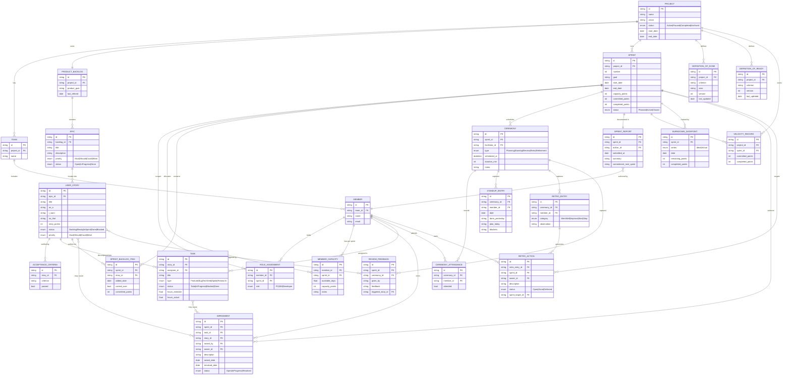

# GitHub Projects v2 MCP Server

A local [Model Context Protocol (MCP)](https://modelcontextprotocol.io/) server for operating on **GitHub Projects v2** via the GitHub GraphQL and REST APIs. Designed to serve as the action layer for LLM agents performing autonomous Scrum project management — sprint planning, backlog refinement, history analysis, and ceremony facilitation — without leaving the GitHub Projects ecosystem.

The tool surface is **backend-agnostic**: tool names, arguments, and return shapes are defined in Scrum vocabulary. Adding a Trello, Notion, or Linear backend requires replacing only the implementations behind the tools; the agent skill and human workflows remain unchanged.

Supports two transports: **stdio** (Claude Desktop / Claude Code / LM Studio) and **Streamable HTTP** (Open WebUI / Docker / homelab).

## Related Documentation

- [GitHub Projects v2 — About Projects](https://docs.github.com/en/issues/planning-and-tracking-with-projects/learning-about-projects/about-projects)
- [GitHub Projects v2 — GraphQL API](https://docs.github.com/en/issues/planning-and-tracking-with-projects/automating-your-project/using-the-api-to-manage-projects)
- [Model Context Protocol Specification](https://modelcontextprotocol.io/docs)
- [The Scrum Guide](https://www.scrum.org/learning-series/what-is-scrum/)

## What is Scrum?

> If you are just getting started, think of Scrum as a way to get work done as a team in small pieces at a time, with continuous experimentation and feedback loops along the way to learn and improve as you go. Scrum helps people and teams deliver value incrementally in a collaborative way. As an agile framework, Scrum provides just enough structure for people and teams to integrate into how they work, while adding the right practices to optimize for their specific needs.
>
> [From Scrum.org](https://www.scrum.org/learning-series/what-is-scrum/)

A fully mapped Scrum project composition will look something like the following:

```mermaid
erDiagram
%% ── CORE PROJECT STRUCTURE ──────────────────────────────────────────────

PROJECT {
 string id PK
 string name
 string vision
 enum status "Active|Paused|Completed|Archived"
 date start_date
 date end_date
}

TEAM {
 string id PK
 string project_id FK
 string name
}

MEMBER {
 string id PK
 string team_id FK
 string name
 string email
}

MEMBER_CAPACITY {
 string id PK
 string member_id FK
 string sprint_id FK
 float available_days
 int capacity_points
 string notes
}

ROLE_ASSIGNMENT {
 string id PK
 string member_id FK
 string sprint_id FK
 enum role "PO|SM|Developer"
}

%% ── BACKLOG HIERARCHY ───────────────────────────────────────────────────

PRODUCT_BACKLOG {
 string id PK
 string project_id FK
 string product_goal
 date last_refined
}

EPIC {
 string id PK
 string backlog_id FK
 string title
 string description
 enum priority "Must|Should|Could|Wont"
 enum status "Open|InProgress|Done"
}

USER_STORY {
 string id PK
 string epic_id FK
 string title
 string as_a
 string i_want
 string so_that
 int story_points
 enum status "Backlog|Ready|InSprint|Done|Blocked"
 enum priority "Must|Should|Could|Wont"
}

SPRINT_BACKLOG_ITEM {
 string id PK
 string sprint_id FK
 string story_id FK
 date added_date
 bool carried_over
 int committed_points
}

ACCEPTANCE_CRITERIA {
 string id PK
 string story_id FK
 string criterion
 bool passed
}

TASK {
 string id PK
 string story_id FK
 string assignee_id FK
 string title
 enum type "Feature|Bug|TechDebt|Spike|Research"
 enum status "Todo|InProgress|Blocked|Done"
 float hours_estimate
 float hours_actual
}

IMPEDIMENT {
 string id PK
 string sprint_id FK
 string task_id FK
 string story_id FK
 string raised_by FK
 string owner_id FK
 string description
 date raised_date
 date resolved_date
 enum status "Open|InProgress|Resolved"
}

%% ── SPRINT ──────────────────────────────────────────────────────────────

SPRINT {
 string id PK
 string project_id FK
 int number
 string goal
 date start_date
 date end_date
 int capacity_points
 int committed_points
 int completed_points
 enum status "Planned|Active|Closed"
}

%% ── CEREMONIES ──────────────────────────────────────────────────────────

CEREMONY {
 string id PK
 string sprint_id FK
 string facilitator_id FK
 enum type "Planning|Standup|Review|Retro|Refinement"
 datetime scheduled_at
 int duration_min
 string notes
}

CEREMONY_ATTENDANCE {
 string id PK
 string ceremony_id FK
 string member_id FK
 bool attended
}

STANDUP_ENTRY {
 string id PK
 string ceremony_id FK
 string member_id FK
 date date
 string done_yesterday
 string plan_today
 string blockers
}

RETRO_ENTRY {
 string id PK
 string ceremony_id FK
 string member_id FK
 enum category "WentWell|Improve|Start|Stop"
 string observation
}

RETRO_ACTION {
 string id PK
 string retro_entry_id FK
 string sprint_id FK
 string owner_id FK
 string description
 enum status "Open|Done|Deferred"
 string sprint_target_id FK
}

REVIEW_FEEDBACK {
 string id PK
 string sprint_id FK
 string ceremony_id FK
 string given_by
 string feedback
 string triggered_story_id FK
}

%% ── TRACKING ────────────────────────────────────────────────────────────

BURNDOWN_DATAPOINT {
 string id PK
 string sprint_id FK
 enum series "Ideal|Actual"
 date date
 int remaining_points
 int completed_points
}

VELOCITY_RECORD {
 string id PK
 string project_id FK
 string sprint_id FK
 int committed_points
 int completed_points
}

%% ── QUALITY ─────────────────────────────────────────────────────────────

DEFINITION_OF_DONE {
 string id PK
 string project_id FK
 string criterion
 string area
 int version
 date last_updated
}

DEFINITION_OF_READY {
 string id PK
 string project_id FK
 string criterion
 int version
 date last_updated
}

SPRINT_REPORT {
 string id PK
 string sprint_id FK
 string author_id FK
 date submitted_at
 string summary
 string commitment_next_sprint
}

%% ── RELATIONSHIPS ───────────────────────────────────────────────────────

PROJECT ||--o{ TEAM : "has"
PROJECT ||--|| PRODUCT_BACKLOG : "owns"
PROJECT ||--o{ SPRINT : "runs"
PROJECT ||--o{ DEFINITION_OF_DONE : "defines"
PROJECT ||--o{ DEFINITION_OF_READY : "defines"
PROJECT ||--o{ VELOCITY_RECORD : "tracks"

TEAM ||--o{ MEMBER : "includes"
MEMBER ||--o{ ROLE_ASSIGNMENT : "holds"
MEMBER ||--o{ MEMBER_CAPACITY : "has per sprint"
SPRINT ||--o{ ROLE_ASSIGNMENT : "scopes"
SPRINT ||--o{ MEMBER_CAPACITY : "allocates"

PRODUCT_BACKLOG ||--o{ EPIC : "contains"
EPIC ||--o{ USER_STORY : "breaks into"

USER_STORY ||--o{ ACCEPTANCE_CRITERIA : "verified by"
USER_STORY ||--o{ TASK : "decomposed into"
USER_STORY ||--o{ SPRINT_BACKLOG_ITEM : "pulled into"

SPRINT ||--o{ SPRINT_BACKLOG_ITEM : "contains"
SPRINT ||--o{ CEREMONY : "schedules"
SPRINT ||--|| SPRINT_REPORT : "documented in"
SPRINT ||--o{ VELOCITY_RECORD : "recorded in"
SPRINT ||--o{ BURNDOWN_DATAPOINT : "tracked by"
SPRINT ||--o{ IMPEDIMENT : "surfaces"

TASK }o--o{ IMPEDIMENT : "may cause"
USER_STORY }o--o{ IMPEDIMENT : "may cause"
MEMBER ||--o{ IMPEDIMENT : "owns"
MEMBER ||--o{ TASK : "assigned to"

CEREMONY ||--o{ CEREMONY_ATTENDANCE : "records"
CEREMONY ||--o{ STANDUP_ENTRY : "captures"
CEREMONY ||--o{ RETRO_ENTRY : "captures"
CEREMONY ||--o{ REVIEW_FEEDBACK : "captures"
MEMBER ||--o{ CEREMONY_ATTENDANCE : "attends"

RETRO_ENTRY ||--o{ RETRO_ACTION : "generates"
MEMBER ||--o{ RETRO_ACTION : "owns"
SPRINT ||--o{ RETRO_ACTION : "targets"

USER_STORY }o--o{ REVIEW_FEEDBACK : "triggered by"

SPRINT_REPORT }o--|| MEMBER : "authored by"
```

This project provides the tools for an LLM to act as a Scrum Master assistant within the GitHub ecosystem, removing the need for complex dedicated PM tooling.

It is designed to be used with the `skill/scrum-master-assistant/` agentic skill as the orchestration layer.

To test the functionality of the tools, [this project is managed using itself](https://github.com/users/hoonsubin/projects/5) as the tool.

---

## Tool Surface

This section defines the public MCP interface — the tools an LLM agent can call. It is the stable contract of the project: backend implementations, data types, and storage details may change underneath, but every tool listed here retains the same name, semantic arguments, and return meaning.

### Design principles

The surface is governed by six rules. Any change that violates one is a breaking change.

1. **Scrum vocabulary only.** No tool name, argument, or return field references the underlying platform (no `github_*`, no `issue_id`, no `node_id`). The agent speaks Scrum; the backend translates.
2. **Backend-agnostic shapes.** Inputs and outputs are described in domain terms (`Story`, `Sprint`, `SprintRef`, `ScrumField`). Adding a Notion, Trello, or Linear backend must require zero changes to this section. If a tool description cannot be implemented without a GitHub-specific concept, the tool does not belong in this surface.
3. **Stateless server, per-call resolution.** No tool depends on context cached between calls. Each tool resolves any names → backend IDs at the moment of invocation. The agent may call any tool in any order without a setup step.
4. **Atomic at the tool boundary, not below.** A single tool call performs one logically complete Scrum operation. The agent may need multiple calls for a workflow (e.g., create a story, then assign it to a sprint), but each call either succeeds end-to-end or fails cleanly.
5. **The MCP is amoral.** It does not enforce Definition of Ready, Definition of Done, sprint-injection policy, or any other Scrum judgement. Those live in the agent skill. If the agent asks the MCP to assign an unrefined item to a sprint, the MCP complies. The skill is responsible for not asking.
6. **Artifact reads, not insight derivation.** Read tools expose the state of Scrum artifacts. They do not pre-compute reports, metrics, or recommendations. Velocity, burndown, throughput, predictability, and all other derived insights are **agent capabilities** — the agent reasons over raw artifact data to produce them. The server returns observable facts; the agent interprets them.

### Tool surface layers

The eleven tools in this surface occupy three distinct conceptual layers. Understanding the layers is the fastest way to see why a proposed new tool does or does not belong here.

**Layer 1 — Artifact readers.** These tools return the current state of a Scrum primitive: the Product Backlog, the Sprint Backlog, a single Story, or the platform's current state and declared vocabulary. They make no assumptions about what the agent will do with the data.

**Layer 2 — Artifact mutators.** These tools change the state of Scrum artifacts: creating stories, moving them between sprints, updating fields, logging impediments. Each mutation is one complete Scrum operation. `scrum_add_vocabulary` is a lightweight exception — it mutates the platform schema (adding a field option or label) rather than a story, but belongs here because the agent calls it autonomously in response to a detected vocabulary gap, without human involvement.

**Layer 3 — Sprint history.** `scrum_get_history` is the one read tool that spans time rather than returning a single snapshot. It exposes raw completed-sprint data so the agent can derive any time-based insight it needs — velocity trends, throughput, predictability index, sprint goal achievement rate — without the server deciding which metric matters.

Ceremony records (standup logs, retro entries, review feedback) are **not** a layer of this surface. They are documents the agent produces and stores in the team's chosen ceremony backend — a file, a wiki page, a discussion thread — outside the MCP's scope. Attaching ceremony records to individual stories as comments is an anti-pattern: it pollutes the story audit trail and breaks when the backend changes.

### Common types

These appear in arguments and return values across multiple tools.

| Type         | Meaning                                                                                                                                                                                                                           |
| ------------ | --------------------------------------------------------------------------------------------------------------------------------------------------------------------------------------------------------------------------------- |
| `StoryRef`   | A reference to a single Story. Accepted forms: `{ "number": 42 }` (user-facing reference, e.g. issue number, card ID) or `{ "id": "<opaque>" }` (the backend-native handle returned by previous calls). Tools accept either form. |
| `SprintRef`  | A reference to a sprint. Accepted forms: `"current"`, `"next"`, `null` (= no sprint, i.e. the backlog), or an explicit sprint name (e.g. `"Sprint 12"`).                                                                          |
| `ScrumField` | One of `status`, `sprint`, `story_points`, `priority`, `assignee`. The set is fixed; new field types are out of scope for v1.                                                                                                     |
| `StoryType`  | One of `feature`, `bug`, `tech_debt`, `spike`. Drives the type label or category the backend applies.                                                                                                                             |
| `Story`      | The canonical entity. See full shape below.                                                                                                                                                                                       |

#### Story shape

Every read tool that returns Stories returns objects of this shape:

| Field                      | Meaning                                                                                                                                      |
| -------------------------- | -------------------------------------------------------------------------------------------------------------------------------------------- |
| `ref`                      | A `StoryRef` containing both `number` and `id` so the agent can use either in subsequent calls.                                              |
| `title`                    | The story title.                                                                                                                             |
| `body`                     | The story body, rendered as markdown. Includes user-story format, AC checklist, dependencies, and technical notes — whatever the team wrote. |
| `type`                     | `StoryType` resolved from the type label or category.                                                                                        |
| `status`                   | The current status in the team's vocabulary (e.g. `"In Progress"`).                                                                          |
| `sprint`                   | The current sprint name, or `null` if the story is in the backlog.                                                                           |
| `story_points`             | Numeric estimate, or `null` if unestimated.                                                                                                  |
| `priority`                 | The team's priority value (e.g. `"Must"`), or `null`.                                                                                        |
| `assignees`                | Array of team member identifiers (login or display name as configured).                                                                      |
| `labels`                   | Array of label strings, excluding the `type:*` label which is reflected in `type`.                                                           |
| `epic`                     | Parent epic name, or `null`. Readable and writable.                                                                                          |
| `created_at`, `updated_at` | ISO-8601 timestamps.                                                                                                                         |
| `url`                      | Canonical URL to view the story in the backend UI, when available.                                                                           |

---

### Read tools

Read tools are the agent's eyes. They are cheap, idempotent, and safe to call as often as needed.

#### `scrum_orient`

Returns the current platform state alongside the team's declared Scrum vocabulary, giving the agent everything it needs to assess whether the project is Scrum-ready and to ground subsequent calls in real names and options.

**Arguments:** none.

**Returns:** two top-level sections:

- `platform_state` — what currently exists on the PM platform: which Scrum fields are present and their configured options, which repo labels exist, and the active/next/completed-count breakdown for sprint iterations.
- `declared_vocabulary` — what the team's `config.yml` says the project should have: status vocabulary, priority vocabulary, story-point scale, sprint settings, team roster, Definition of Ready, and Definition of Done.

**Notes:** The agent uses its own Scrum knowledge as the reference standard and computes the gap between `platform_state` and `declared_vocabulary`. Structural gaps — a required field does not exist at all — require the human to create them in the platform UI. Vocabulary gaps — a field option or label is declared but missing — can be resolved autonomously by the agent via `scrum_add_vocabulary`. All write tools that accept vocabulary values (e.g. `scrum_set_field` with `status`) accept values from `declared_vocabulary`.

**Does not:** return live sprint story data (use `scrum_get_sprint`), historical sprint data (use `scrum_get_history`), or platform identifiers.

---

#### `scrum_get_sprint`

Returns the Sprint Backlog as a snapshot: the sprint metadata, its goal, its capacity, and every Story currently assigned to it grouped by status with points summed per group.

**Arguments:**

- `sprint` (optional, `SprintRef`): defaults to `"current"`. Pass `"next"` to inspect the upcoming sprint, or an explicit sprint name to inspect a past sprint.

**Returns:** an object with `sprint` (`{ name, goal, start_date, end_date, days_remaining, capacity_points }`), `groups` (array of `{ status, stories: Story[], points_sum }` in the order defined by `status_vocabulary`), `totals` (`{ committed_points, completed_points, in_flight_points, blocked_points }`).

**Notes:** This is the agent's primary orient call for any in-sprint ceremony. The grouped structure means the agent doesn't have to bucket Stories itself — a compact model especially benefits from receiving pre-grouped data. The tool reads the Sprint Backlog artifact; it does not compute trends or projections (use `scrum_get_history` for those).

**Does not:** include backlog items; surface burndown timeseries; resolve dependencies between stories.

---

#### `scrum_get_backlog`

Returns the Product Backlog: all Stories not assigned to any sprint, ordered by priority. Supports filtering so the agent can answer "is this a duplicate of something already tracked?"

**Arguments:**

- `search` (optional, string): free-text match against title and body.
- `labels` (optional, array of strings): include only Stories carrying all of these labels.
- `priority` (optional, string): include only Stories at this priority value.
- `epic` (optional, string): include only Stories under this epic.
- `limit` (optional, integer, default 50): cap on items returned.

**Returns:** an object with `stories` (array of `Story`), `total_count` (number matching the filter regardless of `limit`), and `readiness` (object summarising how many items are sprint-ready, in refinement, or future candidates — based on whether they have `story_points`, acceptance criteria in the body, and a priority).

**Notes:** The readiness summary is a pure aggregation of observable facts, not a Scrum judgement. It reports what is present; it does not enforce DoR.

**Does not:** modify ordering; create or estimate items; mark items as ready.

---

#### `scrum_get_story`

Returns the full detail of one Story, including comments, linked PRs, and parsed acceptance criteria.

**Arguments:**

- `ref` (required, `StoryRef`).

**Returns:** a `Story` object plus `comments` (array of `{ author, body, created_at, url }`), `linked_prs` (array of PR references with state), `sub_tasks` (array of `{ title, status }` if the backend exposes sub-tasks), `acceptance_criteria` (array of `{ text, checked }` parsed from the body).

**Notes:** Use when the agent needs deep context on a single item — assessing DoR compliance, drafting a status update, or diagnosing a blocked item. Comments include impediment cross-links posted by `scrum_log_impediment`, making this the primary tool for tracing blockers.

**Does not:** return diff content of linked PRs, render image attachments, or follow links to other stories transitively.

---

#### `scrum_get_history`

Returns raw data for the last N completed sprints so the agent can derive any time-based insight it needs.

**Arguments:**

- `window` (optional, integer 1–10, default 5): number of most-recent closed sprints to include.

**Returns:** an array of sprint objects, most-recent-first. Each sprint contains:

- `name`, `start_date`, `end_date`, `duration_days`, `goal` (or `null` if not stored by the backend)
- `stories`: lightweight array of `{ ref, title, type, story_points, final_status, labels }` for every story that was in the sprint at close
- `summary`: server-computed aggregation `{ committed_points, completed_points, story_count, completed_count }` for agent convenience

**Notes:** This tool exposes facts. The agent derives insights from them: velocity (average `completed_points` over the window), throughput (average `completed_count`), predictability (fraction of sprints where goal was achieved), type breakdown, epic-level trends, and anything else the conversation demands. The MCP does not pre-select which metric matters — that is the agent's job. A backend only needs to support queryable completed-sprint item state to implement this tool.

**Does not:** compute averages, project future velocity, surface per-member throughput, or return current-sprint data (use `scrum_get_sprint` for that).

---

### Write tools

Write tools mutate state. The agent should call them only after confirming intent with the human per the skill's autonomy rules.

#### `scrum_create_story`

Creates a new Story and optionally places it on the board in a single call.

**Arguments:**

- `title` (required, string).
- `body` (required, string, markdown): the full story body. The agent assembles the user-story format, AC checklist, dependencies, and technical notes before calling.
- `type` (required, `StoryType`): drives the type label.
- `priority` (optional, string): a value from `priority_vocabulary`.
- `story_points` (optional, number): a value from `story_point_values`.
- `labels` (optional, array of strings): additional non-type labels.
- `epic` (optional, string): parent epic name.
- `assignees` (optional, array of strings): team member logins.
- `sprint` (optional, `SprintRef`): if provided, the story is created and immediately assigned. If omitted, it enters the backlog.

**Returns:** the newly created `Story`.

**Notes:** Single-call atomicity is the point of this tool. The agent does not need to follow a create with `scrum_set_field` for points and priority; it bundles them here.

**Does not:** validate DoR, check sprint capacity, notify anyone, or create sub-tasks.

---

#### `scrum_update_story`

Edits the content of an existing Story — title, body, labels, assignees, epic. Does not touch board fields (status, sprint, story points, priority); use `scrum_set_field` for those.

**Arguments:**

- `ref` (required, `StoryRef`).
- `title` (optional, string).
- `body` (optional, string, markdown): replaces the full body. The agent reads the current body via `scrum_get_story` first if it intends to append rather than replace.
- `labels` (optional, array of strings): replaces the label set, excluding `type:*` labels managed by their own writes.
- `assignees` (optional, array of strings): replaces the assignee set.
- `epic` (optional, string or `null`): set to `null` to detach from epic.

**Returns:** the updated `Story`.

**Does not:** modify board state, change story type, archive or close the story.

---

#### `scrum_set_field`

The single entry point for board-field mutations. No backend IDs required.

**Arguments:**

- `ref` (required, `StoryRef`).
- `field` (required, `ScrumField`): one of `status`, `sprint`, `story_points`, `priority`, `assignee`.
- `value` (required): semantic value matching the field:
  - `status`: a string from `status_vocabulary`.
  - `sprint`: a `SprintRef` (`"current"`, `"next"`, `null` to remove from sprint, or explicit name).
  - `story_points`: a number from `story_point_values`, or `null` to clear.
  - `priority`: a string from `priority_vocabulary`, or `null` to clear.
  - `assignee`: a team member login, or `null` to unassign. To assign multiple members, use `scrum_update_story` with `assignees`.

**Returns:** the updated `Story`.

**Notes:** Setting `sprint` to `null` removes a story from its current sprint (the "bump to backlog" operation). There is no separate removal tool.

**Does not:** validate that value transitions make Scrum sense. The skill enforces Scrum rules; this tool executes decisions.

---

#### `scrum_plan_sprint`

Bulk-assigns multiple Stories to a sprint in one call. Used at sprint planning to commit the agreed scope after the team has discussed each item.

**Arguments:**

- `sprint` (required, `SprintRef`): typically `"next"` or an explicit name. `"current"` is allowed but signals a mid-sprint scope change.
- `stories` (required, array of `StoryRef`): the items to commit.
- `replace` (optional, boolean, default `false`): if `true`, clears existing sprint assignments first; if `false`, adds to what is already there.

**Returns:** `{ assigned: StoryRef[], skipped: [{ ref, reason }] }`.

**Notes:** Convenience over `scrum_set_field` in a loop, but with a clear partial-success contract: `skipped` tells the agent exactly which refs failed and why without aborting the rest.

**Does not:** check capacity, enforce DoR, or set the Sprint Goal.

---

#### `scrum_log_impediment`

Creates a new impediment Story, links it bidirectionally to the affected Story, and marks it Blocked.

**Arguments:**

- `description` (required, string, markdown): the impediment body.
- `affects` (required, `StoryRef`): the Story being blocked.
- `raised_by` (optional, string): login of the person who surfaced it; defaults to the configured Scrum Master.
- `priority` (optional, string): a value from `priority_vocabulary`; defaults to the highest tier.

**Returns:** the impediment as a `Story`, plus `linked_to` containing the affected story's `StoryRef`.

**Notes:** Impediments are first-class Stories so they appear on the sprint board and in history data. The bidirectional link is created as a cross-reference on both the impediment and the affected story. The agent discovers these links through `scrum_get_story` — the `comments` field surfaces the cross-reference notes, and `linked_prs` surfaces any associated PR.

**Does not:** notify the impediment owner, escalate after N days (the agent's standup ceremony does this), or close the affected story.

---

#### `scrum_add_vocabulary`

Idempotent addition of a vocabulary entry to the platform schema. Called by the agent when `scrum_orient` reveals a declared vocabulary value that is missing from the live platform.

**Arguments:**

- `kind` (required, enum): one of `status_option`, `priority_option`, or `label`.
  - `status_option` — adds a missing option to the project's Status single-select field.
  - `priority_option` — adds a missing option to the project's Priority single-select field.
  - `label` — creates a missing repository label (used for story typing: `feature`, `bug`, `tech_debt`, `spike`, `impediment`).
- `value` (required, string): the display name to add (e.g. `"Blocked"`, `"Critical"`, `"tech_debt"`).

**Returns:** `{ created: boolean, kind, value, message }`. If the option or label already exists, `created` is `false` and no change is made.

**Notes:** This tool handles vocabulary gaps — entries declared in `config.yml` that are not yet present in the platform. It cannot create new project fields (a structural gap requiring human action via the platform UI). If the target field does not exist, the tool returns a structured error that describes exactly what the human needs to create.

**Does not:** rename or delete existing options, reorder options, change field types, create sprint iterations, or provision project fields.

---

### What this surface deliberately does NOT include

The full Scrum domain (see the ER diagram above) is much richer than these eleven tools. The omissions are intentional.

**Ceremony record writes** (`scrum_post_note` and equivalents). Standup logs, retro entries, and review feedback are ceremony artefacts, not story mutations. They do not belong attached to individual stories as comments — that pollutes the story audit trail and is meaningless on backends that do not treat story comments as a structured record store. The agent drafts ceremony documents and stores them in the team's chosen ceremony backend (a file, a wiki, a discussion thread) directly, outside the MCP's scope.

**Sprint creation and closure.** Creating new sprint iterations and formally closing completed ones are administrative one-shots performed by the human in the platform UI. The boundary is intentional: the decision to start or end a sprint involves a ceremony (planning meeting, sprint review) that the human and agent conduct together — the MCP records the outcomes, it does not drive the ceremony clock. Structural field provisioning (creating a brand-new project field from scratch) also requires human action; `scrum_add_vocabulary` handles only incremental vocabulary extension on fields that already exist.

**Derived insight tools** (burndown timeseries, velocity averages, throughput, predictability). The agent derives all time-based insights from `scrum_get_history` data. The MCP does not pre-select which metrics matter or bake in a definition of "done" for computational purposes. A burndown chart is the agent reasoning about snapshots; the server's job is to provide reliable snapshots.

**Acceptance criteria as a separate entity.** AC lives inside the Story body as a markdown checklist. `scrum_get_story` parses it for convenience; writes go through `scrum_update_story` against the body.

**Tasks as separate entities.** V1 flattens Stories — each PBI is one Story. Sub-task hierarchy is deferred to v2.

**Definition of Done / Definition of Ready writes.** DoD and DoR are read via `scrum_get_config`. Edits happen against the team's config file by hand.

**Member capacity writes.** Per-sprint capacity lives in the team's sprint document and is read into agent context via the skill, not via a dedicated MCP tool.

**Notifications, mentions, or messaging.** The MCP does not send Slack messages, emails, or mobile pushes. Teams configure separate automation against the same backend for those.

**Authentication or token management.** The server is bootstrapped with credentials at startup; agent-callable tools do not surface auth operations.

If a future workflow requires something on this list, the right move is agent skill behaviour or a separate CLI task — not growing the MCP tool surface.

---

## How this MCP is used with the agent skill

This MCP is the action layer for an LLM agent acting as a Scrum Master. The agent's reasoning, coaching, and ceremony facilitation come from the [`scrum-agile-assistant`](https://github.com/anthropics/skills/tree/main/scrum-agile-assistant) skill (or any equivalent system prompt). The MCP's job is to make that reasoning effective on a real platform.

### Division of responsibilities

| Layer           | Owns                                                                                                                                                                                                                 |
| --------------- | -------------------------------------------------------------------------------------------------------------------------------------------------------------------------------------------------------------------- |
| **Human**       | Intent, content, scope decisions, approval of state-changing actions, anything the system cannot fetch from itself.                                                                                                  |
| **Agent skill** | Scrum knowledge, ceremony facilitation, DoR/DoD enforcement, insight derivation (velocity, burndown, predictability), mid-sprint coaching, retro format selection, document drafting, deciding when to call the MCP. |
| **MCP server**  | Atomic platform operations, name → backend ID resolution, artifact snapshots, raw sprint history, write idempotence.                                                                                                 |

Three rules follow from this split:

1. **The agent never asks the MCP a Scrum question.** "Is this story ready?" is an agent question — it reads `scrum_get_story` and applies its own DoR check. "What is the team's velocity?" is also an agent question — it reads `scrum_get_history` and computes the average itself.
2. **The MCP never asks the human a question.** Tools either succeed or fail with a clear error. Clarification happens in the agent layer.
3. **The human never directly issues backend operations.** The human says "test solution b this sprint" and the agent translates that into the right sequence of MCP calls.

### The five-phase interaction pattern

Every non-trivial workflow follows the same shape.

**Phase 1 — Orient.** The agent reads world state with `scrum_orient`, `scrum_get_sprint`, and (when context demands) `scrum_get_backlog` or `scrum_get_history`. These calls happen silently. The skill uses the results to ground the conversation in real numbers and to verify the platform is Scrum-ready before proceeding.

**Phase 2 — Coach.** The agent applies the skill. It identifies DoR gaps, sprint-injection risks, capacity violations, or unclarified intent. It surfaces these to the human in plain language. No MCP calls in this phase.

**Phase 3 — Confirm.** The agent restates the planned changes — "I'm going to create a Spike titled X with N points in Sprint M, and bump story #37 back to the backlog" — and waits for approval. Confirmation is required for every state change above the autonomy threshold defined in `config.yml`.

**Phase 4 — Execute.** The agent calls the MCP write tools in sequence. Each call is atomic; the agent threads returned references between calls (`scrum_create_story` returns a `StoryRef` that the next `scrum_set_field` consumes).

**Phase 5 — Report.** The agent summarises what changed in plain language with links to the affected Stories. The human can verify directly in the platform UI.

### What the agent must always ask the human

Some information cannot be fetched by any tool because it lives only in the human's head:

- **The actual content of the work.** "Solution b" or "the new login flow" is an opaque label. The agent must obtain the concrete description before drafting a Story.
- **The user role for a story.** "Players" vs. "new players on mobile" is a human judgement.
- **Acceptance criteria.** What does success look like, in measurable terms?
- **Estimates and time-boxes.** Team members provide these during planning; the agent records them.
- **Mid-sprint scope decisions.** Inject into the current sprint or queue for next, and if injecting, what to drop.
- **The Sprint Goal.** A sentence the team commits to. The agent can suggest; it cannot decide.
- **Retro commitments.** Exactly one improvement per sprint, owned by the team.
- **Approval to write.** For any change above the configured autonomy level.

### What the MCP cannot answer

Questions the MCP is structurally incapable of answering, by design:

- "Is this Story ready?"
- "Should we inject this into the current sprint?"
- "What's a good Sprint Goal for this work?"
- "Who should own this?" (it knows the team roster from `scrum_orient` but not who has bandwidth)
- "Is this estimate realistic?"
- "What is our velocity?" (compute from `scrum_get_history`)
- "Was the last retro commitment honoured?"
- "Why has this Story been blocked for three days?"

These belong to the agent skill, the human, or both. Anyone tempted to "just add a tool" for one of these should treat that impulse as a signal the boundary has slipped.

### Canonical example: mid-sprint UX research request

The human says: _"Several players report the game interface is too complicated. My ideas to fix are a, b, c. I think b is most feasible to test before the end of this sprint."_

**Orient.** Agent calls `scrum_get_config()`, `scrum_get_sprint()`, and `scrum_get_backlog({ search: "ui" })`. Now it knows the current Sprint Goal, capacity, days remaining, and whether this concern is already tracked.

**Coach.** Agent recognises three issues: solutions a/b/c are opaque, no AC is defined, and this is mid-sprint scope injection. It asks the human: what is solution b in concrete terms, who is the affected user, is this research (Spike) or a deliverable (Story), what does success look like, and is the human prepared to drop something to make room?

**Confirm.** Human answers. Agent drafts: "Spike titled 'A/B test reduced main-menu', 3 SP, in current sprint, dropping #37 (Daily login bonus) to make room. AC: ≥10% reduction in new-player tutorial drop-off." Asks for approval.

**Execute.** Agent calls:

1. `scrum_create_story({ title, body, type: "spike", story_points: 3, sprint: "current" })`
2. `scrum_set_field({ ref: #37, field: "sprint", value: null })`

**Report.** Agent: "Done. Spike #42 created in Sprint 5 with 3 points; #37 bumped back to backlog. Test runs through Friday."

Note that the agent records the rationale for bumping #37 in its own ceremony document or chat summary — not as a comment on the story. The story's audit trail reflects what the story is, not why planning decisions were made around it.

Every other workflow this server supports — sprint planning, daily standup, sprint review, retrospective, backlog refinement, impediment escalation — follows the same five-phase shape with different tool sequences in Phase 4.

### Where the boundary helps when things change

The reason this division matters: the system survives change in three independent dimensions.

- **Backend changes.** Swapping GitHub for Notion or Trello replaces only the implementations behind the ten tools. The agent skill, the Scrum vocabulary, and the human's interactions are unchanged.
- **Skill changes.** Improving the agent's coaching, adding new ceremony formats, or supporting new derived insights is a skill-file edit. The MCP does not need a release.
- **Domain changes.** If a future Scrum dialect needs new fields (say, a "confidence" rating on estimates), the team adds it as a custom field in the backend, declares it in `config.yml`, and the agent reads it from the Story body or from `scrum_get_config`. The tool surface does not grow.

The eleven tools are the contract. Everything else is a moving part.
