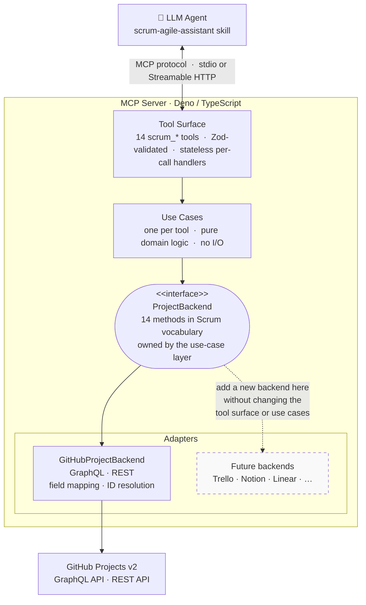
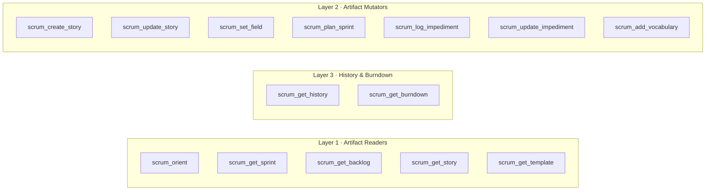
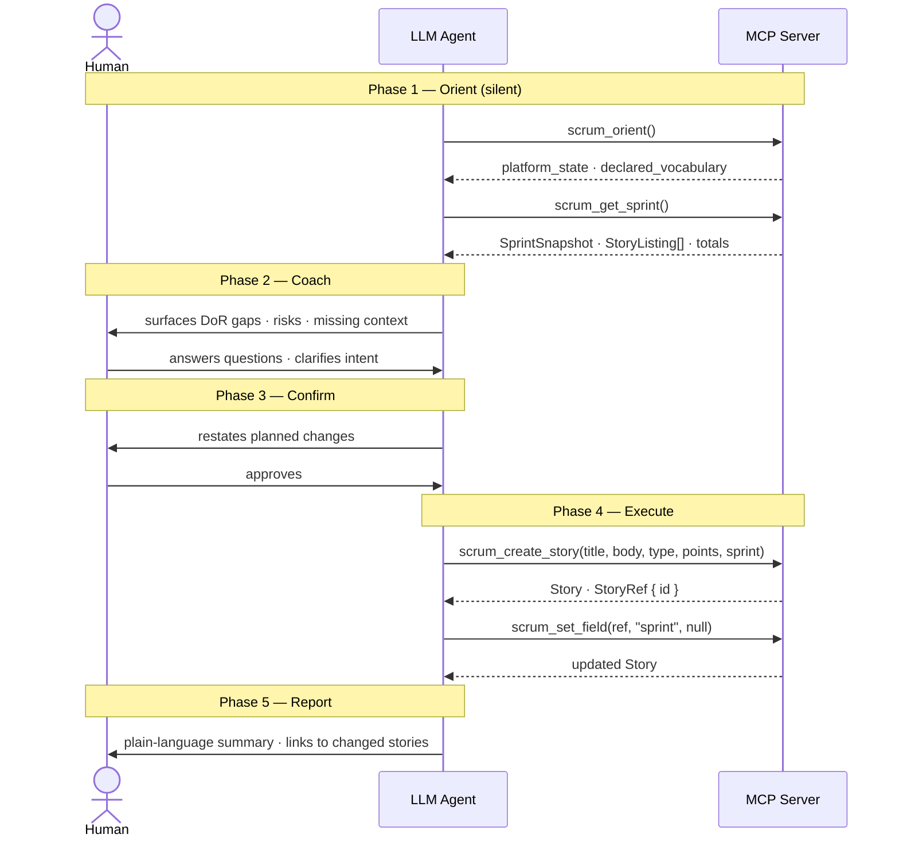

# The Scrum Master's MCP Toolkit

A local [Model Context Protocol (MCP)](https://modelcontextprotocol.io/) server that enables AI agents to manage Scrum teams using scrum language.

This project is designed to serve as the abstraction layer for LLM agents performing autonomous Scrum project management — sprint planning, backlog refinement, history analysis, and ceremony facilitation. Currently optimized for GitHub Projects ecosystem.

The tool surface aims to become **backend-agnostic**: tool names, arguments, and return shapes are defined in Scrum vocabulary. Adding a Trello, Notion, or Linear backend requires replacing only the implementations behind the tools; the agent skill and human workflows remain unchanged.

Supports two transports: **stdio** (Claude Desktop / Claude Code / LM Studio) and **Streamable HTTP** (Open WebUI / Docker / homelab).

## Related Documentation

- [GitHub Projects v2 — About Projects](https://docs.github.com/en/issues/planning-and-tracking-with-projects/learning-about-projects/about-projects)
- [GitHub Projects v2 — GraphQL API](https://docs.github.com/en/issues/planning-and-tracking-with-projects/automating-your-project/using-the-api-to-manage-projects)
- [Model Context Protocol Specification](https://modelcontextprotocol.io/docs)
- [The Scrum Guide](https://www.scrum.org/learning-series/what-is-scrum/)

## What is Scrum?

> If you are just getting started, think of Scrum as a way to get work done as a team in small pieces at a time, with continuous experimentation and feedback loops along the way to learn and improve as you go. Scrum helps people and teams deliver value incrementally in a collaborative way. As an agile framework, Scrum provides just enough structure for people and teams to integrate into how they work, while adding the right practices to optimize for their specific needs.
>
> [From Scrum.org](https://www.scrum.org/learning-series/what-is-scrum/)

A fully mapped Scrum project composition will look something like the following:


```mermaid
erDiagram
%% ── CORE PROJECT STRUCTURE ──────────────────────────────────────────────

PROJECT {
 string id PK
 string name
 string vision
 enum status "Active|Paused|Completed|Archived"
 date start_date
 date end_date
}

TEAM {
 string id PK
 string project_id FK
 string name
}

MEMBER {
 string id PK
 string team_id FK
 string name
 string email
}

MEMBER_CAPACITY {
 string id PK
 string member_id FK
 string sprint_id FK
 float available_days
 int capacity_points
 string notes
}

ROLE_ASSIGNMENT {
 string id PK
 string member_id FK
 string sprint_id FK
 enum role "PO|SM|Developer"
}

%% ── BACKLOG HIERARCHY ───────────────────────────────────────────────────

PRODUCT_BACKLOG {
 string id PK
 string project_id FK
 string product_goal
 date last_refined
}

EPIC {
 string id PK
 string backlog_id FK
 string title
 string description
 enum priority "Must|Should|Could|Wont"
 enum status "Open|InProgress|Done"
}

USER_STORY {
 string id PK
 string epic_id FK
 string title
 string as_a
 string i_want
 string so_that
 int story_points
 enum status "Backlog|Ready|InSprint|Done|Blocked"
 enum priority "Must|Should|Could|Wont"
}

SPRINT_BACKLOG_ITEM {
 string id PK
 string sprint_id FK
 string story_id FK
 date added_date
 bool carried_over
 int committed_points
}

ACCEPTANCE_CRITERIA {
 string id PK
 string story_id FK
 string criterion
 bool passed
}

TASK {
 string id PK
 string story_id FK
 string assignee_id FK
 string title
 enum type "Feature|Bug|TechDebt|Spike|Research"
 enum status "Todo|InProgress|Blocked|Done"
 float hours_estimate
 float hours_actual
}

IMPEDIMENT {
 string id PK
 string sprint_id FK
 string task_id FK
 string story_id FK
 string raised_by FK
 string owner_id FK
 string description
 date raised_date
 date resolved_date
 enum status "Open|InProgress|Resolved"
}

%% ── SPRINT ──────────────────────────────────────────────────────────────

SPRINT {
 string id PK
 string project_id FK
 int number
 string goal
 date start_date
 date end_date
 int capacity_points
 int committed_points
 int completed_points
 enum status "Planned|Active|Closed"
}

%% ── CEREMONIES ──────────────────────────────────────────────────────────

CEREMONY {
 string id PK
 string sprint_id FK
 string facilitator_id FK
 enum type "Planning|Standup|Review|Retro|Refinement"
 datetime scheduled_at
 int duration_min
 string notes
}

CEREMONY_ATTENDANCE {
 string id PK
 string ceremony_id FK
 string member_id FK
 bool attended
}

STANDUP_ENTRY {
 string id PK
 string ceremony_id FK
 string member_id FK
 date date
 string done_yesterday
 string plan_today
 string blockers
}

RETRO_ENTRY {
 string id PK
 string ceremony_id FK
 string member_id FK
 enum category "WentWell|Improve|Start|Stop"
 string observation
}

RETRO_ACTION {
 string id PK
 string retro_entry_id FK
 string sprint_id FK
 string owner_id FK
 string description
 enum status "Open|Done|Deferred"
 string sprint_target_id FK
}

REVIEW_FEEDBACK {
 string id PK
 string sprint_id FK
 string ceremony_id FK
 string given_by
 string feedback
 string triggered_story_id FK
}

%% ── TRACKING ────────────────────────────────────────────────────────────

BURNDOWN_DATAPOINT {
 string id PK
 string sprint_id FK
 enum series "Ideal|Actual"
 date date
 int remaining_points
 int completed_points
}

VELOCITY_RECORD {
 string id PK
 string project_id FK
 string sprint_id FK
 int committed_points
 int completed_points
}

%% ── QUALITY ─────────────────────────────────────────────────────────────

DEFINITION_OF_DONE {
 string id PK
 string project_id FK
 string criterion
 string area
 int version
 date last_updated
}

DEFINITION_OF_READY {
 string id PK
 string project_id FK
 string criterion
 int version
 date last_updated
}

SPRINT_REPORT {
 string id PK
 string sprint_id FK
 string author_id FK
 date submitted_at
 string summary
 string commitment_next_sprint
}

%% ── RELATIONSHIPS ───────────────────────────────────────────────────────

PROJECT ||--o{ TEAM : "has"
PROJECT ||--|| PRODUCT_BACKLOG : "owns"
PROJECT ||--o{ SPRINT : "runs"
PROJECT ||--o{ DEFINITION_OF_DONE : "defines"
PROJECT ||--o{ DEFINITION_OF_READY : "defines"
PROJECT ||--o{ VELOCITY_RECORD : "tracks"

TEAM ||--o{ MEMBER : "includes"
MEMBER ||--o{ ROLE_ASSIGNMENT : "holds"
MEMBER ||--o{ MEMBER_CAPACITY : "has per sprint"
SPRINT ||--o{ ROLE_ASSIGNMENT : "scopes"
SPRINT ||--o{ MEMBER_CAPACITY : "allocates"

PRODUCT_BACKLOG ||--o{ EPIC : "contains"
EPIC ||--o{ USER_STORY : "breaks into"

USER_STORY ||--o{ ACCEPTANCE_CRITERIA : "verified by"
USER_STORY ||--o{ TASK : "decomposed into"
USER_STORY ||--o{ SPRINT_BACKLOG_ITEM : "pulled into"

SPRINT ||--o{ SPRINT_BACKLOG_ITEM : "contains"
SPRINT ||--o{ CEREMONY : "schedules"
SPRINT ||--|| SPRINT_REPORT : "documented in"
SPRINT ||--o{ VELOCITY_RECORD : "recorded in"
SPRINT ||--o{ BURNDOWN_DATAPOINT : "tracked by"
SPRINT ||--o{ IMPEDIMENT : "surfaces"

TASK }o--o{ IMPEDIMENT : "may cause"
USER_STORY }o--o{ IMPEDIMENT : "may cause"
MEMBER ||--o{ IMPEDIMENT : "owns"
MEMBER ||--o{ TASK : "assigned to"

CEREMONY ||--o{ CEREMONY_ATTENDANCE : "records"
CEREMONY ||--o{ STANDUP_ENTRY : "captures"
CEREMONY ||--o{ RETRO_ENTRY : "captures"
CEREMONY ||--o{ REVIEW_FEEDBACK : "captures"
MEMBER ||--o{ CEREMONY_ATTENDANCE : "attends"

RETRO_ENTRY ||--o{ RETRO_ACTION : "generates"
MEMBER ||--o{ RETRO_ACTION : "owns"
SPRINT ||--o{ RETRO_ACTION : "targets"

USER_STORY }o--o{ REVIEW_FEEDBACK : "triggered by"

SPRINT_REPORT }o--|| MEMBER : "authored by"
```

It is designed to be used with the [scrum-master skill](.roo/skills/scrum-master/SKILL.md) as the orchestration layer.

To test the functionality of the tools, [this project is managed using itself](https://github.com/users/hoonsubin/projects/5) as the tool.

## Server Architecture

The server is built in three layers separated by a `ProjectBackend` port interface. The tool surface and use cases are platform-agnostic; only the adapter changes when the backend changes.


```mermaid
flowchart TB
    agent["🤖 LLM Agent\nscrum-agile-assistant skill"]

    subgraph server["MCP Server  ·  Deno / TypeScript"]
        direction TB

        surface["Tool Surface\n14 scrum_* tools  ·  Zod-validated  ·  stateless per-call handlers"]

        usecases["Use Cases\none per tool  ·  pure domain logic  ·  no I/O"]

        port(["&lt;&lt;interface&gt;&gt;\nProjectBackend\n14 methods in Scrum vocabulary\nowned by the use-case layer"])

        subgraph adapters["Adapters"]
            direction LR
            gh["GitHubProjectBackend\nGraphQL · REST\nfield mapping · ID resolution"]
            future["Future backends\nTrello · Notion · Linear · …"]
        end
    end

    ghapi["GitHub Projects v2\nGraphQL API  ·  REST API"]

    agent      <-->|"MCP protocol  ·  stdio or Streamable HTTP"| surface
    surface     --> usecases
    usecases    --> port
    port        --> gh
    port       -.->|"add a new backend here\nwithout changing the\ntool surface or use cases"| future
    gh          --> ghapi

    style future stroke-dasharray: 5 5
    style future fill:#f9f9f9
```

**Dependency rule:** source-code arrows point only inward — adapters depend on the `ProjectBackend` interface; the interface and use cases know nothing about GitHub. Adding a Trello or Notion backend means creating one new adapter directory and updating one import in `index.ts`.

## Tool Surface

This section defines the public MCP interface — the tools an LLM agent can call. It is the stable contract of the project: backend implementations, data types, and storage details may change underneath, but every tool listed here retains the same name, semantic arguments, and return meaning.

### Design principles

The surface is governed by six rules. Any change that violates one is a breaking change.

| # | Rule                                       | Principle                                                                                                                                                                                                                                                                                                                                           |
| - | ------------------------------------------ | --------------------------------------------------------------------------------------------------------------------------------------------------------------------------------------------------------------------------------------------------------------------------------------------------------------------------------------------------- |
| 1 | **Scrum vocabulary only**                  | No tool name, argument, or return field references the underlying platform (no `github_*`, no `issue_id`, no `node_id`). The agent speaks Scrum; the backend translates.                                                                                                                                                                            |
| 2 | **Backend-agnostic shapes**                | Inputs and outputs are described in domain terms (`Story`, `Sprint`, `SprintRef`, `ScrumField`). Adding a Notion, Trello, or Linear backend must require zero changes to this section. If a tool description cannot be implemented without a GitHub-specific concept, the tool does not belong in this surface.                                     |
| 3 | **Stateless server, per-call resolution**  | No tool depends on context cached between calls. Each tool resolves any names → backend IDs at the moment of invocation. The agent may call any tool in any order without a setup step.                                                                                                                                                             |
| 4 | **Atomic at the tool boundary, not below** | A single tool call performs one logically complete Scrum operation. The agent may need multiple calls for a workflow (e.g., create a story, then assign it to a sprint), but each call either succeeds end-to-end or fails cleanly.                                                                                                                 |
| 5 | **The MCP is amoral**                      | It does not enforce Definition of Ready, Definition of Done, sprint-injection policy, or any other Scrum judgement. Those live in the agent skill. If the agent asks the MCP to assign an unrefined item to a sprint, the MCP complies. The skill is responsible for not asking.                                                                    |
| 6 | **Artifact reads, not insight derivation** | Read tools expose the state of Scrum artifacts. They do not pre-compute reports, metrics, or recommendations. Velocity, burndown, throughput, predictability, and all other derived insights are **agent capabilities** — the agent reasons over raw artifact data to produce them. The server returns observable facts; the agent interprets them. |

### Tool surface layers

The fourteen tools in this surface occupy three distinct conceptual layers. Understanding the layers is the fastest way to see why a proposed new tool does or does not belong here.

| Layer                      | Tools                                                                                                                                                         | Returns                                                                                                                                                                                                                                                | Does not                                                                                        |
| -------------------------- | ------------------------------------------------------------------------------------------------------------------------------------------------------------- | ------------------------------------------------------------------------------------------------------------------------------------------------------------------------------------------------------------------------------------------------------ | ----------------------------------------------------------------------------------------------- |
| **1 — Artifact readers**   | `scrum_orient`, `scrum_get_sprint`, `scrum_get_backlog`, `scrum_get_story`, `scrum_get_template`                                                              | Current state of a Scrum primitive — platform state, vocabulary, sprint snapshots, story detail, or a custom template file. Makes no assumptions about what the agent does with the data.                                                              | Pre-compute metrics, apply or interpret templates, return full story bodies from listing calls. |
| **2 — Artifact mutators**  | `scrum_create_story`, `scrum_update_story`, `scrum_set_field`, `scrum_plan_sprint`, `scrum_log_impediment`, `scrum_update_impediment`, `scrum_add_vocabulary` | The updated artifact after each mutation. Each call is one complete Scrum operation. `scrum_add_vocabulary` mutates the platform schema rather than a story, but belongs here because the agent calls it autonomously in response to a vocabulary gap. | Validate DoR/DoD, check capacity, enforce Scrum rules — those belong to the agent skill.        |
| **3 — History & burndown** | `scrum_get_history`, `scrum_get_burndown`                                                                                                                     | Raw data spanning time: completed-sprint snapshots and the day-by-day burndown series for one sprint. The agent derives all insights (velocity trends, throughput, predictability) from this data.                                                     | Pre-select which metric matters, project future velocity, return current-sprint data.           |

Ceremony records (standup logs, retro entries, review feedback) are **not** a layer of this surface. They are documents the agent produces and stores in the team's chosen ceremony backend — a file, a wiki page, a discussion thread — outside the MCP's scope. Attaching ceremony records to individual stories as comments is an anti-pattern: it pollutes the story audit trail and breaks when the backend changes.


```mermaid
flowchart LR
    subgraph L1["Layer 1 · Artifact Readers"]
        direction TB
        orient["scrum_orient"]
        get_sprint["scrum_get_sprint"]
        get_backlog["scrum_get_backlog"]
        get_story["scrum_get_story"]
        get_template["scrum_get_template"]
    end

    subgraph L3["Layer 3 · History & Burndown"]
        direction TB
        get_history["scrum_get_history"]
        get_burndown["scrum_get_burndown"]
    end

    subgraph L2["Layer 2 · Artifact Mutators"]
        direction TB
        create["scrum_create_story"]
        update["scrum_update_story"]
        set_field["scrum_set_field"]
        plan["scrum_plan_sprint"]
        log_imp["scrum_log_impediment"]
        upd_imp["scrum_update_impediment"]
        add_vocab["scrum_add_vocabulary"]
    end
```

### Common types

These appear in arguments and return values across multiple tools.

| Type                | Meaning                                                                                                                                                                                                                             |
| ------------------- | ----------------------------------------------------------------------------------------------------------------------------------------------------------------------------------------------------------------------------------- |
| `StoryRef`          | A reference to a single Story. Shape: `{ "id": "<opaque>" }` where `id` is the project-item handle returned by any read tool in `Story.ref.id`. The agent obtains an `id` from a listing tool first, then passes it to write tools. |
| `SprintRef`         | A reference to a sprint. Accepted forms: `"current"`, `"next"`, `null` (= no sprint, i.e. the backlog), or an explicit sprint name or sprint ID that the backend accepts (e.g. `"Sprint 12", "31"`).                                |
| `ScrumField`        | One of `status`, `sprint`, `story_points`, `priority`, `assignee`. The set is fixed; new field types are out of scope for v1.                                                                                                       |
| `StoryType`         | One of `feature`, `bug`, `tech_debt`, `spike`. Drives the type label or category the backend applies. Impediments are a separate first-class artifact — not a `StoryType`.                                                          |
| `ImpedimentRef`     | A reference to a single Impediment. Shape: `{ "id": "<opaque>" }`. The opaque `id` is returned by `scrum_log_impediment` and appears in every `ImpedimentListing`. Pass it to `scrum_update_impediment`.                            |
| `EpicRef`           | A reference to a single Epic. Shape: `{ "id": "<opaque>" }`. Returned in `EpicListing.ref` and `Story.epic.ref`. Pass `ref.id` as the `epic` argument in `scrum_create_story` or `scrum_update_story` to associate a story.        |
| `EpicListing`       | Lightweight epic entry returned in `scrum_get_backlog`. Fields: `ref` (`EpicRef`), `name` (string), `description` (string or `null`), `priority` (string or `null`), `status` (`"open"` / `"in_progress"` / `"done"` / `null`), `story_count` (total stories under this epic across all statuses). |
| `DependencyEntry`   | A single dependency link between two stories. Fields: `key` (issue number string, always present — e.g. `"17"`), `title` (string or `null`), `ref.id` (project-item ID when resolvable from in-memory context, `null` otherwise).  |
| `StoryListing`      | Lightweight listing entry returned by all listing tools. See shape below.                                                                                                                                                           |
| `SprintSnapshot`    | Sprint metadata plus its `StoryListing[]` and `ImpedimentListing[]`. The common envelope for `scrum_get_sprint` and `scrum_get_history`. See shape below.                                                                           |
| `Story`             | Full story detail — body, comments, AC, linked PRs, impediments. Returned **only** by `scrum_get_story` and write tools. See shape below.                                                                                           |
| `ImpedimentListing` | Lightweight impediment entry. Full description always included (no separate detail fetch). See shape below.                                                                                                                         |

#### StoryListing shape

Returned by listing tools (`scrum_get_sprint`, `scrum_get_backlog`, `scrum_get_history`). Contains only the fields needed for board orientation. Call `scrum_get_story` when body, acceptance criteria, comments, or linked PRs are needed.

| Field               | Meaning                                                                                                                                                                         |
| ------------------- | ------------------------------------------------------------------------------------------------------------------------------------------------------------------------------- |
| `ref`               | `{ number, id }` — both forms always present so the agent can use either.                                                                                                       |
| `title`             | The story title.                                                                                                                                                                |
| `status`            | Current status display name (e.g. `"In Progress"`), or `null` if unset.                                                                                                         |
| `story_points`      | Numeric estimate, or `null` if unestimated.                                                                                                                                     |
| `priority`          | Priority display name (e.g. `"Must"`), or `null` if unset.                                                                                                                      |
| `sprint`            | Sprint name, or `null` if the story is in the backlog.                                                                                                                          |
| `has_dependencies`  | `true` when the story body contains a `## Dependencies` section with at least one entry. Use as a signal to call `scrum_get_story` for full dependency detail before planning.   |

#### SprintSnapshot shape

The common envelope for sprint data. Used by both `scrum_get_sprint` and `scrum_get_history` so the agent uses one mental model regardless of whether it is looking at active or historical sprints.

| Field                   | Meaning                                                                                                                                                                                                                        |
| ----------------------- | ------------------------------------------------------------------------------------------------------------------------------------------------------------------------------------------------------------------------------ |
| `sprint.name`           | Sprint name.                                                                                                                                                                                                                   |
| `sprint.start_date`     | ISO-8601 start date.                                                                                                                                                                                                           |
| `sprint.end_date`       | ISO-8601 end date.                                                                                                                                                                                                             |
| `sprint.duration_days`  | Sprint length in calendar days.                                                                                                                                                                                                |
| `sprint.days_remaining` | Days until end, or `null` for completed or future sprints.                                                                                                                                                                     |
| `items`                 | Array of `StoryListing` — the sprint's assigned items.                                                                                                                                                                         |
| `total_count`           | Total matching items before `limit` is applied.                                                                                                                                                                                |
| `totals.by_status`      | Map of status display name → item count (e.g. `{ "Done": 7, "In Progress": 2 }`).                                                                                                                                              |
| `totals.story_points`   | Sum of `story_points` across all items in the snapshot (unestimated items contribute 0).                                                                                                                                       |
| `impediments`           | Array of `ImpedimentListing` — impediments logged directly against this sprint. Does NOT include story-level impediments of stories within the sprint; fetch those via `scrum_get_story`. Both open and resolved are included. |

#### Story shape

Returned **only** by `scrum_get_story` and write tools (`scrum_create_story`, `scrum_update_story`, `scrum_set_field`). Listing tools return `StoryListing` instead.

Every full Story has this shape:

| Field                      | Meaning                                                                                                                                      |
| -------------------------- | -------------------------------------------------------------------------------------------------------------------------------------------- |
| `ref`                      | `{ id: string }` — the opaque project-item handle. Pass `Story.ref.id` to any write tool that accepts a `StoryRef`.                                                                                         |
| `title`                    | The story title.                                                                                                                                                                                             |
| `body`                     | The story body, rendered as markdown. Includes user-story format, AC checklist, dependencies, and technical notes — whatever the team wrote.                                                                 |
| `type`                     | `StoryType` resolved from the type label or category.                                                                                                                                                        |
| `status`                   | The current status in the team's vocabulary (e.g. `"In Progress"`).                                                                                                                                          |
| `sprint`                   | The current sprint name, or `null` if the story is in the backlog.                                                                                                                                           |
| `story_points`             | Numeric estimate, or `null` if unestimated.                                                                                                                                                                  |
| `priority`                 | The team's priority value (e.g. `"Must"`), or `null`.                                                                                                                                                        |
| `assignees`                | Array of team member identifiers (login or display name as configured).                                                                                                                                      |
| `labels`                   | Array of label strings, excluding the `type:*` label which is reflected in `type`.                                                                                                                           |
| `epic`                     | Parent epic as `{ ref: EpicRef; name: string }`, or `null`. The `ref.id` can be passed as the `epic` argument in `scrum_create_story` and `scrum_update_story` to associate a story with this epic.         |
| `blocked_by`               | Array of `DependencyEntry` — stories that must be Done before this one can start. Empty array if none.                                                                                                       |
| `blocks`                   | Array of `DependencyEntry` — stories that are downstream of this one (cannot start until this story is Done). Empty array if none.                                                                           |
| `created_at`, `updated_at` | ISO-8601 timestamps.                                                                                                                                                                                         |
| `url`                      | Canonical URL to view the story in the backend UI, when available.                                                                                                                                           |
| `impediments`              | Array of `ImpedimentListing` — all impediments that reference this story, ordered newest first. Both open and resolved are included.                                                                         |

#### ImpedimentListing shape

Returned in listing contexts: inside a `Story` (via `scrum_get_story`), inside a `SprintSnapshot` (via `scrum_get_sprint` and `scrum_get_history`), and as `orphan_impediments` from `scrum_get_backlog`. Because impediment content is a single description field rather than a structured document, the full description is always returned — there is no separate "impediment detail" fetch.

| Field         | Meaning                                                              |
| ------------- | -------------------------------------------------------------------- |
| `ref`         | `{ id: string }` — opaque handle. Pass to `scrum_update_impediment`. |
| `description` | The full impediment description text.                                |
| `status`      | One of `"open"`, `"in_progress"`, `"resolved"`.                      |
| `raised_by`   | Login of the person who surfaced it, or `null`.                      |
| `raised_at`   | ISO-8601 timestamp when the impediment was logged.                   |
| `resolved_at` | ISO-8601 timestamp when resolved, or `null`.                         |

### Read tools

Read tools are the agent's eyes. They are cheap, idempotent, and safe to call as often as needed.

#### `scrum_orient`

Returns the current platform state alongside the team's declared Scrum vocabulary, giving the agent everything it needs to assess whether the project is Scrum-ready and to ground subsequent calls in real names and options.

**Arguments:** none.

**Returns:** two top-level sections:

- `platform_state` — what currently exists on the PM platform: which Scrum fields are present and their configured options, which repo labels exist, and the active/next/completed-count breakdown for sprint iterations.
- `declared_vocabulary` — what the team's `config.yml` says the project should have: status vocabulary, priority vocabulary, story-point scale, sprint settings, team roster, Definition of Ready, Definition of Done, and custom artifact template paths (a map of artifact type → repo-relative file path, or `null` if the agent's skill-level default should be used for that type).

**Notes:** The agent uses its own Scrum knowledge as the reference standard and computes the gap between `platform_state` and `declared_vocabulary`. Structural gaps — a required field does not exist at all — require the human to create them in the platform UI. Vocabulary gaps — a field option or label is declared but missing — can be resolved autonomously by the agent via `scrum_add_vocabulary`. All write tools that accept vocabulary values (e.g. `scrum_set_field` with `status`) accept values from `declared_vocabulary`.

**Does not:** return live sprint story data (use `scrum_get_sprint`), historical sprint data (use `scrum_get_history`), or platform identifiers.

#### `scrum_get_sprint`

Returns a snapshot of one sprint or all active sprints as a `SprintSnapshot`. Each snapshot contains lightweight `StoryListing` items — no story bodies.

**Arguments:**

- `sprint` (optional, `SprintRef | "all"`): defaults to `"current"`. Pass `"next"` to inspect the upcoming sprint, an explicit sprint name to inspect a specific sprint, or `"all"` to retrieve every non-completed iteration in one call.
- `limit` (optional, integer, default 50): maximum number of items per `SprintSnapshot`. If omitted, the default limit of items are returned.

**Returns:**

- When `sprint` is a single ref: `{ sprint: SprintSnapshot }`.
- When `sprint` is `"all"`: `{ sprints: SprintSnapshot[], total_count: number }` where `total_count` is the sum of items across all snapshots.

**Notes:** Pass `"all"` to get a full board overview in a single call — current sprint, next sprint, and any other scheduled future sprints. Items in terminal status that belong to completed sprints are silently excluded; those are visible only through `scrum_get_history`. The agent calls `scrum_get_story` on demand when it needs body, acceptance criteria, comments, or linked PRs for a specific item.

**Does not:** include backlog items; surface burndown timeseries; resolve dependencies between stories; return full story bodies.

#### `scrum_get_backlog`

Returns the Product Backlog: all Stories not assigned to any sprint, ordered by priority. Supports filtering so the agent can answer "is this a duplicate of something already tracked?"

**Arguments:**

- `search` (optional, string): free-text match against title and body.
- `labels` (optional, array of strings): include only Stories carrying all of these labels.
- `priority` (optional, string): include only Stories at this priority value.
- `epic` (optional, string): include only Stories under this epic.
- `limit` (optional, integer, default 50): cap on items returned.

**Returns:** an object with `stories` (array of `StoryListing`), `total_count` (number matching the filter regardless of `limit`), `readiness` (object summarising how many items are sprint-ready, in refinement, or future candidates — based on whether they have `story_points`, acceptance criteria in the body, and a priority), `orphan_impediments` (array of `ImpedimentListing` — unresolved impediments with no `affects` context that require Scrum Master triage), and `epics` (array of `EpicListing` — all epics currently defined for the project, regardless of the story filter applied; the agent uses this list for epic-level planning and to populate the `epic` argument in create/update calls).

**Notes:** The readiness summary is a pure aggregation of observable facts, not a Scrum judgement. It reports what is present; it does not enforce DoR. Archived items and items in terminal status with no sprint (orphaned completed stories that were never cleaned up) are silently excluded. `orphan_impediments` contains only unresolved impediments (status `"open"` or `"in_progress"`) with no story or sprint reference; resolved orphans are excluded. The agent calls `scrum_get_story` when it needs the full body, acceptance criteria, comments, or impediment detail for a specific item.

**Does not:** modify ordering; create or estimate items; mark items as ready; return full story bodies.

#### `scrum_get_story`

Returns the full detail of one Story, including comments, linked PRs, and parsed acceptance criteria.

**Arguments:**

- `ref` (required, `StoryRef`).

**Returns:** a `Story` object plus `comments` (array of `{ author, body, created_at, url }`), `linked_prs` (array of PR references with state), `sub_tasks` (array of `{ title, status }` if the backend exposes sub-tasks), `acceptance_criteria` (array of `{ text, checked }` parsed from the body), and `impediments` (array of `ImpedimentListing` — all impediments that reference this story, ordered newest first, both open and resolved). The `Story` object includes `blocked_by` and `blocks` arrays (`DependencyEntry[]`) populated from the story's `## Dependencies` body section — check `StoryListing.has_dependencies` first to avoid fetching stories with no dependencies.

**Notes:** Use when the agent needs deep context on a single item — assessing DoR compliance, drafting a status update, or diagnosing a blocked item. The `impediments` field is the primary way the agent traces what is blocking a story and whether any active impediments need escalation. The `blocked_by` and `blocks` fields expose structured dependency data; each `DependencyEntry.key` is the upstream or downstream story's issue number.

**Does not:** return diff content of linked PRs, render image attachments, or follow dependency chains transitively.

#### `scrum_get_history`

Returns `SprintSnapshot` data for the last N completed sprints — the same structure as `scrum_get_sprint("all")` — so the agent uses one mental model for sprint data regardless of whether it is looking at active or historical sprints.

**Arguments:**

- `window` (optional, integer 1–10, default 5): number of most-recent closed sprints to include.
- `limit` (optional, integer, default 10): maximum number of items per `SprintSnapshot`. If omitted, the default limit of items are returned.

**Returns:** `{ sprints: SprintSnapshot[], window: number, average_completed_points: number }`. Each `SprintSnapshot` is the standard shape with two history-specific additions inside `totals`:

- `totals.committed_points` — total story points entering the sprint.
- `totals.completed_points` — total story points that reached terminal status by sprint close.

`average_completed_points` is the mean of `completed_points` across the returned window, provided as a convenience fact (not a derived insight — the agent still uses raw data for velocity trends, predictability, and other multi-sprint analyses).

**Notes:** This tool exposes facts. The agent derives insights from them: velocity trends, throughput, predictability (fraction of sprints where goal was achieved), type breakdown, epic-level trends, and anything else the conversation demands. The MCP does not pre-select which metric matters — that is the agent's job. A backend only needs to support queryable completed-sprint item state to implement this tool.

**Does not:** project future velocity, surface per-member throughput, return current-sprint data (use `scrum_get_sprint` for that), or return full story bodies.

#### `scrum_get_burndown`

Returns a day-by-day burndown chart for one sprint: the actual remaining-points series, the ideal straight-line projection, and a per-story completion breakdown.

**Arguments:**

- `sprint` (optional, `SprintRef`): defaults to `"current"`. Pass an explicit sprint name to retrieve burndown for a past sprint. Burndown does not apply to the backlog; `null` is not a valid value.

**Returns:** an object with:

- `sprint` — `{ name, start_date, end_date, duration_days, days_remaining }`.
- `data_source` — `"audit_log"` or `"issue_close_proxy"`. Indicates how completion timestamps were determined: `"audit_log"` means the GitHub Enterprise Audit Log was used (precise field-change timestamps); `"issue_close_proxy"` means issue-close events were used as a proxy (accurate only if issues are closed at the same moment they are moved to Done).
- `warning` (optional) — present when `data_source` is `"issue_close_proxy"`. The agent must surface this caveat to the human before presenting the chart.
- `series[]` — actual burndown: `{ date, remaining_points, completed_points }`, one entry per calendar day of the sprint.
- `ideal[]` — ideal burndown line: `{ date, remaining_points }`, one entry per calendar day from sprint start (total committed points) to sprint end (zero).
- `stories[]` — per-story summary: `{ number, title, points, status, completed_at }`. `completed_at` is `null` for stories not yet done.

**Notes:** The series and ideal data are observable facts derived from platform event timestamps, not agent-computed projections. The agent uses this data to render or describe a burndown without recomputing it from raw events. When `data_source` is `"issue_close_proxy"`, the agent should communicate the accuracy caveat to the human before presenting the chart — the `warning` field contains the recommended message.

**Does not:** compute velocity, project remaining work beyond the sprint end date, or return burndown for the backlog.

#### `scrum_get_template`

Fetches the raw content of a project-configured artifact template for a given ceremony type. If no custom template is declared in `config.yml` for the requested type, returns a signal instructing the agent to use its own skill-level default.

**Arguments:**

- `artifact_type` (required, enum): one of `sprint_review`, `retrospective`, `standup`, `sprint_planning`, `refinement`.

**Returns:** one of two shapes:

- `{ content: string, source: "custom" }` — a custom template was declared in `config.yml` and successfully fetched from the repo. `content` is the raw template text. The agent applies it by substituting dynamic data before writing the artifact to the ceremony backend.
- `{ content: null, source: "default" }` — no custom template is declared for this artifact type (either the key is absent or explicitly set to `null` in `config.yml`). The agent uses its own built-in skill-level default for this type.

**Notes:** The server never embeds default template content. Defaults are the agent's domain — they live in the scrum-agile-assistant skill (or equivalent system prompt) and may vary by deployment, ceremony format preference, or target output platform (a GitHub Discussion has a different structure from a Notion page or a Slack canvas). Custom templates are repo files fetched at invocation time from the path declared under `templates` in `config.yml`. The available paths are also returned by `scrum_orient` in `declared_vocabulary.templates` so the agent can inspect them without triggering a fetch.

**Does not:** validate template syntax, interpolate variables, apply templates, or enforce any required template structure. Template content is opaque to the server — it is returned verbatim.

### Write tools

Write tools mutate state. The agent should call them only after confirming intent with the human per the skill's autonomy rules.

#### `scrum_create_story`

Creates a new Story and optionally places it on the board in a single call.

**Arguments:**

- `title` (required, string).
- `body` (required, string, markdown): the full story body. The agent assembles the user-story format, AC checklist, dependencies, and technical notes before calling.
- `type` (required, `StoryType`): drives the type label.
- `priority` (optional, string): a value from `priority_vocabulary`.
- `story_points` (optional, number): a value from `story_point_values`.
- `labels` (optional, array of strings): additional non-type labels.
- `epic` (optional, string): parent epic name.
- `assignees` (optional, array of strings): team member logins.
- `sprint` (optional, `SprintRef`): if provided, the story is created and immediately assigned. If omitted, it enters the backlog.

**Returns:** the newly created `Story`.

**Notes:** Single-call atomicity is the point of this tool. The agent does not need to follow a create with `scrum_set_field` for points and priority; it bundles them here.

**Does not:** validate DoR, check sprint capacity, notify anyone, or create sub-tasks.

#### `scrum_update_story`

Edits the content of an existing Story — title, body, labels, assignees, epic. Does not touch board fields (status, sprint, story points, priority); use `scrum_set_field` for those.

**Arguments:**

- `ref` (required, `StoryRef`).
- `title` (optional, string).
- `body` (optional, string, markdown): replaces the full body. The agent reads the current body via `scrum_get_story` first if it intends to append rather than replace.
- `labels` (optional, array of strings): replaces the label set, excluding `type:*` labels managed by their own writes.
- `assignees` (optional, array of strings): replaces the assignee set.
- `epic` (optional, string or `null`): set to `null` to detach from epic.
- `blocked_by` (optional, array of `StoryRef` or `null`): replaces the full upstream dependency list atomically. Pass `null` to clear all upstream dependencies. Omit entirely to leave the existing `blocked_by` lines unchanged.
- `blocks` (optional, array of `StoryRef` or `null`): replaces the full downstream dependency list atomically. Pass `null` to clear all downstream dependencies. Omit entirely to leave the existing `blocks` lines unchanged. Symmetric with `blocked_by`.

**Returns:** the updated `Story`.

**Does not:** modify board state, change story type, archive or close the story, or follow dependency chains transitively.

#### `scrum_set_field`

The single entry point for board-field mutations. No backend IDs required.

**Arguments:**

- `ref` (required, `StoryRef`).
- `field` (required, `ScrumField`): one of `status`, `sprint`, `story_points`, `priority`, `assignee`.
- `value` (required): semantic value matching the field:
  - `status`: a string from `status_vocabulary`.
  - `sprint`: a `SprintRef` (`"current"`, `"next"`, `null` to remove from sprint, or explicit name).
  - `story_points`: a number from `story_point_values`, or `null` to clear.
  - `priority`: a string from `priority_vocabulary`, or `null` to clear.
  - `assignee`: a team member login, or `null` to unassign. To assign multiple members, use `scrum_update_story` with `assignees`.

**Returns:** the updated `Story`.

**Notes:** Setting `sprint` to `null` removes a story from its current sprint (the "bump to backlog" operation). There is no separate removal tool.

**Does not:** validate that value transitions make Scrum sense. The skill enforces Scrum rules; this tool executes decisions.

#### `scrum_plan_sprint`

Bulk-assigns multiple Stories to a sprint in one call. Used at sprint planning to commit the agreed scope after the team has discussed each item.

**Arguments:**

- `sprint` (required, `SprintRef`): typically `"next"` or an explicit name. `"current"` is allowed but signals a mid-sprint scope change.
- `stories` (required, array of `StoryRef`): the items to commit.
- `replace` (optional, boolean, default `false`): if `true`, clears existing sprint assignments first; if `false`, adds to what is already there.

**Returns:** `{ assigned: StoryRef[], skipped: [{ ref, reason }] }`.

**Notes:** Convenience over `scrum_set_field` in a loop, but with a clear partial-success contract: `skipped` tells the agent exactly which refs failed and why without aborting the rest.

**Does not:** check capacity, enforce DoR, or set the Sprint Goal.

#### `scrum_log_impediment`

Creates a new impediment and optionally links it to an affected story or sprint.

**Arguments:**

- `description` (required, string, markdown): the impediment description. Impediments have a single description field rather than a separate title and body.
- `affects` (optional, object): which artifact this impediment is blocking. If omitted, the impediment is logged as a project-level orphan visible through `scrum_get_backlog`. Provide at most one of the two sub-fields.
  - `affects.story` (optional, `StoryRef`): the specific story being blocked.
  - `affects.sprint` (optional, `SprintRef`): the sprint goal or overall sprint being threatened.
- `raised_by` (optional, string): login of the person who surfaced it; defaults to the configured Scrum Master.
- `priority` (optional, string): a value from `priority_vocabulary`; defaults to the highest tier.

**Returns:**

```
{
  impediment: ImpedimentListing,
  affects: { story: StoryRef } | { sprint: SprintRef } | null
}
```

**Notes:** Impediments are first-class objects on the backend. On GitHub, they are stored as labeled issues. The bidirectional cross-reference between the impediment and the affected story or sprint item is created atomically in this call. The agent discovers impediments through `scrum_get_story` (story-level), `scrum_get_sprint` (sprint-level), and `scrum_get_backlog` (orphans). Use `scrum_update_impediment` to advance an impediment through its lifecycle.

**Does not:** notify the impediment owner, escalate after N days (the agent skill's standup ceremony handles this), or close the affected story.

#### `scrum_update_impediment`

Advances an impediment through its lifecycle or records its resolution.

**Arguments:**

- `ref` (required, `ImpedimentRef`): the impediment to update.
- `status` (required, enum): one of `"open"`, `"in_progress"`, `"resolved"`. `"in_progress"` signals that the Scrum Master is actively working to remove the blocker; `"resolved"` closes it.
- `resolution_notes` (optional, string, markdown): context on how the impediment was resolved or what action is being taken. Recorded as a note on the impediment. Required when `status` is `"resolved"` by convention, though not enforced by the server.

**Returns:** the updated `ImpedimentListing`.

**Notes:** Impediment status is independent of the status of any affected story — a story may be unblocked while the impediment is still tracked as `"in_progress"` (the underlying cause is being addressed). The agent skill decides when to update the affected story's status separately via `scrum_set_field`.

**Does not:** close the affected story, remove the bidirectional link, or notify anyone.

#### `scrum_add_vocabulary`

Idempotent addition of a vocabulary entry to the platform schema. Called by the agent when `scrum_orient` reveals a declared vocabulary value that is missing from the live platform.

**Arguments:**

- `kind` (required, enum): one of `status_option`, `priority_option`, or `label`.
  - `status_option` — adds a missing option to the project's Status single-select field.
  - `priority_option` — adds a missing option to the project's Priority single-select field.
  - `label` — creates a missing repository label (used for story typing: `feature`, `bug`, `tech_debt`, `spike`, and for impediment tracking).
- `value` (required, string): the display name to add (e.g. `"Blocked"`, `"Critical"`, `"tech_debt"`).

**Returns:** `{ created: boolean, kind, value, message }`. If the option or label already exists, `created` is `false` and no change is made.

**Notes:** This tool handles vocabulary gaps — entries declared in `config.yml` that are not yet present in the platform. It cannot create new project fields (a structural gap requiring human action via the platform UI). If the target field does not exist, the tool returns a structured error that describes exactly what the human needs to create.

**Does not:** rename or delete existing options, reorder options, change field types, create sprint iterations, or provision project fields.

### What this surface deliberately does NOT include

The full Scrum domain (see the ER diagram above) is much richer than these fourteen tools. The omissions are intentional.

**Default artifact templates.** Built-in template content for ceremony documents — sprint review write-ups, retro boards, standup summaries, planning notes — is not embedded in the server. Default templates are the agent's domain. They live in the scrum-agile-assistant skill and are adapted to the target output platform at the moment the agent produces an artifact. The server provides only `scrum_get_template`, a thin fetch mechanism for project-specific custom templates the team has checked into their repo. This keeps the server output-platform-agnostic: it has no knowledge of whether the artifact will be written to a GitHub Discussion, a Notion page, or a Slack canvas.

**Ceremony record writes** (`scrum_post_note` and equivalents). Standup logs, retro entries, and review feedback are ceremony artefacts, not story mutations. They do not belong attached to individual stories as comments — that pollutes the story audit trail and is meaningless on backends that do not treat story comments as a structured record store. The agent drafts ceremony documents and stores them in the team's chosen ceremony backend (a file, a wiki, a discussion thread) directly, outside the MCP's scope.

**Sprint creation and closure.** Creating new sprint iterations and formally closing completed ones are administrative one-shots performed by the human in the platform UI. The boundary is intentional: the decision to start or end a sprint involves a ceremony (planning meeting, sprint review) that the human and agent conduct together — the MCP records the outcomes, it does not drive the ceremony clock. Structural field provisioning (creating a brand-new project field from scratch) also requires human action; `scrum_add_vocabulary` handles only incremental vocabulary extension on fields that already exist.

**Derived insight tools** (velocity averages, throughput, predictability). The agent derives all summary insights from `scrum_get_history` data. The MCP does not pre-select which metrics matter. `scrum_get_burndown` is the deliberate exception: it exposes the day-by-day remaining-points series and ideal line for one sprint as observable facts (drawn from platform event timestamps), but velocity, throughput, predictability, and all other multi-sprint aggregations remain agent-derived from raw history data.

**Acceptance criteria as a separate entity.** AC lives inside the Story body as a markdown checklist. `scrum_get_story` parses it for convenience; writes go through `scrum_update_story` against the body.

**Tasks as separate entities.** V1 flattens Stories — each PBI is one Story. Sub-task hierarchy is deferred to v2.

**Definition of Done / Definition of Ready writes.** DoD and DoR are read via `scrum_orient`. Edits happen against the team's config file by hand.

**Member capacity writes.** Per-sprint capacity lives in the team's sprint document and is read into agent context via the skill, not via a dedicated MCP tool.

**Notifications, mentions, or messaging.** The MCP does not send Slack messages, emails, or mobile pushes. Teams configure separate automation against the same backend for those.

**Authentication or token management.** The server is bootstrapped with credentials at startup; agent-callable tools do not surface auth operations.

If a future workflow requires something on this list, the right move is agent skill behaviour or a separate CLI task — not growing the MCP tool surface.

## How this MCP is used with the agent skill

This MCP is the action layer for an LLM agent acting as a Scrum Master. The agent's reasoning, coaching, and ceremony facilitation come from the [scrum-master skill](.roo/skills/scrum-master/SKILL.md) (or any equivalent system prompt). The MCP's job is to make that reasoning effective on a real platform.

### Division of responsibilities

| Layer           | Owns                                                                                                                                                                                                                                                                      |
| --------------- | ------------------------------------------------------------------------------------------------------------------------------------------------------------------------------------------------------------------------------------------------------------------------- |
| **Human**       | Intent, content, scope decisions, approval of state-changing actions, anything the system cannot fetch from itself.                                                                                                                                                       |
| **Agent skill** | Scrum knowledge, ceremony facilitation, DoR/DoD enforcement, insight derivation (velocity, burndown, predictability), mid-sprint coaching, retro format selection, document drafting, default artifact template ownership and application, deciding when to call the MCP. |
| **MCP server**  | Atomic platform operations, name → backend ID resolution, artifact snapshots, raw sprint history, write idempotence, custom artifact template file retrieval.                                                                                                             |

Three rules follow from this split:

1. **The agent never asks the MCP a Scrum question.** "Is this story ready?" is an agent question — it reads `scrum_get_story` and applies its own DoR check. "What is the team's velocity?" is also an agent question — it reads `scrum_get_history` and computes the average itself.
2. **The MCP never asks the human a question.** Tools either succeed or fail with a clear error. Clarification happens in the agent layer.
3. **The human never directly issues backend operations.** The human says "test solution b this sprint" and the agent translates that into the right sequence of MCP calls.

### The five-phase interaction pattern

Every non-trivial workflow follows the same shape.


```mermaid
sequenceDiagram
    actor H as Human
    participant A as LLM Agent
    participant M as MCP Server

    Note over H,M: Phase 1 — Orient (silent)
    A->>M: scrum_orient()
    M-->>A: platform_state · declared_vocabulary
    A->>M: scrum_get_sprint()
    M-->>A: SprintSnapshot · StoryListing[] · totals

    Note over H,A: Phase 2 — Coach
    A->>H: surfaces DoR gaps · risks · missing context
    H->>A: answers questions · clarifies intent

    Note over H,A: Phase 3 — Confirm
    A->>H: restates planned changes
    H->>A: approves

    Note over A,M: Phase 4 — Execute
    A->>M: scrum_create_story(title, body, type, points, sprint)
    M-->>A: Story · StoryRef { id }
    A->>M: scrum_set_field(ref, "sprint", null)
    M-->>A: updated Story

    Note over H,A: Phase 5 — Report
    A->>H: plain-language summary · links to changed stories
```

**Phase 1 — Orient.** The agent reads world state with `scrum_orient`, `scrum_get_sprint`, and (when context demands) `scrum_get_backlog` or `scrum_get_history`. These calls happen silently. The skill uses the results to ground the conversation in real numbers and to verify the platform is Scrum-ready before proceeding.

**Phase 2 — Coach.** The agent applies the skill. It identifies DoR gaps, sprint-injection risks, capacity violations, or unclarified intent. It surfaces these to the human in plain language. No MCP calls in this phase.

**Phase 3 — Confirm.** The agent restates the planned changes — "I'm going to create a Spike titled X with N points in Sprint M, and bump story #37 back to the backlog" — and waits for approval. Confirmation is required for every state change above the autonomy threshold defined in `config.yml`.

**Phase 4 — Execute.** The agent calls the MCP write tools in sequence. Each call is atomic; the agent threads returned references between calls (`scrum_create_story` returns a `StoryRef` that the next `scrum_set_field` consumes).

**Phase 5 — Report.** The agent summarises what changed in plain language with links to the affected Stories. The human can verify directly in the platform UI.

### Decision and question ownership

The table below maps every common question or decision to its owner. Anyone tempted to "just add a tool" for an agent or MCP cell should treat that impulse as a signal the boundary has slipped.

| Question / Decision                             | Owner     | Notes                                                                                       |
| ----------------------------------------------- | --------- | ------------------------------------------------------------------------------------------- |
| What is the actual content of this work?        | **Human** | Opaque labels like "solution b" must be described concretely before a Story can be drafted. |
| Who is the user role for this story?            | **Human** | "Players" vs. "new players on mobile" is a human judgement.                                 |
| What are the acceptance criteria?               | **Human** | What does success look like, in measurable terms?                                           |
| What are the estimates and time-boxes?          | **Human** | Team members provide these during planning; the agent records them.                         |
| Mid-sprint scope decisions                      | **Human** | Inject into current sprint or queue for next, and if injecting, what to drop.               |
| What is the Sprint Goal?                        | **Human** | A sentence the team commits to. The agent can suggest; it cannot decide.                    |
| Retro commitments                               | **Human** | Exactly one improvement per sprint, owned by the team.                                      |
| Approval to write                               | **Human** | Required for any change above the configured autonomy level.                                |
| Is this Story ready?                            | **Agent** | Reads `scrum_get_story` and applies its own DoR check.                                      |
| Should we inject this into the current sprint?  | **Agent** | Reads sprint state and capacity, then coaches the human.                                    |
| What's a good Sprint Goal for this work?        | **Agent** | Synthesises backlog context and sprint history; proposes to human for approval.             |
| Who should own this?                            | **Agent** | Knows the team roster from `scrum_orient`; reasons over workload context.                   |
| Is this estimate realistic?                     | **Agent** | Compares against velocity and story complexity from `scrum_get_history`.                    |
| What is our velocity?                           | **Agent** | Computes from `scrum_get_history` data.                                                     |
| Was the last retro commitment honoured?         | **Agent** | Cross-references retro notes and story history.                                             |
| Why has this Story been blocked for three days? | **Agent** | Reads impediments via `scrum_get_story` and surfaces analysis to human.                     |

### Canonical example: mid-sprint UX research request

The human says: _"Several players report the game interface is too complicated. My ideas to fix are a, b, c. I think b is most feasible to test before the end of this sprint."_

**Orient.** Agent calls `scrum_orient()`, `scrum_get_sprint()`, and `scrum_get_backlog({ search: "ui" })`. Now it knows the current Sprint Goal, capacity, days remaining, and whether this concern is already tracked.

**Coach.** Agent recognises three issues: solutions a/b/c are opaque, no AC is defined, and this is mid-sprint scope injection. It asks the human: what is solution b in concrete terms, who is the affected user, is this research (Spike) or a deliverable (Story), what does success look like, and is the human prepared to drop something to make room?

**Confirm.** Human answers. Agent drafts: "Spike titled 'A/B test reduced main-menu', 3 SP, in current sprint, dropping #37 (Daily login bonus) to make room. AC: ≥10% reduction in new-player tutorial drop-off." Asks for approval.

**Execute.** Agent calls:

1. `scrum_create_story({ title, body, type: "spike", story_points: 3, sprint: "current" })`
2. `scrum_set_field({ ref: #37, field: "sprint", value: null })`

**Report.** Agent: "Done. Spike #42 created in Sprint 5 with 3 points; #37 bumped back to backlog. Test runs through Friday."

Note that the agent records the rationale for bumping #37 in its own ceremony document or chat summary — not as a comment on the story. The story's audit trail reflects what the story is, not why planning decisions were made around it.

Every other workflow this server supports — sprint planning, daily standup, sprint review, retrospective, backlog refinement, impediment escalation — follows the same five-phase shape with different tool sequences in Phase 4.

### Where the boundary helps when things change

The reason this division matters: the system survives change in three independent dimensions.

| Dimension   | What changes                                                                                                                                            | What stays fixed                                              |
| ----------- | ------------------------------------------------------------------------------------------------------------------------------------------------------- | ------------------------------------------------------------- |
| **Backend** | Adapter implementation — swap GitHub for Notion or Trello by replacing one directory.                                                                   | Tool surface, agent skill, Scrum vocabulary, human workflows. |
| **Skill**   | Skill file — improve coaching, add ceremony formats, support new derived insights.                                                                      | MCP server, tool surface, no release required.                |
| **Domain**  | Backend field + `config.yml` declaration — new fields (e.g. a "confidence" rating) are added to the backend and read from Story body or `scrum_orient`. | Tool surface does not grow.                                   |

The fourteen tools are the contract. Everything else is a moving part.
