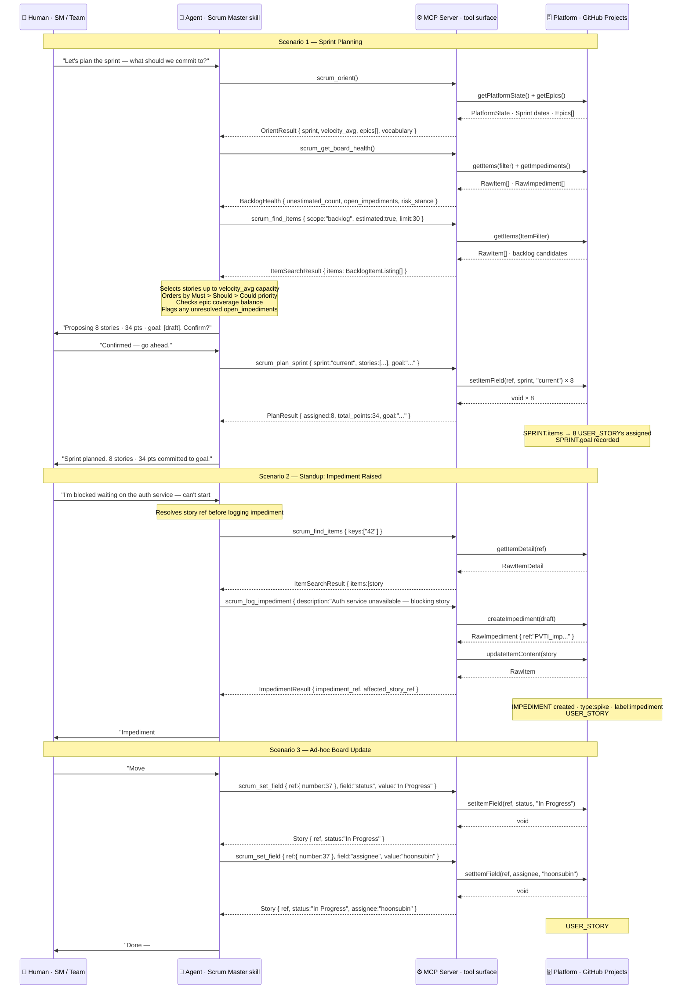
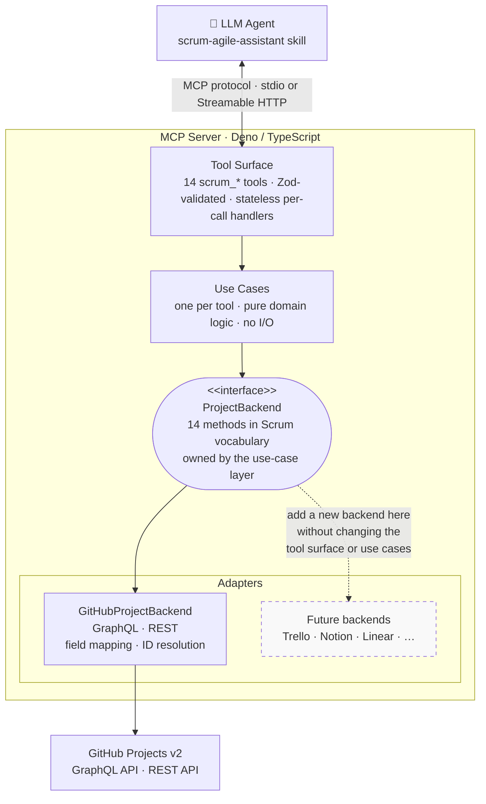

# Project Architecture

## What is Scrum?

> If you are just getting started, think of Scrum as a way to get work done as a team in small pieces at a time, with continuous experimentation and feedback loops along the way to learn and improve as you go. Scrum helps people and teams deliver value incrementally in a collaborative way. As an agile framework, Scrum provides just enough structure for people and teams to integrate into how they work, while adding the right practices to optimize for their specific needs.
>
> [From Scrum.org](https://www.scrum.org/learning-series/what-is-scrum/)

## Canonic Domain Model

```mermaid
erDiagram

PROJECT {
	string id         PK "stored"
	string name          "stored"
	string vision        "stored?"
	enum   status        "stored: Active|Paused|Completed|Archived"
	date   start_date    "stored?"
	date   end_date      "stored?"
}

TEAM {
	string id         PK "stored"
	string project_id FK "stored"
	string name          "stored"
}

MEMBER {
	string id          PK "stored"
	string team_id     FK "stored"
	string platform_id    "stored"
	string name           "stored"
	string email          "stored?"
}

ROLE_ASSIGNMENT {
	string id         PK "stored"
	string member_id  FK "stored"
	string sprint_id  FK "stored"
	enum   role          "config: PO|SM|Developer"
}

SPRINT {
	string id               PK "stored"
	string project_id       FK "stored"
	string name                "stored"
	int    number              "stored"
	string goal                "stored?"
	date   start_date          "stored"
	date   end_date            "stored"
	int    committed_points    "stored"
	int    completed_points    "computed"
	enum   status              "stored: Planned|Active|Closed"
}

EPIC {
	string id         PK "stored"
	string backlog_id FK "stored"
	string title         "stored"
	string description   "stored?"
	int    rank          "stored"
	enum   priority      "stored?: Must|Should|Could|Wont"
	enum   status        "stored: Open|InProgress|Done"
}

USER_STORY {
	string id           PK "stored"
	string epic_id      FK "stored?"
	string title           "stored"
	string body            "stored"
	int    rank            "stored"
	int    story_points    "stored?"
	enum   status          "stored: Backlog|Ready|InSprint|Done|Blocked"
	enum   priority        "stored?: Must|Should|Could|Wont"
	string assignees       "stored?"
	string labels          "stored?"
}

SPRINT_BACKLOG_ITEM {
	string id               PK "stored"
	string sprint_id        FK "stored"
	string story_id         FK "stored"
	date   added_date          "stored"
	bool   carried_over        "stored"
	int    committed_points    "stored"
}

ACCEPTANCE_CRITERIA {
	string id         PK "computed"
	string story_id   FK "stored"
	string criterion     "computed"
	bool   passed        "computed"
}

IMPEDIMENT {
	string id            PK "stored"
	string sprint_id     FK "stored?"
	string story_id      FK "stored?"
	string raised_by     FK "stored?"
	string owner_id      FK "stored?"
	string description      "stored"
	date   raised_date      "stored"
	date   resolved_date    "stored?"
	enum   status           "stored: Open|InProgress|Resolved"
}

DEFINITION_OF_DONE {
	string id         PK "config"
	string project_id FK "config"
	string criterion     "config"
	string area          "config?"
	int    version       "config"
	date   last_updated  "config"
}

DEFINITION_OF_READY {
	string id         PK "config"
	string project_id FK "config"
	string criterion     "config"
	int    version       "config"
	date   last_updated  "config"
}

PRODUCT_BACKLOG {
	string id           PK "computed"
	string project_id   FK "stored"
	string product_goal    "config"
	date   last_refined    "computed"
}

TASK {
	string id           PK "stored"
	string story_id     FK "stored"
	string assignee_id  FK "stored?"
	string title           "stored"
	enum   type            "stored: Feature|Bug|TechDebt|Spike|Research"
	enum   status          "stored: Todo|InProgress|Blocked|Done"
	float  hours_estimate  "stored?"
	float  hours_actual    "stored?"
}

SPRINT_CONTEXT {
	string id               "computed"
	string name             "computed"
	string goal             "computed"
	int    duration_days    "computed"
	int    days_elapsed     "computed"
	int    days_remaining   "computed"
	int    time_elapsed_pct "computed"
	enum   risk_stance      "computed: normal|monitor|elevated"
}

BURNDOWN_ACTUAL {
	string sprint_id        FK "stored"
	date   date                "stored"
	string data_source         "stored: audit_log|comments"
	int    remaining_points    "computed"
	int    completed_points    "computed"
}

BURNDOWN_IDEAL {
	string sprint_id        FK "computed"
	date   date                "computed"
	int    remaining_points    "computed"
}

VELOCITY_RECORD {
	string sprint_id          FK "computed"
	string project_id         FK "computed"
	int    committed_points      "computed"
	int    completed_points      "computed"
	float  completion_ratio      "computed"
}

BACKLOG_HEALTH {
	string project_id              FK "computed"
	int    ready_count                "computed"
	int    not_ready_count            "computed"
	int    ungroomed_count            "computed"
	int    overall_ready_pct          "computed"
	int    open_impediment_count      "computed"
	int    orphan_impediment_count    "computed"
	int    unestimated_count          "computed"
	int    blocked_count              "computed"
	int    no_assignee_count          "computed"
}

MEMBER_CAPACITY {
	string id              PK "config"
	string member_id       FK "config"
	string sprint_id       FK "config"
	float  available_days     "config"
	int    capacity_points    "computed"
	string notes              "config?"
}

CEREMONY {
	string   id             PK "agent"
	string   sprint_id      FK "agent"
	string   facilitator_id FK "agent"
	enum     type              "agent: Planning|Standup|Review|Retro|Refinement"
	datetime scheduled_at      "agent"
	int      duration_min      "agent?"
	string   notes             "agent?"
}

CEREMONY_ATTENDANCE {
	string id          PK "agent"
	string ceremony_id FK "agent"
	string member_id   FK "agent"
	bool   attended       "agent"
}

STANDUP_ENTRY {
	string id             PK "agent"
	string ceremony_id    FK "agent"
	string member_id      FK "agent"
	date   date              "agent"
	string done_yesterday    "agent"
	string plan_today        "agent"
	string blockers          "agent?"
}

RETRO_ENTRY {
	string id          PK "agent"
	string ceremony_id FK "agent"
	string member_id   FK "agent"
	enum   category       "agent: WentWell|Improve|Start|Stop"
	string observation    "agent"
}

RETRO_ACTION {
	string id                PK "agent"
	string retro_entry_id    FK "agent"
	string created_sprint_id FK "agent"
	string target_sprint_id  FK "agent?"
	string owner_id          FK "agent"
	string description          "agent"
	enum   status               "agent: Open|Done|Deferred"
}

REVIEW_FEEDBACK {
	string id                 PK "agent"
	string sprint_id          FK "agent"
	string ceremony_id        FK "agent"
	string given_by              "agent"
	string feedback              "agent"
	string triggered_story_id FK "agent?"
}

SPRINT_REPORT {
	string id                    PK "agent"
	string sprint_id             FK "agent"
	string author_id             FK "agent"
	date   submitted_at             "agent"
	string summary                  "agent"
	string commitment_next_sprint   "agent?"
}

PROJECT ||--o{ TEAM : "has"
PROJECT ||--|| PRODUCT_BACKLOG : "owns"
PROJECT ||--o{ SPRINT : "runs"
PROJECT ||--o{ DEFINITION_OF_DONE : "defines"
PROJECT ||--o{ DEFINITION_OF_READY : "defines"

TEAM ||--o{ MEMBER : "includes"
MEMBER ||--o{ ROLE_ASSIGNMENT : "holds"
SPRINT ||--o{ ROLE_ASSIGNMENT : "scopes"
SPRINT ||--o{ MEMBER_CAPACITY : "allocates"
MEMBER ||--o{ MEMBER_CAPACITY : "declared for"

PRODUCT_BACKLOG ||--o{ EPIC : "contains"
EPIC ||--o{ USER_STORY : "breaks into"
USER_STORY ||--o{ ACCEPTANCE_CRITERIA : "yields"
USER_STORY ||--o{ SPRINT_BACKLOG_ITEM : "pulled into"
SPRINT ||--o{ SPRINT_BACKLOG_ITEM : "contains"

USER_STORY }o--o{ IMPEDIMENT : "may cause"
SPRINT }o--o{ IMPEDIMENT : "may threaten"
MEMBER ||--o{ IMPEDIMENT : "owns"

USER_STORY ||--o{ TASK : "decomposed into"
MEMBER ||--o{ TASK : "assigned"

SPRINT ||--|| SPRINT_CONTEXT : "yields"
SPRINT ||--o{ BURNDOWN_ACTUAL : "tracked by"
SPRINT ||--o{ BURNDOWN_IDEAL : "projected by"
SPRINT ||--o{ VELOCITY_RECORD : "contributes to"
PROJECT ||--|| BACKLOG_HEALTH : "assessed by"

SPRINT ||--o{ CEREMONY : "schedules"
SPRINT ||--|| SPRINT_REPORT : "documented in"
CEREMONY ||--o{ CEREMONY_ATTENDANCE : "records"
CEREMONY ||--o{ STANDUP_ENTRY : "captures"
CEREMONY ||--o{ RETRO_ENTRY : "captures"
CEREMONY ||--o{ REVIEW_FEEDBACK : "captures"
MEMBER ||--o{ CEREMONY_ATTENDANCE : "attends"
RETRO_ENTRY ||--o{ RETRO_ACTION : "generates"
MEMBER ||--o{ RETRO_ACTION : "owns"
USER_STORY }o--o| REVIEW_FEEDBACK : "may trigger"
SPRINT_REPORT }o--|| MEMBER : "authored by"
```

### Domain Model Reference

#### Persistence Tiers

Every entity in the diagram belongs to one of four tiers. The tier determines who produces the data, whether it can be stale, and whether any MCP tool has a write path to it.

| Tag        | Tier               | Description                                                                                                                                                                                          |
| ---------- | ------------------ | ---------------------------------------------------------------------------------------------------------------------------------------------------------------------------------------------------- |
| `stored`   | Platform-Persisted | Lives in the backend API. Fetched by the adapter on each tool call. Values may be stale between calls; the adapter is the authoritative source.                                                      |
| `computed` | Server-Computed    | Derived deterministically from platform data by the use-case layer. Never stored; always recalculated on request. Cannot be stale.                                                                   |
| `config`   | Local-Config       | Declared in `config.yml` or sidecar files. Read by the server at startup or on demand. The human edits these directly; no MCP write tool targets them.                                               |
| `agent`    | Agent-Managed      | Produced by the agent during Scrum ceremonies. Stored in the team's chosen ceremony backend (markdown file, wiki, Slack canvas). Outside MCP scope; shown in the model for domain completeness only. |

#### Field Annotation Legend

Each field in the diagram carries a tag in its comment column indicating how its value is produced. A `?` suffix means the field is nullable or optional.

| Tag        | Meaning                                                       |
| ---------- | ------------------------------------------------------------- |
| `stored`   | Retrieved from the backend as-is.                             |
| `stored?`  | Retrieved; may be null or unset on the platform.              |
| `computed` | Derived by the server use-case layer; never persisted.        |
| `config`   | Read from `config.yml`; no MCP write path exists.             |
| `config?`  | Config-sourced; optional field.                               |
| `agent`    | Produced by agent reasoning; not the server's responsibility. |
| `agent?`   | Agent-produced; optional.                                     |

#### Design Notes

**Persistence tiers in the diagram.** Entities are ordered by tier: platform-persisted entities appear first, followed by server-computed views, then local-config entities, then agent-managed ceremony records. The relationship section at the bottom does not repeat tier labels; instead the tier of each entity is readable from its field annotations.

**SPRINT.name** is the canonical reference key used throughout the tool surface (e.g. `"Sprint 12"`). The integer `number` field exists for sort ordering only. Every `SprintRef` in the tool schemas resolves to a `name` string, not a numeric ID.

**SPRINT.completed_points** is annotated `computed` because it is a rollup of `SPRINT_BACKLOG_ITEM.committed_points` filtered to stories whose status equals Done. Storing it independently would create a second source of truth that the adapter would need to keep synchronised with backlog item state.

**MEMBER.platform_id** holds the opaque backend identity handle that the adapter uses for API calls — the GitHub login on the GitHub backend, a user ID on Notion, and so on. The `name` and `email` fields are display values and are not reliable adapter keys.

**EPIC.rank and USER_STORY.rank** provide stable sort order within their parent containers. MoSCoW priority is not a sort key — two `Must` items still require a tiebreaker position to produce a deterministic ordered backlog.

**USER_STORY.body** replaces the original `as_a`, `i_want`, and `so_that` triple from the human-workflow model. The user-story sentence format is a markdown convention the agent writes into the body field; it is not stored as separate columns in the backend. The body also contains the acceptance criteria checklist and the dependencies section.

**ACCEPTANCE_CRITERIA** has no independent write path. The server parses it from `USER_STORY.body` on each `scrum_get_story` call. All writes go through `scrum_update_story` against the body. The entity exists in the model to represent the logical structure the server extracts on read.

**IMPEDIMENT** has two nullable foreign keys: `sprint_id` and `story_id`. At least one must be set for a linked impediment. When both are null the record is a project-level orphan, surfaced through `scrum_get_backlog.orphan_impediments` and requiring Scrum Master triage. The tool surface enforces this through the `affects` argument on `scrum_log_impediment` rather than at the schema level.

**PRODUCT_BACKLOG** is not a stored entity on GitHub Projects. It is a logical container implemented in the adapter as a filtered projection — items where `sprint = null`. Its `id` mirrors the `project_id`. The `last_refined` field is computed from the most recent Refinement ceremony timestamp. No MCP write tool targets this entity directly.

**BURNDOWN_ACTUAL and BURNDOWN_IDEAL** are modelled as separate entities because they have different production paths. `BURNDOWN_ACTUAL` is derived from real platform event timestamps (audit log or issue-close proxy), making its `date` field genuinely stored data. `BURNDOWN_IDEAL` is pure arithmetic — `committed_points × (1 − day_index ÷ duration_days)` — and has no stored fields at all. The original single `BURNDOWN_DATAPOINT` entity with a `series` enum conflated these two distinct origins, making it impossible to distinguish what was retrieved from what was calculated.

**VELOCITY_RECORD** is a server-computed projection over closed `SPRINT` rows, not a stored entity. It is assembled by the use-case layer when the agent calls `scrum_get_analytics` with `view=history`. There is no adapter write path for it, and it carries no fields that are not derivable from existing sprint data.

**RETRO_ACTION** carries two distinct sprint foreign keys with different semantics. `created_sprint_id` records which sprint's retrospective generated the action and is always set. `target_sprint_id` records by which sprint the action should be resolved and is nullable — a null value means the action has no fixed deadline. The original naming of `sprint_id` and `sprint_target_id` was ambiguous about which described the source and which described the target.

**STANDUP_ENTRY.blockers** is an optional free-text field. A non-empty value is the signal for the agent to call `scrum_log_impediment` and create a formal `IMPEDIMENT` record. The schema cannot enforce this linkage; the agent skill is responsible for recognising the signal and acting on it.

**TASK** is a V2 domain intent, not implemented in V1. V1 flattens all work into `USER_STORY` items; sub-task hierarchy is deferred. When implemented, tasks will map to platform sub-issues. No MCP tool reads or writes `TASK` in the current server. The entity appears in the model because it belongs to the domain and will be needed when the tool surface is extended.

**CEREMONY, STANDUP_ENTRY, RETRO_ENTRY, RETRO_ACTION, REVIEW_FEEDBACK, and SPRINT_REPORT** are all agent-managed. They are not stored in GitHub Projects. The agent produces these during ceremonies and stores them in the team's chosen ceremony backend. The MCP server has no read or write path for any of them. They appear in the domain model because they are part of the full Scrum workflow the agent orchestrates, even though the server is not involved in persisting them.

## Tool Surface

### Architecture Diagram

The diagram below traces the call path from the MCP tool surface through the use-case layer to the abstract adapter interface. Solid arrows indicate methods that are always called for that operation. Dashed arrows indicate conditionally called methods.

```mermaid
flowchart TD
    subgraph FRAMEWORK["Framework Layer · MCP Tool Surface"]
        subgraph READ_TOOLS["Read Tools"]
            F_orient["scrum_orient<br/>∅ → OrientResult"]
            F_health["scrum_get_board_health<br/>BoardHealthQuery → BacklogHealth"]
            F_find["scrum_find_items<br/>ItemFilter → ItemSearchResult"]
            F_detail["scrum_get_item_detail<br/>StoryRef → ItemDetailResult"]
            F_analytics["scrum_get_analytics<br/>AnalyticsQuery → AnalyticsResult"]
            F_template(["scrum://template/{type}<br/>URI param → string"])
        end
        subgraph WRITE_TOOLS["Write Tools"]
            F_create["scrum_create_story<br/>StoryDraft → Story"]
            F_update["scrum_update_story<br/>StoryRef + Patch → Story"]
            F_set["scrum_set_field<br/>StoryRef + Field + Value → Story"]
            F_plan["scrum_plan_sprint<br/>SprintRef + StoryRef[] → PlanResult"]
            F_log_imp["scrum_log_impediment<br/>ImpedimentDraft → ImpedimentResult"]
            F_upd_imp["scrum_update_impediment<br/>ImpedimentRef + Status → ImpedimentListing"]
            F_vocab["scrum_add_vocabulary<br/>VocabKind + Value → VocabResult"]
        end
    end

    subgraph USE_CASE["Use-Case Layer · Computation and Orchestration"]
        U_orient["orientUseCase<br/>diff platform vocab vs config<br/>compute SprintContext from dates<br/>build EpicSummary[] with progress<br/>build TemplateUriMap"]
        U_health["boardHealthUseCase<br/>aggregate readiness by ItemType<br/>compute SprintRiskStance signals<br/>count open impediments"]
        U_find["findItemsUseCase<br/>resolve numeric keys to refs<br/>apply all ItemFilter predicates<br/>opt: build DependencyMap"]
        U_detail["itemDetailUseCase<br/>parse acceptance criteria from body<br/>resolve DependencyEntry[]"]
        U_analytics["analyticsUseCase<br/>build BURNDOWN_ACTUAL from events<br/>compute BURNDOWN_IDEAL arithmetic<br/>aggregate VELOCITY_RECORD[]"]
        U_template["templateUseCase<br/>load markdown template from config<br/>return populated string"]
        U_create["createStoryUseCase<br/>validate vocab refs via orient<br/>create item then set board fields"]
        U_update["updateStoryUseCase<br/>validate patch fields<br/>diff deps and sync block links"]
        U_set["setFieldUseCase<br/>resolve SprintRef or vocab key<br/>write single board field"]
        U_plan["planSprintUseCase<br/>opt: clear existing sprint items<br/>bulk-assign stories to sprint"]
        U_log_imp["logImpedimentUseCase<br/>create impediment story<br/>opt: post comment on affected story"]
        U_upd_imp["updateImpedimentUseCase<br/>set status and resolution notes<br/>close impediment if resolved"]
        U_vocab["addVocabUseCase<br/>idempotent: add field option<br/>or create repo label"]
    end

    subgraph ADAPTER["Adapter Interface · ProjectBackend port"]
        subgraph ADAPTER_READ["Read Operations"]
            A_state["getPlatformState()<br/>→ PlatformState"]
            A_epics["getEpics(sprintId?)<br/>→ Epic[]"]
            A_items["getItems(filter)<br/>→ RawItem[]"]
            A_detail["getItemDetail(ref)<br/>→ RawItemDetail"]
            A_imps["getImpediments(scope?)<br/>→ RawImpediment[]"]
            A_events["getSprintEvents(ref)<br/>→ SprintEvent[]"]
            A_history["getCompletedSprints(n)<br/>→ SprintSnapshot[]"]
            A_file["getRepoFile(path)<br/>→ string"]
        end
        subgraph ADAPTER_WRITE["Write Operations"]
            A_create["createItem(draft)<br/>→ RawItem"]
            A_content["updateItemContent(ref, patch)<br/>→ RawItem"]
            A_field["setItemField(ref, field, val)<br/>→ void"]
            A_cre_imp["createImpediment(draft)<br/>→ RawImpediment"]
            A_upd_imp["updateImpediment(ref, patch)<br/>→ void"]
            A_option["addFieldOption(field, val)<br/>→ void"]
            A_label["addLabel(val)<br/>→ void"]
        end
    end

    F_orient --> U_orient
    F_health --> U_health
    F_find --> U_find
    F_detail --> U_detail
    F_analytics --> U_analytics
    F_template --> U_template
    F_create --> U_create
    F_update --> U_update
    F_set --> U_set
    F_plan --> U_plan
    F_log_imp --> U_log_imp
    F_upd_imp --> U_upd_imp
    F_vocab --> U_vocab

    U_orient --> A_state
    U_orient --> A_epics
    U_health --> A_state
    U_health --> A_items
    U_health --> A_imps
    U_find --> A_items
    U_find -.-> A_detail
    U_detail --> A_detail
    U_analytics --> A_events
    U_analytics --> A_history
    U_template --> A_file
    U_create --> A_create
    U_create --> A_field
    U_update --> A_content
    U_update -.-> A_field
    U_set --> A_field
    U_plan --> A_items
    U_plan --> A_field
    U_log_imp --> A_cre_imp
    U_log_imp -.-> A_content
    U_upd_imp --> A_upd_imp
    U_vocab --> A_option
    U_vocab -.-> A_label
```

### Layer Reference

**Framework Layer** is the MCP protocol boundary. Each tool is a named function with a Zod-validated input schema and a typed return shape. The framework layer performs no business logic — it validates input, delegates to the use-case layer, and serialises the result. `scrum://template/{type}` is a URI-addressed MCP resource, not a callable tool; it is shown in a stadium shape to distinguish it from tools.

**Use-Case Layer** is where all computation, aggregation, and domain reasoning lives. Use-cases receive validated input from the framework layer, call one or more adapter methods to fetch raw platform data, apply the computations listed in each node, and return a typed result. Use-cases never import adapter implementations — they depend only on the `ProjectBackend` port interface.

**Adapter Interface** is the abstract port (`ProjectBackend`) that declares the minimum read/write surface needed to back the entire tool set. The `GitHubProjectBackend` implementation translates these calls into GitHub Projects v2 GraphQL queries and REST calls. A different backend (Notion, Trello, Gitea) fulfills the same interface without touching the use-case or framework layers.

| Arrow type    | Meaning                                                                |
| ------------- | ---------------------------------------------------------------------- |
| Solid `-->`   | The use-case always calls this adapter method for this operation       |
| Dashed `-.->` | The use-case calls this adapter method only under a specific condition |

**Key conditional calls:**

- `findItemsUseCase → getItemDetail`: called only when `include_dependencies: true` is set in the filter, to resolve the full dependency graph per item.
- `updateStoryUseCase → setItemField`: called only when the patch includes board field changes (sprint, status, story\_points, assignee, type) in addition to content changes.
- `logImpedimentUseCase → updateItemContent`: called only when the impediment `affects.story` field is set, to post a blocking comment on the affected story.
- `addVocabUseCase → addLabel`: called only when `kind: "label"` is requested; `addFieldOption` handles `status_option` and `priority_option` instead.

**Computed types assembled by the use-case layer** (not stored on the platform):

| Type                | Assembled by       | Source data                                  |
| ------------------- | ------------------ | -------------------------------------------- |
| `SprintContext`     | orientUseCase      | Sprint start/end dates from `PlatformState`  |
| `EpicSummary[]`     | orientUseCase      | `getEpics()` + `getItems()` rollup           |
| `TemplateUriMap`    | orientUseCase      | `getRepoFile()` directory listing            |
| `SprintRiskStance`  | boardHealthUseCase | Item status distribution + impediment count  |
| `DependencyMap`     | findItemsUseCase   | Iterative `getItemDetail()` traversal        |
| `BURNDOWN_IDEAL`    | analyticsUseCase   | Total committed points ÷ sprint working days |
| `VELOCITY_RECORD[]` | analyticsUseCase   | `getCompletedSprints(n)` point aggregation   |

## Agent Behavior

### Sequence Diagram

The diagram below shows the agent's interaction pattern across three representative Scrum workflows. It captures three distinct interaction types: the agent receiving and responding to human prompts in natural language, the agent calling MCP tools with structured arguments and processing typed responses, and the downstream mutations to Scrum domain objects on the platform.

### Interaction Pattern Reference

**Participant roles**

| Participant | Role                                                                    | Interface                                |
| ----------- | ----------------------------------------------------------------------- | ---------------------------------------- |
| Human       | Scrum Master or team member; speaks natural language                    | Conversational prompt / response         |
| Agent       | LLM loaded with the scrum-master skill; reasons over Scrum domain rules | Internal chain-of-thought + tool calls   |
| MCP Server  | Validates arguments, runs use-case computations, returns typed results  | Structured JSON over MCP protocol        |
| Platform    | Persistent store for all platform-persisted domain objects              | Adapter methods on `ProjectBackend` port |

**Three interaction types shown**

_Human prompt interaction._ The agent receives free-form natural language and is responsible for interpreting Scrum intent, translating it into one or more tool calls, and synthesising the structured responses back into a human-readable reply. The agent may ask a clarifying question (e.g. "Confirm?") before issuing any destructive write.

_MCP tool surface interaction._ Every tool call is a structured JSON request matched against a Zod schema. The agent supplies only Scrum-vocabulary arguments (SprintRef, StoryRef, vocabulary display names) — never platform IDs. The MCP server validates the input, runs the use-case, and returns a typed domain object (OrientResult, BacklogHealth, Story, ImpedimentResult, etc.).

_Scrum artifact interaction._ Platform note blocks in the diagram show which domain objects are created or mutated at the platform tier. The agent never writes directly to the platform; it only observes mutations through the typed return shapes the MCP server hands back.

**Scenario patterns**

_Read → Reason → Write_ (Sprint Planning). The agent always calls `scrum_orient` first to load vocabulary and sprint context, then one or more read tools to build situational awareness, then reasons over the collected data before issuing any write. This pattern prevents write calls from using stale or assumed state.

_Event-triggered single write_ (Impediment). A team member's signal (standup mention of a blocker) triggers a lookup to resolve the story ref, followed by a write that creates the IMPEDIMENT record and posts a comment. The agent surfaces the result and may ask the SM whether to escalate.

_Field-level update_ (Ad-hoc). A direct instruction maps to one `scrum_set_field` call per field. The agent issues them sequentially (not in parallel) so each response confirms the write before the next proceeds.

### Division of Responsibilities

| Layer            | Owns                                                                                |
| ---------------- | ----------------------------------------------------------------------------------- |
| Human            | Intent, domain knowledge, approval of destructive actions                           |
| Agent skill      | Scrum rules, ceremony facilitation, reasoning, coaching, natural-language synthesis |
| MCP Server       | Input validation, use-case computation, platform abstraction, typed return shapes   |
| Platform adapter | CRUD translation to GitHub GraphQL / REST; ID resolution; field mapping             |

## Server Architecture

The server is built in three layers separated by a `ProjectBackend` port interface. The tool surface and use cases are platform-agnostic; only the adapter changes when the backend changes.

**Dependency rule:** source-code arrows point only inward — adapters depend on the `ProjectBackend` interface; the interface and use cases know nothing about GitHub. Adding a Trello or Notion backend means creating one new adapter directory and updating one import in `index.ts`.
