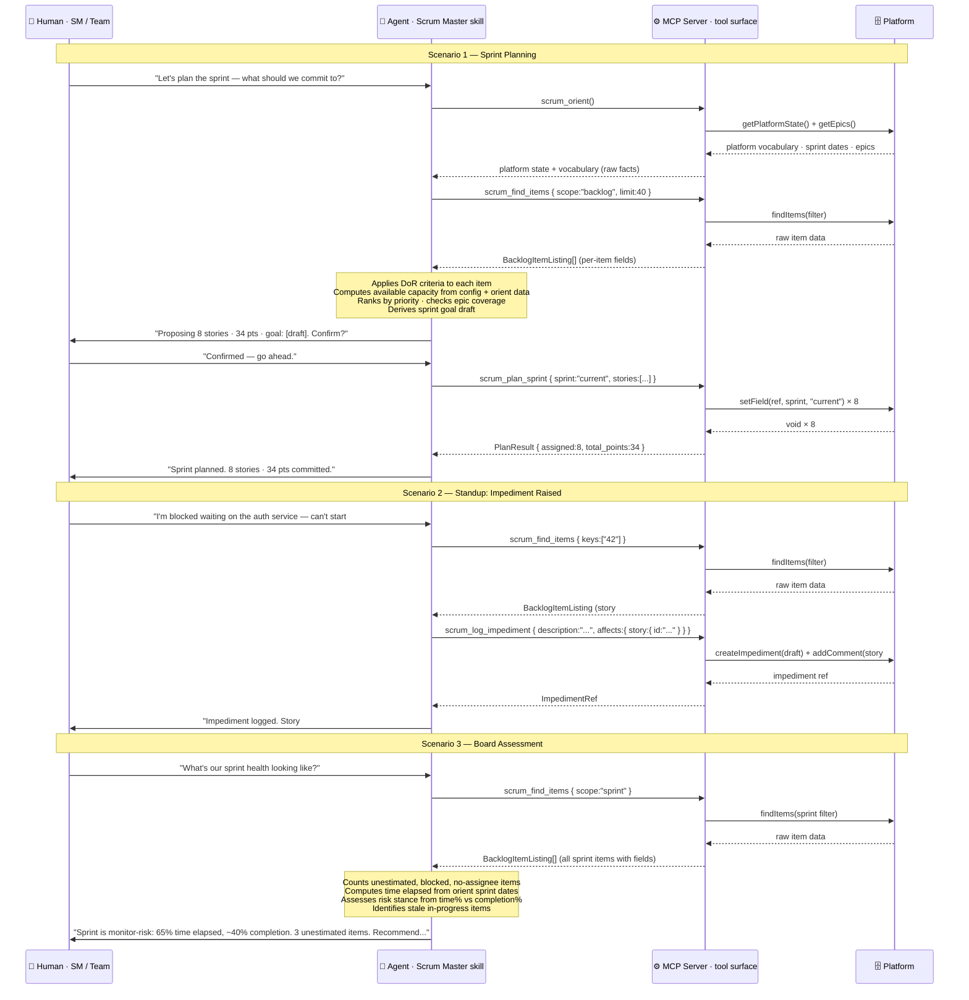
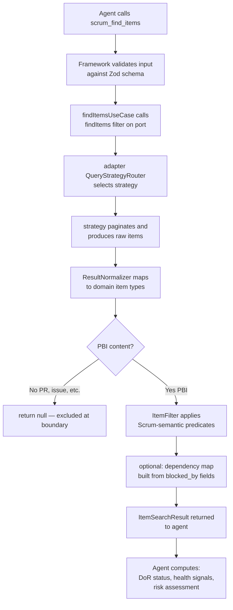
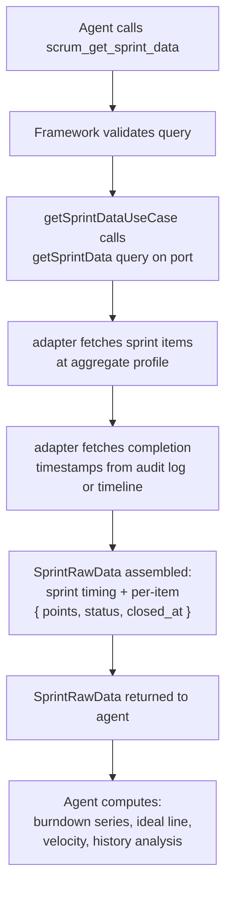
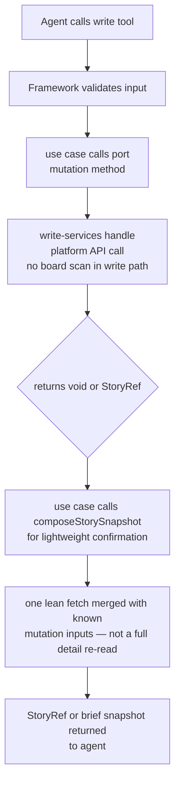

# Project Architecture

## Design Philosophy

### The Separation Line

This project has two distinct intelligence layers. Getting their boundary wrong is the most common structural failure in similar systems.

**The MCP server is a structured fact retriever.** It translates tool calls into platform API calls, normalizes the results into stable Scrum-vocabulary types, and returns raw data. It never applies Scrum rules, makes readiness judgments, or computes health assessments. It answers: *"What does the board say?"*

**The SM agent is the Scrum intelligence layer.** It receives raw facts from the server and applies Scrum domain knowledge: assessing sprint risk, evaluating readiness against DoR criteria, computing velocity from historical data, identifying impediment patterns, and coaching the team. It answers: *"What does the board mean, and what should we do about it?"*

The criterion for placing logic in a layer: **does this require Scrum judgment?** If yes — it belongs to the agent skill. If no (it is a data lookup, a field mapping, a pagination concern, or a structural extraction) — it belongs to the server.

This boundary is not a stylistic preference. It is a design invariant with concrete consequences for testability and adjustability:

- **Server tests** verify that the adapter returns the correct raw data for given platform state. No Scrum knowledge is needed to write or evaluate these tests.
- **Agent evaluations** verify that the agent makes correct SM decisions given specific raw data inputs. No server infrastructure is needed to run these evaluations.
- **Behavior adjustments** (tuning risk thresholds, updating DoR criteria, changing coaching posture) require changes only to the agent skill layer. No server deployment needed.

When computation that belongs to the agent accumulates in the server, agent behavior becomes opaque and non-adjustable without a server deployment. The skill file exists precisely so agent behavior can be tuned independently.

### Top-Down Development

Every design decision — tool surface, domain types, port methods, adapter implementation — is derived top-down from the agent's decision needs.

1. **Identify SM decisions** — what judgments does the Scrum Master make in this workflow?
2. **Derive minimal data** — what raw facts are needed to make each decision?
3. **Define tools** — what is the minimal tool surface that exposes those facts?
4. **Define use cases** — what orchestration is needed to assemble the data?
5. **Define domain types** — what shapes do the use cases produce and consume?
6. **Define the port** — what must the adapter implement to satisfy the use cases?
7. **Implement the adapter** — translate port methods into platform API calls.

This order prevents the most common inversion: starting with what the platform API offers and building upward, which inevitably shapes the tool surface around platform capabilities rather than SM needs.

---

## What is Scrum?

> If you are just getting started, think of Scrum as a way to get work done as a team in small pieces at a time, with continuous experimentation and feedback loops along the way to learn and improve as you go. Scrum helps people and teams deliver value incrementally in a collaborative way. As an agile framework, Scrum provides just enough structure for people and teams to integrate into how they work, while adding the right practices to optimize for their specific needs.
>
> [From Scrum.org](https://www.scrum.org/learning-series/what-is-scrum/)

---

## Canonic Domain Model

```mermaid
erDiagram

PROJECT {
	string id         PK "stored"
	string name          "stored"
	string vision        "stored?"
	enum   status        "stored: Active|Paused|Completed|Archived"
	date   start_date    "stored?"
	date   end_date      "stored?"
}

TEAM {
	string id         PK "stored"
	string project_id FK "stored"
	string name          "stored"
}

MEMBER {
	string id          PK "stored"
	string team_id     FK "stored"
	string platform_id    "stored"
	string name           "stored"
	string email          "stored?"
}

ROLE_ASSIGNMENT {
	string id         PK "stored"
	string member_id  FK "stored"
	string sprint_id  FK "stored"
	enum   role          "config: PO|SM|Developer"
}

SPRINT {
	string id               PK "stored"
	string project_id       FK "stored"
	string name                "stored"
	int    number              "stored"
	string goal                "stored?"
	date   start_date          "stored"
	date   end_date            "stored"
	int    committed_points    "stored"
	int    completed_points    "derived"
	enum   status              "stored: Planned|Active|Closed"
}

EPIC {
	string id         PK "stored"
	string backlog_id FK "stored"
	string title         "stored"
	string description   "stored?"
	int    rank          "stored"
	enum   priority      "stored?: Must|Should|Could|Wont"
	enum   status        "stored: Open|InProgress|Done"
}

USER_STORY {
	string id           PK "stored"
	string epic_id      FK "stored?"
	string title           "stored"
	string body            "stored"
	int    rank            "stored"
	int    story_points    "stored?"
	enum   status          "stored: Backlog|Ready|InSprint|Done|Blocked"
	enum   priority        "stored?: Must|Should|Could|Wont"
	string assignees       "stored?"
	string labels          "stored?"
}

SPRINT_BACKLOG_ITEM {
	string id               PK "stored"
	string sprint_id        FK "stored"
	string story_id         FK "stored"
	date   added_date          "stored"
	bool   carried_over        "stored"
	int    committed_points    "stored"
}

ACCEPTANCE_CRITERIA {
	string id         PK "agent"
	string story_id   FK "stored"
	string criterion     "agent"
	bool   passed        "agent"
}

IMPEDIMENT {
	string id            PK "stored"
	string sprint_id     FK "stored?"
	string story_id      FK "stored?"
	string raised_by     FK "stored?"
	string owner_id      FK "stored?"
	string description      "stored"
	date   raised_date      "stored"
	date   resolved_date    "stored?"
	enum   status           "stored: Open|InProgress|Resolved"
}

DEFINITION_OF_DONE {
	string id         PK "config"
	string project_id FK "config"
	string criterion     "config"
	string area          "config?"
	int    version       "config"
	date   last_updated  "config"
}

DEFINITION_OF_READY {
	string id         PK "config"
	string project_id FK "config"
	string criterion     "config"
	int    version       "config"
	date   last_updated  "config"
}

PRODUCT_BACKLOG {
	string id           PK "derived"
	string project_id   FK "stored"
	string product_goal    "config"
	date   last_refined    "agent"
}

TASK {
	string id           PK "stored"
	string story_id     FK "stored"
	string assignee_id  FK "stored?"
	string title           "stored"
	enum   type            "stored: Feature|Bug|TechDebt|Spike|Research"
	enum   status          "stored: Todo|InProgress|Blocked|Done"
	float  hours_estimate  "stored?"
	float  hours_actual    "stored?"
}

SPRINT_CONTEXT {
	string id               "derived"
	string name             "derived"
	string goal             "derived"
	int    duration_days    "derived"
	int    days_elapsed     "derived"
	int    days_remaining   "derived"
	int    time_elapsed_pct "derived"
	enum   risk_stance      "derived: normal|monitor|elevated"
}

BURNDOWN_ACTUAL {
	string sprint_id        FK "stored"
	date   date                "derived"
	string data_source         "stored: audit_log|comments"
	int    remaining_points    "derived"
	int    completed_points    "derived"
}

BURNDOWN_IDEAL {
	string sprint_id        FK "derived"
	date   date                "derived"
	int    remaining_points    "derived"
}

VELOCITY_RECORD {
	string sprint_id          FK "derived"
	string project_id         FK "derived"
	int    committed_points      "derived"
	int    completed_points      "derived"
	float  completion_ratio      "derived"
}

BACKLOG_HEALTH {
	string project_id              FK "derived"
	int    ready_count                "derived"
	int    not_ready_count            "derived"
	int    ungroomed_count            "derived"
	int    overall_ready_pct          "derived"
	int    open_impediment_count      "derived"
	int    orphan_impediment_count    "derived"
	int    unestimated_count          "derived"
	int    blocked_count              "derived"
	int    no_assignee_count          "derived"
}

MEMBER_CAPACITY {
	string id              PK "config"
	string member_id       FK "config"
	string sprint_id       FK "config"
	float  available_days     "config"
	int    capacity_points    "derived"
	string notes              "config?"
}

CEREMONY {
	string   id             PK "agent"
	string   sprint_id      FK "agent"
	string   facilitator_id FK "agent"
	enum     type              "agent: Planning|Standup|Review|Retro|Refinement"
	datetime scheduled_at      "agent"
	int      duration_min      "agent?"
	string   notes             "agent?"
}

CEREMONY_ATTENDANCE {
	string id          PK "agent"
	string ceremony_id FK "agent"
	string member_id   FK "agent"
	bool   attended       "agent"
}

STANDUP_ENTRY {
	string id             PK "agent"
	string ceremony_id    FK "agent"
	string member_id      FK "agent"
	date   date              "agent"
	string done_yesterday    "agent"
	string plan_today        "agent"
	string blockers          "agent?"
}

RETRO_ENTRY {
	string id          PK "agent"
	string ceremony_id FK "agent"
	string member_id   FK "agent"
	enum   category       "agent: WentWell|Improve|Start|Stop"
	string observation    "agent"
}

RETRO_ACTION {
	string id                PK "agent"
	string retro_entry_id    FK "agent"
	string created_sprint_id FK "agent"
	string target_sprint_id  FK "agent?"
	string owner_id          FK "agent"
	string description          "agent"
	enum   status               "agent: Open|Done|Deferred"
}

REVIEW_FEEDBACK {
	string id                 PK "agent"
	string sprint_id          FK "agent"
	string ceremony_id        FK "agent"
	string given_by              "agent"
	string feedback              "agent"
	string triggered_story_id FK "agent?"
}

SPRINT_REPORT {
	string id                    PK "agent"
	string sprint_id             FK "agent"
	string author_id             FK "agent"
	date   submitted_at             "agent"
	string summary                  "agent"
	string commitment_next_sprint   "agent?"
}

PROJECT ||--o{ TEAM : "has"
PROJECT ||--|| PRODUCT_BACKLOG : "owns"
PROJECT ||--o{ SPRINT : "runs"
PROJECT ||--o{ DEFINITION_OF_DONE : "defines"
PROJECT ||--o{ DEFINITION_OF_READY : "defines"

TEAM ||--o{ MEMBER : "includes"
MEMBER ||--o{ ROLE_ASSIGNMENT : "holds"
SPRINT ||--o{ ROLE_ASSIGNMENT : "scopes"
SPRINT ||--o{ MEMBER_CAPACITY : "allocates"
MEMBER ||--o{ MEMBER_CAPACITY : "declared for"

PRODUCT_BACKLOG ||--o{ EPIC : "contains"
EPIC ||--o{ USER_STORY : "breaks into"
USER_STORY ||--o{ ACCEPTANCE_CRITERIA : "yields"
USER_STORY ||--o{ SPRINT_BACKLOG_ITEM : "pulled into"
SPRINT ||--o{ SPRINT_BACKLOG_ITEM : "contains"

USER_STORY }o--o{ IMPEDIMENT : "may cause"
SPRINT }o--o{ IMPEDIMENT : "may threaten"
MEMBER ||--o{ IMPEDIMENT : "owns"

USER_STORY ||--o{ TASK : "decomposed into"
MEMBER ||--o{ TASK : "assigned"

SPRINT ||--|| SPRINT_CONTEXT : "yields"
SPRINT ||--o{ BURNDOWN_ACTUAL : "tracked by"
SPRINT ||--o{ BURNDOWN_IDEAL : "projected by"
SPRINT ||--o{ VELOCITY_RECORD : "contributes to"
PROJECT ||--|| BACKLOG_HEALTH : "assessed by"

SPRINT ||--o{ CEREMONY : "schedules"
SPRINT ||--|| SPRINT_REPORT : "documented in"
CEREMONY ||--o{ CEREMONY_ATTENDANCE : "records"
CEREMONY ||--o{ STANDUP_ENTRY : "captures"
CEREMONY ||--o{ RETRO_ENTRY : "captures"
CEREMONY ||--o{ REVIEW_FEEDBACK : "captures"
MEMBER ||--o{ CEREMONY_ATTENDANCE : "attends"
RETRO_ENTRY ||--o{ RETRO_ACTION : "generates"
MEMBER ||--o{ RETRO_ACTION : "owns"
USER_STORY }o--o| REVIEW_FEEDBACK : "may trigger"
SPRINT_REPORT }o--|| MEMBER : "authored by"
```



### Persistence Tiers

Every entity in the diagram belongs to one of five tiers. The tier determines who produces the data, whether it can be stale, and whether any MCP tool has a write path to it.

| Tag | Tier | Who produces it |
|---|---|---|
| `stored` | Platform-Persisted | Lives in the backend API. Fetched by the adapter. Values may be stale between calls; the adapter is the authoritative source. |
| `derived` | Agent-Derived | Computed by the SM agent from raw `stored` facts. Never returned by the server; always calculated by the agent on demand. |
| `config` | Local-Config | Declared in `config.yml` or sidecar files. Read by the server at startup or on demand. The human edits these directly; no MCP write tool targets them. |
| `agent` | Agent-Managed | Produced or authored by the agent during Scrum ceremonies or reasoning. Stored in the team's chosen ceremony backend. Outside MCP server scope entirely. |

The critical distinction between `stored` and `derived`: the server exposes `stored` data as raw facts. `derived` data is produced by the agent applying Scrum reasoning to those facts. The server never computes `derived` values.

### Field Annotation Legend

| Tag | Meaning |
|---|---|
| `stored` | Retrieved from the backend as-is. |
| `stored?` | Retrieved; may be null or unset on the platform. |
| `derived` | Computed by the agent from raw stored facts; never returned by the server. |
| `config` | Read from `config.yml`; no MCP write path exists. |
| `config?` | Config-sourced; optional field. |
| `agent` | Produced by agent reasoning or ceremony facilitation; not the server's responsibility. |
| `agent?` | Agent-produced; optional. |

### Design Notes

**SPRINT_CONTEXT** is fully `derived`. The raw inputs — `start_date`, `end_date`, `duration_days` — are `stored` on the SPRINT entity. The agent computes `days_elapsed`, `days_remaining`, `time_elapsed_pct`, and `risk_stance` from those raw dates and from sprint item state. The server does not return a SPRINT_CONTEXT object; it returns the underlying SPRINT facts from which the agent constructs context.

**BACKLOG_HEALTH** is fully `derived`. Every count and percentage in it (ready items, unestimated items, blocked items, impediment counts, readiness percentage) is an aggregation the agent computes from `BacklogItemListing` data returned by `scrum_find_items`. The server returns per-item facts; the agent derives board-level health signals.

**BURNDOWN_ACTUAL and BURNDOWN_IDEAL** are `derived`. The server exposes raw per-story data including completion timestamps (when available from the platform audit log or timeline). The agent uses these raw timestamps to plot the actual burndown series and compute the ideal line. The server never produces a burndown chart or series — it provides the inputs for one.

**VELOCITY_RECORD** is `derived`. Velocity is an agent calculation over completed sprint histories. The server provides raw sprint data (items, points, completion times via `scrum_get_sprint_data`). The agent aggregates across historical sprints to derive velocity. The server has no velocity concept.

**ACCEPTANCE_CRITERIA** is `agent`. The agent parses acceptance criteria from `USER_STORY.body` text using its own natural-language understanding. The server returns the raw `body` field; it does not extract, structure, or evaluate acceptance criteria.

**SPRINT.completed_points** is `derived`. It is a rollup the agent computes from the per-story status data in a sprint listing — not a field the server independently tracks or returns.

**PRODUCT_BACKLOG** is not a stored entity on most platforms. It is a logical container the adapter implements as a filtered projection (items where sprint = null). Its `last_refined` field is agent-tracked from ceremony activity.

**USER_STORY.body** contains the user-story narrative, acceptance criteria checklist, and dependency annotations as human-authored markdown. The agent interprets the body structure. The server returns the body as raw text without parsing it.

**IMPEDIMENT** has two nullable foreign keys: `sprint_id` and `story_id`. At least one must be set for a linked impediment. When both are null, the record is a project-level orphan requiring SM triage. The tool surface enforces this through the `affects` argument on `scrum_log_impediment`.

**CEREMONY, STANDUP_ENTRY, RETRO_ENTRY, RETRO_ACTION, REVIEW_FEEDBACK, and SPRINT_REPORT** are all agent-managed. The MCP server has no read or write path for any of them. They appear in the model because they are part of the full Scrum workflow the agent orchestrates, not because the server handles them.

**TASK** is a V2 domain intent, not implemented in V1. V1 flattens all work into USER_STORY items. The entity appears in the model because it belongs to the domain and will be needed when the tool surface is extended.

**MEMBER_CAPACITY** is config-declared and agent-derived. The human declares available days in `config.yml`; the agent derives capacity points from declared days and observed velocity.

---

## Tool Surface

### Architecture Diagram

The diagram traces the call path from the MCP tool surface through the use-case layer to the abstract adapter interface. The use-case layer is a thin coordination shell — its role is to validate input, orchestrate port calls, and return raw structured data. All Scrum reasoning lives in the agent layer above the tool surface.

```mermaid
flowchart TD
    subgraph FRAMEWORK["Framework Layer · MCP Tool Surface"]
        subgraph READ_TOOLS["Read Tools"]
            F_orient["scrum_orient<br/>∅ → platform state + vocabulary"]
            F_find["scrum_find_items<br/>ItemFilter → item listings"]
            F_detail["scrum_get_item_detail<br/>StoryRef → item with body + comments"]
            F_sprint["scrum_get_sprint_data<br/>SprintQuery → raw sprint items + completion times"]
            F_template(["scrum://template/{type}<br/>URI param → string"])
        end
        subgraph WRITE_TOOLS["Write Tools"]
            F_create["scrum_create_story<br/>StoryDraft → StoryRef"]
            F_update["scrum_update_story<br/>StoryRef + Patch → StoryRef"]
            F_set["scrum_set_field<br/>StoryRef + Field + Value → StoryRef"]
            F_plan["scrum_plan_sprint<br/>SprintRef + StoryRef[] → PlanResult"]
            F_log_imp["scrum_log_impediment<br/>ImpedimentDraft → ImpedimentRef"]
            F_upd_imp["scrum_update_impediment<br/>ImpedimentRef + Status → ImpedimentListing"]
            F_vocab["scrum_add_vocabulary<br/>VocabKind + Value → CreateResult"]
        end
    end

    subgraph USE_CASE["Use-Case Layer · Thin Coordination Shell"]
        U_orient["orientUseCase<br/>fetch platform state<br/>fetch active epics<br/>build template URI map"]
        U_find["findItemsUseCase<br/>resolve numeric keys to refs<br/>delegate to adapter findItems<br/>opt: request dependency map"]
        U_detail["getItemDetailUseCase<br/>delegate to adapter getStoryDetail<br/>return raw body + comments + artifacts"]
        U_sprint["getSprintDataUseCase<br/>delegate to adapter getSprintData<br/>return raw sprint items + timestamps"]
        U_template["templateUseCase<br/>load template file from config path"]
        U_create["createStoryUseCase<br/>create item then set board fields<br/>return StoryRef"]
        U_update["updateStoryUseCase<br/>diff deps and sync block links"]
        U_set["setFieldUseCase<br/>resolve SprintRef or vocab key<br/>write single board field"]
        U_plan["planSprintUseCase<br/>bulk-assign stories to sprint"]
        U_log_imp["logImpedimentUseCase<br/>create impediment story<br/>opt: comment on affected story"]
        U_upd_imp["updateImpedimentUseCase<br/>set status and resolution notes"]
        U_vocab["addVocabUseCase<br/>idempotent: add field option or label"]
    end

    subgraph ADAPTER["Adapter Interface · BackendPort"]
        subgraph ADAPTER_READ["Read"]
            A_state["getPlatformState()"]
            A_epics["getEpics()"]
            A_items["findItems(filter)"]
            A_detail["getStoryDetail(ref)"]
            A_sprint["getSprintData(query)"]
            A_imps["getOrphanImpediments()"]
            A_file["fetchContent(location)"]
        end
        subgraph ADAPTER_WRITE["Write"]
            A_create["createStory(input)"]
            A_update["updateStory(ref, updates)"]
            A_field["setField(ref, field, value)"]
            A_log_imp["createImpediment(input)"]
            A_upd_imp["updateImpediment(ref, update)"]
            A_comment["addComment(ref, body)"]
            A_vocab["addVocabulary(kind, value)"]
        end
    end

    F_orient --> U_orient
    F_find --> U_find
    F_detail --> U_detail
    F_sprint --> U_sprint
    F_template --> U_template
    F_create --> U_create
    F_update --> U_update
    F_set --> U_set
    F_plan --> U_plan
    F_log_imp --> U_log_imp
    F_upd_imp --> U_upd_imp
    F_vocab --> U_vocab

    U_orient --> A_state
    U_orient --> A_epics
    U_find --> A_items
    U_detail --> A_detail
    U_sprint --> A_sprint
    U_template --> A_file
    U_create --> A_create
    U_create -.-> A_field
    U_update --> A_update
    U_update -.-> A_field
    U_set --> A_field
    U_plan -.-> A_items
    U_plan --> A_field
    U_log_imp --> A_log_imp
    U_log_imp -.-> A_comment
    U_upd_imp --> A_upd_imp
    U_vocab --> A_vocab
```



### Layer Reference

**Framework Layer** is the MCP protocol boundary. Each tool is a named function with a Zod-validated input schema and a typed return shape. The framework layer performs no business logic — it validates input, delegates to the use-case layer, and serialises the result. `scrum://template/{type}` is a URI-addressed MCP resource, not a callable tool.

**Use-Case Layer** is a thin coordination shell. Use cases receive validated input from the framework layer, call port methods to fetch raw platform data, and return structured results. They do not apply Scrum rules, compute health scores, or assess readiness. Use cases never import adapter implementations — they depend only on the port interface.

**Adapter Interface (BackendPort)** is the abstract contract declaring the minimum read/write surface needed to back the entire tool set. A concrete adapter translates these calls into platform-specific API calls. A different backend (Notion, Trello, Gitea) implements the same interface without touching the use-case or framework layers.

| Arrow type | Meaning |
|---|---|
| Solid `-->` | The use case always calls this adapter method |
| Dashed `-.->` | The use case calls this adapter method only under a specific condition |

### Tool Reference

| Tool | What the agent provides | What the server returns | Agent's job |
|---|---|---|---|
| `scrum_orient` | — | Platform vocabulary, sprint timing (raw dates), active epics | Build sprint context, detect vocabulary gaps |
| `scrum_find_items` | Filter (scope, type, status, etc.) | Per-item listings with fields (no body) | Count, assess DoR, identify risks |
| `scrum_get_item_detail` | Item reference | Item with full body, comments, linked artifacts | Parse AC, evaluate DoD, assess quality |
| `scrum_get_sprint_data` | Sprint reference + history window | Sprint items with raw completion timestamps | Compute burndown, derive velocity, spot trends |
| `scrum_create_story` | Draft item fields | Item reference | Confirm creation, offer next action |
| `scrum_update_story` | Item reference + field changes | Item reference | Confirm field state |
| `scrum_set_field` | Item ref + field name + value | Item reference | Confirm field state |
| `scrum_plan_sprint` | Sprint ref + item refs | Assignment count + total points | Report commitment, surface any readiness gaps |
| `scrum_log_impediment` | Description + affects context | Impediment reference | Confirm impediment logged, recommend escalation |
| `scrum_update_impediment` | Impediment ref + new status | Updated impediment listing | Confirm resolution or escalation |
| `scrum_add_vocabulary` | Kind + value | Create result | Confirm gap filled |

---

## Agent Behavior

### Sequence Diagram

The diagram shows the agent's interaction pattern across three representative Scrum workflows.



### Division of Responsibilities

| Layer | Owns |
|---|---|
| Human | Intent, domain knowledge, approval of destructive actions |
| Agent skill | Scrum rules, ceremony facilitation, health assessment, risk computation, readiness evaluation, AC parsing, velocity calculation, coaching, natural-language synthesis |
| MCP Server | Input validation, data fetching, response structuring, platform abstraction |
| Platform adapter | CRUD translation to platform API; ID resolution; field mapping; pagination |

**What the agent computes that the server never touches:**

- Sprint risk stance (time elapsed % vs. work completion %)
- Backlog health scores (readiness %, unestimated count, blocked count)
- Acceptance criteria (parsed from story body text)
- Velocity (averaged from historical sprint completion data)
- Burndown series (derived from per-story completion timestamps)
- Ideal burndown line (arithmetic from committed points + sprint duration)
- DoR compliance per item (evaluated against DoR criteria from config)
- Capacity planning (available days × focus factor × velocity-derived SP/day)

---

## Server Architecture

### Layer Model

The server has four concentric layers. The **Dependency Rule** governs all of them: source-code imports point inward only. An inner layer never names, imports, or depends on anything declared in an outer layer.

```
┌─────────────────────────────────────────────────────────────┐
│  Framework Layer                                            │
│  MCP tool surface · Zod validation · result serialization   │
│  ┌───────────────────────────────────────────────────────┐  │
│  │  Use-Case Layer                                       │  │
│  │  thin coordination shells · one per tool              │  │
│  │  ┌─────────────────────────────────────────────────┐  │  │
│  │  │  Port Interface  (BackendPort)                  │  │  │
│  │  │  declared in use-case layer · owned here        │  │  │
│  │  │  Scrum vocabulary only · no platform types      │  │  │
│  │  │  ┌───────────────────────────────────────────┐  │  │  │
│  │  │  │  Adapter Layer                            │  │  │  │
│  │  │  │  concrete backend implementation          │  │  │  │
│  │  │  │  (GitHub, Trello, Notion, Gitea, …)       │  │  │  │
│  │  │  └───────────────────────────────────────────┘  │  │  │
│  │  └─────────────────────────────────────────────────┘  │  │
│  └───────────────────────────────────────────────────────┘  │
└─────────────────────────────────────────────────────────────┘
```

**Framework Layer** — MCP tool registration, Zod input validation, result serialization. No business logic. A tool handler validates input, delegates to a use case, and serializes the result. The framework layer may import use cases and domain types; it must never import adapter implementations.

**Use-Case Layer** — Thin coordination shells. One use case per tool. Each use case calls one or more port methods to fetch raw data and returns a structured result. No Scrum rules, no health computation, no reasoning. Use cases are the boundary where "input validation ends" and "adapter data begins." They never import any adapter class or adapter-internal type.

**Port Interface (BackendPort)** — The contract between the use-case layer and the adapter. Declared and owned by the use-case layer — implementations depend on it, not the other way around. Expressed entirely in Scrum vocabulary: all parameter and return types are drawn from the domain model. No platform IDs, GraphQL nodes, REST response shapes, or platform-specific enums appear on either side.

**Adapter Layer** — Translates each port method into one or more API calls against the backend platform. All query documents, endpoint strings, ID resolution, pagination logic, and response normalization live here. No Scrum rule is applied; the adapter returns facts. Replacing GitHub with Trello means replacing the adapter directory; all layers above it are unchanged.

### Source-Code Structure

```
src/
├── domain/                  # Entity types and vocabulary — no runtime logic
│   ├── types file           # Stored and server-returnable entity shapes only
│   │                          (items, epics, sprints, impediments, artifacts)
│   │                          No derived types (no health scores, no burndown series)
│   ├── config schema        # Config file structure
│   └── error types          # Domain error taxonomy
│
├── scrum/                   # Use-case layer
│   ├── ports file           # BackendPort interface — owned here
│   ├── results file         # UseCaseResult wrapper — use-case infrastructure
│   ├── responses file       # Orient output shape — use-case output type
│   ├── orient               # One file per MCP read tool
│   ├── find-items
│   ├── get-item-detail
│   ├── get-sprint-data
│   ├── update-impediment
│   ├── config-boot          # Config loading — server startup concern
│   └── utils/               # Shared computation helpers (not use cases)
│       ├── listing-mappers  # Story entity → listing projection
│       ├── template helpers
│       └── I/O utilities
│
├── schemas/                 # Zod schemas for tool inputs
│
├── tools/                   # Framework layer
│   ├── read tool registrations
│   ├── write tool registrations
│   └── handlers/
│
├── services/                # Cross-cutting infrastructure (logging, error handling)
│
└── adapters/
    ├── abstract base utilities
    ├── capability declarations      # NATIVE / EMULATED / UNAVAILABLE per feature
    ├── adapter factory
    ├── _shared/                     # Platform-agnostic test infrastructure
    └── {platform}/                  # One directory per backend
        ├── backend                  # Concrete BackendPort implementation
        ├── mappers                  # Platform wire types → domain types
        ├── bootstrap                # Platform boot state (field IDs, iteration cache)
        ├── query-pipeline/          # Board scan loop, caching, pagination
        ├── query-strategies/        # findItems routing + result normalization
        ├── read-services/           # Data aggregation services
        ├── write-services/          # Mutation services
        └── infra/                   # API client, ref resolution — no business logic
```

**Key structural rule for `domain/`:** every export should be a type declaration or a vocabulary constant. No runtime computation. The test: `domain/types` should compile to zero executable JavaScript. Vocabulary constants (`ITEM_TYPES`, `SCRUM_FIELDS`, etc.) that exist as `z.enum()` sources are acceptable; they are declarations, not logic.

**Key structural rule for `scrum/` root:** every file is either the port interface, a use case (one per MCP tool), or one of the two structural files (`results`, `responses`). Utilities move into `scrum/utils/`. This makes the root a table of contents for the tool surface.

### Adapter Subfolder Contract

The five subfolders define a backend-agnostic structural vocabulary. The names describe role, not mechanism — so a REST backend and a GraphQL backend express the same architecture in the same terms.

| Subfolder | Responsibility | Must NOT |
|---|---|---|
| `query-pipeline/` | Owns the board-scan loop: query building, caching, pagination | Be imported by anything except `query-strategies/` and `read-services/` (via the coordinator) |
| `query-strategies/` | Routes `findItems` to the appropriate fetch strategy; normalizes raw pages to domain item types | Import `read-services/` or `write-services/` |
| `read-services/` | Aggregates platform data via the coordinator; no direct pagination | Import the paginator directly; import `write-services/` |
| `write-services/` | Mutations only — create, update, set field | Import `query-pipeline/` |
| `infra/` | API client, context, ref resolution — no business logic | Import any service folder |

Files at the adapter root (`backend`, `types`, `mappers`, `bootstrap`) are the adapter's shared vocabulary, imported across all five subfolders. They are not part of any one subfolder's responsibility.

**Example: Trello adapter.** Structure is identical; only implementations differ. REST replaces GraphQL. There are no query documents — endpoint strings live inline in strategies and services. Absence of a query document file at the Trello root is expected and correct. Capability differences (no native sprints, no audit log) are declared using the `NATIVE / EMULATED / UNAVAILABLE` system.

### Query Pipeline Pattern

The query pipeline is the universal abstraction for "fetch all items matching a filter from the board." It exists because platform APIs offer limited server-side filtering — sprint filters, story-point filters, and custom-field filters must be applied client-side after paginating through all items.

```
ResolvedItemFilter
       │
       ▼
QueryStrategyRouter ──── selects strategy based on filter shape
       │
       ├── DirectLookupStrategy   (keys[] provided — fetch by ID, no board scan)
       ├── SearchStrategy         (text / label / assignee — platform search API)
       └── BoardScanStrategy      (general filter — paginate full board)
                │
                ▼
       QueryBuilder ──── produces query + variables for the target profile
         profile: "listing"    full item content  (title, body, labels, assignees)
         profile: "aggregate"  minimal field values  (status, points, sprint, assignee)
                │
                ▼
       ExecutionEngine ──── paginates; respects page ceiling; yields raw pages
                │
                ▼
       ResultNormalizer ──── raw page → domain item types  (via mappers)
         Non-PBI content types (PRs, MRs) return null here — never reach filters
                │
                ▼
       ItemFilter ──── client-side predicate on Scrum-semantic fields only
                │
                ▼
       AssemblerOutput { items, scope_summary, dependency_map, warnings }
```

**Query profiles** reduce payload by selecting only the fields each caller consumes. The aggregate profile carries 60–80% less data than the listing profile and is used for all non-listing scans (sprint history, completion data).

### BackendPort Contract

The port interface is the only coupling between the use-case layer and the adapter. It is expressed entirely in Scrum vocabulary. No platform-specific type, field ID, or API concept appears in any parameter or return position.

**Read methods:**

| Method | Purpose | Returns |
|---|---|---|
| `getPlatformState(vocabulary)` | Fetch field presence, vocabulary options, sprint iterations | Platform state with vocabulary gaps |
| `getEpics(sprintRef?)` | Fetch epic listings | Epic list with open-item counts |
| `findItems(filter)` | Fetch item listings matching filter | Item listings |
| `getStoryDetail(ref)` | Fetch full item with body and timeline | Item with comments and linked artifacts |
| `getSprintData(query)` | Fetch sprint items with completion timestamps | Raw sprint data for agent-side analytics |
| `getOrphanImpediments()` | Fetch impediments not linked to any story | Impediment listings |
| `fetchContent(location)` | Fetch file or inline content for templates | Raw string content |

**Write methods:**

| Method | Purpose | Returns |
|---|---|---|
| `createStory(input)` | Create a new board item | Item reference |
| `createImpediment(input)` | Create a labeled impediment item | Impediment reference |
| `updateStory(ref, updates)` | Update item content fields | void |
| `setField(ref, field, value)` | Set a single board field | void |
| `addComment(ref, body)` | Append a comment to an item | void |
| `updateImpediment(ref, update)` | Update impediment status | Updated impediment listing |
| `addVocabulary(kind, value)` | Add a field option or label | Create result |

**`getSprintData`** replaces the former `getAnalytics` and `getBoardHealth` patterns. It returns raw per-item sprint data including completion timestamps when available from the platform (audit log, timeline). The agent uses this to compute burndown, velocity, and history. The adapter handles the platform-specific complexity of obtaining completion timestamps; the server never plots or aggregates this data.

**Write methods return void or a lightweight reference.** They do not return a full story. The framework layer constructs the response from mutation inputs plus a single lean snapshot fetch. This avoids the post-mutation re-read penalty of full item fetches after every write.

### Data Flow

**Read path — item listing (`scrum_find_items`):**



**Read path — sprint analytics (`scrum_get_sprint_data`):**



**Write path (`scrum_set_field`, `scrum_update_story`, `scrum_create_story`):**



---

## Architectural Invariants

These invariants encode the boundaries that must hold regardless of which backend is implemented, which features are added, or how the codebase is refactored. When a proposed change seems to require violating one of these rules, that is evidence the change is being made at the wrong layer.

---

### Invariant 1 — Dependency Rule

**Rule:** Source-code imports point inward only.

- `domain/` imports nothing from `scrum/`, `adapters/`, `tools/`, or `services/`
- `scrum/` imports `domain/` only; never `adapters/` or `tools/`
- `adapters/` imports `domain/` and the port interface; never `tools/`
- `tools/` imports `scrum/` and `domain/`; never adapter implementations

**Violation pattern:** When use cases import adapter implementations, a change to the backend API surface cascades through the use-case layer and into tests that have nothing to do with that backend. The port interface must be the only coupling between the two sides.

---

### Invariant 2 — Server Returns Facts; Agent Applies Judgment

**Rule:** The server exposes raw platform data structured as domain types. It does not evaluate, score, compute health, assess readiness, parse body text, or make recommendations. Every value the server returns must be directly answerable from platform data without Scrum reasoning.

**The test:** can this value be retrieved from the platform API through field lookups, pagination, and normalization — without knowing what it means in Scrum? If yes → server can return it. If Scrum knowledge is required to produce the value → it belongs to the agent.

Examples of values the server returns: item status, story points, sprint name, assigned users, labels, sprint start and end dates, completion timestamps from the audit log, epic names, impediment descriptions.

Examples of values the agent derives: readiness verdict, risk stance, velocity, burndown series, backlog health score, whether an item needs attention, what the team should commit to.

**Violation pattern:** Pre-computing board health, risk stance, burndown series, or readiness percentages in the server. These values require Scrum judgment. When the server pre-computes them, agent behavior becomes opaque (users cannot understand why the agent made a decision) and non-adjustable (changing a threshold requires a server deployment).

---

### Invariant 3 — PBI Boundary

**Rule:** Only Product Backlog Items — Issues and Draft Issues — may become domain item objects. Platform implementation artifacts (Pull Requests, Merge Requests, review threads) are excluded at the adapter mapper before they reach any domain type. A PR content node returns null from the mapper; it never reaches the filter, the normalizer, or the use-case layer.

Implementation artifacts are accessible through `scrum_get_item_detail` as linked artifacts on the story. The agent reads their state and dispatches PR actions to a dedicated Git MCP tool. The SM server never manages PRs as backlog items.

**Violation pattern (Issue #214):** A PR leaked into the item list and produced a content-type guard in the filter layer. Guards for platform content types in the filter are a diagnostic signal that the mapper admitted something it should not have. The correct fix is always upstream at the mapper, never in the filter.

---

### Invariant 4 — StoryKind Is a Scrum Discriminant

**Rule:** `StoryKind` has exactly two values: `"issue"` (a PBI backed by a platform issue) and `"draft"` (a PBI that exists only as a draft board entry). This discriminant answers a Scrum-semantic question: "does this item have a platform issue backing it?" Code that checks for platform content types (`PullRequest`, `__typename`, etc.) is operating at the wrong layer.

**Violation pattern:** A `kind: "pull_request"` value documented as valid in the domain type system. Platform artifact types are not Scrum discriminants; they should never appear as a valid `StoryKind`.

---

### Invariant 5 — Filter Semantic Purity

**Rule:** The item filter predicates on Scrum-semantic fields only: status, sprint, story points, type, priority, assignee, labels, epic, estimated, and search text. It never checks for platform content types, `__typename` values, or adapter-internal properties.

Any filter predicate that names a platform concept is a diagnostic signal: the wrong layer is doing the work. The correct fix is always upstream at the mapper.

**Consequence for multi-backend:** the filter is platform-agnostic by construction. A Trello adapter produces domain item objects (all cards are `kind: "issue"`), and the filter works without modification.

---

### Invariant 6 — Query Pipeline Monopoly

**Rule:** All board-scan operations go through the query pipeline as the sole entry point. No read service, use case, or assembler calls the paginator or issues a board-scan query directly. This is mechanically enforced by a dep-cruiser rule: only the cache layer inside `query-pipeline/` may import the paginator.

**Violation pattern:** Independent services each issuing their own full board scan for the same session. A single SM session touching orient, sprint data, and item listing should never trigger more full board scans than the number of distinct queries those tools require. The pipeline monopoly eliminates redundant scans structurally.

---

### Invariant 7 — Query Profile Discipline

**Rule:** Sprint data collection (for agent-side analytics) uses the aggregate query profile — minimal field values, no body content. Item listings for the agent use the full listing profile. The profiles must never be swapped: using the listing profile for sprint aggregation wastes bandwidth and context window; using the aggregate profile for item listings produces incomplete output.

**Consequence:** the adapter's sprint data service always uses the aggregate profile. The `findItems` strategy always uses the listing profile. Profile selection is not a use-case decision — it is hardcoded to each service's purpose.

---

### Invariant 8 — Tool Surface Stability

**Rule:** Tool names and parameter shapes are the contract with the agent skill. No breaking changes without a migration path. All internal restructuring — adapter refactoring, query profile changes, folder reorganization, port interface changes — must be invisible at the `scrum_*` tool surface.

**Consequence:** performance improvements, architectural refactors, and backend changes produce no changes to any tool schema. The agent skill requires no update when the server is refactored.

---

### Invariant 9 — Port Owned by Use Cases

**Rule:** The BackendPort interface is declared and owned by the use-case layer. Adapter implementations depend on this interface. The interface is shaped by what use cases need, not by how many internal services back it.

A port method that maps 1:1 to an internal adapter service is evidence the adapter is shaping the port. When this happens, the port stops being an abstraction and becomes a thin facade over the implementation.

**Violation pattern:** Separate `getBoardHealth`, `getAnalytics`, and `getSprintCompletion` port methods, each a thin wrapper over an internal service. The port was shaped by the implementation's service structure rather than by the use-case layer's data needs.

---

### Invariant 10 — Mapper Is the Platform Boundary

**Rule:** `mappers` is the sole place in the adapter that knows about platform wire types. Everything downstream processes domain types; everything upstream processes domain types. The mapper is the single translation point and must not be bypassed.

Corollary: all content-type guards belong in the mapper. If a platform content node should not produce a domain object, the mapper returns null. No downstream consumer needs to know this rule.

**Violation pattern:** Content-type guards distributed across the filter, the normalizer, and a projection layer. Each consumer independently had to remember which platform content types are valid PBIs. Any consumer that forgot would silently produce incorrect output.

---

## Adding a New Backend Adapter

To add a backend (Trello, Notion, Linear, Gitea, etc.), implement the `BackendPort` contract under a new adapter directory. The use-case layer, tool surface, schemas, domain types, and agent skill require no changes.

**Step 1 — Create `src/adapters/{platform}/`** with the five subfolder contract. Follow the folder structure exactly; dep-cruiser rules will validate it automatically.

**Step 2 — Declare capabilities** in the adapter factory using `NATIVE / EMULATED / UNAVAILABLE` flags. Use-case behavior branches on capability flags, not on adapter-specific types. If the platform lacks native sprint iteration, declare sprint as `EMULATED` and derive sprint grouping from a list or label convention in the adapter. The use case sees a `SprintRef` regardless.

**Step 3 — Implement `mappers`** to translate platform wire types to domain item types (`Story`, `EpicListing`, `ImpedimentListing`, etc.). All wire-format knowledge stays here. Key constraints:
- All domain item objects must have `kind: "issue"` or `kind: "draft"`. No other values.
- Implementation artifacts (PRs, MRs) must return `null` from the item mapper. They are never domain objects.
- The mapper for aggregate queries may omit fields not needed by the aggregate profile (body, labels).

**Step 4 — Implement `query-pipeline/`** with a query builder that supports listing and aggregate profiles, an execution engine that paginates using the platform's cursor or offset mechanism, and a cache. For REST backends, query building means constructing URL parameters and selecting response fields — no query documents.

**Step 5 — Implement `query-strategies/`** with a strategy router that dispatches to direct lookup (when item references are provided), search (when a text query is provided), and board scan (general filter). Each strategy produces raw pages; the result normalizer maps them to domain types via the mapper.

**Step 6 — Implement `read-services/`** against the query pipeline coordinator entry point. Read services must not import the paginator directly. Implement `getSprintData` here: fetch sprint items at aggregate profile, retrieve completion timestamps from whatever source the platform offers (audit log, card-move events, closed-at timestamps), and return `SprintRawData` — not a computed burndown series.

**Step 7 — Implement `write-services/`** for platform mutation APIs. Write services must not import `query-pipeline/`.

**Step 8 — Implement `backend`** as the concrete `BackendPort`. Wire the services. Implement all port methods. For platforms without native sprint support, implement sprint emulation entirely here — no Scrum logic escapes into the use-case layer.

**Step 9 — Register in the adapter factory** with the platform key matching the `backend.[key]` field in `config.yml`. Add the platform key to the supported backends vocabulary.

**Verifying the contract:** Run dep-cruiser against the new adapter directory. The query pipeline monopoly rule, the read-services coordinator rule, and the write-services isolation rule all apply automatically to any adapter path. No new rules are needed.
