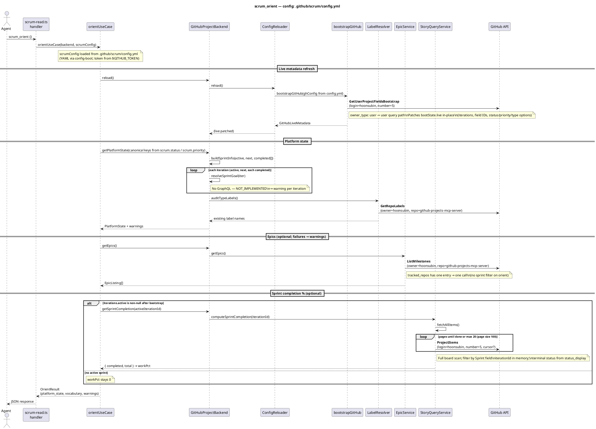
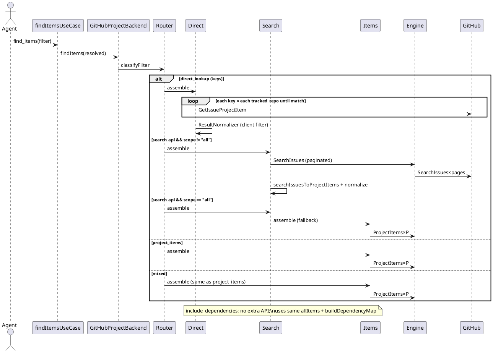
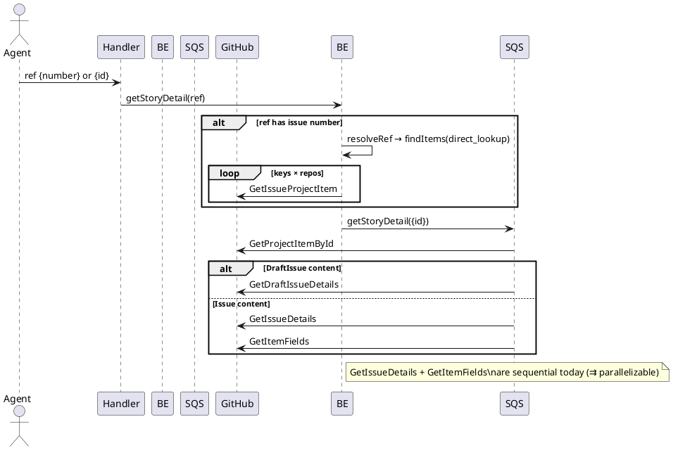
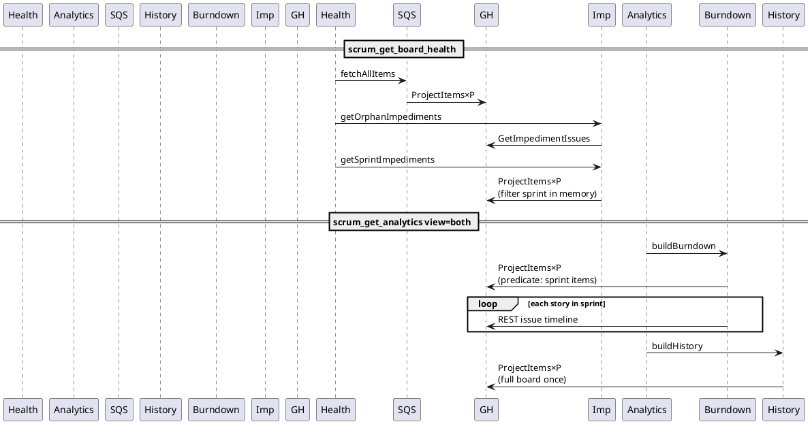
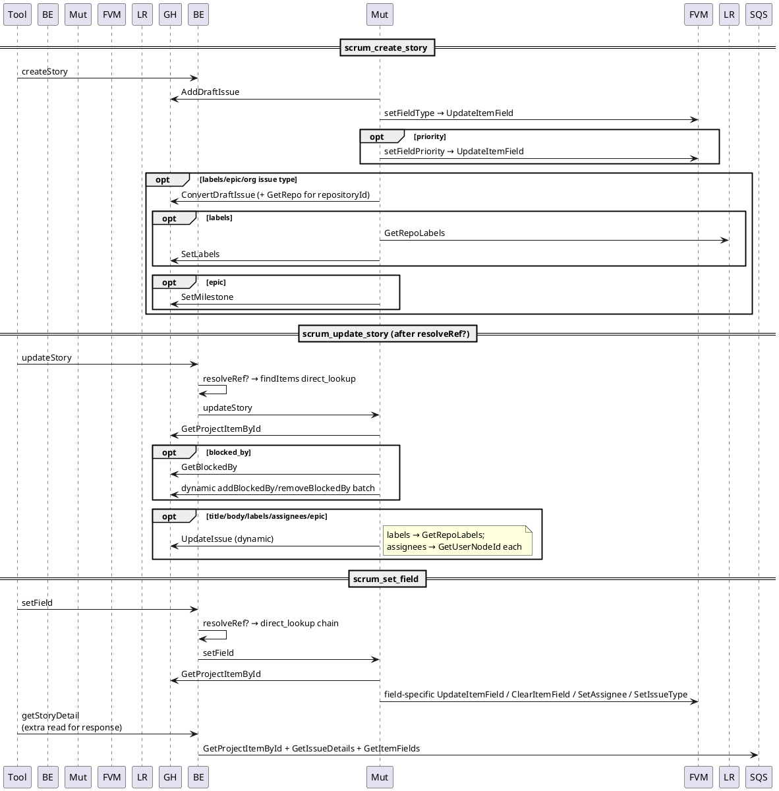
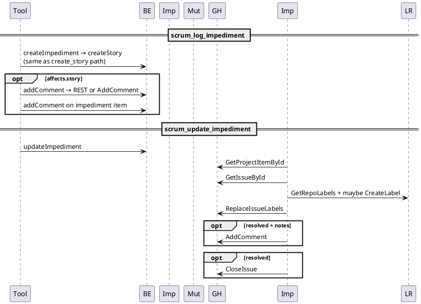

# Tool Surface → GitHub API Call Graph Audit

**Spike:** [github-projects-mcp-server#190](https://github.com/hoonsubin/github-projects-mcp-server/issues/190)  
**Scope:** Read-only source trace of all 11 `scrum_*` tools in this repo (`scrum-master-toolkit` / MCP server). No live API profiling.  
**Date:** 2026-06-02  

**Out of spike scope (documented briefly):** `scrum_plan_sprint` — registered in `src/tools/scrum-write.ts` but not in issue #190’s 11-tool list.

---

## Executive summary

| Finding | Impact |
|--------|--------|
| **Assembler pipeline covers only `scrum_find_items`** (`project_items`, `search_api`, `mixed`, `direct_lookup` branches). Everything else calls `gh.graphql()` / `gh.rest()` from service classes or `ExecutionEngine`’s sibling `PaginatedProjectItemFetcher`. | No unified assembly strategy; optimization must be per-path. |
| **`ProjectItems` full-board pagination** is the dominant cost: used by orient (sprint completion), board health, analytics history/burndown, sprint impediments, and most `find_items` profiles. | Repeated scans with no cross-tool cache. |
| **`resolveRef({ number })`** delegates to `findItems` → `direct_lookup` (per-key × per-repo `GetIssueProjectItem`), not a single-issue lookup. | Hidden multiplier on writes and `scrum_get_item_detail`. |
| **`scrum_set_field` re-reads full story** after mutation (`getStoryDetail` in tool handler). | Extra 2–3 GraphQL calls per invocation. |
| **Bootstrap (`GetUser/OrgProjectFieldsBootstrap`)** runs on every `scrum_orient` via `reload()`. | Orient always pays at least one heavy project-fields query. |

---

## Call path legend

| Layer | Location |
|-------|----------|
| Tool handler | `src/tools/scrum-read.ts`, `src/tools/scrum-write.ts` |
| Use case | `src/scrum/*.ts` |
| Facade | `src/adapters/github/backend.ts` (`GitHubProjectBackend`) |
| Services | `src/adapters/github/internal/*` |
| Assembler pipeline | `classifyFilter` → assembler → `ExecutionEngine.execute` **or** `DirectLookupAssembler` (bypass) |
| HTTP | `src/adapters/github/internal/http-client.ts` (`graphql`, `rest`) |

**Pagination notation:** `ProjectItems` = GraphQL operation built by `ProjectItemsQueryBuilder` (page size **100**, max **20** pages via `DEFAULT_PAGINATION_POLICY`). Write **`ProjectItems×P`** where **P** = pages consumed (1…20).

**Parallelism:** `→` sequential; `⇉` could run in parallel (code may still await sequentially).

---

## Diagram 1 — L2 Container (C4)

```plantuml
@startuml
!include https://raw.githubusercontent.com/plantuml-stdlib/C4-PlantUML/master/C4_Container.puml

Person(agent, "Scrum agent", "MCP client")
Container(mcp, "scrum-master-toolkit", "MCP server", "stdio/HTTP, scrum_* tools")
Container_Ext(gh, "GitHub API", "GraphQL + REST")

Rel(agent, mcp, "MCP tools/resources", "JSON-RPC")
Rel(mcp, gh, "graphql(), rest()", "HTTPS")

@enduml
```

---

## Diagram 2 — L3 Component: Adapter ownership

```plantuml
@startuml
!include https://raw.githubusercontent.com/plantuml-stdlib/C4-PlantUML/master/C4_Component.puml

Container_Boundary(adapter, "GitHub adapter") {
  Component(backend, "GitHubProjectBackend", "Facade", "ports delegation")
  Component(reloader, "ConfigReloader", "reload", "bootstrapGitHub")
  Component(assembler_pi, "ProjectItemsAssembler", "find_items", "→ ExecutionEngine")
  Component(assembler_search, "SearchApiAssembler", "find_items", "→ ExecutionEngine")
  Component(assembler_direct, "DirectLookupAssembler", "find_items, resolveRef", "direct gh.graphql")
  Component(engine, "ExecutionEngine", "pagination", "only gh.graphql entry for pipeline")
  Component(story_query, "StoryQueryService", "detail, fetchAllItems, sprint %", "direct gh")
  Component(story_mut, "StoryMutationService", "writes", "direct gh + rest")
  Component(field_mut, "FieldValueMutator", "setField", "direct gh")
  Component(board, "BoardHealthService", "health", "StoryQuery + Impediment")
  Component(analytics, "AnalyticsService", "analytics", "History + Burndown")
  Component(impediment, "ImpedimentService", "impediments", "direct gh")
  Component(epic, "EpicService", "epics", "direct gh + assembler")
}

Rel(backend, reloader, "reload()")
Rel(backend, assembler_pi, "findItems project_items/mixed")
Rel(backend, assembler_search, "findItems search_api")
Rel(backend, assembler_direct, "findItems direct_lookup")
Rel(assembler_pi, engine, "PlatformRequest")
Rel(assembler_search, engine, "PlatformRequest")
Rel(backend, story_query, "getStoryDetail, completion")
Rel(backend, story_mut, "create/update/setField/comment")
Rel(backend, board, "getBoardHealth")
Rel(backend, analytics, "getAnalytics")

note right of engine
  Assembler pipeline path
end note
note right of story_query
  Bypass: direct gh.graphql
end note

@enduml
```

---

## Per-tool traces

### 1. `scrum_orient`

Assumes the server was started with `--config .github/scrum/config.yml` (or `SCRUM_CONFIG_PATH` pointing at that file). Values below match the checked-in config: `owner_type: user`, `owner: hoonsubin`, `project_number: 5`, `tracked_repos: [github-projects-mcp-server]`, and `field_mapping.item_type: "Type"` (board-field type resolution — no org issue-types bootstrap).



**GraphQL count for this config (typical):** 1 (`GetUserProjectFieldsBootstrap`) + 1 (`GetRepoLabels`) + 1 (`ListMilestones`) + **P** (`ProjectItems` pages) when an active sprint exists — e.g. **4 + P** (often **5–6** total calls for ~100–200 board items).

**Not taken for `.github/scrum/config.yml`:** `GetOrgProjectFieldsBootstrap` (would apply if `owner_type: org`), `GetOrgIssueTypesBootstrap` (only when `item_type` is absent on the board and owner is org).

---

### 2. `scrum_find_items`

Router: `classifyFilter` in `filter-strategy-router.ts`.

#### Diagram 4 — Strategy branches



| Branch | Operations | Notes |
|--------|------------|-------|
| `direct_lookup` | `GetIssueProjectItem` × keys × repos (stop at first match per key) | Bypasses `ExecutionEngine` |
| `search_api` | `SearchIssues×pages` (first 100/page, max 20 pages) | `scope=all` → delegates to `ProjectItems×P` |
| `project_items` / `mixed` | `ProjectItems×P` | Via `ExecutionEngine` |
| `include_dependencies=true` | — | Client-side `buildDependencyMap` on fetched set |

**Minimum (single key, one repo, match on first repo):** 1× `GetIssueProjectItem`.  
**Worst find (full board):** `ProjectItems×min(ceil(N/100), 20)`.

---

### 3. `scrum_get_item_detail`

#### Diagram 5 — Sequence (incl. `resolveRef` cost)



| Ref shape | GraphQL sequence |
|-----------|------------------|
| `{ id }` | `GetProjectItemById` → (`GetIssueDetails` + `GetItemFields`) **or** `GetDraftIssueDetails` |
| `{ number }` | `GetIssueProjectItem×…` → same as above |

**Typical `{id}` issue:** 3 calls. **`{number}`:** 4+ calls.

---

### 4. `scrum_get_board_health` + 5. `scrum_get_analytics`

#### Diagram 6 — Shared `fetchAllItems` redundancy



#### `scrum_get_board_health`

| Step | Operation |
|------|-----------|
| `fetchStoriesForScope` | `ProjectItems×P` |
| `getOrphanImpediments` | `GetImpedimentIssues` |
| `getSprintImpediments` (if scope ≠ `"all"`) | `ProjectItems×P` again |

**Typical:** **2× full board scan + 1 impediment query.**

#### `scrum_get_analytics`

| `view` | Operations |
|--------|------------|
| `history` | `ProjectItems×P` once (`SprintHistoryService`) |
| `burndown` | `ProjectItems×P` (sprint-filtered collect) + **REST** `repos/.../issues/{n}/timeline` per story |
| `both` | Burndown + history paths (errors swallowed independently) |

**Burndown REST:** 1 request per sprint story with a number; sequential loop.

---

### 6–8. Write tools

#### Diagram 7 — `create_story`, `update_story`, `set_field`



| Tool | Typical GraphQL (+ REST) | `{ number }` prefix |
|------|--------------------------|---------------------|
| `scrum_create_story` | `AddDraftIssue` + `UpdateItemField` (type) + optional priority/convert/labels/milestone | N/A (creates new item) |
| `scrum_update_story` | `GetProjectItemById` + `UpdateIssue` (+ optional `GetBlockedBy` + batch) | + `GetIssueProjectItem×…` |
| `scrum_set_field` | resolve + `GetProjectItemById` + 1 field mutation + **detail re-fetch (3 calls)** | + direct_lookup |

**`set_field` by field (after `resolveStory`):**

| field | Extra operations |
|-------|----------------|
| status / sprint / story_points / priority / type (board) | `UpdateItemField` or `ClearItemField` |
| type (org issue type) | may `ConvertDraftIssue`; `SetIssueType` |
| assignee | `GetUserNodeId` + `SetAssignee` or `ClearAssignees` |

---

#### Diagram 8 — Impediment tools



---

### 9. `scrum_add_vocabulary`

| `kind` | Operations |
|--------|------------|
| `status_option` / `priority_option` | `GetFieldOptions` → (if new) `UpdateField` |
| `label` | `GetRepoLabels` → `GetRepo` → `CreateLabel` |

Idempotent path: 2 GraphQL (read + skip write).

---

## Pipeline bypass inventory

Services that call `gh.graphql()` / `gh.rest()` **without** `ExecutionEngine` / assembler `PlatformRequest`:

| Service | Used by tools |
|---------|----------------|
| `bootstrap` / `ConfigReloader` | `scrum_orient` |
| `DirectLookupAssembler` | `scrum_find_items`, `resolveRef` |
| `StoryQueryService` | `scrum_get_item_detail`, orient completion, board health (via fetchAllItems) |
| `StoryMutationService` | create/update/setField, impediment create |
| `FieldValueMutator` | setField, createStory |
| `LabelResolver` | orient, create/update, vocabulary, impediment update |
| `VocabularyManager` | `scrum_add_vocabulary` |
| `UserMilestoneResolver` | create/update/setField assignee |
| `ImpedimentService` | log/update impediment, board health |
| `EpicService` | orient (`getEpics`) |
| `BurndownCalculator` | analytics burndown (+ REST timeline) |
| `SprintHistoryService` | analytics history |

**Through assembler pipeline only:** `scrum_find_items` branches `project_items`, `search_api` (non-`all` scope), `mixed`; `SearchApiAssembler` may delegate to `ProjectItemsAssembler`.

---

## Cross-tool redundancy matrix

Rows = GitHub operation (GraphQL op name from `queries.ts` / inline). Columns = tool. **●** = fires on a normal successful invocation (pagination shown as ● per full scan).

| Operation | orient | find_items | item_detail | board_health | analytics | create | update | set_field | log_imp | update_imp | add_vocab |
|-----------|:------:|:----------:|:-----------:|:------------:|:---------:|:------:|:------:|:---------:|:-------:|:----------:|:---------:|
| GetUser/OrgProjectFieldsBootstrap | ● | | | | | | | | | | |
| GetOrgIssueTypesBootstrap | ○ | | | | | | | | | | |
| GetRepoLabels | ● | | | | | ○ | ○ | | | ○ | ○ |
| ListMilestones | ● | | | | | | | | | | |
| ProjectItems×P | ● | ● | ○ | ●● | ●● | | | ○ | | ● | |
| GetIssueProjectItem | | ● | ○ | | | | ○ | ○ | | | |
| SearchIssues | | ○ | | | | | | | | | |
| GetProjectItemById | | | ● | | | | ● | ● | | ● | |
| GetIssueDetails | | | ● | | | | | ● | | | |
| GetItemFields | | | ● | | | | | ● | | | |
| GetDraftIssueDetails | | | ○ | | | | | ○ | | | |
| GetImpedimentIssues | | | | ● | | | | | | | |
| REST issue timeline | | | | | ○ | | | | | | |
| AddDraftIssue | | | | | | ● | | | ● | | |
| UpdateItemField / Clear | | | | | | ● | | ● | ● | | |
| ConvertDraftIssue | | | | | | ○ | ○ | ○ | ○ | | |
| UpdateIssue | | | | | | | ○ | | | | |
| GetFieldOptions + UpdateField | | | | | | | | | | | ○ |
| CreateLabel | | | | | | | | | | ○ | ○ |
| ReplaceIssueLabels / CloseIssue / AddComment | | | | | | | | | ○ | ● | |

○ = conditional branch; ●● = two full scans in one tool invocation.

**Key cross-tool duplicates (no shared session cache):**

1. **`ProjectItems×P`** — orient (completion), find_items (most branches), board_health (×2), analytics (history + burndown), impediment sprint listing, `resolveRef`.
2. **`GetProjectItemById`** — item detail, all writes after resolve, impediment update, set_field response.
3. **Bootstrap** — only orient triggers `reload()`, but every orient pays full bootstrap.

---

## Theoretical minimum call table

Assumptions: single tracked repo, board has type on field (no org issue-types bootstrap), `{ id }` refs, ~N project items, P = pages for full board, S = stories in target sprint, K = lookup keys.

| Tool | Current (typical) | Minimum achievable | Gap | Gap description |
|------|-------------------|--------------------|-----|-----------------|
| scrum_orient | 3–5 + P | 1 bootstrap + 0–1 milestones | P + extra reads | Sprint completion requires item set; could use lighter query than full `ItemContent`+`ItemFieldValues` fragment |
| scrum_find_items (project_items) | P | P | 0 | GitHub Projects has no server-side filter API; must paginate |
| scrum_find_items (direct_lookup) | K×R | K | K×(R−1) | Stop after first repo; parallelize key lookups |
| scrum_find_items (search_api) | 1–20 | 1 | pages−1 | Narrower query / smaller board |
| scrum_get_item_detail | 3 (id) | 2 | 1 | `GetIssueDetails` + `GetItemFields` parallelizable; could merge into one query document |
| scrum_get_board_health | 2P + 1 | P + 1 | P | Single `ProjectItems` pass for stories + impediment filter in memory |
| scrum_get_analytics (both) | 2P + S REST | P + S REST | P | One board fetch shared by history + burndown |
| scrum_create_story | 2–6 | 2 | 0–4 | Optional convert/labels/milestone |
| scrum_update_story | 2–5+ | 2 | 0–3+ | blocked_by batch; assignee serial `GetUserNodeId` |
| scrum_set_field | 5–8 | 2 | 3–6 | Remove post-mutation `getStoryDetail`; avoid `resolveRef` if id known |
| scrum_log_impediment | create + 0–2 comments | same | 0 | Inherent workflow |
| scrum_update_impediment | 4–7 | 3 | 1–4 | Label read/create could be cached per session |
| scrum_add_vocabulary | 2 | 2 | 0 | Already minimal for idempotent add |

---

## Dependency classification (sequential vs parallelizable)

| Call pair | Relationship |
|-----------|--------------|
| Bootstrap → any live read | **Sequential** (hard) |
| `GetIssueDetails` → `GetItemFields` (detail) | **Parallelizable** (independent node queries) |
| `resolveStory` → field mutations | **Sequential** (needs item/issue ids) |
| `ListMilestones` multi-repo | **Parallelizable** (already `Promise.all`) |
| `buildSprintInfo` active/next/completed | **Parallelizable** (already `Promise.all`; no API inside) |
| Burndown timelines per issue | **Parallelizable** (currently sequential REST) |
| `UserMilestoneResolver` multiple assignees | **Parallelizable** (currently sequential) |
| History + burndown in `view=both` | **Parallelizable** (currently try/catch sequential) |

---

## Immediately fixable redundancies (follow-on candidates)

| ID | Issue | Suggested ticket |
|----|-------|------------------|
| R1 | `scrum_set_field` calls `getStoryDetail` after every mutation | Return mutation result or single `GetProjectItemById` |
| R2 | `BoardHealthService` runs `ProjectItems×P` twice | Reuse one `fetchAllItems` for scope + sprint impediments |
| R3 | `resolveRef({number})` uses full `findItems` router | Dedicated `GetIssueProjectItem` once per repo |
| R4 | `AnalyticsService` `view=both` double full board fetch | Share one `ProjectItems` collection |
| R5 | Orient `getSprintCompletion` full board scan | Incremental query or cache from prior tool in session |

---

## Appendix: `scrum_plan_sprint` (12th tool)

Not in #190 list; included for completeness.

| Phase | Operations |
|-------|------------|
| `replace: true` | `findItems` → `ProjectItems×P` (scope sprint) + per item `setField(sprint,null)` → `GetProjectItemById` + `UpdateItemField`/`Clear` |
| Assign each story | `resolveRef?` + `setField(sprint)` each |

Worst case: **P + 2×N mutations** for replace + assign.

---

## Trace methodology

1. Tool registration → use case → `GitHubProjectBackend` method.  
2. Follow delegation into `internal/*` services.  
3. Grep `gh.graphql` / `gh.rest` and `ExecutionEngine.execute`.  
4. Map documents to operation names via `src/adapters/github/queries.ts` (`getQuery("…")`).  
5. Classify pagination using `ProjectItemsQueryBuilder` (100/page) and `DEFAULT_PAGINATION_POLICY.maxPages` (20).

---

## Acceptance checklist (#190)

- [x] All 11 MCP tools traced end-to-end with operation names and service classes  
- [x] Sequential vs parallelizable pairs classified  
- [x] 8 PlantUML diagrams included  
- [x] Cross-tool redundancy matrix  
- [x] Theoretical minimum call table  
- [x] Follow-on redundancy items listed (R1–R5)  
- [ ] Findings comment on GitHub issue #190 (copy from this doc if closing spike in-repo)
