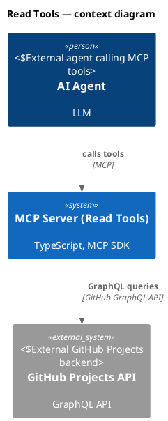
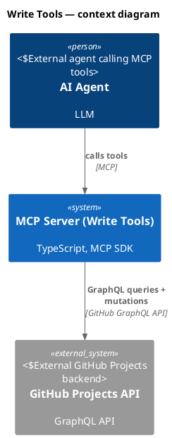
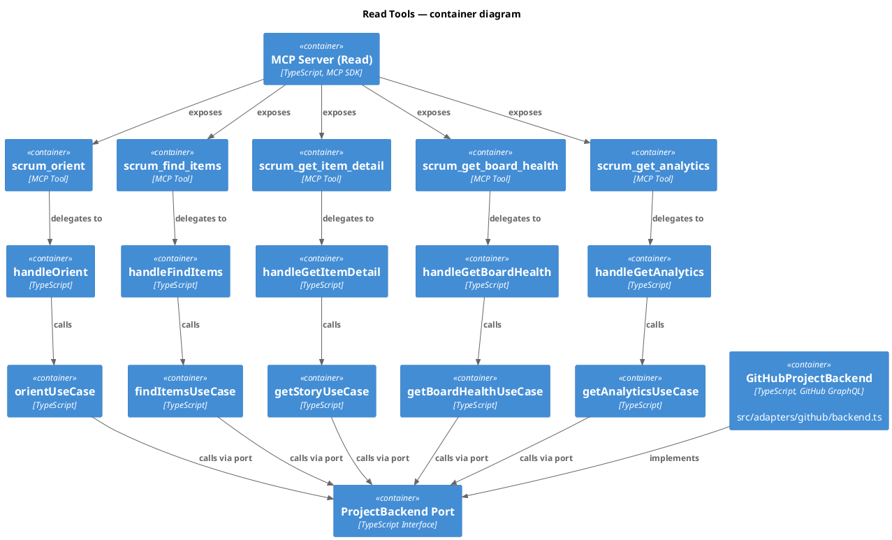
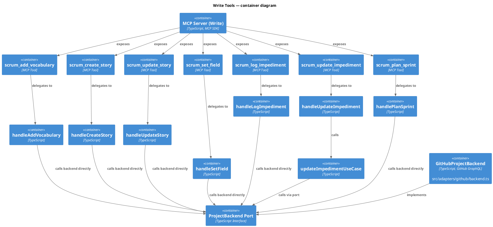
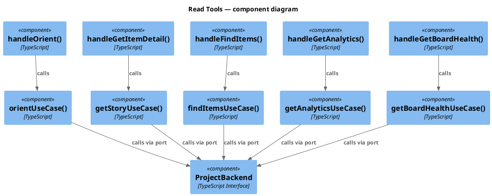
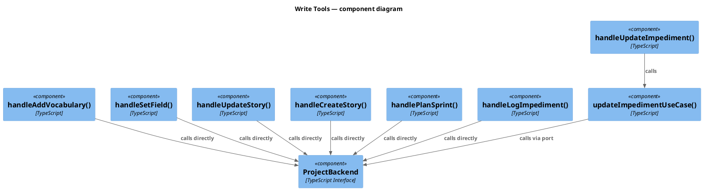
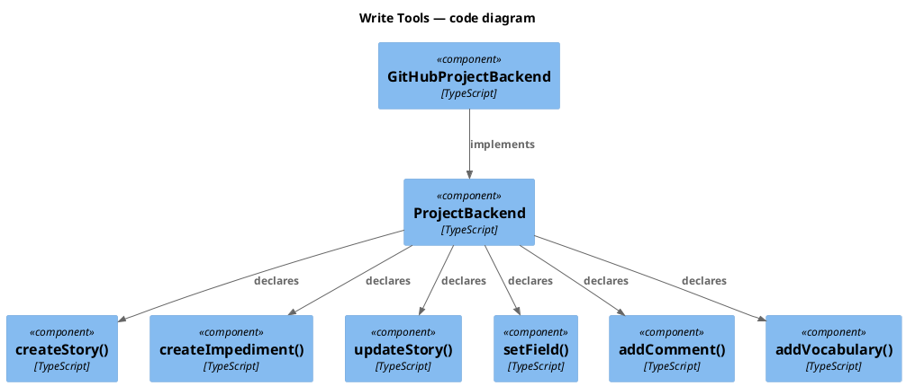

# Architecture Audit Report

**Generated:** 2026-06-03T14:30:07.019Z
**Commit:** `faa7be9`
**Source directory:** `./src`

## Architecture Compliance

Modules scanned: **97**

| Rule | Severity | Status | Violations |
|------|----------|--------|------------|
| domain-must-not-depend-on-inner-layers | error | 🟢 Pass | 0 |
| use-case-must-not-depend-on-adapters | error | 🟢 Pass | 0 |
| services-must-not-depend-on-adapters | error | 🟢 Pass | 0 |
| adapters-must-not-depend-on-tools-schemas-server | error | 🟢 Pass | 0 |
| tools-must-not-depend-on-adapters | error | 🟢 Pass | 0 |
| schemas-must-not-depend-on-src | error | 🟢 Pass | 0 |
| no-circular-dependencies | error | 🟢 Pass | 0 |
| no-console-log | error | 🟢 Pass | 0 |

## C4 Diagrams

```plantuml
@startuml
!include <c4/C4_Component>

title Read Tools — code diagram

Component(project_backend_iface, "ProjectBackend", "TypeScript")
Component(port_getEpics, "getEpics()", "TypeScript")
Component(port_getStoryDetail, "getStoryDetail()", "TypeScript")
Component(port_composeStorySnapshot, "composeStorySnapshot()", "TypeScript")
Component(port_composeStoryAfterSetField, "composeStoryAfterSetField()", "TypeScript")
Component(port_composeStoryAfterStoryUpdate, "composeStoryAfterStoryUpdate()", "TypeScript")
Component(port_composeStoryAfterCreateStory, "composeStoryAfterCreateStory()", "TypeScript")
Component(port_findItems, "findItems()", "TypeScript")
Component(port_getAnalytics, "getAnalytics()", "TypeScript")
Component(port_getBoardHealth, "getBoardHealth()", "TypeScript")
Component(port_getSprintImpediments, "getSprintImpediments()", "TypeScript")
Component(port_getOrphanImpediments, "getOrphanImpediments()", "TypeScript")
Component(port_updateImpediment, "updateImpediment()", "TypeScript")
Component(port_fetchContent, "fetchContent()", "TypeScript")
Component(port_getPlatformState, "getPlatformState()", "TypeScript")
Component(port_getSprintCompletion, "getSprintCompletion()", "TypeScript")
Component(port_reload, "reload()", "TypeScript")
Component(github_adapter_impl, "GitHubProjectBackend", "TypeScript")

Rel(project_backend_iface, port_getEpics, "declares")
Rel(project_backend_iface, port_getStoryDetail, "declares")
Rel(project_backend_iface, port_composeStorySnapshot, "declares")
Rel(project_backend_iface, port_composeStoryAfterSetField, "declares")
Rel(project_backend_iface, port_composeStoryAfterStoryUpdate, "declares")
Rel(project_backend_iface, port_composeStoryAfterCreateStory, "declares")
Rel(project_backend_iface, port_findItems, "declares")
Rel(project_backend_iface, port_getAnalytics, "declares")
Rel(project_backend_iface, port_getBoardHealth, "declares")
Rel(project_backend_iface, port_getSprintImpediments, "declares")
Rel(project_backend_iface, port_getOrphanImpediments, "declares")
Rel(project_backend_iface, port_updateImpediment, "declares")
Rel(project_backend_iface, port_fetchContent, "declares")
Rel(project_backend_iface, port_getPlatformState, "declares")
Rel(project_backend_iface, port_getSprintCompletion, "declares")
Rel(project_backend_iface, port_reload, "declares")
Rel(github_adapter_impl, project_backend_iface, "implements")

@enduml
```

## Stability (Instability) Metrics

_Instability (I) measures outgoing dependencies. I=0 means the module depends on nothing (highly stable); I=1 means it depends on many things (fragile)._

| Module | Layer | I | Risk |
|--------|-------|---|------|
| `src/adapters/github/internal/_test_utils.ts` | adapter | 1.00 | 🔴 high-risk |
| `src/adapters/github/internal/display-helpers.ts` | adapter | 1.00 | 🔴 high-risk |
| `src/adapters/github/internal/fixture-replay/recording-client.ts` | adapter | 1.00 | 🔴 high-risk |
| `src/server.ts` | entrypoint | 1.00 | 🔴 high-risk |
| `src/test/support/scrum-test-utils.ts` | framework | 1.00 | 🔴 high-risk |
| `src/test/tools/contract-test-utils.ts` | framework | 1.00 | 🔴 high-risk |
| `src/adapters/github/backend.ts` | adapter | 0.96 | 🔴 high-risk |
| `src/adapters/github/create-backend.ts` | adapter | 0.94 | 🔴 high-risk |
| `src/test/support/fixture-backend.ts` | framework | 0.92 | 🔴 high-risk |
| `src/tools/handlers/read.ts` | framework | 0.90 | 🔴 high-risk |
| `src/test/support/fake-backend.ts` | framework | 0.90 | 🔴 high-risk |
| `src/tools/handlers/write.ts` | framework | 0.89 | 🔴 high-risk |
| `src/adapters/github/internal/assemblers/search-api-assembler.ts` | adapter | 0.87 | 🔴 high-risk |
| `src/adapters/github/factory.ts` | adapter | 0.86 | 🔴 high-risk |
| `src/scrum/orient.ts` | use-case | 0.86 | 🔴 high-risk |
| `src/adapters/github/internal/analytics-service.ts` | adapter | 0.85 | 🔴 high-risk |
| `src/adapters/github/internal/assemblers/direct-lookup-assembler.ts` | adapter | 0.85 | 🔴 high-risk |
| `src/adapters/github/internal/pagination.ts` | adapter | 0.83 | 🔴 high-risk |
| `src/adapters/github/internal/burndown-calculator.ts` | adapter | 0.83 | 🔴 high-risk |
| `src/adapters/github/internal/board-health-service.ts` | adapter | 0.83 | 🔴 high-risk |
| `src/tools/scrum-write.ts` | framework | 0.83 | 🔴 high-risk |
| `src/adapters/github/internal/project-items-cache.ts` | adapter | 0.80 | 🔴 high-risk |
| `src/adapters/github/internal/impediment-service.ts` | adapter | 0.80 | 🔴 high-risk |
| `src/adapters/github/internal/file-reader.ts` | adapter | 0.80 | 🔴 high-risk |
| `src/adapters/github/internal/vocabulary-manager.ts` | adapter | 0.78 | 🟡 moderate |
| `src/adapters/github/internal/story-mutation-service.ts` | adapter | 0.77 | 🟡 moderate |
| `src/adapters/github/internal/epic-service.ts` | adapter | 0.75 | 🟡 moderate |
| `src/adapters/github/internal/fixture-replay/fixture-replay-client.ts` | adapter | 0.75 | 🟡 moderate |
| `src/scrum/get-story.ts` | use-case | 0.75 | 🟡 moderate |
| `src/scrum/template-resource.ts` | use-case | 0.75 | 🟡 moderate |
| `src/adapters/abstract-backend.ts` | adapter | 0.71 | 🟡 moderate |
| `src/adapters/github/internal/sprint-history-service.ts` | adapter | 0.71 | 🟡 moderate |
| `src/tools/scrum-read.ts` | framework | 0.71 | 🟡 moderate |
| `src/adapters/github/internal/assemblers/project-items-assembler.ts` | adapter | 0.71 | 🟡 moderate |
| `src/adapters/github/internal/resolve-issue-number.ts` | adapter | 0.67 | 🟡 moderate |
| `src/adapters/github/internal/story-query-service.ts` | adapter | 0.67 | 🟡 moderate |
| `src/adapters/github/internal/field-value-mutator.ts` | adapter | 0.67 | 🟡 moderate |
| `src/adapters/github/internal/filter-strategy-router.ts` | adapter | 0.67 | 🟡 moderate |
| `src/scrum/find-items.ts` | use-case | 0.67 | 🟡 moderate |
| `src/scrum/get-analytics.ts` | use-case | 0.67 | 🟡 moderate |
| `src/scrum/get-board-health.ts` | use-case | 0.67 | 🟡 moderate |
| `src/scrum/update-impediment.ts` | use-case | 0.67 | 🟡 moderate |
| `src/test/support/contract-assertions.ts` | framework | 0.67 | 🟡 moderate |
| `src/adapters/github/internal/result-normalizer.ts` | adapter | 0.64 | 🟡 moderate |
| `src/adapters/factory.ts` | adapter | 0.63 | 🟡 moderate |
| `src/adapters/github/internal/assembler-output.ts` | adapter | 0.63 | 🟡 moderate |
| `src/adapters/github/internal/item-filter.ts` | adapter | 0.63 | 🟡 moderate |
| `src/adapters/github/internal/assemblers/mixed-assembler.ts` | adapter | 0.60 | 🟡 moderate |
| `src/adapters/github/internal/config-reloader.ts` | adapter | 0.60 | 🟡 moderate |
| `src/test/support/config-profile.ts` | framework | 0.60 | 🟡 moderate |
| `src/adapters/github/internal/assemblers/extractors.ts` | adapter | 0.57 | 🟡 moderate |
| `src/adapters/github/internal/user-milestone-resolver.ts` | adapter | 0.57 | 🟡 moderate |
| `src/scrum/config-boot.ts` | use-case | 0.55 | 🟡 moderate |
| `src/adapters/github/mappers.ts` | adapter | 0.54 | 🟡 moderate |
| `src/scrum/resolve-location.ts` | use-case | 0.50 | 🟡 moderate |
| `src/adapters/github/bootstrap-field-sources.ts` | adapter | 0.50 | 🟡 moderate |
| `src/adapters/github/internal/iteration-classifier.ts` | adapter | 0.50 | 🟡 moderate |
| `src/scrum/listing-mappers.ts` | use-case | 0.50 | 🟡 moderate |
| `src/adapters/github/internal/search-query-builder.ts` | adapter | 0.50 | 🟡 moderate |
| `src/adapters/github/internal/search-result-normalizer.ts` | adapter | 0.50 | 🟡 moderate |
| `src/scrum/fetch-location.ts` | use-case | 0.50 | 🟡 moderate |
| `src/adapters/github/internal/fixture-replay/load-manifest.ts` | adapter | 0.50 | 🟡 moderate |
| `src/adapters/github/internal/label-resolver.ts` | adapter | 0.44 | 🟡 moderate |
| `src/adapters/github/internal/resolver.ts` | adapter | 0.40 | 🟡 moderate |
| `src/adapters/github/bootstrap.ts` | adapter | 0.35 | 🟡 moderate |
| `src/scrum/url-rewriters.ts` | use-case | 0.33 | 🟡 moderate |
| `src/scrum/sprint-math.ts` | use-case | 0.33 | 🟡 moderate |
| `src/adapters/github/internal/project-items-query-builder.ts` | adapter | 0.33 | 🟡 moderate |
| `src/schemas/scrum.ts` | framework | 0.33 | 🟡 moderate |
| `src/adapters/github/internal/board-scan-coordinator.ts` | adapter | 0.30 | 🟡 moderate |
| `src/schemas/scrum-outputs.ts` | framework | 0.25 | 🟡 moderate |
| `src/services/error-enrichment.ts` | framework | 0.22 | 🟡 moderate |
| `src/adapters/github/internal/execution-engine.ts` | adapter | 0.22 | 🟡 moderate |
| `src/adapters/github/internal/http-client.ts` | adapter | 0.20 | 🟢 low-risk |
| `src/adapters/github/internal/infra-context.ts` | adapter | 0.19 | 🟢 low-risk |
| `src/adapters/github/internal/assemblers/types.ts` | adapter | 0.18 | 🟢 low-risk |
| `src/adapters/github/errors.ts` | adapter | 0.11 | 🟢 low-risk |
| `src/scrum/ports.ts` | use-case | 0.09 | 🟢 low-risk |
| `src/domain/config.ts` | domain | 0.08 | 🟢 low-risk |
| `src/adapters/github/types.ts` | adapter | 0.08 | 🟢 low-risk |
| `src/domain/errors.ts` | domain | 0.08 | 🟢 low-risk |
| `src/adapters/github/queries.ts` | adapter | 0.07 | 🟢 low-risk |
| `src/_deno-shim.node.ts` | framework | 0.00 | 🟢 low-risk |
| `src/domain/types.ts` | domain | 0.00 | 🟢 low-risk |
| `src/domain/content-location.ts` | domain | 0.00 | 🟢 low-risk |
| `src/adapters/capabilities.ts` | adapter | 0.00 | 🟢 low-risk |
| `src/adapters/github/generated/github-types.ts` | adapter | 0.00 | 🟢 low-risk |
| `src/adapters/github/operations.graphql` | adapter | 0.00 | 🟢 low-risk |
| `src/services/logger.ts` | framework | 0.00 | 🟢 low-risk |
| `src/domain/rules/readiness.ts` | domain | 0.00 | 🟢 low-risk |
| `src/adapters/github/internal/fixture-replay/query-hash.ts` | adapter | 0.00 | 🟢 low-risk |
| `src/adapters/github/internal/fixture-replay/types.ts` | adapter | 0.00 | 🟢 low-risk |
| `src/domain/rules/acceptance-criteria.ts` | domain | 0.00 | 🟢 low-risk |
| `src/schemas/inputs.ts` | framework | 0.00 | 🟢 low-risk |
| `src/tools/_mcp_result.ts` | framework | 0.00 | 🟢 low-risk |
| `src/services/pick-defined.ts` | framework | 0.00 | 🟢 low-risk |
| `src/tools/_snapshot_normalize.ts` | framework | 0.00 | 🟢 low-risk |

## File Statistics

| Layer | Files | Total LOC | Top 3 Largest |
|-------|-------|-----------|---------------|
| adapter | 55 | 8592 | `adapters/github/mappers.ts` (646 LOC), `adapters/github/bootstrap.ts` (524 LOC), `adapters/github/types.ts` (489 LOC) |
| framework | 19 | 2987 | `schemas/scrum.ts` (460 LOC), `test/support/fake-backend.ts` (457 LOC), `schemas/scrum-outputs.ts` (355 LOC) |
| use-case | 14 | 1441 | `scrum/ports.ts` (444 LOC), `scrum/orient.ts` (221 LOC), `scrum/sprint-math.ts` (168 LOC) |
| domain | 6 | 1116 | `domain/types.ts` (721 LOC), `domain/config.ts` (125 LOC), `domain/rules/readiness.ts` (95 LOC) |
| entrypoint | 1 | 487 | `server.ts` (487 LOC) |

## Unused Exports

**Total unused exports:** 131

| File | Export | Kind |
|------|--------|------|
| `src/scrum/sprint-math.ts` | buildSprintMeta | function |
| `src/scrum/url-rewriters.ts` | URL_REWRITERS | var |
| `src/scrum/ports.ts` | FieldPresence | interface |
| `src/scrum/ports.ts` | FieldWithOptions | interface |
| `src/scrum/ports.ts` | DisplayMap | type |
| `src/scrum/ports.ts` | StoryListing | interface |
| `src/scrum/ports.ts` | EpicPort | interface |
| `src/scrum/template-resource.ts` | templateResourceUseCase | function |
| `src/scrum/resolve-location.ts` | SUPPORTED_CONFIG_EXTENSIONS | var |
| `src/scrum/resolve-location.ts` | SupportedConfigExtension | type |
| `src/scrum/resolve-location.ts` | SupportedTemplateExtension | type |
| `src/tools/scrum-read.ts` | SCRUM_READ_TOOL_NAMES | var |
| `src/tools/scrum-read.ts` | registerScrumReadTools | function |
| `src/tools/scrum-write.ts` | SCRUM_WRITE_TOOL_NAMES | var |
| `src/tools/scrum-write.ts` | registerScrumWriteTools | function |
| `src/tools/_snapshot_normalize.ts` | SNAPSHOT_PLACEHOLDER | var |
| `src/tools/_snapshot_normalize.ts` | normalizeSnapshot | function |
| `src/tools/handlers/write.ts` | resolveP0PriorityDisplay | function |
| `src/test/tools/contract-test-utils.ts` | parseHandlerPayload | function |
| `src/test/tools/contract-test-utils.ts` | McpOutputShape | type |
| `src/test/tools/contract-test-utils.ts` | assertMcpToolOutput | function |
| `src/test/tools/contract-test-utils.ts` | assertHandlerSchema | function |
| `src/test/support/fixture-backend.ts` | BuildFixtureBackendOptions | interface |
| `src/test/support/fixture-backend.ts` | buildFixtureBackend | function |
| `src/test/support/fixture-backend.ts` | validateFixtureReplay | function |
| `src/test/support/scrum-test-utils.ts` | buildTypeTemplatePaths | function |
| `src/test/support/scrum-test-utils.ts` | typeTemplatePathsPromise | var |
| `src/test/support/scrum-test-utils.ts` | committedScrumConfigPromise | var |
| `src/test/support/scrum-test-utils.ts` | committedConfigProfilePromise | var |
| `src/test/support/scrum-test-utils.ts` | committedFakeBackendPromise | var |
| `src/test/support/scrum-test-utils.ts` | committedFixtureBackendPromise | var |
| `src/test/support/scrum-test-utils.ts` | realFileReader | var |
| `src/test/support/scrum-test-utils.ts` | stubFileReader | var |
| `src/test/support/scrum-test-utils.ts` | withTestServer | function |
| `src/test/support/config-profile.ts` | readGitHubBackendConfig | function |
| `src/test/support/fake-backend.ts` | FakeBackendCall | type |
| `src/test/support/fake-backend.ts` | ConfigShapedFakeBackendOptions | interface |
| `src/test/support/fake-backend.ts` | buildCanonicalListingItems | function |
| `_deno-shim.node.ts` | addEventListener | function |
| `_deno-shim.node.ts` | Deno | var |
| `src/schemas/inputs.ts` | GraphQLQuerySchema | var |
| `src/schemas/scrum-outputs.ts` | BacklogItemListingSchema | var |
| `src/schemas/scrum-outputs.ts` | StorySchema | var |
| `src/schemas/scrum-outputs.ts` | ImpedimentListingSchema | var |
| `src/schemas/scrum-outputs.ts` | CreateStoryPartialFailureSchema | var |
| `src/schemas/scrum-outputs.ts` | CreateStoryResponseSchema | var |
| `src/adapters/capabilities.ts` | CapabilityUnavailableError | class |
| `src/adapters/capabilities.ts` | CapabilityMap | type |
| `src/adapters/capabilities.ts` | getCapabilities | function |
| `src/adapters/capabilities.ts` | checkCapability | function |
| `src/adapters/factory.ts` | createBackend | function |
| `src/adapters/github/errors.ts` | GitHubErrorCode | type |
| `src/adapters/github/queries.ts` | ADD_PROJECT_ITEM_MUTATION | var |
| `src/adapters/github/queries.ts` | GET_ORG_PROJECT_FIELDS_BOOTSTRAP_QUERY | var |
| `src/adapters/github/queries.ts` | GET_ORG_ISSUE_TYPES_BOOTSTRAP_QUERY | var |
| `src/adapters/github/queries.ts` | GET_ORG_ISSUE_FIELDS_BOOTSTRAP_QUERY | var |
| `src/adapters/github/queries.ts` | CREATE_ISSUE_MUTATION | var |
| `src/adapters/github/mappers.ts` | toSprintInfo | function |
| `src/adapters/github/internal/fixture-replay/query-hash.ts` | stableVariablesJson | function |
| `src/adapters/github/internal/fixture-replay/load-manifest.ts` | loadFixtureJson | function |
| `src/adapters/github/internal/fixture-replay/types.ts` | ScenarioManifestEntry | interface |
| `src/adapters/github/internal/fixture-replay/types.ts` | FixtureCatalog | interface |
| `src/adapters/github/internal/fixture-replay/recording-client.ts` | RecordedWireCall | interface |
| `src/adapters/github/internal/fixture-replay/recording-client.ts` | RecordingGitHubClient | class |
| `src/adapters/github/internal/fixture-replay/recording-client.ts` | mergeWireEntries | function |
| `src/adapters/github/internal/assembler-output.ts` | backfillSprintRefs | function |
| `src/adapters/github/internal/pagination.ts` | isBacklogItem | function |
| `src/adapters/github/internal/project-items-query-builder.ts` | ProjectV2ItemsPage | interface |
| `src/adapters/github/internal/display-helpers.ts` | resolveTerminalDisplay | function |
| `src/adapters/github/internal/display-helpers.ts` | resolveHighestPriorityDisplay | function |
| `src/adapters/github/internal/resolve-issue-number.ts` | fetchProjectItemIdByIssueNumber | function |
| `src/adapters/github/internal/search-result-normalizer.ts` | SearchIssueNode | interface |
| `src/adapters/github/internal/label-resolver.ts` | GitHubLabel | interface |
| `src/adapters/github/internal/label-resolver.ts` | RepoNodeIdProvider | interface |
| `src/adapters/github/internal/_test_utils.ts` | GitHubClientSpy | interface |
| `src/adapters/github/internal/_test_utils.ts` | createGhSpy | function |
| `src/adapters/github/internal/_test_utils.ts` | makeConfig | function |
| `src/adapters/github/internal/_test_utils.ts` | makeCtx | function |
| `src/adapters/github/internal/iteration-classifier.ts` | ClassifiedIterations | interface |
| `src/adapters/github/internal/iteration-classifier.ts` | utcDateOnly | function |
| `src/adapters/github/internal/iteration-classifier.ts` | utcStartOfDay | function |
| `src/adapters/github/internal/execution-engine.ts` | PaginationPolicy | interface |
| `src/adapters/github/internal/execution-engine.ts` | DEFAULT_PAGINATION_POLICY | var |
| `src/adapters/github/internal/search-query-builder.ts` | SearchQueryParts | interface |
| `src/adapters/github/factory.ts` | GitHubAdapterFactory | class |
| `src/adapters/github/types.ts` | GitHubMilestoneId | type |
| `src/adapters/github/types.ts` | toEntityRef | function |
| `src/adapters/github/types.ts` | ItemContentType | type |
| `src/adapters/github/types.ts` | IssueIdentity | type |
| `src/adapters/github/types.ts` | PrIdentity | type |
| `src/adapters/github/types.ts` | PrDiscriminator | type |
| `src/adapters/github/types.ts` | PrState | type |
| `src/adapters/github/types.ts` | IssueState | type |
| `src/adapters/github/types.ts` | IssueRef | type |
| `src/adapters/github/types.ts` | LabelRef | type |
| `src/adapters/github/types.ts` | FieldValueField | type |
| `src/adapters/github/types.ts` | FieldValueUser | type |
| `src/adapters/github/types.ts` | FieldValueUserNodes | type |
| `src/adapters/github/types.ts` | FieldValueLabel | type |
| `src/adapters/github/types.ts` | FieldValueLabelNodes | type |
| `src/adapters/github/types.ts` | FieldValueMilestone | type |
| `src/adapters/github/types.ts` | FieldValueRepository | type |
| `src/adapters/github/types.ts` | LabelColorNodes | type |
| `src/adapters/github/types.ts` | IssueTypeRef | type |
| `src/adapters/github/types.ts` | ItemIssueFieldValue | interface |
| `src/adapters/github/bootstrap-field-sources.ts` | SingleSelectFieldNode | interface |
| `src/adapters/github/bootstrap-field-sources.ts` | BaseFieldNode | interface |
| `src/adapters/github/bootstrap-field-sources.ts` | BootstrapFieldNode | type |
| `src/adapters/github/bootstrap-field-sources.ts` | OrgIssueFieldOption | interface |
| `src/adapters/github/bootstrap-field-sources.ts` | isSingleSelectField | function |
| `src/adapters/github/bootstrap-field-sources.ts` | singleSelectOptionMapForField | function |
| `src/adapters/github/bootstrap-field-sources.ts` | ResolvedOptionMaps | interface |
| `src/adapters/github/create-backend.ts` | CreateGitHubBackendParams | interface |
| `src/adapters/github/create-backend.ts` | CreateGitHubBackendResult | interface |
| `src/adapters/github/bootstrap.ts` | IssueBackedFieldMeta | interface |
| `src/adapters/github/bootstrap.ts` | TypeResolution | type |
| `src/domain/errors.ts` | UseCaseErrorCode | type |
| `src/domain/content-location.ts` | CONTENT_LOCATION_KINDS | var |
| `src/domain/content-location.ts` | ContentLocationKind | type |
| `src/domain/types.ts` | EpicStatus | type |
| `src/domain/types.ts` | SprintName | type |
| `src/domain/types.ts` | ScrumTemplateUri | type |
| `src/domain/types.ts` | SprintRiskStance | type |
| `src/domain/types.ts` | SprintContext | interface |
| `src/domain/types.ts` | ItemListing | type |
| `src/domain/types.ts` | SUPPORTED_BACKENDS | var |
| `src/domain/types.ts` | DataSource | type |
| `src/domain/types.ts` | SprintTotalsKind | type |
| `src/domain/config.ts` | AutonomyLevel | type |
| `src/domain/config.ts` | ArtifactType | type |
| `src/services/error-enrichment.ts` | enrichError | function |

---

*Report generated by `deno task audit`. Do not edit manually.*