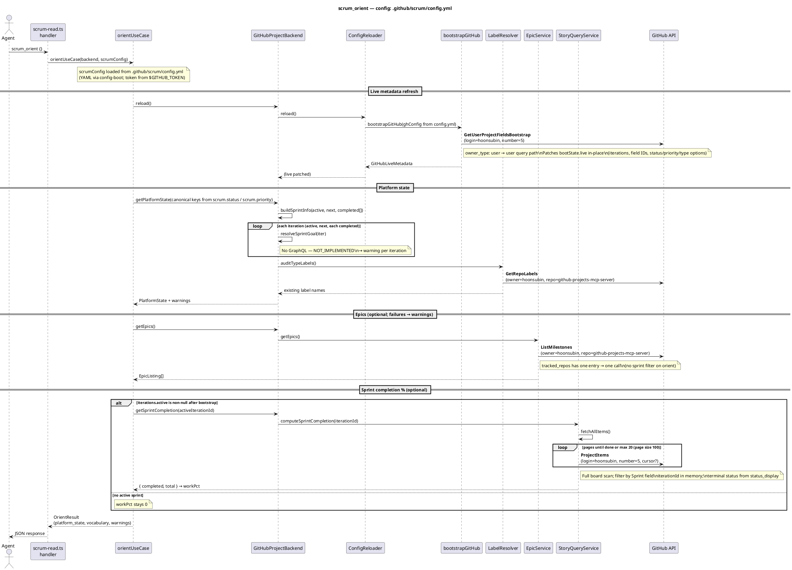
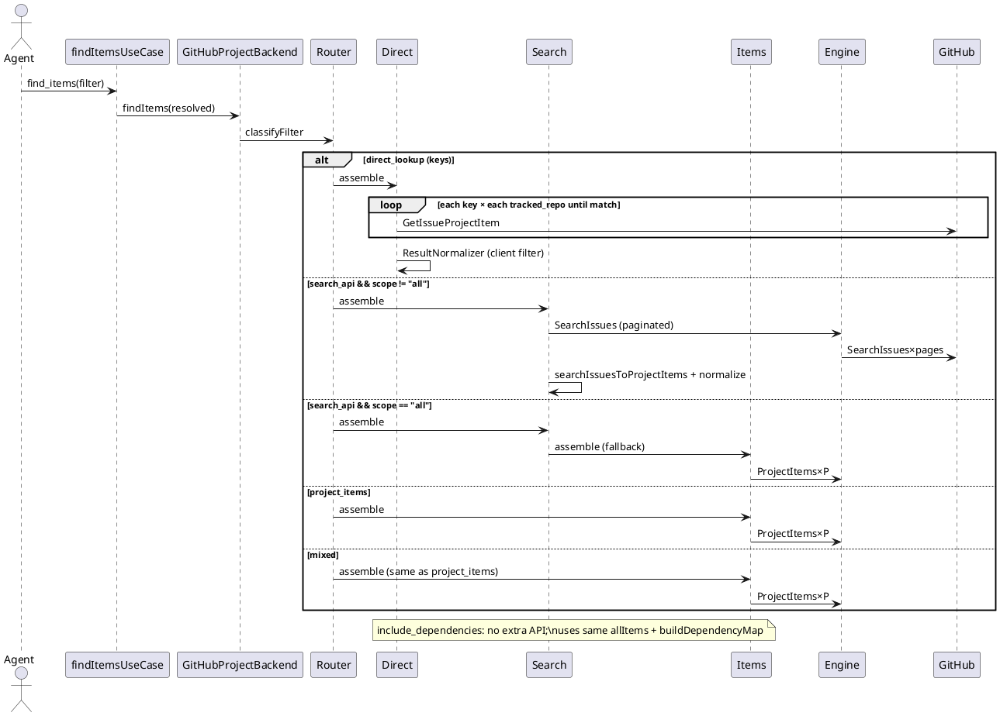
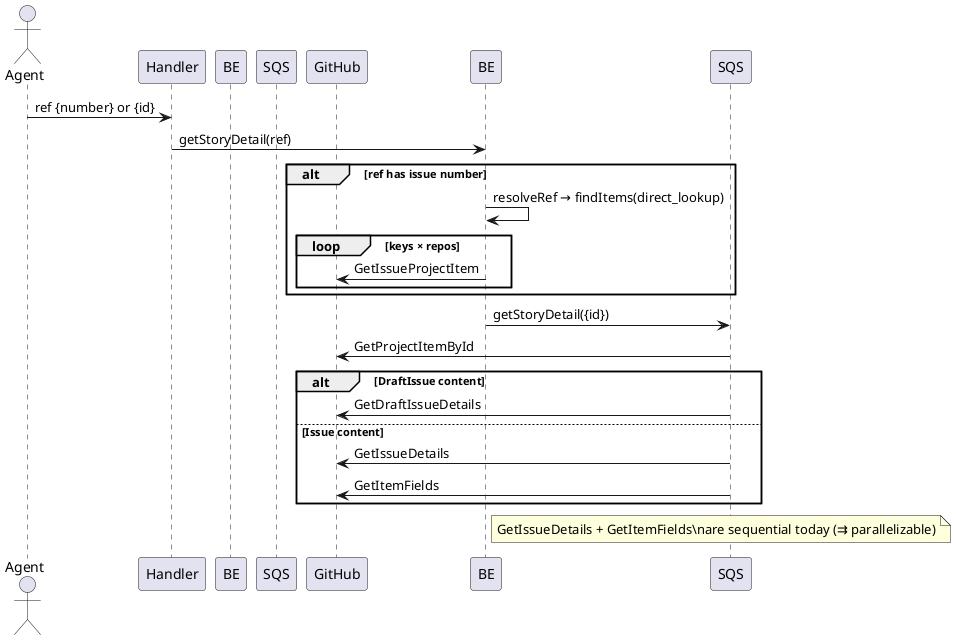
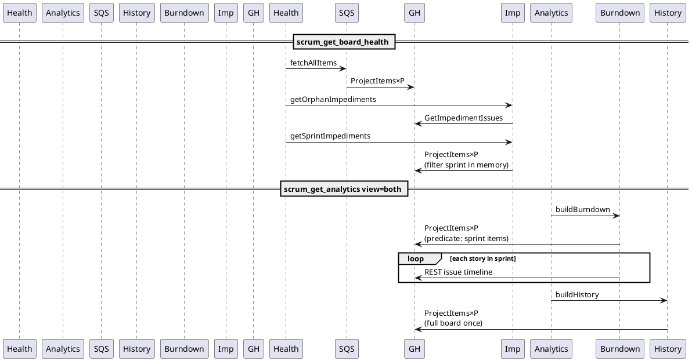
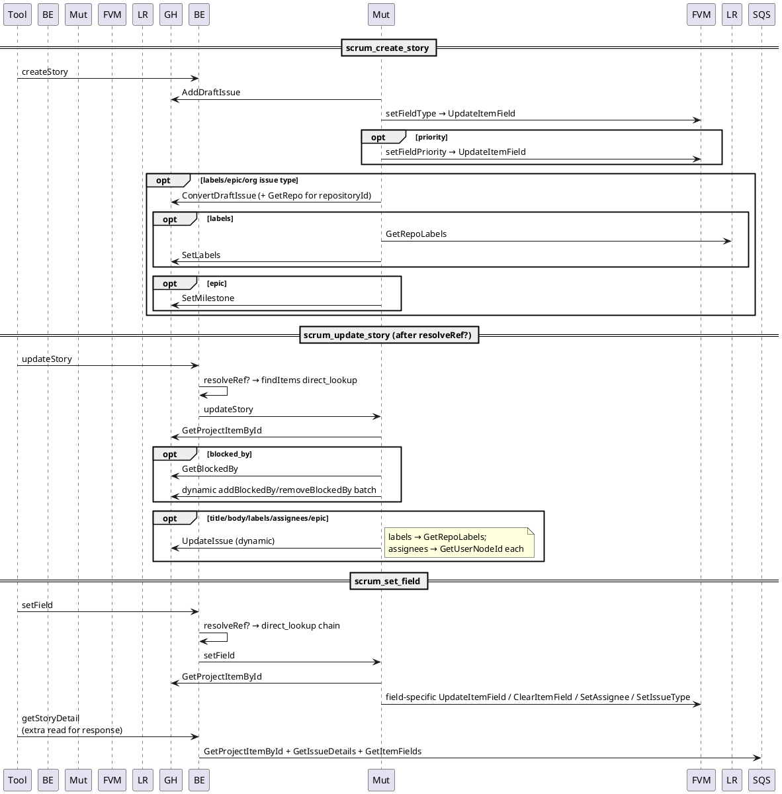
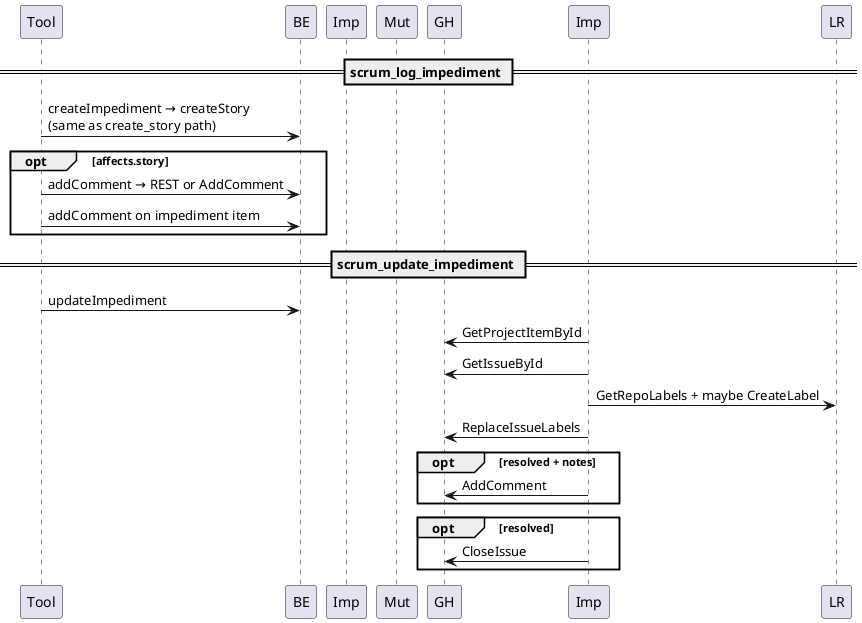
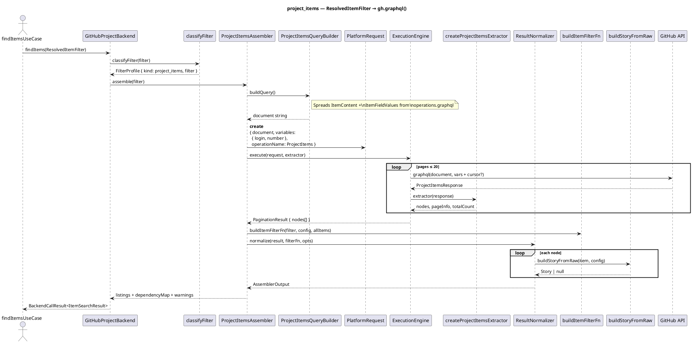

# Tool Surface → GitHub API Call Graph Audit

**Spike:** [github-projects-mcp-server#190](https://github.com/hoonsubin/github-projects-mcp-server/issues/190)  
**Scope:** Read-only source trace of all 11 `scrum_*` tools in this repo (`scrum-master-toolkit` / MCP server). No live API profiling.  
**Date:** 2026-06-02  

**Out of spike scope (documented briefly):** `scrum_plan_sprint` — registered in `src/tools/scrum-write.ts` but not in issue #190’s 11-tool list.

---

## Executive summary

| Finding | Impact |
|--------|--------|
| **Assembler pipeline covers only `scrum_find_items`** (`project_items`, `search_api`, `mixed`, `direct_lookup` branches). Everything else calls `gh.graphql()` / `gh.rest()` from service classes or `ExecutionEngine`’s sibling `PaginatedProjectItemFetcher`. | No unified assembly strategy; optimization must be per-path. |
| **`ProjectItems` full-board pagination** is the dominant cost: used by orient (sprint completion), board health, analytics history/burndown, sprint impediments, and most `find_items` profiles. | Repeated scans with no cross-tool cache. |
| **`resolveRef({ number })`** delegates to `findItems` → `direct_lookup` (per-key × per-repo `GetIssueProjectItem`), not a single-issue lookup. | Hidden multiplier on writes and `scrum_get_item_detail`. |
| **`scrum_set_field` re-reads full story** after mutation (`getStoryDetail` in tool handler). | Extra 2–3 GraphQL calls per invocation. |
| **Bootstrap (`GetUser/OrgProjectFieldsBootstrap`)** runs on every `scrum_orient` via `reload()`. | Orient always pays at least one heavy project-fields query. |

---

## Call path legend

| Layer | Location |
|-------|----------|
| Tool handler | `src/tools/scrum-read.ts`, `src/tools/scrum-write.ts` |
| Use case | `src/scrum/*.ts` |
| Facade | `src/adapters/github/backend.ts` (`GitHubProjectBackend`) |
| Services | `src/adapters/github/internal/*` |
| Assembler pipeline | `classifyFilter` → assembler → `ExecutionEngine.execute` **or** `DirectLookupAssembler` (bypass) |
| HTTP | `src/adapters/github/internal/http-client.ts` (`graphql`, `rest`) |

**Pagination notation:** `ProjectItems` = GraphQL operation built by `ProjectItemsQueryBuilder` (page size **100**, max **20** pages via `DEFAULT_PAGINATION_POLICY`). Write **`ProjectItems×P`** where **P** = pages consumed (1…20).

**Parallelism:** `→` sequential; `⇉` could run in parallel (code may still await sequentially).

---

## Diagram 1 — L2 Container (C4)

```plantuml
@startuml
!include https://raw.githubusercontent.com/plantuml-stdlib/C4-PlantUML/master/C4_Container.puml

Person(agent, "Scrum agent", "MCP client")
Container(mcp, "scrum-master-toolkit", "MCP server", "stdio/HTTP, scrum_* tools")
Container_Ext(gh, "GitHub API", "GraphQL + REST")

Rel(agent, mcp, "MCP tools/resources", "JSON-RPC")
Rel(mcp, gh, "graphql(), rest()", "HTTPS")

@enduml
```

---

## Diagram 2 — L3 Component: Adapter ownership

```plantuml
@startuml
!include https://raw.githubusercontent.com/plantuml-stdlib/C4-PlantUML/master/C4_Component.puml

Container_Boundary(adapter, "GitHub adapter") {
  Component(backend, "GitHubProjectBackend", "Facade", "ports delegation")
  Component(reloader, "ConfigReloader", "reload", "bootstrapGitHub")
  Component(assembler_pi, "ProjectItemsAssembler", "find_items", "→ ExecutionEngine")
  Component(assembler_search, "SearchApiAssembler", "find_items", "→ ExecutionEngine")
  Component(assembler_direct, "DirectLookupAssembler", "find_items, resolveRef", "direct gh.graphql")
  Component(engine, "ExecutionEngine", "pagination", "only gh.graphql entry for pipeline")
  Component(story_query, "StoryQueryService", "detail, fetchAllItems, sprint %", "direct gh")
  Component(story_mut, "StoryMutationService", "writes", "direct gh + rest")
  Component(field_mut, "FieldValueMutator", "setField", "direct gh")
  Component(board, "BoardHealthService", "health", "StoryQuery + Impediment")
  Component(analytics, "AnalyticsService", "analytics", "History + Burndown")
  Component(impediment, "ImpedimentService", "impediments", "direct gh")
  Component(epic, "EpicService", "epics", "direct gh + assembler")
}

Rel(backend, reloader, "reload()")
Rel(backend, assembler_pi, "findItems project_items/mixed")
Rel(backend, assembler_search, "findItems search_api")
Rel(backend, assembler_direct, "findItems direct_lookup")
Rel(assembler_pi, engine, "PlatformRequest")
Rel(assembler_search, engine, "PlatformRequest")
Rel(backend, story_query, "getStoryDetail, completion")
Rel(backend, story_mut, "create/update/setField/comment")
Rel(backend, board, "getBoardHealth")
Rel(backend, analytics, "getAnalytics")

note right of engine
  Assembler pipeline path
end note
note right of story_query
  Bypass: direct gh.graphql
end note

@enduml
```

---

## Per-tool traces

### 1. `scrum_orient`

Assumes the server was started with `--config .github/scrum/config.yml` (or `SCRUM_CONFIG_PATH` pointing at that file). Values below match the checked-in config: `owner_type: user`, `owner: hoonsubin`, `project_number: 5`, `tracked_repos: [github-projects-mcp-server]`, and `field_mapping.item_type: "Type"` (board-field type resolution — no org issue-types bootstrap).



**GraphQL count for this config (typical):** 1 (`GetUserProjectFieldsBootstrap`) + 1 (`GetRepoLabels`) + 1 (`ListMilestones`) + **P** (`ProjectItems` pages) when an active sprint exists — e.g. **4 + P** (often **5–6** total calls for ~100–200 board items).

**Not taken for `.github/scrum/config.yml`:** `GetOrgProjectFieldsBootstrap` (would apply if `owner_type: org`), `GetOrgIssueTypesBootstrap` (only when `item_type` is absent on the board and owner is org).

---

### 2. `scrum_find_items`

Router: `classifyFilter` in `filter-strategy-router.ts`.

#### Diagram 4 — Strategy branches



| Branch | Operations | Notes |
|--------|------------|-------|
| `direct_lookup` | `GetIssueProjectItem` × keys × repos (stop at first match per key) | Bypasses `ExecutionEngine` |
| `search_api` | `SearchIssues×pages` (first 100/page, max 20 pages) | `scope=all` → delegates to `ProjectItems×P` |
| `project_items` / `mixed` | `ProjectItems×P` | Via `ExecutionEngine` |
| `include_dependencies=true` | — | Client-side `buildDependencyMap` on fetched set |

**Minimum (single key, one repo, match on first repo):** 1× `GetIssueProjectItem`.  
**Worst find (full board):** `ProjectItems×min(ceil(N/100), 20)`.

---

### 3. `scrum_get_item_detail`

#### Diagram 5 — Sequence (incl. `resolveRef` cost)



| Ref shape | GraphQL sequence |
|-----------|------------------|
| `{ id }` | `GetProjectItemById` → (`GetIssueDetails` + `GetItemFields`) **or** `GetDraftIssueDetails` |
| `{ number }` | `GetIssueProjectItem×…` → same as above |

**Typical `{id}` issue:** 3 calls. **`{number}`:** 4+ calls.

---

### 4. `scrum_get_board_health` + 5. `scrum_get_analytics`

#### Diagram 6 — Shared `fetchAllItems` redundancy



#### `scrum_get_board_health`

| Step | Operation |
|------|-----------|
| `fetchStoriesForScope` | `ProjectItems×P` |
| `getOrphanImpediments` | `GetImpedimentIssues` |
| `getSprintImpediments` (if scope ≠ `"all"`) | `ProjectItems×P` again |

**Typical:** **2× full board scan + 1 impediment query.**

#### `scrum_get_analytics`

| `view` | Operations |
|--------|------------|
| `history` | `ProjectItems×P` once (`SprintHistoryService`) |
| `burndown` | `ProjectItems×P` (sprint-filtered collect) + **REST** `repos/.../issues/{n}/timeline` per story |
| `both` | Burndown + history paths (errors swallowed independently) |

**Burndown REST:** 1 request per sprint story with a number; sequential loop.

---

### 6–8. Write tools

#### Diagram 7 — `create_story`, `update_story`, `set_field`



| Tool | Typical GraphQL (+ REST) | `{ number }` prefix |
|------|--------------------------|---------------------|
| `scrum_create_story` | `AddDraftIssue` + `UpdateItemField` (type) + optional priority/convert/labels/milestone | N/A (creates new item) |
| `scrum_update_story` | `GetProjectItemById` + `UpdateIssue` (+ optional `GetBlockedBy` + batch) | + `GetIssueProjectItem×…` |
| `scrum_set_field` | resolve + `GetProjectItemById` + 1 field mutation + **detail re-fetch (3 calls)** | + direct_lookup |

**`set_field` by field (after `resolveStory`):**

| field | Extra operations |
|-------|----------------|
| status / sprint / story_points / priority / type (board) | `UpdateItemField` or `ClearItemField` |
| type (org issue type) | may `ConvertDraftIssue`; `SetIssueType` |
| assignee | `GetUserNodeId` + `SetAssignee` or `ClearAssignees` |

---

#### Diagram 8 — Impediment tools



---

### 9. `scrum_add_vocabulary`

| `kind` | Operations |
|--------|------------|
| `status_option` / `priority_option` | `GetFieldOptions` → (if new) `UpdateField` |
| `label` | `GetRepoLabels` → `GetRepo` → `CreateLabel` |

Idempotent path: 2 GraphQL (read + skip write).

---

## Pipeline bypass inventory

Services that call `gh.graphql()` / `gh.rest()` **without** `ExecutionEngine` / assembler `PlatformRequest`:

| Service | Used by tools |
|---------|----------------|
| `bootstrap` / `ConfigReloader` | `scrum_orient` |
| `DirectLookupAssembler` | `scrum_find_items`, `resolveRef` |
| `StoryQueryService` | `scrum_get_item_detail`, orient completion, board health (via fetchAllItems) |
| `StoryMutationService` | create/update/setField, impediment create |
| `FieldValueMutator` | setField, createStory |
| `LabelResolver` | orient, create/update, vocabulary, impediment update |
| `VocabularyManager` | `scrum_add_vocabulary` |
| `UserMilestoneResolver` | create/update/setField assignee |
| `ImpedimentService` | log/update impediment, board health |
| `EpicService` | orient (`getEpics`) |
| `BurndownCalculator` | analytics burndown (+ REST timeline) |
| `SprintHistoryService` | analytics history |

**Through assembler pipeline only:** `scrum_find_items` branches `project_items`, `search_api` (non-`all` scope), `mixed`; `SearchApiAssembler` may delegate to `ProjectItemsAssembler`.

---

## Cross-tool redundancy matrix

Rows = GitHub operation (GraphQL op name from `queries.ts` / inline). Columns = tool. **●** = fires on a normal successful invocation (pagination shown as ● per full scan).

| Operation | orient | find_items | item_detail | board_health | analytics | create | update | set_field | log_imp | update_imp | add_vocab |
|-----------|:------:|:----------:|:-----------:|:------------:|:---------:|:------:|:------:|:---------:|:-------:|:----------:|:---------:|
| GetUser/OrgProjectFieldsBootstrap | ● | | | | | | | | | | |
| GetOrgIssueTypesBootstrap | ○ | | | | | | | | | | |
| GetRepoLabels | ● | | | | | ○ | ○ | | | ○ | ○ |
| ListMilestones | ● | | | | | | | | | | |
| ProjectItems×P | ● | ● | ○ | ●● | ●● | | | ○ | | ● | |
| GetIssueProjectItem | | ● | ○ | | | | ○ | ○ | | | |
| SearchIssues | | ○ | | | | | | | | | |
| GetProjectItemById | | | ● | | | | ● | ● | | ● | |
| GetIssueDetails | | | ● | | | | | ● | | | |
| GetItemFields | | | ● | | | | | ● | | | |
| GetDraftIssueDetails | | | ○ | | | | | ○ | | | |
| GetImpedimentIssues | | | | ● | | | | | | | |
| REST issue timeline | | | | | ○ | | | | | | |
| AddDraftIssue | | | | | | ● | | | ● | | |
| UpdateItemField / Clear | | | | | | ● | | ● | ● | | |
| ConvertDraftIssue | | | | | | ○ | ○ | ○ | ○ | | |
| UpdateIssue | | | | | | | ○ | | | | |
| GetFieldOptions + UpdateField | | | | | | | | | | | ○ |
| CreateLabel | | | | | | | | | | ○ | ○ |
| ReplaceIssueLabels / CloseIssue / AddComment | | | | | | | | | ○ | ● | |

○ = conditional branch; ●● = two full scans in one tool invocation.

**Key cross-tool duplicates (no shared session cache):**

1. **`ProjectItems×P`** — orient (completion), find_items (most branches), board_health (×2), analytics (history + burndown), impediment sprint listing, `resolveRef`.
2. **`GetProjectItemById`** — item detail, all writes after resolve, impediment update, set_field response.
3. **Bootstrap** — only orient triggers `reload()`, but every orient pays full bootstrap.

---

## Theoretical minimum call table

Assumptions: single tracked repo, board has type on field (no org issue-types bootstrap), `{ id }` refs, ~N project items, P = pages for full board, S = stories in target sprint, K = lookup keys.

| Tool | Current (typical) | Minimum achievable | Gap | Gap description |
|------|-------------------|--------------------|-----|-----------------|
| scrum_orient | 3–5 + P | 1 bootstrap + 0–1 milestones | P + extra reads | Sprint completion requires item set; could use lighter query than full `ItemContent`+`ItemFieldValues` fragment |
| scrum_find_items (project_items) | P | P | 0 | GitHub Projects has no server-side filter API; must paginate |
| scrum_find_items (direct_lookup) | K×R | K | K×(R−1) | Stop after first repo; parallelize key lookups |
| scrum_find_items (search_api) | 1–20 | 1 | pages−1 | Narrower query / smaller board |
| scrum_get_item_detail | 3 (id) | 2 | 1 | `GetIssueDetails` + `GetItemFields` parallelizable; could merge into one query document |
| scrum_get_board_health | 2P + 1 | P + 1 | P | Single `ProjectItems` pass for stories + impediment filter in memory |
| scrum_get_analytics (both) | 2P + S REST | P + S REST | P | One board fetch shared by history + burndown |
| scrum_create_story | 2–6 | 2 | 0–4 | Optional convert/labels/milestone |
| scrum_update_story | 2–5+ | 2 | 0–3+ | blocked_by batch; assignee serial `GetUserNodeId` |
| scrum_set_field | 5–8 | 2 | 3–6 | Remove post-mutation `getStoryDetail`; avoid `resolveRef` if id known |
| scrum_log_impediment | create + 0–2 comments | same | 0 | Inherent workflow |
| scrum_update_impediment | 4–7 | 3 | 1–4 | Label read/create could be cached per session |
| scrum_add_vocabulary | 2 | 2 | 0 | Already minimal for idempotent add |

---

## Dependency classification (sequential vs parallelizable)

| Call pair | Relationship |
|-----------|--------------|
| Bootstrap → any live read | **Sequential** (hard) |
| `GetIssueDetails` → `GetItemFields` (detail) | **Parallelizable** (independent node queries) |
| `resolveStory` → field mutations | **Sequential** (needs item/issue ids) |
| `ListMilestones` multi-repo | **Parallelizable** (already `Promise.all`) |
| `buildSprintInfo` active/next/completed | **Parallelizable** (already `Promise.all`; no API inside) |
| Burndown timelines per issue | **Parallelizable** (currently sequential REST) |
| `UserMilestoneResolver` multiple assignees | **Parallelizable** (currently sequential) |
| History + burndown in `view=both` | **Parallelizable** (currently try/catch sequential) |

---

# Adapter-layer query formation audit

**Spike:** [github-projects-mcp-server#220](https://github.com/hoonsubin/github-projects-mcp-server/issues/220)  
**Companion:** [github-projects-mcp-server#190](https://github.com/hoonsubin/github-projects-mcp-server/issues/190) (system-wide call graph — see [`docs/AUDIT.md`](../docs/AUDIT.md))  
**Milestone:** Adapter Layer Assembly Pattern  
**Date:** 2026-06-02  
**Scope:** `src/adapters/github/` only — no port, use-case, or tool-handler changes in this spike.

---

## Spike synthesis

Issue #220 audits **how use-case inputs become GitHub GraphQL payloads** across the four `findItems` assembler branches, then ranks **adapter-only** optimizations by payload reduction × call frequency.

| Dimension | Detail |
|-----------|--------|
| **Problem** | Query formation is implicit: the same `ItemContent` + `ItemFieldValues` bundle is used for lightweight aggregations and rich listings; board-field filters run client-side after a full `projectV2.items` scan. |
| **Downstream of #190** | #190 maps *which* tools call *which* operations; this spike maps *what each operation selects* vs *what mappers actually read*. |
| **Reframe (2026-06-02)** | Original scope was a binary `fieldValueFilters` check; expanded to all branches + full GitHub filtering survey ([issue comment](https://github.com/hoonsubin/github-projects-mcp-server/issues/220#issuecomment-4605645959)). |
| **Deliverables** | Formation trace, payload table, server-side filtering survey, minimum viable queries, ranked optimization candidates, follow-on stories. |
| **Live API validation** | Required for Q3 in the issue acceptance criteria. **Not executed in this workspace** (`GITHUB_TOKEN` unset, `gh` not authenticated). Schema + code trace + public API docs are documented below; live probes are listed as blocking follow-up. |

Prior observational work on `scrum_orient` is captured in [issue comment #4605008366](https://github.com/hoonsubin/github-projects-mcp-server/issues/220#issuecomment-4605008366) and is incorporated into the non-assembler paths section.

---

## Q1 — Formation path: `ResolvedItemFilter` → `gh.graphql()`

### Entry and classification

1. **Port input:** `ResolvedItemFilter` (`src/scrum/ports.ts`) — keys, scope, search, board fields (statuses, sprint_ref, types, priority), labels, assignee, epic_id, estimated, include_dependencies, limit.
2. **Classification:** `classifyFilter()` in `filter-strategy-router.ts` produces exactly one `FilterProfile` (priority: keys → search-only → board-only → mixed).
3. **Routing:** `GitHubProjectBackend.findItems()` dispatches to one assembler (`backend.ts`).

### Branch-specific assembly

| Branch | Assembler | `PlatformRequest` | HTTP entry |
|--------|-----------|-------------------|------------|
| `direct_lookup` | `DirectLookupAssembler` | Per key × repo: `GET_ISSUE_PROJECT_ITEM_QUERY` (`GetIssueProjectItem`) | `gh.graphql()` directly (no `ExecutionEngine`) |
| `search_api` | `SearchApiAssembler` | `SEARCH_ISSUES_QUERY` + variables `{ query, first: 100 }` | `ExecutionEngine.execute()` |
| `project_items` | `ProjectItemsAssembler` | Dynamic doc from `ProjectItemsQueryBuilder.buildQuery()` | `ExecutionEngine.execute()` |
| `mixed` | `MixedAssembler` | Delegates to `ProjectItemsAssembler` (identical wire shape) | Same as `project_items` |

### Shared post-assembly pipeline (all branches except direct’s per-call loop)

1. **Pagination:** `ExecutionEngine` adds `cursor` to variables, collects nodes (max 20 pages × 100 items).
2. **Client filter:** `buildItemFilterFn()` — sprint scope, statuses, types, text search on title/body, etc.
3. **Normalization:** `ResultNormalizer` → `buildStoryFromRaw()` → `resolveDependencyRefs()` → `toItemListing()` → `enrichListingCustomFields()`.
4. **Finalize:** `finalizeAssemblerOutput()` applies `limit`, scope summary, warnings.

### Information at each boundary

| Boundary | Preserved | Added | Discarded |
|----------|-----------|-------|-----------|
| `ResolvedItemFilter` → `FilterProfile` | All filter dimensions | `kind` discriminator | Nothing (full filter kept on profile or parallel arg) |
| Assembler → `PlatformRequest` | Owner login, project number | GraphQL document, operation name | Board-field predicates (not sent to GitHub on `project_items`) |
| `ExecutionEngine` → `PaginationResult` | Raw nodes | `pagesConsumed`, `truncated` | Page boundaries |
| `ResultNormalizer` → `AssemblerOutput` | Stories matching `filterFn` | `custom_fields` JSON blob | Non-matching items; non-selected fields never mapped to domain |

### Fragment selection (project_items / mixed / bypass fetchers)

`ProjectItemsQueryBuilder` composes an anonymous operation spreading:

- `...ItemContent` — issue/PR/draft body, labels, assignees, milestone, blockedBy, repository
- `...ItemFieldValues` — all configured field value typenames (first: 20)

Source: `operations.graphql` fragments, injected via `getFragmentSource()` in `queries.ts`.

---

## Diagram — Query formation (`project_items` branch)



---

## Q2 — Payload analysis (fetched vs consumed)

### Counting method

- **Fetched:** Distinct GraphQL leaf selections on each `ProjectV2Item` node in the operation (node scalars + fragment fields; array multiplicity counted once per field path).
- **Consumed:** Fields read by `buildStoryFromRaw`, `extractBoardFields`, `buildItemFilterFn` (search on body), `enrichListingCustomFields`, and `buildDependencyMap` when `include_dependencies` is true.
- **Primary use case:** `scrum_find_items` listing path (full Story projection).

### Payload analysis table

| Branch | Operation | Fragments / shape | Field paths fetched (per item) | Field paths consumed (listing) | Excess % | Notes |
|--------|-----------|-------------------|-------------------------------|--------------------------------|----------|-------|
| `direct_lookup` | `GetIssueProjectItem` | `ItemContent`, `ItemFieldValues` on matched project item | ~52 | ~28 | **~46%** | Cost × `keys.length` × `tracked_repos` until match; same over-fetch as board scan per hit. |
| `search_api` | `SearchIssues` | Issue-level issue fields + nested `ItemFieldValues` only on `projectItems`; **no** `ItemContent` on project item | ~48 on issue + ~22 on project item | ~28 | **~35–40%** | Search already filters repo/text/labels/assignee server-side; board fields still client-filtered. `scope: all` falls back to `project_items`. |
| `project_items` | Anonymous `ProjectItems` | `ItemContent`, `ItemFieldValues` + node scalars | ~55 | ~28 | **~49%** | No server-side filter on `items()`; full board pagination then `buildItemFilterFn`. Dominant path for sprint/status/type filters. |
| `mixed` | Same as `project_items` | Identical | ~55 | ~28 | **~49%** | `MixedAssembler` is a one-line delegate; pays full board scan + client text search. |

### Highest-impact unused fetches (`ItemContent` / listing)

| Fetched | Used by listing? | Used by aggregation-only paths? |
|---------|------------------|--------------------------------|
| `body` | Yes (search filter only when `filter.search` set) | No |
| `state` | No | No |
| `labels.color` | No | No |
| `milestone.dueOn` | No | No |
| `repository.*` | No | No |
| `issueType.id` | No | No |
| `blockedBy` | Only if `include_dependencies` | No |
| Full `ItemFieldValues` (all typenames) | Only mapped fields + `custom_fields` passthrough | Only status, sprint `iterationId`, story points |

### Mapper guard inflating “required” fetches

`buildStoryFromRaw` returns `null` when `content.labels` or `content.assignees` is missing on Issue/PR (`mappers.ts`). That forces full label/assignee connections even for **`computeSprintCompletion`**, which only needs `fieldValues` + terminal status — see non-assembler section.

---

## Q3 — Server-side filtering capabilities

### Schema findings (bundled `schema.graphql`)

| Mechanism | Present in schema? | Supports iteration / single-select / number? |
|-----------|-------------------|-----------------------------------------------|
| `projectV2.items(fieldValueFilters: …)` | **No** | N/A — not in generated schema |
| `projectV2.items(query: String)` | **Yes** (`"Search query for filtering items"`) | **Unknown syntax** — not used in codebase; needs live probe |
| `ProjectV2Item.fieldValueByName(name:)` | **Yes** | Per-item; reduces field payload, not item count |
| `search(query:)` (issues) | **Yes** — `SearchIssues` | Text, `label:`, `assignee:`, `repo:` — **not** board iteration/status |
| `repository.issues(labels, states)` | **Yes** — `GetImpedimentIssues`, `ListIssues` | Labels/state only; not project board fields |
| REST issue timeline | Used in burndown | Event-type filter server-side; separate from project items |

Community/docs consensus: **no GraphQL filter on custom project field values** for the items connection; client-side filter after full fetch is the documented pattern ([Stack Overflow](https://stackoverflow.com/questions/73103486), [openillumi summary](https://openillumi.com/en/en-graphql-project-v2-custom-field-filter-limitation/)).

### Live validation checklist (blocked — run before closing #220)

Execute with project credentials and record response / errors:

1. **`items(query:)`** — e.g. iteration title, status option name, `is:issue` style strings (GitHub docs are sparse; treat as experiment).
2. **`SearchIssues`** — confirm board-field filters cannot be expressed; measure `issueCount` vs post-filter count.
3. **`fieldValueByName`** — compare payload size vs `fieldValues(first: 20)` for a single item.
4. **Closed issues on board** — search uses `is:issue` without `is:open` by design (`search-query-builder.ts`); confirm parity with board scan.

---

## Q4 — Minimum viable queries (per branch)

### `project_items` / `mixed` — listing (current behavior preserved)

Lean target: **selective fragments by intent** (adapter-only if fragment registry supports profiles):

```graphql
# Profile: listing-minimal (illustrative)
nodes {
  id type createdAt updatedAt isArchived
  content {
    __typename
    ... on Issue {
      id number title url body
      issueType { name }
      assignees(first: 5) { nodes { login } }
      labels(first: 10) { nodes { name } }
      milestone { id title }
      blockedBy(first: 10) { nodes { id number title } }
    }
    # PR / DraftIssue: parallel minimal shapes
  }
  fieldValues(first: 20) { /* only typenames present in config field_mapping */ }
}
```

Remove: `state`, `labels.color`, `milestone.dueOn`, `repository.*`, unused `ItemFieldValues` typenames.

### `project_items` — aggregation-only (`computeSprintCompletion`, burndown input)

```graphql
# Profile: sprint-aggregate
nodes {
  id
  content { __typename ... on Issue { id } ... on DraftIssue { id } }
  fieldValues(first: 20) {
    nodes {
      ... on ProjectV2ItemFieldIterationValue { iterationId field { ... on ProjectV2FieldCommon { id } } }
      ... on ProjectV2ItemFieldSingleSelectValue { name field { ... on ProjectV2FieldCommon { id } } }
      ... on ProjectV2ItemFieldNumberValue { number field { ... on ProjectV2FieldCommon { id } } }
    }
  }
}
```

Requires: relax `buildStoryFromRaw` null-guard for aggregation-only callers **or** add `buildSprintAggregateFromRaw` in `mappers.ts` (still adapter-local).

### `search_api`

Already omits `ItemContent` on project items; trim issue-level `body` when `filter.search` is empty; drop `blockedBy` unless `include_dependencies`.

### `direct_lookup`

Same profiles as `project_items` once key resolves; avoid `GetIssueProjectItem` fan-out by caching project item id after first resolve (adapter cache, optional).

---

## Non-assembler paths (same query shape)

These **bypass** the assembler pipeline but reuse **`ProjectItemsQueryBuilder` + `PaginatedProjectItemFetcher`** (identical `ItemContent` + `ItemFieldValues`):

| Caller | Method | Why it hurts |
|--------|--------|--------------|
| `StoryQueryService` | `fetchAllItems` / `computeSprintCompletion` | Full board scan for two SP numbers |
| `BoardHealthService` | via `fetchAllItems` | Full scan for aggregates |
| `BurndownCalculator` | paginated items + REST timeline | Full scan per burndown |
| `SprintHistoryService` | `fetchAllItems` | Full scan |
| `ImpedimentService` | board cross-reference | Full scan |

`scrum_orient` profile (from issue comment): bootstrap ×2 + `ListMilestones` + **P** `ProjectItems` pages — ~700ms–1.2s @ ~100 items, linear in board size.

---

## Q5 — Optimization candidates

**Urgency** = estimated payload reduction × path frequency (H / M / L).

| Candidate | Change description | Layer-safe? | Est. payload reduction | Complexity | Urgency |
|-----------|-------------------|-------------|------------------------|------------|---------|
| **Sprint-aggregate query profile** | `ProjectItemsQueryBuilder.buildQuery(profile)` without `ItemContent`; use in `StoryQueryService.computeSprintCompletion`, burndown collection | Adapter-only | **60–80%** per orient/health page | Med | **H** |
| **Relax mapper null-guard** | Allow missing `labels`/`assignees` when only board fields needed | Adapter-only (`mappers.ts`) | Enables aggregate profile | Low | **H** |
| **`fieldValueByName` selective fetch** | Replace `fieldValues(first:20)` with named fields from `config.live.fields` | Adapter-only | **30–50%** field subgraph | Med | **M** |
| **Listing-minimal `ItemContent`** | Drop `state`, `repository`, `label.color`, `milestone.dueOn`; conditional `body` | Adapter-only | **25–40%** listing | Med | **M** |
| **Probe `items(query:)`** | Pass server filter string for sprint/status if syntax exists | Adapter-only | **Up to 90%** page count if viable | Low probe / High if refactor | **H** (after live proof) |
| **Request-scoped board cache** | Single pagination per `findItems` + orient when multiple services need items | Adapter-only | Saves duplicate **P** pages | Med | **M** |
| **Direct lookup cache** | Memoize issue# → project item id within process | Adapter-only | Cuts **K×R** `GetIssueProjectItem` | Low | **M** |
| **`custom_fields` passthrough** | Stop JSON-serializing all field nodes unless tool requests | Adapter-only | CPU + response size | Med | **L** |
| **Skip second `reload()` on orient** | Requires use-case change | **Requires port/use-case** | 1 bootstrap call | Low | Out of spike scope |
| **Port: slim `findItems` result** | Return aggregate DTO without listings | **Requires port** | Large | High | Out of spike scope |

---

## Follow-on stories (adapter-safe, high urgency)

Create in `github-projects-mcp-server` before closing #220:

1. **Query profiles in `ProjectItemsQueryBuilder`** — `full | listing-minimal | sprint-aggregate` with tests asserting identical domain output for listing profile.
2. **Aggregation mapper path** — `buildAggregateStoryFromRaw` or relaxed guards; wire `computeSprintCompletion` + burndown to aggregate profile.
3. **Live spike: `projectV2.items(query:)`** — document supported filter grammar or close as non-viable.
4. **Request-scoped `ProjectItem` cache** on `GitHubInfraContext` for orient + board health in one MCP request.

---

## Acceptance criteria status (#220)

| Criterion | Status |
|-----------|--------|
| Formation path for all four branches | Done (this doc + `docs/AUDIT.md`) |
| Payload analysis table | Done (approximate counts; refine with live response sampling) |
| Server-side filtering validated live | **Blocked** — token/auth required |
| Minimum viable query per branch | Done (profiles above) |
| Optimization candidates classified | Done |
| Follow-on issues created | **Pending** — list above ready to file |
| Findings comment on #220 | **Pending** — paste summary + link to this file when posting |

---

## Key code references

| Concern | Location |
|---------|----------|
| Filter classification | `src/adapters/github/internal/filter-strategy-router.ts` |
| Dynamic ProjectItems doc | `src/adapters/github/internal/project-items-query-builder.ts` |
| Fragments | `src/adapters/github/operations.graphql` (`ItemContent`, `ItemFieldValues`) |
| Consumption | `src/adapters/github/mappers.ts` (`buildStoryFromRaw`, `extractBoardFields`) |
| Client-side filter | `src/adapters/github/internal/item-filter.ts` |
| Sprint completion scan | `src/adapters/github/internal/story-query-service.ts` (`computeSprintCompletion`) |
| Bypass pagination | `src/adapters/github/internal/pagination.ts` |

