# Architecture Audit Report

**Generated:** 2026-05-31T16:45:35.294Z
**Commit:** `e2a191e`
**Source directory:** `./src`

## 1. Architecture Compliance

Modules scanned: **76**

| Rule | Severity | Status | Violations |
|------|----------|--------|------------|
| domain-must-not-depend-on-inner-layers | error | 🟢 Pass | 0 |
| use-case-must-not-depend-on-adapters | error | 🟢 Pass | 0 |
| services-must-not-depend-on-adapters | error | 🟢 Pass | 0 |
| adapters-must-not-depend-on-tools-schemas-server | error | 🟢 Pass | 0 |
| tools-must-not-depend-on-adapters | error | 🟢 Pass | 0 |
| schemas-must-not-depend-on-src | error | 🟢 Pass | 0 |
| no-circular-dependencies | error | 🟢 Pass | 0 |
| no-console-log | error | 🟢 Pass | 0 |

## 2. Layer Dependency Graph

```mermaid
flowchart LR

  subgraph entrypoint["Entry Point Layer"]
    src_server_ts["src/server.ts"]
  end

  subgraph framework["Framework Layer"]
    src__deno_shim_node_ts["src/_deno-shim.node.ts"]
    src_services_error_enrichment_ts["services/error-enrichment.ts"]
    src_services_logger_ts["services/logger.ts"]
    src_schemas_inputs_ts["schemas/inputs.ts"]
    src_schemas_scrum_ts["schemas/scrum.ts"]
    src_tools_scrum_read_ts["tools/scrum-read.ts"]
    src_tools_scrum_write_ts["tools/scrum-write.ts"]
    src_services_pick_defined_ts["services/pick-defined.ts"]
  end

  subgraph use-case["Use-Case Layer"]
    src_scrum_ports_ts["scrum/ports.ts"]
    src_scrum_resolve_location_ts["scrum/resolve-location.ts"]
    src_scrum_url_rewriters_ts["scrum/url-rewriters.ts"]
    src_scrum_listing_mappers_ts["scrum/listing-mappers.ts"]
    src_scrum_sprint_math_ts["scrum/sprint-math.ts"]
    src_scrum_fetch_location_ts["scrum/fetch-location.ts"]
    src_scrum__test_utils_ts["scrum/_test_utils.ts"]
    src_scrum_config_boot_ts["scrum/config-boot.ts"]
    src_scrum_find_items_ts["scrum/find-items.ts"]
    src_scrum_get_analytics_ts["scrum/get-analytics.ts"]
    src_scrum_get_board_health_ts["scrum/get-board-health.ts"]
    src_scrum_get_story_ts["scrum/get-story.ts"]
    src_scrum_orient_ts["scrum/orient.ts"]
    src_scrum_template_resource_ts["scrum/template-resource.ts"]
    src_scrum_update_impediment_ts["scrum/update-impediment.ts"]
  end

  subgraph domain["Domain Layer"]
    src_domain_errors_ts["domain/errors.ts"]
    src_domain_types_ts["domain/types.ts"]
    src_domain_content_location_ts["domain/content-location.ts"]
    src_domain_config_ts["domain/config.ts"]
    src_domain_rules_readiness_ts["rules/readiness.ts"]
    src_domain_rules_acceptance_criteria_ts["rules/acceptance-criteria.ts"]
  end

  subgraph adapter["Adapter Layer"]
    src_adapters_abstract_backend_ts["adapters/abstract-backend.ts"]
    src_adapters_capabilities_ts["adapters/capabilities.ts"]
    src_adapters_factory_ts["adapters/factory.ts"]
    src_adapters_github_backend_ts["github/backend.ts"]
    src_adapters_github_bootstrap_ts["github/bootstrap.ts"]
    src_adapters_github_errors_ts["github/errors.ts"]
    src_adapters_github_queries_ts["github/queries.ts"]
    src_adapters_github_operations_graphql["github/operations.graphql"]
    src_adapters_github_types_ts["github/types.ts"]
    src_adapters_github_generated_github_types_ts["generated/github-types.ts"]
    src_adapters_github_internal_analytics_service_ts["internal/analytics-service.ts"]
    src_adapters_github_internal_burndown_calculator_ts["internal/burndown-calculator.ts"]
    src_adapters_github_mappers_ts["github/mappers.ts"]
    src_adapters_github_internal_infra_context_ts["internal/infra-context.ts"]
    src_adapters_github_internal_http_client_ts["internal/http-client.ts"]
    src_adapters_github_internal_pagination_ts["internal/pagination.ts"]
    src_adapters_github_internal_assemblers_extractors_ts["assemblers/extractors.ts"]
    src_adapters_github_internal_execution_engine_ts["internal/execution-engine.ts"]
    src_adapters_github_internal_assemblers_types_ts["assemblers/types.ts"]
    src_adapters_github_internal_project_items_query_builder_ts["internal/project-items-query-builder.ts"]
    src_adapters_github_internal_resolver_ts["internal/resolver.ts"]
    src_adapters_github_internal_sprint_history_service_ts["internal/sprint-history-service.ts"]
    src_adapters_github_internal_assemblers_direct_lookup_assembler_ts["assemblers/direct-lookup-assembler.ts"]
    src_adapters_github_internal_assembler_output_ts["internal/assembler-output.ts"]
    src_adapters_github_internal_item_filter_ts["internal/item-filter.ts"]
    src_adapters_github_internal_result_normalizer_ts["internal/result-normalizer.ts"]
    src_adapters_github_internal_story_query_service_ts["internal/story-query-service.ts"]
    src_adapters_github_internal_assemblers_mixed_assembler_ts["assemblers/mixed-assembler.ts"]
    src_adapters_github_internal_assemblers_project_items_assembler_ts["assemblers/project-items-assembler.ts"]
    src_adapters_github_internal_assemblers_search_api_assembler_ts["assemblers/search-api-assembler.ts"]
    src_adapters_github_internal_search_query_builder_ts["internal/search-query-builder.ts"]
    src_adapters_github_internal_search_result_normalizer_ts["internal/search-result-normalizer.ts"]
    src_adapters_github_internal_board_health_service_ts["internal/board-health-service.ts"]
    src_adapters_github_internal_impediment_service_ts["internal/impediment-service.ts"]
    src_adapters_github_internal_label_resolver_ts["internal/label-resolver.ts"]
    src_adapters_github_internal_story_mutation_service_ts["internal/story-mutation-service.ts"]
    src_adapters_github_internal_field_value_mutator_ts["internal/field-value-mutator.ts"]
    src_adapters_github_internal_user_milestone_resolver_ts["internal/user-milestone-resolver.ts"]
    src_adapters_github_internal_config_reloader_ts["internal/config-reloader.ts"]
    src_adapters_github_internal_epic_service_ts["internal/epic-service.ts"]
    src_adapters_github_internal_filter_strategy_router_ts["internal/filter-strategy-router.ts"]
    src_adapters_github_internal_vocabulary_manager_ts["internal/vocabulary-manager.ts"]
    src_adapters_github_factory_ts["github/factory.ts"]
    src_adapters_github_internal_file_reader_ts["internal/file-reader.ts"]
    src_adapters_github_internal__test_utils_ts["internal/_test_utils.ts"]
    src_adapters_github_internal_display_helpers_ts["internal/display-helpers.ts"]
  end

  src_adapters_abstract_backend_ts --green--> src_domain_errors_ts
  src_adapters_abstract_backend_ts --green--> src_domain_types_ts
  src_adapters_abstract_backend_ts --green--> src_scrum_ports_ts
  src_adapters_abstract_backend_ts --green--> src_services_error_enrichment_ts
  src_scrum_ports_ts --green--> src_domain_content_location_ts
  src_scrum_ports_ts --green--> src_domain_types_ts
  src_scrum_ports_ts --green--> src_services_error_enrichment_ts
  src_services_error_enrichment_ts --green--> src_domain_errors_ts
  src_services_error_enrichment_ts --green--> src_domain_types_ts
  src_adapters_factory_ts --green--> src_domain_config_ts
  src_adapters_factory_ts --green--> src_domain_content_location_ts
  src_adapters_factory_ts --green--> src_domain_errors_ts
  src_adapters_factory_ts --green--> src_scrum_ports_ts
  src_adapters_github_backend_ts --green--> src_domain_errors_ts
  src_adapters_github_backend_ts --green--> src_domain_types_ts
  src_adapters_github_backend_ts --green--> src_scrum_ports_ts
  src_adapters_github_backend_ts --green--> src_services_error_enrichment_ts
  src_adapters_github_bootstrap_ts --green--> src_domain_config_ts
  src_adapters_github_bootstrap_ts --green--> src_domain_content_location_ts
  src_adapters_github_bootstrap_ts --green--> src_domain_types_ts
  src_adapters_github_bootstrap_ts --green--> src_scrum_resolve_location_ts
  src_scrum_resolve_location_ts --green--> src_domain_content_location_ts
  src_scrum_resolve_location_ts --green--> src_domain_errors_ts
  src_scrum_url_rewriters_ts --green--> src_domain_content_location_ts
  src_adapters_github_errors_ts --green--> src_domain_errors_ts
  src_adapters_github_errors_ts --green--> src_domain_types_ts
  src_adapters_github_types_ts --green--> src_domain_types_ts
  src_adapters_github_internal_analytics_service_ts --green--> src_domain_types_ts
  src_adapters_github_internal_analytics_service_ts --green--> src_scrum_listing_mappers_ts
  src_adapters_github_internal_analytics_service_ts --green--> src_scrum_ports_ts
  src_adapters_github_internal_analytics_service_ts --green--> src_scrum_sprint_math_ts
  src_scrum_listing_mappers_ts --green--> src_domain_types_ts
  src_scrum_sprint_math_ts --green--> src_domain_types_ts
  src_adapters_github_internal_burndown_calculator_ts --green--> src_domain_types_ts
  src_adapters_github_internal_burndown_calculator_ts --green--> src_scrum_ports_ts
  src_adapters_github_internal_burndown_calculator_ts --green--> src_scrum_sprint_math_ts
  src_adapters_github_internal_burndown_calculator_ts --green--> src_services_logger_ts
  src_adapters_github_mappers_ts --green--> src_domain_types_ts
  src_adapters_github_mappers_ts --green--> src_scrum_ports_ts
  src_adapters_github_mappers_ts --green--> src_scrum_sprint_math_ts
  src_adapters_github_internal_http_client_ts --green--> src_services_logger_ts
  src_adapters_github_internal_assemblers_types_ts --green--> src_domain_types_ts
  src_adapters_github_internal_assemblers_types_ts --green--> src_scrum_ports_ts
  src_adapters_github_internal_resolver_ts --green--> src_domain_types_ts
  src_adapters_github_internal_sprint_history_service_ts --green--> src_scrum_ports_ts
  src_adapters_github_internal_assemblers_direct_lookup_assembler_ts --green--> src_scrum_ports_ts
  src_adapters_github_internal_assembler_output_ts --green--> src_domain_types_ts
  src_adapters_github_internal_assembler_output_ts --green--> src_scrum_ports_ts
  src_adapters_github_internal_item_filter_ts --green--> src_domain_types_ts
  src_adapters_github_internal_item_filter_ts --green--> src_scrum_ports_ts
  src_adapters_github_internal_result_normalizer_ts --green--> src_domain_types_ts
  src_adapters_github_internal_result_normalizer_ts --green--> src_scrum_listing_mappers_ts
  src_adapters_github_internal_story_query_service_ts --green--> src_domain_types_ts
  src_adapters_github_internal_story_query_service_ts --green--> src_scrum_ports_ts
  src_adapters_github_internal_story_query_service_ts --green--> src_services_error_enrichment_ts
  src_adapters_github_internal_assemblers_mixed_assembler_ts --green--> src_scrum_ports_ts
  src_adapters_github_internal_assemblers_project_items_assembler_ts --green--> src_scrum_ports_ts
  src_adapters_github_internal_assemblers_search_api_assembler_ts --green--> src_scrum_ports_ts
  src_adapters_github_internal_board_health_service_ts --green--> src_domain_rules_readiness_ts
  src_adapters_github_internal_board_health_service_ts --green--> src_domain_types_ts
  src_adapters_github_internal_board_health_service_ts --green--> src_scrum_ports_ts
  src_adapters_github_internal_impediment_service_ts --green--> src_domain_types_ts
  src_adapters_github_internal_impediment_service_ts --green--> src_scrum_ports_ts
  src_adapters_github_internal_label_resolver_ts --green--> src_scrum_ports_ts
  src_adapters_github_internal_story_mutation_service_ts --green--> src_domain_errors_ts
  src_adapters_github_internal_story_mutation_service_ts --green--> src_domain_types_ts
  src_adapters_github_internal_story_mutation_service_ts --green--> src_scrum_ports_ts
  src_adapters_github_internal_field_value_mutator_ts --green--> src_domain_types_ts
  src_adapters_github_internal_epic_service_ts --green--> src_domain_types_ts
  src_adapters_github_internal_filter_strategy_router_ts --green--> src_scrum_ports_ts
  src_adapters_github_internal_vocabulary_manager_ts --green--> src_domain_errors_ts
  src_adapters_github_internal_vocabulary_manager_ts --green--> src_scrum_ports_ts
  src_adapters_github_factory_ts --green--> src_domain_content_location_ts
  src_adapters_github_internal_file_reader_ts --green--> src_domain_content_location_ts
  src_adapters_github_internal_file_reader_ts --green--> src_scrum_fetch_location_ts
  src_adapters_github_internal_file_reader_ts --green--> src_scrum_ports_ts
  src_scrum_fetch_location_ts --green--> src_domain_content_location_ts
  src_scrum_fetch_location_ts --green--> src_domain_errors_ts
  src_schemas_scrum_ts --green--> src_domain_types_ts
  src_scrum__test_utils_ts --green--> src_domain_content_location_ts
  src_scrum_config_boot_ts --green--> src_domain_config_ts
  src_scrum_config_boot_ts --green--> src_domain_content_location_ts
  src_scrum_config_boot_ts --green--> src_domain_errors_ts
  src_scrum_find_items_ts --green--> src_domain_types_ts
  src_scrum_get_analytics_ts --green--> src_domain_types_ts
  src_scrum_get_board_health_ts --green--> src_domain_types_ts
  src_scrum_get_story_ts --green--> src_domain_rules_acceptance_criteria_ts
  src_scrum_get_story_ts --green--> src_domain_types_ts
  src_scrum_orient_ts --green--> src_domain_config_ts
  src_scrum_orient_ts --green--> src_domain_content_location_ts
  src_scrum_orient_ts --green--> src_domain_types_ts
  src_scrum_orient_ts --green--> src_services_error_enrichment_ts
  src_scrum_template_resource_ts --green--> src_domain_content_location_ts
  src_scrum_update_impediment_ts --green--> src_domain_types_ts
  src_server_ts --green--> src_adapters_factory_ts
  src_server_ts --green--> src_adapters_github_factory_ts
  src_server_ts --green--> src_domain_config_ts
  src_server_ts --green--> src_domain_errors_ts
  src_server_ts --green--> src_scrum_config_boot_ts
  src_server_ts --green--> src_scrum_resolve_location_ts
  src_server_ts --green--> src_scrum_template_resource_ts
  src_server_ts --green--> src_services_logger_ts
  src_server_ts --green--> src_tools_scrum_read_ts
  src_server_ts --green--> src_tools_scrum_write_ts
  src_tools_scrum_read_ts --green--> src_domain_config_ts
  src_tools_scrum_read_ts --green--> src_scrum_find_items_ts
  src_tools_scrum_read_ts --green--> src_scrum_get_analytics_ts
  src_tools_scrum_read_ts --green--> src_scrum_get_board_health_ts
  src_tools_scrum_read_ts --green--> src_scrum_get_story_ts
  src_tools_scrum_read_ts --green--> src_scrum_orient_ts
  src_tools_scrum_read_ts --green--> src_scrum_ports_ts
  src_tools_scrum_write_ts --green--> src_domain_config_ts
  src_tools_scrum_write_ts --green--> src_domain_types_ts
  src_tools_scrum_write_ts --green--> src_scrum_ports_ts
  src_tools_scrum_write_ts --green--> src_scrum_update_impediment_ts
```

## 3. Stability (Instability) Metrics

_Instability (I) measures outgoing dependencies. I=0 means the module depends on nothing (highly stable); I=1 means it depends on many things (fragile)._

| Module | Layer | I | Risk |
|--------|-------|---|------|
| `src/adapters/github/internal/_test_utils.ts` | adapter | 1.00 | 🔴 high-risk |
| `src/adapters/github/internal/display-helpers.ts` | adapter | 1.00 | 🔴 high-risk |
| `src/scrum/_test_utils.ts` | use-case | 1.00 | 🔴 high-risk |
| `src/server.ts` | entrypoint | 1.00 | 🔴 high-risk |
| `src/adapters/github/factory.ts` | adapter | 0.97 | 🔴 high-risk |
| `src/adapters/github/backend.ts` | adapter | 0.96 | 🔴 high-risk |
| `src/tools/scrum-read.ts` | framework | 0.89 | 🔴 high-risk |
| `src/tools/scrum-write.ts` | framework | 0.88 | 🔴 high-risk |
| `src/adapters/github/internal/assemblers/search-api-assembler.ts` | adapter | 0.87 | 🔴 high-risk |
| `src/scrum/config-boot.ts` | use-case | 0.86 | 🔴 high-risk |
| `src/scrum/orient.ts` | use-case | 0.86 | 🔴 high-risk |
| `src/adapters/github/internal/assemblers/direct-lookup-assembler.ts` | adapter | 0.85 | 🔴 high-risk |
| `src/adapters/abstract-backend.ts` | adapter | 0.83 | 🔴 high-risk |
| `src/adapters/github/internal/burndown-calculator.ts` | adapter | 0.83 | 🔴 high-risk |
| `src/adapters/github/internal/board-health-service.ts` | adapter | 0.83 | 🔴 high-risk |
| `src/adapters/github/internal/analytics-service.ts` | adapter | 0.82 | 🔴 high-risk |
| `src/adapters/github/internal/impediment-service.ts` | adapter | 0.80 | 🔴 high-risk |
| `src/adapters/github/internal/file-reader.ts` | adapter | 0.80 | 🔴 high-risk |
| `src/adapters/github/internal/vocabulary-manager.ts` | adapter | 0.78 | 🟡 moderate |
| `src/adapters/github/internal/story-mutation-service.ts` | adapter | 0.77 | 🟡 moderate |
| `src/adapters/github/internal/sprint-history-service.ts` | adapter | 0.75 | 🟡 moderate |
| `src/adapters/github/internal/epic-service.ts` | adapter | 0.75 | 🟡 moderate |
| `src/scrum/get-story.ts` | use-case | 0.75 | 🟡 moderate |
| `src/scrum/template-resource.ts` | use-case | 0.75 | 🟡 moderate |
| `src/adapters/factory.ts` | adapter | 0.71 | 🟡 moderate |
| `src/adapters/github/internal/assemblers/project-items-assembler.ts` | adapter | 0.71 | 🟡 moderate |
| `src/adapters/github/internal/story-query-service.ts` | adapter | 0.68 | 🟡 moderate |
| `src/adapters/github/internal/field-value-mutator.ts` | adapter | 0.67 | 🟡 moderate |
| `src/adapters/github/internal/filter-strategy-router.ts` | adapter | 0.67 | 🟡 moderate |
| `src/scrum/find-items.ts` | use-case | 0.67 | 🟡 moderate |
| `src/scrum/get-analytics.ts` | use-case | 0.67 | 🟡 moderate |
| `src/scrum/get-board-health.ts` | use-case | 0.67 | 🟡 moderate |
| `src/scrum/update-impediment.ts` | use-case | 0.67 | 🟡 moderate |
| `src/adapters/github/internal/result-normalizer.ts` | adapter | 0.64 | 🟡 moderate |
| `src/adapters/github/internal/assembler-output.ts` | adapter | 0.63 | 🟡 moderate |
| `src/adapters/github/internal/item-filter.ts` | adapter | 0.63 | 🟡 moderate |
| `src/adapters/github/internal/assemblers/mixed-assembler.ts` | adapter | 0.60 | 🟡 moderate |
| `src/adapters/github/internal/config-reloader.ts` | adapter | 0.60 | 🟡 moderate |
| `src/adapters/github/internal/assemblers/extractors.ts` | adapter | 0.57 | 🟡 moderate |
| `src/adapters/github/internal/user-milestone-resolver.ts` | adapter | 0.57 | 🟡 moderate |
| `src/adapters/github/internal/pagination.ts` | adapter | 0.56 | 🟡 moderate |
| `src/adapters/github/mappers.ts` | adapter | 0.55 | 🟡 moderate |
| `src/scrum/resolve-location.ts` | use-case | 0.50 | 🟡 moderate |
| `src/scrum/listing-mappers.ts` | use-case | 0.50 | 🟡 moderate |
| `src/adapters/github/internal/search-query-builder.ts` | adapter | 0.50 | 🟡 moderate |
| `src/adapters/github/internal/search-result-normalizer.ts` | adapter | 0.50 | 🟡 moderate |
| `src/scrum/fetch-location.ts` | use-case | 0.50 | 🟡 moderate |
| `src/schemas/scrum.ts` | framework | 0.50 | 🟡 moderate |
| `src/adapters/github/internal/label-resolver.ts` | adapter | 0.44 | 🟡 moderate |
| `src/adapters/github/internal/resolver.ts` | adapter | 0.43 | 🟡 moderate |
| `src/scrum/sprint-math.ts` | use-case | 0.40 | 🟡 moderate |
| `src/scrum/url-rewriters.ts` | use-case | 0.33 | 🟡 moderate |
| `src/adapters/github/bootstrap.ts` | adapter | 0.32 | 🟡 moderate |
| `src/adapters/github/internal/http-client.ts` | adapter | 0.30 | 🟡 moderate |
| `src/services/error-enrichment.ts` | framework | 0.25 | 🟡 moderate |
| `src/adapters/github/internal/execution-engine.ts` | adapter | 0.22 | 🟡 moderate |
| `src/adapters/github/internal/project-items-query-builder.ts` | adapter | 0.22 | 🟡 moderate |
| `src/adapters/github/internal/infra-context.ts` | adapter | 0.20 | 🟢 low-risk |
| `src/adapters/github/internal/assemblers/types.ts` | adapter | 0.18 | 🟢 low-risk |
| `src/domain/config.ts` | domain | 0.13 | 🟢 low-risk |
| `src/scrum/ports.ts` | use-case | 0.11 | 🟢 low-risk |
| `src/adapters/github/types.ts` | adapter | 0.10 | 🟢 low-risk |
| `src/adapters/github/errors.ts` | adapter | 0.10 | 🟢 low-risk |
| `src/domain/errors.ts` | domain | 0.08 | 🟢 low-risk |
| `src/adapters/github/queries.ts` | adapter | 0.07 | 🟢 low-risk |
| `src/_deno-shim.node.ts` | framework | 0.00 | 🟢 low-risk |
| `src/domain/types.ts` | domain | 0.00 | 🟢 low-risk |
| `src/domain/content-location.ts` | domain | 0.00 | 🟢 low-risk |
| `src/adapters/capabilities.ts` | adapter | 0.00 | 🟢 low-risk |
| `src/adapters/github/operations.graphql` | adapter | 0.00 | 🟢 low-risk |
| `src/adapters/github/generated/github-types.ts` | adapter | 0.00 | 🟢 low-risk |
| `src/services/logger.ts` | framework | 0.00 | 🟢 low-risk |
| `src/domain/rules/readiness.ts` | domain | 0.00 | 🟢 low-risk |
| `src/domain/rules/acceptance-criteria.ts` | domain | 0.00 | 🟢 low-risk |
| `src/schemas/inputs.ts` | framework | 0.00 | 🟢 low-risk |
| `src/services/pick-defined.ts` | framework | 0.00 | 🟢 low-risk |

## 4. File Statistics

| Layer | Files | Total LOC | Top 3 Largest |
|-------|-------|-----------|---------------|
| adapter | 44 | 7270 | `adapters/github/bootstrap.ts` (517 LOC), `adapters/github/types.ts` (468 LOC), `adapters/github/mappers.ts` (419 LOC) |
| use-case | 15 | 1491 | `scrum/ports.ts` (389 LOC), `scrum/orient.ts` (221 LOC), `scrum/sprint-math.ts` (168 LOC) |
| framework | 8 | 1471 | `schemas/scrum.ts` (460 LOC), `tools/scrum-write.ts` (454 LOC), `tools/scrum-read.ts` (260 LOC) |
| domain | 6 | 1116 | `domain/types.ts` (721 LOC), `domain/config.ts` (125 LOC), `domain/rules/readiness.ts` (95 LOC) |
| entrypoint | 1 | 487 | `server.ts` (487 LOC) |

## 5. Unused Exports

**Total unused exports:** 84

| File | Export | Kind |
|------|--------|------|
| `src/scrum/config-boot.ts` | BootConfig | interface |
| `src/scrum/config-boot.ts` | loadScrumConfig | function |
| `src/scrum/sprint-math.ts` | buildSprintMeta | function |
| `src/scrum/url-rewriters.ts` | URL_REWRITERS | var |
| `src/scrum/_test_utils.ts` | buildTypeTemplatePaths | function |
| `src/scrum/_test_utils.ts` | typeTemplatePathsPromise | var |
| `src/scrum/_test_utils.ts` | realFileReader | var |
| `src/scrum/_test_utils.ts` | stubFileReader | var |
| `src/scrum/_test_utils.ts` | withTestServer | function |
| `src/scrum/ports.ts` | FieldPresence | interface |
| `src/scrum/ports.ts` | FieldWithOptions | interface |
| `src/scrum/ports.ts` | DisplayMap | type |
| `src/scrum/ports.ts` | StoryListing | interface |
| `src/scrum/ports.ts` | EpicPort | interface |
| `src/scrum/template-resource.ts` | templateResourceUseCase | function |
| `src/scrum/resolve-location.ts` | SUPPORTED_CONFIG_EXTENSIONS | var |
| `src/scrum/resolve-location.ts` | SupportedConfigExtension | type |
| `src/scrum/resolve-location.ts` | SupportedTemplateExtension | type |
| `src/tools/scrum-read.ts` | SCRUM_READ_TOOL_NAMES | var |
| `src/tools/scrum-read.ts` | registerScrumReadTools | function |
| `src/tools/scrum-write.ts` | SCRUM_WRITE_TOOL_NAMES | var |
| `src/tools/scrum-write.ts` | registerScrumWriteTools | function |
| `_deno-shim.node.ts` | addEventListener | function |
| `_deno-shim.node.ts` | Deno | var |
| `src/schemas/inputs.ts` | GraphQLQuerySchema | var |
| `src/adapters/factory.ts` | createBackend | function |
| `src/adapters/github/errors.ts` | GitHubErrorCode | type |
| `src/adapters/github/queries.ts` | ADD_PROJECT_ITEM_MUTATION | var |
| `src/adapters/github/queries.ts` | CREATE_ISSUE_MUTATION | var |
| `src/adapters/github/mappers.ts` | toSprintInfo | function |
| `src/adapters/github/internal/assembler-output.ts` | backfillSprintRefs | function |
| `src/adapters/github/internal/pagination.ts` | isBacklogItem | function |
| `src/adapters/github/internal/project-items-query-builder.ts` | ProjectV2ItemsPage | interface |
| `src/adapters/github/internal/display-helpers.ts` | resolveTerminalDisplay | function |
| `src/adapters/github/internal/display-helpers.ts` | resolveHighestPriorityDisplay | function |
| `src/adapters/github/internal/search-result-normalizer.ts` | SearchIssueNode | interface |
| `src/adapters/github/internal/label-resolver.ts` | GitHubLabel | interface |
| `src/adapters/github/internal/label-resolver.ts` | RepoNodeIdProvider | interface |
| `src/adapters/github/internal/_test_utils.ts` | GitHubClientSpy | interface |
| `src/adapters/github/internal/_test_utils.ts` | createGhSpy | function |
| `src/adapters/github/internal/_test_utils.ts` | makeConfig | function |
| `src/adapters/github/internal/_test_utils.ts` | makeCtx | function |
| `src/adapters/github/internal/execution-engine.ts` | PaginationPolicy | interface |
| `src/adapters/github/internal/execution-engine.ts` | DEFAULT_PAGINATION_POLICY | var |
| `src/adapters/github/internal/search-query-builder.ts` | SearchQueryParts | interface |
| `src/adapters/github/factory.ts` | GitHubAdapterFactory | class |
| `src/adapters/github/types.ts` | GitHubMilestoneId | type |
| `src/adapters/github/types.ts` | toEntityRef | function |
| `src/adapters/github/types.ts` | ItemContentType | type |
| `src/adapters/github/types.ts` | IssueIdentity | type |
| `src/adapters/github/types.ts` | PrIdentity | type |
| `src/adapters/github/types.ts` | PrDiscriminator | type |
| `src/adapters/github/types.ts` | PrState | type |
| `src/adapters/github/types.ts` | IssueState | type |
| `src/adapters/github/types.ts` | IssueRef | type |
| `src/adapters/github/types.ts` | LabelRef | type |
| `src/adapters/github/types.ts` | FieldValueField | type |
| `src/adapters/github/types.ts` | FieldValueUser | type |
| `src/adapters/github/types.ts` | FieldValueUserNodes | type |
| `src/adapters/github/types.ts` | FieldValueLabel | type |
| `src/adapters/github/types.ts` | FieldValueLabelNodes | type |
| `src/adapters/github/types.ts` | FieldValueMilestone | type |
| `src/adapters/github/types.ts` | FieldValueRepository | type |
| `src/adapters/github/types.ts` | LabelColorNodes | type |
| `src/adapters/github/types.ts` | IssueTypeRef | type |
| `src/adapters/github/bootstrap.ts` | GitHubLiveMetadata | interface |
| `src/adapters/github/bootstrap.ts` | TypeResolution | type |
| `src/adapters/abstract-backend.ts` | UnsupportedCapabilityError | class |
| `src/domain/errors.ts` | UseCaseErrorCode | type |
| `src/domain/content-location.ts` | CONTENT_LOCATION_KINDS | var |
| `src/domain/content-location.ts` | ContentLocationKind | type |
| `src/domain/types.ts` | EpicRefWithName | type |
| `src/domain/types.ts` | EpicStatus | type |
| `src/domain/types.ts` | SprintName | type |
| `src/domain/types.ts` | ScrumTemplateUri | type |
| `src/domain/types.ts` | SprintRiskStance | type |
| `src/domain/types.ts` | SprintContext | interface |
| `src/domain/types.ts` | ItemListing | type |
| `src/domain/types.ts` | SUPPORTED_BACKENDS | var |
| `src/domain/types.ts` | DataSource | type |
| `src/domain/types.ts` | SprintTotalsKind | type |
| `src/domain/config.ts` | AutonomyLevel | type |
| `src/domain/config.ts` | ArtifactType | type |
| `src/services/error-enrichment.ts` | enrichError | function |

---

*Report generated by `deno task audit`. Do not edit manually.*