# GitHub Projects MCP Server — Module Dependency Diagram

Generated by [generate-project-diagram.ts](../scripts/generate-project-diagram.ts)

This diagram shows the class structure of the codebase, with each module as a class containing its exported symbols, and relationships showing import dependencies.

---

## Module Overview

```mermaid
classDiagram
    direction LR

    class orient.ts:::scrum {
        +orientUseCase()
    }

    class get-backlog.ts:::scrum {
        +getBacklogUseCase()
    }

    class get-template.ts:::scrum {
        +getTemplateUseCase()
    }

    class sprint-math.ts:::scrum {
        +buildSprintMeta()
        +groupStoriesByStatus()
        +computeSprintTotals()
        +buildSprintWindow()
        +buildIdealLine()
        +buildDaySeries()
        %% Unused: groupStoriesByStatus, computeSprintTotals
    }

    class get-story.ts:::scrum {
        +getStoryUseCase()
    }

    class get-burndown.ts:::scrum {
        +getBurndownUseCase()
    }

    class ports.ts:::scrum {
        interface SprintInfo
        interface PlatformState
        interface StoryDetail
        interface BurndownStoryInput
        interface SprintHistoryEntry
        interface BurndownInput
        interface CompletionMap
        interface CreateStoryInput
        interface StoryUpdates
        type VocabularyKind
        interface Ref
        interface StoryListing
        interface ImpedimentListing
        interface SprintTotalsActive
        interface SprintTotalsHistory
        interface SprintSnapshot
        interface BacklogPort
        interface SprintPort
        interface StoryPort
        interface HistoryPort
        interface BurndownPort
        interface ImpedimentPort
        interface TemplatePort
        interface ProjectReader
        interface ProjectWriter
        interface ProjectBackend
        %% Unused: SprintTotalsActive, SprintTotalsHistory, ProjectWriter
    }

    class get-history.ts:::scrum {
        +getHistoryUseCase()
    }

    class update-impediment.ts:::scrum {
        +updateImpedimentUseCase()
        %% Unused: updateImpedimentUseCase
    }

    class get-sprint.ts:::scrum {
        +getSprintUseCase()
    }

    class scrum-read.ts:::tools {
        +registerScrumReadTools()
    }

    class scrum-write.ts:::tools {
        +registerScrumWriteTools() void
    }

    class scrum.ts:::schemas {
        +var GetSprintSchema
        +var GetBacklogSchema
        +var GetStorySchema
        +var GetHistorySchema
        +var GetBurndownSchema
        +var CreateStorySchema
        +var UpdateStorySchema
        +var SetFieldSchema
        +var PlanSprintSchema
        +var LogImpedimentSchema
        +var UpdateImpedimentSchema
        +var AddVocabularySchema
        +var GetTemplateSchema
    }

    class inputs.ts:::schemas {
        +var GraphQLQuerySchema
    }

    class errors.ts:::github {
        class GitHubApiError
    }

    class queries.ts:::github {
        +var GET_ISSUE_DETAILS_QUERY
        +var GET_ITEM_FIELDS_QUERY
        +var GET_REPO_LABELS_QUERY
        +var GET_IMPEDIMENT_ISSUES_QUERY
    }

    class mappers.ts:::github {
        interface IssueDetailsInput
        +buildStoryFromRaw()
        +buildEnrichedStory()
        +buildCommentList()
        +buildLinkedPrList()
        +buildBurndownStoryInput()
    }

    class burndown-calculator.ts:::internal {
        class BurndownCalculator
        %% Unused: BurndownCalculator
    }

    class pagination.ts:::internal {
        class PaginatedProjectItemFetcher
        +isBacklogItem()
    }

    class resolver.ts:::internal {
        +resolveSprint()
        +resolveStory()
    }

    class field-value-mutator.ts:::internal {
        class FieldValueMutator
        %% Unused: FieldValueMutator
    }

    class user-milestone-resolver.ts:::internal {
        class UserMilestoneResolver
    }

    class label-resolver.ts:::internal {
        interface GitHubLabel
        class LabelResolver
        %% Unused: GitHubLabel
    }

    class vocabulary-manager.ts:::internal {
        class VocabularyManager
        %% Unused: VocabularyManager
    }

    class contents.ts:::internal {
        +fetchRepoFile()
    }

    class http-client.ts:::internal {
        interface RestResponse
        +graphql()
        +rest()
    }

    class types.ts:::github {
        interface GitHubBackendConfig
        interface GraphQLResponse
        type ItemContentType
        interface ProjectItemIssueContent
        interface ProjectItemPRContent
        interface ProjectItemDraftContent
        interface ProjectItem
        interface ItemFieldValue
        interface FieldValueNode
        interface BoardFields
        interface Comment
        interface LinkedPr
    }

    class config-loader.ts:::github {
        interface RuntimeConfig
        +loadConfig()
    }

    class backend.ts:::github {
        class GitHubProjectBackend
    }

    class index.ts:::src {
    }

    class types.ts:::domain {
        interface StoryRef
        interface ImpedimentRef
        type SprintRef
        interface Story
        interface IterationEntry
        interface BurndownResponse
        interface BurndownSprintMeta
        interface BurndownDayPoint
        interface IdealDayPoint
        interface BurndownStory
        type ArtifactType
        type TemplateResponse
        %% Unused: ImpedimentRef
    }

    class acceptance-criteria.ts:::rules {
        +parseAcceptanceCriteria()
    }

    class status.ts:::rules {
        +isTerminalStatus()
    }

    class readiness.ts:::rules {
        +computeReadinessSummary()
    }

    class labels.ts:::rules {
        type StoryTypeLabel
        +classifyLabels()
    }

    class config.ts:::domain {
        interface ScrumConfig
    }

    class mutation-validator.ts:::services {
        +isMutationQuery() boolean
    }

    class error-enrichment.ts:::services {
        +enrichError()
    }

    class logger.ts:::services {
        +var log
    }

    class ports.ts:::scrum {
    }


    Orient --> Index : "imports"
    Get_Backlog --> Index : "imports"
    Get_Template --> Index : "imports"
    Sprint_Math --> Index : "imports"
    Get_Story --> Index : "imports"
    Get_Burndown --> Index : "imports"
    Ports --> Index : "imports"
    Get_History --> Index : "imports"
    Update_Impediment --> Index : "imports"
    Get_Sprint --> Index : "imports"
    Scrum_Read --> Index : "imports"
    Scrum_Write --> Index : "imports"
    Scrum --> Index : "imports"
    Inputs --> Index : "imports"
    Queries --> Index : "imports"
    Mappers --> Index : "imports"
    Burndown_Calculator --> Index : "imports"
    Pagination --> Index : "imports"
    Resolver --> Index : "imports"
    Field_Value_Mutator --> Index : "imports"
    User_Milestone_Resolver --> Index : "imports"
    Label_Resolver --> Index : "imports"
    Vocabulary_Manager --> Index : "imports"
    Contents --> Index : "imports"
    Http_Client --> Index : "imports"
    Types --> Index : "imports"
    Config_Loader --> Index : "imports"
    Backend --> Index : "imports"
    Status --> Index : "imports"
    Config --> Index : "imports"
    Error_Enrichment --> Index : "imports"

    classDef scrum fill:#f9f,stroke:#333,stroke-width:2px,color:#000;
    classDef tools fill:#ccf,stroke:#333,stroke-width:2px,color:#000;
    classDef schemas fill:#cfc,stroke:#333,stroke-width:2px,color:#000;
    classDef github fill:#ffc,stroke:#333,stroke-width:2px,color:#000;
    classDef internal fill:#fcc,stroke:#333,stroke-width:2px,color:#000;
    classDef src fill:#cff,stroke:#333,stroke-width:2px,color:#000;
    classDef domain fill:#fcf,stroke:#333,stroke-width:2px,color:#000;
    classDef rules fill:#0ff,stroke:#333,stroke-width:2px,color:#000;
    classDef services fill:#f0f,stroke:#333,stroke-width:2px,color:#000;
```

## Unused Exports

The following exports are never imported by any other module in the codebase:

| Module                                                                                                            | Export                    | Kind        |
| ----------------------------------------------------------------------------------------------------------------- | ------------------------- | ----------- |
| [`./src/scrum/sprint-math.ts`](../src/scrum/sprint-math.ts)                                                       | `groupStoriesByStatus`    | `function`  |
| [`./src/scrum/sprint-math.ts`](../src/scrum/sprint-math.ts)                                                       | `computeSprintTotals`     | `function`  |
| [`./src/scrum/ports.ts`](../src/scrum/ports.ts)                                                                   | `SprintTotalsActive`      | `interface` |
| [`./src/scrum/ports.ts`](../src/scrum/ports.ts)                                                                   | `SprintTotalsHistory`     | `interface` |
| [`./src/scrum/ports.ts`](../src/scrum/ports.ts)                                                                   | `ProjectWriter`           | `interface` |
| [`./src/scrum/update-impediment.ts`](../src/scrum/update-impediment.ts)                                           | `updateImpedimentUseCase` | `function`  |
| [`./src/adapters/github/internal/burndown-calculator.ts`](../src/adapters/github/internal/burndown-calculator.ts) | `BurndownCalculator`      | `class`     |
| [`./src/adapters/github/internal/field-value-mutator.ts`](../src/adapters/github/internal/field-value-mutator.ts) | `FieldValueMutator`       | `class`     |
| [`./src/adapters/github/internal/label-resolver.ts`](../src/adapters/github/internal/label-resolver.ts)           | `GitHubLabel`             | `interface` |
| [`./src/adapters/github/internal/vocabulary-manager.ts`](../src/adapters/github/internal/vocabulary-manager.ts)   | `VocabularyManager`       | `class`     |
| [`./src/domain/types.ts`](../src/domain/types.ts)                                                                 | `ImpedimentRef`           | `interface` |

## Notes

- Each class represents a TypeScript module
- Members are the exported symbols with their types
- Relationships show which modules import which
- Test files are excluded by default
- Generated code and GraphQL operations are excluded
- External imports (npm:, jsr:, @std/*) are filtered out

---

_Auto-generated — do not edit manually_
