# GitHub Projects MCP Server — Module Dependency Diagram

Generated by [generate-project-diagram.ts](../scripts/generate-project-diagram.ts)

This diagram shows the class structure of the codebase, with each module as a class containing its exported symbols, and relationships showing import dependencies.

---

## Module Overview

```mermaid
classDiagram
    direction LR

    class Orient:::scrum {
        +orientUseCase()
    }

    class Get_Backlog:::scrum {
        +getBacklogUseCase()
    }

    class Get_Template:::scrum {
        +getTemplateUseCase()
    }

    class Sprint_Math:::scrum {
        +buildSprintMeta()
        +groupStoriesByStatus()
        +computeSprintTotals()
        +buildSprintWindow()
        +buildIdealLine()
        +buildDaySeries()
        %% Unused: groupStoriesByStatus, computeSprintTotals
    }

    class Get_Story:::scrum {
        +getStoryUseCase()
    }

    class Get_Burndown:::scrum {
        +getBurndownUseCase()
    }

    class Ports:::scrum {
        interface SprintInfo
        interface PlatformState
        interface StoryDetail
        interface BurndownStoryInput
        interface SprintHistoryEntry
        interface BurndownInput
        interface CompletionMap
        interface CreateStoryInput
        interface StoryUpdates
        type VocabularyKind
        interface Ref
        interface StoryListing
        interface ImpedimentListing
        interface SprintTotalsActive
        interface SprintTotalsHistory
        interface SprintSnapshot
        interface ProjectBackend
        %% Unused: Ref, ImpedimentListing, SprintTotalsActive, SprintTotalsHistory
    }

    class Get_History:::scrum {
        +getHistoryUseCase()
    }

    class Get_Sprint:::scrum {
        +getSprintUseCase()
    }

    class Scrum_Read:::tools {
        +registerScrumReadTools()
    }

    class Scrum_Write:::tools {
        +registerScrumWriteTools() void
    }

    class Scrum:::schemas {
        +var GetSprintSchema
        +var GetBacklogSchema
        +var GetStorySchema
        +var GetHistorySchema
        +var GetBurndownSchema
        +var CreateStorySchema
        +var UpdateStorySchema
        +var SetFieldSchema
        +var PlanSprintSchema
        +var LogImpedimentSchema
        +var AddVocabularySchema
        +var GetTemplateSchema
    }

    class Inputs:::schemas {
        +var GraphQLQuerySchema
    }

    class Types:::root {
    }

    class Errors:::github {
        class GitHubApiError
    }

    class Queries:::github {
        +var GET_ISSUE_DETAILS_QUERY
        +var GET_ITEM_FIELDS_QUERY
        +var GET_REPO_LABELS_QUERY
    }

    class Mappers:::github {
        interface IssueDetailsInput
        +buildStoryFromRaw()
        +buildEnrichedStory()
        +buildCommentList()
        +buildLinkedPrList()
        +buildBurndownStoryInput()
    }

    class Types:::github {
        interface GitHubBackendConfig
        interface GraphQLResponse
        type ItemContentType
        interface ProjectItemIssueContent
        interface ProjectItemPRContent
        interface ProjectItemDraftContent
        interface ProjectItem
        interface ItemFieldValue
        interface FieldValueNode
        interface BoardFields
        interface Comment
        interface LinkedPr
    }

    class Config_Loader:::github {
        interface RuntimeConfig
        +loadConfig()
    }

    class Backend:::github {
        class GitHubProjectBackend
    }

    class Index:::root {
    }

    class Types:::domain {
        interface StoryRef
        interface ImpedimentRef
        type SprintRef
        interface Story
        interface IterationEntry
        interface BurndownResponse
        interface BurndownSprintMeta
        interface BurndownDayPoint
        interface IdealDayPoint
        interface BurndownStory
        type ArtifactType
        type TemplateResponse
        %% Unused: ImpedimentRef
    }

    class Acceptance_Criteria:::rules {
        +parseAcceptanceCriteria()
    }

    class Readiness:::rules {
        +computeReadinessSummary()
    }

    class Labels:::rules {
        type StoryTypeLabel
        +classifyLabels()
    }

    class Config:::domain {
        interface ScrumConfig
    }

    class Github:::services {
        interface RestResponse
        +graphql()
        +rest()
        +decodeRepoFileContent()
        +fetchRepoFile()
        %% Unused: decodeRepoFileContent
    }

    class Pagination:::services {
        class PaginatedProjectItemFetcher
        +isBacklogItem()
    }

    class Resolver:::services {
        +resolveSprint()
        +resolveStory()
    }

    class Mutation_Validator:::services {
        +isMutationQuery() boolean
    }

    class Error_Enrichment:::services {
        +enrichError()
    }

    class Logger:::services {
        +var log
    }


    Orient --> Ports : "imports"
    Orient --> Config : "imports"
    Get_Backlog --> Ports : "imports"
    Get_Backlog --> Config : "imports"
    Get_Backlog --> Readiness : "imports"
    Get_Template --> Ports : "imports"
    Get_Template --> Types : "imports"
    Get_Template --> Config : "imports"
    Sprint_Math --> Types : "imports"
    Sprint_Math --> Ports : "imports"
    Get_Story --> Ports : "imports"
    Get_Story --> Types : "imports"
    Get_Story --> Acceptance_Criteria : "imports"
    Get_Burndown --> Ports : "imports"
    Get_Burndown --> Types : "imports"
    Get_Burndown --> Config : "imports"
    Get_Burndown --> Sprint_Math : "imports"
    Ports --> Types : "imports"
    Get_History --> Ports : "imports"
    Get_History --> Config : "imports"
    Get_Sprint --> Ports : "imports"
    Get_Sprint --> Types : "imports"
    Get_Sprint --> Sprint_Math : "imports"
    Scrum_Read --> Index : "imports"
    Scrum_Read --> Ports : "imports"
    Scrum_Read --> Config : "imports"
    Scrum_Read --> Scrum : "imports"
    Scrum_Read --> Error_Enrichment : "imports"
    Scrum_Read --> Orient : "imports"
    Scrum_Read --> Get_Template : "imports"
    Scrum_Read --> Get_Story : "imports"
    Scrum_Read --> Get_Sprint : "imports"
    Scrum_Read --> Get_Backlog : "imports"
    Scrum_Read --> Get_History : "imports"
    Scrum_Read --> Get_Burndown : "imports"
    Scrum_Write --> Index : "imports"
    Scrum_Write --> Ports : "imports"
    Scrum_Write --> Types : "imports"
    Scrum_Write --> Config : "imports"
    Scrum_Write --> Scrum : "imports"
    Scrum_Write --> Inputs : "imports"
    Scrum_Write --> Mutation_Validator : "imports"
    Scrum_Write --> Error_Enrichment : "imports"
    Scrum_Write --> Github : "imports"
    Scrum --> Index : "imports"
    Inputs --> Index : "imports"
    Queries --> Index : "imports"
    Mappers --> Config_Loader : "imports"
    Mappers --> Types : "imports"
    Mappers --> Ports : "imports"
    Mappers --> Labels : "imports"
    Types --> Github_Types : "imports"
    Config_Loader --> Index : "imports"
    Config_Loader --> Types : "imports"
    Config_Loader --> Config : "imports"
    Backend --> Github : "imports"
    Backend --> Errors : "imports"
    Backend --> Config_Loader : "imports"
    Backend --> Resolver : "imports"
    Backend --> Pagination : "imports"
    Backend --> Mappers : "imports"
    Backend --> Queries : "imports"
    Backend --> Ports : "imports"
    Backend --> Types : "imports"
    Index --> Scrum_Read : "imports"
    Index --> Scrum_Write : "imports"
    Index --> Config_Loader : "imports"
    Index --> Backend : "imports"
    Index --> Github : "imports"
    Index --> Logger : "imports"
    Index --> Ports : "imports"
    Index --> Types : "imports"
    Index --> Config : "imports"
    Config --> Types : "imports"
    Github --> Types : "imports"
    Github --> Logger : "imports"
    Github --> Errors : "imports"
    Pagination --> Config_Loader : "imports"
    Pagination --> Types : "imports"
    Resolver --> Config_Loader : "imports"
    Resolver --> Types : "imports"
    Error_Enrichment --> Errors : "imports"

    classDef scrum fill:#f9f,stroke:#333,stroke-width:2px,color:#000;
    classDef tools fill:#ccf,stroke:#333,stroke-width:2px,color:#000;
    classDef schemas fill:#cfc,stroke:#333,stroke-width:2px,color:#000;
    classDef root fill:#ffc,stroke:#333,stroke-width:2px,color:#000;
    classDef github fill:#fcc,stroke:#333,stroke-width:2px,color:#000;
    classDef domain fill:#cff,stroke:#333,stroke-width:2px,color:#000;
    classDef rules fill:#fcf,stroke:#333,stroke-width:2px,color:#000;
    classDef services fill:#0ff,stroke:#333,stroke-width:2px,color:#000;
```

## Unused Exports

The following exports are never imported by any other module in the codebase:

| Module                                                | Export                  | Kind        |
| ----------------------------------------------------- | ----------------------- | ----------- |
| [`scrum/sprint-math.ts`](../src/scrum/sprint-math.ts) | `groupStoriesByStatus`  | `function`  |
| [`scrum/sprint-math.ts`](../src/scrum/sprint-math.ts) | `computeSprintTotals`   | `function`  |
| [`scrum/ports.ts`](../src/scrum/ports.ts)             | `Ref`                   | `interface` |
| [`scrum/ports.ts`](../src/scrum/ports.ts)             | `ImpedimentListing`     | `interface` |
| [`scrum/ports.ts`](../src/scrum/ports.ts)             | `SprintTotalsActive`    | `interface` |
| [`scrum/ports.ts`](../src/scrum/ports.ts)             | `SprintTotalsHistory`   | `interface` |
| [`domain/types.ts`](../src/domain/types.ts)           | `ImpedimentRef`         | `interface` |
| [`services/github.ts`](../src/services/github.ts)     | `decodeRepoFileContent` | `function`  |

## Notes

- Each class represents a TypeScript module
- Members are the exported symbols with their types
- Relationships show which modules import which
- Test files are excluded by default
- Generated code and GraphQL operations are excluded
- External imports (npm:, jsr:, @std/*) are filtered out

---

_Auto-generated — do not edit manually_
