# GitHub Projects MCP Server — Module Dependency Diagram

Generated by [generate-project-diagram.ts](../scripts/generate-project-diagram.ts)

This diagram shows the class structure of the codebase, with each module as a class containing its exported symbols, and relationships showing import dependencies.

---

## Module Overview

```mermaid
classDiagram
    direction LR

    class Orient:::scrum {
        +orientUseCase()
    }

    class Get_Backlog:::scrum {
        +getBacklogUseCase()
    }

    class Get_Template:::scrum {
        +getTemplateUseCase()
    }

    class Sprint_Math:::scrum {
        +buildSprintMeta()
        +groupStoriesByStatus()
        +computeSprintTotals()
        interface SprintWindow
        +buildSprintWindow()
        interface IdealDayPoint
        +buildIdealLine()
        interface BurndownDayPoint
        interface BurndownStoryInput
        +buildDaySeries()
        %% Unused: SprintWindow, IdealDayPoint, BurndownDayPoint
    }

    class Get_Story:::scrum {
        +getStoryUseCase()
    }

    class Get_Burndown:::scrum {
        +getBurndownUseCase()
    }

    class Ports:::scrum {
        interface SprintInfo
        interface PlatformState
        interface StoryDetail
        interface SprintHistoryEntry
        interface BurndownInput
        interface CompletionMap
        interface CreateStoryInput
        interface StoryUpdates
        type SprintRef
        type VocabularyKind
        interface ProjectBackend
    }

    class Get_History:::scrum {
        +getHistoryUseCase()
    }

    class Get_Sprint:::scrum {
        +getSprintUseCase()
    }

    class Scrum_Read:::tools {
        +registerScrumReadTools()
    }

    class Scrum_Write:::tools {
        +registerScrumWriteTools() void
    }

    class Scrum:::schemas {
        +var StoryRefSchema
        +var SprintRefSchema
        +var ScrumFieldSchema
        +var StoryTypeSchema
        +var GetSprintSchema
        +var GetBacklogSchema
        +var GetStorySchema
        +var GetHistorySchema
        +var GetBurndownSchema
        +var CreateStorySchema
        +var UpdateStorySchema
        +var SetFieldSchema
        +var PlanSprintSchema
        +var LogImpedimentSchema
        +var AddVocabularySchema
        +var GetTemplateSchema
        %% Unused: StoryRefSchema, SprintRefSchema, ScrumFieldSchema, StoryTypeSchema
    }

    class Inputs:::schemas {
        +var PaginationSchema
        +var OwnerTypeSchema
        +var ListProjectsSchema
        +var GetProjectSchema
        +var UpdateProjectSchema
        +var ListItemsSchema
        +var AddItemSchema
        +var AddDraftIssueSchema
        +var DeleteItemSchema
        +var ArchiveItemSchema
        +var FieldValueUnion
        type ResolvedFieldValue
        +resolveFieldValue()
        +var UpdateFieldValueSchema
        +var GetProjectFieldsSchema
        +var GetSprintStatusSchema
        +var GetVelocitySchema
        +var GetBacklogItemsSchema
        +var BulkUpdateItemFieldSchema
        +var CloseSprintSchema
        +var GenerateSprintReportSchema
        +var GetIssueNodeIdSchema
        +var GetUserNodeIdSchema
        +var GraphQLQuerySchema
        +var GetRepoFileSchema
        +var CreateIssueSchema
        +var UpdateIssueSchema
        +var CreateCommentSchema
        +var WriteRepoFileSchema
        %% Unused: PaginationSchema, OwnerTypeSchema, ListProjectsSchema, GetProjectSchema, UpdateProjectSchema, ListItemsSchema, AddItemSchema, AddDraftIssueSchema, DeleteItemSchema, ArchiveItemSchema, FieldValueUnion, ResolvedFieldValue, resolveFieldValue, UpdateFieldValueSchema, GetProjectFieldsSchema, GetSprintStatusSchema, GetVelocitySchema, GetBacklogItemsSchema, BulkUpdateItemFieldSchema, CloseSprintSchema, GenerateSprintReportSchema, GetIssueNodeIdSchema, GetUserNodeIdSchema, GetRepoFileSchema, CreateIssueSchema, UpdateIssueSchema, CreateCommentSchema, WriteRepoFileSchema
    }

    class Types:::root {
        interface StoryRef
        type SprintRef
        type ScrumField
        type StoryType
        interface Story
        interface PageInfo
        interface IterationEntry
        interface DefinitionCriteria
        interface ProjectV2
        interface ProjectV2Field
        type ItemContentType
        interface ProjectV2ItemFieldValue
        interface LinkedContentBase
        interface ProjectV2IssueContent
        interface ProjectV2PRContent
        interface ProjectV2DraftIssueContent
        interface ProjectV2Item
        interface GraphQLResponse
        interface ProjectsV2Connection
        interface UserProjectsData
        interface OrgProjectsData
        interface SingleProjectData
        interface ProjectItemsData
        interface AddProjectItemData
        interface AddDraftIssueData
        interface UpdateProjectItemFieldData
        interface DeleteProjectItemData
        interface ArchiveProjectItemData
        interface UpdateProjectData
        interface PriorityTier
        interface StatusSemantics
        interface GitHubBackendConfig
        interface ScrumConfigYml
        interface SprintIteration
        interface BoardConfig
        interface GhFieldBase
        interface GhSingleSelectOption
        interface GhSingleSelectField
        interface GhIterationConfig
        interface GhIterationField
        type GhField
        interface GhProjectResponse
        interface MergedScrumConfig
        interface ResolvedScrumFields
        interface IterationVelocity
        interface SprintStatusResult
        interface BulkUpdateResult
        interface SprintHistoryResponse
        interface SprintSnapshot
        interface SprintStory
        interface SprintSummary
        interface StoryReadiness
        interface GetBacklogResult
        interface BurndownResponse
        interface BurndownSprintMeta
        interface BurndownDayPoint
        interface IdealDayPoint
        interface BurndownStory
        type ArtifactType
        type TemplateResponse
        %% Unused: ScrumField, StoryType, PageInfo, DefinitionCriteria, ProjectV2ItemFieldValue, LinkedContentBase, ProjectsV2Connection, UserProjectsData, OrgProjectsData, SingleProjectData, ProjectItemsData, AddProjectItemData, AddDraftIssueData, UpdateProjectItemFieldData, DeleteProjectItemData, ArchiveProjectItemData, UpdateProjectData, PriorityTier, StatusSemantics, SprintIteration, BoardConfig, GhFieldBase, GhSingleSelectOption, GhSingleSelectField, GhIterationConfig, GhIterationField, GhField, GhProjectResponse, MergedScrumConfig, ResolvedScrumFields, IterationVelocity, SprintStatusResult, BulkUpdateResult, SprintHistoryResponse, SprintSnapshot, SprintStory, SprintSummary, GetBacklogResult, BurndownDayPoint, IdealDayPoint
    }

    class Queries:::github {
        +var GET_PROJECT_ITEMS_QUERY
        +var GET_ISSUE_DETAILS_QUERY
        +var GET_ITEM_FIELDS_QUERY
        +var GET_REPO_LABELS_QUERY
    }

    class Mappers:::github {
        +extractBoardFields()
        +buildStoryFromRaw()
        +buildEnrichedStory()
        +buildCommentList()
        +buildLinkedPrList()
        interface BurndownStoryInput
        +buildBurndownStoryInput()
        %% Unused: extractBoardFields
    }

    class Config_Loader:::github {
        interface RuntimeConfig
        interface ConfigParams
        +classifyIterations()
        +loadConfig()
        %% Unused: ConfigParams, classifyIterations
    }

    class Backend:::github {
        class GitHubProjectBackend
    }

    class Raw_Types:::github {
        interface RawFieldValue
        interface RawContent
        interface RawItem
        interface GetProjectItemsResponse
        interface GetIssueDetailsResponse
        interface GetItemFieldsResponse
        interface RepoLabelsResponse
        interface Comment
        interface CommentNode
        interface LinkedPr
        interface CrossReferencedEventNode
        interface FieldValueNode
        interface BoardFields
        interface IssueDetailsNode
        interface CompletionResult
        %% Unused: RawFieldValue, RawContent, GetProjectItemsResponse, GetIssueDetailsResponse, GetItemFieldsResponse, RepoLabelsResponse, CompletionResult
    }

    class Index:::root {
    }

    class Acceptance_Criteria:::rules {
        interface AcceptanceCriterion
        +parseAcceptanceCriteria()
        %% Unused: AcceptanceCriterion
    }

    class Readiness:::rules {
        type ReadinessLevel
        +computeStoryReadiness()
        +computeReadinessSummary()
        %% Unused: ReadinessLevel, computeStoryReadiness
    }

    class Labels:::rules {
        +var STORY_TYPE_LABELS
        type StoryTypeLabel
        +classifyLabels()
        %% Unused: STORY_TYPE_LABELS
    }

    class Github:::services {
        +var GITHUB_API_URL
        interface RestResponse
        class GitHubApiError
        +getToken()
        +graphql()
        +rest()
        +formatError()
        interface EnrichErrorContext
        +enrichError()
        interface RepoFileResponse
        +decodeRepoFileContent()
        +fetchRepoFile()
        %% Unused: GITHUB_API_URL, getToken, formatError, EnrichErrorContext, RepoFileResponse, decodeRepoFileContent
    }

    class Readiness:::services {
        +computeStoryReadiness()
        +computeReadinessSummary()
        %% Unused: computeStoryReadiness
    }

    class Pagination:::services {
        interface ItemFetchConfig
        class PaginatedProjectItemFetcher
        +isBacklogItem()
        %% Unused: ItemFetchConfig
    }

    class Resolver:::services {
        interface ResolvedStory
        +resolveSprint()
        +resolveStory()
        +resolveBacklogItems()
        %% Unused: ResolvedStory, resolveBacklogItems
    }

    class Mutation_Validator:::services {
        +isMutationQuery() boolean
        class MutationBlockError
        %% Unused: MutationBlockError
    }

    class Logger:::services {
        +var log
    }

    class Formatters:::services {
        +var PROJECT_CORE_FRAGMENT
        +var ITEM_CONTENT_FRAGMENT
        +var ITEM_FIELD_VALUES_FRAGMENT
        +formatProject()
        +formatItem()
        +formatField()
        %% Unused: PROJECT_CORE_FRAGMENT, ITEM_CONTENT_FRAGMENT, ITEM_FIELD_VALUES_FRAGMENT, formatProject, formatItem, formatField
    }


    Orient --> Ports : "imports"
    Orient --> Types : "imports"
    Get_Backlog --> Ports : "imports"
    Get_Backlog --> Types : "imports"
    Get_Backlog --> Readiness : "imports"
    Get_Template --> Ports : "imports"
    Get_Template --> Types : "imports"
    Sprint_Math --> Types : "imports"
    Get_Story --> Ports : "imports"
    Get_Story --> Types : "imports"
    Get_Story --> Acceptance_Criteria : "imports"
    Get_Burndown --> Ports : "imports"
    Get_Burndown --> Types : "imports"
    Get_Burndown --> Sprint_Math : "imports"
    Ports --> Types : "imports"
    Get_History --> Ports : "imports"
    Get_History --> Types : "imports"
    Get_Sprint --> Ports : "imports"
    Get_Sprint --> Types : "imports"
    Get_Sprint --> Sprint_Math : "imports"
    Scrum_Read --> Ports : "imports"
    Scrum_Read --> Types : "imports"
    Scrum_Read --> Scrum : "imports"
    Scrum_Read --> Github : "imports"
    Scrum_Read --> Orient : "imports"
    Scrum_Read --> Get_Template : "imports"
    Scrum_Read --> Get_Story : "imports"
    Scrum_Read --> Get_Sprint : "imports"
    Scrum_Read --> Get_Backlog : "imports"
    Scrum_Read --> Get_History : "imports"
    Scrum_Read --> Get_Burndown : "imports"
    Scrum_Write --> Ports : "imports"
    Scrum_Write --> Types : "imports"
    Scrum_Write --> Scrum : "imports"
    Scrum_Write --> Inputs : "imports"
    Scrum_Write --> Mutation_Validator : "imports"
    Scrum_Write --> Github : "imports"
    Mappers --> Config_Loader : "imports"
    Mappers --> Types : "imports"
    Mappers --> Labels : "imports"
    Mappers --> Raw_Types : "imports"
    Config_Loader --> Types : "imports"
    Backend --> Github : "imports"
    Backend --> Config_Loader : "imports"
    Backend --> Resolver : "imports"
    Backend --> Pagination : "imports"
    Backend --> Mappers : "imports"
    Backend --> Queries : "imports"
    Backend --> Ports : "imports"
    Backend --> Types : "imports"
    Index --> Scrum_Read : "imports"
    Index --> Scrum_Write : "imports"
    Index --> Config_Loader : "imports"
    Index --> Backend : "imports"
    Index --> Github : "imports"
    Index --> Logger : "imports"
    Index --> Ports : "imports"
    Index --> Types : "imports"
    Github --> Types : "imports"
    Github --> Logger : "imports"
    Readiness --> Types : "imports"
    Pagination --> Config_Loader : "imports"
    Pagination --> Types : "imports"
    Resolver --> Config_Loader : "imports"
    Resolver --> Types : "imports"
    Resolver --> Pagination : "imports"
    Formatters --> Types : "imports"

    classDef scrum fill:#f9f,stroke:#333,stroke-width:2px,color:#000;
    classDef tools fill:#ccf,stroke:#333,stroke-width:2px,color:#000;
    classDef schemas fill:#cfc,stroke:#333,stroke-width:2px,color:#000;
    classDef root fill:#ffc,stroke:#333,stroke-width:2px,color:#000;
    classDef github fill:#fcc,stroke:#333,stroke-width:2px,color:#000;
    classDef rules fill:#cff,stroke:#333,stroke-width:2px,color:#000;
    classDef services fill:#fcf,stroke:#333,stroke-width:2px,color:#000;
```

## Unused Exports

The following exports are never imported by any other module in the codebase:

| Module | Export | Kind |
|--------|--------|------|
| [`scrum/sprint-math.ts`](../src/scrum/sprint-math.ts) | `SprintWindow` | `interface` |
| [`scrum/sprint-math.ts`](../src/scrum/sprint-math.ts) | `IdealDayPoint` | `interface` |
| [`scrum/sprint-math.ts`](../src/scrum/sprint-math.ts) | `BurndownDayPoint` | `interface` |
| [`schemas/scrum.ts`](../src/schemas/scrum.ts) | `StoryRefSchema` | `var` |
| [`schemas/scrum.ts`](../src/schemas/scrum.ts) | `SprintRefSchema` | `var` |
| [`schemas/scrum.ts`](../src/schemas/scrum.ts) | `ScrumFieldSchema` | `var` |
| [`schemas/scrum.ts`](../src/schemas/scrum.ts) | `StoryTypeSchema` | `var` |
| [`schemas/inputs.ts`](../src/schemas/inputs.ts) | `PaginationSchema` | `var` |
| [`schemas/inputs.ts`](../src/schemas/inputs.ts) | `OwnerTypeSchema` | `var` |
| [`schemas/inputs.ts`](../src/schemas/inputs.ts) | `ListProjectsSchema` | `var` |
| [`schemas/inputs.ts`](../src/schemas/inputs.ts) | `GetProjectSchema` | `var` |
| [`schemas/inputs.ts`](../src/schemas/inputs.ts) | `UpdateProjectSchema` | `var` |
| [`schemas/inputs.ts`](../src/schemas/inputs.ts) | `ListItemsSchema` | `var` |
| [`schemas/inputs.ts`](../src/schemas/inputs.ts) | `AddItemSchema` | `var` |
| [`schemas/inputs.ts`](../src/schemas/inputs.ts) | `AddDraftIssueSchema` | `var` |
| [`schemas/inputs.ts`](../src/schemas/inputs.ts) | `DeleteItemSchema` | `var` |
| [`schemas/inputs.ts`](../src/schemas/inputs.ts) | `ArchiveItemSchema` | `var` |
| [`schemas/inputs.ts`](../src/schemas/inputs.ts) | `FieldValueUnion` | `var` |
| [`schemas/inputs.ts`](../src/schemas/inputs.ts) | `ResolvedFieldValue` | `type` |
| [`schemas/inputs.ts`](../src/schemas/inputs.ts) | `resolveFieldValue` | `function` |
| [`schemas/inputs.ts`](../src/schemas/inputs.ts) | `UpdateFieldValueSchema` | `var` |
| [`schemas/inputs.ts`](../src/schemas/inputs.ts) | `GetProjectFieldsSchema` | `var` |
| [`schemas/inputs.ts`](../src/schemas/inputs.ts) | `GetSprintStatusSchema` | `var` |
| [`schemas/inputs.ts`](../src/schemas/inputs.ts) | `GetVelocitySchema` | `var` |
| [`schemas/inputs.ts`](../src/schemas/inputs.ts) | `GetBacklogItemsSchema` | `var` |
| [`schemas/inputs.ts`](../src/schemas/inputs.ts) | `BulkUpdateItemFieldSchema` | `var` |
| [`schemas/inputs.ts`](../src/schemas/inputs.ts) | `CloseSprintSchema` | `var` |
| [`schemas/inputs.ts`](../src/schemas/inputs.ts) | `GenerateSprintReportSchema` | `var` |
| [`schemas/inputs.ts`](../src/schemas/inputs.ts) | `GetIssueNodeIdSchema` | `var` |
| [`schemas/inputs.ts`](../src/schemas/inputs.ts) | `GetUserNodeIdSchema` | `var` |
| [`schemas/inputs.ts`](../src/schemas/inputs.ts) | `GetRepoFileSchema` | `var` |
| [`schemas/inputs.ts`](../src/schemas/inputs.ts) | `CreateIssueSchema` | `var` |
| [`schemas/inputs.ts`](../src/schemas/inputs.ts) | `UpdateIssueSchema` | `var` |
| [`schemas/inputs.ts`](../src/schemas/inputs.ts) | `CreateCommentSchema` | `var` |
| [`schemas/inputs.ts`](../src/schemas/inputs.ts) | `WriteRepoFileSchema` | `var` |
| [`types.ts`](../src/types.ts) | `ScrumField` | `type` |
| [`types.ts`](../src/types.ts) | `StoryType` | `type` |
| [`types.ts`](../src/types.ts) | `PageInfo` | `interface` |
| [`types.ts`](../src/types.ts) | `DefinitionCriteria` | `interface` |
| [`types.ts`](../src/types.ts) | `ProjectV2ItemFieldValue` | `interface` |
| [`types.ts`](../src/types.ts) | `LinkedContentBase` | `interface` |
| [`types.ts`](../src/types.ts) | `ProjectsV2Connection` | `interface` |
| [`types.ts`](../src/types.ts) | `UserProjectsData` | `interface` |
| [`types.ts`](../src/types.ts) | `OrgProjectsData` | `interface` |
| [`types.ts`](../src/types.ts) | `SingleProjectData` | `interface` |
| [`types.ts`](../src/types.ts) | `ProjectItemsData` | `interface` |
| [`types.ts`](../src/types.ts) | `AddProjectItemData` | `interface` |
| [`types.ts`](../src/types.ts) | `AddDraftIssueData` | `interface` |
| [`types.ts`](../src/types.ts) | `UpdateProjectItemFieldData` | `interface` |
| [`types.ts`](../src/types.ts) | `DeleteProjectItemData` | `interface` |
| [`types.ts`](../src/types.ts) | `ArchiveProjectItemData` | `interface` |
| [`types.ts`](../src/types.ts) | `UpdateProjectData` | `interface` |
| [`types.ts`](../src/types.ts) | `PriorityTier` | `interface` |
| [`types.ts`](../src/types.ts) | `StatusSemantics` | `interface` |
| [`types.ts`](../src/types.ts) | `SprintIteration` | `interface` |
| [`types.ts`](../src/types.ts) | `BoardConfig` | `interface` |
| [`types.ts`](../src/types.ts) | `GhFieldBase` | `interface` |
| [`types.ts`](../src/types.ts) | `GhSingleSelectOption` | `interface` |
| [`types.ts`](../src/types.ts) | `GhSingleSelectField` | `interface` |
| [`types.ts`](../src/types.ts) | `GhIterationConfig` | `interface` |
| [`types.ts`](../src/types.ts) | `GhIterationField` | `interface` |
| [`types.ts`](../src/types.ts) | `GhField` | `type` |
| [`types.ts`](../src/types.ts) | `GhProjectResponse` | `interface` |
| [`types.ts`](../src/types.ts) | `MergedScrumConfig` | `interface` |
| [`types.ts`](../src/types.ts) | `ResolvedScrumFields` | `interface` |
| [`types.ts`](../src/types.ts) | `IterationVelocity` | `interface` |
| [`types.ts`](../src/types.ts) | `SprintStatusResult` | `interface` |
| [`types.ts`](../src/types.ts) | `BulkUpdateResult` | `interface` |
| [`types.ts`](../src/types.ts) | `SprintHistoryResponse` | `interface` |
| [`types.ts`](../src/types.ts) | `SprintSnapshot` | `interface` |
| [`types.ts`](../src/types.ts) | `SprintStory` | `interface` |
| [`types.ts`](../src/types.ts) | `SprintSummary` | `interface` |
| [`types.ts`](../src/types.ts) | `GetBacklogResult` | `interface` |
| [`types.ts`](../src/types.ts) | `BurndownDayPoint` | `interface` |
| [`types.ts`](../src/types.ts) | `IdealDayPoint` | `interface` |
| [`adapters/github/mappers.ts`](../src/adapters/github/mappers.ts) | `extractBoardFields` | `function` |
| [`adapters/github/config-loader.ts`](../src/adapters/github/config-loader.ts) | `ConfigParams` | `interface` |
| [`adapters/github/config-loader.ts`](../src/adapters/github/config-loader.ts) | `classifyIterations` | `function` |
| [`adapters/github/raw-types.ts`](../src/adapters/github/raw-types.ts) | `RawFieldValue` | `interface` |
| [`adapters/github/raw-types.ts`](../src/adapters/github/raw-types.ts) | `RawContent` | `interface` |
| [`adapters/github/raw-types.ts`](../src/adapters/github/raw-types.ts) | `GetProjectItemsResponse` | `interface` |
| [`adapters/github/raw-types.ts`](../src/adapters/github/raw-types.ts) | `GetIssueDetailsResponse` | `interface` |
| [`adapters/github/raw-types.ts`](../src/adapters/github/raw-types.ts) | `GetItemFieldsResponse` | `interface` |
| [`adapters/github/raw-types.ts`](../src/adapters/github/raw-types.ts) | `RepoLabelsResponse` | `interface` |
| [`adapters/github/raw-types.ts`](../src/adapters/github/raw-types.ts) | `CompletionResult` | `interface` |
| [`domain/rules/acceptance-criteria.ts`](../src/domain/rules/acceptance-criteria.ts) | `AcceptanceCriterion` | `interface` |
| [`domain/rules/readiness.ts`](../src/domain/rules/readiness.ts) | `ReadinessLevel` | `type` |
| [`domain/rules/readiness.ts`](../src/domain/rules/readiness.ts) | `computeStoryReadiness` | `function` |
| [`domain/rules/labels.ts`](../src/domain/rules/labels.ts) | `STORY_TYPE_LABELS` | `var` |
| [`services/github.ts`](../src/services/github.ts) | `GITHUB_API_URL` | `var` |
| [`services/github.ts`](../src/services/github.ts) | `getToken` | `function` |
| [`services/github.ts`](../src/services/github.ts) | `formatError` | `function` |
| [`services/github.ts`](../src/services/github.ts) | `EnrichErrorContext` | `interface` |
| [`services/github.ts`](../src/services/github.ts) | `RepoFileResponse` | `interface` |
| [`services/github.ts`](../src/services/github.ts) | `decodeRepoFileContent` | `function` |
| [`services/readiness.ts`](../src/services/readiness.ts) | `computeStoryReadiness` | `function` |
| [`services/pagination.ts`](../src/services/pagination.ts) | `ItemFetchConfig` | `interface` |
| [`services/resolver.ts`](../src/services/resolver.ts) | `ResolvedStory` | `interface` |
| [`services/resolver.ts`](../src/services/resolver.ts) | `resolveBacklogItems` | `function` |
| [`services/mutation-validator.ts`](../src/services/mutation-validator.ts) | `MutationBlockError` | `class` |
| [`services/formatters.ts`](../src/services/formatters.ts) | `PROJECT_CORE_FRAGMENT` | `var` |
| [`services/formatters.ts`](../src/services/formatters.ts) | `ITEM_CONTENT_FRAGMENT` | `var` |
| [`services/formatters.ts`](../src/services/formatters.ts) | `ITEM_FIELD_VALUES_FRAGMENT` | `var` |
| [`services/formatters.ts`](../src/services/formatters.ts) | `formatProject` | `function` |
| [`services/formatters.ts`](../src/services/formatters.ts) | `formatItem` | `function` |
| [`services/formatters.ts`](../src/services/formatters.ts) | `formatField` | `function` |

## Notes

- Each class represents a TypeScript module
- Members are the exported symbols with their types
- Relationships show which modules import which
- Test files are excluded by default
- Generated code and GraphQL operations are excluded
- External imports (npm:, jsr:, @std/*) are filtered out

---

*Auto-generated — do not edit manually*
