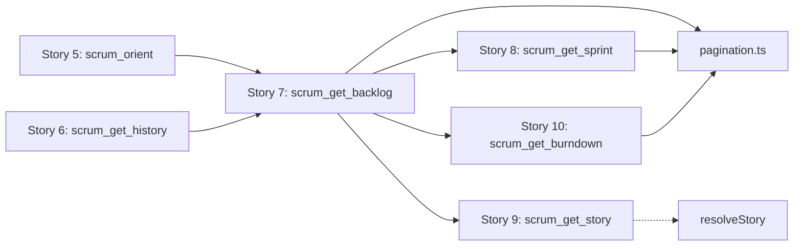
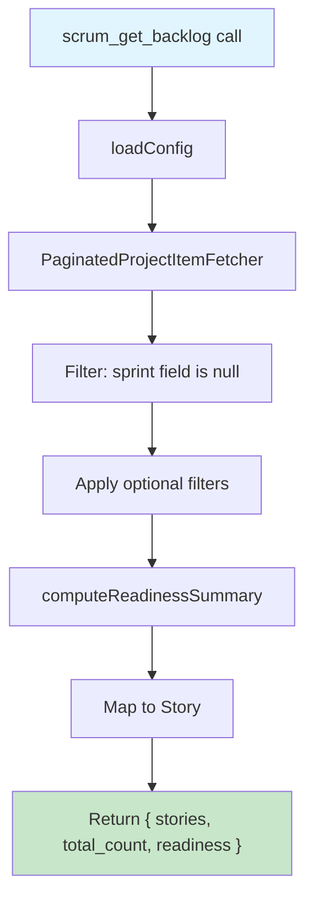
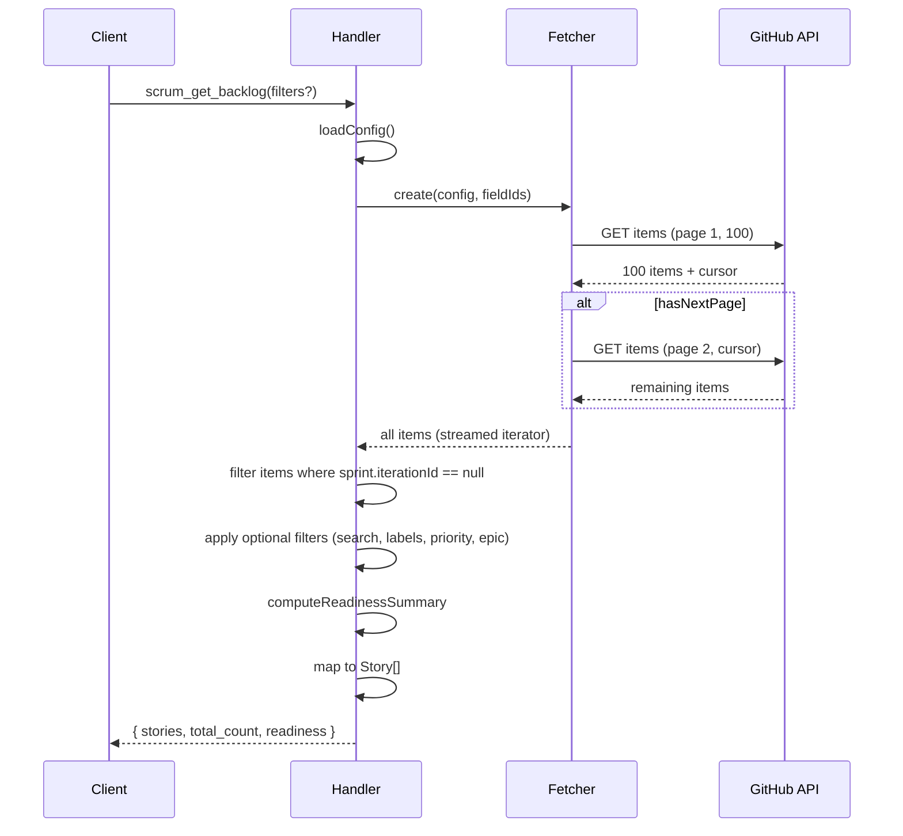

# Story 7: Implement scrum_get_backlog Read Tool — Implementation Plan

## Overview

**Story**: [Story 7: Implement scrum_get_backlog Read Tool](https://github.com/hoonsubin/github-projects-mcp-server/issues/9) **Current Status**: In Progress (Sprint 2) **Priority**: Should **Size**: M **Story Points**: 5

**Objective**: Implement the `scrum_get_backlog` MCP tool that fetches all project items without a sprint assignment (backlog items), applies optional filters, and computes a readiness summary for each story.

---

## Context & Dependencies

### Existing Prerequisites (Already Complete)

| Component         | File                                                                     | Status |
| ----------------- | ------------------------------------------------------------------------ | ------ |
| StoryRef type     | [`src/types.ts:16`](src/types.ts:16)                                     | Done   |
| SprintRef type    | [`src/types.ts:26`](src/types.ts:26)                                     | Done   |
| Story type        | [`src/types.ts:38`](src/types.ts:38)                                     | Done   |
| GetBacklogSchema  | [`src/schemas/scrum.ts:56`](src/schemas/scrum.ts:56)                     | Done   |
| loadConfig        | [`src/services/config.ts:241`](src/services/config.ts:241)               | Done   |
| RuntimeConfig     | [`src/services/config.ts:14`](src/services/config.ts:14)                 | Done   |
| GraphQL fragments | [`src/graphql/operations.graphql:69`](src/graphql/operations.graphql:69) | Done   |

### Dependencies on Other Stories



**Note**: [`src/tools/scrum-read.ts:1`](src/tools/scrum-read.ts:1) shows the implementation order: 5 → 6 → 7 → 8 → 10. Story 7 depends on `resolveStory` from Story 9 for full story enrichment, but the backlog tool can return basic `Story` objects without that enrichment initially.

---

## Architecture

### Data Flow



### Backlog Item Identification

Since GitHub Projects v2 does not support server-side "field is empty" filtering, we must:

1. Fetch all project items via paginated query (100 per page)
2. Filter client-side: items where the sprint field value has no `iterationId`



---

## New Component: PaginatedProjectItemFetcher

### Design Rationale

This helper is a **reusable abstraction** for fetching project items with pagination. It serves:

- **Story 7** (`scrum_get_backlog`) — fetch all items, filter by null sprint
- **Story 8** (`scrum_get_sprint`) — fetch items for a specific sprint
- **Story 10** (`scrum_get_burndown`) — fetch items across sprints for velocity
- **Future tools** — any tool needing project item access

### API Design

```typescript
/**
 * Configuration for what data to fetch per project item.
 * Controls the GraphQL payload to minimize bandwidth.
 */
interface ItemFetchConfig {
  /** Which field values to include. Omit to fetch only sprint field. */
  fieldIds?: string[];
  /** Whether to fetch Issue content (default true) */
  includeIssueContent?: boolean;
  /** Whether to fetch PR content (default false for backlog) */
  includePRContent?: boolean;
  /** Page size (default 100, max per GitHub API) */
  pageSize?: number;
}

/**
 * A reusable paginated fetcher for GitHub Projects v2 items.
 *
 * Usage pattern:
 *   const fetcher = new PaginatedProjectItemFetcher(config, github, projectId);
 *   for await (const item of fetcher) { ... }
 *   const allItems = await fetcher.collect();
 *   const filtered = await fetcher.collect((item) => item.sprint === null);
 */
class PaginatedProjectItemFetcher {
  constructor(
    private config: RuntimeConfig,
    private github: GitHubClient,
    private options: ItemFetchConfig,
  ) {}

  /** Iterate items lazily (cursor-based pagination). */
  [Symbol.asyncIterator](): AsyncIterator<ProjectV2Item>;

  /** Collect all items (or filter + collect). */
  collect(filter?: (item: ProjectV2Item) => boolean): Promise<ProjectV2Item[]>;

  /** Get total count from first page. */
  getTotalCount(): number;

  /** Check if more pages remain. */
  hasMore(): boolean;
}
```

### Minimal GraphQL Query (Optimized)

For backlog filtering, we only need the sprint field — not all 20 field values:

```graphql
query GetProjectItemsMinimal(
  $login: String!
  $number: Int!
  $first: Int!
  $after: String
  $sprintFieldId: ID!
) {
  user(login: $login) {
    projectV2(number: $number) {
      items(first: $first, after: $after) {
        totalCount
        pageInfo {
          hasNextPage
          endCursor
        }
        nodes {
          id
          type
          createdAt
          updatedAt
          isArchived
          content {
            ... on Issue {
              __typename
              id
              number
              title
              url
              state
              body
              assignees(first: 5) {
                nodes {
                  login
                }
              }
              labels(first: 10) {
                nodes {
                  name
                  color
                }
              }
              milestone {
                title
                dueOn
              }
              repository {
                name
                nameWithOwner
              }
            }
          }
          fieldValues(first: 1) {
            nodes {
              ... on ProjectV2ItemFieldIterationValue {
                iterationId
                title
                startDate
                duration
                field {
                  ... on ProjectV2FieldCommon {
                    id
                    name
                  }
                }
              }
            }
          }
        }
      }
    }
  }
}
```

**Payload reduction**: From ~20 field values per item → 1 field value (sprint only). For a project with 100 items, this reduces payload from ~40KB to ~4KB per page.

### Fetcher Implementation Strategy

```typescript
class PaginatedProjectItemFetcher {
  private hasNextPage: boolean = true;
  private endCursor: string | null = null;
  private totalCount: number = 0;
  private buffer: ProjectV2Item[] = [];
  private bufferIndex: number = 0;

  constructor(
    private config: RuntimeConfig,
    private github: GitHubClient,
    private options: ItemFetchConfig,
  ) {
    // Fetch first page immediately
    this._fetchPage();
  }

  private async _fetchPage(): Promise<void> {
    const query = this._buildQuery();
    const variables = {
      login: this.config.yml.project.owner,
      number: this.config.yml.project.project_number,
      first: this.options.pageSize ?? 100,
      after: this.endCursor,
    };

    const result = await this.github.graphql<ProjectItemsResponse>(
      query,
      variables,
    );
    const project = this.config.yml.project.owner_type === "user"
      ? result.user?.projectV2
      : result.organization?.projectV2;

    if (!project) throw new Error("Project not found");

    const items = project.items;
    this.totalCount = items.totalCount;
    this.hasNextPage = items.pageInfo.hasNextPage;
    this.endCursor = items.pageInfo.endCursor;
    this.buffer = items.nodes;
    this.bufferIndex = 0;
  }

  async *[Symbol.asyncIterator](): AsyncIterator<ProjectV2Item> {
    while (this.hasNextPage || this.bufferIndex < this.buffer.length) {
      if (this.bufferIndex >= this.buffer.length) {
        await this._fetchPage();
        if (this.buffer.length === 0 && !this.hasNextPage) break;
      }
      yield this.buffer[this.bufferIndex++];
    }
  }

  async collect(
    filter?: (item: ProjectV2Item) => boolean,
  ): Promise<ProjectV2Item[]> {
    const results: ProjectV2Item[] = [];
    for await (const item of this) {
      if (!filter || filter(item)) {
        results.push(item);
      }
    }
    return results;
  }
}
```

---

## Implementation Steps

### Step 1: Add Backlog-Related Types to [`src/types.ts`](src/types.ts)

Add the return type for `scrum_get_backlog`:

```typescript
/** Readiness assessment for a backlog story. */
export interface StoryReadiness {
  /** Has story points assigned and acceptance criteria checklist present */
  has_estimation_and_ac: boolean;
  /** Has some but not all DoR criteria met */
  partially_ready: boolean;
  /** Has none of the DoR criteria */
  not_ready: boolean;
}

/** Response shape for scrum_get_backlog. */
export interface GetBacklogResult {
  stories: Story[];
  total_count: number;
  readiness: {
    /** Stories with all DoR criteria met */
    ready: number;
    /** Stories with partial DoR criteria */
    partially_ready: number;
    /** Stories with no DoR criteria */
    not_ready: number;
  };
}
```

### Step 2: Create [`src/services/pagination.ts`](src/services/pagination.ts) — PaginatedProjectItemFetcher

New file implementing the reusable fetcher class described above.

**Key design decisions**:

| Decision                  | Rationale                                                            |
| ------------------------- | -------------------------------------------------------------------- |
| AsyncIterator protocol    | Enables `for await` syntax; memory efficient (no full array in RAM)  |
| Configurable field fetch  | Caller specifies which field IDs to include; defaults to sprint-only |
| Buffer-based pagination   | Avoids N+1 per item; fetches 100 at a time                           |
| `collect(filter?)` method | Common pattern: collect all OR collect filtered                      |

### Step 3: Implement [`resolveBacklogItems`](src/services/resolver.ts) Helper

Add to [`src/services/resolver.ts`](src/services/resolver.ts):

```typescript
/**
 * Resolve all backlog items (items without a sprint assignment).
 * Uses PaginatedProjectItemFetcher for efficient pagination.
 */
export async function resolveBacklogItems(
  config: RuntimeConfig,
  github: GitHubClient,
): Promise<ProjectV2Item[]> {
  const fetcher = new PaginatedProjectItemFetcher(config, github, {
    fieldIds: [config.fields.sprintFieldId], // only need sprint field
    includeIssueContent: true,
    includePRContent: false, // backlog typically has issues
    pageSize: 100,
  });

  return fetcher.collect((item) => {
    // Check if sprint field value has no iterationId
    const sprintValue = item.fieldValues.nodes.find(
      (f) => f.field?.id === config.fields.sprintFieldId,
    );
    return sprintValue?.__typename === "ProjectV2ItemFieldIterationValue"
      ? sprintValue.iterationId === null
      : true; // no sprint field value = backlog
  });
}
```

### Step 4: Implement [`computeStoryReadiness`](src/services/) Helper

Create a readiness computation utility. This evaluates each backlog story against the Definition of Ready criteria from [`config.yml:113`](.github/scrum/config.yml:113):

```
Definition of Ready:
  - Written as a user story (who / what / why)
  - Acceptance criteria defined and agreed by the team
  - Estimated in story points
  - Dependencies identified and de-risked
  - Completable within one sprint
```

```typescript
/**
 * Compute readiness for a single story body against DoR criteria.
 *
 * Heuristics:
 *   - User story format: body contains "As a <user>, I want <goal>, so <reason>"
 *   - Acceptance criteria: body contains "- [ ]" or "- [x]" checkboxes
 *   - Estimated: storyPoints > 0
 *   - Dependencies: body contains "Depends on #N" or "Blocked by #N"
 *   - Completable: no explicit "Larger than a sprint" marker
 */
export function computeStoryReadiness(
  body: string,
  storyPoints: number | null,
): StoryReadiness {
  const hasUserStoryFormat = /As\s+an?\/a\s+\w+,\s+I\s+want\s+/i.test(body);
  const hasAcceptanceCriteria = /-[\s\x5b\x5d]/.test(body); // "- [ ]" or "- [x]"
  const hasEstimation = (storyPoints ?? 0) > 0;
  const hasDependencies = /(?:Depends\s+on|Blocked\s+by)\s+#\d+/i.test(body);
  const isTooLarge = /Larger\s+than\s+a\s+sprint|Split\s+into/i.test(body);

  const score = [
    hasUserStoryFormat,
    hasAcceptanceCriteria,
    hasEstimation,
    hasDependencies,
  ].filter(Boolean).length;

  if (score >= 4 && !isTooLarge) {
    return {
      has_estimation_and_ac: true,
      partially_ready: false,
      not_ready: false,
    };
  }
  if (score >= 2) {
    return {
      has_estimation_and_ac: false,
      partially_ready: true,
      not_ready: false,
    };
  }
  return {
    has_estimation_and_ac: false,
    partially_ready: false,
    not_ready: true,
  };
}
```

### Step 5: Implement `scrum_get_backlog` Handler in [`src/tools/scrum-read.ts`](src/tools/scrum-read.ts)

```typescript
/**
 * scrum_get_backlog — Fetch all backlog items with optional filters.
 *
 * Filters (all optional, applied client-side):
 *   - search: substring match on title + body
 *   - labels: include only stories carrying ALL specified labels
 *   - priority: vocabulary value match (e.g., "Must", "Should")
 *   - epic: Milestone title match
 *   - limit: maximum number of results (default 50)
 *
 * Returns: { stories: Story[], total_count: number, readiness: { ready, partially_ready, not_ready } }
 */
async function scrum_get_backlog(
  args: z.infer<typeof GetBacklogSchema>,
  github: GitHubClient,
): Promise<GetBacklogResult> {
  // 1. Load config
  const config = await loadConfig({
    github,
    owner,
    ownerType,
    projectNumber,
    repo,
  });

  // 2. Resolve backlog items using PaginatedProjectItemFetcher
  const backlogItems = await resolveBacklogItems(config, github);

  // 3. Map to Story[] and apply filters
  const allStories: Story[] = [];
  let readyCount = 0,
    partiallyReadyCount = 0,
    notReadyCount = 0;

  for (const item of backlogItems) {
    if (item.content?.__typename !== "Issue") continue;

    const story = mapItemToStory(item, config);
    const readiness = computeStoryReadiness(story.body, story.story_points);

    // Update readiness counts
    if (readiness.has_estimation_and_ac) readyCount++;
    else if (readiness.partially_ready) partiallyReadyCount++;
    else notReadyCount++;

    // Apply filters
    if (args.search && !matchesSearch(story, args.search)) continue;
    if (args.labels && !matchesAllLabels(story, args.labels)) continue;
    if (args.priority && story.priority !== args.priority) continue;
    if (args.epic && story.epic !== args.epic) continue;

    allStories.push(story);
  }

  // 4. Apply limit (but total_count reflects pre-limit count)
  const totalCount = allStories.length;
  const limitedStories = allStories.slice(0, args.limit);

  return {
    stories: limitedStories,
    total_count: totalCount,
    readiness: {
      ready: readyCount,
      partially_ready: partiallyReadyCount,
      not_ready: notReadyCount,
    },
  };
}
```

**Filtering logic**:

| Filter | Implementation | | ---------- | -------------------------------------------------------------- | --- | ------------------------------------ | | `search` | `title.toLowerCase().includes(search)                          |     | body.toLowerCase().includes(search)` | | `labels` | `labels.every(l => itemLabels.includes(l))` — ALL must match | | `priority` | Match against `config.priorityOptions` values | | `epic` | Match `content.milestone.title` against epic parameter | | `limit` | Slice result array, but `total_count` reflects pre-limit count |

### Step 6: Register the Tool in [`registerScrumReadTools`](src/tools/scrum-read.ts)

Update the registration function in [`src/tools/scrum-read.ts`](src/tools/scrum-read.ts):

```typescript
export function registerScrumReadTools(
  server: McpServer,
  github: {
    graphql<T>(query: string, variables?: Record<string, unknown>): Promise<T>;
  },
): void {
  // ... existing tools ...

  server.register("scrum_get_backlog", GetBacklogSchema, (args) => scrum_get_backlog(args, github));
}
```

### Step 7: Write Tests

Create test cases in a test file (following the pattern of existing tests in [`src/tools/scrum-read_test.ts`](src/tools/scrum-read_test.ts) or [`src/tools/items_test.ts`](src/tools/items_test.ts)):

| Test Case                      | Description                                      |
| ------------------------------ | ------------------------------------------------ |
| `test_empty_backlog`           | No backlog items exist                           |
| `test_all_backlog_items`       | All items without sprint are returned            |
| `test_search_filter`           | Search filters by title/body substring           |
| `test_labels_filter`           | Only items with ALL specified labels             |
| `test_priority_filter`         | Only items matching priority vocabulary          |
| `test_epic_filter`             | Only items with matching milestone               |
| `test_limit`                   | Results capped at limit, total_count is accurate |
| `test_readiness_computation`   | DoR criteria correctly evaluated                 |
| `test_mixed_filters`           | Multiple filters applied together                |
| `test_fetcher_pagination`      | PaginatedProjectItemFetcher fetches all pages    |
| `test_fetcher_minimal_payload` | Only requested fields are fetched                |

---

## File Changes Summary

| File                                                           | Change                                            |
| -------------------------------------------------------------- | ------------------------------------------------- |
| [`src/types.ts`](src/types.ts)                                 | Add `StoryReadiness`, `GetBacklogResult` types    |
| [`src/services/pagination.ts`](src/services/pagination.ts)     | **New file**: `PaginatedProjectItemFetcher` class |
| [`src/services/resolver.ts`](src/services/resolver.ts)         | Add `resolveBacklogItems` function (uses fetcher) |
| [`src/services/readiness.ts`](src/services/readiness.ts)       | New file: `computeStoryReadiness` helper          |
| [`src/tools/scrum-read.ts`](src/tools/scrum-read.ts)           | Add `scrum_get_backlog` handler + registration    |
| [`src/tools/scrum-read_test.ts`](src/tools/scrum-read_test.ts) | Add test cases                                    |

---

## Risk Assessment

| Risk                                            | Mitigation                                                                |
| ----------------------------------------------- | ------------------------------------------------------------------------- |
| Large project with many items → slow pagination | Add early exit when `total_count` exceeds reasonable threshold; warn user |
| GraphQL field name changes in GitHub API        | Use typed GraphQL responses; validate against schema                      |
| DoR heuristics too simplistic                   | Make heuristics configurable; document assumptions                        |
| Filter performance on large datasets            | Apply most selective filter first; document limit recommendations         |
| Fetcher complexity adding bugs                  | Thorough unit tests for fetcher; use it in Story 8 and 10 to validate     |

---

## Acceptance Criteria

- [ ] Tool returns all backlog items (no sprint assignment) when called without filters
- [ ] All optional filters (`search`, `labels`, `priority`, `epic`, `limit`) work correctly
- [ ] `total_count` reflects the pre-limit filtered count
- [ ] `readiness` summary correctly categorizes stories against DoR criteria
- [ ] `Story` objects contain all required fields (ref, title, body, type, status, etc.)
- [ ] Unit tests cover all filter combinations and edge cases
- [ ] Error handling for GitHub API failures (rate limits, auth errors, etc.)
- [ ] Follows existing code patterns (type safety, error messages, naming conventions)
- [ ] `PaginatedProjectItemFetcher` is reusable and tested independently
