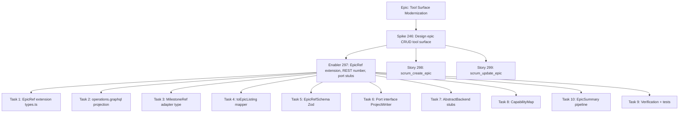
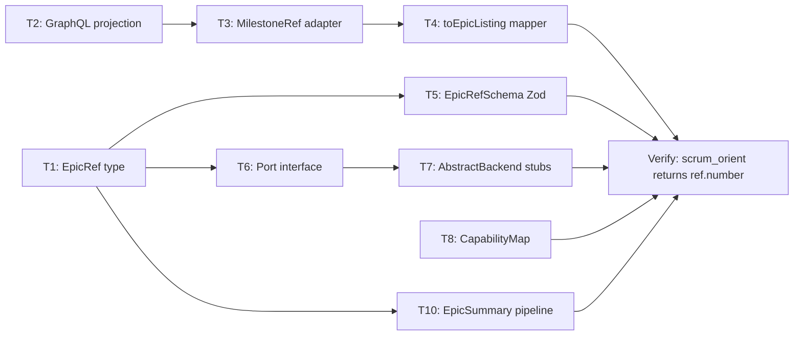

# #297 — Epic CRUD Foundation Implementation Plan

## 1. Overview

| Attribute      | Value                                                                                                                                                                                              |
| -------------- | -------------------------------------------------------------------------------------------------------------------------------------------------------------------------------------------------- |
| **Status**     | In Progress                                                                                                                                                                                        |
| **Type**       | Tech Debt (Enabler)                                                                                                                                                                                |
| **SP**         | 5                                                                                                                                                                                                  |
| **Blocked by** | [#246](https://github.com/hoonsubin/github-projects-mcp-server/issues/246) — completed                                                                                                             |
| **Unblocks**   | [#298](https://github.com/hoonsubin/github-projects-mcp-server/issues/298) (`scrum_create_epic`), [#299](https://github.com/hoonsubin/github-projects-mcp-server/issues/299) (`scrum_update_epic`) |
| **Epic**       | MCP Tool Surface Modernization for Scrum Theory Alignment                                                                                                                                          |

### Background

Spike [#246](https://github.com/hoonsubin/github-projects-mcp-server/issues/246) confirmed that **all GitHub milestone writes are REST-only** — `createMilestone`, `updateMilestone`, and `deleteMilestone` do not exist in the GraphQL API. The REST endpoints require an integer `milestone_number` in the URL path (`PATCH /repos/{owner}/{repo}/milestones/{number}`), but `EpicRef` currently only carries the GraphQL node ID (`MI_...`). The `number` is never fetched from the `ListMilestones` GraphQL query, so it is never populated.

#297 bridges this gap: it extends `EpicRef` with `number?: number`, propagates `number` through the read path, and adds `createEpic`/`updateEpic` port stubs — all without exposing any new MCP tools.

---

## 2. Work Item Hierarchy



---

## 3. Task Breakdown

### Task 1 — Extend `EpicRef` domain type

**File:** [`src/domain/types.ts:49`](src/domain/types.ts:49)

**Current:**

```typescript
export type EpicRef = EntityRef;
// EntityRef = { readonly id: string }
```

**Target:**

```typescript
export type EpicRef = EntityRef & { readonly number?: number };
```

- `number` is optional because `EpicRef` is also passed as tool input — the agent may pass only `{ id }` when assigning a story to an epic via [`scrum_update_story(epic:)`](src/tools/scrum-write.ts:144).
- All existing callers that pass `{ id: "MI_..." }` are unaffected (the spread type accepts subsets).
- This is a [structural type](https://www.typescriptlang.org/docs/handbook/type-compatibility.html) — `{ id: string, number: number }` already satisfies `{ id: string } & { number?: number }`.

**Validation:** `deno check src/domain/types.ts` + existing unit tests.

---

### Task 2 — Add `number` to `ListMilestones` GraphQL projection

**File:** [`src/adapters/github/operations.graphql:619`](src/adapters/github/operations.graphql:619)

**Current:**

```graphql
milestones(first: 100, states: [OPEN, CLOSED]) {
  nodes {
    id
    title
    description
    state
    openIssues: issues(states: [OPEN]) { totalCount }
    closedIssues: issues(states: [CLOSED]) { totalCount }
  }
}
```

**Target:** Add `number` as a sibling field to `id`:

```graphql
milestones(first: 100, states: [OPEN, CLOSED]) {
  nodes {
    id
    number
    title
    description
    state
    openIssues: issues(states: [OPEN]) { totalCount }
    closedIssues: issues(states: [CLOSED]) { totalCount }
  }
}
```

- `number` is a scalar field on the `Milestone` GraphQL type — no connection traversal needed.
- The query is already validated at startup in [`queries.ts:110`](src/adapters/github/queries.ts) but `schema.graphql` is not consulted at runtime — the live API response is the only ground truth.
- No query constant changes needed in `queries.ts` — `LIST_MILESTONES_QUERY` uses `getQuery("ListMilestones")` which dynamically resolves.

**Pre-existing test coverage:** None directly on this GraphQL query string. Covered by captured contract tests that use `CapturedDataBackend`.

---

### Task 3 — Extend `MilestoneRef` adapter type

**File:** [`src/adapters/github/types.ts:168-169`](src/adapters/github/types.ts:168)

**Current:**

```typescript
export type MilestoneRef = Required<Pick<GH.Milestone, "id" | "title">>;
```

**Target:**

```typescript
export type MilestoneRef = Required<Pick<GH.Milestone, "id" | "number" | "title">>;
```

- `GH.Milestone` is generated from `schema.graphql` — the `number` field exists at position 15889 (scalar `Int`).
- `MilestoneRefNode` at [line 324](src/adapters/github/types.ts:324) is a _separate_ type used for issue content projections — it does NOT need changes. Epics and issue milestones are different concepts; `MilestoneRefNode` is for reading a story's assigned milestone, not for the epic listing pipeline.
- The `MilestoneNode extends MilestoneRef` interface in [`epic-service.ts:12`](src/adapters/github/read-services/epic-service.ts:12) inherits this automatically.

---

### Task 4 — Update `toEpicListing()` mapper

**File:** [`src/adapters/github/read-services/epic-service.ts:92-102`](src/adapters/github/read-services/epic-service.ts:92)

**Current:**

```typescript
const toEpicListing = (m: MilestoneNode): EpicListing => {
  return {
    ref: { id: m.id },
    name: m.title,
    description: m.description || null,
    priority: null,
    status: m.state === "OPEN" ? "open" : "done",
    story_count: m.openIssues.totalCount + m.closedIssues.totalCount,
    open_item_count: m.openIssues.totalCount,
  };
};
```

**Target:**

```typescript
const toEpicListing = (m: MilestoneNode): EpicListing => {
  return {
    ref: { id: m.id, number: m.number },
    name: m.title,
    description: m.description || null,
    priority: null,
    status: m.state === "OPEN" ? "open" : "done",
    story_count: m.openIssues.totalCount + m.closedIssues.totalCount,
    open_item_count: m.openIssues.totalCount,
  };
};
```

- `m.number` comes from `MilestoneNode extends MilestoneRef` (Task 3 makes `number` required on `MilestoneRef`).
- Shared with [#264](https://github.com/hoonsubin/github-projects-mcp-server/issues/264) which also touches `toEpicListing()` — sequence these together to avoid merge conflicts.

---

### Task 5 — Extend `EpicRefSchema` Zod schema

**File:** [`src/schemas/scrum.ts:77-84`](src/schemas/scrum.ts:77)

**Current:**

```typescript
const EpicRefSchema: z.ZodType<EpicRef> = z.object({
  id: z
    .string()
    .describe(
      "Opaque Milestone node ID returned by scrum_find_items (type=epic).ref.id " +
        "or scrum_get_item_detail on a story with an epic field.",
    ),
});
```

**Target:**

```typescript
const EpicRefSchema: z.ZodType<EpicRef> = z.object({
  id: z
    .string()
    .describe(
      "Opaque Milestone node ID returned by scrum_find_items (type=epic).ref.id " +
        "or scrum_get_item_detail on a story with an epic field.",
    ),
  number: z
    .number()
    .int()
    .positive()
    .optional()
    .describe(
      "Milestone number for REST write endpoints. " +
        "Returned by scrum_orient and scrum_find_items(type=epic). " +
        "Optional — omit when assigning a story to an epic.",
    ),
});
```

- `.optional()` ensures backward compatibility: existing callers passing `{ id: "MI_..." }` still validate.
- `number` is only populated by the read path (Tasks 1-4). The agent may omit it when passing `EpicRef` back as input (e.g., `scrum_update_story(epic:)`).
- This schema is used by [`scrum_update_story`](src/tools/scrum-write.ts:144) (epic field in `UpdateStoryInputSchema`) and will be used by future `scrum_create_epic`/`scrum_update_epic` tool schemas.

---

### Task 6 — Add `createEpic`/`updateEpic` to `ProjectWriter` port

**File:** [`src/scrum/ports.ts`](src/scrum/ports.ts)

**New types** (add above `ProjectWriter` at line 407):

```typescript
export interface CreateEpicInput {
  readonly name: string;
  readonly description?: string;
}

export interface EpicUpdates {
  readonly name?: string;
  readonly description?: string;
  /** "open" or "done". Platform mapping: GitHub → MilestoneState OPEN/CLOSED; Trello → UNAVAILABLE. */
  readonly status?: "open" | "done";
}
```

**Add to `ProjectWriter`** at [line 407](src/scrum/ports.ts:407):

```typescript
  /** Create a new epic. Returns the created EpicRef (with id and number). */
  createEpic(input: CreateEpicInput): Promise<EpicRef>;

  /** Update epic fields. Returns the updated EpicListing with current item counts. */
  updateEpic(ref: EpicRef, updates: EpicUpdates): Promise<EpicListing>;
```

- No `deleteEpic` — per [#246's finalized decision](https://github.com/hoonsubin/github-projects-mcp-server/issues/246#issuecomment-4782047006), delete is never exposed at the tool surface.
- `ProjectBackend` at [line 434](src/scrum/ports.ts:434) automatically inherits these through `extends ProjectReader, ProjectWriter`.
- `BackendCallResult<T>` wrapping is intentionally NOT used here — this follows the same pattern as `createStory`, `updateStory`, and `setField`, which return unwrapped types. Error handling happens via thrown `AdapterError` subclasses caught by the handler boundary.

---

### Task 7 — Add default `createEpic`/`updateEpic` stubs to `AbstractProjectBackend`

**File:** [`src/adapters/abstract-backend.ts`](src/adapters/abstract-backend.ts)

**Add after the `updateImpediment` default at line 211:**

```typescript
  // ── Optional ProjectWriter - epic mutations ───────────────────────────────

  /**
   * Create a new epic (GitHub: milestone).
   *
   * Default: throws {@link UnsupportedCapabilityError}.
   * Override in adapters that support epic creation.
   */
  createEpic(_input: CreateEpicInput): Promise<EpicRef> {
    throw new UnsupportedCapabilityError(this.capabilities.platform, "createEpic");
  }

  /**
   * Update an epic's name, description, or open/closed status.
   *
   * Default: throws {@link UnsupportedCapabilityError}.
   * Override in adapters that support epic mutations.
   */
  updateEpic(_ref: EpicRef, _updates: EpicUpdates): Promise<EpicListing> {
    throw new UnsupportedCapabilityError(this.capabilities.platform, "updateEpic");
  }
```

**New imports needed at top of file:**

```typescript
import type { CreateEpicInput, EpicUpdates } from "../scrum/ports.ts";
import type { EpicListing, EpicRef } from "../domain/types.ts";
```

- Follows the exact pattern of `createImpediment` ([line 193-197](src/adapters/abstract-backend.ts:193)) and `updateImpediment` ([line 205-211](src/adapters/abstract-backend.ts:205)).
- No changes to [`backend.ts`](src/adapters/github/backend.ts) needed — `GitHubProjectBackend` inherits the defaults from `AbstractProjectBackend` until [#298](https://github.com/hoonsubin/github-projects-mcp-server/issues/298)/[#299](https://github.com/hoonsubin/github-projects-mcp-server/issues/299) override them with real implementations.

---

### Task 8 — Add epic capability flags to `CapabilityMap`

**File:** [`src/adapters/capabilities.ts`](src/adapters/capabilities.ts)

**Add to `CapabilityMap`** at [line 80](src/adapters/capabilities.ts:80) (before closing `};`):

```typescript
  /** Can read/write epic (milestone) descriptions.
   * EMULATED = description stored in a body/label proxy.
   * UNAVAILABLE = epics are name-only — description field silently ignored. */
  readonly epicDescriptions: CapabilityStatus;

  /** Can track epic open/closed state.
   * EMULATED = state tracked via label toggle.
   * UNAVAILABLE = epics have no lifecycle — close/reopen not supported. */
  readonly epicStatusTracking: CapabilityStatus;
```

**Add to `GITHUB_CAPABILITIES`** at [line 155](src/adapters/capabilities.ts:155):

```typescript
export const GITHUB_CAPABILITIES: PlatformCapabilities = {
  platform: "github",
  supports: {
    auditLogBurndown: CapabilityStatus.NATIVE,
    nativeSprints: CapabilityStatus.NATIVE,
    dependencies: CapabilityStatus.NATIVE,
    fileReader: CapabilityStatus.NATIVE,
    stableItemKeys: CapabilityStatus.NATIVE,
    epicDescriptions: CapabilityStatus.NATIVE,
    epicStatusTracking: CapabilityStatus.NATIVE,
  },
};
```

- GitHub milestones natively support both `description` and `state: OPEN | CLOSED`.
- Trello (future, illustrative): `epicDescriptions: UNAVAILABLE` (labels have no description field); `epicStatusTracking: UNAVAILABLE` (labels have no open/closed state). See [#246 comment](https://github.com/hoonsubin/github-projects-mcp-server/issues/246#issuecomment-4782047006).
- `checkCapability()` at [line 117](src/adapters/capabilities.ts:117) works generically over `keyof CapabilityMap` — no changes needed for it to handle the new flags.

---

### Task 10 — Fix `EpicSummary` pipeline to propagate `number`

**Why:** Tasks 1-4 correctly add `number` to `EpicListing.ref` (type `EpicRef`), but the `scrum_orient` code path maps `EpicListing` → `EpicSummary`, and `EpicSummary.ref` is typed as `EntityRef` (`{ id: string }`). The mapper in [`orient.ts:91-92`](src/scrum/orient.ts:91) explicitly constructs `{ id: epic.ref.id }`, dropping `number`. Without this fix, AC #2 ("scrum_orient returns refs with number") is not met.

Four files need changes:

**File 10a:** [`src/domain/types.ts:247`](src/domain/types.ts:247) — Widen `EpicSummary.ref` from `EntityRef` to `EpicRef`

**Current:**

```typescript
export interface EpicSummary {
  ref: EntityRef;
  ...
}
```

**Target:**

```typescript
export interface EpicSummary {
  ref: EpicRef;
  ...
}
```

**File 10b:** [`src/scrum/orient.ts:92`](src/scrum/orient.ts:92) — Pass the full `EpicRef` instead of constructing a new `EntityRef`

**Current:**

```typescript
ref: { id: epic.ref.id },
```

**Target:**

```typescript
ref: epic.ref,
```

**File 10c:** [`src/schemas/scrum-outputs.ts:118-119`](src/schemas/scrum-outputs.ts:118) — Use `EpicRefSchema` instead of `EntityRefSchema`

**Current:**

```typescript
const EpicSummarySchema = z.object({
  ref: EntityRefSchema,
  ...
});
```

**Target:**

```typescript
const EpicSummarySchema = z.object({
  ref: EpicRefSchema,
  ...
});
```

**File 10d:** [`src/scrum/orient-tier.ts`](src/scrum/orient-tier.ts) — Verify `capEpicDescriptions` and other `EpicSummary` consumers are compatible with the widened `ref` type. The function maps over epics and returns `EpicSummary[]` — no changes expected since it only accesses `epic.ref` (EntityRef fields are a subset of EpicRef), but the type-check in T9 will confirm.

- `EpicSummary` is output-only (returned by `orientUseCase` via `OrientResult.platform_state.epics.active`). Agents never pass `EpicSummary` as tool input, so the widened `ref` type has no backward-compatibility concern on the input side.
- `orient-tier.ts` `capEpicDescriptions` operates on `readonly EpicSummary[]` — since `EntityRef` is a subset of `EpicRef`, the spread pattern `epic.ref` produces a valid `EpicRef` value regardless. No code change needed there.

---

## 4. File Change Summary

| #   | File                                                                                                        | Lines   | Change Type                                                                        | Risk                                                           |
| --- | ----------------------------------------------------------------------------------------------------------- | ------- | ---------------------------------------------------------------------------------- | -------------------------------------------------------------- |
| T1  | [`src/domain/types.ts`](src/domain/types.ts:49)                                                             | 49      | Type extension                                                                     | Low — backward compatible intersection                         |
| T2  | [`src/adapters/github/operations.graphql`](src/adapters/github/operations.graphql:619)                      | 619     | Add `number` to projection                                                         | Low — additive scalar field                                    |
| T3  | [`src/adapters/github/types.ts`](src/adapters/github/types.ts:168)                                          | 168-169 | Extend `MilestoneRef`                                                              | Low — one additional field                                     |
| T4  | [`src/adapters/github/read-services/epic-service.ts`](src/adapters/github/read-services/epic-service.ts:92) | 94      | Update `toEpicListing` mapper                                                      | Low — `number` now on `MilestoneNode`                          |
| T5  | [`src/schemas/scrum.ts`](src/schemas/scrum.ts:77)                                                           | 77-84   | Add optional `number` to `EpicRefSchema`                                           | Low — `.optional()` backward compatible                        |
| T6  | [`src/scrum/ports.ts`](src/scrum/ports.ts:407)                                                              | 407     | Add `CreateEpicInput`, `EpicUpdates`, `createEpic`/`updateEpic` to `ProjectWriter` | Medium — all `ProjectWriter` implementations must add stubs    |
| T7  | [`src/adapters/abstract-backend.ts`](src/adapters/abstract-backend.ts:211)                                  | 211+    | Add default `createEpic`/`updateEpic` throwing `UnsupportedCapabilityError`        | Low — follows `createImpediment`/`updateImpediment` convention |
| T8  | [`src/adapters/capabilities.ts`](src/adapters/capabilities.ts:80)                                           | 80, 155 | Add `epicDescriptions`/`epicStatusTracking` to `CapabilityMap`                     | Low — additive fields                                          |
| T10 | [`src/domain/types.ts`](src/domain/types.ts:247)                                                            | 247     | Widen `EpicSummary.ref` from `EntityRef` to `EpicRef`                              | Low — output-only type, superset                               |
| T10 | [`src/scrum/orient.ts`](src/scrum/orient.ts:92)                                                             | 92      | Pass full `EpicRef` instead of constructing new `EntityRef`                        | Low — one-line change                                          |
| T10 | [`src/schemas/scrum-outputs.ts`](src/schemas/scrum-outputs.ts:118)                                          | 118-119 | Use `EpicRefSchema` instead of `EntityRefSchema`                                   | Low — `number` is `.optional()`                                |

**File NOT changed:** [`src/adapters/github/backend.ts`](src/adapters/github/backend.ts) — verified. `GitHubProjectBackend` sources `capabilities` from `GITHUB_CAPABILITIES` (line 100) and inherits the default `createEpic`/`updateEpic` throws from `AbstractProjectBackend` until [#298](https://github.com/hoonsubin/github-projects-mcp-server/issues/298)/[#299](https://github.com/hoonsubin/github-projects-mcp-server/issues/299) override them.

---

## 5. Dependency Graph



Wave 1 (parallel): T1, T2, T3, T8 — no interdependencies Wave 2 (parallel): T4, T5, T6, T10 — T4→T3, T5→T1, T6→T1, T10→T1 Wave 3: T7 — depends on T6 Wave 4: T9 — verification (depends on all)

**Execution order:**

1. T1, T2, T3, T8 (parallel — no interdependencies)
2. T4, T5, T6, T10 (parallel — T4 depends on T3, T5/T6/T10 depend on T1)
3. T7 (depends on T6)
4. T9 — verification (depends on all)

---

## 6. Verification Checklist (T9)

### Type-Check

```bash
deno check src/domain/types.ts
deno check src/scrum/ports.ts
deno check src/scrum/orient.ts
deno check src/schemas/scrum-outputs.ts
deno check src/adapters/abstract-backend.ts
deno check src/adapters/capabilities.ts
```

### Lint + Format

```bash
deno lint
deno fmt --check
```

### Architecture Boundary Check

```bash
deno task depcruise
```

### Full Test Suite

```bash
deno task test
```

**Expected result:** All 257+ tests pass with no modifications. The changes are purely additive:

- `EpicRef` extension is backward compatible (structural intersection)
- `EpicRefSchema` uses `.optional()` for `number`
- `ProjectWriter` additions are new — no existing callers implement them
- Default stubs in `AbstractProjectBackend` follow existing convention
- `CapabilityMap` additions are additive fields on a POJO

### Golden Snapshot Check

```bash
deno test src/test/tools/scrum-read.golden.test.ts
```

**Expected result:** Golden snapshots may need regeneration if `scrum_orient` output now includes `number` in `ref` objects:

```bash
deno test --allow-env=DEBUG,GITHUB_TOKEN,NODE_ENV --allow-net --allow-read --allow-write \
  src/test/tools/scrum-read.golden.test.ts -- --update
```

### Framework-Level Dependency Injection

- [ ] `GitHubBackendDependencies` (line 75) does NOT need an `epicMutationService` field — that's added in [#298](https://github.com/hoonsubin/github-projects-mcp-server/issues/298).
- [ ] `GitHubProjectBackend` does NOT override `createEpic`/`updateEpic` — inherits `UnsupportedCapabilityError` defaults.
- [ ] `AbstractProjectBackend` NOW implements all methods of `ProjectWriter` — the TypeScript compiler enforces this.

---

## 7. Acceptance Criteria Mapping

| # | AC                                                                                                        | Covered By      | Verification                                  |
| - | --------------------------------------------------------------------------------------------------------- | --------------- | --------------------------------------------- |
| 1 | `EpicRef` compiles with `number?: number`; all existing callsites unaffected                              | T1              | `deno check` + full test suite                |
| 2 | `scrum_orient` returns refs with `number`                                                                 | T2, T3, T4, T10 | Golden snapshots + captured contract tests    |
| 3 | `ProjectWriter` declares `createEpic` / `updateEpic` — NOT `deleteEpic`                                   | T6              | `deno check src/scrum/ports.ts`               |
| 4 | `CapabilityMap` includes `epicDescriptions` / `epicStatusTracking`; GITHUB `NATIVE`                       | T8              | `deno check src/adapters/capabilities.ts`     |
| 5 | `AbstractProjectBackend` provides default `createEpic`/`updateEpic` throwing `UnsupportedCapabilityError` | T7              | `deno check src/adapters/abstract-backend.ts` |
| 6 | `backend.ts` requires no changes                                                                          | Verified        | `deno check src/adapters/github/backend.ts`   |
| 7 | All existing unit tests pass with no modifications                                                        | T9              | `deno task test`                              |
| 8 | No new MCP tools exposed — agent-visible behavior unchanged                                               | All             | No changes to `src/tools/` or `src/server.ts` |

---

## 8. Notes for [#298](https://github.com/hoonsubin/github-projects-mcp-server/issues/298) / [#299](https://github.com/hoonsubin/github-projects-mcp-server/issues/299) (Post-#297)

Once #297 lands, the follow-on stories will:

### [#298](https://github.com/hoonsubin/github-projects-mcp-server/issues/298) — `scrum_create_epic`

- **Port method:** `ProjectWriter.createEpic(input)` — already declared by #297
- **GitHub adapter:** Override `createEpic` in `GitHubProjectBackend` to call REST `POST /repos/{owner}/{repo}/milestones`
- **New file:** `src/adapters/github/write-services/epic-mutation-service.ts` with `createMilestone(input): Promise<EpicRef>`
- **New file:** `src/scrum/create-epic.ts` — use-case validates input, delegates to backend
- **Tool handler:** In `src/tools/scrum-write.ts`, register `scrum_create_epic` with `CreateEpicSchema`, handler calls `createEpicUseCase`
- **Tool annotations:** `readOnlyHint: false`, `destructiveHint: false`, `idempotentHint: false`

### [#299](https://github.com/hoonsubin/github-projects-mcp-server/issues/299) — `scrum_update_epic`

- **Port method:** `ProjectWriter.updateEpic(ref, updates)` — already declared by #297
- **GitHub adapter:** Override `updateEpic` in `GitHubProjectBackend` to call REST `PATCH /repos/{owner}/{repo}/milestones/{number}`
- **New file:** `src/scrum/update-epic.ts` — use-case validates at least one field set, delegates to backend
- **Tool handler:** In `src/tools/scrum-write.ts`, register `scrum_update_epic` with handler calling `updateEpicUseCase`
- **Tool annotations:** `readOnlyHint: false`, `destructiveHint: false`, `idempotentHint: true`
- **Status mapping:** `"open"` → `"open"`, `"done"` → `"closed"` (GitHub milestone state)
- **Cache invalidation:** After mutation, either clear bootstrap cache or force `scrum_orient` to re-fetch from `EpicService.getEpics()` for fresh `EpicListing` with updated item counts
