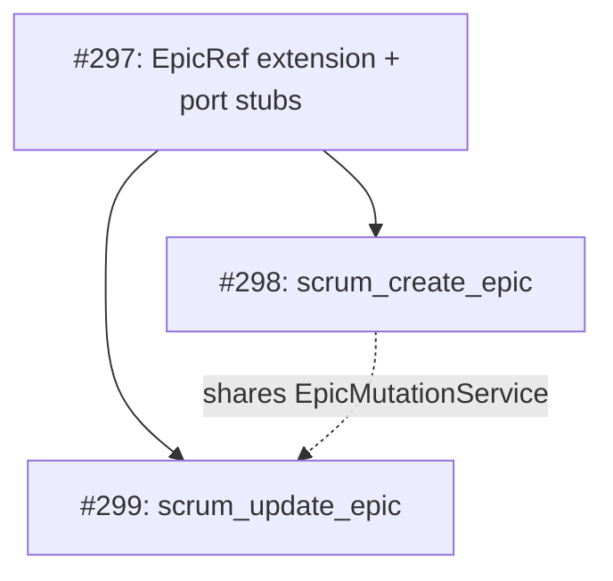

# #299 — `scrum_update_epic` Implementation Plan

## 1. Overview

| Attribute      | Value                                                                                             |
| -------------- | ------------------------------------------------------------------------------------------------- |
| **Status**     | Reviewed (2026-07-10) — see §1a for codebase review notes                                         |
| **Type**       | User Story                                                                                        |
| **SP**         | 3                                                                                                 |
| **Blocked by** | [#297](https://github.com/hoonsubin/github-projects-mcp-server/issues/297) — Epic CRUD Foundation |
| **Blocks**     | Nothing                                                                                           |
| **Epic**       | MCP Tool Surface Modernization for Scrum Theory Alignment                                         |

### User Story

> As the agent, I want to update an epic's name/description or close it through a tool call so that I can rename, refine, or complete an initiative during a session without asking the user to make the change manually and report back.

### Tool Contract

```
scrum_update_epic(ref: EpicRef, name?: string, description?: string, status?: "open" | "done")
  → EpicListing { ref: { id, number }, name, description, status, story_count, open_item_count }
```

### Design Decision

Following the **impediment pattern** (`scrum_log_impediment` + `scrum_update_impediment`), this is a dedicated tool rather than extending `scrum_set_field` (which is designed for Story board fields — mixing EpicRef into it would violate type safety and the "board field" mental model).

Returning `EpicListing` (not just `WriteAck`) is intentional: after changing an epic's status, the agent needs the current `story_count` and `open_item_count` to assess completion. The REST PATCH response includes `open_issues`/`closed_issues` integers, so we can rebuild `EpicListing` without a second GraphQL round-trip.

### Codebase Review Notes (2026-07-10)

Verified against the current codebase:

- [`ports.ts`](src/scrum/ports.ts:410-415) — `EpicUpdates` already declared (by #297), `ProjectWriter.updateEpic()` at line 446 returns `EpicListing`.
- [`abstract-backend.ts`](src/adapters/abstract-backend.ts:226-234) — Default `updateEpic()` throws `UnsupportedCapabilityError` (capability-gated).
- [`epic-mutation-service.ts`](src/adapters/github/write-services/epic-mutation-service.ts) — `EpicMutationService` already wired via [`create-backend.ts:164`](src/adapters/github/create-backend.ts:164). Only `createMilestone()` exists; update methods to be added.
- [`backend.ts`](src/adapters/github/backend.ts:396-398) — `createEpic` override delegates to `epicMutationService.createMilestone()`. `updateEpic` override to be added.
- [`epic-service.ts:92-102`](src/adapters/github/read-services/epic-service.ts:92) — `toEpicListing()` for GraphQL `MilestoneNode` (uppercase `"OPEN"`). REST version will use lowercase `"open"`.
- [`MilestoneResponse`](src/adapters/github/write-services/epic-mutation-service.ts:13-25) — `id` = internal DB ID, `number` = sequential milestone number. **Critical:** `toEpicListing()` must map `number: m.number`, NOT `m.id`.

---

## 2. Implementation Tasks

### 2.1 New Schema — `UpdateEpicSchema`

**File:** `src/schemas/scrum.ts` (add after `CreateEpicSchema` at line 476)

Reuses the existing [`EpicRefSchema`](src/schemas/scrum.ts:77) — `{ id, number? }` — which `scrum_orient`, `scrum_find_items`, and `scrum_create_epic` all return. No need for a dual-shape union; the handler normalizes `ref` to `EpicRef` transparently.

```typescript
// scrum_update_epic - update epic name, description, or open/closed status
export const UpdateEpicSchema = z
  .object({
    ref: EpicRefSchema.describe(
      "Reference to the epic to update. " +
        "Supply the EpicRef.id from scrum_orient, scrum_find_items(type=epic), " +
        "or scrum_create_epic result. Include the number for REST-based backends (GitHub).",
    ),
    name: z
      .string()
      .min(1)
      .optional()
      .describe("New epic name. Omit to leave unchanged."),
    description: z
      .string()
      .optional()
      .describe("New markdown description. Omit to leave unchanged. Pass empty string to clear."),
    status: z
      .enum(["open", "done"])
      .optional()
      .describe('"open" or "done". Maps to platform state: GitHub → MilestoneState OPEN/CLOSED.'),
  })
  .strict();
```

- `ref` uses the existing `EpicRefSchema` — `{ id, number? }`. Simpler than a dual-shape union; the handler casts `params.ref` to `EpicRef`.
- At least one of `name`, `description`, `status` must be provided — enforced in the handler, not Zod (keeping schema flexible for potential future fields).
- `status` enum is strict: only `"open"` and `"done"`. No intermediate states.
- `name` uses `.min(1)` to prevent accidental empty-string clears.

### 2.1b New Output Schema — `UpdateEpicResultSchema`

**File:** `src/schemas/scrum-outputs.ts` (add after `UpdateImpedimentResponseSchema` at line 318)

```typescript
// scrum_update_epic output — EpicListing shape
export const UpdateEpicResultSchema = z.object({
  ref: EpicRefSchema,
  name: z.string(),
  description: z.string().nullable(),
  priority: z.string().nullable(),
  status: z.enum(["open", "in_progress", "done"]).nullable(),
  story_count: z.number(),
  open_item_count: z.number(),
}).strict();
```

Registered as `outputSchema` on the tool registration. Uses the same `EpicRefSchema` import from `../schemas/scrum.ts`.

### 2.2 New Use-Case — `update-epic.ts`

**File:** `src/scrum/update-epic.ts` (new file)

```typescript
// =============================================================================
// src/scrum/update-epic.ts - updateEpicUseCase
//
// Updates an epic's name, description, or open/closed status.
// Returns the refreshed EpicListing so the agent has current item counts.
// =============================================================================

import type { EpicUpdates, ProjectWriter } from "./ports.ts";
import type { EpicListing, EpicRef } from "../domain/types.ts";

export const updateEpicUseCase = async (
  backend: ProjectWriter,
  ref: EpicRef,
  updates: EpicUpdates,
): Promise<EpicListing> => {
  return backend.updateEpic(ref, updates);
};
```

- Thin wrapper — all validation happens in the handler.
- `ProjectWriter.updateEpic` and `EpicUpdates` are declared by #297.

### 2.3 New Write Handler — `handleUpdateEpic`

**File:** `src/tools/handlers/write.ts` (add after `handleCreateEpic` at line 469)

Imports needed (add to existing import block):

```typescript
import { UpdateEpicSchema } from "../../schemas/scrum.ts"; // add to line ~24
import type { EpicUpdates } from "../../scrum/ports.ts"; // add to line ~5-10
import { updateEpicUseCase } from "../../scrum/update-epic.ts"; // add to line ~13-14
import type { EpicRef } from "../../domain/types.ts"; // add to line ~11
```

Handler implementation:

```typescript
export const handleUpdateEpic = async (
  backend: ProjectBackend,
  sessionCache: SessionCache,
  params: z.infer<typeof UpdateEpicSchema>,
): Promise<McpTextResult> => {
  // At least one update field required
  const { name, description, status } = params;
  if (name === undefined && description === undefined && status === undefined) {
    return toToolErrorResult(
      new Error("At least one of name, description, or status is required."),
    );
  }

  const ref = params.ref as EpicRef;

  const updates: EpicUpdates = {
    ...(name !== undefined ? { name } : {}),
    ...(description !== undefined ? { description } : {}),
    ...(status !== undefined ? { status } : {}),
  };

  try {
    const epicListing = await updateEpicUseCase(backend, ref, updates);
    sessionCache.invalidateOrient();
    return toMcpTextResult(epicListing);
  } catch (err) {
    return toToolErrorResult(err);
  }
};
```

- Uses existing `EpicRefSchema` — `params.ref` is cast directly to `EpicRef`. The schema ensures `{ id, number? }` shape.
- Validates "at least one field" before delegating — satisfies the implicit constraint that calling with no updates is a no-op (rejected upfront).
- `sessionCache.invalidateOrient()` ensures the next `scrum_orient` reflects changes without manual refresh (AC 4).
- `toToolErrorResult` converts `UnsupportedCapabilityError` and `AdapterError` to structured text — satisfies AC 5 (capability-unavailable) and AC 6 (not-found).
- `_scrumConfig` omitted — follows `handleUpdateImpediment` pattern (doesn't need scrumConfig for its logic).

### 2.4 Tool Registration

**File:** `src/tools/scrum-write.ts`

**2.4.1 Add to `SCRUM_WRITE_TOOL_NAMES`** (line ~38):

```typescript
export const SCRUM_WRITE_TOOL_NAMES = [
  // ... existing ...
  "scrum_create_epic",
  "scrum_update_epic", // ← NEW
] as const;
```

**2.4.2 Import** (lines ~8-11, ~24-32):

```typescript
import { UpdateEpicSchema } from "../schemas/scrum.ts";
import { handleUpdateEpic } from "./handlers/write.ts";
```

**2.4.3 Add tool registration** (after `scrum_create_epic` block):

```typescript
server.registerTool(
  "scrum_update_epic",
  {
    title: "Update Epic",
    description: `Update an epic's name, description, or open/closed status.

        Args:
          ref          EpicRef - obtained from scrum_orient or scrum_find_items(type=epic)
          name         string (optional) - new epic name
          description  string (optional) - new markdown description (pass "" to clear)
          status       "open" | "done" (optional) - close or reopen the epic

        Returns: EpicListing — the updated epic with current story counts.
        Use story_count vs open_item_count to check if all stories are complete
        before closing.

        Closing is reversible — pass status:"open" to reopen a closed epic.
        Status is backend-specific: GitHub maps to MilestoneState OPEN/CLOSED.`,
    inputSchema: UpdateEpicSchema.shape,
    outputSchema: UpdateEpicResultSchema.shape,
    annotations: {
      readOnlyHint: false,
      destructiveHint: false,
      idempotentHint: true,
      openWorldHint: true,
    },
  },
  (params: z.infer<typeof UpdateEpicSchema>) => handleUpdateEpic(backend, sessionCache, params),
);
```

- `outputSchema: UpdateEpicResultSchema.shape` — required per [AGENTS.md](tasks/REFACTORING.md) tool output schema convention.
- `idempotentHint: true` — updating an epic to the same name/status is a safe no-op.
- `sessionCache` passed to handler for cache invalidation.

**2.4.4 Re-export handler** (add after `handleCreateEpic` in re-exports at line ~339):

```typescript
export {
  handleAddVocabulary,
  handleCreateEpic,
  handleCreateStory,
  handleLogImpediment,
  handlePlanSprint,
  handleSetField,
  handleUpdateEpic, // ← NEW
  handleUpdateImpediment,
  handleUpdateStory,
  resolveP0PriorityDisplay,
} from "./handlers/write.ts";
```

### 2.5 GitHub Adapter — `EpicMutationService.updateMilestone()`

**File:** `src/adapters/github/write-services/epic-mutation-service.ts` (add to same file as #298's `createMilestone`)

#### 2.5.1 REST Mutation

```typescript
  async updateMilestone(
    ref: EpicRef,
    updates: EpicUpdates,
  ): Promise<MilestoneResponse> {
    const number = ref.number;
    if (!number) {
      throw new Error("EpicRef.number is required for REST milestone update.");
    }

    const body: Record<string, unknown> = {};
    if (updates.name !== undefined) body.title = updates.name;
    if (updates.description !== undefined) body.description = updates.description;
    if (updates.status !== undefined) {
      body.state = updates.status === "done" ? "closed" : "open";
    }

    const { data } = await this.gh.rest<MilestoneResponse>(
      `repos/${this.owner}/${this.repo}/milestones/${number}`,
      {
        method: "PATCH",
        body,
      },
    );

    return data;
  }
```

- `ref.number` is required — the REST endpoint uses `/milestones/{milestone_number}`, not the GraphQL node ID.
- Status mapping: `"done"` → `"closed"`, `"open"` → `"open"` (GitHub `MilestoneState`).
- Returns `MilestoneResponse` (same type as create) for the follow-up query.

#### 2.5.2 Rebuild `EpicListing` from REST Response

The REST `PATCH` response includes `open_issues`/`closed_issues` integers — no follow-up GraphQL call needed. The `MilestoneResponse` maps directly:

```typescript
private toEpicListing(m: MilestoneResponse): EpicListing {
  return {
    ref: { id: m.node_id, number: m.number },  // ← m.number is the sequential milestone number
    name: m.title,
    description: m.description || null,
    priority: null,
    status: m.state === "open" ? "open" : "done",  // REST uses lowercase "open"/"closed"
    story_count: m.open_issues + m.closed_issues,
    open_item_count: m.open_issues,
  };
}
```

⚠️ **Critical:** Use `m.number` (sequential milestone number), NOT `m.id` (internal DB ID). The [`MilestoneResponse`](src/adapters/github/write-services/epic-mutation-service.ts:14-15) interface documents: `id` = internal database ID, `number` = sequential milestone number. The existing [`createMilestone()`](src/adapters/github/write-services/epic-mutation-service.ts:55) correctly uses `data.number`.

**Comparison with read path:** The existing [`toEpicListing()` in `epic-service.ts:92-102`](src/adapters/github/read-services/epic-service.ts:92) operates on GraphQL `MilestoneNode` (uppercase `"OPEN"`), while this REST version uses lowercase `"open"`. Both are correct for their respective data sources.

#### 2.5.3 Full Service Method

```typescript
async updateMilestoneListing(
  ref: EpicRef,
  updates: EpicUpdates,
): Promise<EpicListing> {
  const response = await this.updateMilestone(ref, updates);
  return this.toEpicListing(response);
}
```

### 2.6 Wire into `backend.ts`

**File:** `src/adapters/github/backend.ts`

Add override after `createEpic`:

```typescript
override async updateEpic(
  ref: EpicRef,
  updates: EpicUpdates,
): Promise<EpicListing> {
  return this.deps.epicMutationService.updateMilestoneListing(ref, updates);
}
```

- No new dependency injection needed — `EpicMutationService` is already wired via `GitHubBackendDependencies` (added by #298).

### 2.7 Error Handling for Not-Found Epics

The REST API returns HTTP 404 for non-existent milestone numbers. The existing `GitHubClient.rest()` error handler at [`http-client.ts:436-444`](src/adapters/github/infra/http-client.ts:436) catches non-2xx responses and throws `GitHubApiError` with `statusCode` and `recovery` fields. The handler's `toToolErrorResult()` converts this to structured text.

For epics referenced by `{ id }` only (no `number`), the check in §2.5.1 throws early: `"EpicRef.number is required for REST milestone update."` — this is a client-side error, caught and formatted.

---

## 3. File Change Summary

| #  | File                                                                                                                         | Lines          | Change                                                             |
| -- | ---------------------------------------------------------------------------------------------------------------------------- | -------------- | ------------------------------------------------------------------ |
| 1  | [`src/schemas/scrum.ts`](src/schemas/scrum.ts)                                                                               | Add after L476 | `UpdateEpicSchema` (reuses `EpicRefSchema`)                        |
| 2  | [`src/schemas/scrum-outputs.ts`](src/schemas/scrum-outputs.ts)                                                               | Add after L318 | `UpdateEpicResultSchema` (`EpicListing` shape)                     |
| 3  | [`src/scrum/update-epic.ts`](src/scrum/update-epic.ts)                                                                       | **New**        | `updateEpicUseCase` thin wrapper                                   |
| 4  | [`src/tools/handlers/write.ts`](src/tools/handlers/write.ts)                                                                 | Add after L469 | `handleUpdateEpic` handler + imports                               |
| 5  | [`src/tools/scrum-write.ts`](src/tools/scrum-write.ts:40-49)                                                                 | Modify         | Add `"scrum_update_epic"` to `SCRUM_WRITE_TOOL_NAMES`              |
| 6  | [`src/tools/scrum-write.ts`](src/tools/scrum-write.ts)                                                                       | Add after L247 | `server.registerTool("scrum_update_epic", ...)`                    |
| 7  | [`src/tools/scrum-write.ts`](src/tools/scrum-write.ts:339-349)                                                               | Modify         | Re-export `handleUpdateEpic`                                       |
| 8  | [`src/adapters/github/write-services/epic-mutation-service.ts`](src/adapters/github/write-services/epic-mutation-service.ts) | Add after L56  | `updateMilestone()`, `updateMilestoneListing()`, `toEpicListing()` |
| 9  | [`src/adapters/github/backend.ts`](src/adapters/github/backend.ts)                                                           | Add after L398 | Override `updateEpic` → delegate to `epicMutationService`          |
| 10 | [`src/adapters/github/factory.ts`](src/adapters/github/factory.ts)                                                           | No change      | Already wired — `epicMutationService` created at L164              |

## 3a. Test Layer

| #  | File                                                               | Lines   | Change                                                      |
| -- | ------------------------------------------------------------------ | ------- | ----------------------------------------------------------- |
| T1 | `src/test/support/fake-backend.ts`                                 | Modify  | Add `updateEpic` stub (in-memory apply)                     |
| T2 | `src/test/support/captured-backend.ts`                             | Modify  | Add `updateEpic` stub (throws `UnsupportedCapabilityError`) |
| T3 | `src/test/tools/scrum-write.contract.test.ts`                      | Modify  | Add `scrum_update_epic` contract tests (4 tests)            |
| T4 | `src/adapters/github/write-services/epic-mutation-service.test.ts` | **New** | Unit tests for update methods                               |

### Contract Test Cases

1. **Update name → schema-valid EpicListing** — verifies `handleUpdateEpic` passes `assertHandlerSchema` with `UpdateEpicResultSchema`
2. **Close epic → schema-valid EpicListing** — `status: "done"` produces valid output
3. **No update fields → error** — rejects empty updates
4. **Unsupported capability → error** — `CapturedDataBackend` throws `UnsupportedCapabilityError`

### EpicMutationService Unit Test Cases

Follow the pattern in [`story-mutation-service.test.ts`](src/adapters/github/write-services/story-mutation-service.test.ts):

- `updateMilestone()` with valid ref → PATCH call verified via spy
- `updateMilestone()` with missing `ref.number` → throws
- `updateMilestoneListing()` → returns `EpicListing` with correct fields
- `toEpicListing()` — `MilestoneResponse` with `id: 99, number: 3` → `EpicListing.ref.number: 3` (NOT `99`)

---

## 4. Call Chain

```
scrum_update_epic (MCP tool)
  → handleUpdateEpic (handler — validates schema, checks at least one field)
    → updateEpicUseCase (use-case — thin delegation)
      → backend.updateEpic (GitHubProjectBackend override)
        → EpicMutationService.updateMilestoneListing()
          → updateMilestone()
            → GitHubClient.rest() → PATCH /repos/{owner}/{repo}/milestones/{number}
          → toEpicListing() — rebuilds EpicListing from REST response
  → sessionCache.invalidateOrient()
  → returns EpicListing { ref, name, description, status, story_count, open_item_count }
```

---

## 5. Dependency Graph



#298 and #299 share `EpicMutationService` — if built sequentially, #298 creates the file and #299 adds `updateMilestone()` methods. If built in parallel, coordinate on the shared file.

---

## 6. AC Coverage

| # | AC                                                      | Covered By                                                         | Verification                               |
| - | ------------------------------------------------------- | ------------------------------------------------------------------ | ------------------------------------------ |
| 1 | Update name/description on platform                     | §2.5.1 `PATCH .../milestones/{number}` with `title`/`description`  | REST integration test                      |
| 2 | `status: "done"` closes the epic                        | §2.5.1 `body.state = "closed"` when `status === "done"`            | Integration test: update → verify state    |
| 3 | `status: "open"` reopens a closed epic                  | §2.5.1 `body.state = "open"` when `status === "open"`              | Integration test: close → reopen → verify  |
| 4 | Updated epic reflects in next `scrum_orient`            | §2.3 `sessionCache.invalidateOrient()`                             | Integration test: update → orient → verify |
| 5 | Platform doesn't support → capability-unavailable error | §2.3 `toToolErrorResult(err)` catches `UnsupportedCapabilityError` | Fake backend test                          |
| 6 | Non-existent epic → not-found error                     | §2.7 REST 404 → `GitHubApiError` → `toToolErrorResult`             | REST error test                            |

---

## 7. Notes

- **Shared service:** `EpicMutationService` is created once by the factory (#298) and both tools use it. #299 adds update methods to the existing class.
- **Reversible close:** Closing an epic is `PATCH .../milestones/{number} { state: "closed" }`. Reopening is the same endpoint with `{ state: "open" }`. Both are idempotent.
- **No archive concept:** GitHub milestones have no archive state — closed is terminal. The tool description documents this.
- **Open/close counts from REST:** The REST `PATCH` response includes `open_issues`/`closed_issues` integers, so we can rebuild `EpicListing` without a second GraphQL round-trip.
- **`toEpicListing()` duplication:** The private method in `EpicMutationService` mirrors [`epic-service.ts:92-102`](src/adapters/github/read-services/epic-service.ts:92) but operates on the REST shape. This is intentional — the REST and GraphQL shapes differ, and extracting a shared mapper would couple the read and write paths unnecessarily.
