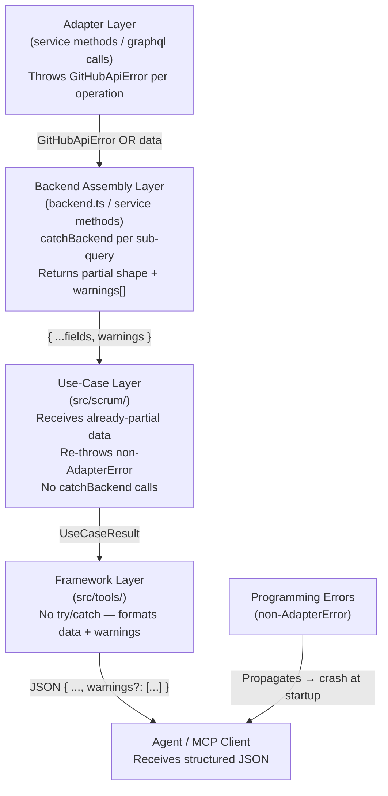

# Adapter Layer Error Handling & Partial Response Strategy

## Objective

1. Convert all silent errors/null assignments in the GitHub adapter layer into explicit `GitHubApiError` throws with comprehensive contextual information
2. Move error recovery into the **backend assembly layer** (port implementations in `backend.ts` and service classes) so each GraphQL operation fails independently — partial results are assembled field-by-field, not all-or-nothing
3. Use-case layer receives already-partial shapes with `warnings` included; no `catchBackend` at the use-case level
4. Remove all `try/catch` blocks from the framework layer — use-cases never throw
5. Non-adapter errors (programming bugs, startup config failures) propagate to crash

---

## Architecture: Error Flow



### The Critical Pivot

The original plan placed `catchBackend` at the **use-case layer**, wrapping entire port method calls:

```typescript
// ORIGINAL PLAN — binary outcome, NOT truly partial:
const { value: detail, warnings } = await catchBackend(
  () => backend.getStoryDetail(ref), // ← entire method; one failure → data: null
);
```

This is all-or-nothing: if `getStoryDetail` throws for any reason, the whole result is `null`. Instead, `catchBackend` must live **inside the port implementation**, wrapping each individual GraphQL operation. Each sub-query that fails produces `null` for its field only; the method still returns the fields that succeeded.

```
One GraphQL op fails  →  that field is null + warning added
Whole method call fails  →  only if a required/critical field fails
```

---

## Layer 1: Adapter Layer Fixes (Individual GraphQL Operations)

### Principle

Every path in an individual service method (a single GraphQL call or narrow operation) that currently silently returns null, swallows an error, or produces incorrect data MUST throw a `GitHubApiError` with:

- `code`: machine-readable error code from `GitHubErrorCode`
- `recovery`: agent-actionable instruction
- `context`: structured key/value detail

These throws are the raw signals. The backend assembly layer (Layer 2) decides how to handle each.

### Fix 1 — `label-resolver.ts`: Guard mutation result null path

```typescript
// BEFORE (label-resolver.ts ~line 183):
resolved.push({ id: createResult.createLabel.label.id, name });

// AFTER:
const label = createResult.createLabel?.label;
if (!label?.id) {
  throw new GitHubApiError(
    `Label creation mutation succeeded but returned no label node.`,
    {
      code: "MUTATION_FAILED",
      recovery: "Retry the label creation. If the issue persists, the GitHub API " +
        "may be returning an unexpected shape — check GitHub status.",
      context: { name, repositoryId, responseShape: JSON.stringify(createResult) },
    },
  );
}
resolved.push({ id: label.id, name });
```

### Fix 2 — `impediment-service.ts`: Guard null label ID

```typescript
// BEFORE (~line 227):
const newLabelId = await this.labelResolver.resolveOrCreateLabel(`status_${status}`);
const updatedLabelIds = currentLabelIds.filter(...).concat(newLabelId ?? []);

// AFTER:
const newLabelId = await this.labelResolver.resolveOrCreateLabel(`status_${status}`);
if (!newLabelId) {
  throw new GitHubApiError(
    `Failed to resolve or create the status label "status_${status}".`,
    {
      code: "MUTATION_FAILED",
      recovery: "Verify that your token has Issues (read/write) permission. " +
        "Check GitHub API status and retry.",
      context: { status, labelName: `status_${status}` },
    },
  );
}
const updatedLabelIds = currentLabelIds.filter(...).concat(newLabelId);
```

### Fix 3 — `board-health-service.ts`: Fix blocked count lookup

```typescript
// BEFORE (~line 154):
const blockedStatus = this.config.statusOptions["blocked"] ?? "Blocked";
const blocked = stories.filter((s) => s.status === blockedStatus).length;

// AFTER:
// statusOptions maps display names → option IDs. Find the display name from
// config's status_display map, then compare against story.status (also display name).
const ghConfig = this.config.scrumConfig.backends.github as Record<string, unknown>;
const statusDisplay = (ghConfig?.status_display ?? {}) as Record<string, string>;
const blockedDisplayName = Object.entries(statusDisplay)
  .find(([canonical]) => canonical === "blocked")?.[1] ?? "Blocked";
const blocked = stories.filter((s) => s.status === blockedDisplayName).length;
```

### Fix 4 — `impediment-service.ts`: Guard close mutation result

```typescript
// BEFORE (~line 246-254):
const closeResult = await this.gh.graphql<{
  closeIssue: { issue: { closedAt: string } };
}>(CLOSE_ISSUE_MUTATION, { issueId });
resolvedAt = closeResult.closeIssue?.issue?.closedAt ?? null;

// AFTER:
const closeResult = await this.gh.graphql<{
  closeIssue?: { issue?: { closedAt: string } | null } | null;
}>(CLOSE_ISSUE_MUTATION, { issueId });
const closedAt = closeResult.closeIssue?.issue?.closedAt;
if (!closedAt) {
  throw new GitHubApiError(
    `Issue close mutation succeeded but returned no closedAt timestamp.`,
    {
      code: "MUTATION_FAILED",
      recovery: "The issue may have been closed but the timestamp is unavailable. " +
        "Use scrum_get_story to verify the current state.",
      context: { issueId, impedimentId: ref.id },
    },
  );
}
resolvedAt = closedAt;
```

### Fix 5 — `story-mutation-service.ts`: Enrich mutation error context

```typescript
// BEFORE (~line 156):
const itemId = draftResult.addProjectV2DraftIssue?.projectItem?.id;
if (!itemId) {
  throw new GitHubApiError("addProjectV2DraftIssue returned no project item.", {...});
}

// AFTER:
const itemId = draftResult.addProjectV2DraftIssue?.projectItem?.id;
if (!itemId) {
  throw new GitHubApiError(
    "addProjectV2DraftIssue returned no project item.",
    {
      code: "MUTATION_FAILED",
      recovery: "Check that your token has Projects (read/write) permission and that " +
        "the project number in your configuration is correct, then retry.",
      context: {
        projectId: this.config.projectId,
        title: input.title,
        responseShape: JSON.stringify(draftResult),
      },
    },
  );
}
```

### Fix 6 — `analytics-service.ts`: Throw on null sprint resolution

```typescript
// BEFORE (~lines 134-135):
const sprint = resolveSprint(sprintRef, this.config);
if (sprint === null) return null;

// AFTER:
const sprint = resolveSprint(sprintRef, this.config);
if (sprint === null) {
  throw new GitHubApiError(
    `Sprint "${sprintRef}" could not be resolved to an iteration.`,
    {
      code: "NOT_FOUND",
      recovery: "The sprint may have been deleted or renamed. " +
        "Call scrum_orient to refresh the iteration list.",
      context: { sprintRef },
    },
  );
}
```

### Fix 7 — `analytics-service.ts`: Throw on stale iteration entry

```typescript
// BEFORE (~line 141-142):
const iterEntry = this.config.iterations.all.find((i) => i.id === sprint);
if (!iterEntry) return null;

// AFTER:
const iterEntry = this.config.iterations.all.find((i) => i.id === sprint);
if (!iterEntry) {
  throw new GitHubApiError(
    `Iteration ${sprint} resolved but not found in config iterations list.`,
    {
      code: "NOT_FOUND",
      recovery: "The config may be stale. Call scrum_orient to reload platform state.",
      context: { sprintId: sprint },
    },
  );
}
```

### Fix 8 — `sprint-history-service.ts`: Guard content type

```typescript
// BEFORE (~line 45-58):
.filter((item) => item.content !== null && item.content.__typename !== "DraftIssue")
.map((item) => {
  const content = item.content as ProjectItemIssueContent | ProjectItemPRContent;
  return { number: content.number, ... };
});

// AFTER:
.filter((item) => item.content !== null && item.content.__typename !== "DraftIssue")
.map((item) => {
  const content = item.content;
  if (!content || !("number" in content)) {
    throw new GitHubApiError(
      `Sprint history item has no issue number — unexpected content type.`,
      {
        code: "NOT_FOUND",
        recovery: "The item may have been deleted. Re-run scrum_orient to refresh.",
        context: { itemId: item.id, contentType: content?.__typename },
      },
    );
  }
  return { number: content.number, ... };
});
```

### Fix 9 — `mappers.ts`: Remove unsafe `!` assertion

```typescript
// BEFORE (~line 309):
completed: this.deps.config.iterations.completed.map((i) => toSprintInfo(i)!),

// AFTER:
completed: this.deps.config.iterations.completed
  .map((i) => toSprintInfo(i))
  .filter((info): info is SprintInfo => info !== null),
```

### Fix 10 — `story-query-service.ts`: Throw on unresolved sprint ref

```typescript
// BEFORE (~lines 447-457):
items = items.map((item) => {
  if (item.sprint.name) {
    const iterEntry = this.config.iterations.all.find(...);
    if (iterEntry) { return { ...item, sprint: { ... } }; }
  }
  return item;
});

// AFTER:
items = items.map((item) => {
  if (item.sprint.name) {
    const iterEntry = this.config.iterations.all.find(
      (i) => i.title === item.sprint.name,
    );
    if (iterEntry) {
      return { ...item, sprint: { name: item.sprint.name, ref: { id: iterEntry.id } } };
    }
    throw new GitHubApiError(
      `Sprint "${item.sprint.name}" has no matching iteration in config.`,
      {
        code: "NOT_FOUND",
        recovery: "The sprint may have been deleted or the config is stale. " +
          "Call scrum_orient to refresh platform state.",
        context: { sprintName: item.sprint.name, itemKey: item.ref.key },
      },
    );
  }
  return item;
});
```

### Fix 11 — `mappers.ts`: Handle nullable comment body

```typescript
// BEFORE (~line 268):
body: c.body,

// AFTER:
body: c.body ?? "",
```

---

## Layer 2: Backend Assembly Layer (Port Implementations)

### Principle

Port method implementations in `backend.ts` (and the service classes they delegate to) are responsible for **assembling partial results from multiple independent GraphQL operations**. Each sub-query is wrapped in `catchBackend` independently. A failure in one query yields `null` for that field plus a warning — it does not abort the whole method.

This is the layer that moves error recovery _down_ from the use-case. The use-case never calls `catchBackend`.

### New Port Return Types

The `StoryDetail` port type must be updated to carry nullable optional fields and warnings. Since `StoryDetail` is already marked deprecated in favour of `ItemDetailResult`, we can evolve `StoryDetail` directly or introduce a `PartialStoryDetail`:

```typescript
// src/scrum/ports.ts — update StoryDetail:
export interface StoryDetail {
  readonly story: Story;
  readonly comments: StoryComment[] | null; // null if fetch failed
  readonly linked_artifacts: LinkedArtifact[] | null; // null if fetch failed
  readonly warnings: string[];
}
```

For other ports that make a single atomic call (e.g. `findItems`, `getBoardHealth`), the return type stays as-is; the backend assembly layer wraps the entire call with `catchBackend` at the **backend.ts delegation site**.

### `getStoryDetail` — Split Into Independent Sub-Queries

`StoryQueryService.getStoryDetail` currently fires two parallel GraphQL calls (`GET_ISSUE_DETAILS_QUERY` + `GET_ITEM_FIELDS_QUERY`) in a single `Promise.all`. Both succeed or both fail together.

The refactored version wraps each call independently so field data and item fields fail separately:

```typescript
// In StoryQueryService — revised getStoryDetail:
async getStoryDetail(ref: StoryRef): Promise<StoryDetail> {
  const warnings: string[] = [];

  // resolveStory is required — failure is fatal, let it throw
  const resolved = await resolveStory(ref, this.gh);

  if (!resolved.issueId) {
    return this._getDraftIssueDetail(resolved.itemId);
  }

  // Each GraphQL operation is independent — wrap separately
  const { value: issueData, warnings: issueWarnings } = await catchBackend(() =>
    this.gh.graphql<GetIssueDetailsResponse>(GET_ISSUE_DETAILS_QUERY, {
      issueId: resolved.issueId,
    })
  );
  warnings.push(...issueWarnings);

  const { value: itemData, warnings: fieldWarnings } = await catchBackend(() =>
    this.gh.graphql<GetItemFieldsResponse>(GET_ITEM_FIELDS_QUERY, {
      itemId: resolved.itemId,
    })
  );
  warnings.push(...fieldWarnings);

  const issue = issueData?.node;
  if (!issue || issue.number === null) {
    // Story itself is required — this is a fatal adapter error, throw upward
    throw new GitHubApiError(
      `Issue ${resolved.issueId} could not be fetched.`,
      {
        code: "NOT_FOUND",
        statusCode: 404,
        recovery: "The issue may have been deleted from the repository. " +
          "Refresh your story list with scrum_get_sprint or scrum_get_backlog.",
        context: { issueId: resolved.issueId, itemId: resolved.itemId },
      },
    );
  }

  // Build story — field values may be partial if itemData failed
  const story = buildEnrichedStory(
    issue,
    resolved.itemId,
    itemData?.node?.fieldValues?.nodes ?? [],
    this.config,
  );

  // Optional fields — null if their data was unavailable
  const comments: StoryComment[] | null = issueData
    ? buildCommentList(issue.comments?.nodes ?? [])
    : null;
  const linked_artifacts: LinkedArtifact[] | null = issueData
    ? buildLinkedPrList(issue.timelineItems?.nodes ?? [])
    : null;

  return { story, comments, linked_artifacts, warnings };
}
```

### `getPlatformState` — Existing Pattern Is Correct

`getPlatformState` in `backend.ts` makes a single `labelResolver.auditTypeLabels()` call. If it fails, catching at the use-case level (in `orientUseCase`) is appropriate since the entire platform state is one logical operation. No change needed here.

### `getAnalytics` — Already Partial

`AnalyticsService.getAnalytics` already returns `burndown: null | ...` and `history: null | ...`. The backend method already handles partial results internally. The use-case simply passes through — no `catchBackend` needed at the use-case level.

### Delegation Sites in `backend.ts`

For methods that are a simple pass-through delegation to a single service call, the backend.ts method stays thin. The service method itself (Layer 1 or here in Layer 2) owns the error handling. No `catchBackend` wrapping is added at the delegation site.

---

## Layer 3: Use-Case Layer

### Principle

Use-cases call port methods and receive **already-partial** results. They do NOT call `catchBackend`. If a port method throws (because a required field is unavailable), that propagates up; non-adapter errors crash the process.

Use-cases are responsible for:

- Assembling the final `UseCaseResult<T>` shape
- Forwarding `warnings` from the backend result
- Business logic (parsing acceptance criteria, computing percentages, etc.)

### `UseCaseResult<T>` (unchanged)

```typescript
// src/domain/types.ts
export interface UseCaseResult<T> {
  readonly data: T;
  readonly warnings: readonly string[];
}
```

### `getStoryUseCase` — No `catchBackend`

```typescript
export const getStoryUseCase = async (
  backend: StoryPort,
  ref: StoryRef,
): Promise<UseCaseResult<ItemDetailResult>> => {
  // backend.getStoryDetail now returns partial data with warnings built-in
  // If story itself is unavailable, this throws GitHubApiError — propagates up
  const detail = await backend.getStoryDetail(ref);

  const acceptance_criteria = parseAcceptanceCriteria(detail.story.body);
  return {
    data: {
      story: detail.story,
      comments: detail.comments, // may be null (backend warned)
      linked_artifacts: detail.linked_artifacts, // may be null (backend warned)
      acceptance_criteria: acceptance_criteria.map((ac) => ac.text),
    },
    warnings: detail.warnings,
  };
};
```

Note: `ItemDetailResult` in `domain/types.ts` should be updated to allow `comments: StoryComment[] | null` and `linked_artifacts: LinkedArtifact[] | null`.

### `orientUseCase` — Already Correct Pattern

`orientUseCase` already calls `catchBackend` per independent backend method (`getPlatformState`, `getEpics`, `getSprintCompletion`). These are three distinct operations that each make independent network calls — catching each separately is correct and should be kept. No change needed structurally; this is the reference implementation of the right pattern when the use-case orchestrates multiple backend calls.

### `getAnalyticsUseCase`

```typescript
export const getAnalyticsUseCase = async (
  backend: AnalyticsPort,
  query: AnalyticsQuery,
): Promise<UseCaseResult<AnalyticsResult>> => {
  // getAnalytics already returns partial shapes (burndown/history nullable)
  // No catchBackend — if the whole call fails, propagate
  const result = await backend.getAnalytics(query);
  return {
    data: result ?? { burndown: null, history: null, window: query.history_window ?? 0 },
    warnings: [],
  };
};
```

### `getBoardHealthUseCase`

```typescript
export const getBoardHealthUseCase = async (
  backend: BoardHealthPort,
  sprintScope: string,
): Promise<UseCaseResult<BacklogHealth | null>> => {
  const result = await backend.getBoardHealth(sprintScope);
  return { data: result, warnings: [] };
};
```

### `findItemsUseCase`

```typescript
export const findItemsUseCase = async (
  backend: FindItemsPort,
  filter: ItemFilter,
): Promise<UseCaseResult<ItemSearchResult>> => {
  const resolved = resolveFilter(filter);
  const result = await backend.findItems(resolved);
  return {
    data: result ?? {
      items: [],
      total_count: 0,
      scope_summary: { sprint_count: null, backlog_count: null },
      dependency_map: null,
    },
    warnings: [],
  };
};
```

---

## Layer 4: Framework Layer

### Principle

Remove ALL `try/catch` blocks from tool handlers. Every handler calls a use-case → receives `UseCaseResult<T>` → formats JSON with optional `warnings` field.

### Pattern

```typescript
async (params: z.infer<typeof GetStorySchema>) => {
  const { data, warnings } = await getStoryUseCase(backend, params.ref);
  const response = { ...data, ...(warnings.length > 0 ? { warnings } : {}) };
  return {
    content: [{ type: "text", text: JSON.stringify(response, null, 2) }],
    ...(data === null ? { isError: true } : {}),
  };
},
```

### Response Shape Convention

```json
{
  "story": { "ref": { "id": "PVTI_..." }, "title": "...", ... },
  "comments": null,
  "linked_artifacts": null,
  "acceptance_criteria": ["AC1: ..."],
  "warnings": [
    "[github] NOT_FOUND: Comments could not be fetched for issue #42.\n  Details: {...}\n  → Retry the request..."
  ]
}
```

### Framework Layer Changes per File

#### `src/tools/scrum-read.ts`

| Tool                     | Change                                                                                                      |
| ------------------------ | ----------------------------------------------------------------------------------------------------------- |
| `scrum_orient`           | Remove try/catch. Unwrap `UseCaseResult<OrientResult>`.                                                     |
| `scrum_get_story`        | Remove try/catch. Unwrap `UseCaseResult<ItemDetailResult>`. Set `isError: true` when `data.story === null`. |
| `scrum_find_items`       | Remove try/catch. Unwrap `UseCaseResult<ItemSearchResult>`.                                                 |
| `scrum_get_analytics`    | Remove try/catch. Unwrap `UseCaseResult<AnalyticsResult>`.                                                  |
| `scrum_get_board_health` | Remove try/catch. Unwrap `UseCaseResult<BacklogHealth \| null>`. Set `isError: true` when `data === null`.  |

#### `src/tools/scrum-write.ts`

| Tool                      | Change                                                                          |
| ------------------------- | ------------------------------------------------------------------------------- |
| `scrum_add_vocabulary`    | Remove try/catch. Wrap in use-case or catchBackend inline.                      |
| `scrum_set_field`         | Remove try/catch. Inline catchBackend for `setField`; read result from backend. |
| `scrum_update_story`      | Remove try/catch. Inline catchBackend per backend call.                         |
| `scrum_create_story`      | Remove outer try/catch only (inner catchBackend calls already correct).         |
| `scrum_plan_sprint`       | Remove try/catch. Already uses catchBackend.                                    |
| `scrum_log_impediment`    | Remove try/catch. Wrap `createImpediment` + `addComment` in catchBackend.       |
| `scrum_update_impediment` | Remove try/catch. Wrap `updateImpediment` in catchBackend.                      |

Write tools that orchestrate multiple backend calls directly (not via a use-case) keep `catchBackend` per call at the tool handler level — this is acceptable since these are already thin orchestrations, not business logic.

---

## Implementation Order (Safe Incremental Steps)

### Phase 1: Type Infrastructure

1. Add/update `StoryDetail` in [`src/scrum/ports.ts`](src/scrum/ports.ts): make `comments` and `linked_artifacts` nullable, add `warnings: string[]`
2. Update `ItemDetailResult` in [`src/domain/types.ts`](src/domain/types.ts): make `comments` and `linked_artifacts` nullable
3. Ensure `UseCaseResult<T>` is exported from [`src/domain/types.ts`](src/domain/types.ts)

### Phase 2: Adapter Layer — Fix All Silent Errors

4. Fix `label-resolver.ts` — guard mutation null (Fix 1)
5. Fix `impediment-service.ts` — guard null label ID (Fix 2)
6. Fix `board-health-service.ts` — fix blocked count (Fix 3)
7. Fix `impediment-service.ts` — guard close mutation (Fix 4)
8. Fix `story-mutation-service.ts` — enrich mutation error (Fix 5)
9. Fix `analytics-service.ts` — throw on null sprint (Fixes 6, 7)
10. Fix `sprint-history-service.ts` — guard content type (Fix 8)
11. Fix `mappers.ts` — remove `!` assertion, nullable body (Fixes 9, 11)
12. Fix `story-query-service.ts` — throw on unresolved sprint ref (Fix 10)
13. Run `deno lint && deno test` after Phase 2

### Phase 3: Backend Assembly Layer — Per-Query Error Handling

14. Refactor `StoryQueryService.getStoryDetail` — wrap each GraphQL call with `catchBackend` independently; return `{ story, comments | null, linked_artifacts | null, warnings }`
15. Audit other multi-call methods (e.g. `getAnalytics` sub-queries) — apply same pattern where applicable
16. Run `deno lint && deno test` after Phase 3

### Phase 4: Use-Case Layer — Remove `catchBackend` Calls

17. Refactor [`getStoryUseCase`](src/scrum/get-story.ts) — remove `catchBackend`, forward `detail.warnings`
18. Refactor [`getAnalyticsUseCase`](src/scrum/get-analytics.ts) — remove `catchBackend`, pass through
19. Refactor [`getBoardHealthUseCase`](src/scrum/get-board-health.ts) — remove `catchBackend`, pass through
20. Refactor [`findItemsUseCase`](src/scrum/find-items.ts) — remove `catchBackend`, pass through
21. Keep [`orientUseCase`](src/scrum/orient.ts) as-is — it orchestrates multiple independent backend calls; per-call `catchBackend` is correct here
22. Run `deno lint && deno test` after Phase 4

### Phase 5: Framework Layer — Remove All try/catch

23. Refactor [`scrum-read.ts`](src/tools/scrum-read.ts) — all 5 tool handlers
24. Refactor [`scrum-write.ts`](src/tools/scrum-write.ts) — all 7 tool handlers
25. Verify: `rg "try\s*\{" src/tools/` returns zero results
26. Run `deno lint && deno test` after Phase 5

### Phase 6: Integration Testing

27. End-to-end test with real GitHub token — verify partial responses
28. Simulate adapter failures — verify warnings include context
29. Verify non-adapter errors propagate correctly

---

## Files Modified

### Adapter Layer

- [`src/adapters/github/internal/label-resolver.ts`](src/adapters/github/internal/label-resolver.ts)
- [`src/adapters/github/internal/impediment-service.ts`](src/adapters/github/internal/impediment-service.ts)
- [`src/adapters/github/internal/board-health-service.ts`](src/adapters/github/internal/board-health-service.ts)
- [`src/adapters/github/internal/story-mutation-service.ts`](src/adapters/github/internal/story-mutation-service.ts)
- [`src/adapters/github/internal/analytics-service.ts`](src/adapters/github/internal/analytics-service.ts)
- [`src/adapters/github/internal/sprint-history-service.ts`](src/adapters/github/internal/sprint-history-service.ts)
- [`src/adapters/github/mappers.ts`](src/adapters/github/mappers.ts)
- [`src/adapters/github/internal/story-query-service.ts`](src/adapters/github/internal/story-query-service.ts) ← major refactor

### Backend Assembly Layer

- [`src/adapters/github/backend.ts`](src/adapters/github/backend.ts) — audit delegation sites

### Port Interfaces

- [`src/scrum/ports.ts`](src/scrum/ports.ts) — `StoryDetail.comments` and `.linked_artifacts` become nullable; add `warnings: string[]`

### Use-Case Layer

- [`src/scrum/get-story.ts`](src/scrum/get-story.ts) — remove `catchBackend`
- [`src/scrum/find-items.ts`](src/scrum/find-items.ts) — remove `catchBackend`
- [`src/scrum/get-analytics.ts`](src/scrum/get-analytics.ts) — remove `catchBackend`
- [`src/scrum/get-board-health.ts`](src/scrum/get-board-health.ts) — remove `catchBackend`
- [`src/scrum/orient.ts`](src/scrum/orient.ts) — keep per-call `catchBackend` (reference pattern)

### Domain Layer

- [`src/domain/types.ts`](src/domain/types.ts) — `ItemDetailResult.comments` and `.linked_artifacts` nullable; `UseCaseResult<T>` already present

### Framework Layer

- [`src/tools/scrum-read.ts`](src/tools/scrum-read.ts)
- [`src/tools/scrum-write.ts`](src/tools/scrum-write.ts)

---

## Verification Criteria

- [ ] `deno lint` passes with zero warnings
- [ ] `deno task test` passes — all existing tests green
- [ ] All 5 read-tool handlers and all 7 write-tool handlers have no `try/catch` blocks
- [ ] Every adapter-layer silent `return null` path is replaced with `throw GitHubApiError`
- [ ] `getStoryDetail` returns `{ story, comments: null, linked_artifacts: null, warnings: [...] }` when sub-queries fail, not `null`
- [ ] Every use-case returns `UseCaseResult<T>` — only `orientUseCase` uses `catchBackend` internally
- [ ] Manual test: `scrum_get_story` with a valid story but broken comments query → partial response with story data + warnings
- [ ] Manual test: `scrum_get_story` with nonexistent ref → error response (story not found)
- [ ] Manual test: programming error (null config field) → process crash at startup
