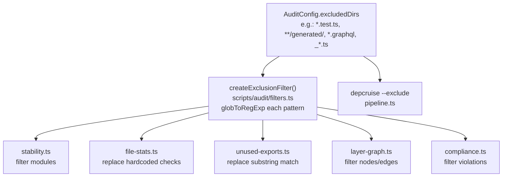

# Plan: Centralized Exclusion Filter for Audit Pipeline

## Problem

Test files (and other excluded files) appear in the generated AUDIT.md instability metrics because:

1. Each stage has its own ad-hoc filtering logic (or none at all)
2. `file-stats.ts` uses hardcoded `filePath.endsWith(".test.ts")` and a separate `EXCLUDED_PATTERNS` array
3. `stability.ts` has **no filtering at all** — it passes through every module from depcruise
4. `unused-exports.ts` has its own `isExcluded()` that does naive `filePath.includes(dir)` substring matching, which doesn't work with glob patterns like `*.test.ts`
5. `config.excludedDirs` (the single source of truth) is only used by `pipeline.ts` to pass `--exclude` flags to depcruise — but depcruise `--exclude` may not filter modules from `--metrics` output

## Design

Create a single shared utility that all stages use for exclusion filtering. `config.excludedDirs` is the one and only source of truth.



## Implementation Steps

### Step 1: Create `scripts/audit/filters.ts`

New shared module that converts `config.excludedDirs` globs into a reusable predicate:

```ts
import { globToRegExp } from "@std/path/glob-to-regexp";

export const createExclusionFilter = (
  excludedDirs: readonly string[],
): (path: string) => boolean => {
  const patterns = excludedDirs.map((g) => globToRegExp(g, { extended: true }));
  return (path: string): boolean => patterns.some((re) => re.test(path));
};
```

### Step 2: Update `scripts/audit/stages/stability.ts`

Add the filter when processing `depcruiseJson.modules`:

- Import `createExclusionFilter`
- Accept `config` parameter (already available via `AuditStage.run`)
- Before `.sort()`, add `.filter((mod) => !isExcluded(mod.source))`

### Step 3: Update `scripts/audit/stages/file-stats.ts`

- Remove hardcoded `EXCLUDED_PATTERNS` constant
- Remove `filePath.endsWith(".test.ts")` check
- Import and use `createExclusionFilter` with `config.excludedDirs`

### Step 4: Update `scripts/audit/stages/unused-exports.ts`

- Remove local `isExcluded()` function (substring match)
- Import and use `createExclusionFilter` with `config.excludedDirs`

### Step 5: Update `scripts/audit/stages/layer-graph.ts`

- Import and use `createExclusionFilter` to filter out excluded modules from nodes and edges
- Defense-in-depth: depcruise should already exclude, but stage-level filter is the safety net

### Step 6: Update `scripts/audit/stages/compliance.ts`

- Import and use `createExclusionFilter` to filter out violations from excluded modules
- Same defense-in-depth rationale

## Files Changed

| File                                     | Change                                          |
| ---------------------------------------- | ----------------------------------------------- |
| `scripts/audit/filters.ts`               | **NEW** — shared exclusion filter               |
| `scripts/audit/stages/stability.ts`      | Add filter for excluded modules                 |
| `scripts/audit/stages/file-stats.ts`     | Replace hardcoded exclusion with shared filter  |
| `scripts/audit/stages/unused-exports.ts` | Replace local `isExcluded()` with shared filter |
| `scripts/audit/stages/layer-graph.ts`    | Add filter for excluded nodes/edges             |
| `scripts/audit/stages/compliance.ts`     | Add filter for excluded violations              |

## Verification

After implementation, regenerate the audit:

```bash
deno task audit
```

Then inspect `docs/AUDIT.md`:

- No `*.test.ts` files in the Stability table
- No `*.test.ts` files in the File Statistics
- No `*.test.ts` files in Unused Exports
- Module count should decrease (currently 144, will be lower without test files)
