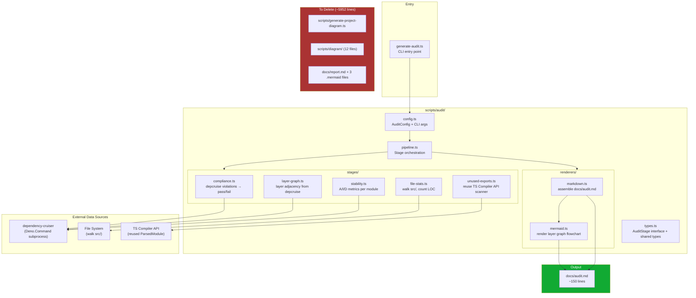

# Audit Script Refactoring — Execution Plan

## Overview

Replace the 4 unreadable diagram artifacts (~4135 lines) with a single concise audit report (~150 lines) and eliminate ~1364 lines of dead diagram-generator code by migrating from a custom TS Compiler API scanner to dependency-cruiser as the primary data source.

## Architecture Diagram



## Phased Breakdown

### Phase 1: Foundation — Types + Config

**Purpose:** Establish the shared type contracts and configuration parsing that all stages depend on. This is the bedrock — get this right and everything else slots in.

**Files to create:**

- `scripts/audit/types.ts` — `AuditStage<T>` interface, result types for all 5 stages, shared utility types
- `scripts/audit/config.ts` — `AuditConfig` type, `parseCliArgs()` function, defaults

**Key types to define:**

```typescript
// scripts/audit/types.ts

export interface AuditStage<TStageResult> {
  readonly name: string;
  run(config: AuditConfig, deps: StageDependencies): Promise<TStageResult>;
}

export interface StageDependencies {
  depcruiseJson?: DepcruiseOutput; // populated once, shared across stages
}

export interface AuditConfig {
  srcDir: string;           // default: "./src"
  outputPath: string;       // default: "./docs/audit.md"
  skipStages: string[];     // from --skip flag
  dryRun: boolean;          // from --dry-run flag
}

// Result types for each stage
export interface ComplianceResult { ... }
export interface LayerGraphResult { ... }
export interface StabilityResult { ... }
export interface FileStatsResult { ... }
export interface UnusedExportResult { ... }
```

**Stage Interface rationale (OCP):** The `AuditStage<T>` interface uses a generic type parameter so each stage returns its own result type. The pipeline is an array of stages; adding a new stage = new file + add to the array. No existing code changes.

### Phase 2: Core Data Acquisition — depcruise Runner

**Purpose:** Create the utility that spawns dependency-cruiser and parses its JSON output. This is consumed by the compliance, layer-graph, and stability stages.

**Location:** Inline within `pipeline.ts` or a shared utility — at this size a separate file is not warranted.

**Implementation notes:**

- Reuse the `Deno.Command` pattern from `scripts/depcruise.ts`
- Run with `--output-type json`
- Return typed `DepcruiseOutput` or throw with descriptive error
- Cache the result so stages share the same parsed data

### Phase 3: Stage Implementations (5 stages)

#### 3a. Compliance Stage (`scripts/audit/stages/compliance.ts`)

**Input:** depcruise JSON output **Output:** Per-rule pass/fail with violation counts

**Logic:**

1. Iterate `depcruiseOutput.rules[]` — each rule's `name` + `severity`
2. For each rule, scan all modules' dependencies for violations that reference that rule name
3. Count violations per rule
4. Determine pass/fail: `error` severity with > 0 violations = fail
5. Build a mapping of violated-rule → [offending modules]

**Edge cases:**

- Empty rules array → report "no rules configured"
- No violations → all green
- depcruise had non-zero exit but still produced valid JSON → parse it anyway

#### 3b. Layer Graph Stage (`scripts/audit/stages/layer-graph.ts`)

**Input:** depcruise JSON output **Output:** Layer nodes + cross-layer dependency edges

**Layer classification (from plan):**

- `src/server.ts` → "entrypoint"
- `src/tools/` or `src/schemas/` or `src/services/` → "framework"
- `src/scrum/` → "use-case"
- `src/domain/` → "domain"
- `src/adapters/` → "adapter"

**Logic:**

1. Classify each module into a layer based on path prefix
2. For each dependency, classify target module into a layer
3. If source layer ≠ target layer, emit a cross-layer edge
4. Mark edges as violation-red if they violate any depcruise rule

#### 3c. Stability Stage (`scripts/audit/stages/stability.ts`)

**Input:** depcruise JSON output (includes `instability`, `abstractness`, `distance` per module) **Output:** Per-module A/I/D with zone classification

**Zone thresholds:**

- D > 0.7 → Zone of Pain/Uselessness (red)
- D < 0.1 → Main Sequence (green)
- 0.1 ≤ D ≤ 0.7 → Transitioning (yellow)

**Logic:** Directly read depcruise's computed metrics per module. Group by layer. Sort by distance descending.

#### 3d. File Stats Stage (`scripts/audit/stages/file-stats.ts`)

**Input:** File system only (no depcruise dependency) **Output:** Per-layer file count, total LOC, top-3 largest files

**Exclusions:** `generated/`, `graphql/`, `*test.ts`, `__snapshots__/`, `__fixtures__/`

**Logic:**

1. Walk `src/` recursively
2. Filter out excluded patterns
3. Classify each file into a layer (same mapping as layer-graph)
4. Count lines per file (simple `\n` split)
5. Aggregate per layer: count, total LOC, top-3 by LOC

#### 3e. Unused Exports Stage (`scripts/audit/stages/unused-exports.ts`)

**Input:** Source files (reuse existing TS Compiler API scanner) **Output:** List of exported symbols never imported by another module

**Files to reuse:**

- `scripts/diagram/ParsedModule.ts` — the TS Compiler API parser
- `scripts/diagram/helpers.ts` — `findUnusedExports()` and `resolveImport()`

**Cleanup needed on these kept files:**

- Remove `sanitizeForMermaid`, `formatTypeNode`, `collectTypeRefs`, `getNodeText` from `helpers.ts`
- Remove `Layer`, `LayerMapping`, `NamespaceDef`, `ClassBodyResult`, `ClassDiagramOptions`, `ExtractedClass`, `ExtractedRelationship`, `RelationshipArrow`, `NamespaceName` from `types.ts`
- Keep only: `UnusedExport`, `ExportInfo`, `ImportInfo`, `ExportKind`, `ImportKind`
- `ParsedModule.ts` can stay as-is (it only exports what we need)

**Import note for the stage:**

```typescript
// Re-import kept types from the cleaned-up diagram directory
import { ParsedModule } from "../diagram/ParsedModule.ts";
import { findUnusedExports, resolveImport } from "../diagram/helpers.ts";
import type { UnusedExport } from "../diagram/types.ts";
```

### Phase 4: Renderers (2 files)

#### 4a. Mermaid Renderer (`scripts/audit/renderers/mermaid.ts`)

**Input:** `LayerGraphResult` from layer-graph stage **Output:** String — a `flowchart TB` mermaid diagram

**Structure:**

- Each layer as a `subgraph` with a background color
- Each module as a node inside its layer's subgraph
- Cross-layer dependencies as directional arrows
- Red arrows for violations, green for valid

**Optional enhancement:** Group nodes by subdirectory within each layer when there are many files.

#### 4b. Markdown Renderer (`scripts/audit/renderers/markdown.ts`)

**Input:** All 5 stage results + the mermaid string **Output:** String — the complete `docs/audit.md` content

**Section order:**

1. **Header** — title, timestamp, commit SHA
2. **Architecture Compliance** — 🟢/🔴 table, per-rule pass/fail
3. **Layer Dependency Graph** — embedded mermaid code block
4. **Stability Metrics** — table grouped by zone
5. **File Stats** — per-layer file count + LOC + top-3
6. **Unused Exports** — table: file, export name, kind
7. **Footer** — auto-generated notice

### Phase 5: Pipeline + Entry Point

#### 5a. Pipeline (`scripts/audit/pipeline.ts`)

**Purpose:** Orchestrate stage execution and data flow. Explicit, grep-friendly checklist style.

```typescript
const stages: AuditStage<unknown>[] = [
  complianceStage,
  layerGraphStage,
  stabilityStage,
  fileStatsStage,
  unusedExportsStage,
];
```

**Flow:**

1. Run depcruise once, cache JSON
2. For each stage: skip if name in `config.skipStages`, else run with deps
3. Collect results into a `Map<string, unknown>`
4. Pass to renderers

#### 5b. Entry Point (`scripts/generate-audit.ts`)

**Purpose:** ~50 line CLI entry point.

```typescript
import { parseCliArgs } from "./audit/config.ts";
import { runPipeline } from "./audit/pipeline.ts";
// ...parse config, run pipeline, write output or dry-run to stdout
```

**CLI flags:**

- `--skip <stage-name>` — disable a stage
- `--dry-run` — print to stdout instead of writing file
- `--output <path>` — override default output path (default: `./docs/audit.md`)

### Phase 6: Cleanup

**Delete these files (after verifying no imports reference them):**

1. `scripts/generate-project-diagram.ts` — entire file (453 lines)
2. `scripts/diagram/ClassDiagramGenerator.ts`
3. `scripts/diagram/DiagramStyler.ts`
4. `scripts/diagram/DomainTypeExtractor.ts`
5. `scripts/diagram/LayerSurfaceGenerator.ts`
6. `scripts/diagram/LayerSurfaceStyler.ts`
7. `scripts/diagram/LayerTypeExtractor.ts`
8. `scripts/diagram/ModuleImportGenerator.ts`
9. `scripts/diagram/ModuleImportStyler.ts`
10. `scripts/diagram/ToolRegistrationExtractor.ts`
11. `scripts/diagram/twoPassExtract.ts`
12. `scripts/diagram/TypeSurfaceGenerator.ts`
13. `scripts/diagram/TypeSurfaceStyler.ts`
14. `scripts/diagram/ZodSchemaExtractor.ts`

**Keep these (with cleanup noted in Phase 3e):**

- `scripts/diagram/ParsedModule.ts`
- `scripts/diagram/helpers.ts` (remove mermaid-specific functions)
- `scripts/diagram/types.ts` (remove diagram types)

**Delete docs artifacts:**

- `docs/report.md` (1035 lines)
- `docs/module-imports.mermaid` (924 lines)
- `docs/layer-surface.mermaid` (1603 lines)
- `docs/type-surface.mermaid` (573 lines)

**Update `deno.json`:**

- Remove `"diagram-gen"` task
- Add `"audit"`: `"deno run --allow-read --allow-env --allow-write --allow-run scripts/generate-audit.ts"`

**Preserve existing depcruise tasks:**

- `"depcruise"`, `"depcruise:json"`, `"depcruise:html"` should remain unchanged — they're independently useful.

### Phase 7: Verification

1. Run `deno task audit` → verify `docs/audit.md` is produced
2. Run `deno lint` — must pass
3. Run `deno fmt --check` — must pass
4. Verify unused-export count matches the existing `docs/report.md`
5. Run `deno task test` — ensure no test regressions
6. Verify no remaining imports reference deleted files (grep for `diagram/` imports across non-deleted files)
7. Test `--skip unused-exports` flag works
8. Test `--dry-run` flag prints to stdout

## File Inventory

### New Files Created (~770 lines total)

| File                                     | Est. Lines | Purpose                                  |
| ---------------------------------------- | ---------- | ---------------------------------------- |
| `scripts/audit/types.ts`                 | ~50        | Shared types + `AuditStage<T>` interface |
| `scripts/audit/config.ts`                | ~50        | Config + CLI arg parsing                 |
| `scripts/audit/pipeline.ts`              | ~60        | Stage orchestration                      |
| `scripts/audit/stages/compliance.ts`     | ~80        | Rule pass/fail from depcruise            |
| `scripts/audit/stages/layer-graph.ts`    | ~80        | Layer adjacency from depcruise           |
| `scripts/audit/stages/stability.ts`      | ~80        | A/I/D metrics                            |
| `scripts/audit/stages/file-stats.ts`     | ~100       | File count/LOC per layer                 |
| `scripts/audit/stages/unused-exports.ts` | ~80        | Reuse TS scanner for unused exports      |
| `scripts/audit/renderers/mermaid.ts`     | ~100       | Layer graph → mermaid string             |
| `scripts/audit/renderers/markdown.ts`    | ~90        | All results → audit.md                   |
| `scripts/generate-audit.ts`              | ~50        | CLI entry point                          |
| **Total**                                | **~770**   |                                          |

### Cleaned Files (modify, not delete)

| File                         | Action                                                                                                 |
| ---------------------------- | ------------------------------------------------------------------------------------------------------ |
| `scripts/diagram/types.ts`   | Remove diagram types; keep only `UnusedExport`, `ExportInfo`, `ImportInfo`, `ExportKind`, `ImportKind` |
| `scripts/diagram/helpers.ts` | Remove `sanitizeForMermaid`, `formatTypeNode`, `collectTypeRefs`, `getNodeText`                        |

### Deleted Files (~5952 lines total)

| File                                  | Lines     |
| ------------------------------------- | --------- |
| `scripts/generate-project-diagram.ts` | 453       |
| 12 files in `scripts/diagram/`        | ~1364     |
| `docs/report.md`                      | 1035      |
| 3 `.mermaid` files in `docs/`         | 3100      |
| **Total**                             | **~5952** |
