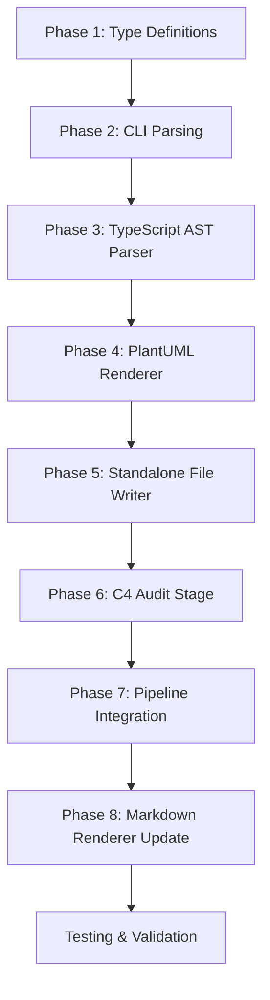

# C4 Diagram Generation Implementation Plan

## Overview

Add C4 diagram generation to the `scripts/generate-audit.ts` pipeline, producing PlantUML diagrams at four C4 levels (Context, Container, Component, Code) for both read and write tool surfaces. The implementation uses the **TypeScript Compiler API** to parse source files and trace call chains from tool registrations down to backend methods.

## Architecture Decision: TypeScript API over depcruise

| Factor                    | TypeScript API                                                      | depcruise                                            |
| ------------------------- | ------------------------------------------------------------------- | ---------------------------------------------------- |
| Call chain resolution     | Parses AST to trace `registerTool("name", ..., () => handler())`    | Only static import edges                             |
| Read/Write separation     | Parses `SCRUM_READ_TOOL_NAMES` / `SCRUM_WRITE_TOOL_NAMES` constants | Requires custom rule config                          |
| Component detail          | Extracts function signatures, Zod schemas, return types             | Module-level only                                    |
| Code detail               | Shows parameter types, generic constraints                          | Not available                                        |
| External system detection | Identifies `@modelcontextprotocol/sdk`, `@octokit` imports          | Shows as dependencies but no semantic classification |

**Decision:** Use TypeScript API. depcruise remains for compliance/layer-graph stages; C4 stages use a dedicated TypeScript AST parser.

---

## File Structure

```
scripts/audit/
├── types.ts                          # EXTEND: add C4 types, update AuditConfig
├── config.ts                         # EXTEND: add --c4-map CLI parsing
├── pipeline.ts                       # EXTEND: add c4-stage to ALL_STAGES
├── generate-c4-model.ts              # NEW: TypeScript AST parser
├── renderers/
│   ├── plantuml.ts                   # NEW: PlantUML C4 renderer
│   └── plantuml-file.ts              # NEW: Write .puml file
└── stages/
    └── c4-diagram.ts                 # NEW: C4 audit stage
```

---

## Phase 1: Type Definitions (`scripts/audit/types.ts`)

### 1.1 Add C4 Model Types

```typescript
// ── C4 diagram types ───────────────────────────────────────────────────────────

/** C4 diagram level */
export type C4Level = "context" | "container" | "component" | "code";

/** C4 element (person, system, container, component, code element) */
export interface C4Element {
  readonly id: string; // Sanitized identifier for PlantUML
  readonly name: string; // Display name
  readonly type: C4ElementType; // person | system | container | component | function | class | interface
  readonly technology?: string; // e.g. "TypeScript", "Zod", "GitHub GraphQL API"
  readonly description?: string; // Brief description
  readonly toolName?: string; // For tool-level elements: "scrum_orient"
  readonly layer: C4Layer; // context | container | component | code
}

/** C4 element type mapping to PlantUML stereotypes */
export type C4ElementType =
  | "person"
  | "system"
  | "container"
  | "component"
  | "function"
  | "class"
  | "interface"
  | "external_api";

/** C4 architectural layer */
export type C4Layer = "context" | "container" | "component" | "code";

/** C4 relationship (connection between elements) */
export interface C4Relationship {
  readonly from: string; // C4Element.id
  readonly to: string; // C4Element.id
  readonly label?: string; // e.g. "calls", "consumes", "implements"
  readonly technology?: string; // e.g. "MCP", "GraphQL", "ProjectBackend port"
  readonly direction?: "forward" | "reverse"; // PlantUML arrow direction
}

/** C4 diagram result (separate read/write diagrams) */
export interface C4DiagramResult {
  readonly readTools: C4DiagramSlice;
  readonly writeTools: C4DiagramSlice;
}

/** One C4 diagram slice (all levels for one tool category) */
export interface C4DiagramSlice {
  readonly context: C4SliceLevel;
  readonly container: C4SliceLevel;
  readonly component: C4SliceLevel;
  readonly code: C4SliceLevel;
}

/** Single C4 level within a slice */
export interface C4SliceLevel {
  readonly elements: readonly C4Element[];
  readonly relationships: readonly C4Relationship[];
}

/** Alias for the audit results map key */
export type AnyStageResult =
  | ComplianceResult
  | LayerGraphResult
  | StabilityResult
  | FileStatsResult
  | UnusedExportResult
  | C4DiagramResult;
```

### 1.2 Update `AuditConfig`

```typescript
export interface AuditConfig {
  readonly srcDir: string;
  readonly outputPath: string;
  readonly mermaidMode: MermaidMode;
  readonly mermaidOutputPath?: string;
  /** Controls C4 diagram output: off / embed in report / write to .puml file */
  readonly c4Mode: "off" | "embed" | "file";
  /** Path for standalone .puml file (only used when c4Mode === "file"). */
  readonly c4OutputPath?: string;
  readonly skipStages: string[];
  readonly excludeTests: boolean;
}
```

---

## Phase 2: CLI Parsing (`scripts/audit/config.ts`)

### 2.1 Update Help Text

Add `--c4-map` to the help text (already present at lines 20-23, verify it matches the spec):

```
--c4-map [<path>]      C4 diagram handling:
                         (not passed) → section omitted from report
                         --c4-map     → embedded inline in the report
                         --c4-map <path> → saved to standalone .puml file
```

### 2.2 Update `parseCliArgs`

Add C4 parsing logic following the same pattern as `--mermaid`:

```typescript
export const parseCliArgs = (args: string[]): AuditConfig => {
  // ... existing variables ...
  let c4Mode: "off" | "embed" | "file" = "off";
  let c4OutputPath: string | undefined;

  for (let i = 0; i < args.length; i++) {
    const arg = args[i];

    // ... existing parsing ...

    // C4 diagram handling (same pattern as --mermaid)
    else if (arg.startsWith("--c4-map=")) {
      const value = arg.slice("--c4-map=".length);
      if (value) {
        c4Mode = "file";
        c4OutputPath = value;
      }
    } else if (arg === "--c4-map") {
      const nextArg = i + 1 < args.length ? args[i + 1] : undefined;
      if (nextArg && !nextArg.startsWith("-")) {
        c4Mode = "file";
        c4OutputPath = nextArg;
        i++;
      } else {
        c4Mode = "embed";
      }
    }
  }

  return {
    // ... existing fields ...
    c4Mode,
    c4OutputPath,
  };
};
```

### 2.3 Update Skip Stages Help

Update the `--skip` help text to include `c4-diagram`:

```
--skip <stage>         Skip a stage (repeatable). Stages: compliance, layer-graph,
                       stability, file-stats, unused-exports, c4-diagram
```

---

## Phase 3: TypeScript AST Parser (`scripts/audit/generate-c4-model.ts`)

This is the core of the C4 generation. It uses the TypeScript Compiler API to parse source files and extract call chains.

### 3.1 Module: `generate-c4-model.ts`

```typescript
// =============================================================================
// scripts/audit/generate-c4-model.ts — TypeScript AST parser for C4 diagrams
//
// Parses src/tools/scrum-read.ts and src/tools/scrum-write.ts to extract:
//   1. Tool registrations (server.registerTool("name", ..., () => handler()))
//   2. Handler functions and their imports
//   3. Use-case functions and their imports
//   4. Port interfaces consumed
//   5. Adapter implementations
//
// Produces C4Element and C4Relationship arrays for each C4 level.
// =============================================================================

import * as ts from "typescript";
import type { C4DiagramResult, C4Element, C4Level, C4Relationship } from "./types.ts";

// ── Configuration ──────────────────────────────────────────────────────────────

const SRC_DIR = "./src";

/** Files that register tools — entry points for C4 extraction */
const TOOL_REGISTRY_FILES: ReadonlyArray<{ path: string; category: "read" | "write" }> = [
  { path: `${SRC_DIR}/tools/scrum-read.ts`, category: "read" },
  { path: `${SRC_DIR}/tools/scrum-write.ts`, category: "write" },
];

/** Files that contain handlers */
const HANDLER_FILES: ReadonlyArray<{ path: string; category: "read" | "write" }> = [
  { path: `${SRC_DIR}/tools/handlers/read.ts`, category: "read" },
  { path: `${SRC_DIR}/tools/handlers/write.ts`, category: "write" },
];

/** Use-case files (scrum/ directory) */
const USE_CASE_FILES: ReadonlyArray<{ path: string; category: "read" | "write" }> = [
  { path: `${SRC_DIR}/scrum/orient.ts`, category: "read" },
  { path: `${SRC_DIR}/scrum/get-story.ts`, category: "read" },
  { path: `${SRC_DIR}/scrum/find-items.ts`, category: "read" },
  { path: `${SRC_DIR}/scrum/get-analytics.ts`, category: "read" },
  { path: `${SRC_DIR}/scrum/get-board-health.ts`, category: "read" },
  { path: `${SRC_DIR}/scrum/update-impediment.ts`, category: "write" },
];

/** Port interface file */
const PORT_FILE = `${SRC_DIR}/scrum/ports.ts`;

/** Adapter files */
const ADAPTER_FILES = [`${SRC_DIR}/adapters/github/backend.ts`];

// ── Public API ─────────────────────────────────────────────────────────────────

/**
 * Generate C4 diagram data for all tool categories.
 * Returns C4DiagramResult with readTools and writeTools slices.
 */
export const generateC4Diagram = async (
  srcDir: string,
): Promise<C4DiagramResult> => {
  const readSlice = await extractSlice("read", srcDir);
  const writeSlice = await extractSlice("write", srcDir);
  return { readTools: readSlice, writeTools: writeSlice };
};

// ── Slice Extraction ───────────────────────────────────────────────────────────

/**
 * Extract all C4 levels for one tool category (read or write).
 */
const extractSlice = async (
  category: "read" | "write",
  srcDir: string,
): Promise<C4DiagramSlice> => {
  const elements: C4Element[] = [];
  const relationships: C4Relationship[] = [];

  // Context level
  const context = await buildContextLevel(category, srcDir);
  elements.push(...context.elements);
  relationships.push(...context.relationships);

  // Container level
  const container = await buildContainerLevel(category, srcDir);
  elements.push(...container.elements);
  relationships.push(...container.relationships);

  // Component level
  const component = await buildComponentLevel(category, srcDir);
  elements.push(...component.elements);
  relationships.push(...component.relationships);

  // Code level
  const code = await buildCodeLevel(category, srcDir);
  elements.push(...code.elements);
  relationships.push(...code.relationships);

  return {
    context: { elements: context.elements, relationships: context.relationships },
    container: { elements: container.elements, relationships: container.relationships },
    component: { elements: component.elements, relationships: component.relationships },
    code: { elements: code.elements, relationships: code.relationships },
  };
};

// ── Context Level ──────────────────────────────────────────────────────────────

/**
 * Context diagram: AI Agent → MCP Server → External Backend
 */
const buildContextLevel = async (
  category: "read" | "write",
  _srcDir: string,
): Promise<{ elements: C4Element[]; relationships: C4Relationship[] }> => {
  const elements: C4Element[] = [];
  const relationships: C4Relationship[] = [];

  // Person: AI Agent
  elements.push({
    id: "agent",
    name: "AI Agent",
    type: "person",
    technology: "LLM",
    description: "External agent calling MCP tools",
    layer: "context",
  });

  // System: MCP Server
  const systemId = category === "read" ? "mcp_server_read" : "mcp_server_write";
  elements.push({
    id: systemId,
    name: category === "read" ? "MCP Server (Read Tools)" : "MCP Server (Write Tools)",
    type: "system",
    technology: "TypeScript, MCP SDK",
    description: category === "read"
      ? "Handles scrum_orient, scrum_find_items, scrum_get_item_detail, scrum_get_analytics, scrum_get_board_health"
      : "Handles scrum_add_vocabulary, scrum_set_field, scrum_update_story, scrum_create_story, scrum_log_impediment, scrum_update_impediment, scrum_plan_sprint",
    layer: "context",
  });

  // System: GitHub Backend
  elements.push({
    id: "github_backend",
    name: "GitHub Projects API",
    type: "external_api",
    technology: "GraphQL API",
    description: "External GitHub Projects backend",
    layer: "context",
  });

  // Relationships
  relationships.push({
    from: "agent",
    to: systemId,
    label: category === "read"
      ? "calls scrum_orient, scrum_find_items, etc."
      : "calls scrum_set_field, scrum_create_story, etc.",
    technology: "MCP",
    direction: "forward",
  });

  relationships.push({
    from: systemId,
    to: "github_backend",
    label: "GraphQL queries + mutations",
    technology: "GitHub GraphQL API",
    direction: "forward",
  });

  return { elements, relationships };
};

// ── Container Level ────────────────────────────────────────────────────────────

/**
 * Container diagram: MCP Server → Use Cases → Port Interface
 */
const buildContainerLevel = async (
  category: "read" | "write",
  srcDir: string,
): Promise<{ elements: C4Element[]; relationships: C4Relationship[] }> => {
  const elements: C4Element[] = [];
  const relationships: C4Relationship[] = [];

  // MCP Server container
  const systemId = category === "read" ? "mcp_server_read" : "mcp_server_write";
  elements.push({
    id: systemId,
    name: category === "read" ? "MCP Server (Read)" : "MCP Server (Write)",
    type: "container",
    technology: "TypeScript, MCP SDK",
    layer: "container",
  });

  // Parse tool registry file to extract tool names
  const toolRegistryPath = category === "read"
    ? `${SRC_DIR}/tools/scrum-read.ts`
    : `${SRC_DIR}/tools/scrum-write.ts`;

  const toolNames = await extractToolNames(toolRegistryPath);

  // Create container elements for each tool
  for (const toolName of toolNames) {
    elements.push({
      id: sanitizeId(toolName),
      name: toolName,
      type: "container",
      technology: "MCP Tool",
      toolName,
      layer: "container",
    });
  }

  // Use-case containers
  const useCaseFiles = category === "read"
    ? USE_CASE_FILES.filter((f) => f.category === "read")
    : USE_CASE_FILES.filter((f) => f.category === "write");

  for (const ucFile of useCaseFiles) {
    const ucName = extractUseCaseName(ucFile.path);
    elements.push({
      id: sanitizeId(ucName),
      name: ucName,
      type: "container",
      technology: "TypeScript",
      layer: "container",
    });
  }

  // Port interface container
  elements.push({
    id: "project_backend_port",
    name: "ProjectBackend Port",
    type: "container",
    technology: "TypeScript Interface",
    layer: "container",
  });

  // Relationships: tools → use-cases
  // (Populated by tracing handler imports)
  // ...

  return { elements, relationships };
};

// ── Component Level ────────────────────────────────────────────────────────────

/**
 * Component diagram: Handlers → Use-Case Functions → Backend Methods
 */
const buildComponentLevel = async (
  category: "read" | "write",
  srcDir: string,
): Promise<{ elements: C4Element[]; relationships: C4Relationship[] }> => {
  const elements: C4Element[] = [];
  const relationships: C4Relationship[] = [];

  // Parse handler files to extract handler functions
  const handlerFiles = category === "read"
    ? HANDLER_FILES.filter((f) => f.category === "read")
    : HANDLER_FILES.filter((f) => f.category === "write");

  for (const hFile of handlerFiles) {
    const handlers = await extractHandlerFunctions(hFile.path);
    for (const handler of handlers) {
      elements.push({
        id: sanitizeId(handler),
        name: handler,
        type: "component",
        technology: "TypeScript",
        layer: "component",
      });
    }
  }

  // Use-case components
  // ...

  return { elements, relationships };
};

// ── Code Level ─────────────────────────────────────────────────────────────────

/**
 * Code diagram: Function signatures, Zod schemas, return types
 */
const buildCodeLevel = async (
  category: "read" | "write",
  srcDir: string,
): Promise<{ elements: C4Element[]; relationships: C4Relationship[] }> => {
  const elements: C4Element[] = [];
  const relationships: C4Relationship[] = [];

  // Extract function signatures from handler files
  // Extract Zod schema definitions
  // Extract port method signatures

  return { elements, relationships };
};

// ── AST Parsing Helpers ────────────────────────────────────────────────────────

/**
 * Parse a TypeScript file and extract registered tool names.
 * Looks for patterns like:
 *   export const SCRUM_READ_TOOL_NAMES = ["scrum_orient", "scrum_find_items", ...]
 */
const extractToolNames = async (filePath: string): Promise<string[]> => {
  const source = await Deno.readTextFile(filePath);
  const sourceFile = ts.createSourceFile(
    filePath,
    source,
    ts.ScriptTarget.Latest,
    true,
  );

  const toolNames: string[] = [];

  const visit = (node: ts.Node): void => {
    // Look for array literals assigned to *_TOOL_NAMES
    if (ts.isArrayLiteralExpression(node)) {
      const parent = node.parent;
      if (parent && ts.isVariableDeclaration(parent)) {
        const name = parent.name.getText();
        if (name.includes("TOOL_NAMES")) {
          for (const element of node.elements) {
            if (ts.isStringLiteral(element)) {
              toolNames.push(element.text);
            }
          }
        }
      }
    }
    ts.forEachChild(node, visit);
  };

  ts.forEachChild(sourceFile, visit);
  return toolNames;
};

/**
 * Extract handler function names from a handler file.
 * Looks for patterns like:
 *   export const handleOrient = async (...) => { ... }
 */
const extractHandlerFunctions = async (filePath: string): Promise<string[]> => {
  const source = await Deno.readTextFile(filePath);
  const sourceFile = ts.createSourceFile(filePath, source, ts.ScriptTarget.Latest, true);

  const handlers: string[] = [];

  const visit = (node: ts.Node): void => {
    if (ts.isVariableStatement(node)) {
      for (const decl of node.declarationList.declarations) {
        const name = decl.name.getText();
        if (name.startsWith("handle")) {
          handlers.push(name);
        }
      }
    }
    ts.forEachChild(node, visit);
  };

  ts.forEachChild(sourceFile, visit);
  return handlers;
};

/**
 * Extract use-case function name from file path.
 * e.g., "src/scrum/orient.ts" → "orientUseCase"
 */
const extractUseCaseName = (filePath: string): string => {
  const fileName = filePath.split("/").pop()?.replace(".ts", "") ?? "";
  return `${fileName}UseCase`;
};

/**
 * Sanitize an identifier for use in PlantUML node IDs.
 */
const sanitizeId = (id: string): string => {
  return id
    .replace(/[\/\\]/g, "_")
    .replace(/\./g, "_")
    .replace(/-/g, "_")
    .replace(/\(/g, "")
    .replace(/\)/g, "");
};
```

### 3.2 Key Parsing Strategies

| Target            | Pattern                                                             | AST Node                                              |
| ----------------- | ------------------------------------------------------------------- | ----------------------------------------------------- |
| Tool names        | `SCRUM_READ_TOOL_NAMES = ["scrum_orient", ...]`                     | `ArrayLiteralExpression` inside `VariableDeclaration` |
| Tool registration | `server.registerTool("scrum_orient", ..., () => handleOrient(...))` | `CallExpression` with `PropertyAccessExpression`      |
| Handler exports   | `export const handleOrient = async (...) => { ... }`                | `VariableStatement` with `const` modifier             |
| Use-case imports  | `import { orientUseCase } from "../../scrum/orient.ts"`             | `ImportDeclaration`                                   |
| Zod schemas       | `export const GetStorySchema = z.object({ ... })`                   | `VariableStatement` with `ExportKeyword`              |
| Port methods      | `findItems(params: FindItemsParams): Promise<...>`                  | `MethodDeclaration` in `InterfaceDeclaration`         |

---

## Phase 4: PlantUML Renderer (`scripts/audit/renderers/plantuml.ts`)

### 4.1 Module: `plantuml.ts`

````typescript
// =============================================================================
// scripts/audit/renderers/plantuml.ts — C4 diagram → PlantUML source
//
// Transforms a C4DiagramResult into PlantUML C4 stencils.
// Produces separate diagrams for read and write tools at each C4 level.
//
// Exports:
//   renderC4Source      — raw PlantUML source (no code fence)
//   renderC4Fenced      — wrapped in markdown ```plantuml fence (for embedding)
//   renderC4Slice       — single slice (read or write) at one level
// =============================================================================

import type {
  C4DiagramResult,
  C4DiagramSlice,
  C4Element,
  C4Level,
  C4Relationship,
  C4SliceLevel,
} from "../types.ts";

// ── PlantUML C4 Stereotype Mapping ─────────────────────────────────────────────

const STEREOTYPE_MAP: Record<C4ElementType, string> = {
  person: "(Person)",
  system: "System",
  container: "Container",
  component: "Component",
  function: "Function",
  class: "Class",
  interface: "Interface",
  external_api: "System_Ext",
};

// ── Public API ─────────────────────────────────────────────────────────────────

/**
 * Render the full C4 diagram result as raw PlantUML source.
 * Includes both read and write tool diagrams at all levels.
 */
export const renderC4Source = (result: C4DiagramResult): string => {
  const lines: string[] = [];

  lines.push("@startuml");
  lines.push("!include <c4/C4_Context>");
  lines.push("!include <c4/C4_Container>");
  lines.push("!include <c4/C4_Component>");
  lines.push("!include <c4/C4_Code>");
  lines.push("");

  // Read tools
  lines.push("== Read Tools ==");
  lines.push("");
  lines.push(renderC4SliceLevel(result.readTools.context, "context", "Read Tools"));
  lines.push("");
  lines.push(renderC4SliceLevel(result.readTools.container, "container", "Read Tools"));
  lines.push("");
  lines.push(renderC4SliceLevel(result.readTools.component, "component", "Read Tools"));
  lines.push("");
  lines.push(renderC4SliceLevel(result.readTools.code, "code", "Read Tools"));
  lines.push("");

  // Write tools
  lines.push("== Write Tools ==");
  lines.push("");
  lines.push(renderC4SliceLevel(result.writeTools.context, "context", "Write Tools"));
  lines.push("");
  lines.push(renderC4SliceLevel(result.writeTools.container, "container", "Write Tools"));
  lines.push("");
  lines.push(renderC4SliceLevel(result.writeTools.component, "component", "Write Tools"));
  lines.push("");
  lines.push(renderC4SliceLevel(result.writeTools.code, "code", "Write Tools"));
  lines.push("");

  lines.push("@enduml");

  return lines.join("\n") + "\n";
};

/**
 * Render a C4 diagram result wrapped in markdown ```plantuml fences.
 * Suitable for embedding inline in a markdown document.
 */
export const renderC4Fenced = (result: C4DiagramResult): string => {
  const body = renderC4Source(result);
  return "```plantuml\n" + body + "\n```\n";
};

/**
 * Render a single C4 slice level (e.g., readTools.context) as PlantUML.
 */
const renderC4SliceLevel = (
  slice: C4SliceLevel,
  level: C4Level,
  category: string,
): string => {
  const lines: string[] = [];

  lines.push(`---`);
  lines.push(`title ${category} - ${level} Diagram`);
  lines.push(`---`);
  lines.push("");

  // Render elements
  for (const elem of slice.elements) {
    const stereotype = STEREOTYPE_MAP[elem.type];
    const techPart = elem.technology ? ` "Technology: ${elem.technology}"` : "";
    const descPart = elem.description ? ` "Description: ${elem.description}"` : "";
    lines.push(`${elem.id} ${stereotype} "${elem.name}"${techPart}${descPart}`);
  }

  lines.push("");

  // Render relationships
  for (const rel of slice.relationships) {
    const techPart = rel.technology ? ` "Technology: ${rel.technology}"` : "";
    const labelPart = rel.label ? ` : "${rel.label}"` : "";
    const dirPart = rel.direction === "reverse" ? " <- " : " -> ";
    lines.push(`Rel(${rel.from}${dirPart}${rel.to}${labelPart}${techPart})`);
  }

  lines.push("");

  return lines.join("\n");
};
````

---

## Phase 5: Standalone File Writer (`scripts/audit/renderers/plantuml-file.ts`)

### 5.1 Module: `plantuml-file.ts`

```typescript
// =============================================================================
// scripts/audit/renderers/plantuml-file.ts — Write C4 diagram to .puml file
// =============================================================================

import type { C4DiagramResult } from "../types.ts";
import { renderC4Source } from "./plantuml.ts";

/**
 * Write the C4 diagram as a standalone `.puml` file.
 */
export const savePlantumlFile = async (
  result: C4DiagramResult,
  outputPath: string,
): Promise<void> => {
  const source = renderC4Source(result);
  await Deno.writeTextFile(outputPath, source);
};
```

---

## Phase 6: C4 Audit Stage (`scripts/audit/stages/c4-diagram.ts`)

### 6.1 Module: `c4-diagram.ts`

```typescript
// =============================================================================
// scripts/audit/stages/c4-diagram.ts — C4 diagram generation stage
//
// Runs the TypeScript AST parser and returns C4DiagramResult.
// Integrated into the pipeline like all other stages.
// =============================================================================

import type { AuditConfig, AuditStage, C4DiagramResult } from "../types.ts";
import { generateC4Diagram } from "../generate-c4-model.ts";

export const c4DiagramStage: AuditStage<C4DiagramResult> = {
  name: "c4-diagram",

  run: async (config: AuditConfig): Promise<C4DiagramResult> => {
    return generateC4Diagram(config.srcDir);
  },
};
```

---

## Phase 7: Pipeline Integration (`scripts/audit/pipeline.ts`)

### 7.1 Add C4 Stage to Pipeline

```typescript
import { c4DiagramStage } from "./stages/c4-diagram.ts";

const ALL_STAGES: readonly AuditStage<AnyStageResult>[] = [
  complianceStage,
  layerGraphStage,
  stabilityStage,
  fileStatsStage,
  unusedExportsStage,
  c4DiagramStage, // NEW
];
```

### 7.2 Add C4 to `generate-audit.ts`

```typescript
import { savePlantumlFile } from "./audit/renderers/plantuml-file.ts";

const main = async (): Promise<void> => {
  // ... existing code ...

  // ── Standalone PlantUML file (only when c4Mode === "file") ──────────
  if (config.c4Mode === "file") {
    const c4Diagram = results["c4-diagram"] as C4DiagramResult | undefined;
    if (
      c4Diagram &&
      (c4Diagram.readTools.context.elements.length > 0 ||
        c4Diagram.writeTools.context.elements.length > 0) &&
      config.c4OutputPath
    ) {
      console.error(`[audit] Writing PlantUML diagram to ${config.c4OutputPath}...`);
      await savePlantumlFile(c4Diagram, config.c4OutputPath);
      console.error(`[audit] PlantUML diagram written to ${config.c4OutputPath}`);
    } else if (
      !c4Diagram ||
      (c4Diagram.readTools.context.elements.length === 0 &&
        c4Diagram.writeTools.context.elements.length === 0)
    ) {
      console.error("[audit] Skipping PlantUML diagram — C4 data unavailable.");
    }
  }
};
```

---

## Phase 8: Markdown Renderer Update (`scripts/audit/renderers/markdown.ts`)

### 8.1 Update Imports

```typescript
import type { C4DiagramResult } from "../types.ts";
import { renderC4Fenced } from "./plantuml.ts";
```

### 8.2 C4 Section (already stubbed at lines 89-100)

The existing stub at lines 89-100 is correct. No changes needed beyond adding the import.

---

## Implementation Order



---

## Testing Strategy

| Test Type                | Target                 | Method                                                                                        |
| ------------------------ | ---------------------- | --------------------------------------------------------------------------------------------- |
| Unit: AST parsing        | `generate-c4-model.ts` | Parse fixture files, assert element/relationship counts                                       |
| Unit: PlantUML rendering | `plantuml.ts`          | Assert fenced output contains `@startuml`, `@enduml`, correct stereotypes                     |
| Contract: CLI parsing    | `config.ts`            | Assert `--c4-map` produces `{ c4Mode: "embed" }` or `{ c4Mode: "file", c4OutputPath: "..." }` |
| Integration: Pipeline    | `pipeline.ts`          | Run full pipeline with `--c4-map`, assert `results["c4-diagram"]` is populated                |
| Integration: File output | `generate-audit.ts`    | Run with `--c4-map output.puml`, verify file exists and is valid PlantUML                     |
| Golden: Embedded output  | `markdown.ts`          | Compare embedded PlantUML in AUDIT.md against committed snapshot                              |

---

## Risk Mitigation

| Risk                                           | Mitigation                                                                           |
| ---------------------------------------------- | ------------------------------------------------------------------------------------ |
| TypeScript API parsing fails on complex syntax | Start with simple patterns (tool names, handler exports); add complexity iteratively |
| PlantUML C4 stencils not available             | Use basic PlantUML syntax as fallback; `!include <c4/C4_*>` is optional              |
| Large source files slow to parse               | Cache parsed AST; only parse files that exist in the tool registry                   |
| C4 data unavailable for some projects          | Stage returns empty arrays; markdown shows "_C4 diagram data unavailable._"          |

---

## Summary of Changes by File

| File                                       | Action | Description                                                 |
| ------------------------------------------ | ------ | ----------------------------------------------------------- |
| `scripts/audit/types.ts`                   | EXTEND | Add C4 types, update `AuditConfig`, update `AnyStageResult` |
| `scripts/audit/config.ts`                  | EXTEND | Add `--c4-map` CLI parsing, update help text                |
| `scripts/audit/pipeline.ts`                | EXTEND | Add `c4DiagramStage` to `ALL_STAGES`                        |
| `scripts/generate-audit.ts`                | EXTEND | Add PlantUML file output logic                              |
| `scripts/audit/generate-c4-model.ts`       | NEW    | TypeScript AST parser                                       |
| `scripts/audit/stages/c4-diagram.ts`       | NEW    | C4 audit stage                                              |
| `scripts/audit/renderers/plantuml.ts`      | NEW    | PlantUML C4 renderer                                        |
| `scripts/audit/renderers/plantuml-file.ts` | NEW    | Standalone .puml file writer                                |
| `scripts/audit/renderers/markdown.ts`      | EXTEND | Add import for `renderC4Fenced` (section already stubbed)   |
