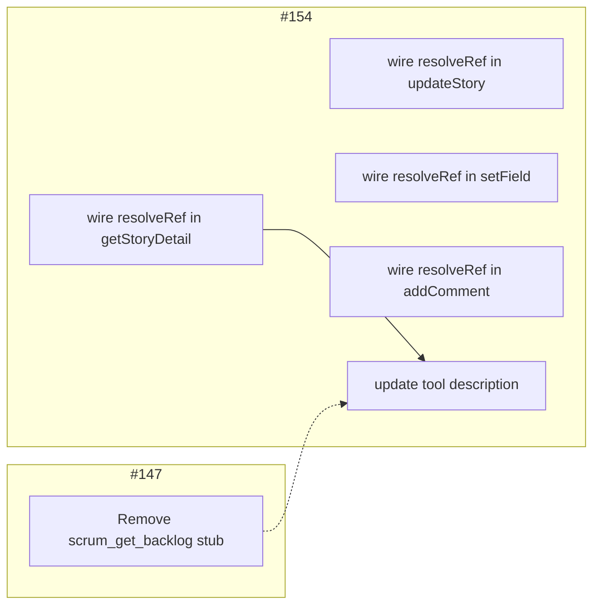

# Implementation Strategy: Close #147 and #154

## Context

Verification completed 2026-05-26. Two tickets remain "In Progress" with specific AC gaps.

### Status Summary

| Ticket                       | Verdict     | Remaining Work                                                         |
| ---------------------------- | ----------- | ---------------------------------------------------------------------- |
| #147 — Board Health View     | 4/5 AC pass | Fully deregister `scrum_get_backlog` stub                              |
| #154 — Human-readable lookup | 3/7 AC pass | Wire `resolveRef()` into all delegation paths, update tool description |

---

## Root Cause

The `GitHubProjectBackend.resolveRef()` method (which converts `{ number }` → `{ id }`) exists and works correctly, but is **never called** on any delegation path. The backend facade methods pass `ref` straight through to services, and services call `resolveStory()` directly — which throws on `{ number }` refs.

```
Current:  handler → backend.method(ref) → service.method(ref) → resolveStory(ref) → THROWS
Fixed:    handler → backend.method(ref) → resolveRef(ref) → service.method({id}) → resolveStory({id}) → OK
```

---

## Change Plan

### Part A — Ticket #147 (1 change point)

#### A1. Remove `scrum_get_backlog` from the tool surface

**File:** [`src/tools/scrum-read.ts`](src/tools/scrum-read.ts) **Action:** Delete lines 302-340 (the entire deprecated `scrum_get_backlog` registration block). **Why:** AC #4 requires the old tool name removed from the surface. The deprecation stub was a temporary measure during the rollout of #144 (scrum_find_items); that rollout is complete.

---

### Part B — Ticket #154 (4 change points)

#### B1. Wire `resolveRef()` into `getStoryDetail` delegation

**File:** [`src/adapters/github/backend.ts`](src/adapters/github/backend.ts:~246) **Current:**

```ts
getStoryDetail(ref: StoryRef): Promise<BackendCallResult<StoryDetail>> {
  return this.deps.storyQueryService.getStoryDetail(ref);
}
```

**Replace with:**

```ts
async getStoryDetail(ref: StoryRef): Promise<BackendCallResult<StoryDetail>> {
  const resolved = await this.resolveRef(ref);
  return this.deps.storyQueryService.getStoryDetail(resolved);
}
```

**Covers:** AC #2 — `{ number: 42 }` now resolves via `findItems` before hitting `resolveStory`.

#### B2. Wire `resolveRef()` into `updateStory` delegation

**File:** [`src/adapters/github/backend.ts`](src/adapters/github/backend.ts:~270) **Current:**

```ts
updateStory(ref: StoryRef, updates: StoryUpdates): Promise<void> {
  return this.deps.storyMutationService.updateStory(ref, updates);
}
```

**Replace with:**

```ts
async updateStory(ref: StoryRef, updates: StoryUpdates): Promise<void> {
  const resolved = await this.resolveRef(ref);
  return this.deps.storyMutationService.updateStory(resolved, updates);
}
```

#### B3. Wire `resolveRef()` into `setField` delegation

**File:** [`src/adapters/github/backend.ts`](src/adapters/github/backend.ts:~274) **Current:**

```ts
setField(ref, field, value): Promise<void> {
  return this.deps.storyMutationService.setField(ref, field, value);
}
```

**Replace with:**

```ts
async setField(
  ref: StoryRef,
  field: "status" | "sprint" | "story_points" | "priority" | "assignee" | "type",
  value: string | number | SprintRef | null,
): Promise<void> {
  const resolved = await this.resolveRef(ref);
  return this.deps.storyMutationService.setField(resolved, field, value);
}
```

**Covers:** AC #6 — all write tools now accept `{ number }` form.

#### B4. Wire `resolveRef()` into `addComment` delegation

**File:** [`src/adapters/github/backend.ts`](src/adapters/github/backend.ts:~282) **Current:**

```ts
addComment(ref: StoryRef, body: string): Promise<void> {
  return this.deps.storyMutationService.addComment(ref, body);
}
```

**Replace with:**

```ts
async addComment(ref: StoryRef, body: string): Promise<void> {
  const resolved = await this.resolveRef(ref);
  return this.deps.storyMutationService.addComment(resolved, body);
}
```

#### B5. Update `scrum_get_item_detail` tool description

**File:** [`src/tools/scrum-read.ts`](src/tools/scrum-read.ts:~71-85) **Current description:**

```
Args:
  ref  { number: integer } | { id: string } | { number, id }
       At least one of number or id is required.
       number = visible issue number (e.g. 42)
       id = opaque board item ID from a previous tool response

Returns: Story object with full body, comments array, and linked PR list.
```

**Replace with:**

```
Args:
  ref  { number: integer } | { id: string }
       At least one of number or id is required.
       number = visible issue number (e.g. 42) — use for direct user-driven lookups
       id = opaque board item ID from a previous tool response — use this when already held

Returns: Story object with full body, comments array, and linked PR list.
```

**Covers:** AC #5 — explicit guidance on when to use each form.

---

## Dependency Graph



**Execution order:** A1 and B1-B4 are independent and can ship together. B5 should follow B1 (the description changes are most meaningful once the feature works). Both tickets ship in a single PR.

---

## Verification Plan (post-implementation)

### Static checks

1. `deno lint` passes — no unused imports after removing `scrum_get_backlog`
2. `deno fmt --check` passes
3. `deno test` passes — no service signature changes that break existing tests

### Functional check

4. Call `scrum_get_item_detail({ number: 147 })` — must return the full story
5. Call `scrum_set_field({ ref: { number: 147 }, field: "status", value: "In Progress" })` — must succeed without throwing
6. Call `scrum_get_board_health({ sprint_scope: "current" })` — must return health data
7. Verify `scrum_get_backlog` is no longer registered (404 or tool-not-found error)
