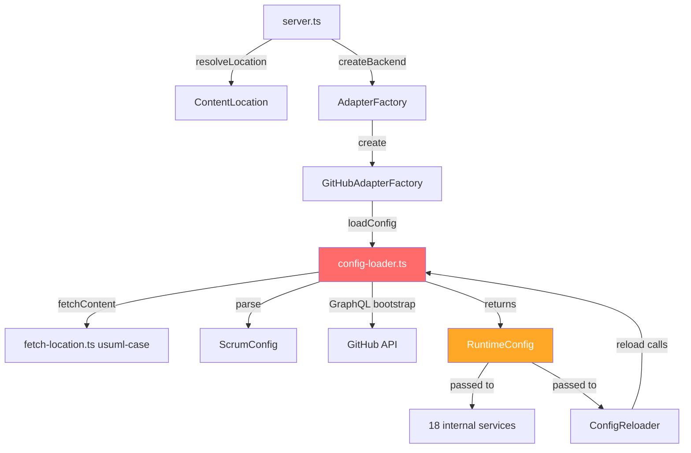
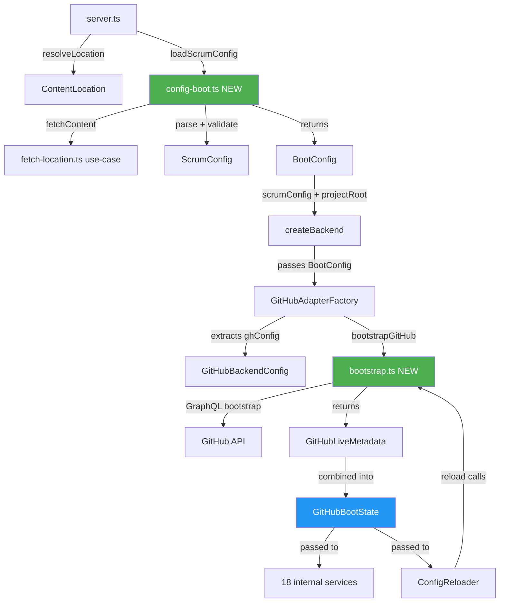

# Config Loading Refactoring Plan

## Problem Statement

The current config loading architecture has three structural issues:

### 1. Config loading at the wrong layer

[`config-loader.ts`](src/adapters/github/config-loader.ts:1) lives in the **adapter layer** (`src/adapters/github/`) but calls use-case utilities — [`fetchContent()`](src/scrum/fetch-location.ts:24) and [`resolveLocation()`](src/scrum/resolve-location.ts:27). The adapter owns YAML parsing, file I/O, and `$ENV_VAR` resolution. A second adapter (Notion, Trello) would need to duplicate all of this YAML fetching and parsing logic.

### 2. Monolithic RuntimeConfig type

[`RuntimeConfig`](src/adapters/github/config-loader.ts:29) is a grab-bag that mixes three distinct categories:

- **Domain config**: `scrumConfig: ScrumConfig` — the parsed YAML
- **GitHub live metadata**: `projectId`, `fields.*`, `statusOptions`, `priorityOptions`, `typeOptions`, `iterations` — fetched live from GitHub's GraphQL API
- **Resolved paths**: `typeTemplatePaths` — computed from `projectRoot` + template paths

The type hierarchy doesn't express that `status_display` and `priority_display` are **backend-specific** (they live on [`GitHubBackendConfig`](src/adapters/github/types.ts:78)) but are also repeated on [`ScrumConfig`](src/domain/config.ts:54) at lines 118-121.

### 3. ConfigReloader re-parses YAML unnecessarily

[`ConfigReloader.reload()`](src/adapters/github/internal/config-reloader.ts:20) calls `loadConfig()` which re-fetches + re-parses the YAML file on every reload. During a session, the YAML file never changes — only the live GitHub metadata (iterations, field option IDs) can change.

---

## Current Architecture



**The red node** (`config-loader.ts`) is the problem — it's in the adapter layer but owns YAML I/O that every backend would need.

---

## Target Architecture



**Green nodes** are new or substantially changed. **Blue node** is the renamed/restructured adapter boot state.

### Key structural changes:

| Before                                       | After                                                                       |
| -------------------------------------------- | --------------------------------------------------------------------------- |
| `RuntimeConfig` in adapter owns YAML parsing | `BootConfig` in use-case layer owns YAML loading                            |
| `loadConfig()` does everything               | `loadScrumConfig()` → YAML only; `bootstrapGitHub()` → GitHub metadata only |
| `ConfigReloader` re-parses YAML              | `ConfigReloader` only re-fetches live metadata                              |
| `BackendResult.scrumConfig`                  | `server.ts` already has it; removed from adapter result                     |
| `displayConfig` duplicated in deps           | Single source: `GitHubBackendConfig`                                        |

---

## Refactoring Plan — 3 Phases

### Phase 1: Move YAML loading to server startup (new `src/scrum/config-boot.ts`)

**Goal**: Separate "what is the config file" from "how does GitHub interpret it."

#### 1.1 Create `src/scrum/config-boot.ts`

New use-case utility with a single export:

```typescript
export interface BootConfig {
  scrumConfig: ScrumConfig;
  projectRoot: string;
}

export const loadScrumConfig = async (
  configLocation: ContentLocation,
): Promise<BootConfig>;
```

Responsibilities:

- Call [`fetchContent(configLocation)`](src/scrum/fetch-location.ts:24)
- Parse YAML → `ScrumConfig`
- Validate required top-level sections (`project`, `scrum`, `backends`)
- Compute `projectRoot` = `resolve(baseDir, project.projRoot ?? '.')`
- Do NOT resolve `$ENV_VAR` references (that's the adapter's job — only the adapter knows which backend to use)
- Do NOT make any network calls

#### 1.2 Update `server.ts` — call `loadScrumConfig()` before `createBackend()`

In [`createMcpServer()`](src/server.ts:256):

```typescript
const bootConfig = await loadScrumConfig(configLocation);
const backendResult = await createBackend(factories, {
  configLocation,
  scrumConfig: bootConfig.scrumConfig,
  projectRoot: bootConfig.projectRoot,
});
```

Destructure:

```typescript
const { backend, fileReader, typeTemplatePaths } = backendResult;
// scrumConfig is now from bootConfig, not from backendResult
```

#### 1.3 Update `AdapterStartupOptions` — add `scrumConfig` + `projectRoot`

In [`src/adapters/factory.ts`](src/adapters/factory.ts:18):

```typescript
export interface AdapterStartupOptions {
  readonly configLocation: ContentLocation;
  readonly scrumConfig: ScrumConfig;
  readonly projectRoot: string;
}
```

#### 1.4 Remove `scrumConfig` from `BackendResult`

In [`src/adapters/factory.ts`](src/adapters/factory.ts:57):

```typescript
export interface BackendResult {
  readonly backend: ProjectReader & ProjectWriter;
  readonly capabilities: PlatformCapabilities;
  readonly fileReader: FileReaderPort | null;
  readonly typeTemplatePaths: Record<string, ContentLocation>;
  // scrumConfig: REMOVED — caller already has it
}
```

#### 1.5 Update tool registration in `server.ts`

[`registerScrumReadTools()`](src/server.ts:290) and [`registerScrumWriteTools()`](src/server.ts:291) already receive `ScrumConfig` — now pass `bootConfig.scrumConfig` instead of `backendResult.scrumConfig`.

---

### Phase 2: Split RuntimeConfig + extract GitHubLiveMetadata

**Goal**: Distinguish "boot-time resolved state" from "live platform metadata that changes during a session."

#### 2.1 Define `GitHubLiveMetadata` in config-loader.ts

Extract the mutable, re-fetchable fields from `RuntimeConfig`:

```typescript
/** Live GitHub project metadata that can change during a session (iterations,
 * field option IDs). This is what ConfigReloader mutates in-place. */
export interface GitHubLiveMetadata {
  projectId: string;
  fields: {
    sprintFieldId: string;
    statusFieldId: string;
    storyPointsFieldId: string | null;
    priorityFieldId: string | null;
    epicFieldId: string | null;
    assigneeFieldId: string | null;
    typeFieldId: string | null;
  };
  statusOptions: Record<string, string>;
  priorityOptions: Record<string, string>;
  typeOptions: Record<string, string>;
  iterations: {
    active: IterationEntry | null;
    next: IterationEntry | null;
    completed: IterationEntry[];
    all: IterationEntry[];
  };
}
```

#### 2.2 Restructure `RuntimeConfig` → wrap the two layers

```typescript
/** Adapter-internal boot state: immutable parsed config + mutable live metadata.
 * Replaces the old flat RuntimeConfig. */
export interface RuntimeConfig {
  readonly scrumConfig: ScrumConfig;
  readonly ghConfig: GitHubBackendConfig;
  readonly typeTemplatePaths: Record<string, ContentLocation>;
  live: GitHubLiveMetadata; // mutable — patched by ConfigReloader
}
```

Fields previously accessed as `config.fields` become `config.live.fields`.

#### 2.3 Split `loadConfig()` into two functions

**`loadScrumConfig()`** (in new `src/scrum/config-boot.ts` — Phase 1):

- Fetches + parses YAML → `ScrumConfig`
- No adapter imports, no network calls

**`bootstrapGitHub()`** (stays in `config-loader.ts`, renamed from `loadConfig`):

```typescript
export const bootstrapGitHub = async (params: {
  ghConfig: GitHubBackendConfig;
  github: GitHubClient;
  projectRoot: string;
}): Promise<{ live: GitHubLiveMetadata; typeTemplatePaths: Record<string, ContentLocation> }>;
```

- Resolves `$ENV_VAR` references in `ghConfig.auth`
- Makes the GraphQL field-bootstrap call
- Resolves field IDs + option maps + iterations
- Resolves template paths
- Returns live metadata + template paths (no YAML, no file I/O)

#### 2.4 Update `GitHubAdapterFactory.create()`

```typescript
async create(options: AdapterStartupOptions): Promise<BackendResult> {
  const { scrumConfig, projectRoot, configLocation } = options;
  
  // Extract + validate backend-specific config
  const ghConfig = scrumConfig.backends.github as GitHubBackendConfig;
  // resolve env vars
  const resolvedGhConfig = { ...ghConfig, auth: { ...ghConfig.auth, token: resolveEnvRef(...) } };
  
  // Bootstrap live GitHub metadata
  const { live, typeTemplatePaths } = await bootstrapGitHub({
    ghConfig: resolvedGhConfig,
    github: { graphql },
    projectRoot,
  });
  
  // Assemble boot state
  const config: RuntimeConfig = {
    scrumConfig,
    ghConfig: resolvedGhConfig,
    typeTemplatePaths,
    live,
  };
  
  // ... rest of service construction unchanged
}
```

#### 2.5 Update all 18 internal service consumers

Every `this.config.fields.X` → `this.config.live.fields.X`. Same pattern for `statusOptions`, `priorityOptions`, `typeOptions`, `iterations`, `projectId`.

Files to update (18 files, mechanical changes):

- [`backend.ts`](src/adapters/github/backend.ts:1)
- [`mappers.ts`](src/adapters/github/mappers.ts:1)
- [`config-reloader.ts`](src/adapters/github/internal/config-reloader.ts:1)
- [`vocabulary-manager.ts`](src/adapters/github/internal/vocabulary-manager.ts:1)
- [`label-resolver.ts`](src/adapters/github/internal/label-resolver.ts:1)
- [`story-query-service.ts`](src/adapters/github/internal/story-query-service.ts:1)
- [`analytics-service.ts`](src/adapters/github/internal/analytics-service.ts:1)
- [`board-health-service.ts`](src/adapters/github/internal/board-health-service.ts:1)
- [`burndown-calculator.ts`](src/adapters/github/internal/burndown-calculator.ts:1)
- [`sprint-history-service.ts`](src/adapters/github/internal/sprint-history-service.ts:1)
- [`field-value-mutator.ts`](src/adapters/github/internal/field-value-mutator.ts:1)
- [`story-mutation-service.ts`](src/adapters/github/internal/story-mutation-service.ts:1)
- [`impediment-service.ts`](src/adapters/github/internal/impediment-service.ts:1)
- [`pagination.ts`](src/adapters/github/internal/pagination.ts:1)
- [`resolver.ts`](src/adapters/github/internal/resolver.ts:1)
- [`_test_utils.ts`](src/adapters/github/internal/_test_utils.ts:1) (update `makeConfig()`)
- [`story-mutation-service.test.ts`](src/adapters/github/internal/story-mutation-service.test.ts:1) (update imports)

#### 2.6 Update `ConfigReloader` — stop re-parsing YAML

[`ConfigReloader.reload()`](src/adapters/github/internal/config-reloader.ts:20) currently calls `loadConfig()` which fetches + parses YAML. After the split:

```typescript
async reload(): Promise<void> {
  // Only re-fetch live GitHub metadata — the YAML file hasn't changed
  const fresh = await bootstrapGitHub({
    ghConfig: this.config.ghConfig,
    github: this.github,
    projectRoot: /* compute or store */,
  });
  
  // Patch live metadata in-place
  Object.assign(this.config.live, fresh.live);
  // typeTemplatePaths unlikely to change, but update if present
  if (Object.keys(fresh.typeTemplatePaths).length > 0) {
    Object.assign(this.config.typeTemplatePaths, fresh.typeTemplatePaths);
  }
}
```

ConfigReloader now needs `projectRoot` as a constructor parameter (or it can compute it once from the config location).

#### 2.7 Remove duplicate `status_display` / `priority_display` from `ScrumConfig`

The fields at [`ScrumConfig.status_display`](src/domain/config.ts:119) and [`ScrumConfig.priority_display`](src/domain/config.ts:121) are backend-specific and duplicate the same fields on [`GitHubBackendConfig`](src/adapters/github/types.ts:101). These were likely added for [`config-helpers.ts`](src/scrum/config-helpers.ts:1) which resolves display names from `ScrumConfig`.

**Option A** (pragmatic): Move `config-helpers.ts` to receive `GitHubBackendConfig` instead of `ScrumConfig`. Update callers.

**Option B** (cleaner): Remove the helpers entirely and have consumers read from the backend-specific config directly.

Recommend **Option A** — minimal change, addresses the confusion.

---

### Phase 3: Rename for clarity

**Goal**: Names that reflect what things actually are.

| Current Name                   | New Name            | Rationale                                                                      |
| ------------------------------ | ------------------- | ------------------------------------------------------------------------------ |
| `RuntimeConfig`                | `GitHubBootState`   | It's not "runtime config" — it's the GitHub adapter's boot-time resolved state |
| `config-loader.ts`             | `bootstrap.ts`      | It no longer "loads config" — it bootstraps live GitHub metadata               |
| `loadConfig()`                 | `bootstrapGitHub()` | It bootstraps, not loads                                                       |
| `ScrumConfig.status_display`   | Removed             | Backend-specific, lives on `GitHubBackendConfig`                               |
| `ScrumConfig.priority_display` | Removed             | Same reason                                                                    |

#### 3.1 Rename `RuntimeConfig` → `GitHubBootState`

This is a mechanical rename across all 18 consumer files + factory + backend.

#### 3.2 Rename file `config-loader.ts` → `bootstrap.ts`

Update all imports. This makes the module's purpose obvious to anyone reading the adapter directory.

#### 3.3 Clean up `displayConfig` in `GitHubBackendDependencies`

In [`factory.ts`](src/adapters/github/factory.ts:62), `displayConfig` is extracted from `ghConfig` and passed as a separate field:

```typescript
const displayConfig = {
  statusDisplay: gh.status_display ?? {},
  priorityDisplay: gh.priority_display ?? {},
  typeDisplay,
};
```

After Phase 2, services can read `ghConfig.status_display` directly from `config.ghConfig`. Remove the `displayConfig` field from `GitHubBackendDependencies`.

---

## Risk Assessment

| Risk                                        | Severity | Mitigation                                                                                                                                                                                         |
| ------------------------------------------- | -------- | -------------------------------------------------------------------------------------------------------------------------------------------------------------------------------------------------- |
| Breakage in 18 consumer files               | Medium   | Mechanical changes (`config.fields` → `config.live.fields`). TypeScript compiler catches all mismatches.                                                                                           |
| `ConfigReloader` mutates `live` in-place    | Low      | Existing pattern preserved — reload already patches `config.iterations`/`config.fields`/`config.*Options` in-place.                                                                                |
| `makeConfig()` test helper changes          | Low      | Update the test utility, run `deno test` to verify all tests pass.                                                                                                                                 |
| `orientUseCase` dependency on `scrumConfig` | Low      | `orientUseCase` already receives `ScrumConfig` as a separate parameter. No change.                                                                                                                 |
| Multi-backend future-proofing               | Low      | After refactor, adding a Notion adapter: (1) YAML is already parsed by `server.ts`, (2) adapter calls its own bootstrap function using only its backend config slice, (3) no file I/O duplication. |

---

## Verification Checklist

After each phase, verify:

1. `deno lint` — no new warnings
2. `deno fmt --check` — formatting unchanged
3. `deno task test` — all tests pass (update `makeConfig()` in `_test_utils.ts` first)
4. Manual: start server with `deno run --allow-env --allow-net --allow-read src/server.ts --config .github/scrum/config.yml` — verify tools register and `scrum_orient` works
