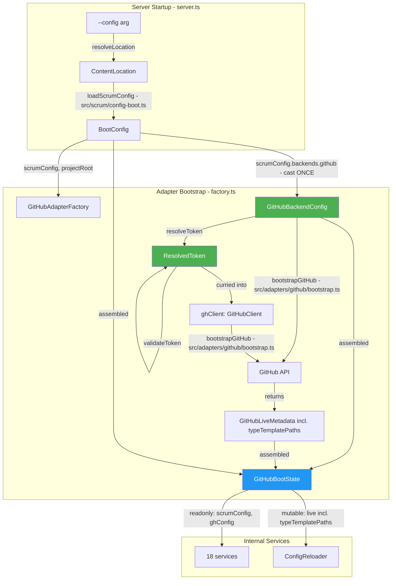

# Config Loading Refactoring Plan — v3 (TypeScript-First)

## Problem Statement

The Scrum Master MCP Toolkit boots by reading a YAML configuration file ([`.github/scrum/config.yml`](.github/scrum/config.yml)) that declares project identity, Scrum taxonomy, quality gates, and per-backend connection parameters. This single file serves two audiences — the agent (via `scrum_orient`) and the server (at startup) — but the code that loads it conflates three distinct concerns into one module, one function, and one return type:

1. **File I/O and YAML parsing** — fetching the config from disk or a URL, validating top-level sections, computing `projectRoot`. This is a server-boot concern, not an adapter concern.

2. **Backend-specific credential resolution** — expanding `$ENV_VAR` references in `backends.github.auth.token`. This is an adapter concern, but it's embedded in a function that also does file I/O.

3. **Live platform metadata bootstrapping** — querying GitHub's GraphQL API for project field IDs, option maps, and iteration schedules. This is adapter-specific and changes during a session, but it shares a return type with the immutable parsed config.

Because these concerns are bundled together, several concrete problems arise:

- **Multi-backend dead-end.** Adding a Notion or Trello adapter would require duplicating the YAML fetch-and-parse logic, because it's owned by the GitHub adapter rather than the server composition root.
- **ConfigReloader re-parses YAML on every reload.** The `reload()` path calls `loadConfig()`, which fetches and parses the entire config file again, even though the YAML never changes during a session. Only the live GitHub field metadata (iterations, option IDs) can change.
- **Hardcoded env var in the HTTP transport.** The `graphql()` and `rest()` functions call `Deno.env.get("GITHUB_TOKEN")` directly, ignoring the env var name declared in the config file (`backends.github.auth.token: $GITHUB_TOKEN`). If a deployment uses `token: $GH_PROJ_TOKEN`, the HTTP client reads the wrong variable.
- **Type-erased adapter boundary.** `ScrumConfig.backends` is typed as `Record<string, unknown>`, forcing every internal service to re-cast `backends.github as GitHubBackendConfig`. Five separate cast sites scatter knowledge of the GitHub config shape across the adapter internals.
- **Mutable and immutable fields undifferentiated.** The flat `RuntimeConfig` type makes no distinction between data set once at boot (`scrumConfig`) and data that `ConfigReloader` mutates in-place (`fields`, `iterations`). Nothing prevents accidental mutation of boot constants.

## Background

The config file lives at `.github/scrum/config.yml` and follows this structure:

```
project:          # identity, agent autonomy, team roster
scrum:            # platform-neutral taxonomy (status, priority, sprint config)
definition_of_*:  # quality gates (agent-facing only)
templates:        # ceremony artifact template paths
ceremony_records: # where the agent writes ceremony docs
backends:         # one section per PM platform; credentials as $ENV_VAR refs
```

The server reads `backends.*` at startup to construct the platform adapter. The agent reads everything else on every `scrum_orient` call. The domain type `ScrumConfig` represents the agent-facing portion; the adapter-facing portion is `GitHubBackendConfig`, which lives in the adapter layer where it belongs.

The current boot flow is:

```
server.ts → resolveLocation(CLI arg) → createBackend() → GitHubAdapterFactory.create()
  → loadConfig()  ← ONE FUNCTION that does everything:
      1. fetchContent(configLocation)     ← use-case utility
      2. parse(yaml) → ScrumConfig
      3. resolveEnvRef(auth.token)        ← adapter concern
      4. graphql(bootstrap query)         ← adapter concern
      5. resolveFieldIds / buildOptionMaps / classifyIterations
  → returns RuntimeConfig (flat bag of all of the above)
  → constructs 18 internal services passing RuntimeConfig
```

## Objectives

This refactoring separates the three concerns (file I/O, credential resolution, live metadata) into distinct modules at the correct architectural layers, with the following goals:

1. **YAML loading happens once, at server startup, in the use-case layer.** A new `loadScrumConfig()` utility fetches and parses the config file. The result is passed to the adapter factory — the adapter never touches the YAML file directly.

2. **The adapter factory casts `backends.github` to `GitHubBackendConfig` exactly once.** Every internal service receives the typed config via constructor injection. The `scrumConfig.backends.github as GitHubBackendConfig` train-wreck cast is eliminated from all five locations.

3. **The auth token is resolved from the env var declared in the config file, not from a hardcoded name.** `Deno.env.get()` for the token happens exactly once, in the factory. The HTTP client functions receive the resolved token as a parameter.

4. **The type system distinguishes resolved tokens from raw strings.** A branded `ResolvedToken` type prevents an unresolved `$VAR` reference from reaching the `Authorization` header.

5. **Mutable live metadata is separated from immutable boot constants.** `GitHubBootState` splits into `readonly` fields (`scrumConfig`, `ghConfig`, `typeTemplatePaths`) and a mutable `live` block (`fields`, `options`, `iterations`) that `ConfigReloader` patches in-place.

6. **ConfigReloader stops re-parsing YAML.** The `reload()` path calls a narrow `bootstrapGitHub()` that only re-fetches live field metadata from the GitHub API.

7. **Backend-specific display maps are removed from the domain type.** `status_display` and `priority_display` belong on `GitHubBackendConfig` in the adapter layer, not on `ScrumConfig` in the domain layer.

---

## Audit Summary

An anti-pattern scan (per `typescript-engineering/references/anti-patterns.md`) across the config loading surface reveals six distinct smells:

| Code    | Smell                                         | Location                                                                                                                                                                                                                                                                                                                  | Severity |
| ------- | --------------------------------------------- | ------------------------------------------------------------------------------------------------------------------------------------------------------------------------------------------------------------------------------------------------------------------------------------------------------------------------- | -------- |
| **A7**  | Shared mutable global state                   | [`getToken()` reads `Deno.env.get("GITHUB_TOKEN")` directly](src/adapters/github/internal/http-client.ts:46) — ignores the env var name in config                                                                                                                                                                         | 🔴       |
| **T1**  | `unknown`-erased core boundary                | [`AdapterBackend = Record<SupportedBackend, unknown>`](src/domain/types.ts:413) forces 5+ cast sites scattered across services                                                                                                                                                                                            | 🔴       |
| **A9**  | Layer leakage — backend fields on domain type | [`ScrumConfig.status_display`](src/domain/config.ts:119) and [`priority_display`](src/domain/config.ts:121) duplicate backend-specific fields                                                                                                                                                                             | 🟡       |
| **P5**  | Train wreck (Law of Demeter)                  | `this.config.scrumConfig.backends.github as GitHubBackendConfig` at [pagination.ts:251](src/adapters/github/internal/pagination.ts:251), [story-query-service.ts:388](src/adapters/github/internal/story-query-service.ts:388), [board-health-service.ts:43,164](src/adapters/github/internal/board-health-service.ts:43) | 🟡       |
| **T5**  | Primitive obsession — auth token as `string`  | Resolved and unresolved tokens are identical types — nothing prevents passing `$GITHUB_TOKEN` literal as a bearer token                                                                                                                                                                                                   | 🟡       |
| **T12** | Missing `readonly` on immutable fields        | `RuntimeConfig.scrumConfig` is never reassigned but not marked `readonly`                                                                                                                                                                                                                                                 | 🟢       |

Co-occurrence: T1 (`unknown`-erased backends) causes P5 (train-wreck casts) and contributes to A9 (display maps leak to domain). Fixing the boundary cast location makes the train wrecks and layer leak self-evident.

> **Note — unlisted 6th cast site:** [`factory.ts:52`](src/adapters/github/factory.ts:52) contains `const gh = config.scrumConfig.backends.github as GitHubBackendConfig` immediately after calling `loadConfig()`. This is the cast that Phase 2 promotes to the _intended_ single-point-of-cast. It must be explicitly tracked alongside the five service-level casts because it is the origin of `gh` that then gets passed into services — after Phase 1 removes `loadConfig()` from the factory, this line moves to read from `options.scrumConfig.backends.github` instead.

---

## Core Design Principle

The [`backends.github`](.github/scrum/config.yml:150) shape in `config.yml` IS the contract. The upper layers promise the adapter it will receive that exact shape. The problem is not the contract — it's that (a) the type system erases it to `unknown`, forcing every service to re-cast, and (b) the adapter layer owns YAML I/O that belongs at server startup.

The fix: **single-point-of-cast at the factory boundary**, not type erasure across the codebase.

---

## On File Naming and Layer Placement

`src/adapters/github/config-loader.ts` is a misleading name for what the file currently does. Only the first ~30 lines of `loadConfig()` actually load config (the `fetchContent` + `parse` + section-validation block). The rest — `resolveEnvRef`, the GraphQL bootstrap query, `resolveFieldIds`, `buildOptionMaps`, `classifyIterations` — is fetching live runtime state from a remote API. "Config loader" describes none of that.

The layer placement is also wrong. `config-loader.ts` lives in `src/adapters/github/` but imports `fetchContent` from `src/scrum/fetch-location.ts`, a use-case utility. An adapter importing upward into the use-case layer inverts the intended dependency direction: the use-case layer should be unaware of adapters, not the other way around.

**After this refactoring:**

- `src/scrum/config-boot.ts` — new use-case file, single responsibility: `ContentLocation → BootConfig`. This is the only place in the codebase that turns a raw config location into a parsed `ScrumConfig`. Centralising it here ensures that a future Notion or Trello adapter does not need to re-implement YAML fetch-and-parse; it calls `loadScrumConfig()` from the same place GitHub does.
- `src/adapters/github/config-loader.ts` → renamed to `src/adapters/github/bootstrap.ts` — but this rename is only honest _after_ Phase 1 extracts the YAML I/O. Renaming without splitting would just move the dishonesty to a new filename. Phases 1 and 4 must be executed together.

---

## Phase 0: Auth Token Injection (addresses A7 + T5)

**Problem**: [`getToken()`](src/adapters/github/internal/http-client.ts:46) hardcodes `GITHUB_TOKEN`. If the config declares `token: $GH_PROJ_TOKEN`, the HTTP client reads the wrong variable. Additionally, a plain `string` token could be an unresolved `$VAR` reference — nothing prevents it from reaching the HTTP `Authorization` header.

### 0.1 Brand resolved vs. unresolved tokens

```typescript
// New in src/adapters/github/types.ts

/** A token value that has been resolved from its environment variable.
 * Never a "$VAR" reference — always a literal bearer token. */
export type ResolvedToken = string & { readonly _brand: "ResolvedToken" };

/** Resolve a raw auth.token value — resolves "$VAR" refs, passes literals through.
 * Called exactly once in the adapter factory.
 *
 * IMPORTANT: throws GitHubApiError (not Error) so the error reaches the same
 * structured error-handling path as all other auth failures in the adapter.
 * Throwing a plain Error here would silently bypass any caller that pattern-matches
 * on GitHubApiError.code === "AUTH_FAILED". */
export const resolveToken = (raw: string, configDesc: string): ResolvedToken => {
  if (!raw.startsWith("$")) return raw as ResolvedToken;
  const varName = raw.slice(1);
  const resolved = Deno.env.get(varName);
  if (!resolved) {
    throw new GitHubApiError(
      `Config error in ${configDesc}: backends.github.auth.token references ` +
        `$${varName} but that environment variable is not set.`,
      {
        code: "AUTH_FAILED",
        recovery:
          `Set the ${varName} environment variable to a fine-grained personal access token ` +
          `generated at https://github.com/settings/tokens with at minimum: ` +
          `Projects (read/write), Issues (read/write), Metadata (read-only).`,
      },
    );
  }
  return resolved as ResolvedToken;
};
```

> **Why `GitHubApiError` and not `Error`:** The existing `getToken()` in `http-client.ts` already throws `GitHubApiError` with `code: "AUTH_FAILED"`. If `resolveToken` throws a plain `Error`, any error-handling middleware or test that pattern-matches on `GitHubApiError.code` will silently miss the auth-missing case after this change. Keeping the same error type maintains the existing error contract.

### 0.2 Change `graphql()` and `rest()` signatures — inject the token

```typescript
// src/adapters/github/internal/http-client.ts

export const graphql = async <T>(
  token: ResolvedToken,
  query: string,
  variables: Record<string, unknown> = {},
): Promise<T> => {/* use `token`, not getToken() */};

export const rest = async <T>(
  token: ResolvedToken,
  path: string,
  options?: {/* ... */},
): Promise<RestResponse<T>> => {/* use `token`, not getToken() */};
```

Update the `GitHubClient` interface to match, then remove `getToken()` entirely. The `Deno.env.get()` call for the token happens exactly once — in the factory, using the env var name from the config file.

### 0.3 Thread the token through the factory

In [`GitHubAdapterFactory.create()`](src/adapters/github/factory.ts:45):

```typescript
const resolvedToken = resolveToken(ghConfig.auth.token, configDesc);
const resolvedGhConfig: GitHubBackendConfig = {
  ...ghConfig,
  auth: { ...ghConfig.auth, token: resolvedToken },
};
```

The `ghClient` passed to services can be curried:

```typescript
const ghClient: GitHubClient = {
  graphql: <T>(q: string, v?: Record<string, unknown>) => graphql<T>(resolvedToken, q, v),
  rest: <T>(p: string, o?: Record<string, unknown>) => rest<T>(resolvedToken, p, o),
};
```

### 0.4 Token syntax validation (HTTP mode)

```typescript
// GitHub token prefixes as of 2024:
//   ghp_       — classic personal access tokens
//   github_pat_ — fine-grained personal access tokens
//   ghs_       — GitHub Apps installation tokens
//
// Note: do NOT use "v1." as a prefix — it is not a real GitHub token format
// and would reject valid ghs_ installation tokens while accepting nothing real.
const TOKEN_SYNTAX = /^(ghp_|github_pat_|ghs_)[A-Za-z0-9_]+$/;

const validateToken = (token: ResolvedToken, configDesc: string): void => {
  if (token.length === 0) {
    throw new GitHubApiError(
      `${configDesc}: backends.github.auth.token resolved to an empty string.`,
      {
        code: "AUTH_FAILED",
        recovery:
          "Check that the environment variable referenced in auth.token is set and non-empty.",
      },
    );
  }
  if (!TOKEN_SYNTAX.test(token)) {
    throw new GitHubApiError(
      `GitHub token syntax validation failed in ${configDesc}. ` +
        `Expected a classic (ghp_...), fine-grained (github_pat_...), ` +
        `or installation (ghs_...) token.`,
      {
        code: "AUTH_FAILED",
        recovery:
          "Check that the env var referenced in backends.github.auth.token contains the correct token. " +
          "Generate a new token at https://github.com/settings/tokens if needed.",
      },
    );
  }
};
```

Called after `resolveToken()` in the factory. Catches: wrong env var name, empty string, token of unexpected format.

> **Regex note:** GitHub has introduced new token formats before and may again. If `validateToken` starts rejecting tokens that work in practice, the regex is outdated — widen it rather than working around it. The empty-string check is the safety-critical one; the prefix check is a best-effort early warning.

---

## Phase 1: Move YAML Loading to Server Startup

**Problem**: [`loadConfig()`](src/adapters/github/config-loader.ts:357) in the adapter layer calls [`fetchContent()`](src/scrum/fetch-location.ts:24) — a use-case utility. A second adapter would duplicate this.

### 1.1 Create `src/scrum/config-boot.ts`

New use-case utility — single responsibility: fetch + parse the YAML config file.

```typescript
// src/scrum/config-boot.ts

import { parse } from "@std/yaml";
import { dirname, resolve } from "@std/path";
import { fetchContent } from "./fetch-location.ts";
import { describeContentLocation } from "../domain/content-location.ts";
import type { ContentLocation } from "../domain/content-location.ts";
import type { ScrumConfig } from "../domain/config.ts";

export interface BootConfig {
  readonly scrumConfig: ScrumConfig;
  readonly projectRoot: string;
}

/**
 * Fetch and parse the scrum config YAML from wherever `configLocation` points.
 *
 * Validates required top-level sections. Does NOT resolve $ENV_VAR references
 * or make any network calls — that is the adapter's responsibility.
 */
export const loadScrumConfig = async (
  configLocation: ContentLocation,
): Promise<BootConfig> => {
  const configDesc = describeContentLocation(configLocation);

  const rawYml = await fetchContent(configLocation);
  const parsed = parse(rawYml) as Record<string, unknown>;

  if (!parsed.project) throw new Error(`${configDesc} is missing required 'project' section.`);
  if (!parsed.scrum) throw new Error(`${configDesc} is missing required 'scrum' section.`);
  if (!parsed.backends) throw new Error(`${configDesc} is missing required 'backends' section.`);

  const scrumConfig = parsed as unknown as ScrumConfig;

  const baseDir: string = (() => {
    switch (configLocation.kind) {
      case "file":
        return dirname(configLocation.path);
      case "url":
        return dirname(configLocation.url.pathname);
      case "inline":
        return Deno.cwd();
    }
  })();

  const projectRoot = scrumConfig.project.projRoot
    ? resolve(baseDir, scrumConfig.project.projRoot)
    : baseDir;

  return { scrumConfig, projectRoot };
};
```

### 1.2 Update `server.ts` — call `loadScrumConfig()` before `createBackend()`

In [`createMcpServer()`](src/server.ts:256):

```typescript
const bootConfig = await loadScrumConfig(configLocation);
const backendResult = await createBackend(factories, {
  configLocation,
  scrumConfig: bootConfig.scrumConfig,
  projectRoot: bootConfig.projectRoot,
});
const { backend, fileReader, typeTemplatePaths } = backendResult;
// scrumConfig comes from bootConfig, not backendResult
```

### 1.3 Update `AdapterStartupOptions`

In [`src/adapters/factory.ts`](src/adapters/factory.ts:18):

```typescript
export interface AdapterStartupOptions {
  readonly configLocation: ContentLocation;
  readonly scrumConfig: ScrumConfig;
  readonly projectRoot: string;
}
```

### 1.4 Remove `scrumConfig` from `BackendResult`

In [`src/adapters/factory.ts`](src/adapters/factory.ts:57):

```typescript
export interface BackendResult {
  readonly backend: ProjectReader & ProjectWriter;
  readonly capabilities: PlatformCapabilities;
  readonly fileReader: FileReaderPort | null;
  readonly typeTemplatePaths: Record<string, ContentLocation>;
  // scrumConfig: REMOVED — caller already has it from loadScrumConfig()
}
```

Update [`server.ts`](src/server.ts:290-291): `registerScrumReadTools` / `registerScrumWriteTools` receive `bootConfig.scrumConfig` instead of `backendResult.scrumConfig`.

> **Phasing constraint — Phases 1, 2, and 3 must ship as a single PR.** Phase 1.4 removes `scrumConfig` from `BackendResult`. Between Phase 1 and Phase 3, `server.ts` reads `scrumConfig` from `bootConfig` while the factory's internal `config.scrumConfig` is no longer surfaced anywhere until `GitHubBootState` is introduced in Phase 3. Any test that reads `backendResult.scrumConfig` will break the moment Phase 1.4 lands. Running Phase 1 alone would leave the codebase in a broken intermediate state. Execute all three phases in sequence within one branch before merging.

---

## Phase 2: Single-Point-of-Cast for Backend Config (addresses T1 + P5 + A9)

**Problem**: `ScrumConfig.backends` is typed `AdapterBackend = Record<SupportedBackend, unknown>`. Every adapter-internal service that needs the GitHub config re-casts it: `config.scrumConfig.backends.github as GitHubBackendConfig`. This is 5+ casts scattered across the codebase. If `GitHubBackendConfig` changes, every cast site silently lies.

**Principle**: The [`backends.github`](.github/scrum/config.yml:150) shape is the contract the upper layers promise to pass. The adapter factory casts it **once** and distributes the typed result to its internal services.

### 2.1 Cast once in the factory, store typed result

In [`GitHubAdapterFactory.create()`](src/adapters/github/factory.ts:45):

```typescript
// Extract the backend config slice — cast happens ONCE here
const ghConfig = options.scrumConfig.backends.github as GitHubBackendConfig;

// Resolve env var refs, producing the final typed config
const resolvedToken = resolveToken(ghConfig.auth.token, configDesc);
const resolvedGhConfig: GitHubBackendConfig = {
  ...ghConfig,
  auth: { ...ghConfig.auth, token: resolvedToken },
};
validateToken(resolvedToken);
```

### 2.2 Pass `ghConfig` directly to services that need it

Currently, services reach into `config.scrumConfig.backends.github` for things like `status_display`, `owner`, `project_number`. After the refactor, `ghConfig` is passed as a separate field on `GitHubBackendDependencies` alongside `config`:

```typescript
// src/adapters/github/backend.ts
export interface GitHubBackendDependencies {
  readonly ghConfig: GitHubBackendConfig; // typed, cast once
  readonly config: GitHubBootState; // live metadata + scrumConfig
  readonly owner: string; // ghConfig.owner (pre-extracted convenience)
  readonly repo: string; // ghConfig.tracked_repos[0]
  // ... rest unchanged
}
```

Then in [`backends.getPlatformState()`](src/adapters/github/backend.ts:129), instead of reading `this.deps.displayConfig`, it reads `this.deps.ghConfig.status_display` directly. The `displayConfig` field on `GitHubBackendDependencies` is removed — it duplicated data already on `ghConfig`.

### 2.3 Eliminate train-wreck casts in services

Every service that currently does:

```typescript
const gh = this.config.scrumConfig.backends.github as GitHubBackendConfig;
```

...instead receives `ghConfig` via constructor injection and accesses it directly. For services that already receive parts of `ghConfig` via constructor arguments (`owner`, `repo`), add the remaining fields they need.

Specific fixes:

| File                                                                                        | Current cast                                                                        | After                                                                      |
| ------------------------------------------------------------------------------------------- | ----------------------------------------------------------------------------------- | -------------------------------------------------------------------------- |
| [`pagination.ts:251`](src/adapters/github/internal/pagination.ts:251)                       | `config.scrumConfig.backends.github as GitHubBackendConfig \| undefined`            | Constructor receives `ghConfig` or `{ owner, project_number, owner_type }` |
| [`story-query-service.ts:388`](src/adapters/github/internal/story-query-service.ts:388)     | `scrumConfig.backends.github as Record<string, unknown>` → extract `status_display` | Constructor receives `ghConfig.status_display`                             |
| [`board-health-service.ts:43,164`](src/adapters/github/internal/board-health-service.ts:43) | Same pattern, twice in same file                                                    | Constructor receives `ghConfig.status_display`                             |

### 2.4 Remove duplicate `status_display` / `priority_display` from `ScrumConfig`

Fields at [`ScrumConfig.status_display`](src/domain/config.ts:119) and [`ScrumConfig.priority_display`](src/domain/config.ts:121) are backend-specific display mappings. The canonical source is [`GitHubBackendConfig.status_display`](src/adapters/github/types.ts:101) and [`GitHubBackendConfig.priority_display`](src/adapters/github/types.ts:103).

**Remove these fields from `ScrumConfig`.** The only consumer is [`config-helpers.ts`](src/scrum/config-helpers.ts:1), which is itself an A9 violation: a use-case layer file (`src/scrum/`) reading backend-specific display config that has no business being in the use-case layer at all. The entire file should move to the adapter layer, not just have its parameter types adjusted.

Steps:

1. Move `src/scrum/config-helpers.ts` → `src/adapters/github/internal/display-helpers.ts`.
2. Update the two functions to accept explicit `GitHubBackendConfig` parameters instead of `ScrumConfig`:
   - `resolveTerminalDisplay(ghConfig: GitHubBackendConfig, statusKeys: string[]): string | undefined`
   - `resolveHighestPriorityDisplay(ghConfig: GitHubBackendConfig, priorityKeys: string[]): string | undefined`
3. Update all callers inside the adapter to import from the new location.
4. Remove `src/scrum/config-helpers.ts` entirely — no use-case layer file should reference backend display mappings.

> **Why move the whole file and not just fix the parameters:** Keeping a function that operates on `GitHubBackendConfig` in `src/scrum/` means the use-case layer still has an implicit dependency on an adapter type. The function belongs with the data it operates on.

---

## Phase 3: Split RuntimeConfig (extract live metadata + readonly contracts)

### 3.1 Define `GitHubLiveMetadata`

Extract the mutable, re-fetchable fields from `RuntimeConfig`:

```typescript
/** Live GitHub project metadata — mutable, patched in-place by ConfigReloader. */
export interface GitHubLiveMetadata {
  projectId: string;
  fields: {
    sprintFieldId: string;
    statusFieldId: string;
    storyPointsFieldId: string | null;
    priorityFieldId: string | null;
    epicFieldId: string | null;
    assigneeFieldId: string | null;
    typeFieldId: string | null;
  };
  statusOptions: Record<string, string>;
  priorityOptions: Record<string, string>;
  typeOptions: Record<string, string>;
  iterations: {
    active: IterationEntry | null;
    next: IterationEntry | null;
    completed: IterationEntry[];
    all: IterationEntry[];
  };
}
```

### 3.2 Restructure `RuntimeConfig` → `GitHubBootState`

```typescript
/** Adapter-internal boot state. Immutable fields (readonly) vs mutable (live).
 * Replaces the old flat RuntimeConfig. */
export interface GitHubBootState {
  readonly scrumConfig: ScrumConfig;
  readonly ghConfig: GitHubBackendConfig;
  live: GitHubLiveMetadata; // mutable — patched in-place by ConfigReloader
}
```

The `readonly` on `scrumConfig` and `ghConfig` is a contract (T12): set once at factory construction and never reassigned.

> **`typeTemplatePaths` belongs in `GitHubLiveMetadata`, not as a `readonly` top-level field.** Template paths are derived from `type_mapping` entries in the config file and are re-resolved on every `ConfigReloader.reload()` call. Marking them `readonly` at the `GitHubBootState` level and then calling `Object.assign` on them in `ConfigReloader` (as the previous draft proposed) directly contradicts the `readonly` contract — TypeScript allows this at runtime because `readonly` only prevents reference reassignment, not object mutation, but it makes the code lie about its intent. The correct fix is to keep `typeTemplatePaths` inside `GitHubLiveMetadata` so its mutability is explicit and matches the reload path.
>
> Update `GitHubLiveMetadata` accordingly:
>
> ```typescript
> export interface GitHubLiveMetadata {
>   projectId: string;
>   fields: { ... };
>   statusOptions: Record<string, string>;
>   priorityOptions: Record<string, string>;
>   typeOptions: Record<string, string>;
>   typeTemplatePaths: Record<string, ContentLocation>; // re-resolved on reload
>   iterations: { ... };
> }
> ```
>
> Update `bootstrapGitHub()` return type to include `typeTemplatePaths` inside `live` rather than as a separate top-level return value. Update `BackendResult` in `src/adapters/factory.ts` to read `typeTemplatePaths` from `bootState.live.typeTemplatePaths` instead of a separate field.

### 3.3 Split `loadConfig()` → `bootstrapGitHub()`

In the renamed [`bootstrap.ts`](src/adapters/github/config-loader.ts) (Phase 4 renaming):

```typescript
/**
 * Bootstrap live GitHub project field metadata.
 * Called at startup and on each ConfigReloader.reload().
 * Does NOT fetch or parse YAML — receives the already-typed ghConfig.
 * Does NOT resolve env vars — token is already a ResolvedToken.
 */
export const bootstrapGitHub = async (params: {
  ghConfig: GitHubBackendConfig;
  github: GitHubClient;
  projectRoot: string;
}): Promise<GitHubLiveMetadata>;
```

The return type is now `GitHubLiveMetadata` directly (which includes `typeTemplatePaths` — see §3.2). No separate `typeTemplatePaths` field on the return value.

No [`fetchContent()`](src/scrum/fetch-location.ts:24) call. No YAML parsing. No env var resolution (already done in factory Phase 0). Only: GraphQL field bootstrap + field ID resolution + option map construction + iteration classification + template path resolution.

Remove [`resolveEnvRef()`](src/adapters/github/config-loader.ts:86) — it moves to the factory (Phase 0).

### 3.4 Update 18 internal consumer files

Mechanical change: `config.fields.*` → `config.live.fields.*`. Same for `statusOptions`, `priorityOptions`, `typeOptions`, `iterations`, `projectId`.

Files:

- [`backend.ts`](src/adapters/github/backend.ts), [`mappers.ts`](src/adapters/github/mappers.ts)
- [`config-reloader.ts`](src/adapters/github/internal/config-reloader.ts)
- [`vocabulary-manager.ts`](src/adapters/github/internal/vocabulary-manager.ts)
- [`label-resolver.ts`](src/adapters/github/internal/label-resolver.ts)
- [`story-query-service.ts`](src/adapters/github/internal/story-query-service.ts)
- [`analytics-service.ts`](src/adapters/github/internal/analytics-service.ts)
- [`board-health-service.ts`](src/adapters/github/internal/board-health-service.ts)
- [`burndown-calculator.ts`](src/adapters/github/internal/burndown-calculator.ts)
- [`sprint-history-service.ts`](src/adapters/github/internal/sprint-history-service.ts)
- [`field-value-mutator.ts`](src/adapters/github/internal/field-value-mutator.ts)
- [`story-mutation-service.ts`](src/adapters/github/internal/story-mutation-service.ts)
- [`impediment-service.ts`](src/adapters/github/internal/impediment-service.ts)
- [`pagination.ts`](src/adapters/github/internal/pagination.ts)
- [`resolver.ts`](src/adapters/github/internal/resolver.ts)
- [`_test_utils.ts`](src/adapters/github/internal/_test_utils.ts) — `makeConfig()` → `makeBootState()`
- [`story-mutation-service.test.ts`](src/adapters/github/internal/story-mutation-service.test.ts)

### 3.5 Update `ConfigReloader` — stop re-parsing YAML

[`ConfigReloader.reload()`](src/adapters/github/internal/config-reloader.ts:20) currently calls `loadConfig()` which fetches + parses the YAML file. After the split:

```typescript
async reload(): Promise<void> {
  const freshLive = await bootstrapGitHub({
    ghConfig: this.ghConfig,
    github: this.github,
    projectRoot: this.projectRoot,
  });
  Object.assign(this.bootState.live, freshLive);
}
```

`ConfigReloader` now receives `ghConfig`, `bootState`, and `projectRoot` at construction — no more YAML I/O.

> **No separate `typeTemplatePaths` assignment needed:** Because `typeTemplatePaths` is now a field inside `GitHubLiveMetadata` (§3.2), `Object.assign(this.bootState.live, freshLive)` replaces it atomically along with all other live fields. The previous draft's conditional `Object.assign` on a separate `typeTemplatePaths` property is removed — it was both a correctness risk (mutating a field declared `readonly`) and unnecessary complexity.

---

## Phase 4: Rename for Clarity

| Current                                   | New                                               | Rationale                                                                            |
| ----------------------------------------- | ------------------------------------------------- | ------------------------------------------------------------------------------------ |
| `RuntimeConfig`                           | `GitHubBootState`                                 | Boot-time resolved adapter state, not "runtime configuration"                        |
| `config-loader.ts`                        | `bootstrap.ts`                                    | Rename only after Phase 1 extracts YAML I/O — renaming first would be dishonest      |
| `loadConfig()`                            | `bootstrapGitHub()`                               | Describes what it actually does after the split                                      |
| `src/scrum/config-helpers.ts`             | `src/adapters/github/internal/display-helpers.ts` | A9 violation — use-case layer file operating on adapter types; move to adapter layer |
| `ScrumConfig.status_display`              | Removed                                           | Backend-specific; canonical source is `GitHubBackendConfig.status_display`           |
| `ScrumConfig.priority_display`            | Removed                                           | Same                                                                                 |
| `GitHubBackendDependencies.displayConfig` | Removed                                           | Services read `ghConfig.status_display` / `ghConfig.priority_display` directly       |
| `getToken()`                              | Removed                                           | Replaced by `resolveToken()` in factory + token injection                            |
| `GitHubBootState.typeTemplatePaths`       | Moved into `GitHubLiveMetadata.typeTemplatePaths` | Mutable on reload; must not be declared `readonly` at the `GitHubBootState` level    |

---

## Data Flow (After Refactor)



**Key invariants after refactor:**

- No adapter service calls `Deno.env.get()`. The token is resolved once at the factory boundary from the env var name declared in the config file.
- No use-case layer file imports adapter types. `src/scrum/config-helpers.ts` is deleted; its functions live in `src/adapters/github/internal/display-helpers.ts`.
- `config-loader.ts` is renamed `bootstrap.ts` only after YAML I/O is extracted. The rename and the extraction land in the same PR.
- `typeTemplatePaths` is mutable (`live`) so `ConfigReloader.reload()` can replace it in one `Object.assign` without violating a `readonly` contract.

---

## Verification Checklist

Update `_test_utils.ts` (`makeConfig()` → `makeBootState()`) **before** running any tests — it is a shared fixture used by multiple test files and will cause cascading compile errors if left stale.

1. `deno lint` — no new warnings
2. `deno fmt --check` — formatting unchanged
3. `deno task test` — all tests pass
4. `grep -r "getToken\|config-helpers\|status_display\|priority_display\|RuntimeConfig\|config-loader" src/` — should return zero results (all removed or renamed)
5. `grep -r "backends\.github as\|backends\[.github.\] as" src/` — should return zero results (all casts eliminated except the single line in factory.ts)
6. Manual start: `deno run --allow-env --allow-net --allow-read src/server.ts --config .github/scrum/config.yml`
7. Custom env var test: `GH_PROJ_TOKEN=<token> deno run ... --config <config with token: $GH_PROJ_TOKEN>` — should boot successfully and resolve `$GH_PROJ_TOKEN`, not fall back to `GITHUB_TOKEN`
8. Wrong env var test: `WRONG_VAR=<token> deno run ... --config <config with token: $GH_PROJ_TOKEN>` — should throw `GitHubApiError` with `code: "AUTH_FAILED"` and a recovery message naming the missing variable
9. Bad token test: `GH_PROJ_TOKEN=notarealtoken deno run ...` — should fail `validateToken` before any API call with a clear error message
10. ConfigReloader test: verify `reload()` re-fetches live metadata without reading the config file (add a test that asserts `fetchContent` is never called during reload)
