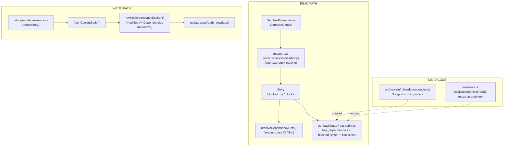
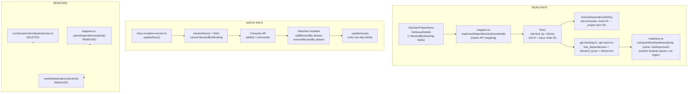

# Issue #108 — Dependency Cleanup & Native API Integration

**Absorbed:** #115 (Delete domain `parseDependencies`), #128 (Fix `hasDependencies` regex in readiness.ts)

## Problem Summary

- [`src/domain/rules/dependencies.ts`](src/domain/rules/dependencies.ts) is entirely dead code (0 importers). All three exports (`parseDependencies`, `hasDependencySection`, `generateDependencySection`) are unused.
- The adapter layer has its own `parseDependencies()` in [`src/adapters/github/mappers.ts:43`](src/adapters/github/mappers.ts:43) that returns `{blocked_by, blocks}` (directional) — structurally incompatible with the domain version (flat list).
- Dependency detection relies on body-text regex parsing, but GitHub's native [issue dependency feature](https://docs.github.com/en/issues/tracking-your-work-with-issues/using-issues/creating-issue-dependencies) provides first-class `blockedBy`/`blocking` GraphQL fields and `addBlockedBy`/`removeBlockedBy` mutations.
- [`src/domain/rules/readiness.ts:29-30`](src/domain/rules/readiness.ts:29) uses a body-text regex for `hasDependencies`, which should use the structured data.

## Current Architecture (BEFORE)



## Target Architecture (AFTER)



## Implementation Steps

### Step 1: Operations.graphql — Add dependency fields to existing queries

**File:** [`src/adapters/github/operations.graphql`](src/adapters/github/operations.graphql)

**1a. Add `blockedBy`/`blocking` to the `ItemContent` fragment** (for bulk `GetUserProjectItems`/`GetOrgProjectItems` queries):

Inside the existing `... on Issue { ... }` block, add:

```graphql
blockedBy(first: 10) { nodes { id number title } }
blocking(first: 10) { nodes { id number title } }
```

**1b. Add `blockedBy`/`blocking` to `GetIssueDetails`** (for detail enrichment):

Add to the `... on Issue { ... }` block:

```graphql
blockedBy(first: 50) { nodes { id number title } }
blocking(first: 50) { nodes { id number title } }
```

Zero additional `gh.graphql` calls — these fields are folded into existing queries.

**1c. Add `blockedBy`/`blocking` to `GetIssue`** (optional, for agent diagnostic queries):

```graphql
blockedBy(first: 10) { nodes { id number title } }
blocking(first: 10) { nodes { id number title } }
```

### Step 2: Adapter types — Update content projection types

**File:** [`src/adapters/github/types.ts`](src/adapters/github/types.ts)

Update `ProjectItemIssueContent` to include dependency connection types. Add fields matching the GraphQL response shape:

```typescript
export interface ProjectItemIssueContent
  extends Required<Pick<GH.Issue, "id" | "number" | "title" | "body" | "url">> {
  __typename: "Issue";
  // ... existing fields ...
  blockedBy?: { nodes: Array<{ id: string; number: number; title: string }> };
  blocking?: { nodes: Array<{ id: string; number: number; title: string }> };
}
```

Also update the `IssueDetailsInput` interface in [`src/adapters/github/mappers.ts`](src/adapters/github/mappers.ts) (the local type at line ~70) to include:

```typescript
blockedBy?: { nodes: Array<{ id: string; number: number; title: string }> };
blocking?: { nodes: Array<{ id: string; number: number; title: string }> };
```

### Step 3: Mappers.ts — Replace body-text parsing with native API mapping

**File:** [`src/adapters/github/mappers.ts`](src/adapters/github/mappers.ts)

**3a. Add new mapper function:**

```typescript
/** Map Issue.blockedBy/blocking connections to DependencyEntry arrays. */
const mapIssueDependencies = (
  issueNode: {
    blockedBy?: { nodes: Array<{ id: string; number: number; title: string }> };
    blocking?: { nodes: Array<{ id: string; number: number; title: string }> };
  },
): { blocked_by: DependencyEntry[]; blocks: DependencyEntry[] } => {
  const toEntry = (n: { id: string; number: number; title: string }): DependencyEntry => ({
    key: String(n.number),
    title: n.title,
    ref: { id: n.id }, // issue node ID — resolveDependencyRefs() maps to project item IDs
  });
  return {
    blocked_by: (issueNode.blockedBy?.nodes ?? []).map(toEntry),
    blocks: (issueNode.blocking?.nodes ?? []).map(toEntry),
  };
};
```

**3b. Replace `parseDependencies(body)` calls:**

In `buildStoryFromRaw()` (line ~186): Replace `parseDependencies(content.body)` with `mapIssueDependencies(content)`. Since `content` already has `__typename === "Issue"`, the new fields are available when included in the GraphQL query.

In `buildEnrichedStory()` (line ~225): Replace `parseDependencies(issueNode.body ?? "")` with `mapIssueDependencies(issueNode)`.

**3c. Remove old code:**

- Delete the private `parseDependencies()` function (lines 43-66)
- Delete `BLOCKED_BY_LINE_RE` / `BLOCKS_LINE_RE` (not in mappers.ts — these are in story-mutation-service.ts, handled in Step 5)

**3d. Update `resolveDependencyRefs()`:**

Since `mapIssueDependencies` now stores the issue node ID in `ref.id` (not null and not a project item ID), `resolveDependencyRefs` needs a new lookup: issue node ID → project item ID. Currently it maps issue number string → project item ID. Update to also map issue node ID → project item ID when building from `content.id`:

```typescript
// Build both lookups: issue number → project item ID, and issue node ID → project item ID
const keyToId = new Map<string, string>();
const issueIdToItemId = new Map<string, string>();
for (const item of allItems) {
  const content = item.content;
  if (!content || content.__typename === "DraftIssue") continue;
  const issueKey = String(content.number);
  if (issueKey && item.id) {
    keyToId.set(issueKey, item.id);
    issueIdToItemId.set(content.id, item.id);
  }
}

const resolve = (entries: DependencyEntry[]): DependencyEntry[] =>
  entries.map((e) => {
    if (e.ref.id !== null && issueIdToItemId.has(e.ref.id)) {
      return { ...e, ref: { id: issueIdToItemId.get(e.ref.id)! } };
    }
    if (e.ref.id === null && keyToId.has(e.key)) {
      return { ...e, ref: { id: keyToId.get(e.key)! } };
    }
    return e;
  });
```

### Step 4: Domain layer — Delete dead code, fix readiness

**4a. Delete [`src/domain/rules/dependencies.ts`](src/domain/rules/dependencies.ts)** entirely.

Verified: zero importers via search. All three exports (`parseDependencies`, `hasDependencySection`, `generateDependencySection`) are dead.

**4b. Fix [`src/domain/rules/readiness.ts`](src/domain/rules/readiness.ts):**

Replace the regex-based `hasDependencies` function with an explicit boolean parameter:

```typescript
// BEFORE (DELETE):
const hasDependencies = (body: string): boolean =>
  /(?:Depends\s+on|Blocked\s+by|Related\s+to|Blocks)\s+#\d+/i.test(body);

// AFTER: Remove hasDependencies, update computeStoryReadiness signature:
const computeStoryReadiness = (
  body: string,
  storyPoints: number | null,
  hasDependencies: boolean, // NEW parameter
): ReadinessLevel => {
  const criteria = [
    hasUserStoryFormat(body),
    hasAcceptanceCriteria(body),
    (storyPoints ?? 0) > 0,
    hasDependencies, // was: hasDependencies(body)
  ];
  // ... rest unchanged
};
```

Update `computeReadinessSummary` signature and callers:

```typescript
export const computeReadinessSummary = (
  stories: Array<{ body: string; story_points: number | null; has_dependencies: boolean }>,
): { ready: number; partially_ready: number; not_ready: number } => {
  // ...
  const readiness = computeStoryReadiness(story.body, story.story_points, story.has_dependencies);
  // ...
};
```

**4c. Update callers:**

In [`src/scrum/get-backlog.ts:93-95`](src/scrum/get-backlog.ts:93), pass `has_dependencies`:

```typescript
const readinessSummary = computeReadinessSummary(
  limitedStories.map((s) => ({
    body: s.body,
    story_points: s.story_points,
    has_dependencies: s.blocked_by.length > 0 || s.blocks.length > 0,
  })),
);
```

### Step 5: Story mutation service — Replace body-text manipulation with native mutations

**File:** [`src/adapters/github/internal/story-mutation-service.ts`](src/adapters/github/internal/story-mutation-service.ts)

**5a. Add batched dependency mutation method:**

New private method `_applyDependencyMutations`:

```typescript
/**
 * Apply dependency changes using native addBlockedBy/removeBlockedBy mutations.
 * Computes diff between current and desired state, then executes all changes
 * in a single batched GraphQL call using aliases.
 */
private async _applyDependencyChanges(
  issueId: string,
  blockedBy: StoryRef[] | null | undefined,
  blocks: StoryRef[] | null | undefined,
): Promise<void> {
  if (blockedBy === undefined && blocks === undefined) return;

  // Fetch current dependencies
  const current = await this.gh.graphql<{
    node?: { blockedBy?: { nodes: Array<{ id: string }> };
              blocking?: { nodes: Array<{ id: string }> } } | null;
  }>(
    `query($issueId: ID!) {
      node(id: $issueId) {
        ... on Issue {
          blockedBy(first: 50) { nodes { id } }
          blocking(first: 50) { nodes { id } }
        }
      }
    }`,
    { issueId },
  );
  const currentBlockedByIds = new Set(
    (current.node?.blockedBy?.nodes ?? []).map(n => n.id)
  );
  const currentBlockingIds = new Set(
    (current.node?.blocking?.nodes ?? []).map(n => n.id)
  );

  // Resolve desired refs to issue node IDs (handle null clears, undefined preserves)
  const desiredBlockedByIds: Set<string> | undefined = blockedBy === null
    ? new Set()
    : blockedBy?.length
    ? new Set(await this._resolveRefsToIssueIds(blockedBy))
    : undefined;
  const desiredBlockingIds: Set<string> | undefined = blocks === null
    ? new Set()
    : blocks?.length
    ? new Set(await this._resolveRefsToIssueIds(blocks))
    : undefined;

  // Build batched mutation with aliases
  const adds: Array<{ alias: string; blockedById: string }> = [];
  const removes: Array<{ alias: string; blockedById: string }> = [];

  if (desiredBlockedByIds !== undefined) {
    for (const id of desiredBlockedByIds) {
      if (!currentBlockedByIds.has(id)) adds.push({ alias: `addBb${id.slice(-8)}`, blockedById: id });
    }
    for (const id of currentBlockedByIds) {
      if (!desiredBlockedByIds.has(id)) removes.push({ alias: `rmBb${id.slice(-8)}`, blockedById: id });
    }
  }
  if (desiredBlockingIds !== undefined) {
    for (const id of desiredBlockingIds) {
      if (!currentBlockingIds.has(id)) adds.push({ alias: `addBl${id.slice(-8)}`, blockedById: id });
    }
    for (const id of currentBlockingIds) {
      if (!desiredBlockingIds.has(id)) removes.push({ alias: `rmBl${id.slice(-8)}`, blockedById: id });
    }
  }

  if (adds.length === 0 && removes.length === 0) return;

  const mutationParts: string[] = [];
  const variables: Record<string, unknown> = {};

  for (const a of adds) {
    const varName = `bid_${a.alias}`;
    mutationParts.push(
      `${a.alias}: addBlockedBy(input: { subjectId: $subjectId, blockedById: $${varName} }) { clientMutationId }`
    );
    variables[varName] = a.blockedById;
  }
  for (const r of removes) {
    const varName = `bid_${r.alias}`;
    mutationParts.push(
      `${r.alias}: removeBlockedBy(input: { subjectId: $subjectId, blockedById: $${varName} }) { clientMutationId }`
    );
    variables[varName] = r.blockedById;
  }

  variables["subjectId"] = issueId;
  await this.gh.graphql(
    `mutation($subjectId: ID!, ${Object.keys(variables).filter(k => k !== "subjectId").map(k => `$${k}: ID!`).join(", ")}) {
      ${mutationParts.join("\n")}
    }`,
    variables,
  );
}

/** Resolve an array of StoryRefs to their issue node IDs in parallel. */
private async _resolveRefsToIssueIds(refs: StoryRef[]): Promise<string[]> {
  const results = await Promise.all(refs.map(ref => resolveStory(ref, this.gh)));
  return results.map(r => {
    if (!r.issueId) throw new GitHubApiError(
      `Cannot resolve dependency: story ${r.itemId} is a Draft Issue.`,
      { code: "RESOLUTION_FAILED", recovery: "Use a real Issue for dependencies." }
    );
    return r.issueId;
  });
}
```

**5b. Update `updateStory()` to use native mutations:**

In the existing `updateStory()` method, replace the dependency handling block:

```typescript
// REPLACE this block:
if (updates.blocked_by !== undefined || updates.blocks !== undefined) {
  const updatedBody = await this._buildDependencyBody(updates, issueId);
  updates = { ...updates, body: updatedBody };
}

// WITH:
if (updates.blocked_by !== undefined || updates.blocks !== undefined) {
  await this._applyDependencyChanges(issueId, updates.blocked_by, updates.blocks);
}
```

**5c. Remove dead code:**

- Delete `BLOCKED_BY_LINE_RE` (line 20)
- Delete `BLOCKS_LINE_RE` (line 21)
- Delete `rewriteDependencySection()` (lines 35-84)
- Delete `_buildDependencyBody()` (lines 268-292)
- Delete `_resolveRefToIssueNumber()` (lines 295-309) — replaced by `_resolveRefsToIssueIds`
- Delete `_fetchCurrentBody()` (lines 312-320) — no longer needed

### Step 6: Update tests

**6a. [`src/adapters/github/internal/story-mutation-service.test.ts`](src/adapters/github/internal/story-mutation-service.test.ts):**

Update dependency-related tests (Group B, lines 653-757):

- "updateStory - rewrites dependency blocked_by section" → now tests batched addBlockedBy mutations instead of body text
- "updateStory - clears blocked_by when null" → tests removeBlockedBy on all current blockedBy
- "updateStory - preserves existing blocked_by when undefined" → tests that no mutation is called when undefined
- "updateStory - rewrites blocks section" → tests addBlockedBy for blocks (blocking direction)
- "updateStory - removes entire Dependencies section when both directions cleared" → tests removeBlockedBy for all
- "updateStory - throws RESOLUTION_FAILED when dependency ref is a Draft Issue" → stays, but error comes from _resolveRefsToIssueIds now

**6b. [`src/scrum/get-sprint.test.ts`](src/scrum/get-sprint.test.ts):**

Tests C2-C4 (lines 430-491) already test `has_dependencies` on the StoryListing projection — these pass fine since the `storyToListing` computation (blocked_by.length > 0 || blocks.length > 0) doesn't change.

**6c. [`src/scrum/get-backlog.test.ts`](src/scrum/get-backlog.test.ts):**

Readiness tests (lines 393-424) need updating for the new `has_dependencies` boolean in the `computeReadinessSummary` input shape.

### Step 7: Verify

- `deno lint` — no errors
- `deno test` — all tests pass
- Search: `rg "from.*dependencies" src/` — no references to deleted file
- Search: `rg "parseDependencies|hasDependencySection|generateDependencySection" src/` — no remaining references to deleted exports (except in test files where they're being updated)
- Search: `rg "rewriteDependency|_buildDependencyBody|_resolveRefToIssueNumber|_fetchCurrentBody" src/` — no remaining references to removed mutation code

## Files Modified Summary

| File                                                          | Change                                                                                                                  |
| ------------------------------------------------------------- | ----------------------------------------------------------------------------------------------------------------------- |
| `src/adapters/github/operations.graphql`                      | Add `blockedBy`/`blocking` to `ItemContent` fragment and `GetIssueDetails` query                                        |
| `src/adapters/github/types.ts`                                | Add dependency connection types to `ProjectItemIssueContent`                                                            |
| `src/adapters/github/mappers.ts`                              | Add `mapIssueDependencies()`, replace `parseDependencies()`, update `resolveDependencyRefs()`, remove body-parsing code |
| `src/domain/rules/dependencies.ts`                            | **DELETE**                                                                                                              |
| `src/domain/rules/readiness.ts`                               | Replace regex `hasDependencies` with explicit boolean parameter                                                         |
| `src/scrum/get-backlog.ts`                                    | Pass `has_dependencies` boolean to readiness summary                                                                    |
| `src/adapters/github/internal/story-mutation-service.ts`      | Add batched native mutation handling, remove body-text rewriting code                                                   |
| `src/adapters/github/internal/story-mutation-service.test.ts` | Update dependency mutation tests                                                                                        |
| `src/scrum/get-backlog.test.ts`                               | Update readiness test fixtures                                                                                          |

## Layer Contract Compliance

- ✅ Domain layer (`src/domain/`) — no new imports from adapter or schema
- ✅ Use-case layer (`src/scrum/`) — depends only on `ports.ts` and `domain/types.ts`
- ✅ Adapter layer (`src/adapters/`) — all GitHub-specific logic stays here
- ✅ No handler imports GraphQL queries, `loadConfig`, or raw GitHub types
