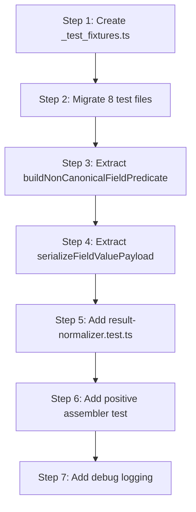

# Implementation Strategy: Issue #187 — Non-Canonical Field Passthrough

**Item:** [#187](https://github.com/hoonsubin/github-projects-mcp-server/issues/187) — Non-canonical project fields silently dropped in `scrum_find_items` **Date:** 2026-06-06 **Status:** In Progress, Sprint 4 · 3 SP · Priority Must · Blocked by #185

---

## 1. Problem Summary

`enrichListingCustomFields()` in [`src/adapters/github/internal/result-normalizer.ts`](src/adapters/github/internal/result-normalizer.ts:34) populates `BacklogItemListing.custom_fields` with non-canonical board field values. Live output for #187 returns only `custom_fields: { "__typename": "Issue" }` — no non-canonical fields surface.

The code logic is structurally correct but **unverifiable by tests** because:

- Fixture data has zero non-canonical fields (all 163 items only carry the 10 canonical field types)
- Filtering, serialization, and enrichment are tangled in one loop — the three concerns untestable in isolation
- No positive test ever asserts that non-canonical fields _appear_; the only assertion checks canonical fields are _absent_

---

## 2. Architecture Constraint

From [`docs/AUDIT.md`](docs/AUDIT.md): All 11 `dependency-cruiser` rules pass; no circular dependencies. `result-normalizer.ts` (I=0.47) and `listing-mappers.ts` (I=0.50) are moderate—stable modules.

All changes stay within `result-normalizer.ts` + test files. **Zero changes to domain types, port interfaces, or use-cases.** Layer contract is preserved: adapter → use-case → domain.

---

## 3. Fixture Consolidation: Single Source of Test Data

### 3.1 Current state

Two live-captured fixture files imported directly by **8 test files**:

| File                    | Size        | Usage                                   |
| ----------------------- | ----------- | --------------------------------------- |
| `project-items-p1.json` | 13.7K lines | Data source for 10 tests across 8 files |
| `project-items-p2.json` | ~13K lines  | Second page for pagination/cache tests  |

The fixture-replay system under `fixture-replay/` does **not** use these files — they serve only the 8 adapter unit tests. These opaque blobs cannot be extended or annotated. No test can seed a custom field value into them without forking the JSON.

### 3.2 Target: `_test_fixtures.ts` module

Create [`src/adapters/github/internal/_test_fixtures.ts`](src/adapters/github/internal/_test_fixtures.ts) as the **single import point** for all 8 test files. Replace the large JSON imports everywhere.

```
_test_fixtures.ts  ←── ONE module imported by all 8 test files
    │
    ├── 3 extracted real fixture nodes (exact JSON from project-items-p1.json)
    │   Each has its complete fieldValues array (all 10 canonical types)
    │
    ├── 2 synthetic non-canonical field entries appended to fixture node #3
    │   ("Deadline" date + "Target Quarter" text) — for positive passthrough tests
    │
    ├── makePageEnvelope(nodes, pageInfo?) → full user.projectV2.items response envelope
    │
    └── Export: FIXTURE_ITEM_222, FIXTURE_ITEM_192, FIXTURE_ITEM_WITH_CUSTOM_FIELDS,
    │            FIXTURE_PAGE_1, FIXTURE_PAGE_2
```

### 3.3 Fixture node selection

Extract 3 representative nodes covering the diversity needed by existing tests:

| Export name        | Issue # | Status      | SP | Priority | Labels                  | Epic                |
| ------------------ | ------- | ----------- | -- | -------- | ----------------------- | ------------------- |
| `FIXTURE_ITEM_222` | 222     | Ready       | 3  | Could    | feature, use case layer | MCP Tool Surface…   |
| `FIXTURE_ITEM_192` | 192     | Backlog     | 5  | Must     | feature, adapter layer  | Clean Architecture… |
| `FIXTURE_ITEM_187` | 187     | In Progress | 3  | Must     | feature, adapter layer  | Adapter Layer…      |

These 3 nodes exercise: 3 statuses, 2 priority tiers, 3 epics, 2 label sets, blocked dependencies (187 has `blocked_by`), and 3 different SP values — sufficient diversity for existing filter/assembler tests.

### 3.4 Non-canonical field augmentation

To `FIXTURE_ITEM_187`, append two synthetic field-value entries:

```json
{
  "__typename": "ProjectV2ItemFieldDateValue",
  "date": "2026-08-15",
  "field": { "id": "PVTF_lAHOAmfLjc4BWiTtzhR1seC", "name": "Deadline" }
},
{
  "__typename": "ProjectV2ItemFieldTextValue",
  "text": "Q3",
  "field": { "id": "PVTF_lAHOAmfLjc4BWiTtzhR1seD", "name": "Target Quarter" }
}
```

These use the **same `__typename`** and field shapes as real GraphQL responses. Export this augmented node as `FIXTURE_ITEM_WITH_CUSTOM_FIELDS`.

### 3.5 Page envelope helper

```typescript
/** Build a full user.projectV2.items GraphQL response envelope from nodes. */
export const makePageEnvelope = (
  nodes: readonly ProjectItem[],
  opts?: { totalCount?: number; hasNextPage?: boolean; endCursor?: string | null },
) => ({
  user: {
    projectV2: {
      id: "PVT_kwHOAmfLjc4BWiTt",
      items: {
        totalCount: opts?.totalCount ?? nodes.length,
        pageInfo: {
          hasNextPage: opts?.hasNextPage ?? false,
          endCursor: opts?.endCursor ?? null,
        },
        nodes,
      },
    },
  },
});
```

### 3.6 Migration of 8 test files

Each test replaces its two JSON imports with a single import from `_test_fixtures.ts`. Affected files:

| Test file                                | Current import                     | New import                                                           |
| ---------------------------------------- | ---------------------------------- | -------------------------------------------------------------------- |
| `pagination.test.ts`                     | `p1Fixture`, `p2Fixture`           | `FIXTURE_PAGE_1`, `FIXTURE_PAGE_2`                                   |
| `project-items-cache.test.ts`            | `p1Fixture`, `p2Fixture`           | `FIXTURE_PAGE_1`, `FIXTURE_PAGE_2`                                   |
| `item-filter.test.ts`                    | `projectItemsP1`, `projectItemsP2` | `FIXTURE_NODES` (all three)                                          |
| `story-query-service.test.ts`            | `projectItemsP1`, `projectItemsP2` | `FIXTURE_NODES`                                                      |
| `project-items-assembler.test.ts`        | `p1Fixture`, `p2Fixture`           | `FIXTURE_PAGE_1`, `FIXTURE_PAGE_2`                                   |
| `search-api-assembler.test.ts`           | `p1Fixture`, `p2Fixture`           | `FIXTURE_PAGE_1`, `FIXTURE_PAGE_2`                                   |
| `assembler-pipeline.integration.test.ts` | `p1Fixture`, `p2Fixture`           | `FIXTURE_PAGE_1`, `FIXTURE_PAGE_2`                                   |
| `direct-lookup-assembler.test.ts`        | `p1Fixture`                        | `FIXTURE_ITEM_222` + `makePageEnvelope` for the projectItems wrapper |

After migration, the two large JSON files (`project-items-p1.json`, `project-items-p2.json`) remain in `generated/__fixtures__/` — they are generated by `deno task capture-fixtures` and should not be deleted (the capture scripts may reference them). They simply stop being imported by unit tests.

---

## 4. Function Semantic Analysis

### 4.1 Current structure

`enrichListingCustomFields()` tangles three concerns in one loop:

| # | Concern                                  | Lines  | Semantic           |
| - | ---------------------------------------- | ------ | ------------------ |
| 1 | Copy seed + attach `__typename`          | 39–45  | Identity marker    |
| 2 | Build canonical field ID set from config | 47–58  | Exclusion domain   |
| 3 | Iterate + filter by ID and name          | 60–63  | Gate decision      |
| 4 | Serialize field-type → JSON              | 65–86  | Payload extraction |
| 5 | Merge into `custom_fields`               | 66, 89 | Assignment         |

### 4.2 Target structure

```typescript
// 1. Pure: is this field non-canonical?
const isNonCanonical = buildNonCanonicalFieldPredicate(config);
//    returns (fv: ItemFieldValue) => boolean

// 2. Pure: extract payload from a field value node
const payload = serializeFieldValuePayload(fv);
//    returns Record<string, unknown> — only populated keys

// 3. Orchestrator: apply filter + serialize + merge
for (const fv of item.fieldValues.nodes) {
  if (!isNonCanonical(fv)) continue;
  customFields[fv.field.name] = JSON.stringify(serializeFieldValuePayload(fv));
}
```

---

## 5. Implementation Steps

### Step 1: Create `_test_fixtures.ts` — consolidated fixture module

**New file:** [`src/adapters/github/internal/_test_fixtures.ts`](src/adapters/github/internal/_test_fixtures.ts)

Copy 3 real fixture nodes verbatim from `project-items-p1.json` (lines 12–157 for #222, similar ranges for #192 and #187). For #187, append the two non-canonical field entries from §3.4 above. Export:

```typescript
import type { ProjectItem } from "../types.ts";

/** Real fixture: Issue #222 — Ready, 3 SP, Could, MCP Tool Surface epic */
export const FIXTURE_ITEM_222: ProjectItem = { /* ... exact JSON copy ... */ };

/** Real fixture: Issue #192 — Backlog, 5 SP, Must, Clean Architecture epic */
export const FIXTURE_ITEM_192: ProjectItem = { /* ... exact JSON copy ... */ };

/** Real fixture: Issue #187 with 2 non-canonical fields appended */
export const FIXTURE_ITEM_WITH_CUSTOM_FIELDS: ProjectItem = { /* ... */ };

/** All three nodes as an array — for tests that need diverse items */
export const FIXTURE_NODES: readonly ProjectItem[] = [
  FIXTURE_ITEM_222, FIXTURE_ITEM_192, FIXTURE_ITEM_WITH_CUSTOM_FIELDS,
];

/** Pre-built single-page envelope for board-scan tests */
export const FIXTURE_PAGE_1 = makePageEnvelope([FIXTURE_ITEM_222, FIXTURE_ITEM_192]);

/** Pre-built single-page envelope for two-page pagination tests */
export const FIXTURE_PAGE_2 = makePageEnvelope([FIXTURE_ITEM_WITH_CUSTOM_FIELDS]);

export const makePageEnvelope = ( /* ... see §3.5 ... */ );
```

**Regression safety:** The extracted nodes are byte-for-byte copies of the JSON. `buildStoryFromRaw()` and the full pipeline produce identical results. Verified by running `deno test` after consolidation.

---

### Step 2: Migrate 8 test files to `_test_fixtures.ts`

Replace imports in each test file:

**Before** (example from `pagination.test.ts`):

```typescript
import p1Fixture from "../generated/__fixtures__/project-items-p1.json" with { type: "json" };
import p2Fixture from "../generated/__fixtures__/project-items-p2.json" with { type: "json" };

const P1_NODES = (p1Fixture as { user: { projectV2: { items: { nodes: unknown[] } } } })
  .user.projectV2.items.nodes;
const P2_NODES = (p2Fixture as { user: { projectV2: { items: { nodes: unknown[] } } } })
  .user.projectV2.items.nodes;
const FIXTURE_TOTAL = P1_NODES.length + P2_NODES.length;
```

**After:**

```typescript
import { FIXTURE_PAGE_1, FIXTURE_PAGE_2 } from "../_test_fixtures.ts";
// P1_NODES / P2_NODES become FIXTURE_PAGE_1.user.projectV2.items.nodes etc.
// FIXTURE_TOTAL becomes the sum of the two pages' node counts.
```

**For test files that used counts derived from the full fixtures** (e.g., `item-filter.test.ts` with 163+ items), adjust test expectations to the new smaller counts. The tests that asserted "at least one ISSUE item" or "items.length > 0" remain valid with 3 nodes.

**direct-lookup-assembler.test.ts** is the only file with special needs — it requires a `GetIssueProjectItem` response envelope wrapping a single node. Use `makePageEnvelope` to build that inline, referencing `FIXTURE_ITEM_222` for the node.

---

### Step 3: Extract `buildNonCanonicalFieldPredicate`

**File:** [`src/adapters/github/internal/result-normalizer.ts`](src/adapters/github/internal/result-normalizer.ts)

Extract the canonical-field exclusion logic (lines 47–58, 62–63) as a pure, exported function. The loop in `enrichListingCustomFields` becomes:

```typescript
const isNonCanonical = buildNonCanonicalFieldPredicate(config);

for (const fv of item.fieldValues.nodes) {
  if (!isNonCanonical(fv)) continue;
  customFields[fv.field.name] = JSON.stringify(serializeFieldValuePayload(fv));
}
```

**New function:**

```typescript
export const buildNonCanonicalFieldPredicate = (
  config: GitHubBootState,
): (fv: ItemFieldValue) => boolean => {
  const { fields, typeResolution } = config.live;
  const canonicalIds = new Set<string>(
    [
      fields.statusFieldId,
      fields.sprintFieldId,
      fields.storyPointsFieldId,
      fields.priorityFieldId,
      fields.epicFieldId,
      fields.assigneeFieldId,
      typeResolution.source === "board_field" ? typeResolution.fieldId : null,
    ].filter((id): id is string => id !== null && id !== ""),
  );

  return (fv: ItemFieldValue): boolean => {
    if (!fv.field?.name) return false;
    if (canonicalIds.has(fv.field.id)) return false;
    if (CANONICAL_FIELD_NAMES.has(fv.field.name)) return false;
    return true;
  };
};
```

**Regression safety:** Zero behavioral change. Identical `Set` construction, same conditions. Existing test `first.custom_fields["Status"] === undefined` continues to pass.

---

### Step 4: Extract `serializeFieldValuePayload`

**File:** [`src/adapters/github/internal/result-normalizer.ts`](src/adapters/github/internal/result-normalizer.ts)

Extract lines 65–86 as a pure, exported function:

```typescript
export const serializeFieldValuePayload = (
  fv: ItemFieldValue,
): Record<string, unknown> => {
  const ifv = fv.issueFieldValue;
  return {
    ...(fv.iterationId !== undefined ? { iterationId: fv.iterationId } : {}),
    ...(fv.title !== undefined ? { title: fv.title } : {}),
    ...(fv.startDate !== undefined ? { startDate: fv.startDate } : {}),
    ...(fv.duration !== undefined ? { duration: fv.duration } : {}),
    ...(fv.text !== undefined ? { text: fv.text } : {}),
    ...(fv.number !== undefined ? { number: fv.number } : {}),
    ...(fv.date !== undefined ? { date: fv.date } : {}),
    ...(fv.name !== undefined ? { name: fv.name } : {}),
    ...(fv.users ? { users: fv.users.nodes.map((u) => u?.login ?? null) } : {}),
    ...(fv.labels ? { labels: fv.labels.nodes.map((l) => ({ name: l?.name ?? "" })) } : {}),
    ...(fv.milestone ? { milestone: { id: fv.milestone.id, title: fv.milestone.title } } : {}),
    ...(fv.repository
      ? { repository: { name: fv.repository.name, nameWithOwner: fv.repository.nameWithOwner } }
      : {}),
    ...(ifv?.name !== undefined ? { name: ifv.name } : {}),
    ...(ifv?.value !== undefined ? { value: ifv.value } : {}),
  };
};
```

**Regression safety:** All spread conditions unchanged. Zero behavioral change.

---

### Step 5: Add `result-normalizer.test.ts` — unit tests for extracted functions

**New file:** `src/adapters/github/internal/result-normalizer.test.ts`

Tests for each extracted function using `FIXTURE_ITEM_WITH_CUSTOM_FIELDS` from `_test_fixtures.ts`:

```typescript
import { assert, assertEquals, assertFalse } from "@std/assert";
import {
  buildNonCanonicalFieldPredicate,
  serializeFieldValuePayload,
} from "./result-normalizer.ts";
import { makeConfig } from "./_test_utils.ts";
import { FIXTURE_ITEM_WITH_CUSTOM_FIELDS } from "./_test_fixtures.ts";

const config = makeConfig();

Deno.test("buildNonCanonicalFieldPredicate — non-canonical date field passes", () => {
  const isNonCanonical = buildNonCanonicalFieldPredicate(config);
  const deadlineFv = FIXTURE_ITEM_WITH_CUSTOM_FIELDS.fieldValues.nodes
    .find((fv) => fv.field?.name === "Deadline");
  assert(deadlineFv);
  assert(isNonCanonical(deadlineFv));
});

Deno.test("buildNonCanonicalFieldPredicate — canonical Status field fails", () => {
  const isNonCanonical = buildNonCanonicalFieldPredicate(config);
  const statusFv = FIXTURE_ITEM_WITH_CUSTOM_FIELDS.fieldValues.nodes
    .find((fv) => fv.field?.name === "Status");
  assert(statusFv);
  assertFalse(isNonCanonical(statusFv));
});

Deno.test("buildNonCanonicalFieldPredicate — canonical Story Points field fails", () => {
  const isNonCanonical = buildNonCanonicalFieldPredicate(config);
  const spFv = FIXTURE_ITEM_WITH_CUSTOM_FIELDS.fieldValues.nodes
    .find((fv) => fv.field?.name === "Story Points");
  assert(spFv);
  assertFalse(isNonCanonical(spFv));
});

Deno.test("serializeFieldValuePayload — date field produces { date }", () => {
  const fv = FIXTURE_ITEM_WITH_CUSTOM_FIELDS.fieldValues.nodes
    .find((fv) => fv.field?.name === "Deadline")!;
  assertEquals(serializeFieldValuePayload(fv), { date: "2026-08-15" });
});

Deno.test("serializeFieldValuePayload — text field produces { text }", () => {
  const fv = FIXTURE_ITEM_WITH_CUSTOM_FIELDS.fieldValues.nodes
    .find((fv) => fv.field?.name === "Target Quarter")!;
  assertEquals(serializeFieldValuePayload(fv), { text: "Q3" });
});

Deno.test("serializeFieldValuePayload — single-select produces { name }", () => {
  const fv = FIXTURE_ITEM_WITH_CUSTOM_FIELDS.fieldValues.nodes
    .find((fv) => fv.field?.name === "Type")!;
  assertEquals(serializeFieldValuePayload(fv), { name: "Bug" });
});

Deno.test("serializeFieldValuePayload — iteration produces { title, startDate, duration, iterationId }", () => {
  const fv = FIXTURE_ITEM_WITH_CUSTOM_FIELDS.fieldValues.nodes
    .find((fv) => fv.field?.name === "Sprint")!;
  const payload = serializeFieldValuePayload(fv);
  assertEquals(payload.title, "Sprint 4");
  assertEquals(payload.iterationId, "07155ad6");
});

Deno.test("serializeFieldValuePayload — number field produces { number }", () => {
  const fv = FIXTURE_ITEM_WITH_CUSTOM_FIELDS.fieldValues.nodes
    .find((fv) => fv.field?.name === "Story Points")!;
  assertEquals(serializeFieldValuePayload(fv), { number: 3 });
});
```

These tests exercise every `__typename` on real fixture shapes. No hand-crafted mock — the test data is the same data the production pipeline processes.

---

### Step 6: Augment assembler test with positive custom_fields assertion

**File:** [`src/adapters/github/internal/assemblers/project-items-assembler.test.ts`](src/adapters/github/internal/assemblers/project-items-assembler.test.ts)

After migrating to `_test_fixtures.ts`, add a new test that seeds the board scan with `FIXTURE_ITEM_WITH_CUSTOM_FIELDS` and asserts the non-canonical fields appear:

```typescript
Deno.test("ProjectItemsAssembler — non-canonical fields appear in custom_fields", async () => {
  const gh = createGhSpy();
  // Single-item page with the augmented fixture node
  gh.enqueue(makePageEnvelope([FIXTURE_ITEM_WITH_CUSTOM_FIELDS]));
  const output = await makeAssembler(gh).assemble(baseFilter());

  assertEquals(output.totalCount, 1);
  const item = output.items[0];

  // Canonical fields absent
  assertEquals(item.custom_fields["Status"], undefined);
  assertEquals(item.custom_fields["Story Points"], undefined);
  assertEquals(item.custom_fields["Type"], undefined);
  assertEquals(item.custom_fields["Priority"], undefined);

  // Non-canonical fields present (as JSON strings)
  assertExists(item.custom_fields["Deadline"]);
  assertStringIncludes(item.custom_fields["Deadline"] as string, "2026-08-15");

  assertExists(item.custom_fields["Target Quarter"]);
  assertStringIncludes(item.custom_fields["Target Quarter"] as string, "Q3");

  // __typename always present
  assertEquals(item.custom_fields["__typename"], "Issue");
});
```

---

### Step 7: Add debug logging for silent skips

**File:** [`src/adapters/github/internal/result-normalizer.ts`](src/adapters/github/internal/result-normalizer.ts)

Replace the silent `continue` when `fv.field?.name` is unresolvable:

```typescript
import { log } from "../../../services/logger.ts";

// In enrichListingCustomFields loop:
if (!fv.field?.name) {
  log.debug("result-normalizer: unresolvable field name", {
    itemId: item.id,
    fieldTypename: fv.__typename,
  });
  continue;
}
```

The `log` import from `services/logger.ts` stays within the adapter layer — no upward dependency violation.

---

## 6. Dependency Order



Step 1–2 are structural (no behavior change, tests pass after migration). Steps 3–4 are pure refactors. Steps 5–7 add tests and observability.

---

## 7. Verification Checklist

Per #187's Acceptance Criteria:

- [ ] **AC1:** All non-canonical field value types appear in `custom_fields`
  - Verified by Step 6 (date + text fields seeded on real fixture node, asserted through full pipeline)
- [ ] **AC2:** No non-canonical field type is silently dropped
  - Verified by Step 5 per-`__typename` unit tests on serializer
- [ ] **AC3:** Canonical fields absent from `custom_fields`
  - Existing test preserved; Step 6 explicitly asserts Status/SP/Type/Priority undefined
- [ ] **AC4:** Existing tests pass; new tests cover passthrough
  - `deno task test` after all steps
- [ ] **AC5:** No changes to domain types, port interfaces, or use-cases
  - All changes confined to `result-normalizer.ts` + test files

---

## 8. Regression Risk Assessment

| Risk                                                      | Mitigation                                                                                               |
| --------------------------------------------------------- | -------------------------------------------------------------------------------------------------------- |
| Fixture extraction changes field value shapes             | Byte-for-byte copy from real JSON; `buildStoryFromRaw` produces identical output                         |
| Test count changes break expectations                     | Only tests deriving counts from 163-item fixtures need updating; majority assert "> 0" or "at least one" |
| `buildNonCanonicalFieldPredicate` changes filter behavior | Pure extract — identical `Set` construction, same conditions                                             |
| `serializeFieldValuePayload` drops a field type           | All spread conditions unchanged; per-`__typename` tests added in Step 5                                  |
| Logger import violates layer contract                     | `log` from `services/logger.ts` is in the adapter layer (peer dependency, no upward leak)                |

---

## 9. Post-Implementation

1. Run `deno task test` — all tests pass with the new fixture module.
2. Run `deno task depcruise` — no new architecture violations.
3. Run `scrum_find_items(keys: ["187"])` against live backend to confirm `custom_fields` carries non-canonical fields (if the project has any configured).
4. Update #187 with a comment recording the implementation, per audit-logging playbook.
