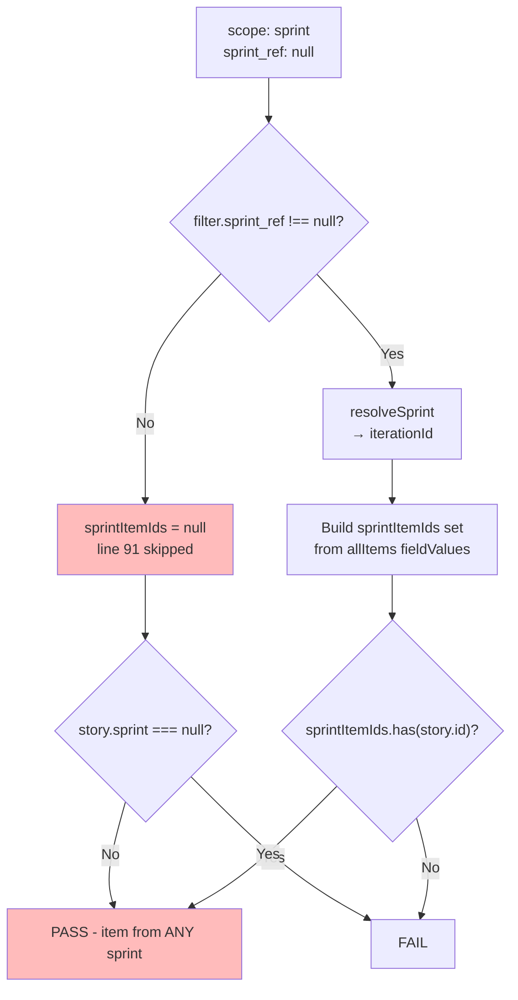

# Implementation Strategy: Items #212 and #213

## Overview

Two Sprint 3 bugs (Priority Must, SP 1 + 2, assigned to `hoonsubin`). Both are small, independent, and block core API surface. Sprint ends 2026-06-01.

---

## Item #212 — `$projectNumber` declared but unused in `GetIssueProjectItem`

**SP**: 1 | **Files changed**: 2 | **Test**: Update spy assertion

### Root Cause

The GraphQL operation at [`operations.graphql:352`](../src/adapters/github/operations.graphql:352) declares `$projectNumber: Int!` in the operation signature but never references it in the operation body. GitHub's API strictly validates that all declared variables are referenced — it rejects with:

> `Variable $projectNumber is declared by GetIssueProjectItem but not used`

The variable is only used in JavaScript post-processing at [`direct-lookup-assembler.ts:77`](../src/adapters/github/internal/assemblers/direct-lookup-assembler.ts:77):

```ts
const match = nodes.find((n) => n?.project?.number === project_number);
```

### Fix

Two changes:

1. **`src/adapters/github/operations.graphql`** — Remove `$projectNumber: Int!` from the operation declaration:
   ```graphql
   # Before:
   query GetIssueProjectItem($owner: String!, $repo: String!, $number: Int!, $projectNumber: Int!) {
   # After:
   query GetIssueProjectItem($owner: String!, $repo: String!, $number: Int!) {
   ```

2. **`src/adapters/github/internal/assemblers/direct-lookup-assembler.ts`** — Remove `projectNumber` from the variables map at line 73:
   ```ts
   # Before:
   { owner, repo, number, projectNumber: project_number }
   # After:
   { owner, repo, number }
   ```

### Why This Works

- The `project.number` field is part of the **response** (`nodes.project.number` at line 358 of operations.graphql), not dependent on the input variable.
- The JS-side filter `n?.project?.number === project_number` at line 77 is sufficient — it checks each returned project item's `project.number` against the config's `project_number`.
- The query already limits results to `projectItems(first: 10)` scoped to the repository, so at most 10 items need JS-side filtering.

### Test Impact

**`direct-lookup-assembler.test.ts`** — The existing test at line 84-85 asserts:

```ts
assertEquals(gh.graphqlCalls[0].variables.number, sampleItem.content.number);
```

It does NOT assert on `projectNumber` in variables. The test fixture's `project.number` field (at line 47) is in the response, not the request. So **no test changes needed** for this fix — the existing test continues to pass because:

- The spy records whatever variables are passed
- No assertion checks for `projectNumber` presence
- The response fixture includes `project: { number: 6 }` which satisfies the JS-side filter

---

## Item #213 — `scope:"sprint"` returns items from past sprints

**SP**: 2 | **Files changed**: 1 (+ tests) | **Test**: Add new test case

### Root Cause

In [`item-filter.ts:77`](../src/adapters/github/internal/item-filter.ts:77), the sprint scope check is too weak:

```ts
if (filter.scope === "sprint" && story.sprint === null) return false;
```

This only excludes items where `story.sprint` is `null`. Items from past sprints (Sprint 1, Sprint 2) still have a non-null sprint field, so they pass through.

The robust sprint-identity check exists at lines 27-41 (`sprintItemIds`), but it's only populated when `filter.sprint_ref !== null`. When a caller passes only `scope: "sprint"` without an explicit `sprint_ref`, `sprintItemIds` stays `null` and line 91 is skipped.

### Flow Diagram



The bug path is highlighted — when `sprint_ref` is null (which is the case for most `scope: "sprint"` callers), past-sprint items pass through.

### Fix

In [`item-filter.ts:26-42`](../src/adapters/github/internal/item-filter.ts), add a fallback: when `scope === "sprint"` and `sprint_ref` is null, resolve to the current active sprint's iteration ID:

```ts
// Before:
let sprintItemIds: Set<string> | null = null;
if (filter.sprint_ref !== null) {
  const iterationId = resolveSprint(filter.sprint_ref, config);
  // ... build sprintItemIds from allItems
}

// After:
let sprintItemIds: Set<string> | null = null;
if (filter.sprint_ref !== null) {
  const iterationId = resolveSprint(filter.sprint_ref, config);
  if (iterationId === null) {
    return () => false;
  }
  sprintItemIds = buildSprintItemIds(iterationId, allItems, config);
} else if (filter.scope === "sprint" && config.live.iterations.active) {
  sprintItemIds = buildSprintItemIds(
    config.live.iterations.active.id,
    allItems,
    config,
  );
}
```

Where `buildSprintItemIds` is extracted as a helper:

```ts
const buildSprintItemIds = (
  iterationId: string,
  allItems: readonly ProjectItem[],
  config: GitHubBootState,
): Set<string> => {
  return new Set(
    allItems
      .filter((item) => {
        const fv = item.fieldValues.nodes.find(
          (v) => v.field?.id === config.live.fields.sprintFieldId,
        );
        return fv?.iterationId === iterationId;
      })
      .map((item) => item.id),
  );
};
```

### Edge Case Handling

- **No active sprint**: `config.live.iterations.active` is `null`. The fallback is skipped, `sprintItemIds` stays `null`, line 91 is skipped. The weaker `story.sprint === null` check at line 77 still prevents backlog items from appearing. This is acceptable — without an active sprint, "items in the current sprint" is undefined, and the existing filter is a reasonable fallback.

- **resolveSprint refactoring**: `resolveSprint("current")` at [`resolver.ts:82-95`](../src/adapters/github/internal/resolver.ts:82) throws `SprintNotScheduledError` if no active sprint. The fallback uses `config.live.iterations.active?.id` directly to avoid throwing — it silently falls through instead, matching the safe behavior for the `sprint_ref` code path.

### Test Changes

**`item-filter.test.ts`** — Add one new test case:

```ts
Deno.test("buildItemFilterFn - scope=sprint with null sprint_ref excludes past-sprint items", () => {
  const cfg = makeConfig({
    live: {
      ...makeConfig().live,
      iterations: {
        active: { id: "IT_current", title: "Sprint 5", startDate: "2026-01-01", duration: 14 },
        next: { id: "IT_next", title: "Sprint 6", startDate: "2026-01-15", duration: 14 },
        completed: [
          { id: "IT_past", title: "Sprint 4", startDate: "2025-12-18", duration: 14 },
        ],
        all: [
          { id: "IT_past", title: "Sprint 4", startDate: "2025-12-18", duration: 14 },
          { id: "IT_current", title: "Sprint 5", startDate: "2026-01-01", duration: 14 },
          { id: "IT_next", title: "Sprint 6", startDate: "2026-01-15", duration: 14 },
        ],
      },
    },
  });

  const currentSprintItem: Story = {
    kind: "issue",
    ref: { id: "current1" },
    key: "c1",
    title: "Current sprint item",
    body: "",
    type: "feature",
    status: "In Progress",
    sprint: "Sprint 5",
    story_points: 3,
    priority: "Must",
    assignees: [],
    labels: [],
    epic: null,
    created_at: "2026-01-01T00:00:00Z",
    updated_at: "2026-01-01T00:00:00Z",
    url: "",
    blocked_by: [],
  };
  const pastSprintItem: Story = {
    ...currentSprintItem,
    ref: { id: "past1" },
    key: "p1",
    title: "Past sprint item",
    sprint: "Sprint 4",
  };
  const backlogItem: Story = {
    ...currentSprintItem,
    ref: { id: "backlog1" },
    key: "b1",
    title: "Backlog item",
    sprint: null,
  };

  // We need allItems to have the sprint field values for the filter to work.
  // Build ProjectItem entries with correct fieldValues.
  const allItems: ProjectItem[] = [
    buildProjectItemWithSprint("current1", "IT_current", cfg),
    buildProjectItemWithSprint("past1", "IT_past", cfg),
    buildProjectItemWithSprint("backlog1", null, cfg),
  ];

  const fn = buildItemFilterFn(
    { ...baseFilter(), scope: "sprint", sprint_ref: null },
    cfg,
    allItems,
  );

  const results = [currentSprintItem, pastSprintItem, backlogItem].filter(fn);
  assertEquals(results.length, 1);
  assertEquals(results[0].ref.id, "current1");
});
```

Note: This test requires a helper `buildProjectItemWithSprint` that constructs a `ProjectItem` with the correct `fieldValues` to match the sprint iteration ID. If building this helper is complex, an alternative is to test the filter indirectly via the `ProjectItemsAssembler` pipeline test with fixture data.

---

## Execution Order

These two items are independent and can be implemented in any order. However:

1. **#212 first** (SP 1) — the fix is simpler (2 lines changed), and it unblocks key-based lookups which are used by many workflows.
2. **#213 second** (SP 2) — requires more careful testing of the `sprintItemIds` fallback logic.

### Todo List

```
[ ] #212: Remove $projectNumber from GetIssueProjectItem operation signature
[ ] #212: Remove projectNumber from variable map in direct-lookup-assembler.ts
[ ] #212: Verify existing test passes
[ ] #213: Extract buildSprintItemIds helper in item-filter.ts
[ ] #213: Add scope=sprint fallback to use current active sprint
[ ] #213: Add test case for scope=sprint with null sprint_ref
[ ] Run deno lint + deno fmt --check + deno task test
```

### Rollback

Both are single-file changes with no migration. Revert the changed lines to roll back.

### Handoff

```json
{
  "task": "Implement fixes for #212 and #213",
  "mode": "code",
  "context": {
    "fileDirectLookupAssembler": "src/adapters/github/internal/assemblers/direct-lookup-assembler.ts",
    "fileOperations": "src/adapters/github/operations.graphql",
    "fileFilter": "src/adapters/github/internal/item-filter.ts",
    "fileFilterTest": "src/adapters/github/internal/item-filter.test.ts",
    "fileLookupTest": "src/adapters/github/internal/assemblers/direct-lookup-assembler.test.ts",
    "details": "See plans/issues-212-213-implementation.md for full fix descriptions"
  }
}
```
