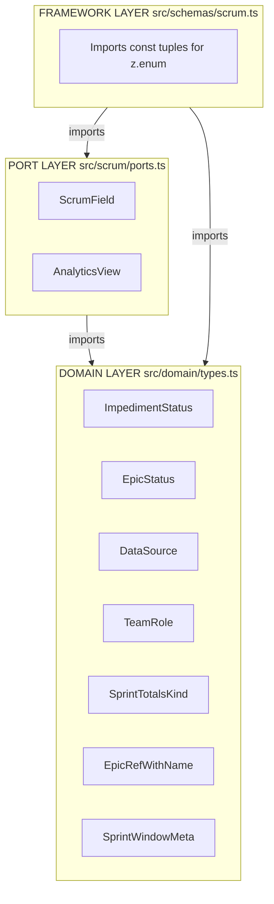

# Literal Type Refactor Plan — Extract Repeated Inline Literal Types

## Goal

Eliminate all repeated inline literal type declarations across the codebase by extracting them to named, composable types in the correct architectural layer.

## Guiding Principles

1. **Type with consumer** — a type lives in the layer that consumes it (Dependency Inversion Principle)
2. **Single source of truth** — one definition, imported everywhere
3. **Composability** — extract the _primitive values_ first, then compose `| null` at the usage site
4. **Backward compatibility** — keep type aliases for any exported type that might be consumed externally
5. **Immutability by default** — `readonly` on extracted interfaces
6. **Zod reuse** — extract `as const` tuples so Zod schemas can use `z.enum(TUPLE)` instead of duplicating strings

---

## Layer Decision Map



---

## Step-by-Step Implementation Plan

### Step 1: Extract `ImpedimentStatus` — domain layer

**Type:** `"open" | "in_progress" | "resolved"` **Layer:** Domain (`src/domain/types.ts`) **Occurrences:** 7 literal sites + 1 dependent Zod update

**Actions**

Add to [`src/domain/types.ts`](src/domain/types.ts) — near the existing `Story`, `StoryBase`, and other entity types:

```typescript
/** Lifecycle status for an impediment. */
export type ImpedimentStatus = "open" | "in_progress" | "resolved";
```

Also export a const tuple for Zod reuse:

```typescript
/** Const tuple for Zod z.enum(IMPEDIMENT_STATUSES). */
export const IMPEDIMENT_STATUSES = ["open", "in_progress", "resolved"] as const;
```

Then update all 7 literal sites (8 total changes including the Zod dependency update):

1. [`src/scrum/ports.ts:253`](src/scrum/ports.ts#L253) — `ImpedimentListing.status: ImpedimentStatus`
2. [`src/scrum/ports.ts:310`](src/scrum/ports.ts#L310) — `updateImpediment(status: ImpedimentStatus, ...)`
3. [`src/adapters/abstract-backend.ts:183`](src/adapters/abstract-backend.ts#L183) — `_status: ImpedimentStatus`
4. [`src/scrum/update-impediment.ts:13`](src/scrum/update-impediment.ts#L13) — `status: ImpedimentStatus`
5. [`src/adapters/github/backend.ts:306`](src/adapters/github/backend.ts#L306) — `status: ImpedimentStatus`
6. [`src/adapters/github/internal/impediment-service.ts:189`](src/adapters/github/internal/impediment-service.ts#L189) — `status: ImpedimentStatus`
7. [`src/adapters/github/internal/impediment-service.ts:296`](src/adapters/github/internal/impediment-service.ts#L296) — variable `const impedimentStatus: ImpedimentStatus = ...`
8. [`src/schemas/scrum.ts:423`](src/schemas/scrum.ts#L423) — change `z.enum(["open", "in_progress", "resolved"])` to `z.enum(IMPEDIMENT_STATUSES)`

> **Impact scope:** domain/types.ts, ports.ts, scrum/update-impediment.ts, schemas/scrum.ts, 3 adapter files

---

### Step 2: Extract `ScrumField` — port layer

**Type:** `"status" | "sprint" | "story_points" | "priority" | "assignee" | "type"` **Layer:** Port (`src/scrum/ports.ts`) **Occurrences:** 5 locations

**Actions**

Add to [`src/scrum/ports.ts`](src/scrum/ports.ts) — alongside `SearchScope` and `VocabularyKind`:

```typescript
/** Writable board fields on a story. */
export const SCRUM_FIELDS = [
  "status",
  "sprint",
  "story_points",
  "priority",
  "assignee",
  "type",
] as const;

/** Board field to update via setField. */
export type ScrumField = (typeof SCRUM_FIELDS)[number];
```

Then update:

1. [`src/scrum/ports.ts:366`](src/scrum/ports.ts#L366) — `field: ScrumField`
2. [`src/adapters/abstract-backend.ts:150`](src/adapters/abstract-backend.ts#L150) — `field: ScrumField`
3. [`src/adapters/github/backend.ts:278`](src/adapters/github/backend.ts#L278) — `field: ScrumField`
4. [`src/adapters/github/internal/story-mutation-service.ts:316`](src/adapters/github/internal/story-mutation-service.ts#L316) — `field: ScrumField`
5. [`src/schemas/scrum.ts:77`](src/schemas/scrum.ts#L77) — change `z.enum(["status", "sprint", ...])` to `z.enum(SCRUM_FIELDS)`
6. Add `import { SCRUM_FIELDS }` in [`src/schemas/scrum.ts`](src/schemas/scrum.ts)

> **Impact scope:** ports.ts, schemas/scrum.ts, 3 adapter files

---

### Step 3: Extract `EpicStatus` — domain layer

**Type:** `"open" | "in_progress" | "done" | null` **Layer:** Domain (`src/domain/types.ts`) **Occurrences:** 2 locations

**Actions**

Add to [`src/domain/types.ts`](src/domain/types.ts):

```typescript
/** Lifecycle status for an epic. */
export type EpicStatus = "open" | "in_progress" | "done";
```

> Note: extracted WITHOUT `| null`. Consumers compose: `status: EpicStatus | null`. This follows the composability principle — nullability is a usage concern, not inherent to the domain.
>
> No `EPIC_STATUSES` const tuple: there is no `z.enum(["open", "in_progress", "done"])` in `src/schemas/scrum.ts`, so the framework layer has no Zod dependency to consolidate. Add the tuple only if a schema validation need arises.

Then update:

1. [`src/domain/types.ts:88`](src/domain/types.ts#L88) — `EpicListing.status: EpicStatus | null`
2. [`src/domain/types.ts:264`](src/domain/types.ts#L264) — `EpicSummary.status: EpicStatus | null`

> **Impact scope:** domain/types.ts only (both occurrences are in the same file)

---

### Step 4: Extract `DataSource` — domain layer

**Type:** `"audit_log" | "issue_close_proxy"` **Layer:** Domain (`src/domain/types.ts`) **Occurrences:** 2 locations

**Actions**

Add to [`src/domain/types.ts`](src/domain/types.ts) — near `BurndownResponse`:

```typescript
/** Strategy used to derive burndown data. */
export type DataSource = "audit_log" | "issue_close_proxy";
```

Then update:

1. [`src/domain/types.ts:429`](src/domain/types.ts#L429) — `readonly data_source: DataSource`
2. [`src/scrum/ports.ts:192`](src/scrum/ports.ts#L192) — `dataSource: DataSource`

> **Impact scope:** domain/types.ts, ports.ts

---

### Step 5: Extract `TeamRole` — domain layer

**Type:** `"scrum_master" | "product_owner" | "developer"` **Layer:** Domain (`src/domain/types.ts`) **Occurrences:** 2 locations

**Actions**

Add to [`src/domain/types.ts`](src/domain/types.ts) — near the `OrientResult` type or in a dedicated config section:

```typescript
/** Scrum team role in the project vocabulary. */
export type TeamRole = "scrum_master" | "product_owner" | "developer";
```

Then update:

1. [`src/domain/types.ts:669`](src/domain/types.ts#L669) — `readonly role: TeamRole`
2. [`src/domain/config.ts:64`](src/domain/config.ts#L64) — `role: TeamRole`

> **Impact scope:** domain/types.ts, domain/config.ts

---

### Step 6: Extract `AnalyticsView` — port layer

**Type:** `"burndown" | "history" | "both"` **Layer:** Port (`src/scrum/ports.ts`) **Occurrences:** 2 locations

**Actions**

Add to [`src/scrum/ports.ts`](src/scrum/ports.ts) — alongside `AnalyticsQuery`:

```typescript
/** Which analytics view to return. */
export const ANALYTICS_VIEWS = ["burndown", "history", "both"] as const;

/** Analytics view selector. */
export type AnalyticsView = (typeof ANALYTICS_VIEWS)[number];
```

Then update:

1. [`src/scrum/ports.ts:85`](src/scrum/ports.ts#L85) — `readonly view: AnalyticsView`
2. [`src/schemas/scrum.ts:183`](src/schemas/scrum.ts#L183) — change `z.enum(["burndown", "history", "both"])` to `z.enum(ANALYTICS_VIEWS)`

> **Impact scope:** ports.ts, schemas/scrum.ts

---

### Step 7: Extract `SprintTotalsKind` — domain layer

**Type:** `"active" | "completed"` **Layer:** Domain (`src/domain/types.ts`) **Occurrences:** 1 location (discriminant of `SprintTotals`)

**Actions**

Add to [`src/domain/types.ts`](src/domain/types.ts) — directly **below** `SprintTotals` (must be defined after `SprintTotals` since it is derived from it):

```typescript
/** Discriminant for SprintTotals discriminated union. Derived — stays in sync automatically. */
export type SprintTotalsKind = SprintTotals["kind"];
```

> Use the indexed-access form `SprintTotals["kind"]` rather than repeating the literal strings. This keeps `SprintTotals` as the single source of truth: if the union ever gains a third variant, `SprintTotalsKind` updates automatically without a separate edit.

Then update:

1. [`src/domain/types.ts:493`](src/domain/types.ts#L493) — `kind: SprintTotalsKind` and `kind: SprintTotalsKind`

> **Impact scope:** domain/types.ts only

---

### Step 8: Extract `EpicRefWithName` — domain layer

**Type:** `{ readonly ref: EpicRef; readonly name: string }` **Layer:** Domain (`src/domain/types.ts`) **Occurrences:** 2 locations

**Actions**

Add to [`src/domain/types.ts`](src/domain/types.ts) — near `EpicRef`:

```typescript
/** Epic reference bundled with its display name. */
export type EpicRefWithName = { readonly ref: EpicRef; readonly name: string };
```

> Note: extracted WITHOUT `| null`, consistent with Step 3 (`EpicStatus`). Nullability is a usage concern — consumers compose `EpicRefWithName | null` at the field site. Embedding `| null` inside the type name would force `NonNullable<EpicRefWithName>` on any future consumer that needs the non-null form, which reads poorly against the type's own name.

Then update:

1. [`src/domain/types.ts:324`](src/domain/types.ts#L324) — `readonly epic: EpicRefWithName | null`
2. [`src/domain/types.ts:387`](src/domain/types.ts#L387) — `readonly epic: EpicRefWithName | null`

> **Impact scope:** domain/types.ts only

---

### Step 9: Consolidate Sprint Window Metadata — domain layer

**Problem:** `BurndownSprintMeta` (interface) and `SprintSnapshot.sprint` (inline object type) are structurally identical. Additionally, `SprintContext` contains every `SprintWindowMeta` field plus richer time-progress fields, so `SprintContext` can extend `SprintWindowMeta` to eliminate structural overlap.

**Actions**

Add to [`src/domain/types.ts`](src/domain/types.ts) — extract **above** `BurndownResponse`:

```typescript
/** Metadata describing a sprint time window. */
export interface SprintWindowMeta {
  readonly name: string;
  readonly start_date: string;
  readonly end_date: string;
  readonly duration_days: number;
  readonly days_remaining: number;
}
```

Then:

1. Replace `BurndownSprintMeta` with `SprintWindowMeta` (direct rename — no backward-compat alias needed; `BurndownSprintMeta` has only 3 usages, all internal):
   - [`src/domain/types.ts:428`](src/domain/types.ts#L428) — `readonly sprint: SprintWindowMeta`
   - [`src/domain/types.ts:437-443`](src/domain/types.ts#L437) — delete `BurndownSprintMeta` interface entirely
   - [`src/adapters/github/internal/analytics-service.ts:21`](src/adapters/github/internal/analytics-service.ts#L21) — import `SprintWindowMeta` instead of `BurndownSprintMeta`
   - [`src/adapters/github/internal/analytics-service.ts:202`](src/adapters/github/internal/analytics-service.ts#L202) — type annotation `SprintWindowMeta`

2. Update `SprintSnapshot.sprint`:
   - [`src/domain/types.ts:512-517`](src/domain/types.ts#L512) — replace inline object with `readonly sprint: SprintWindowMeta`

3. Make `SprintContext` extend `SprintWindowMeta`:
   - [`src/domain/types.ts:188`](src/domain/types.ts#L188) — replace the repeated `name / start_date / end_date / duration_days / days_remaining` fields with `extends SprintWindowMeta`:

```typescript
export interface SprintContext extends SprintWindowMeta {
  id: string;
  goal: string | null;
  days_elapsed: number;
  time_elapsed_pct: number; // 0-100
  riskStance: SprintRiskStance;
}
```

> `SprintContext` is a superset of `SprintWindowMeta` — it adds `id`, `goal`, `days_elapsed`, `time_elapsed_pct`, and `riskStance`. Extending removes the five duplicated field declarations and makes the structural relationship explicit. The `sprintContextFromSprintInfo` factory function still builds the full shape; no call-site changes needed beyond the interface definition.

> **Impact scope:** domain/types.ts, analytics-service.ts

---

### Step 10: Update Zod schema const tuple imports — framework layer

**Actions**

Update [`src/schemas/scrum.ts`](src/schemas/scrum.ts) to import const tuples instead of inline string arrays:

| Current                                                                        | Replace with                                                                               |
| ------------------------------------------------------------------------------ | ------------------------------------------------------------------------------------------ |
| `z.enum(["status", "sprint", "story_points", "priority", "assignee", "type"])` | `z.enum(SCRUM_FIELDS)` + `import { SCRUM_FIELDS } from "../scrum/ports.ts"`                |
| `z.enum(["burndown", "history", "both"])`                                      | `z.enum(ANALYTICS_VIEWS)` + `import { ANALYTICS_VIEWS } from "../scrum/ports.ts"`          |
| `z.enum(["open", "in_progress", "resolved"])`                                  | `z.enum(IMPEDIMENT_STATUSES)` + `import { IMPEDIMENT_STATUSES } from "../domain/types.ts"` |
| `z.enum(["status_option", "priority_option", "label"])`                        | `z.enum(VOCABULARY_KINDS)` (create const tuple alongside `VocabularyKind` in ports.ts)     |
| `z.enum(["backlog", "sprint", "all"])`                                         | `z.enum(SEARCH_SCOPES)` (create const tuple alongside `SearchScope` in ports.ts)           |

> **Impact scope:** schemas/scrum.ts, ports.ts (2 new const tuples), domain/types.ts (import)

---

## Execution Order (Safe Incremental Steps)

Each step is independently testable. They should be implemented in this order to minimize merge conflicts:

| Phase       | Steps                                                | Why this order                                              |
| ----------- | ---------------------------------------------------- | ----------------------------------------------------------- |
| **Phase 1** | 3 (EpicStatus), 4 (DataSource), 7 (SprintTotalsKind) | Domain-only types; no cross-file imports needed             |
| **Phase 2** | 5 (TeamRole)                                         | Two domain files; simple replacement                        |
| **Phase 3** | 8 (EpicRefWithName)                                  | Domain-only; multi-site replacement                         |
| **Phase 4** | 9 (SprintWindowMeta)                                 | Domain + one adapter file; may touch imports                |
| **Phase 5** | 1 (ImpedimentStatus)                                 | Crosses domain → ports → adapter → schemas; broadest impact |
| **Phase 6** | 2 (ScrumField), 6 (AnalyticsView)                    | Port + adapter + schemas; scoped to write operations        |
| **Phase 7** | 10 (Zod const tuple imports)                         | Final cleanup; depends on all prior const tuples existing   |

---

## Verification Checklist

After each phase, run:

```bash
deno lint                          # No lint errors
deno task test                      # All tests pass
```

Additionally, after Zod changes:

```bash
deno check src/schemas/scrum.ts     # Type-check specifically
```

## File Change Summary

| File                                                     | Changes                                                                                                                 |
| -------------------------------------------------------- | ----------------------------------------------------------------------------------------------------------------------- |
| `src/domain/types.ts`                                    | +7 type exports, +3 const tuples, -1 interface (replaced), `SprintContext extends SprintWindowMeta`, -3 inline literals |
| `src/scrum/ports.ts`                                     | +4 type exports, +4 const tuples, -3 inline literals                                                                    |
| `src/scrum/update-impediment.ts`                         | 1 import + type change                                                                                                  |
| `src/schemas/scrum.ts`                                   | 3-4 imports added, 5 z.enum() calls updated                                                                             |
| `src/domain/config.ts`                                   | 1 type change                                                                                                           |
| `src/adapters/abstract-backend.ts`                       | 2 type changes in signatures                                                                                            |
| `src/adapters/github/backend.ts`                         | 2 type changes in method sigs                                                                                           |
| `src/adapters/github/internal/story-mutation-service.ts` | 1 type change                                                                                                           |
| `src/adapters/github/internal/impediment-service.ts`     | 2 type changes                                                                                                          |
| `src/adapters/github/internal/analytics-service.ts`      | 1 import change, 1 type annotation change                                                                               |

## Type Definitions Summary

```typescript
// ── src/domain/types.ts ──

export type EpicStatus = "open" | "in_progress" | "done";
export type ImpedimentStatus = "open" | "in_progress" | "resolved";
export const IMPEDIMENT_STATUSES = ["open", "in_progress", "resolved"] as const;
export type DataSource = "audit_log" | "issue_close_proxy";
export type TeamRole = "scrum_master" | "product_owner" | "developer";
export type SprintTotalsKind = SprintTotals["kind"]; // derived — stays in sync automatically
export type EpicRefWithName = { readonly ref: EpicRef; readonly name: string };
export interface SprintWindowMeta {
  readonly name: string;
  readonly start_date: string;
  readonly end_date: string;
  readonly duration_days: number;
  readonly days_remaining: number;
}

// ── src/scrum/ports.ts ──

export const SCRUM_FIELDS = [
  "status",
  "sprint",
  "story_points",
  "priority",
  "assignee",
  "type",
] as const;
export type ScrumField = (typeof SCRUM_FIELDS)[number];
export const ANALYTICS_VIEWS = ["burndown", "history", "both"] as const;
export type AnalyticsView = (typeof ANALYTICS_VIEWS)[number];
export const SEARCH_SCOPES = ["backlog", "sprint", "all"] as const;
export const VOCABULARY_KINDS = ["status_option", "priority_option", "label"] as const;
```
