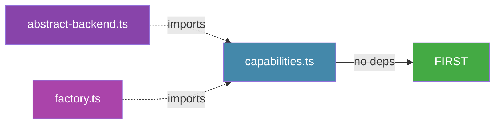

# Phase 0: Adapter Infrastructure — Implementation Plan

**Status:** Ready for implementation **Risk:** 🟢 Low — three new files, no existing code changes **Verification Gate:** `deno lint && deno test && deno check src/index.ts`

---

## Overview

Phase 0 establishes the adapter abstraction layer that decouples the composition root (`src/index.ts`) from direct knowledge of the GitHub adapter. It creates three new files:

| File                               | Purpose                                                                      |
| ---------------------------------- | ---------------------------------------------------------------------------- |
| `src/adapters/capabilities.ts`     | `PlatformCapabilities` interface + `GITHUB_CAPABILITIES` constant            |
| `src/adapters/abstract-backend.ts` | `AbstractProjectBackend` abstract base class + `UnsupportedCapabilityError`  |
| `src/adapters/factory.ts`          | `AdapterFactory` interface, `BackendResult` type, `createBackend()` registry |

---

## Task Breakdown

### Task 1: `src/adapters/capabilities.ts`

**What it provides:**

- `PlatformCapabilities` interface declaring what features an adapter supports
- `GITHUB_CAPABILITIES` constant with GitHub's capabilities for use by the factory

**Design:**

```typescript
export interface PlatformCapabilities {
  platform: string; // e.g. "github"
  supports: {
    auditLogBurndown: boolean; // Can compute burndown from audit log timestamps
    nativeSprints: boolean; // Has native sprint/iteration field support
    dependencies: boolean; // Supports dependency tracking between items
    fileReader: boolean; // Can read files from the repo (templates, config)
    stableItemKeys: boolean; // Item keys (issue numbers) are stable across moves
  };
}
```

**Capabilities for GitHub:**

- `auditLogBurndown: true` — GitHub Projects supports audit-log-based completion timestamps
- `nativeSprints: true` — GitHub has iteration fields
- `dependencies: true` — GitHub supports issue dependency tracking
- `fileReader: true` — GitHub API can read repo files for templates
- `stableItemKeys: true` — GitHub issue numbers are stable

**Imports:** None (zero-dependency utility type)

---

### Task 2: `src/adapters/abstract-backend.ts`

**What it provides:**

- `UnsupportedCapabilityError` — thrown by default implementations of optional port methods
- `AbstractProjectBackend` — abstract base class that partially implements `ProjectReader & ProjectWriter`

**Key design decisions:**

- `AbstractProjectBackend` implements both `ProjectReader` and `ProjectWriter` from `ports.ts`
- `resolveRef()`, `createImpediment()`, and `updateImpediment()` have default implementations
  - `resolveRef()`: Throws `UnsupportedCapabilityError` — must be overridden if the adapter supports `{ number }` refs
  - `createImpediment()`: Throws `UnsupportedCapabilityError` — optional feature
  - `updateImpediment()`: Throws `UnsupportedCapabilityError` — optional feature
- `capabilities` is abstract — each adapter declares its own
- All other methods from `ProjectReader & ProjectWriter` remain abstract — subclasses must implement

**Imports:**

- `ProjectReader, ProjectWriter` from `../scrum/ports.ts`
- `PlatformCapabilities` from `./capabilities.ts`

**Note on `resolveRef()`:** It's `protected` — an internal concern, not part of the port interface. Only the adapter itself calls it when converting `{ number }` refs to `{ id }` refs.

---

### Task 3: `src/adapters/factory.ts`

**What it provides:**

- `AdapterFactory` interface — factory contract for creating backends
- `BackendResult` type — unified return type replacing `GitHubBackendResult`
- `createBackend()` function — registry-based factory selector

**`AdapterFactory` interface:**

```typescript
export interface AdapterFactory {
  readonly platform: string; // e.g. "github"
  create(): Promise<BackendResult>;
}
```

**`BackendResult` type:**

```typescript
export interface BackendResult {
  backend: ProjectReader & ProjectWriter;
  capabilities: PlatformCapabilities;
  fileReader: FileReaderPort | null; // null-checked in composition root
  scrumConfig: ScrumConfig;
}
```

**`createBackend()` function:**

1. Reads `SCRUM_PLATFORM` env var (default: `"github"`)
2. Finds factory whose `platform` matches the env var
3. Throws `Error` with list of registered platforms if no match found
4. Calls `factory.create()` and returns the result

**Imports:**

- `FileReaderPort, ProjectReader, ProjectWriter` from `../scrum/ports.ts`
- `PlatformCapabilities` from `./capabilities.ts`
- `ScrumConfig` from `../domain/config.ts`

---

## Dependencies & Ordering

These three files have internal dependencies:



**Build order:** `capabilities.ts` → `abstract-backend.ts` → `factory.ts`

---

## Verification

After all three files are created:

```bash
# Lint must pass (no formatting or type errors)
deno lint

# Tests must pass (no regressions from the new files)
deno test

# Type-check must pass (no broken imports)
deno check src/index.ts

# Verify no inward adapter leaks from domain/layer boundaries:
grep -r "import.*from.*adapters/github" src/scrum/ src/domain/ src/schemas/
```

---

## Post-Phase-0: What Changes in Phase 1+

After Phase 0 is complete, subsequent phases will:

- **P1 (Domain Types):** Add `StoryNotFoundError` to `src/domain/errors.ts` (imported by `abstract-backend.ts`'s `resolveRef()`)
- **P7 (GitHub Adapter Migration):** `GitHubProjectBackend` extends `AbstractProjectBackend` instead of raw `implements ProjectBackend`
- **P8 (Composition Root):** `src/index.ts` imports `createBackend` + `GitHubAdapterFactory` instead of `createGitHubProjectBackend`
