# Phase 2: Port Types — Implementation Plan

**Status:** Ready for implementation **Risk:** 🟡 Medium — consolidates `src/scrum/ports.ts`, removes 6 deprecated types, adds 3 new interfaces. `SprintTotals` changes affect `get-history.ts`.

**Prerequisite:** P1 remaining cleanup (delete `TemplateResponse`, fix `DependencyEntry.ref` nullability) must be done first.

---

## Current State Assessment

### ✅ Already Done (P0 — Adapter Infrastructure)

| File                               | Status   |
| ---------------------------------- | -------- |
| `src/adapters/capabilities.ts`     | Complete |
| `src/adapters/abstract-backend.ts` | Complete |
| `src/adapters/factory.ts`          | Complete |

### ✅ Already Done (P1 — Domain Types Added)

| Type                                          | Status   |
| --------------------------------------------- | -------- |
| All new domain types in `src/domain/types.ts` | ✅ Added |
| `StoryNotFoundError` in `errors.ts`           | ✅ Added |
| `ArtifactType` moved to `config.ts`           | ✅ Added |

### ⚠️ P1 Remaining (must do before P2)

| #  | Task                                            | File                                                  | Details                                                                                |
| -- | ----------------------------------------------- | ----------------------------------------------------- | -------------------------------------------------------------------------------------- |
| 1a | Delete `TemplateResponse` dead type             | `src/domain/types.ts` (lines 517–535)                 | `@deprecated`, no consumers, safe to remove                                            |
| 1b | Fix `DependencyEntry.ref` nullability           | `src/domain/types.ts` (line 92)                       | Change `{ id: string \| null }` to `ResolvedRef`                                       |
| 1c | Fix `mappers.ts` consumers of `DependencyEntry` | `src/adapters/github/mappers.ts`                      | `mapIssueDependencies()` sets `ref: { id: n.id }` — already non-null, just update type |
| 1d | Fix `story-query-service.ts` consumers          | `src/adapters/github/internal/story-query-service.ts` | Uses `resolveDependencyRefs` which checks `e.ref.id !== null`                          |
| 1e | Verification gate                               | —                                                     | `deno lint && deno test && deno check src/index.ts`                                    |

---

## Implementation Phases

### Phase Dependency

```mermaid
flowchart LR
    P1R["P1 Remaining<br/>Cleanup"] --> P2A["2a: ItemFilter types"]
    P2A --> P2B["2b: AnalyticsQuery"]
    P2B --> P2C["2c: SprintInfo.id"]
    P2C --> P2D["2d: PlatformState epics+templateUris"]
    P2D --> P2E["2e: SprintTotals union"]
    P2E --> P2F["2f: Narrow ports"]
    P2F --> P2G["2g: Remove old ports"]
    P2G --> P2H["2h: Deprecate StoryListing"]
    P2H --> P2I["2i: Fix consumers"]
    P2I --> VG["Verification Gate"]
```



---

## Task Breakdown

### P1-R: Remaining P1 Cleanup (Prerequisite)

#### Task 1a: Delete `TemplateResponse`

**File:** `src/domain/types.ts` (lines 517–535)

Remove the entire `TemplateResponse` type (the discriminated union with `source: "custom" | "default"`).

**Impact:** Zero — `TemplateResponse` is marked `@deprecated`.

**Also fix:** `src/scrum/get-template.ts` (line 8) imports `TemplateResponse` from `../domain/types.ts` — this import will break. Change it to define the type locally or inline it since `get-template.ts` will be deleted in P4 anyway.

**Action:**

1. Delete lines 517-535 from `types.ts`
2. In `get-template.ts`, replace the import with a local type definition:
   ```typescript
   type TemplateResponse =
     | { content: string; source: "custom" }
     | { content: null; source: "default" };
   ```

---

#### Task 1b: Fix `DependencyEntry.ref` nullability

**File:** `src/domain/types.ts` (line 92)

Change:

```typescript
ref: {
  id: string | null;
}
```

To:

```typescript
ref: ResolvedRef;
```

**Rationale:** `ResolvedRef = { id: string }` — makes `id` non-null, aligning with all new domain types.

---

#### Task 1c: Fix `mappers.ts` consumers

**File:** `src/adapters/github/mappers.ts` (line 52–56)

The `mapIssueDependencies` function already sets `ref: { id: n.id }` where `n.id` is from a GraphQL response. This is already non-null at runtime. The type change from `{ id: string | null }` to `{ id: string }` is purely a type narrowing — no runtime code change needed.

**Action:** None required — types are compatible. Just verify no null-coalescing or null checks exist on the `ref.id` access.

---

#### Task 1d: Fix `story-query-service.ts` & `resolveDependencyRefs`

**File:** `src/adapters/github/mappers.ts` (lines 319–329)

The `resolveDependencyRefs()` function checks `e.ref.id !== null` (line 322) and `e.ref.id === null` (line 327). After the type change, `ref.id` is never null, so:

- Remove the null check at line 322 — always attempt `issueIdToItemId` lookup
- Remove the `e.ref.id === null` fallback branch at line 327 — always try `keyToId` as alternative

**Action:** Simplify the `resolve()` function inside `resolveDependencyRefs`:

```typescript
const resolve = (entries: DependencyEntry[]): DependencyEntry[] =>
  entries.map((e) => {
    // Try issue node ID → project item ID (from native API mapping)
    if (issueIdToItemId.has(e.ref.id)) {
      return { ...e, ref: { id: issueIdToItemId.get(e.ref.id)! } };
    }
    // Fallback: issue number string → project item ID (legacy path)
    if (keyToId.has(e.key)) {
      return { ...e, ref: { id: keyToId.get(e.key)! } };
    }
    return e;
  });
```

---

#### Task 1e: Verification Gate

```bash
deno lint
deno test
deno check src/index.ts
grep -r "import.*from.*adapters/github" src/scrum/ src/domain/ src/schemas/
```

---

### P2: Port Types Implementation

#### Task 2a: Add `ItemFilter` and `ResolvedItemFilter` input types

**File:** `src/scrum/ports.ts`

Add before the `SprintInfo` type (around line 22):

```typescript
/**
 * Input filter for findItems port method.
 * All fields are optional — an empty filter returns all items.
 * Defined at the port boundary because it's an input type, not a domain type.
 */
export interface ItemFilter {
  scope?: "backlog" | "sprint" | "all";
  keys?: string[];
  search?: string;
  types?: string[];
  statuses?: string[];
  priority?: string;
  epic_id?: string;
  labels?: string[];
  assignee?: string;
  sprint_ref?: string | null;
  include_dependencies?: boolean;
  limit?: number;
}

/**
 * Resolved filter with defaults applied.
 * All fields are guaranteed non-optional — use the defaults from the handler
 * before calling the port method.
 */
export interface ResolvedItemFilter {
  scope: "backlog" | "sprint" | "all";
  keys: string[];
  search: string;
  types: string[];
  statuses: string[];
  priority: string;
  epic_id: string;
  labels: string[];
  assignee: string;
  sprint_ref: string | null;
  include_dependencies: boolean;
  limit: number;
}
```

**Impact:** New types, no existing consumers yet. Used by `FindItemsPort` (added in 2f).

---

#### Task 2b: Add `AnalyticsQuery` input type

**File:** `src/scrum/ports.ts`

Add after `ItemFilter` / `ResolvedItemFilter`:

```typescript
/**
 * Input query for getAnalytics port method.
 * Defined at the port boundary because it's an input type, not a domain type.
 */
export interface AnalyticsQuery {
  view: "burndown" | "history" | "comprehensive";
  sprint_ref?: string | null;
  history_window?: number; // 1-10, used when view includes history
}
```

**Impact:** New type, no existing consumers yet. Used by `AnalyticsPort` (added in 2f).

---

#### Task 2c: Extend `SprintInfo` with `id` field

**File:** `src/scrum/ports.ts`

Add `id` to `SprintInfo`:

```typescript
export interface SprintInfo {
  id: string; // ← NEW: iteration ID from platform (e.g. GitHub iteration field ID)
  name: string;
  startDate: string;
  durationDays: number;
  endDate: string;
}
```

**Impact:**

- `src/adapters/github/mappers.ts` — `toSprintInfo()` constructs `SprintInfo` objects. Currently returns `{ name, startDate, durationDays, endDate }`. Must add `id`.
- `src/adapters/github/backend.ts` — `getPlatformState()` calls `toSprintInfo()`. The iteration data from `RuntimeConfig.iterations` includes `id` (it's an `IterationEntry` which has `id`). So data is already available.
- `src/scrum/get-sprint.ts` — uses `result.sprintInfo` destructuring: `const { name, startDate, endDate, durationDays } = result.sprintInfo;` — adding `id` won't break this since it's destructuring only the fields it needs.

**Action in `mappers.ts`:** Update `toSprintInfo()`:

```typescript
export const toSprintInfo = (iter: IterationEntry | null): SprintInfo | null => {
  if (!iter) return null;
  const endDate = new Date(iter.startDate);
  endDate.setDate(endDate.getDate() + iter.duration);
  return {
    id: iter.id, // ← NEW
    name: iter.title,
    startDate: iter.startDate,
    durationDays: iter.duration,
    endDate: endDate.toISOString().slice(0, 10),
  };
};
```

---

#### Task 2d: Extend `PlatformState` with `epics` + `templateUris`

**File:** `src/scrum/ports.ts`

Add after `vocabulary` in `PlatformState`:

```typescript
export interface PlatformState {
  fields: {/* ... unchanged ... */};
  labels: {/* ... unchanged ... */};
  iterations: {/* ... unchanged ... */};
  vocabulary: {/* ... unchanged ... */};

  /** Active epics — populated by orientUseCase via backend.getEpics(). */
  epics: { active: EpicSummary[]; totalCount: number };

  /** PBI template URIs — built from ITEM_TYPES intersection with scrumConfig.templates. */
  templateUris: import("../domain/types.ts").TemplateUriMap | null;
}
```

**Impact:**

- `src/adapters/github/backend.ts` — `getPlatformState()` must now return `epics` and `templateUris`. Currently it returns `PlatformState` without these. Need to add them.
  - `epics`: Can call `this.epicService.getEpics()` and filter to open ones, or set as empty initially (orient will populate)
  - `templateUris`: Build from config intersection

**Design decision:** `epics` and `templateUris` are populated at the orient level, not the adapter level. So `getPlatformState()` can return empty defaults, and `orientUseCase` (P5) will later fill them in. For now, set:

```typescript
epics: { active: [], totalCount: 0 },
templateUris: null,
```

---

#### Task 2e: Replace `SprintTotalsActive` + `SprintTotalsHistory` with single `SprintTotals` discriminated union (Issue 7)

**File:** `src/scrum/ports.ts`

**Before:**

```typescript
export interface SprintTotalsActive {
  by_status: Record<string, number>;
  story_points: number;
}

export interface SprintTotalsHistory extends SprintTotalsActive {
  committed_points: number;
  completed_points: number;
}
```

**After:**

```typescript
/**
 * Totals for a sprint snapshot.
 * Discriminated union — narrow on `kind` to access variant-specific fields.
 * - "active": totals for an in-progress sprint
 * - "completed": totals for a completed sprint (adds velocity metrics)
 */
export type SprintTotals = {
  kind: "active";
  by_status: Record<string, number>;
  story_points: number;
} | {
  kind: "completed";
  by_status: Record<string, number>;
  story_points: number;
  committed_points: number;
  completed_points: number;
};
```

**Impact:**

- `SprintSnapshot.totals` type changes from `SprintTotalsActive | SprintTotalsHistory` to `SprintTotals`
- `src/scrum/get-sprint.ts` — `SprintSnapshot` construction uses `{ by_status, story_points }` for active sprints. Needs `kind: "active"`.
- `src/scrum/get-history.ts` — `SprintSnapshot` construction uses `{ by_status, story_points, committed_points, completed_points }`. Needs `kind: "completed"`. Also, the runtime guard `"committed_points" in s.totals` on line 128 must change to `s.totals.kind === "completed"`.

---

#### Task 2f: Add `FindItemsPort`, `AnalyticsPort`, `BoardHealthPort`

**File:** `src/scrum/ports.ts`

Add after existing port interfaces (around line 268):

```typescript
/**
 * Find items port — unified item search across all PBIs.
 * Replaces SprintPort.getSprintStories() and BacklogPort.getBacklogStories().
 */
export interface FindItemsPort {
  findItems(filter: ResolvedItemFilter): Promise<import("../domain/types.ts").ItemSearchResult>;
}

/**
 * Analytics port — unified sprint analytics (burndown + history).
 * Replaces HistoryPort.getCompletedSprintHistory() and BurndownPort methods.
 */
export interface AnalyticsPort {
  getAnalytics(query: AnalyticsQuery): Promise<import("../domain/types.ts").AnalyticsResult>;
}

/**
 * Board health port — health dashboard (no item lists).
 * Provides aggregated metrics without returning individual story data.
 */
export interface BoardHealthPort {
  getBoardHealth(sprintScope: string): Promise<import("../domain/types.ts").BacklogHealth>;
}
```

---

#### Task 2g: Remove `SprintPort`, `BacklogPort`, `HistoryPort`, `BurndownPort`

**File:** `src/scrum/ports.ts`

Remove the following interfaces:

- `BacklogPort` (lines 230–233)
- `SprintPort` (lines 241–246)
- `HistoryPort` (lines 260–262)
- `BurndownPort` (lines 268–271)

Also update `ProjectReader` (around line 298) to no longer extend these removed ports. `ProjectReader` should use the new narrow ports instead:

```typescript
export interface ProjectReader
  extends EpicPort, ImpedimentPort, FindItemsPort, AnalyticsPort, BoardHealthPort {
  getPlatformState(/* ...unchanged... */): Promise<PlatformState>;
  reload(): Promise<void>;
  getStoryDetail(ref: StoryRef): Promise<StoryDetail>; // moved from StoryPort
}
```

**Note:** `StoryPort` is not removed — it's still used by `getStoryUseCase`. Only `getSprintStories()`, `getBacklogStories()`, `getCompletedSprintHistory()`, `getBurndownInput()`, and `resolveCompletionTimestamps()` are removed from the port interface.

---

#### Task 2h: Deprecate `StoryListing`

**File:** `src/scrum/ports.ts`

Add `@deprecated` JSDoc tag to `StoryListing`:

```typescript
/**
 * Lightweight listing entry for story collections.
 * ...
 *
 * @deprecated Use ItemListing from domain/types.ts instead.
 * ItemListing adds priority as a named field, sprint.ref, and epic info.
 * Scheduled for removal in the next major refactor phase.
 */
export interface StoryListing {
  // ... fields unchanged ...
}
```

---

#### Task 2i: Fix all consumers of removed/changed types

This task requires fixing compile errors in files that import or use the changed types.

**Files to update:**

1. **`src/adapters/abstract-backend.ts`** — imports `BurndownInput`, `CompletionMap`, `SprintHistoryEntry`, `SprintInfo`, `BurndownPort`-related methods:
   - Remove abstract methods: `getCompletedSprintHistory`, `getBurndownInput`, `resolveCompletionTimestamps`
   - Add abstract methods: `findItems`, `getAnalytics`, `getBoardHealth`
   - Update `SprintInfo` usage to include `id`

2. **`src/adapters/github/backend.ts`** — implements `ProjectBackend`:
   - Remove `getCompletedSprintHistory`, `getBurndownInput`, `resolveCompletionTimestamps` public methods
   - Add `findItems`, `getAnalytics`, `getBoardHealth` public methods
   - Update `getPlatformState()` to include `epics` and `templateUris` in return
   - `getSprintStories` and `getBacklogStories` methods may still exist as internal helpers but are no longer part of the port interface

3. **`src/scrum/get-sprint.ts`** — uses `SprintPort`, `HistoryPort`:
   - Change `backend: SprintPort & ImpedimentPort` to use new narrow ports
   - Update `SprintSnapshot.totals` construction to include `kind: "active"`

4. **`src/scrum/get-backlog.ts`** — uses `BacklogPort`:
   - Change `backend: BacklogPort & EpicPort` dependency
   - `getBacklogStories()` and `getOrphanImpediments()` need to be accessed differently

5. **`src/scrum/get-history.ts`** — uses `HistoryPort`:
   - Change `backend: HistoryPort & ImpedimentPort` to new narrow ports
   - Fix `"committed_points" in s.totals` → `s.totals.kind === "completed"` (Issue 7 fix)

6. **`src/scrum/get-burndown.ts`** — uses `BurndownPort`:
   - Change `backend: BurndownPort` to new narrow ports

7. **`src/scrum/get-story.ts`** — unchanged (still uses `StoryPort` which is not removed)

8. **`src/scrum/orient.ts`** — uses `ProjectReader`:
   - `ProjectReader` type changes (removed old ports, added new ones)
   - Add `epics` and `templateUris` to orient result mapping

---

## Verification Gate

After all tasks are complete:

```bash
deno lint
deno test
deno check src/index.ts
# Verify no inward adapter leaks:
grep -r "import.*from.*adapters/github" src/scrum/ src/domain/ src/schemas/
```

If a phase fails: `git checkout -- <files-modified-in-this-phase>` and reassess.

---

## Out of Scope for Phase 2

These are intentionally deferred to later phases:

| Concern                                                                                 | Phase                         |
| --------------------------------------------------------------------------------------- | ----------------------------- |
| `AbstractProjectBackend` should extend the new ports                                    | P7 (GitHub Adapter Migration) |
| `GitHubProjectBackend` implementation of `findItems`, `getAnalytics`, `getBoardHealth`  | P7                            |
| New use-cases (`findItemsUseCase`, `getAnalyticsUseCase`, `getBoardHealthUseCase`)      | P4                            |
| New tool handlers (`scrum_find_items`, `scrum_get_analytics`, `scrum_get_board_health`) | P6                            |
| Orient use-case migration (epics, SprintContext, TemplateUriMap)                        | P5                            |
| New schemas (`FindItemsSchema`, `GetAnalyticsSchema`, `GetBoardHealthSchema`)           | P3                            |
