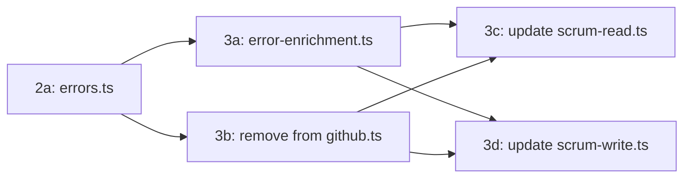

# Phase 3: Extract Error Enrichment from `github.ts`

## Implementation Strategy

This plan breaks down Phase 3 from [`tasks/TODO.md`](../tasks/TODO.md) into granular, verifiable steps.

> **Clean Code Review Notes (2026-05-12):**
>
> - File moved to `src/services/error-enrichment.ts` (not `src/tools/`) to respect layer architecture: Tools → Services → Adapters. Utilities belong in the services layer.
> - `formatError` inlined into `enrichError` — it's 9 lines with one caller; extraction adds no value.
> - `EnrichErrorContext` renamed to `ErrorEnrichmentContext` — "Enrich" prefix is unnecessary noise.
> - Deletion steps consolidated from 7 to 1 (original was overly granular).
> - Added file header convention requirement and TODO removal step.

### Current State Assessment

| Step                                | Status  | Notes                                                        |
| ----------------------------------- | ------- | ------------------------------------------------------------ |
| 2a — `errors.ts`                    | DONE    | `src/adapters/github/errors.ts` exists with `GitHubApiError` |
| 2b — Update `github.ts` import      | DONE    | `github.ts` already imports from `errors.ts`                 |
| 3a — Create `error-enrichment.ts`   | PENDING | File does not exist yet                                      |
| 3b — Remove from `github.ts`        | PENDING | Code at lines 259–396 (formatError + enrichError + helpers)  |
| 3c — Update `scrum-read.ts` import  | PENDING | Line 21 imports from `../services/github.ts`                 |
| 3d — Update `scrum-write.ts` import | PENDING | Line 31 imports both from `../services/github.ts`            |
| 3e — Full verification              | PENDING | Type check + grep + CI                                       |

### Dependency Diagram



### Prerequisites

- Phase 2 must be complete (errors.ts exists and github.ts imports from it)
- No other phases depend on Phase 3 except Phases 5–9

---

## Step 3a: Create `src/services/error-enrichment.ts`

**Goal:** Create the new file with the correct content, copying code from `src/services/github.ts`.

> **Clean Code Note:** Placed in `src/services/` (not `src/tools/`) to respect layer architecture. `src/tools/` is for tool handlers; utilities belong in the services layer.

### 3a.1: Identify exact code to extract

From `src/services/github.ts`, extract these blocks:

| Item                               | Lines       | Export?                | Clean Code Note                                              |
| ---------------------------------- | ----------- | ---------------------- | ------------------------------------------------------------ |
| `ErrorEnrichmentContext` interface | 283–289     | No (private to file)   | Renamed from `EnrichErrorContext` — "Enrich" prefix is noise |
| `REQUIRED_PERMISSION` map          | 292–301     | No (const, unexported) |                                                              |
| `TOKEN_URL` constant               | 303         | No (const, unexported) |                                                              |
| ~~`formatError` function~~         | ~~259–268~~ | ~~Inline~~             | **INLINED** — 9 lines, one caller; extraction adds no value  |
| `resolveHint` function             | 309–382     | No (const, unexported) |                                                              |
| `enrichError` function             | 389–396     | **Yes** (export const) |                                                              |
| Re-export of `GitHubApiError`      | —           | **Yes**                | Use `export { GitHubApiError }` (cleaner)                    |

### 3a.2: Create the file

Create `src/services/error-enrichment.ts` with this structure:

```
File header comment (project convention)
---
import + re-export GitHubApiError
---
ErrorEnrichmentContext interface (private)
---
TOKEN_URL constant (private)
---
REQUIRED_PERMISSION map (private)
---
resolveHint function (private)
---
enrichError function (public export)
```

**File header convention** (match existing files like `errors.ts`, `scrum-read.ts`):

```typescript
// =============================================================================
// src/services/error-enrichment.ts — Error enrichment for GitHub API failures
//
// Appends actionable fix hints to GitHubApiError messages. Designed for
// small dense models (≤9B parameters) that benefit from explicit next-step
// instructions rather than inferring fixes from bare error messages.
// =============================================================================
```

**Key decisions:**

- `ErrorEnrichmentContext` stays as a private interface (not exported) — handlers don't need it
- `TOKEN_URL` stays as a private constant — it's only used by `resolveHint`
- `REQUIRED_PERMISSION` stays as a private const — only `resolveHint` reads it
- ~~`formatError`~~ → **inlined into `enrichError`** — 9 lines with one caller; extraction adds no value
- `resolveHint` stays as a private const — only `enrichError` calls it
- Only `enrichError` is exported (plus the `GitHubApiError` re-export)
- Re-export uses `export { GitHubApiError }` (cleaner than `export { GitHubApiError as GitHubApiError }`)

### 3a.3: Verify the new file

Run: `deno check src/services/error-enrichment.ts`

Expected: No type errors.

---

## Step 3b: Remove Moved Code from `src/services/github.ts`

**Goal:** Delete the extracted code blocks from `github.ts` while keeping everything else intact.

### 3b.1: Delete extracted code blocks

Remove these blocks from `src/services/github.ts`:

| Block                          | Lines   | Notes                                                 |
| ------------------------------ | ------- | ----------------------------------------------------- |
| `formatError` function + JSDoc | 259–268 | **INLINED** into `enrichError` — delete entirely      |
| `enrichError` JSDoc comment    | 270–281 | No longer needed — moved to new file                  |
| `EnrichErrorContext` interface | 283–289 | Renamed to `ErrorEnrichmentContext` in new file       |
| `REQUIRED_PERMISSION` map      | 292–301 | Moved to new file                                     |
| `TOKEN_URL` constant           | 303     | Moved to new file                                     |
| `resolveHint` function         | 309–382 | Moved to new file                                     |
| `enrichError` function         | 389–396 | Moved to new file                                     |
| TODO comment (line 384)        | 384     | **Remove** — the separation it references is now done |

> **Clean Code Note:** The TODO comment on line 384 (`// todo: this function should be separated...`) should be removed after this step. The separation is now complete.

### 3b.2: Verify `github.ts` is still valid

Run: `deno check src/services/github.ts`

Expected: No type errors. The file should still export: `graphql`, `rest`, `RestResponse`, `RepoFileResponse`, `decodeRepoFileContent`, `fetchRepoFile`.

**Verification checklist:**

- [ ] `GitHubApiError` import from `../adapters/github/errors.ts` is still present
- [ ] `formatError` is gone
- [ ] `resolveHint` is gone
- [ ] `enrichError` is gone
- [ ] `EnrichErrorContext` is gone
- [ ] `REQUIRED_PERMISSION` is gone
- [ ] `TOKEN_URL` is gone
- [ ] TODO comment (line 384) is removed
- [ ] All other exports (`graphql`, `rest`, etc.) are intact

---

## Step 3c: Update `src/tools/scrum-read.ts` Import

**Goal:** Change the `enrichError` import from `../services/github.ts` to `./error-enrichment.ts`.

### 3c.1: Modify line 21

| Before                                                 | After                                                  |
| ------------------------------------------------------ | ------------------------------------------------------ |
| `import { enrichError } from "../services/github.ts";` | `import { enrichError } from "./error-enrichment.ts";` |

This is a single-line change. No other modifications needed to this file.

### 3c.2: Verify

Run: `deno check src/tools/scrum-read.ts`

Expected: No type errors.

---

## Step 3d: Update `src/tools/scrum-write.ts` Import

**Goal:** Split the combined import on line 31 into two separate imports.

### 3d.1: Split the import on line 31

| Before                                                          | After                                                                                                        |
| --------------------------------------------------------------- | ------------------------------------------------------------------------------------------------------------ |
| `import { enrichError, graphql } from "../services/github.ts";` | `import { enrichError } from "./error-enrichment.ts";`<br>`import { graphql } from "../services/github.ts";` |

**Important notes:**

- `enrichError` moves to `./error-enrichment.ts`
- `graphql` stays at `../services/github.ts` (per the TODO.md note: "graphql stays here until the §6e http-client split")
- Do NOT attempt to move `graphql` to `adapters/github/` — that is out of scope

### 3d.2: Verify

Run: `deno check src/tools/scrum-write.ts`

Expected: No type errors.

---

## Step 3e: Full Verification

### 3e.1: Type check all affected files

```bash
deno check src/services/error-enrichment.ts \
           src/services/github.ts \
           src/tools/scrum-read.ts \
           src/tools/scrum-write.ts
```

### 3e.2: Verify no remaining `enrichError` import from `services/github.ts`

Search for any remaining imports of `enrichError` from `services/github.ts`:

```bash
grep -rn 'enrichError.*services/github' src/
```

Expected: No matches (except possibly in comments).

### 3e.3: Verify `GitHubApiError` instanceof compatibility

The re-export must preserve class identity for `instanceof` to work:

```bash
grep 'export.*GitHubApiError' src/services/error-enrichment.ts
```

Expected output: `export { GitHubApiError }` (named re-export, not `export { GitHubApiError as GitHubApiError }`)

### 3e.4: Run CI checks

```bash
deno lint
deno test
```

---

## Risk Assessment

| Risk                                                   | Likelihood | Mitigation                                                                     |
| ------------------------------------------------------ | ---------- | ------------------------------------------------------------------------------ |
| Accidentally removing code that's still needed         | Medium     | Verify each deletion against the import graph before removing                  |
| `enrichError` still referenced elsewhere after removal | Low        | Step 3e.2 grep catches this                                                    |
| Type errors from removed interface                     | Low        | `deno check` catches this immediately                                          |
| `GitHubApiError` re-export breaks `instanceof` checks  | Low        | Step 3e.3 verifies named re-export                                             |
| **Moving to `src/tools/` violates layer architecture** | **High**   | **Fixed: file placed in `src/services/`**                                      |
| **`resolveHint` 74-line switch is hard to maintain**   | **Medium** | **Flagged for follow-up: split into `resolveHttpHint` + `resolveGraphqlHint`** |

## Success Criteria

1. `src/services/error-enrichment.ts` exists with correct content and project file header convention
2. `src/services/github.ts` no longer contains `enrichError`, `formatError`, `resolveHint`, `ErrorEnrichmentContext`, `REQUIRED_PERMISSION`, `TOKEN_URL`, or the TODO comment on line 384
3. `src/tools/scrum-read.ts` imports `enrichError` from `./error-enrichment.ts`
4. `src/tools/scrum-write.ts` imports `enrichError` from `./error-enrichment.ts` and `graphql` from `../services/github.ts`
5. All `deno check` commands pass with no errors
6. No remaining imports of `enrichError` from `services/github.ts` anywhere in `src/`
7. `GitHubApiError` re-export uses `export { GitHubApiError }` (named re-export)
8. CI passes (lint + tests)
