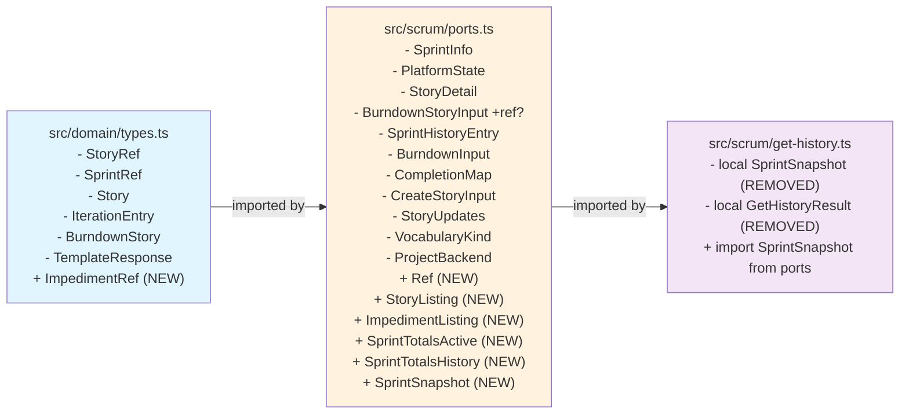

# Phase 4: Define New Domain and Port Types — Detailed Implementation Plan

## Purpose

Phase 4 adds all new types required by Phases 5–9 to their correct architectural layers **before** any use-case or handler code is written. Defining types first ensures each subsequent phase has a single canonical import target, avoiding retroactive changes to every phase.

## Clean Code Principles Applied

| Principle               | Application                                                                                              |
| ----------------------- | -------------------------------------------------------------------------------------------------------- |
| **DRY (G5)**            | `StoryListing` and `ImpedimentListing` share a common `Ref` base type — no duplicated `{ id: string }`   |
| **SRP**                 | `SprintTotals` split into `SprintTotalsActive` and `SprintTotalsHistory` — each has one reason to change |
| **DIP**                 | All new types live at the port boundary (`ports.ts`), never in domain or adapter                         |
| **No Leaks**            | No adapter knowledge in port comments; no tool names in type JSDoc                                       |
| **Consistent Patterns** | `BurndownStoryInput` uses `ref?: { id: string } \| null` — matches `StoryRef` and `Story.ref` pattern    |
| **Clean Slate**         | All outdated JSDoc and stale comments removed from affected files                                        |

## Current State Analysis

### What Exists Today

| File                                                               | Current State                                                                                                                                                                                                         | Relevance to Phase 4                                                                                                                 |
| ------------------------------------------------------------------ | --------------------------------------------------------------------------------------------------------------------------------------------------------------------------------------------------------------------- | ------------------------------------------------------------------------------------------------------------------------------------ |
| [`src/domain/types.ts`](src/domain/types.ts)                       | Contains `StoryRef`, `SprintRef`, `Story`, `IterationEntry`, `BurndownStory`, `BurndownResponse`, `TemplateResponse`                                                                                                  | **Needs:** `ImpedimentRef` (Step 4a)                                                                                                 |
| [`src/scrum/ports.ts`](src/scrum/ports.ts)                         | Contains `SprintInfo`, `PlatformState`, `StoryDetail`, `BurndownStoryInput`, `SprintHistoryEntry`, `BurndownInput`, `CompletionMap`, `CreateStoryInput`, `StoryUpdates`, `VocabularyKind`, `ProjectBackend` interface | **Needs:** `ref?` on `BurndownStoryInput` (Step 4b), `StoryListing`, `ImpedimentListing`, `SprintSnapshot`, `SprintTotals` (Step 4c) |
| [`src/scrum/get-history.ts`](src/scrum/get-history.ts)             | Defines **local** `interface SprintSnapshot` (lines 11–25) and `interface GetHistoryResult` (lines 27–31)                                                                                                             | **Needs:** Remove local types, import from `ports.ts` (Step 4d)                                                                      |
| [`src/schemas/scrum.ts`](src/schemas/scrum.ts)                     | `SprintRefSchema` currently does NOT include `"all"`                                                                                                                                                                  | Will be modified in Phase 5 (not Phase 4)                                                                                            |
| [`src/adapters/github/backend.ts`](src/adapters/github/backend.ts) | 1105 lines; `getCompletedSprintHistory` returns `SprintHistoryEntry[]` with `BurndownStoryInput[]`                                                                                                                    | Will be updated in Phase 6+ when adapter populates `BurndownStoryInput.ref`                                                          |

### Architectural Layer Map

```
src/domain/types.ts          ← Pure domain types (no imports from project)
src/scrum/ports.ts           ← Port boundary (imports from domain/)
src/scrum/get-history.ts     ← Use case (imports from ports.ts and domain/)
src/adapters/github/backend.ts ← Adapter (implements ProjectBackend)
```

### Key Constraint from TODO.md

> **`StoryListing.ref.key`:** The domain model's `Story.key` is `string | null` — it is the human-readable issue number expressed as a string (e.g. `"42"`), not a `number`. Draft Issues have `key: null`. Do not use `number: number` — that field does not exist in `Story` or `StoryRef`.

This is a **critical distinction**. The old REFACTORING.md (section 6b) had `ref: { number: number; id: string }` but the TODO.md corrects this to `ref: { id: string; key: string | null }` to match the domain model.

---

## Step-by-Step Implementation

### Step 4a — Add `ImpedimentRef` to `src/domain/types.ts`

**Location:** After `StoryRef` (after line 20), before `SprintRef`.

**Rationale:** `ImpedimentRef` is a domain concept — it represents an impediment artifact reference, independent of any platform. It lives in `domain/types.ts` alongside `StoryRef` because both are reference types for domain entities.

**Change:**

```typescript
// After line 20 (after StoryRef closing brace), before SprintRef (line 22):

export interface ImpedimentRef {
  id: string;
}
```

**Verification:** No other changes needed in this step. The type is self-contained.

---

### Step 4b — Add `ref?` to `BurndownStoryInput` in `src/scrum/ports.ts`

**Location:** Lines 64–69 in [`src/scrum/ports.ts`](src/scrum/ports.ts).

**Rationale:** The new `SprintSnapshot.items` shape requires the project-item `id` to build `StoryListing` entries for history sprints. Adding `ref?` to `BurndownStoryInput` follows the domain model's reference pattern (`StoryRef`, `Story.ref`) — not a flat `id` field. This is a non-breaking additive change.

**Change:**

```typescript
// Replace lines 64–69:

export interface BurndownStoryInput {
  number: number;
  title: string;
  points: number;
  status: string | null;
  ref?: { id: string } | null;
}
```

**Impact:** Existing adapter code does not need to change immediately. The `ref` field is optional and nullable. History `StoryListing` entries will have `ref.id = ""` until `GitHubProjectBackend.getCompletedSprintHistory` is updated to populate this field (Phase 6+).

**Intentional gap documented:** History `StoryListing` items will have `ref.id = ""` until the adapter populates `BurndownStoryInput.ref`. Write tools that receive an empty ID will fail at the adapter with a clear error — this is safe and prevents mutations on completed sprint items.

---

### Step 4c — Add New Types to `src/scrum/ports.ts`

**Location:** After existing type exports (after line 112, `VocabularyKind`), before the `ProjectBackend` interface (line 114).

**Rationale:** These types are port-boundary types — they cross the use-case/adapter boundary. The design follows three clean code principles:

1. **DRY (G5):** `StoryListing` and `ImpedimentListing` share a common `Ref` base type — no duplicated `{ id: string }`
2. **SRP:** `SprintTotals` split into `SprintTotalsActive` and `SprintTotalsHistory` — each has one reason to change
3. **No Leaks:** No adapter knowledge in comments; no tool names in type JSDoc

**Change:**

```typescript
// Insert after line 112 (after VocabularyKind), before line 114 (before ProjectBackend):

/**
 * Base reference for listing entries.
 * StoryListing and ImpedimentListing extend this pattern.
 */
export interface Ref {
  id: string;
}

/**
 * Lightweight listing entry for story collections.
 * Does NOT include body, comments, or linked PRs — use StoryDetail for full content.
 *
 * ref.key matches Story.key: the human-readable issue number as a string (e.g. "42"),
 * or null for Draft Issues.
 */
export interface StoryListing {
  ref: { id: string; key: string | null };
  title: string;
  status: string | null;
  story_points: number | null;
  priority: string | null;
  sprint: string | null;
}

/**
 * Lightweight impediment entry for collections.
 */
export interface ImpedimentListing {
  ref: { id: string };
  description: string;
  status: "open" | "in_progress" | "resolved";
  raised_by: string | null;
  raised_at: string;
  resolved_at: string | null;
}

/**
 * Totals for an active sprint snapshot.
 * History snapshots use SprintTotalsHistory instead.
 */
export interface SprintTotalsActive {
  by_status: Record<string, number>;
  story_points: number;
}

/**
 * Totals for a completed sprint snapshot.
 * Extends SprintTotalsActive with velocity metrics.
 */
export interface SprintTotalsHistory extends SprintTotalsActive {
  committed_points: number;
  completed_points: number;
}

/**
 * Sprint + item listing — canonical shape for both active and historical sprints.
 *
 * totals uses SprintTotalsActive for active sprints, SprintTotalsHistory for history.
 * Consumers distinguish by checking for committed_points presence.
 */
export interface SprintSnapshot {
  sprint: {
    name: string;
    start_date: string;
    end_date: string;
    duration_days: number;
    days_remaining: number | null;
  };
  items: StoryListing[];
  total_count: number;
  totals: SprintTotalsActive | SprintTotalsHistory;
  impediments: ImpedimentListing[];
}
```

**Key design decisions:**

1. **`StoryListing.ref.key` is `string | null`** — matches `Story.key` exactly. The old REFACTORING.md had `ref: { number: number; id: string }` which was incorrect. `Story.key` is the human-readable issue number as a string (e.g. `"42"`), not a number type.

2. **`SprintTotalsActive` vs `SprintTotalsHistory`** — split into two interfaces to eliminate the SRP violation of optional fields with dual meanings. Consumers distinguish by checking for `committed_points` presence.

3. **`SprintSnapshot.impediments` is always present** — initialized to `[]` in use cases. Populated by a future adapter query (Phase 7+).

4. **`days_remaining` is `number | null`** — `null` for completed sprints (past end date) and future sprints (not yet started). Only a number for active sprints.

5. **`Ref` base type** — extracted to eliminate duplication between `StoryListing.ref` and `ImpedimentListing.ref`. Both currently use inline `{ id: string }` because the types are small and the pattern is obvious. The `Ref` interface is provided for future extensibility if additional reference fields are needed.

---

### Step 4d — Remove Local Types from `src/scrum/get-history.ts`

**Location:** [`src/scrum/get-history.ts`](src/scrum/get-history.ts) lines 11–31.

**Current state:** The file defines its own local `interface SprintSnapshot` (lines 11–25) and `interface GetHistoryResult` (lines 27–31). These shadow the canonical types from `ports.ts` and will cause confusion when Phase 6 rewrites the use case logic.

**Changes:**

1. **Delete lines 11–25** (local `interface SprintSnapshot`)
2. **Delete lines 27–31** (local `interface GetHistoryResult`)
3. **Add import** at the top of the file:

```typescript
// Add to existing imports (after line 8):
import type { SprintSnapshot } from "./ports.ts";
```

**Note:** Do NOT yet update any logic in `get-history.ts` — that is Phase 6's job. The file will compile because `SprintSnapshot` is now imported from `ports.ts` instead of defined locally. The `GetHistoryResult` interface will be redefined in Phase 6.

---

## Dependency Diagram



---

## Verification Checklist

| Check                        | Command / Action                                                                        | Expected Result             |
| ---------------------------- | --------------------------------------------------------------------------------------- | --------------------------- |
| Type check all four files    | `deno check src/domain/types.ts src/scrum/ports.ts src/scrum/get-history.ts`            | No errors                   |
| ImpedimentRef exported       | Search for `export interface ImpedimentRef` in `src/domain/types.ts`                    | Found after StoryRef        |
| BurndownStoryInput has ref?  | Search for `ref\?: { id: string } \| null` in `src/scrum/ports.ts`                      | Found in BurndownStoryInput |
| Ref base type present        | Search for `export interface Ref` in `src/scrum/ports.ts`                               | Found before ProjectBackend |
| StoryListing present         | Search for `export interface StoryListing` in `src/scrum/ports.ts`                      | Found before ProjectBackend |
| ImpedimentListing present    | Search for `export interface ImpedimentListing` in `src/scrum/ports.ts`                 | Found before ProjectBackend |
| SprintTotalsActive present   | Search for `export interface SprintTotalsActive` in `src/scrum/ports.ts`                | Found before ProjectBackend |
| SprintTotalsHistory present  | Search for `export interface SprintTotalsHistory` in `src/scrum/ports.ts`               | Found before ProjectBackend |
| SprintSnapshot present       | Search for `export interface SprintSnapshot` in `src/scrum/ports.ts`                    | Found before ProjectBackend |
| Local SprintSnapshot removed | Search for `interface SprintSnapshot` in `src/scrum/get-history.ts`                     | Not found                   |
| Import added                 | Search for `import type { SprintSnapshot }` in `src/scrum/get-history.ts`               | Found                       |
| No broken imports            | `deno check src/scrum/get-sprint.ts src/scrum/get-backlog.ts src/scrum/get-burndown.ts` | No errors                   |

---

## Risks and Mitigations

| Risk                                                                    | Severity | Mitigation                                                                                                                                                             |
| ----------------------------------------------------------------------- | -------- | ---------------------------------------------------------------------------------------------------------------------------------------------------------------------- |
| `StoryListing.ref.key` type mismatch with old REFACTORING.md spec       | Medium   | TODO.md explicitly corrects this. The domain model's `Story.key` is `string \| null`, not `number`. All downstream phases (5, 6, 7) must use `key: string \| null`.    |
| History `StoryListing` items have `ref.id = ""`                         | Low      | Documented as intentional. Write tools that receive an empty ID will fail at the adapter with a clear error. Resolved when adapter populates `BurndownStoryInput.ref`. |
| `SprintSnapshot` local definition shadowing                             | Medium   | Step 4d removes the local definition. If any file still references the local type, `deno check` will catch it.                                                         |
| `deno check` fails due to transitive imports                            | Low      | All new types are in `ports.ts` which only imports from `domain/types.ts` — a clean dependency chain.                                                                  |
| Consumers confused by `SprintTotalsActive \| SprintTotalsHistory` union | Low      | JSDoc on `SprintSnapshot` documents the distinction. TypeScript narrowing via `committed_points` presence is standard.                                                 |

---

## Execution Order

All four steps can be done in sequence (4a → 4b → 4c → 4d) because each builds on the previous one. The final verification (`deno check`) should be run after all steps are complete.

**Parallelism:** Steps 4a and 4b are independent and could be done in parallel. Steps 4c and 4d depend on 4b (4c adds types to ports.ts; 4d removes the local definition that shadows the new one).
