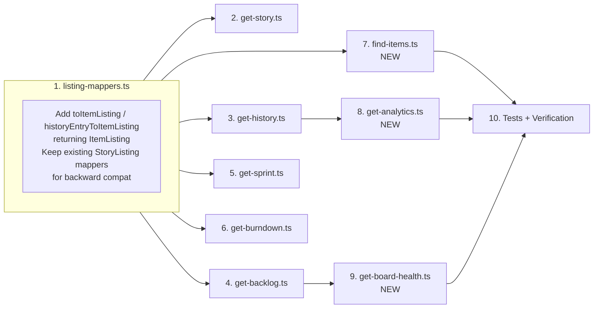
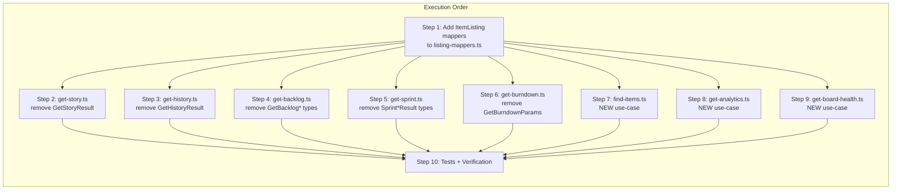

# Phase 4: Use-Case Migration — Execution Plan

**Phase Goal:** Migrate the 5 legacy use-case files (`get-story`, `get-history`, `get-backlog`, `get-sprint`, `get-burndown`) to eliminate private local type declarations, consolidate duplicated mappers, and create 3 new use-case files (`find-items`, `get-analytics`, `get-board-health`). All while keeping existing tool handlers compiling.

## Status Assessment

Based on inspection of the current codebase, here's what's already done (from Phases 0-3) and what remains for Phase 4:

### Already Complete ✓

- `listing-mappers.ts` exists with shared `storyToListing` and `historyEntryToListing` returning `StoryListing`
- All 3 old use-cases (get-backlog, get-sprint, get-history) already import from `listing-mappers.ts` — duplication resolved
- `SprintTotals` discriminated union in `ports.ts`
- `ItemListing`, `ItemDetailResult`, `AnalyticsResult`, `BacklogHealth` in `domain/types.ts`
- `StoryNotFoundError` in `domain/errors.ts`
- `FindItemsSchema`, `GetAnalyticsSchema`, `GetBoardHealthSchema` in `schemas/scrum.ts`
- `ItemFilter`, `ResolvedItemFilter`, `AnalyticsQuery` in `ports.ts`
- `FindItemsPort`, `AnalyticsPort`, `BoardHealthPort` in `ports.ts`

### Still Needed for Phase 4

1. **`listing-mappers.ts`** — currently returns `StoryListing`. Needs to ALSO provide `ItemListing`-returning mappers for new use-cases (find-items.ts).
2. **`get-story.ts`** — private `GetStoryResult` interface still present
3. **`get-history.ts`** — private `GetHistoryResult` interface still present
4. **`get-backlog.ts`** — private `GetBacklogResult` and `GetBacklogParams` still present
5. **`get-sprint.ts`** — private `SprintSingleResult` and `SprintAllResult` still present
6. **`get-burndown.ts`** — private `GetBurndownParams` still present
7. **`find-items.ts`** — new use-case (bridge via `FindItemsPort`)
8. **`get-analytics.ts`** — new use-case (bridge via `AnalyticsPort`)
9. **`get-board-health.ts`** — new use-case (bridge via `BoardHealthPort`)
10. **Tests** — must pass after migrations

## Dependency Order



## Execution Plan

---

### Step 1: `listing-mappers.ts` — Add `ItemListing` mappers

**File:** `src/scrum/listing-mappers.ts`

**Why first:** Every new use-case needs `ItemListing` mappers. Old use-cases keep using `StoryListing` mappers for backward compat.

**Changes:**

- Add `toItemListing(story): ItemListing` — same body as `storyToListing` but returns `ItemListing`
- Add `historyEntryToItemListing(story, sprintName): ItemListing` — same body as `historyEntryToListing` but returns `ItemListing`
- Keep existing `storyToListing` and `historyEntryToListing` unchanged (they still return `StoryListing`)

**`ItemListing` shape:**

```typescript
{
  ref: ResolvedRef & { key: string | null },  // same as StoryListing.ref
  title: string,                                // same
  status: string | null,                        // same
  story_points: number | null,                  // same
  priority: string | null,                      // same
  sprint: { name: string | null; ref: ResolvedRef },  // DIFFERENT: object, not string
  epic: { ref: ResolvedRef; name: string } | null,     // NEW field
  writable: boolean,                            // same
  has_dependencies: DependencyEntry[],          // same
}
```

**Key constraint:** `sprint` field type differs between `StoryListing` (`string | null`) and `ItemListing` (`{ name: string | null; ref: ResolvedRef }`). Old use-cases accessing `listing.sprint` as a string will break if we change the return type. So we keep both.

**Tests affected:** None at this step. No other file changes yet.

---

### Step 2: `get-story.ts` — Remove private `GetStoryResult`

**File:** `src/scrum/get-story.ts`

**Change:**

- Remove the `GetStoryResult` interface (lines 12-19)
- Change the return type annotation to `ItemDetailResult` from `../domain/types.ts`
- The `acceptance_criteria` field in `ItemDetailResult` is `string[]` (parsed AC text), not `Array<{ text, checked }>`. Update the return to flatten.
- Import `ItemDetailResult` from domain

**After:**

```typescript
import type { StoryPort } from "./ports.ts";
import type { ItemDetailResult, StoryRef } from "../domain/types.ts";
import { parseAcceptanceCriteria } from "../domain/rules/acceptance-criteria.ts";

export const getStoryUseCase = async (
  backend: StoryPort,
  ref: StoryRef,
): Promise<ItemDetailResult> => {
  const detail = await backend.getStoryDetail(ref);
  const acceptance_criteria = parseAcceptanceCriteria(detail.story.body);
  return {
    story: detail.story,
    comments: detail.comments,
    linkedPrs: detail.linkedPrs,
    acceptance_criteria: acceptance_criteria.map((ac) => ac.text),
  };
};
```

**Tests affected:** None directly (get-story has no test file currently). No scrum-read.ts changes needed.

---

### Step 3: `get-history.ts` — Remove private `GetHistoryResult`

**File:** `src/scrum/get-history.ts`

**Change:**

- Remove the `GetHistoryResult` interface (lines 19-23)
- Replace return type annotation with inline `{ sprints: SprintSnapshot[]; window: number; average_completed_points: number }` — or define it as an exported type in ports.ts
- The `SprintSnapshot` type is already imported from ports.ts
- Keep the function body identical

**After:**

```typescript
// Remove lines 19-23 (GetHistoryResult interface)
// Change line 79 from Promise<GetHistoryResult> to:
export const getHistoryUseCase = async (
  backend: HistoryBackend,
  scrumConfig: ScrumConfig,
  window: number,
): Promise<{ sprints: SprintSnapshot[]; window: number; average_completed_points: number }> => {
```

**Alternative:** Define an exported `GetHistoryResult` type in ports.ts. But since it's a legacy type that will be removed when the tool is removed, inline is cleaner.

**Note:** `GetHistoryResult` and `AnalyticsResult` are different shapes — we're not changing the return shape (yet), just removing the private interface.

**Tests:** Tests that assert on return shape must still pass since the shape hasn't changed.

---

### Step 4: `get-backlog.ts` — Remove private `GetBacklogResult` and `GetBacklogParams`

**File:** `src/scrum/get-backlog.ts`

**Change:**

- Remove `GetBacklogParams` interface (lines 24-30). Replace with `z.infer<typeof GetBacklogSchema>` from `../schemas/scrum.ts`.
- Remove `GetBacklogResult` interface (lines 32-38). Replace with inline return type annotation, using domain types where appropriate.
- The `BacklogHealth` type does NOT include `stories`, `epics`, or `orphan_impediments`, so we can't use it directly. Use inline type or extract to ports.ts.

**After:**

```typescript
import { GetBacklogSchema } from "../schemas/scrum.ts";
import { z } from "zod";

type BacklogParams = z.infer<typeof GetBacklogSchema>;

export const getBacklogUseCase = async (
  backend: BacklogBackend,
  scrumConfig: ScrumConfig,
  params: BacklogParams,
): Promise<{
  stories: StoryListing[];
  total_count: number;
  readiness: { ready: number; partially_ready: number; not_ready: number };
  orphan_impediments: ImpedimentListing[];
  epics: EpicListing[];
}> => {
```

**Tests affected:** Tests that import `getBacklogUseCase` and assert on return shape. No change to body, only type annotations, so tests pass.

---

### Step 5: `get-sprint.ts` — Remove private `SprintSingleResult` and `SprintAllResult`

**File:** `src/scrum/get-sprint.ts`

**Change:**

- Remove `SprintSingleResult` interface (lines 92-94) and `SprintAllResult` (lines 95-98)
- Replace return type annotation with inline union type

**After:**

```typescript
export const getSprintUseCase = async (
  backend: SprintBackend,
  sprintRef: SprintRef | "all",
  limit = 50,
): Promise<{ sprint: SprintSnapshot } | { sprints: SprintSnapshot[]; total_count: number }> => {
```

**Tests affected:** Tests already handle the union return type via `assertIsSingleResult` / `assertIsAllResult` helpers. These should still work. No runtime change.

---

### Step 6: `get-burndown.ts` — Remove private `GetBurndownParams`

**File:** `src/scrum/get-burndown.ts`

**Change:**

- Remove `GetBurndownParams` interface (lines 20-22)
- Replace with inline type: `{ sprint?: SprintRef }` or import from schemas

Since `GetBurndownSchema` already exists in schemas, we could use:

```typescript
type BurndownParams = z.infer<typeof GetBurndownSchema>;
```

But `GetBurndownSchema` wraps the sprint in an `optional()`, so `z.infer` gives `{ sprint?: SprintRef | undefined }`. The function body accesses `params.sprint ?? "current"`, so this works.

**Simpler approach:** Keep inline type since the function is deprecated and will be replaced by `get-analytics.ts`.

**After:**

```typescript
export const getBurndownUseCase = async (
  backend: BurndownBackend,
  _scrumConfig: ScrumConfig,
  params: { sprint?: SprintRef },
): Promise<BurndownResponse | { message: string }> => {
```

**Tests affected:** Tests that create params `{}` or `{ sprint: sprintName }` should still work.

---

### Step 7: `find-items.ts` — New use-case

**File:** `src/scrum/find-items.ts` (NEW)

**Purpose:** Bridge use-case that delegates to `FindItemsPort.findItems()`. Full implementation depends on the adapter implementing `findItems()` in P7.

```typescript
import type { FindItemsPort, ItemFilter, ResolvedItemFilter } from "./ports.ts";
import type { ItemSearchResult } from "../domain/types.ts";

export const findItemsUseCase = async (
  backend: FindItemsPort,
  filter: ItemFilter,
): Promise<ItemSearchResult> => {
  const resolved: ResolvedItemFilter = {
    scope: filter.scope ?? "all",
    keys: filter.keys ?? [],
    search: filter.search ?? "",
    types: filter.types ?? [],
    statuses: filter.statuses ?? [],
    priority: filter.priority ?? "",
    epic_id: filter.epic_id ?? "",
    labels: filter.labels ?? [],
    assignee: filter.assignee ?? "",
    sprint_ref: filter.sprint_ref ?? null,
    include_dependencies: filter.include_dependencies ?? false,
    limit: filter.limit ?? 50,
  };
  return backend.findItems(resolved);
};
```

**Note:** The adapter's `findItems()` is a stub that throws. This use-case will throw until P7. This is acceptable.

---

### Step 8: `get-analytics.ts` — New use-case

**File:** `src/scrum/get-analytics.ts` (NEW)

**Purpose:** Bridge use-case that delegates to `AnalyticsPort.getAnalytics()`.

```typescript
import type { AnalyticsPort, AnalyticsQuery } from "./ports.ts";
import type { AnalyticsResult } from "../domain/types.ts";

export const getAnalyticsUseCase = async (
  backend: AnalyticsPort,
  query: AnalyticsQuery,
): Promise<AnalyticsResult> => {
  return backend.getAnalytics(query);
};
```

**Note:** Adapter's `getAnalytics()` is a stub that throws until P7.

---

### Step 9: `get-board-health.ts` — New use-case

**File:** `src/scrum/get-board-health.ts` (NEW)

**Purpose:** Bridge use-case that delegates to `BoardHealthPort.getBoardHealth()`.

```typescript
import type { BoardHealthPort } from "./ports.ts";
import type { BacklogHealth } from "../domain/types.ts";

export const getBoardHealthUseCase = async (
  backend: BoardHealthPort,
  sprintScope: string,
): Promise<BacklogHealth> => {
  return backend.getBoardHealth(sprintScope);
};
```

**Note:** Adapter's `getBoardHealth()` is a stub that throws until P7.

---

### Step 10: Tests + Verification

**Run after every sub-step:**

```bash
deno lint
deno test --filter "get-story|get-history|get-backlog|get-sprint|get-burndown"
deno check src/index.ts
```

**Expected test outcomes:**

| Test file              | Status after P4 | Notes           |
| ---------------------- | --------------- | --------------- |
| `get-history.test.ts`  | ✅ Pass         | No shape change |
| `get-backlog.test.ts`  | ✅ Pass         | No shape change |
| `get-sprint.test.ts`   | ✅ Pass         | No shape change |
| `get-burndown.test.ts` | ✅ Pass         | No shape change |

**Verification gate:**

```bash
# Layer compliance — no inward adapter leaks
grep -r "import.*from.*adapters/github" src/scrum/ src/domain/ src/schemas/
# Must return zero matches

# TypeScript compilation
deno check src/index.ts

# All tests pass  
deno test
```

---

## Risk Assessment

| Subtask                    | Risk      | Mitigation                                                      |
| -------------------------- | --------- | --------------------------------------------------------------- |
| Step 1: listing-mappers.ts | 🟢 Low    | New code only, existing functions unchanged                     |
| Step 2: get-story.ts       | 🟢 Low    | `acceptance_criteria` type change is backward-compat at runtime |
| Step 3: get-history.ts     | 🟢 Low    | Inline type → same shape, just no named interface               |
| Step 4: get-backlog.ts     | 🟡 Medium | Schema import adds a dep on `src/schemas/`                      |
| Step 5: get-sprint.ts      | 🟢 Low    | Inline union type, no runtime change                            |
| Step 6: get-burndown.ts    | 🟢 Low    | Inline type, no runtime change                                  |
| Step 7-9: New use-cases    | 🟢 Low    | New files, no existing code changed                             |
| Step 10: Tests             | 🟡 Medium | If any test fails, rollback that step                           |

---

## Mermaid Execution Flow


