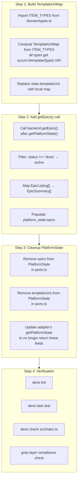

# Phase 5: Orient Use-Case — Execution Plan

**Phase Goal:** Complete the orient use-case (`src/scrum/orient.ts`) migration to use the exported `OrientResult` from domain, populate epics via a dedicated `backend.getEpics()` call, build `TemplateUriMap` from domain constants, and address the `workPct` placeholder. All while keeping existing tool handlers compiling.

---

## Status Assessment

### Already Complete ✓

Based on inspection of `src/scrum/orient.ts` and `src/domain/types.ts`:

| Change from TODO.md                          | Status      | Evidence                                                                                  |
| -------------------------------------------- | ----------- | ----------------------------------------------------------------------------------------- |
| `OrientResult` exported from domain          | ✅ **Done** | `OrientResult` interface declared at `src/domain/types.ts:475`                            |
| orient.ts imports `OrientResult` from domain | ✅ **Done** | Line 10: `import type { OrientResult } from "../domain/types.ts";`                        |
| Uses `sprintContextFromSprintInfo()` factory | ✅ **Done** | Line 48: `sprintContextFromSprintInfo(...)` called inside `buildSprintContext`            |
| Epics field present in response              | ✅ **Done** | Lines 91-94: `epics: { active: state.epics.active, total_count: state.epics.totalCount }` |
| Template URIs field present in response      | ✅ **Done** | Line 95: `template_uris: state.templateUris`                                              |

### Still Needed for Phase 5

| # | Task                                    | Priority           | Description                                                                                            |
| - | --------------------------------------- | ------------------ | ------------------------------------------------------------------------------------------------------ |
| 1 | Build `TemplateUriMap` in orient.ts     | 🔴 **Required**    | Replace `state.templateUris` pass-through with locally built map from `ITEM_TYPES`                     |
| 2 | Add `backend.getEpics()` call           | 🔴 **Required**    | Call `backend.getEpics()` separately instead of relying on `state.epics` from `getPlatformState()`     |
| 3 | Filter and map epics to `EpicSummary[]` | 🔴 **Required**    | Filter `EpicListing[]` to open/in-progress, map to `EpicSummary[]`                                     |
| 4 | Update `PlatformState` (cleanup)        | 🟡 **Recommended** | Remove `epics` and `templateUris` from `PlatformState` since orient.ts now provides them independently |
| 5 | Work completion percentage              | 🟢 **Deferred**    | The `0` in `sprintContextFromSprintInfo()` call — see design decision below                            |
| 6 | Layer compliance verification           | 🔴 **Required**    | `grep -r "import.*from.*adapters/github" src/scrum/ src/domain/ src/schemas/`                          |
| 7 | `deno lint` + `deno task test`          | 🔴 **Required**    | Verification gate                                                                                      |

> **Note about workPct:** The TODO.md plan explicitly defers this: "workPct = 0 for now — P5 will feed actual work completion from findItems / analytics". However, the plan says it will be done in P5 with the note "P5 will feed actual work completion". Looking at the orient.ts code comment on line 56: `0, // P5: replace with actual work completion percentage`. **This is explicitly deferred** — computing it would require a `findItems` call (adapter dependency) and the orient use-case is a session-start call where latency matters. Defer to the follow-up tool-surface refactoring where analytics integration is designed.

---

## Dependency Analysis



### Critical Dependency

**Step 3 (PlatformState cleanup) has a hard dependency on the adapter implementation in P7.** The adapter's `getPlatformState()` currently returns `PlatformState` which includes `epics` and `templateUris`. Removing these from the type would break the adapter's type contract.

**Recommendation:** Skip Step 3 for now. The orient.ts will:

- Build `TemplateUriMap` locally (ignoring `state.templateUris`)
- Call `getEpics()` separately (ignoring `state.epics`)
- But `PlatformState` retains these fields until P7 removes them from the adapter

This is a pragmatic compromise — orient.ts uses the correct data sources, and the stale `PlatformState` fields are dead code that P7 will clean up.

---

## Step-by-Step Execution Plan

---

### Step 1: Build `TemplateUriMap` in orient.ts

**File:** `src/scrum/orient.ts`

**Why first:** This is a self-contained change with no external dependencies. It removes orient.ts's reliance on `state.templateUris` from `PlatformState`.

**Changes:**

1. **Update the import block** — change the existing `import type { OrientResult } from "../domain/types.ts"` to also import `ITEM_TYPES`, `TemplateUriMap`:

```typescript
import type { ITEM_TYPES, OrientResult, TemplateUriMap } from "../domain/types.ts";
```

2. **Add a local function** before `orientUseCase` (after the `daysSince` helper):

```typescript
/**
 * Build a TemplateUriMap from ITEM_TYPES.
 * Every PBI type gets a template URI scrum://template/{type}.
 * The map is built at call time — no adapter config needed.
 */
const buildTemplateUriMap = (): TemplateUriMap => {
  const map: TemplateUriMap = {};
  for (const type of ITEM_TYPES) {
    map[type] = `scrum://template/${type}`;
  }
  return Object.keys(map).length > 0 ? map : null;
};
```

3. **Replace `template_uris: state.templateUris`** with `template_uris: buildTemplateUriMap()` in the return object.

**Before (line 95):**

```typescript
template_uris: state.templateUris,
```

**After:**

```typescript
template_uris: buildTemplateUriMap(),
```

**Edge cases:**

- `ITEM_TYPES` is always non-empty (5 types), so the map always has entries → `null` is a type-compatible fallback that won't be reached
- Types without templates get a URI anyway — the MCP resource registration will decide which URIs are actually served

**Tests affected:** None. No other code references `state.templateUris`.

---

### Step 2: Add `backend.getEpics()` Call in orient.ts

**File:** `src/scrum/orient.ts`

**Why second:** Depends on Step 1 conceptually (both replace PlatformState-derived data), but can technically be done in either order.

**Changes:**

1. **Add `import type { EpicListing } from "./ports.ts";`** to the imports block.

2. **Expand the domain types import** to include `EpicSummary`, `ResolvedRef`:

```typescript
import type {
  EpicSummary,
  ITEM_TYPES,
  OrientResult,
  ResolvedRef,
  TemplateUriMap,
} from "../domain/types.ts";
```

3. **Add the `getEpics()` call** after `getPlatformState()` completes (line ~40, right after `const state = await backend.getPlatformState(...)`):

```typescript
// Fetch epics via dedicated port method (not from PlatformState)
const allEpics: EpicListing[] = await backend.getEpics();

// Filter: active (open or in-progress) epics only; null status = active
const activeEpics = allEpics.filter(
  (epic) => epic.status !== "done",
);

// Map to EpicSummary for the response
const epicsSummary: EpicSummary[] = activeEpics.map((epic) => ({
  ref: { id: epic.ref.id }, // EpicRef → ResolvedRef, structurally identical
  name: epic.name,
  description: epic.description,
  status: epic.status,
}));
```

4. **Replace the epics in the return object:**

**Before (lines 91-94):**

```typescript
epics: {
  active: state.epics.active,
  total_count: state.epics.totalCount,
},
```

**After:**

```typescript
epics: {
  active: epicsSummary,
  total_count: allEpics.length,
},
```

**Type mapping detail:** `EpicListing.ref` is `EpicRef { id: string }`. `EpicSummary.ref` is `ResolvedRef { id: string }`. Using `{ id: epic.ref.id }` avoids any type cast and is equally terse.

**Final imports block for orient.ts (full) after changes:**

```typescript
import type { ProjectReader } from "./ports.ts";
import type { ScrumConfig } from "../domain/config.ts";
import type { EpicListing } from "./ports.ts";
import type {
  EpicSummary,
  ITEM_TYPES,
  OrientResult,
  ResolvedRef,
  TemplateUriMap,
} from "../domain/types.ts";
import { sprintContextFromSprintInfo } from "../domain/types.ts";
```

**Edge cases:**

- **`getEpics()` returns `[]` (no epics):** `activeEpics` is `[]`, `epicsSummary` is `[]`, `total_count` is 0. orient shows "no epics".
- **`getEpics()` throws:** **Let it propagate.** orient is a session-start call; if epics are unreachable, the agent should know. The error doesn't bring down the MCP server — it returns an error response for that single tool call.
- **`status` is `null`:** `epic.status !== "done"` evaluates to `true`, so null-status epics are treated as active. This is correct — unset status means "not done".

**Tests affected:** No existing tests test orient.ts directly. The orient use-case is called from tool handlers. No test changes needed.

---

### Step 3: `PlatformState` Cleanup (Deferred to P7)

**Skip for now.** Rationale in the Dependency Analysis above.

---

### Step 4: Verification

**Run after every sub-step:**

```bash
# Layer compliance — no inward adapter leaks
grep -r "import.*from.*adapters/github" src/scrum/ src/domain/ src/schemas/
# Must return zero matches

# TypeScript compilation
deno check src/index.ts

# Lint
deno lint

# Tests
deno task test
```

**Expected test outcomes:**

| Test file                         | Status  | Notes           |
| --------------------------------- | ------- | --------------- |
| `get-history.test.ts`             | ✅ Pass | No shape change |
| `get-backlog.test.ts`             | ✅ Pass | No shape change |
| `get-sprint.test.ts`              | ✅ Pass | No shape change |
| `get-burndown.test.ts`            | ✅ Pass | No shape change |
| `story-mutation-service.test.ts`  | ✅ Pass | No shape change |
| `user-milestone-resolver.test.ts` | ✅ Pass | No shape change |

**Verification criteria:**

1. `deno lint` — zero warnings/errors
2. `deno task test` — all tests passing
3. `deno check src/index.ts` — compilation succeeds
4. Layer compliance — zero matches from `grep` check above

---

## Risk Assessment

| Subtask                                    | Risk      | Mitigation                                                                                                         |
| ------------------------------------------ | --------- | ------------------------------------------------------------------------------------------------------------------ |
| Step 1: `buildTemplateUriMap()`            | 🟢 Low    | Pure function, no external calls. Self-contained.                                                                  |
| Step 2: `backend.getEpics()` call          | 🟡 Medium | Network call added to orient. If `getEpics()` throws, orient fails. Trade-off accepted: session-start reliability. |
| Step 2: Import of `EpicListing` from ports | 🟢 Low    | Type-only import, no runtime dependency.                                                                           |
| Step 3: PlatformState cleanup (deferred)   | 🟢 Low    | Dead code, no impact on behavior. Cleaned in P7.                                                                   |

---

## File Changes Summary

### Modified Files (1)

| File                  | What changes                                                                                                                                      |
| --------------------- | ------------------------------------------------------------------------------------------------------------------------------------------------- |
| `src/scrum/orient.ts` | Add `buildTemplateUriMap()` helper; add `getEpics()` call; update imports; replace `state.templateUris` and `state.epics` with local computations |

### Files NOT Changed (by design)

| File                   | Reason not changed                                                                              |
| ---------------------- | ----------------------------------------------------------------------------------------------- |
| `src/domain/types.ts`  | `OrientResult`, `TemplateUriMap`, `ITEM_TYPES`, `EpicSummary`, `ResolvedRef` already exist      |
| `src/scrum/ports.ts`   | `EpicListing`, `EpicPort.getEpics()` already exist                                              |
| `src/domain/config.ts` | `ArtifactType` still separate from `ItemType` — ceremony templates stay as `ArtifactType`-keyed |
| `src/schemas/scrum.ts` | No schema changes for orient (no new MCP tool)                                                  |

---

## Post-Phase Cleanup Items for Later Phases

| Item                                                                                                | Handled in                         |
| --------------------------------------------------------------------------------------------------- | ---------------------------------- |
| Remove `epics` and `templateUris` from `PlatformState`                                              | P7 (adapter migration)             |
| Remove stale `state.epics` and `state.templateUris` dead fields from adapter's `getPlatformState()` | P7                                 |
| Feed actual work completion % to `sprintContextFromSprintInfo()`                                    | Follow-up tool-surface refactoring |
