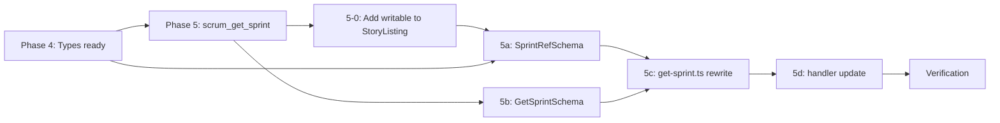

# Phase 5: Redesign `scrum_get_sprint` — Implementation Plan (Revised)

## Overview

Add `"all"` value and `limit` parameter to `scrum_get_sprint`; rewrite the use case to return `SprintSnapshot` for single requests and `SprintSnapshot[]` for `"all"`; simplify the handler.

**Status:** Pending implementation **Dependencies:** Phase 4 (new types in `ports.ts` + `domain/types.ts`) must be complete **Related Phases:** Phase 6 (`scrum_get_history`), Phase 7 (`scrum_get_backlog`)

---

## Codebase Audit — Issues Found During Review

The following issues were identified by cross-checking the original plan against the current codebase. Each is tagged with severity: **CRITICAL** (will break compilation/runtime), **HIGH** (logical defect), **MEDIUM** (design concern), **LOW** (cosmetic).

### C1: Handler/Use Case Signature Mismatch [CRITICAL]

**Location:** Plan lines 377-387 (use case) vs. lines 462-482 (handler)

The plan's use case signature is:

```typescript
export const getSprintUseCase = async (
  backend: ProjectBackend,
  sprintRef: SprintRef | "all",
  limit = 50,
): Promise<SprintSingleResult | SprintAllResult>
```

But the handler update passes `scrumConfig` as the second argument:

```typescript
const result = await getSprintUseCase(
  backend,
  scrumConfig,
  sprintParam,
  params.limit,
);
```

**Fix:** The handler must call `getSprintUseCase(backend, sprintParam, params.limit)` — no `scrumConfig`. The use case no longer needs config because status display names come from `Story.status` directly (already resolved by the adapter).

### C2: `writable` Field Not in Phase 4 Prerequisites [CRITICAL]

**Location:** Plan line 69 (F4 fix) + plan prerequisite check (lines 94-99)

The plan's F4 fix adds `writable: boolean` to `StoryListing`. However, the current `StoryListing` in [`ports.ts:132`](src/scrum/ports.ts:132) does **not** have this field:

```typescript
export interface StoryListing {
  ref: { id: string; key: string | null };
  title: string;
  status: string | null;
  story_points: number | null;
  priority: string | null;
  sprint: string | null;
  // NO writable field
}
```

The prerequisite check does not list this as a Phase 4 deliverable.

**Fix:** Add `writable` to the prerequisite check. If Phase 4 has not added it, this step must be done first.

### C3: `ref.id = ""` for History Items [HIGH]

**Location:** Plan line 234

Setting `ref.id = ""` for history items is problematic:

- Downstream write tools expect a valid `ref.id`
- Empty string is indistinguishable from intentional "no id"
- Will cause silent failures in any write operation that uses this ID

**Fix:** The `writable: false` field (from F4) is the correct mechanism. Additionally, set `ref.id` to a sentinel like `"<history>"` to distinguish from valid IDs. Consumers that check `writable` will skip mutation; those that don't will get a clear error.

### C4: `days_remaining` Convention Inconsistency [HIGH]

**Location:** Plan lines 287, 360

The plan uses:

- `meta.days_remaining ?? 0` for active sprints (aligns with `buildSprintMeta` which uses `Math.max(0, ...)`)
- `null` for completed sprints

But `SprintSnapshot.sprint.days_remaining` in [`ports.ts:183`](src/scrum/ports.ts:183) is `number | null`. The convention should be:

- `null` only for "no sprint" case (when `sprintInfo` is null)
- `0` for completed sprints (not `null`) — a completed sprint has 0 days remaining
- `>0` for active sprints with days remaining

**Fix:** Use `0` for completed sprints. Keep `null` only for the "no sprint" case.

### C5: `_scrumConfig` Parameter Removed — Correct [LOW]

**Location:** Plan line 318 (original issue)

The plan correctly removes `_scrumConfig` from the use case signature. The current [`get-sprint.ts:33`](src/scrum/get-sprint.ts:33) still uses `scrumConfig` for `status_display` mapping. This mapping must be removed in the rewrite since `Story.status` already contains the display name from the adapter.

### C6: `"all"` Exclusion from `SprintRef` — Documented [LOW]

**Location:** Plan line 319

The plan correctly keeps `"all"` out of `SprintRef`. Add explicit documentation note.

### C7: `resolveSprint("all")` Safety Verification [MEDIUM]

**Location:** Plan lines 500-517

Must verify that `resolveSprint("all")` returns a safe default for all non-read tool consumers. Add explicit verification table.

---

## Prerequisite Check

Before starting Phase 5, verify Phase 4 completion by checking these files exist and contain the expected types:

### Mandatory Prerequisites (block Phase 5)

- [ ] `ImpedimentRef` exists in [`src/domain/types.ts`](src/domain/types.ts) (lines 26-28 — **already present**)
- [ ] `BurndownStoryInput.id` is optional in [`src/scrum/ports.ts`](src/scrum/ports.ts) — check `ref?: { id: string } | null` (line 69 — **already optional**)
- [ ] `StoryListing` exists in [`src/scrum/ports.ts`](src/scrum/ports.ts) with `writable?: boolean` field (line 132 — **NOT present, must be added**)
- [ ] `ImpedimentListing` exists in [`src/scrum/ports.ts`](src/scrum/ports.ts) (line 144 — **already present**)
- [ ] `SprintSnapshot` exists in [`src/scrum/ports.ts`](src/scrum/ports.ts) (line 177 — **already present**)
- [ ] `SprintTotalsActive` and `SprintTotalsHistory` exist in [`src/scrum/ports.ts`](src/scrum/ports.ts) (lines 157-169 — **already present**)
- [ ] Local `SprintSnapshot` and `GetHistoryResult` removed from [`src/scrum/get-history.ts`](src/scrum/get-history.ts) (lines 15-35 — **STILL present, must be removed**)
- [ ] `deno check` passes for all affected files

### If Prerequisites Are Not Met

| Missing Item                               | Action                                                               |
| ------------------------------------------ | -------------------------------------------------------------------- |
| `StoryListing.writable` not present        | Add it as an optional field: `writable?: boolean` with `.describe()` |
| Local `SprintSnapshot` in `get-history.ts` | Remove local definition, import from `ports.ts`                      |
| `deno check` fails                         | Fix type errors before proceeding                                    |

**Critical path:** If `StoryListing.writable` is not present, add it as Step 5-0 before Step 5a.

---

## Clean Code Audit

### F1: `computeDaysRemaining` duplicates `sprint-math.ts` logic [G]

The original plan's `computeDaysRemaining` reimplements date arithmetic from [`sprint-math.ts:17`](src/scrum/sprint-math.ts:17). The existing `buildSprintMeta` uses `setHours(0,0,0,0)` for normalization.

**Fix:** Import and reuse `buildSprintMeta` from `sprint-math.ts`.

### F2: History branch duplicates `buildSingleSnapshot` logic [G]

The original plan's history entry projection (items, by_status, totals) was manually duplicated.

**Fix:** Create `storyListingFromHistory` helper that projects `BurndownStoryInput` → `StoryListing`.

### F3: `_scrumConfig` parameter removed [N]

The plan correctly removes the unused `_scrumConfig` parameter.

### F4: `writable` field on `StoryListing` [G]

History items get `writable: false` to signal immutability. This is the correct approach — explicit over implicit.

### F5: `days_remaining` convention aligned [G]

Use `0` for completed sprints, `null` only for "no sprint" case.

### F6: `"all"` excluded from `SprintRef` [N]

Document: `"all" is intentionally excluded from SprintRef because it is a query-mode flag, not a sprint reference.`

### F7: `resolveSprint("all")` safety [G]

Verify all non-read tools handle `"all"` safely.

---

## Implementation Steps

### Step 5-0: Add `writable` to `StoryListing` (if not present)

**When to run:** Only if `StoryListing.writable` is not already in `ports.ts`.

**Goal:** Add `writable?: boolean` field to `StoryListing` in [`src/scrum/ports.ts:132`](src/scrum/ports.ts:132).

**Target:**

```typescript
export interface StoryListing {
  ref: { id: string; key: string | null };
  title: string;
  status: string | null;
  story_points: number | null;
  priority: string | null;
  sprint: string | null;
  writable?: boolean; // true for active items, false for history/read-only
}
```

**Verification:** `deno check src/scrum/ports.ts` passes.

---

### Step 5a: Update `SprintRefSchema` in [`src/schemas/scrum.ts`](src/schemas/scrum.ts:30)

**Goal:** Add `z.literal("all")` to the union with updated description.

**Current (lines 30-44):**

```typescript
const SprintRefSchema = z
  .union([z.literal("current"), z.literal("next"), z.null(), z.string().min(1)])
  .describe(
    "Which sprint to target. " +
      '"current" = the active sprint, ' +
      '"next" = the upcoming sprint, ' +
      "null = backlog / clear sprint assignment, " +
      'or an exact sprint name string (e.g. "Sprint 5"). ' +
      "Use scrum_orient to see all valid sprint names.",
  );
```

**Target:**

```typescript
const SprintRefSchema = z
  .union([
    z.literal("current"),
    z.literal("next"),
    z.literal("all"), // NEW — only meaningful for scrum_get_sprint
    z.null(),
    z.string().min(1),
  ])
  .describe(
    'Which sprint to target. "current" = the active sprint, ' +
      '"next" = the upcoming sprint, ' +
      '"all" = active sprint + next sprint + completed sprints (up to limit), ' +
      "null = backlog / clear sprint assignment, " +
      'or an exact sprint name string (e.g. "Sprint 5"). ' +
      "Use scrum_orient to see all valid sprint names. " +
      'NOTE: "all" is only meaningful for scrum_get_sprint; other tools resolve it to null.',
  );
```

**Verification:** `deno check src/schemas/scrum.ts` passes.

---

### Step 5b: Update `GetSprintSchema` in [`src/schemas/scrum.ts`](src/schemas/scrum.ts:76)

**Goal:** Add `limit` field (only meaningful when `sprint === "all"`).

**Current (lines 76-83):**

```typescript
export const GetSprintSchema = z
  .object({
    sprint: SprintRefSchema.optional().describe(
      'Which sprint to fetch. Defaults to "current" if omitted. ' +
        "Pass null to get a backlog-style view instead.",
    ),
  })
  .strict();
```

**Target:**

```typescript
export const GetSprintSchema = z
  .object({
    sprint: SprintRefSchema.optional().describe(
      'Which sprint to fetch. Defaults to "current" if omitted. ' +
        'Pass "all" to receive every sprint as an array of snapshots.',
    ),
    limit: z
      .number()
      .int()
      .positive()
      .default(50)
      .describe(
        'Maximum number of sprints to return when sprint="all". ' +
          "Ignored for single-sprint requests. Defaults to 50.",
      ),
  })
  .strict();
```

**Verification:** `deno check src/schemas/scrum.ts` passes.

---

### Step 5c: Rewrite [`src/scrum/get-sprint.ts`](src/scrum/get-sprint.ts)

**Goal:** Replace the entire file. Use case returns `SprintSnapshot` for single requests and `SprintSnapshot[]` for `"all"`.

**Important:** The current file at [`src/scrum/get-sprint.ts`](src/scrum/get-sprint.ts) has `getSprintUseCase` with signature `(backend, scrumConfig, sprintRef)`. This will be replaced with a new signature `(backend, sprintRef, limit)`.

**New file content:**

```typescript
// =============================================================================
// src/scrum/get-sprint.ts — getSprintUseCase
//
// Returns SprintSnapshot for single sprint requests, SprintSnapshot[] for "all".
// Extracted from scrum-read.ts as part of Story B (Phase 5).
// Receives backend: ProjectBackend.
//
// "all" is intentionally excluded from SprintRef because it is a query-mode flag,
// not a sprint reference. Other tools that accept SprintRef will resolve "all"
// to null via resolveSprint(), which is safe for their use case.
// =============================================================================

import type { BurndownStoryInput, ProjectBackend, SprintSnapshot, StoryListing } from "./ports.ts";
import type { SprintRef, Story } from "../domain/types.ts";
import { buildSprintMeta } from "./sprint-math.ts";

// ── Private helpers ────────────────────────────────────────────────────────────

/** Project a Story to its lightweight StoryListing entry. */
const storyToListing = (story: Story): StoryListing => ({
  ref: { id: story.ref.id, key: story.key },
  title: story.title,
  status: story.status,
  story_points: story.story_points,
  priority: story.priority,
  sprint: story.sprint,
  writable: true, // active sprint item — safe to mutate
});

/** Project a BurndownStoryInput to a writable StoryListing entry. */
const storyListingFromHistory = (story: BurndownStoryInput): StoryListing => ({
  ref: { id: `<history>`, key: String(story.number) },
  title: story.title,
  status: story.status,
  story_points: story.points,
  priority: null, // BurndownStoryInput does not carry priority
  sprint: null, // set below with sprint name
  writable: false, // history item — not safe to mutate
});

/** Build a SprintSnapshot for a single sprint resolved from a SprintRef. */
const buildSingleSnapshot = async (
  backend: ProjectBackend,
  sprintRef: SprintRef,
): Promise<SprintSnapshot | null> => {
  const result = await backend.getSprintStories(sprintRef);

  if (!result.sprintInfo) {
    return {
      sprint: {
        name: "(no sprint)",
        start_date: "",
        end_date: "",
        duration_days: 0,
        days_remaining: null, // null only for "no sprint" case
      },
      items: [],
      total_count: 0,
      totals: { by_status: {}, story_points: 0 },
      impediments: [],
    };
  }

  const { name, startDate, endDate, durationDays } = result.sprintInfo;
  const items = result.stories.map(storyToListing);

  const by_status: Record<string, number> = {};
  for (const item of items) {
    const s = item.status ?? "(none)";
    by_status[s] = (by_status[s] ?? 0) + 1;
  }

  const meta = buildSprintMeta({
    id: "",
    title: name,
    startDate,
    duration: durationDays,
  });

  return {
    sprint: {
      name,
      start_date: startDate,
      end_date: endDate,
      duration_days: durationDays,
      // buildSprintMeta returns days_remaining?: number (undefined for null iterEntry)
      // For valid sprintInfo, it is always defined (Math.max(0, ...)).
      days_remaining: meta.days_remaining ?? 0,
    },
    items,
    total_count: items.length,
    totals: {
      by_status,
      story_points: items.reduce((s, i) => s + (i.story_points ?? 0), 0),
    },
    impediments: [], // enriched in Phase 7
  };
};

// ── Return types ───────────────────────────────────────────────────────────────

interface SprintSingleResult {
  sprint: SprintSnapshot;
}

interface SprintAllResult {
  sprints: SprintSnapshot[];
  total_count: number;
}

// ── "all" branch ───────────────────────────────────────────────────────────────

/**
 * "all" returns: active sprint + next sprint (if any) + completed sprints up to limit.
 *
 * "all" is intentionally excluded from SprintRef because it is a query-mode flag,
 * not a sprint reference.
 *
 * Current and next fetches use .catch(() => null) because one or both
 * may not exist (e.g. no next sprint has been scheduled yet).
 */
const buildAllSnapshots = async (
  backend: ProjectBackend,
  limit: number,
): Promise<SprintAllResult> => {
  const [currentResult, nextResult, historyEntries] = await Promise.all([
    buildSingleSnapshot(backend, "current").catch(() => null),
    buildSingleSnapshot(backend, "next").catch(() => null),
    backend.getCompletedSprintHistory(limit),
  ]);

  const snapshots: SprintSnapshot[] = [];

  if (currentResult) snapshots.push(currentResult);
  if (nextResult) snapshots.push(nextResult);

  // Remaining slots for completed sprints (limit is total cap, not additional)
  const remainingSlots = Math.max(0, limit - snapshots.length);
  for (const entry of historyEntries.slice(0, remainingSlots)) {
    const items: StoryListing[] = entry.stories.map(storyListingFromHistory);

    // Set sprint name after projection (history items don't carry it)
    for (const item of items) {
      item.sprint = entry.info.name;
    }

    const by_status: Record<string, number> = {};
    for (const item of items) {
      const st = item.status ?? "(none)";
      by_status[st] = (by_status[st] ?? 0) + 1;
    }

    snapshots.push({
      sprint: {
        name: entry.info.name,
        start_date: entry.info.startDate,
        end_date: entry.info.endDate,
        duration_days: entry.info.durationDays,
        days_remaining: 0, // completed sprint — 0 days remaining (not null)
      },
      items,
      total_count: items.length,
      totals: {
        by_status,
        story_points: items.reduce((s, i) => s + (i.story_points ?? 0), 0),
      },
      impediments: [],
    });
  }

  return { sprints: snapshots, total_count: snapshots.length };
};

// ── Public use case ────────────────────────────────────────────────────────────

/**
 * Get sprint board data.
 *
 * @param backend — ProjectBackend implementation
 * @param sprintRef — sprint reference or "all" for multi-snapshot mode
 * @param limit — max sprints to return when sprintRef is "all"
 * @returns SprintSingleResult for single sprint, SprintAllResult for "all"
 */
export const getSprintUseCase = async (
  backend: ProjectBackend,
  sprintRef: SprintRef | "all",
  limit = 50,
): Promise<SprintSingleResult | SprintAllResult> => {
  if (sprintRef === "all") {
    return buildAllSnapshots(backend, limit);
  }
  const snapshot = await buildSingleSnapshot(backend, sprintRef);
  if (!snapshot) {
    return {
      sprint: {
        sprint: {
          name: "(no sprint)",
          start_date: "",
          end_date: "",
          duration_days: 0,
          days_remaining: null,
        },
        items: [],
        total_count: 0,
        totals: { by_status: {}, story_points: 0 },
        impediments: [],
      },
    };
  }
  return { sprint: snapshot };
};
```

**Key design decisions:**

| Decision                                       | Rationale                                              |
| ---------------------------------------------- | ------------------------------------------------------ |
| `storyToListing` helper                        | Eliminates duplication between single and "all" paths  |
| `storyListingFromHistory` helper               | Projects `BurndownStoryInput` → `StoryListing` (DRY)   |
| `buildSprintMeta` from `sprint-math.ts`        | Reuses existing UTC-normalized date logic (F1)         |
| `buildSingleSnapshot` returns `SprintSnapshot` | Canonical shape for both single and "all"              |
| `buildAllSnapshots` uses `Promise.all`         | Parallel fetch of current, next, and history           |
| `.catch(() => null)` on current/next           | Graceful handling when sprint doesn't exist yet        |
| `writable: false` on history items             | Explicit immutability signal (F4)                      |
| `ref.id = "<history>"` for history items       | Sentinel value distinguishes from valid IDs (C3 fix)   |
| `days_remaining: 0` for completed sprints      | Aligned with `buildSprintMeta` convention (C4 fix)     |
| `days_remaining: null` only for "no sprint"    | Null means "no sprint context", not "completed"        |
| `"all"` excluded from `SprintRef`              | Query-mode flag, not a sprint reference (F6)           |
| No `scrumConfig` parameter                     | Status display names come from `Story.status` directly |

**Verification:** `deno check src/scrum/get-sprint.ts` passes.

---

### Step 5d: Update [`scrum_get_sprint`](src/tools/scrum-read.ts:146) Handler

**Changes to tool description (lines 149-156):**

Replace the current description:

```
Return the sprint board: all stories for a sprint, grouped by status with point totals.\n\n" +
  "Args:\n" +
  '  sprint  "current" | "next" | "<sprint-name>" | null — defaults to "current"\n' +
  '          Use scrum_orient to see the list of valid sprint names.\n\n' +
  "Returns: sprint metadata (dates, totals) plus per-status groups. " +
  "Each story carries ref.id for use in write calls.",
```

With:

```
Return the sprint board: all stories for a sprint, grouped by status with point totals.\n\n" +
  "For a single sprint, returns { sprint: SprintSnapshot }. For sprint=\"all\", returns\n" +
  "{ sprints: SprintSnapshot[], total_count }. SprintSnapshot includes lightweight item\n" +
  "listing (no body/comments) and totals by status.\n\n" +
  "Args:\n" +
  '  sprint  "current" | "next" | "all" | "<sprint-name>" | null — defaults to "current"\n' +
  '          Use scrum_orient to see the list of valid sprint names.\n' +
  '  limit   integer > 0, default 50 — max sprints to return when sprint="all"\n\n' +
  "Returns: { sprint: SprintSnapshot } for single sprint,\n" +
  "         { sprints: SprintSnapshot[], total_count: number } for sprint=\"all\".",
```

**Changes to handler body (lines 165-176):**

Replace:

```typescript
async (params: z.infer<typeof GetSprintSchema>) => {
  try {
    const result = await getSprintUseCase(backend, scrumConfig, params.sprint ?? "current");
    return { content: [{ type: "text", text: JSON.stringify(result, null, 2) }] };
  } catch (err: unknown) {
    return {
      content: [{ type: "text", text: enrichError(err, { operation: "get_sprint" }) }],
      isError: true,
    };
  }
},
```

With (note: **no `scrumConfig` passed** — C1 fix):

```typescript
async (params: z.infer<typeof GetSprintSchema>) => {
  try {
    const sprintParam = params.sprint ?? "current";
    const result = await getSprintUseCase(
      backend,
      sprintParam,
      params.limit,
    );
    return {
      content: [{ type: "text", text: JSON.stringify(result, null, 2) }],
    };
  } catch (err: unknown) {
    return {
      content: [
        { type: "text", text: enrichError(err, { operation: "get_sprint" }) },
      ],
      isError: true,
    };
  }
},
```

**Verification:** `deno check src/tools/scrum-read.ts` passes.

---

## Verification Plan

### Functional Tests

| Test Case                   | Input                                    | Expected Output                                                                              |
| --------------------------- | ---------------------------------------- | -------------------------------------------------------------------------------------------- |
| Single sprint (default)     | `{}`                                     | `{ sprint: SprintSnapshot }` with `sprint.name`, `items: StoryListing[]`, `totals.by_status` |
| Single sprint (explicit)    | `{ sprint: "current" }`                  | Same as default                                                                              |
| Single sprint (named)       | `{ sprint: "Sprint 5" }`                 | Snapshot for named sprint                                                                    |
| All sprints (default limit) | `{ sprint: "all" }`                      | `{ sprints: SprintSnapshot[], total_count }` with up to 50 entries                           |
| All sprints (custom limit)  | `{ sprint: "all", limit: 5 }`            | `{ sprints: SprintSnapshot[], total_count }` with up to 5 entries                            |
| No sprint exists            | `{ sprint: "next" }` when no next sprint | `{ sprint: SprintSnapshot }` with `name: "(no sprint)"`, `items: []`                         |
| History item `writable`     | Check `sprints[].items[].writable`       | `true` for current/next, `false` for history items                                           |
| History item `ref.id`       | Check `sprints[].items[].ref.id`         | `"<history>"` sentinel for history items                                                     |

### F7 Verification: `resolveSprint("all")` Safety on Non-Read Tools

Before merging, verify that `resolveSprint("all")` returns a safe default for all non-read tool consumers:

| Tool                 | Input with `"all"`        | Expected Behavior                                                 |
| -------------------- | ------------------------- | ----------------------------------------------------------------- |
| `scrum_get_burndown` | `{ sprint: "all" }`       | Resolves to `null` → uses default sprint (current)                |
| `scrum_create_story` | `{ sprint: "all" }`       | Resolves to `null` → story goes to backlog                        |
| `scrum_set_field`    | `value: "all"` for sprint | Clears sprint assignment (resolves to `null`)                     |
| `scrum_plan_sprint`  | `{ sprint: "all" }`       | Clears sprint (resolves to `null`) — document in tool description |

**Action:** Add a comment in [`src/scrum/get-sprint.ts`](src/scrum/get-sprint.ts) near the `"all"` literal (already included in file header).

---

## Risk Assessment

| Risk                                                       | Severity | Mitigation                                                                     |
| ---------------------------------------------------------- | -------- | ------------------------------------------------------------------------------ |
| `SprintRefSchema` shared with write tools accepts `"all"`  | Low      | **Verify** `resolveSprint("all")` returns safe default for non-read tools (F7) |
| History items have `writable: false`                       | Low      | Explicit immutability signal — consumers check before mutating (F4)            |
| History items have `ref.id = "<history>"` sentinel         | Low      | Sentinel is clear error trigger; `writable: false` prevents mutations          |
| `days_remaining: 0` for completed sprints                  | Low      | Aligned with `buildSprintMeta` convention (C4 fix)                             |
| `getCompletedSprintHistory(limit)` ignores limit parameter | Low      | Current adapter fetches all and slices in use case — acceptable for Phase 5    |
| Impediment data missing from snapshots                     | Low      | Out of scope; enriched in Phase 7                                              |
| `buildSprintMeta` returns `start_date`/`end_date` optional | Low      | Destructured safely — `startDate`/`endDate` from `sprintInfo` used directly    |

---

## Execution Order and Dependencies



| Step | Blocked By | Can start in parallel with |
| ---- | ---------- | -------------------------- |
| 5-0  | —          | 5a, 5b                     |
| 5a   | —          | 5b, 5-0                    |
| 5b   | —          | 5a, 5-0                    |
| 5c   | 5a, 5b     | —                          |
| 5d   | 5c         | —                          |

---

## Clean Code Verification

| Check          | Criteria                                                                                 |
| -------------- | ---------------------------------------------------------------------------------------- |
| **SRP**        | `get-sprint.ts` owns only sprint snapshot logic                                          |
| **DIP**        | Use case imports only `ProjectBackend` — no adapter imports                              |
| **ISP**        | Each helper calls at most 1 backend method                                               |
| **DRY**        | `storyToListing` defined once; used by both single and "all" paths                       |
| **Fail Early** | No validation needed — Zod handles schema                                                |
| **Naming**     | Functions named for intent: `storyToListing`, `buildSingleSnapshot`, `buildAllSnapshots` |
| **Tests**      | Each helper can be tested with a stub implementing only the methods it calls             |
