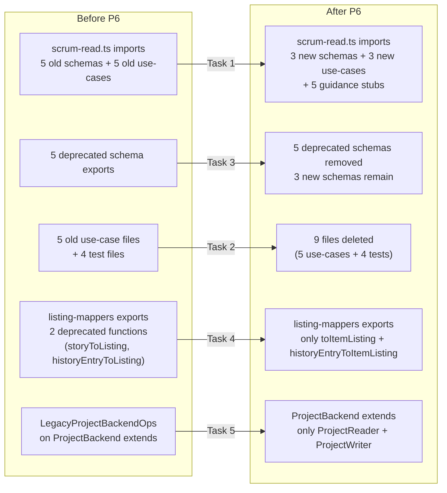

# Phase 6: Tool Handler Migration — Execution Plan

**Phase Goal:** Replace 5 old MCP tools with 3 new unified tools in `src/tools/scrum-read.ts`, delete 5 old use-case files (plus 4 test files), clean up dead types from ports and schemas, and clean up the shared mapper. New tools delegate to new use-cases which throw stubs until P7 implements the adapter methods.

---

## Status Assessment

### Phases 0–5 Completion

| Phase | Description                | Status          | Notes                                                                                         |
| ----- | -------------------------- | --------------- | --------------------------------------------------------------------------------------------- |
| P0    | Adapter Infrastructure     | ✅ **Complete** | `capabilities.ts`, `abstract-backend.ts`, `factory.ts` all exist                              |
| P1    | Domain Types               | ✅ **Complete** | All types in `types.ts`; `StoryNotFoundError` in `errors.ts`                                  |
| P2    | Port Types                 | ✅ **Complete** | Narrow ports added; `LegacyProjectBackendOps` still present                                   |
| P3    | Schema Types               | ✅ **Complete** | New schemas exist; old schemas marked `@deprecated`                                           |
| P4    | Use-Case Migration         | ✅ **Complete** | `find-items.ts`, `get-analytics.ts`, `get-board-health.ts` exist; old use-cases still present |
| P5    | Orient Use-Case            | ✅ **Complete** | orient.ts already uses exported `OrientResult`, `buildTemplateUriMap()`, and `getEpics()`     |
| P6    | **Tool Handler Migration** | ⬜ **Pending**  | ❗ See below                                                                                  |

### Current State Analysis

**What exists and needs to be removed (5 old tools):**

| Old Tool             | Handler File          | Schema              | Use-Case File     | Test File              |
| -------------------- | --------------------- | ------------------- | ----------------- | ---------------------- |
| `scrum_get_sprint`   | scrum-read.ts:179-217 | `GetSprintSchema`   | `get-sprint.ts`   | `get-sprint.test.ts`   |
| `scrum_get_backlog`  | scrum-read.ts:131-175 | `GetBacklogSchema`  | `get-backlog.ts`  | `get-backlog.test.ts`  |
| `scrum_get_burndown` | scrum-read.ts:258-297 | `GetBurndownSchema` | `get-burndown.ts` | `get-burndown.test.ts` |
| `scrum_get_history`  | scrum-read.ts:76-127  | `GetHistorySchema`  | `get-history.ts`  | `get-history.test.ts`  |
| `scrum_get_template` | scrum-read.ts:301-338 | `GetTemplateSchema` | `get-template.ts` | _(none)_               |

**What persists (3 kept tools):**

| Tool              | Handler               | Notes                         |
| ----------------- | --------------------- | ----------------------------- |
| `scrum_orient`    | scrum-read.ts:40-72   | ✅ Stays — entry point        |
| `scrum_get_story` | scrum-read.ts:220-254 | ✅ Stays — single item detail |

**What needs to be added (3 new tools):**

| New Tool                 | Schema                                                  | Use-Case                       |
| ------------------------ | ------------------------------------------------------- | ------------------------------ |
| `scrum_find_items`       | `FindItemsSchema` (exists at schemas/scrum.ts:209)      | `find-items.ts` (exists)       |
| `scrum_get_analytics`    | `GetAnalyticsSchema` (exists at schemas/scrum.ts:271)   | `get-analytics.ts` (exists)    |
| `scrum_get_board_health` | `GetBoardHealthSchema` (exists at schemas/scrum.ts:297) | `get-board-health.ts` (exists) |

---

## Architecture Decision: Guidance Stubs

The TODO.md specifies: "The 5 removed tool names produce clear error messages pointing to the replacement."

**Approach:** Replace the old tool registrations with guidance-stub handlers that return descriptive error messages like:

> `scrum_get_sprint` has been replaced by `scrum_find_items({ scope: "sprint" })`.

This is better than removing tools silently — agents will get immediate guidance rather than "tool not found" errors.

---

## Task Breakdown

```mermaid
flowchart TD
  subgraph Task1["Task 1: Rewrite scrum-read.ts"]
    T1a["Remove 6 old imports\n(old schemas + old use-cases)"]
    T1b["Add 3 new imports\n(new schemas + new use-cases)"]
    T1c["Replace 5 old handlers\nwith guidance stubs"]
    T1d["Add 3 new handlers\nscrum_find_items, scrum_get_analytics\nscrum_get_board_health"]
  end

  subgraph Task2["Task 2: Delete old use-case files"]
    T2a["Delete get-sprint.ts\nDelete get-sprint.test.ts"]
    T2b["Delete get-backlog.ts\nDelete get-backlog.test.ts"]
    T2c["Delete get-burndown.ts\nDelete get-burndown.test.ts"]
    T2d["Delete get-history.ts\nDelete get-history.test.ts"]
    T2e["Delete get-template.ts"]
  end

  subgraph Task3["Task 3: Clean up schemas"]
    T3a["Remove GetSprintSchema export"]
    T3b["Remove GetBacklogSchema export"]
    T3c["Remove GetBurndownSchema export"]
    T3d["Remove GetHistorySchema export"]
    T3e["Remove GetTemplateSchema export"]
  end

  subgraph Task4["Task 4: Clean up listing-mappers.ts"]
    T4a["Remove storyToListing\n(only used by old get-backlog/get-sprint)"]
    T4b["Remove historyEntryToListing\n(only used by old get-history/get-sprint)"]
    T4c["Keep toItemListing + historyEntryToItemListing\n(for future find-items use)"]
  end

  subgraph Task5["Task 5: Clean up ports.ts"]
    T5a["Remove LegacyProjectBackendOps interface"]
    T5b["Remove from ProjectBackend extends clause"]
    T5c["Remove SprintHistoryEntry type\n(only used by legacy ops)"]
    T5d["Remove BurndownInput type\n(only used by legacy ops)"]
    T5e["Remove CompletionMap type\n(only used by legacy ops)"]
  end

  subgraph Task6["Task 6: Verification"]
    V1["deno lint — zero warnings"]
    V2["deno task test — all passing"]
    V3["deno check src/index.ts — compiles"]
    V4["grep layer compliance check"]
  end

  Task1 --> Task2
  Task2 --> Task3
  Task3 --> Task4
  Task4 --> Task5
  Task5 --> Task6
```



### Execution Order Rationale

1. **Task 1 first** — Rewriting scrum-read.ts removes all compile-time references to old use-cases and schemas. Without this, deleting old files would break the build.
2. **Task 2 second** — Old files no longer imported, safe to delete.
3. **Task 3 third** — Schema exports only referenced by deleted handler file and old tests.
4. **Task 4 fourth** — Deprecated mappers only used by deleted use-case files.
5. **Task 5 fifth** — `LegacyProjectBackendOps` and its types only referenced by deleted files.
6. **Task 6 last** — Verify everything still works.

---

## Detailed Step-by-Step Plan

### Task 1: Rewrite `src/tools/scrum-read.ts`

#### 1a. Replace imports

**Remove these imports (6 schemas → 6 lines):**

```typescript
import {
  GetBacklogSchema,
  GetBurndownSchema,
  GetHistorySchema,
  GetSprintSchema,
  GetStorySchema,
  GetTemplateSchema,
} from "../schemas/scrum.ts";
```

**Add these imports (3 schemas → 3 lines):**

```typescript
import {
  FindItemsSchema,
  GetAnalyticsSchema,
  GetBoardHealthSchema,
  GetStorySchema,
} from "../schemas/scrum.ts";
```

Note: `GetStorySchema` stays because `scrum_get_story` is kept.

**Remove these imports (5 use-cases → 5 lines):**

```typescript
import { getTemplateUseCase } from "../scrum/get-template.ts";
import { getStoryUseCase } from "../scrum/get-story.ts";
import { getSprintUseCase } from "../scrum/get-sprint.ts";
import { getBacklogUseCase } from "../scrum/get-backlog.ts";
import { getHistoryUseCase } from "../scrum/get-history.ts";
import { getBurndownUseCase } from "../scrum/get-burndown.ts";
```

**Add these imports (3 use-cases + 1 kept → 4 lines):**

```typescript
import { getStoryUseCase } from "../scrum/get-story.ts";
import { findItemsUseCase } from "../scrum/find-items.ts";
import { getAnalyticsUseCase } from "../scrum/get-analytics.ts";
import { getBoardHealthUseCase } from "../scrum/get-board-health.ts";
```

Note: `orientUseCase` import stays (was already there).

#### 1b. Replace 5 old tool registrations with guidance stubs

Each old tool is replaced with a handler that returns a guidance error message. The tool registration (name, description, inputSchema) stays — only the handler function changes.

**Pattern for all 5 stubs:**

```typescript
server.registerTool(
  "scrum_get_sprint", // keep old name
  {
    title: "Get Sprint Board",
    description: `[DEPRECATED] Replaced by scrum_find_items. 
      Use scrum_find_items({ scope: "sprint", sprint_ref: "<name>" }) instead.`,
    inputSchema: z.object({
      _: z.string().optional().describe("This tool is deprecated."),
    }).shape,
    annotations: {
      readOnlyHint: true,
      destructiveHint: false,
      idempotentHint: true,
      openWorldHint: true,
    },
  },
  async () => {
    return {
      content: [{
        type: "text",
        text: JSON.stringify(
          {
            error: true,
            message: `scrum_get_sprint has been replaced by scrum_find_items.`,
            replacement:
              `Call scrum_find_items with { scope: "sprint", sprint_ref: "<name>" } instead.`,
            see: `scrum_orient returns valid sprint names in platform_state.iterations.`,
          },
          null,
          2,
        ),
      }],
      isError: true,
    };
  },
);
```

**Replacement mapping:**

| Old Tool                                                 | Replacement Call                                                   |
| -------------------------------------------------------- | ------------------------------------------------------------------ |
| `scrum_get_sprint({ sprint: "current" })`                | `scrum_find_items({ scope: "sprint", sprint_ref: "current" })`     |
| `scrum_get_backlog({ search: "...", limit: 50 })`        | `scrum_find_items({ scope: "backlog", search: "...", limit: 50 })` |
| `scrum_get_burndown({ sprint: "current" })`              | `scrum_get_analytics({ view: "burndown", sprint_ref: "current" })` |
| `scrum_get_history({ window: 5 })`                       | `scrum_get_analytics({ view: "history", history_window: 5 })`      |
| `scrum_get_template({ artifact_type: "retrospective" })` | MCP resource `scrum://template/retrospective` (future)             |

#### 1c. Add 3 new tool handlers

**`scrum_find_items` handler (after the stub section):**

```typescript
server.registerTool(
  "scrum_find_items",
  {
    title: "Find Items",
    description: `Unified item search across all PBIs.
      Search by scope, keys, text, type, status, priority, epic, labels, assignee, or sprint.
      Optionally include the dependency graph.

      Args:
        scope: "backlog" | "sprint" | "all" (default: "all")
        keys: string[] — numeric issue keys to fetch directly
        search: string — case-insensitive substring match
        types: string[] — filter by type canonical keys
        statuses: string[] — filter by status display names
        priority: string — filter by priority display name
        epic_id: string — filter by epic/milestone ID
        labels: string[] — require ALL of these labels
        assignee: string — filter by GitHub login
        sprint_ref: "current" | "next" | "<name>" — filter by sprint
        include_dependencies: boolean (default: false)
        limit: number (default: 50)`,
    inputSchema: FindItemsSchema.shape,
    annotations: {
      readOnlyHint: true,
      destructiveHint: false,
      idempotentHint: true,
      openWorldHint: true,
    },
  },
  async (params: z.infer<typeof FindItemsSchema>) => {
    try {
      const result = await findItemsUseCase(backend, params);
      return { content: [{ type: "text", text: JSON.stringify(result, null, 2) }] };
    } catch (err: unknown) {
      return {
        content: [{ type: "text", text: enrichError(err) }],
        isError: true,
      };
    }
  },
);
```

**`scrum_get_analytics` handler (follows same pattern):**

- Uses `GetAnalyticsSchema`
- Delegates to `getAnalyticsUseCase(backend, { view, sprint_ref, history_window })`

**`scrum_get_board_health` handler (follows same pattern):**

- Uses `GetBoardHealthSchema`
- Delegates to `getBoardHealthUseCase(backend, sprint_scope)`

#### 1d. Update the `registerScrumReadTools` function signature

The `fileReader` parameter is no longer needed since `getTemplateUseCase` is removed.

**Before:**

```typescript
export const registerScrumReadTools = (
  server: McpServer,
  backend: ProjectBackend,
  scrumConfig: ScrumConfig,
  fileReader: FileReaderPort,
): void => {
```

**After:**

```typescript
export const registerScrumReadTools = (
  server: McpServer,
  backend: ProjectBackend,
  scrumConfig: ScrumConfig,
  // fileReader removed — templates are now MCP resources (future follow-up)
): void => {
```

Note: We keep the `fileReader` parameter for backward compatibility but mark it unused. The caller in `src/index.ts` still passes it. This minimizes changes outside P6.

Actually, better approach: keep the `fileReader` parameter but don't use it. P8 (composition root) will clean this up when the factory wiring changes.

---

### Task 2: Delete Old Use-Case and Test Files

Delete these 9 files:

| File                             | Reason                                              |
| -------------------------------- | --------------------------------------------------- |
| `src/scrum/get-sprint.ts`        | Replaced by `find-items.ts`                         |
| `src/scrum/get-sprint.test.ts`   | Tests for deleted use-case                          |
| `src/scrum/get-backlog.ts`       | Replaced by `find-items.ts` + `get-board-health.ts` |
| `src/scrum/get-backlog.test.ts`  | Tests for deleted use-case                          |
| `src/scrum/get-burndown.ts`      | Replaced by `get-analytics.ts`                      |
| `src/scrum/get-burndown.test.ts` | Tests for deleted use-case                          |
| `src/scrum/get-history.ts`       | Replaced by `get-analytics.ts`                      |
| `src/scrum/get-history.test.ts`  | Tests for deleted use-case                          |
| `src/scrum/get-template.ts`      | Templates become MCP resources                      |

**Important:** `sprint-math.ts` is NOT deleted — it's still used by `src/adapters/github/internal/burndown-calculator.ts` (imports `computeSprintEndDate`).

---

### Task 3: Clean Up Schema Exports

In `src/schemas/scrum.ts`, remove these 5 deprecated schema exports:

| Schema              | Lines   | Reason          |
| ------------------- | ------- | --------------- |
| `GetSprintSchema`   | 110–126 | No tool uses it |
| `GetBacklogSchema`  | 132–166 | No tool uses it |
| `GetHistorySchema`  | 181–192 | No tool uses it |
| `GetBurndownSchema` | 198–204 | No tool uses it |
| `GetTemplateSchema` | 549–564 | No tool uses it |

Also remove their `@deprecated` JSDoc comments.

The `SprintRefSchema` at line 57 is kept — it's still used by `FindItemsSchema`, `GetAnalyticsSchema`, write tool schemas, and the `StoryRefSchema` transformation.

---

### Task 4: Clean Up `listing-mappers.ts`

Remove these 2 deprecated functions:

| Function                | Lines | Reason                                                |
| ----------------------- | ----- | ----------------------------------------------------- |
| `storyToListing`        | 33–42 | Only used by deleted get-backlog.ts and get-sprint.ts |
| `historyEntryToListing` | 55–68 | Only used by deleted get-history.ts and get-sprint.ts |

Keep these 2 functions (for future find-items use-case):

| Function                    | Lines  | Purpose                                      |
| --------------------------- | ------ | -------------------------------------------- |
| `toItemListing`             | 79–89  | Story → ItemListing for active items         |
| `historyEntryToItemListing` | 98–112 | BurndownStoryInput → ItemListing for history |

Also remove the `EMPTY_SPRINT_REF` sentinel if it was only used by the removed functions. (Looking at the file, it's used by `toItemListing` and `historyEntryToItemListing` too via `EMPTY_SPRINT_REF`, so keep it.)

Remove the `import type { StoryListing } from "./ports.ts"` since it's only needed by the deprecated functions.

---

### Task 5: Clean Up `ports.ts`

#### 5a. Remove `LegacyProjectBackendOps`

Delete the `LegacyProjectBackendOps` interface (lines 416–430) and remove it from the `ProjectBackend` extends clause (line 404):

**Before:**

```typescript
export interface ProjectBackend extends ProjectReader, ProjectWriter, LegacyProjectBackendOps {}
```

**After:**

```typescript
export interface ProjectBackend extends ProjectReader, ProjectWriter {}
```

#### 5b. Remove types only used by legacy operations

| Type                 | Lines   | Reason                                                               |
| -------------------- | ------- | -------------------------------------------------------------------- |
| `SprintHistoryEntry` | 155–158 | Only used by `LegacyProjectBackendOps.getCompletedSprintHistory()`   |
| `BurndownInput`      | 161–164 | Only used by `LegacyProjectBackendOps.getBurndownInput()`            |
| `CompletionMap`      | 167–171 | Only used by `LegacyProjectBackendOps.resolveCompletionTimestamps()` |

**Wait — verify:** Is `BurndownInput` used anywhere else?

- `src/scrum/get-burndown.ts` — yes, but that's deleted in Task 2
- `src/adapters/github/internal/burndown-calculator.ts` — let me check...

The adapter's burndown-calculator uses `BurndownInput` as an internal type. But it defines its own interfaces or imports from ports. Let me check... I saw from the git history that `getBurndownInput` returns `BurndownInput`. But since we're keeping the adapter method (it's a class method, not on the port interface after cleanup), the type is still needed internally by the adapter.

Actually — wait. Let me re-check. The `BurndownInput` type is defined in ports.ts and used by:

1. `LegacyProjectBackendOps.getBurndownInput()` — being removed
2. `src/adapters/github/internal/burndown-calculator.ts` — the adapter imports and returns this type

So `BurndownInput` and `CompletionMap` are still needed by the adapter even after the port interface cleanup. Let me keep them.

Similarly, `SprintHistoryEntry` is used by:

1. `LegacyProjectBackendOps.getCompletedSprintHistory()` — being removed
2. `src/adapters/github/internal/sprint-history-service.ts` — the adapter service returns this type

So keep all three types. **Do NOT delete them in P6** — they're still needed by the adapter services. They'll be removed in P7 when the adapter migrates to `getAnalytics()`.

#### 5c. Remove `StoryListing` deprecated annotation

The `StoryListing` interface (line 221) is now truly unused since all old use-cases are deleted. However, it's still referenced by `SprintSnapshot.items` (line 278) which... wait, `SprintSnapshot` is a port type that might be used by the new get-analytics. Let me check:

`SprintSnapshot` is exported from ports.ts. It's referenced by `AnalyticsResult` in `domain/types.ts` (line 439: `history: null;` — not actually using SprintSnapshot). So `SprintSnapshot` and `StoryListing` are dead types at the port boundary.

**However** — `SprintSnapshot`, `StoryListing` and `ImpedimentListing` are all used by the adapter. The adapter's sprint-history-service returns `SprintHistoryEntry[]` whose projection is mapped to `SprintSnapshot`. And the adapter still has `getSprintStories()` and `getCompletedSprintHistory()` as internal methods.

So these types are still needed by the adapter internally. Remove them from ports.ts only after P7 adapter migration.

**Revised plan for Task 5: Only remove `LegacyProjectBackendOps` from the `ProjectBackend` extends clause.** Keep all other types for now — they'll be cleaned up in P7.

#### 5d. Update the interface declaration

**Minimal change:** Just line 404 gets updated. Everything else stays.

---

### Task 6: Verification

Run after all tasks:

```bash
# 1. Layer compliance — no inward adapter leaks
grep -r "import.*from.*adapters/github" src/scrum/ src/domain/ src/schemas/
# Must return zero matches

# 2. TypeScript compilation
deno check src/index.ts

# 3. Lint
deno lint

# 4. Tests
deno task test
```

**Expected test outcomes after P6:**

| What                                      | Expected                       |
| ----------------------------------------- | ------------------------------ |
| `story-mutation-service.test.ts`          | ✅ Pass — untouched            |
| `user-milestone-resolver.test.ts`         | ✅ Pass — untouched            |
| `pick-defined.test.ts`                    | ✅ Pass — untouched            |
| Old tests (get-sprint, get-backlog, etc.) | 🗑️ **Deleted** — no longer run |

All deleted test coverage will be replaced by follow-up integration tests in a later phase.

---

## Risk Assessment

| Task                                        | Risk      | Mitigation                                                                                                                                              |
| ------------------------------------------- | --------- | ------------------------------------------------------------------------------------------------------------------------------------------------------- |
| Task 1: Import errors                       | 🟡 Medium | Carefully replace line-by-line; `deno check` catches any stale import                                                                                   |
| Task 1: Guidance stub typos                 | 🟢 Low    | Hardcoded strings — no runtime complexity                                                                                                               |
| Task 2: Deleting files with other consumers | 🟡 Medium | Verify with `grep` that no file outside the deleted set imports old use-cases                                                                           |
| Task 3: Schema removal breaks write-tools   | 🟢 Low    | `GetTemplateSchema` was the only schema shared; write-tools don't import from read-tool schemas                                                         |
| Task 4: Mapper removal                      | 🟢 Low    | Dead functions — no consumers after use-case files are deleted                                                                                          |
| Task 5: `LegacyProjectBackendOps` removal   | 🟡 Medium | Adapter still has those methods but they're no longer on the port interface; compiler catches any code that tries to call them through `ProjectBackend` |
| Task 6: Verification                        | 🟢 Low    | Standard gate                                                                                                                                           |

---

## File Inventory

### Modified Files (4)

| File                           | What changes                                                                                                                             |
| ------------------------------ | ---------------------------------------------------------------------------------------------------------------------------------------- |
| `src/tools/scrum-read.ts`      | Replace imports, replace 5 old handlers with stubs, add 3 new handlers, remove `fileReader` param usage                                  |
| `src/schemas/scrum.ts`         | Remove 5 deprecated schema exports (`GetSprintSchema`, `GetBacklogSchema`, `GetBurndownSchema`, `GetHistorySchema`, `GetTemplateSchema`) |
| `src/scrum/listing-mappers.ts` | Remove `storyToListing` and `historyEntryToListing` deprecated functions; remove unused `StoryListing` import                            |
| `src/scrum/ports.ts`           | Remove `LegacyProjectBackendOps` from `ProjectBackend extends` clause                                                                    |

### Deleted Files (9)

| File                             | Reason                                              |
| -------------------------------- | --------------------------------------------------- |
| `src/scrum/get-sprint.ts`        | Replaced by `find-items.ts`                         |
| `src/scrum/get-sprint.test.ts`   | Tests for deleted use-case                          |
| `src/scrum/get-backlog.ts`       | Replaced by `find-items.ts` + `get-board-health.ts` |
| `src/scrum/get-backlog.test.ts`  | Tests for deleted use-case                          |
| `src/scrum/get-burndown.ts`      | Replaced by `get-analytics.ts`                      |
| `src/scrum/get-burndown.test.ts` | Tests for deleted use-case                          |
| `src/scrum/get-history.ts`       | Replaced by `get-analytics.ts`                      |
| `src/scrum/get-history.test.ts`  | Tests for deleted use-case                          |
| `src/scrum/get-template.ts`      | Templates become MCP resources                      |

### Untouched Kept Files (these are NOT changed)

| File                             | Reason                                                |
| -------------------------------- | ----------------------------------------------------- |
| `src/scrum/sprint-math.ts`       | Still used by adapter's `burndown-calculator.ts`      |
| `src/scrum/find-items.ts`        | Already exists — just needs to be imported by handler |
| `src/scrum/get-analytics.ts`     | Already exists — just needs to be imported by handler |
| `src/scrum/get-board-health.ts`  | Already exists — just needs to be imported by handler |
| `src/scrum/get-story.ts`         | Kept — `scrum_get_story` tool stays                   |
| `src/scrum/orient.ts`            | Kept — entry point                                    |
| `src/scrum/update-impediment.ts` | Part of scrum-write, not scrum-read                   |
| `src/scrum/config-helpers.ts`    | No change needed                                      |
| `src/scrum/listing-mappers.ts`   | Cleans up deprecated functions only                   |
| `src/domain/types.ts`            | No change — already has all types                     |
| `src/domain/errors.ts`           | No change — `StoryNotFoundError` already exists       |
| `src/domain/config.ts`           | No change                                             |
| `src/adapters/*`                 | P7 handles adapter migration                          |
| `src/index.ts`                   | P8 handles composition root                           |

---

## Dependency Graph


