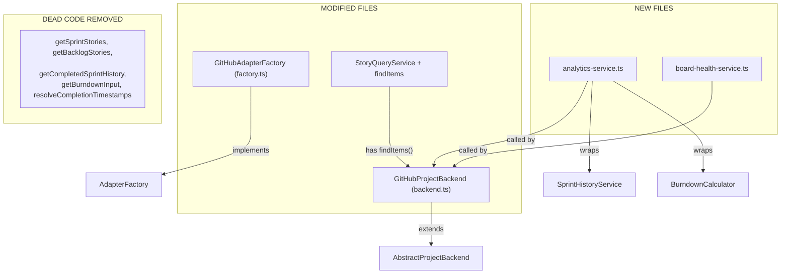
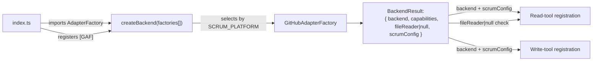
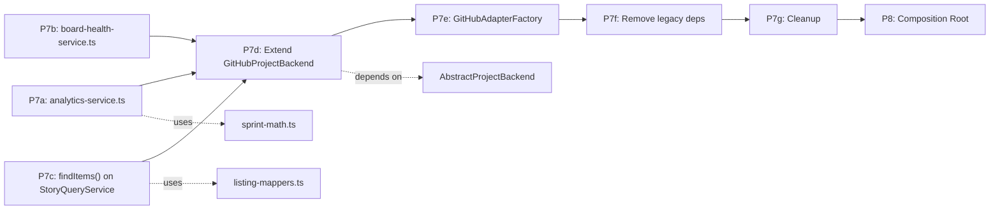

# Phase 7 & 8 — GitHub Adapter Migration & Composition Root

**Status:** Execution plan for the final two phases of `tasks/TODO.md`. **Prerequisite:** Phases 0–6 are complete. All new types, port interfaces, schemas, use-cases, and tool handlers are in place. The three new handler methods on `GitHubProjectBackend` — `findItems()`, `getAnalytics()`, `getBoardHealth()` — are stubs that throw.

---

## Problem

`GitHubProjectBackend` (`src/adapters/github/backend.ts`) still `implements ProjectBackend` directly instead of extending `AbstractProjectBackend`. Three new port methods are stubs. Legacy methods (`getSprintStories`, `getBacklogStories`, `getCompletedSprintHistory`, `getBurndownInput`, `resolveCompletionTimestamps`) are now dead code because the 5 deprecated tools route to error stubs in `scrum-read.ts`.

`src/index.ts` still imports `createGitHubProjectBackend()` directly instead of using the factory registry. `fileReader` is assumed always present.

---

## Target State

### P7: GitHub Adapter Migration



### P8: Composition Root



---

## Implementation Plan

### P7a: Create `analytics-service.ts`

**File:** `src/adapters/github/internal/analytics-service.ts`

**Purpose:** Merge `SprintHistoryService` + `BurndownCalculator` behind a single `getAnalytics(query)` method. Returns `AnalyticsResult` from domain types.

**Signature:**

```typescript
export class AnalyticsService {
  constructor(
    private readonly config: RuntimeConfig,
    private readonly gh: GitHubClient,
    private readonly owner: string,
    private readonly repo: string,
    private readonly sprintHistoryService: SprintHistoryService,
    private readonly burndownCalculator: BurndownCalculator,
  ) {}

  async getAnalytics(query: AnalyticsQuery): Promise<AnalyticsResult>;
}
```

**Behavior:**

- `query.view === "history"` → delegate to `sprintHistoryService.getCompletedSprintHistory(query.history_window ?? 5)`, transform `SprintHistoryEntry[]` into `SprintSnapshot[]` (use `computeSprintEndDate` for missing fields), return `{ burndown: null, history, window }`
- `query.view === "burndown"` → delegate to `burndownCalculator.getBurndownInput(sprint_ref)`, then `burndownCalculator.resolveCompletionTimestamps(burndownInput)`, compute burndown series via `computeBurndownSeries` from `sprint-math.ts`, return `{ burndown, history: null, window: 0 }`
- `query.view === "comprehensive"` → run both, merge into single `AnalyticsResult`

**Key detail:** The `SprintSnapshot` type in `ports.ts` uses `StoryListing` items (deprecated). The analytics service should transform its story entries into `ItemListing` using `historyEntryToItemListing` from `listing-mappers.ts` (imported from `src/scrum/listing-mappers.ts`).

**Testing:** Integration test only — unit-test the individual services separately. This class orchestrates.

---

### P7b: Create `board-health-service.ts`

**File:** `src/adapters/github/internal/board-health-service.ts`

**Purpose:** Implement `getBoardHealth(sprintScope)` for the `BoardHealthPort`.

**Signature:**

```typescript
export class BoardHealthService {
  constructor(
    private readonly config: RuntimeConfig,
    private readonly storyQueryService: StoryQueryService,
    private readonly impedimentService: ImpedimentService,
  ) {}

  async getBoardHealth(sprintScope: string): Promise<BacklogHealth>;
}
```

**Behavior:**

1. Fetch all items using `storyQueryService.fetchAllItems()` (already exists as a public method)
2. Filter by sprint scope (resolve sprint via `resolveSprint` from `resolver.ts`)
3. Count `total_stories`, build `by_status` counts, build `by_type` breakdown
4. Compute `sprint_risk` — use days elapsed from sprint info vs work completion
5. Fetch impediments via `impedimentService.getSprintImpediments(sprint)` and `getOrphanImpediments()`, count open vs in_progress
6. Compute `readiness` breakdown:
   - `ready` = has all status + type + points + priority set
   - `partially_ready` = has some but not all
   - `not_ready` = has only title
7. Return `BacklogHealth`

**Key detail:** This service pulls data from existing services — no new GraphQL queries needed. The `fetchAllItems()` method on `StoryQueryService` is already public.

---

### P7c: Add `findItems()` to `StoryQueryService`

**File:** `src/adapters/github/internal/story-query-service.ts`

**Purpose:** Add `findItems(filter: ResolvedItemFilter): Promise<ItemSearchResult>` that replaces the old `getSprintStories` + `getBacklogStories`.

**Behavior:**

```typescript
async findItems(filter: ResolvedItemFilter): Promise<ItemSearchResult> {
  const allItems = await this.fetchAllItems();
  // 1. Build Story[] from allItems (reuse existing buildStoryFromRaw)
  // 2. Apply filters in order:
  //    - scope: filter by sprint field (sprint items) or no sprint (backlog)
  //    - keys: filter by matching key/number
  //    - search: substring match on title + body
  //    - types: match type field value
  //    - statuses: match status field value
  //    - priority: match priority field value
  //    - epic_id: match milestone ID
  //    - labels: require ALL specified labels
  //    - assignee: match assignee login
  //    - estimated: items with/without story points
  //    - sprint_ref: filter by iteration
  //    - limit: cap results
  // 3. Map to ItemListing[] via toItemListing from listing-mappers.ts
  // 4. If include_dependencies, build DependencyMap
  // 5. Return ItemSearchResult
}
```

**Key decisions:**

- Import `toItemListing` from `src/scrum/listing-mappers.ts` — don't duplicate
- `DependencyMap` construction uses `resolveDependencyRefs`-like logic across the filtered story set
- Filter order matters: apply most selective filters first (keys, epic_id) for performance

**Note on `ItemListing.ref.key`:** The `Story` domain type has `key: string | null` (null for drafts). The `ItemListing.ref` is `ResolvedRef & { key: string | null }`. Use `story.key` directly.

**Note on `ItemListing.sprint.ref.id`:** Currently hardcoded to `{ id: "" }` in `toItemListing`. P7c resolves this by looking up the iteration entry's field ID from `this.config.iterations.all` and populating `sprint.ref.id` with the actual iteration ID from the field value.

---

### P7d: Extend `GitHubProjectBackend` from `AbstractProjectBackend`

**File:** `src/adapters/github/backend.ts`

**Changes:**

1. Change `class GitHubProjectBackend implements ProjectBackend` → `class GitHubProjectBackend extends AbstractProjectBackend`
2. Add `override readonly capabilities = GITHUB_CAPABILITIES;` from `../../capabilities.ts`
3. Override `resolveRef()` to handle `{ number }` refs via `findItems` lookup
4. Replace stub `findItems()` with delegation to `this.deps.storyQueryService.findItems(filter)`
5. Replace stub `getAnalytics()` with delegation to new `AnalyticsService`
6. Replace stub `getBoardHealth()` with delegation to new `BoardHealthService`
7. **Remove legacy methods:** `getSprintStories`, `getBacklogStories`, `getCompletedSprintHistory`, `getBurndownInput`, `resolveCompletionTimestamps`
8. Remove unused type imports: `BurndownInput`, `CompletionMap`, `SprintHistoryEntry`, `SprintInfo` (if no longer referenced)

**`resolveRef()` implementation:**

```typescript
protected override async resolveRef(ref: StoryRef): Promise<StoryRef> {
  if ("id" in ref && !("number" in ref)) return ref; // already resolved
  const result = await this.findItems({ scope: "all", keys: [String(ref.number)], limit: 1 });
  if (result.items.length === 0) {
    throw new StoryNotFoundError(String(ref.number));
  }
  return { id: result.items[0].ref.id };
}
```

---

### P7e: Create `GitHubAdapterFactory`

**File:** `src/adapters/github/factory.ts`

**Changes:**

1. Export a class `GitHubAdapterFactory implements AdapterFactory`
2. Wrap the existing `createGitHubProjectBackend()` logic in `create()` method
3. Return `BackendResult` instead of `GitHubBackendResult`
4. Attach `GITHUB_CAPABILITIES` from `../../capabilities.ts`
5. Wire the new `AnalyticsService` and `BoardHealthService` into the dependency graph

**New service wiring in `create()`:**

```typescript
const analyticsService = new AnalyticsService(
  config,
  ghClient,
  owner,
  primaryRepo,
  sprintHistoryService,
  burndownCalculator,
);
const boardHealthService = new BoardHealthService(
  config,
  storyQueryService,
  impedimentService,
);
```

**Updated `GitHubBackendDependencies`:**

- Add `analyticsService: AnalyticsService`
- Add `boardHealthService: BoardHealthService`
- Remove `burndownCalculator: BurndownCalculator` (now accessed through analyticsService)
- Remove `sprintHistoryService: SprintHistoryService` (now accessed through analyticsService)

**Updated constructor wiring:**

```typescript
const deps: GitHubBackendDependencies = {
  // ... existing deps ...
  analyticsService,
  boardHealthService,
  // burndownCalculator and sprintHistoryService removed from deps if no longer needed
};
```

---

### P7f: Remove Legacy Backend Dependencies

**File:** `src/adapters/github/backend.ts`

**Removed from `GitHubBackendDependencies`:**

- `burndownCalculator: BurndownCalculator` — wrapped by AnalyticsService
- `sprintHistoryService: SprintHistoryService` — wrapped by AnalyticsService

**Added:**

- `analyticsService: AnalyticsService`
- `boardHealthService: BoardHealthService`

---

### P7g: Final Cleanup Steps

**Files to clean up:**

1. `src/adapters/github/backend.ts` — remove unused `import` statements for removed services
2. `src/adapters/github/factory.ts` — remove `GitHubBackendResult` interface (replaced by `BackendResult` from factory.ts)
3. Remove any references to legacy `getSprintStories` / `getBacklogStories` in tests

---

### P8: Composition Root

**File:** `src/index.ts`

**Changes:**

1. Replace `import { createGitHubProjectBackend } from "./adapters/github/factory.ts"` with `import { createBackend, type AdapterFactory } from "./adapters/factory.ts"` and `import { GitHubAdapterFactory } from "./adapters/github/factory.ts"`
2. In `createMcpServer()`, replace:

```typescript
const { backend, fileReader, scrumConfig } = await createGitHubProjectBackend();
```

with:

```typescript
const factories: AdapterFactory[] = [new GitHubAdapterFactory()];
const { backend, fileReader, scrumConfig } = await createBackend(factories);
```

3. Add `fileReader` null check before registering read tools:

```typescript
if (fileReader) {
  registerScrumReadTools(server, backend, scrumConfig, fileReader);
} else {
  registerScrumReadTools(server, backend, scrumConfig, null);
  // Templates fall back to MCP resources
}
```

**Note:** The `registerScrumReadTools` function signature currently takes `_fileReader: FileReaderPort`. Change to `fileReader: FileReaderPort | null` and handle the null case (skip template-related logic).

---

## File Change Summary

### New Files (2)

| File                                                   | Purpose                                          |
| ------------------------------------------------------ | ------------------------------------------------ |
| `src/adapters/github/internal/analytics-service.ts`    | Merges SprintHistoryService + BurndownCalculator |
| `src/adapters/github/internal/board-health-service.ts` | `getBoardHealth()` implementation                |

### Modified Files (4)

| File                                                  | What changes                                                                                                 |
| ----------------------------------------------------- | ------------------------------------------------------------------------------------------------------------ |
| `src/adapters/github/backend.ts`                      | Extends `AbstractProjectBackend`; adds 3 real implementations; removes 5 legacy methods; adds `resolveRef()` |
| `src/adapters/github/factory.ts`                      | `GitHubAdapterFactory` class; `BackendResult` return type; wires new services                                |
| `src/adapters/github/internal/story-query-service.ts` | Adds `findItems(filter)` method                                                                              |
| `src/index.ts`                                        | Uses `createBackend(factories[])`; null-checks `fileReader`                                                  |

### Updated Signatures (1)

| File                      | What changes                                                         |
| ------------------------- | -------------------------------------------------------------------- |
| `src/tools/scrum-read.ts` | `_fileReader: FileReaderPort` → `fileReader: FileReaderPort \| null` |

---

## Execution Order



1. **P7a** first (no deps on other P7 sub-tasks — pure new file)
2. **P7b** first (no deps on other P7 sub-tasks — pure new file)
3. **P7c** adds `findItems` to existing `StoryQueryService` (depends on understanding existing methods)
4. **P7d** extends backend from `AbstractProjectBackend` — this is the integration point that depends on P7a, P7b, P7c being done
5. **P7e** creates `GitHubAdapterFactory` (depends on P7d + P7a + P7b wiring)
6. **P7f** removes legacy from deps (depends on P7e)
7. **P7g** final import cleanup
8. **P8** composition root (depends on P7e)

---

## Verification

After each sub-phase, run:

```bash
deno lint
deno task test
deno check src/index.ts
grep -r "import.*from.*adapters/github" src/scrum/ src/domain/ src/schemas/
```

Final verification:

```bash
deno lint && deno task test && deno check src/index.ts && echo "ALL CLEAN"
```

---

## Risk Assessment

| Sub-phase | Risk                                     | Mitigation                                               |
| --------- | ---------------------------------------- | -------------------------------------------------------- |
| P7a       | 🟢 Low — new file, no existing consumers | Tests via existing burndown/sprint-history tests         |
| P7b       | 🟢 Low — new file, no existing consumers | Manual verification via tool call                        |
| P7c       | 🟡 Medium — complex filtering logic      | Duplicate old `getSprintStories` logic but improved      |
| P7d       | 🔴 High — changes class hierarchy        | Verify all existing port methods still work              |
| P7e       | 🟡 Medium — changes factory return type  | `BackendResult` is compatible with `GitHubBackendResult` |
| P7f       | 🟡 Medium — removes constructor params   | Ensure no external callers use removed deps              |
| P7g       | 🟢 Low — import cleanup                  | Compiler error if something missed                       |
| P8        | 🟡 Medium — changes composition root     | Backward-compatible via default `SCRUM_PLATFORM=github`  |
