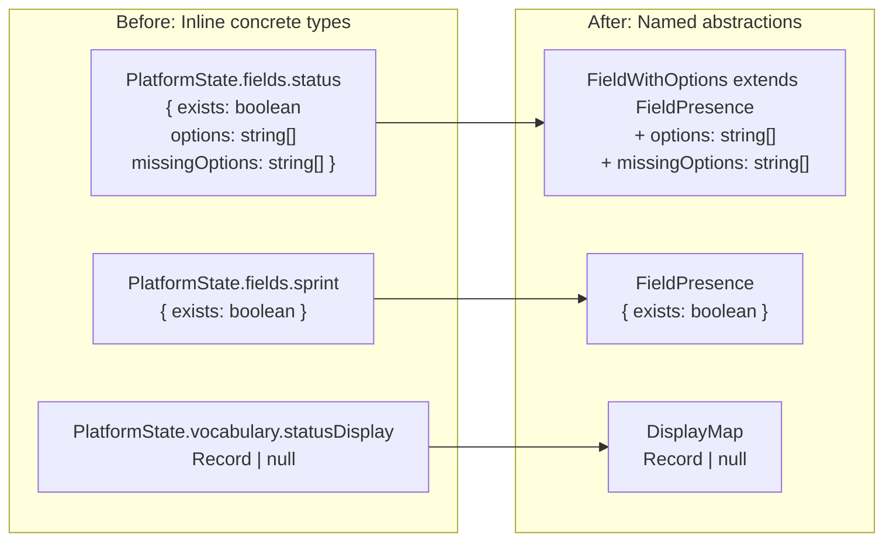

# PlatformState Type Refactoring Plan

**Goal:** Reduce repetitive concrete types in [`PlatformState`](src/scrum/ports.ts:97-123) by extracting shared shapes into named abstractions.

---

## Analysis

The `PlatformState` interface in [`src/scrum/ports.ts`](src/scrum/ports.ts:98-123) contains two categories of repetition:

### 1. Field descriptor shapes — 3 concrete variants, repeated across 5 fields

| Pattern                                                            | Appears at               | Count |
| ------------------------------------------------------------------ | ------------------------ | ----- |
| `{ exists: boolean }`                                              | `sprint`, `story_points` | 2×    |
| `{ exists: boolean; options: string[]; missingOptions: string[] }` | `status`, `priority`     | 2×    |
| `{ exists: boolean; configured: boolean }`                         | `type`                   | 1×    |

The `{ exists: boolean }` core is shared by **all five** fields. The `status`/`priority` variant adds options + missingOptions. The `type` variant adds configured.

### 2. Vocabulary display maps — same shape repeated 3×

```typescript
vocabulary: {
  statusDisplay: Record<string, string> | null;
  priorityDisplay: Record<string, string> | null;
  typeDisplay: Record<string, string> | null;
}
```

`Record<string, string> | null` appears 3 times with different property names.

---

## Proposed Abstractions

Add these types to [`src/scrum/ports.ts`](src/scrum/ports.ts) before `PlatformState`:

```typescript
/** A platform field that may or may not exist. */
interface FieldPresence {
  readonly exists: boolean;
}

/** A field with configurable options, such as status or priority. */
interface FieldWithOptions extends FieldPresence {
  readonly options: readonly string[];
  readonly missingOptions: readonly string[];
}

/** Maps canonical vocabulary keys to platform display names. Null when not resolved. */
type DisplayMap = Record<string, string> | null;
```

### Naming rationale

| Type               | Why this name                                                                                                                                                    |
| ------------------ | ---------------------------------------------------------------------------------------------------------------------------------------------------------------- |
| `FieldPresence`    | Answers "does this field exist?" — the core question about every project field. Single `exists` boolean.                                                         |
| `FieldWithOptions` | A field that has selectable options _and_ tracks which expected values are absent. `extends FieldPresence` communicates "this is a presence field plus options." |
| `DisplayMap`       | Short, unambiguous. The null is the interesting part (unresolved vs empty).                                                                                      |

### Location

These belong in [`src/scrum/ports.ts`](src/scrum/ports.ts) because:

- They are **port-level abstractions** that describe the platform's field structure
- They are not domain entities — they describe infrastructure state
- They are not used outside the port boundary (the orient use-case maps to `OrientResult` separately)
- They are not general enough for `src/domain/types.ts`

---

## Simplified PlatformState

```typescript
export interface PlatformState {
  readonly fields: {
    readonly status: FieldWithOptions;
    readonly sprint: FieldPresence;
    readonly story_points: FieldPresence;
    readonly priority: FieldWithOptions;
    readonly type: FieldPresence & { readonly configured: boolean };
  };
  readonly labels: {
    readonly existing: readonly string[];
    readonly expected: readonly string[];
    readonly missing: readonly string[];
  };
  readonly iterations: {
    readonly active: SprintInfo | null;
    readonly next: SprintInfo | null;
    readonly completed: readonly SprintInfo[];
    readonly completedCount: number;
  };
  readonly vocabulary: {
    readonly statusDisplay: DisplayMap;
    readonly priorityDisplay: DisplayMap;
    readonly typeDisplay: DisplayMap;
  };
  readonly epics: { readonly active: readonly EpicSummary[]; readonly totalCount: number };
  readonly templateUris: TemplateUriMap | null;
}
```

### What changed

| Aspect               | Before                                                             | After                                              |
| -------------------- | ------------------------------------------------------------------ | -------------------------------------------------- |
| Field types          | 3 inline concrete shapes                                           | 2 named abstractions + 1 intersection              |
| `status` shape       | `{ exists: boolean; options: string[]; missingOptions: string[] }` | `FieldWithOptions`                                 |
| `sprint` shape       | `{ exists: boolean }`                                              | `FieldPresence`                                    |
| `story_points` shape | `{ exists: boolean }`                                              | `FieldPresence`                                    |
| `priority` shape     | `{ exists: boolean; options: string[]; missingOptions: string[] }` | `FieldWithOptions`                                 |
| `type` shape         | `{ exists: boolean; configured: boolean }`                         | `FieldPresence & { readonly configured: boolean }` |
| Vocabulary maps      | `Record<string, string> \| null` (3×)                              | `DisplayMap` (3×)                                  |

---

## Upstream/Downstream Impact

### Producers of `PlatformState`

| File                                                                         | Impact                                             | Mitigation                                                                                                                                                                                          |
| ---------------------------------------------------------------------------- | -------------------------------------------------- | --------------------------------------------------------------------------------------------------------------------------------------------------------------------------------------------------- |
| [`src/adapters/github/backend.ts`](src/adapters/github/backend.ts:119-187)   | Returns `PlatformState` — must match the new shape | Structural — no changes needed. The object literal already satisfies `FieldWithOptions` (it has `exists`, `options`, `missingOptions`). Adding `readonly` may require `as const` on array literals. |
| [`src/adapters/abstract-backend.ts`](src/adapters/abstract-backend.ts:87-90) | Declares abstract method returning `PlatformState` | No change — the return type is imported, not inlined.                                                                                                                                               |

### Consumers of `PlatformState`

| File                                                | Impact                                                                         | Mitigation                                      |
| --------------------------------------------------- | ------------------------------------------------------------------------------ | ----------------------------------------------- |
| [`src/scrum/orient.ts`](src/scrum/orient.ts:89-124) | Destructures `state.fields.status.exists`, `state.fields.status.options`, etc. | No change — field property names are identical. |

### Compile-Time Check

The object literal in [`GitHubBackend.getPlatformState`](src/adapters/github/backend.ts:149-186) constructs each field inline:

```typescript
status: {
  exists: !!this.deps.config.fields.statusFieldId,
  options: liveStatusOptions,
  missingOptions: missingStatusOptions,
},
```

This structurally matches `FieldWithOptions` because it provides all required properties. No runtime changes needed.

### `readonly` Consideration

The plan adds `readonly` to all fields in `PlatformState`. If any code mutates `state.fields.status.options.push(...)`, it will produce a compile error. **Check before implementing:** search for `.push`, `.splice`, or direct assignment on any `PlatformState` field.

---

## Change Summary

### File: `src/scrum/ports.ts`

**Lines to add** (before `PlatformState`, after `SprintInfo`):

```typescript
/** A platform field that may or may not exist. */
interface FieldPresence {
  readonly exists: boolean;
}

/** A field with configurable options, such as status or priority. */
interface FieldWithOptions extends FieldPresence {
  readonly options: readonly string[];
  readonly missingOptions: readonly string[];
}

/** Maps canonical vocabulary keys to platform display names. Null when not resolved. */
type DisplayMap = Record<string, string> | null;
```

**Lines to change** (`PlatformState` interface, lines 97-123): Replace inline field shapes with named types as shown above.

### File: `src/adapters/github/backend.ts`

**Check lines 149-186:** Verify that the object literal returned by `getPlatformState` structurally satisfies `FieldWithOptions` / `FieldPresence`. No changes expected — the shapes already match.

---

## Mermaid — Before/After Comparison



---

## Implementation Steps

1. Add `FieldPresence`, `FieldWithOptions`, and `DisplayMap` to [`src/scrum/ports.ts`](src/scrum/ports.ts) right before `PlatformState` (after line 95).
2. Replace inline field shapes in `PlatformState` with the new types.
3. Add `readonly` to all `PlatformState` fields (and the new types).
4. Run `deno lint` and `deno task test` to confirm no regressions.
5. Verify the object literal in [`backend.ts`](src/adapters/github/backend.ts:149-186) compiles without errors.

---

## Risks

| Risk                                                         | Likelihood                                            | Mitigation                                                                         |
| ------------------------------------------------------------ | ----------------------------------------------------- | ---------------------------------------------------------------------------------- |
| Mutation of `PlatformState` arrays (.push, .splice)          | Low — `PlatformState` is read-only after construction | Compile error surfaces the site; replace with immutable pattern                    |
| Third adapter (non-GitHub) building `PlatformState` manually | Low — only one adapter exists                         | Structural typing means `{ exists: true }` satisfies `FieldPresence` automatically |
