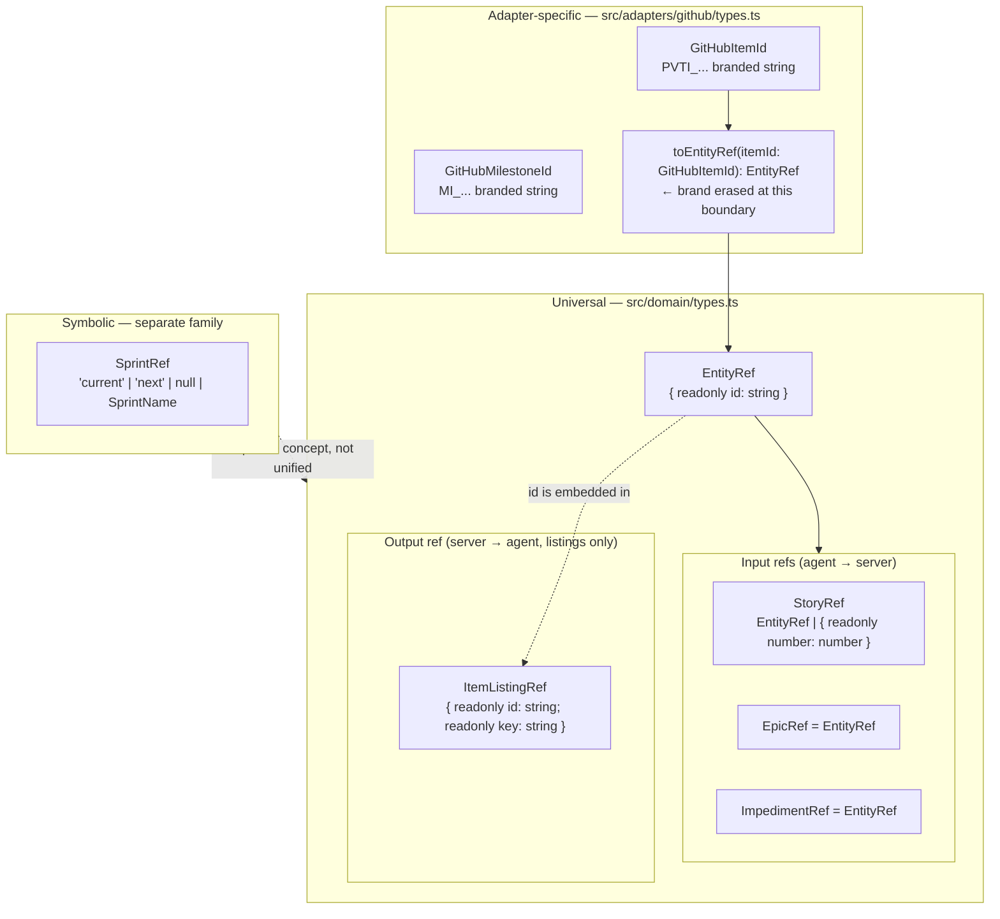

# Ref Type Consolidation Plan

## Problem Statement

Five concrete problems drive this refactor:

1. **`ResolvedRef` is a meaningless name.** The name implies there is a corresponding "UnresolvedRef" — there isn't. The type is the universal opaque entity handle. Its name should say what it _is_, not what happened to produce it.

2. **`ImpedimentRef` does not exist.** Three sites use three different shapes for the same concept: inline `{ id: string }` in `update-impediment.ts`, `ResolvedRef` in `abstract-backend.ts`, and `ResolvedRef` in `impediment-service.ts`. The type system cannot enforce consistency when there is no named type.

3. **The compound listing handle `{ id: string; key: string }` is inline in five places with no name.** The shape appears in `BacklogItemListing.ref`, `BacklogItemListing.blocked_by[]`, `BacklogItemListing.blocks[]`, `StoryListing.ref`, and `listing-mappers.ts`. Its purpose — bundling the opaque mutation handle (`id`) with the human-readable display key (`key`) for the agent — is not legible from inline syntax.

4. **`BacklogItemListing.epic.ref` uses `ResolvedRef` instead of `EpicRef`.** `IssueStory.epic` and `EpicListing.ref` both use `EpicRef`, but the listing-level epic inline shape uses `ResolvedRef`. Three representations of the same concept.

5. **The adapter-to-domain crossing point is unnamed.** `toResolvedRef()` converts a GitHub-branded node ID into a domain-safe handle, but its name doesn't signal that it is the boundary where the adapter-specific brand is erased. A developer reading the adapter cannot tell at a glance where the adapter world ends and the universal domain world begins.

---

## Design Principles

### Principle 1 — Two ref families, no forced unification

Ref types fall into two structurally unrelated families. They share no shape and represent categorically different concepts. Merging them into a common base type adds no safety and harms readability.

| Family            | Types                                  | Shape                                  |
| ----------------- | -------------------------------------- | -------------------------------------- |
| **Entity refs**   | Story, Epic, Impediment, listing items | Object with `id: string`               |
| **Symbolic refs** | Sprint                                 | String literal union or branded string |

`SprintRef` is not touched by this refactor.

### Principle 2 — Universal types vs adapter-specific types

Every ref type belongs to exactly one layer:

| Layer                | Location                       | Rule                                                                                                |
| -------------------- | ------------------------------ | --------------------------------------------------------------------------------------------------- |
| **Universal**        | `src/domain/types.ts`          | Defined once. Used by domain, port, use-case, and adapter layers. Survive a backend swap unchanged. |
| **Adapter-specific** | `src/adapters/github/types.ts` | Platform-branded. Never cross the port boundary. Erased to universal types at the boundary.         |

The boundary crossing is made explicit by a named factory function. After this refactor, any developer reading the adapter code can find the exact line where the GitHub-specific world ends.

### Principle 3 — Input refs vs output refs are distinct concepts

Not all ref-shaped types serve the same role:

| Context         | Purpose                                                     | Direction      |
| --------------- | ----------------------------------------------------------- | -------------- |
| **Input refs**  | The agent passes these to tools to target a specific entity | agent → server |
| **Output refs** | The server embeds these in response shapes the agent reads  | server → agent |

The compound listing handle (`id` + `key`) is output-only. It is never a valid input to a write tool. The plan names it separately to make this contract visible in the type system.

---

## Proposed Type Hierarchy

### Universal types — `src/domain/types.ts`

```typescript
// ── Base entity handle ────────────────────────────────────────────────────────

/**
 * The universal opaque entity handle.
 *
 * Assigned by the backend adapter and passed back opaquely by the domain layer.
 * The value of `id` is platform-specific (e.g. PVTI_... on GitHub Projects) but
 * the domain layer never inspects it — it is always treated as an opaque string.
 *
 * This is the single base type for all resolved entity references in the system.
 * No layer other than the adapter that produced it should care about the `id` format.
 *
 * Rename from: ResolvedRef
 */
export type EntityRef = { readonly id: string };

// ── Input refs (agent → server) ───────────────────────────────────────────────

/**
 * A reference to a Story accepted as tool input.
 *
 * Two forms:
 * - `{ id }` — opaque project-item handle (PVTI_... on GitHub). Returned by every
 *   read tool. Prefer this form when the agent already holds a listing entry.
 * - `{ number }` — human-readable issue number (e.g. 42). The adapter resolves
 *   this to an opaque handle via resolveRef(). Use for direct lookup when the
 *   agent has no prior listing entry for the target item.
 *
 * TypeScript guard: `"id" in ref` narrows to EntityRef (resolved form).
 */
export type StoryRef = EntityRef | { readonly number: number };

/**
 * A reference to an Epic passed as tool input.
 * Always resolved — the agent obtains this from EpicListing.ref or IssueStory.epic.ref
 * and passes it back unchanged to story create/update tools.
 *
 * On GitHub: id is the Milestone node ID (MI_...).
 */
export type EpicRef = EntityRef;

/**
 * A reference to an Impediment passed as tool input.
 * Always resolved — the agent obtains this from ImpedimentListing.ref
 * and passes it back to scrum_update_impediment.
 */
export type ImpedimentRef = EntityRef;

// ── Output ref (server → agent, listing context only) ────────────────────────

/**
 * The compound item handle embedded in BacklogItemListing and dependency arrays.
 *
 * Bundles two identifiers the agent needs simultaneously:
 * - `id`  — opaque platform handle. Used in all write tool calls.
 * - `key` — human-readable issue number string (e.g. "42"). Shown to the user
 *            and used as the canonical node key in DependencyMap. Empty string
 *            for Draft Issues (which have no issue number).
 *
 * This type is OUTPUT-ONLY. It is never a valid input to a write tool.
 * To target an item from a listing, pass `{ id: item.ref.id }` — not the
 * ItemListingRef itself.
 *
 * New type — replaces inline `{ id: string; key: string }` in five locations.
 */
export type ItemListingRef = { readonly id: string; readonly key: string };
```

### Adapter-specific types — `src/adapters/github/types.ts`

These types remain structurally unchanged. Only `toResolvedRef` is renamed.

```typescript
// Unchanged — branded node ID types stay adapter-internal.
export type GitHubItemId = string & { readonly _brand: "GitHubItemId" };
export type GitHubIssueId = string & { readonly _brand: "GitHubIssueId" };
export type GitHubMilestoneId = string & { readonly _brand: "GitHubMilestoneId" };

/**
 * Erase the GitHub node ID brand and produce a domain-safe EntityRef.
 *
 * This is the port-boundary crossing point for item IDs: everything on the
 * left is GitHub-specific; everything on the right is universal domain vocabulary.
 * Call this at every adapter boundary where a GitHubItemId returns to the
 * port or domain layer.
 *
 * Renamed from: toResolvedRef
 */
export const toEntityRef = (itemId: GitHubItemId): EntityRef => ({ id: itemId });
```

---

## Type Relationship Diagram



---

## Naming Rationale

| Name                  | Replaces                                | Why                                                                                                                                                                                        |
| --------------------- | --------------------------------------- | ------------------------------------------------------------------------------------------------------------------------------------------------------------------------------------------ |
| `EntityRef`           | `ResolvedRef`                           | Communicates what the type _is_ (a handle to a platform entity) rather than what happened to produce it ("resolved"). Eliminates the false implication of a corresponding "UnresolvedRef". |
| `ImpedimentRef`       | inline `{ id: string }` / `ResolvedRef` | Makes the impediment input contract explicit and consistently typed across use-case, abstract backend, and adapter layers.                                                                 |
| `ItemListingRef`      | inline `{ id: string; key: string }`    | Names the compound output handle. The name signals its listing-only context and prevents misuse as a write-tool input.                                                                     |
| `toEntityRef`         | `toResolvedRef`                         | Names the architectural crossing point: the line where adapter-specific brands are erased and universal domain types begin.                                                                |
| `StoryRef = EntityRef | { number }`                             | `StoryRef = { id }                                                                                                                                                                         |
| `EpicRef = EntityRef` | `EpicRef = { id: string }`              | Makes the base type explicit; no structural change.                                                                                                                                        |
| `SprintRef`           | —                                       | Unchanged. Symbolic family; structurally unrelated to entity refs.                                                                                                                         |

---

## Migration Steps

### Step 1 — Rename `ResolvedRef → EntityRef` in `src/domain/types.ts`

```typescript
// Before
export type ResolvedRef = { id: string };

// After
export type EntityRef = { readonly id: string };
```

**Impact:** All `ResolvedRef` imports must be updated. See Step 6.

---

### Step 2 — Redefine `EpicRef` and `StoryRef` to use `EntityRef`

**File:** `src/domain/types.ts`

```typescript
// Before
export type EpicRef = { id: string };
export type StoryRef = { id: string } | { number: number };

// After
export type EpicRef = EntityRef;
export type StoryRef = EntityRef | { readonly number: number };
```

No structural change — TypeScript structural typing preserves compatibility.

---

### Step 3 — Add `ImpedimentRef`

**File:** `src/domain/types.ts` — add after `EpicRef`:

```typescript
/**
 * A reference to an Impediment passed as tool input.
 * Always resolved — the agent obtains this from ImpedimentListing.ref
 * and passes it back to scrum_update_impediment.
 */
export type ImpedimentRef = EntityRef;
```

---

### Step 4 — Add `ItemListingRef` and replace inline compound shapes

**File:** `src/domain/types.ts` — add after `ImpedimentRef`:

```typescript
export type ItemListingRef = { readonly id: string; readonly key: string };
```

**Then update `BacklogItemListing`:**

```typescript
// Before
export interface BacklogItemListing {
  readonly ref: { readonly id: string; readonly key: string };
  // ...
  readonly blocked_by: ReadonlyArray<{ readonly id: string; readonly key: string }>;
  readonly blocks: ReadonlyArray<{ readonly id: string; readonly key: string }>;
  // ...
}

// After
export interface BacklogItemListing {
  readonly ref: ItemListingRef;
  // ...
  readonly blocked_by: ReadonlyArray<ItemListingRef>;
  readonly blocks: ReadonlyArray<ItemListingRef>;
  // ...
}
```

**Also update the deprecated `StoryListing` in `src/scrum/ports.ts`:**

```typescript
// Before
ref: {
  id: string;
  key: string | null;
}

// After — key is non-nullable in practice; align with ItemListingRef
ref: ItemListingRef;
```

---

### Step 5 — Fix `BacklogItemListing.epic` to use `EpicRef`

**File:** `src/domain/types.ts`

```typescript
// Before (line ~285)
readonly epic: { readonly ref: ResolvedRef; readonly name: string } | null;

// After
readonly epic: { readonly ref: EpicRef; readonly name: string } | null;
```

This aligns `BacklogItemListing.epic` with `IssueStory.epic` (line ~360) and `EpicListing.ref`, which already use `EpicRef`.

---

### Step 6 — Replace `ImpedimentRef` at the use-case and port boundary

**File:** `src/scrum/update-impediment.ts`

```typescript
// Before
import type { ImpedimentListing, ImpedimentPort } from "./ports.ts";

export const updateImpedimentUseCase = async (
  backend: ImpedimentPort,
  ref: { id: string },
  ...

// After
import type { ImpedimentListing, ImpedimentPort } from "./ports.ts";
import type { ImpedimentRef } from "../domain/types.ts";

export const updateImpedimentUseCase = async (
  backend: ImpedimentPort,
  ref: ImpedimentRef,
  ...
```

**File:** `src/scrum/ports.ts` — `ImpedimentListing`:

```typescript
// Before
export interface ImpedimentListing {
  readonly ref: ResolvedRef;
  ...

// After
export interface ImpedimentListing {
  readonly ref: ImpedimentRef;
  ...
```

---

### Step 7 — Update `ResolvedRef` usages in the adapter layer

**File:** `src/adapters/abstract-backend.ts`

```typescript
// Before
updateImpediment(
  _ref: ResolvedRef,
  ...

// After
updateImpediment(
  _ref: ImpedimentRef,
  ...
```

**File:** `src/adapters/github/backend.ts`

```typescript
// Before
override updateImpediment(
  ref: ResolvedRef,
  ...

// After
override updateImpediment(
  ref: ImpedimentRef,
  ...
```

**File:** `src/adapters/github/internal/impediment-service.ts`

```typescript
// Before
async updateImpediment(
  ref: ResolvedRef,
  ...

// After
async updateImpediment(
  ref: ImpedimentRef,
  ...
```

---

### Step 8 — Rename `toResolvedRef → toEntityRef` in `src/adapters/github/types.ts`

```typescript
// Before
export const toResolvedRef = (itemId: GitHubItemId): ResolvedRef => ({ id: itemId });

// After
export const toEntityRef = (itemId: GitHubItemId): EntityRef => ({ id: itemId });
```

Update all callsites of `toResolvedRef` in the GitHub adapter (find with `grep -r "toResolvedRef" src/`).

---

### Step 9 — Update all remaining `ResolvedRef` imports

Run `grep -r "ResolvedRef" src/` after steps 1–8. Expected remaining files:

| File                           | Change                                                                                                                                |
| ------------------------------ | ------------------------------------------------------------------------------------------------------------------------------------- |
| `src/scrum/ports.ts`           | `ResolvedRef` in `BurndownStoryInput.ref?` → `EntityRef`                                                                              |
| `src/scrum/listing-mappers.ts` | `EMPTY_SPRINT_REF: ResolvedRef` → `EntityRef`                                                                                         |
| `src/adapters/github/types.ts` | Import removed (replaced by `EntityRef`)                                                                                              |
| `src/domain/types.ts`          | Remaining usages: `DependencyEntry.ref`, `EpicSummary.ref`, `BacklogItemListing.sprint.ref`, `StoryBase.ref` → all become `EntityRef` |

---

### Step 10 — Run `deno lint` and `deno test`

```sh
deno lint src/
deno test --allow-env --allow-net --allow-read
```

---

## Out of Scope

### `EpicSummary` shape in REFACTORING.md

`tasks/REFACTORING.md` specifies `EpicSummary` with a flat `id: string` field (no `ref` wrapper) and without a `status` field. The current implementation uses `ref: ResolvedRef` (consistent with every other domain type that carries an entity ref) and includes `status`.

This discrepancy is intentional in the planning document — `EpicSummary` appears in the `scrum_orient` redesign context where epics are orient-summary-only (not actionable inputs). The flat shape is acceptable there because the agent does not pass `EpicSummary.id` back to any tool directly.

**Resolution:** The `EpicSummary` shape change belongs with the `scrum_orient` redesign work, not with ref type consolidation. This plan renames `EpicSummary.ref: ResolvedRef → EntityRef` only. The flatten-to-`id` change is deferred.

---

## Verification Checklist

- [ ] `deno lint` passes with no errors
- [ ] `deno task test` passes with no failures
- [ ] `grep -r "ResolvedRef" src/` returns zero results
- [ ] `grep -r "toResolvedRef" src/` returns zero results
- [ ] `grep -rn '{ id: string; key: string }' src/` returns zero results (replaced by `ItemListingRef`)
- [ ] `grep -rn '{ id: string }' src/scrum/` returns zero results in use-case layer (replaced by named types)
- [ ] `ImpedimentRef` is used in `update-impediment.ts`, `ports.ts`, `abstract-backend.ts`, `backend.ts`, `impediment-service.ts`
- [ ] `EpicRef` is used in `BacklogItemListing.epic`, `IssueStory.epic`, `EpicListing.ref`, `CreateStoryInput.epic`, `StoryUpdates.epic`
- [ ] `ItemListingRef` is used in `BacklogItemListing.ref`, `.blocked_by[]`, `.blocks[]`, `StoryListing.ref`
- [ ] `SprintRef` is unchanged
- [ ] No `EntityRef` import appears in `src/adapters/github/types.ts` (it imports from domain; domain does not import from adapter)
