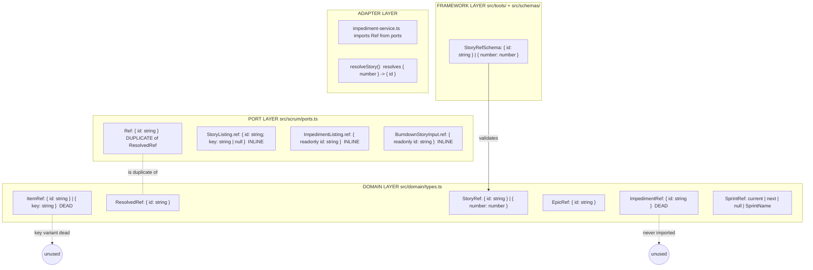
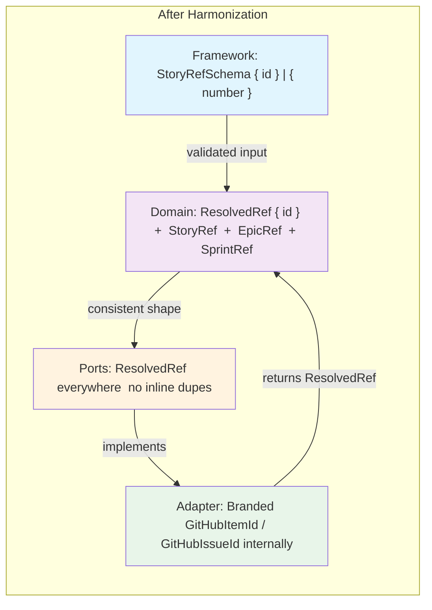

# Reference Type Harmonization Strategy

**Derived from:** The inconsistency analysis of [`Ref`](src/scrum/ports.ts:219) vs [`ItemRef`](src/domain/types.ts:21) vs [`ResolvedRef`](src/domain/types.ts:28), and the architectural objectives in [`tasks/REFACTORING.md`](tasks/REFACTORING.md).

**Relationship:** Extends [`plans/type-management-refactoring.md`](plans/type-management-refactoring.md) with a focused phase for reference type consolidation. Should be executed **after** Q0 (inline imports) but **before** P2 (port type consolidation).

---

## Current Architecture



## Problem Summary

| # | Problem                                                                                                                                                                                                                                                               | Severity           |
| - | --------------------------------------------------------------------------------------------------------------------------------------------------------------------------------------------------------------------------------------------------------------------- | ------------------ |
| 1 | [`Ref`](src/scrum/ports.ts:219) and [`ResolvedRef`](src/domain/types.ts:28) are identical `{ id: string }` but in different layers                                                                                                                                    | 🔴 Redundant       |
| 2 | [`ItemRef`](src/domain/types.ts:21) is defined but fully dead — its `{ key: string }` variant is never used                                                                                                                                                           | 🔴 Dead code       |
| 3 | [`ImpedimentRef`](src/domain/types.ts:54) is defined but never imported anywhere                                                                                                                                                                                      | 🔴 Dead code       |
| 4 | [`ImpedimentListing.ref`](src/scrum/ports.ts:251) carries GitHub Issue node ID (`I_...`), not project item ID (`PVTI_...`) — semantic mismatch undocumented                                                                                                           | 🔴 Type unsafety   |
| 5 | [`StoryListing.ref`](src/scrum/ports.ts:237), [`ImpedimentListing.ref`](src/scrum/ports.ts:251), [`BurndownStoryInput.ref`](src/scrum/ports.ts:166), [`StoryBase.ref`](src/domain/types.ts:309) all define `{ id }` inline instead of reusing a single canonical type | 🟡 Inconsistent    |
| 6 | [`Ref`](src/scrum/ports.ts:215-218) docstring says "StoryListing and ImpedimentListing extend this pattern" but neither actually extends or composes `Ref`                                                                                                            | 🟡 Misleading docs |
| 7 | The domain layer has no branded types to distinguish project item IDs (`PVTI_`) from issue node IDs (`I_`) from milestone IDs (`MI_`)                                                                                                                                 | 🟡 Adapter leaks   |

---

## Target Architecture

```mermaid
flowchart TD
    subgraph Framework["FRAMEWORK LAYER  src/tools/ + src/schemas/"]
        STORY_REF_SCH["StoryRefSchema: { id: string } | { number: number }"]
        EPIC_REF_SCH["EpicRefSchema: { id: string }"]
        SPRINT_REF_SCH["SprintRefSchema: current | next | null | string"]
    end

    subgraph Domain["DOMAIN LAYER  src/domain/types.ts"]
        direction TB
        RESOLVED_REF["CANONICAL ResolvedRef = { id: string }"]
        STORY_REF["StoryRef = { id: string } | { number: number }"]
        EPIC_REF["EpicRef = { id: string }"]
        SPRINT_REF["SprintRef = current | next | null | SprintName"]
        ISSUE_KEY["IssueKey = branded string"]
        N_ITEM_REF["ItemRef = REMOVED"]
        N_IMP_REF["ImpedimentRef = REMOVED"]
    end

    subgraph Ports["PORT LAYER  src/scrum/ports.ts"]
        direction TB
        N_REF["Ref = REMOVED  (use ResolvedRef instead)"]
        ITEM_LISTING_REF["ItemListing.ref = ResolvedRef & { key: string | null }"]
        IMP_LISTING_REF2["ImpedimentListing.ref = ResolvedRef  always project item ID"]
        STORY_LISTING_REF2["StoryListing.ref = ResolvedRef & { key: string | null }"]
        BURNDOWN_REF2["BurndownStoryInput.ref = ResolvedRef"]
    end

    subgraph Adapter["ADAPTER LAYER  src/adapters/github/"]
        direction TB
        GH_ITEM_ID["GitHubItemId  = branded PVTI_*  adapter-internal"]
        GH_ISSUE_ID["GitHubIssueId = branded I_*     adapter-internal"]
        GH_MILESTONE_ID["GitHubMilestoneId = branded MI_*  adapter-internal"]
        RESOLVER["resolveStory()  maps { number } -> ResolvedRef"]
    end

    STORY_REF_SCH -->|validates| STORY_REF
    RESOLVED_REF -.->|used by port listings| ITEM_LISTING_REF
    RESOLVED_REF -.->|used by port listings| IMP_LISTING_REF2
    GH_ITEM_ID -.->|adapter casts to| RESOLVED_REF
    GH_ISSUE_ID -.->|converted internally| RESOLVED_REF
```



### Key Design Decisions

1. **Single canonical `ResolvedRef = { id: string }`** — lives in domain, used across all layers. The `id` is an opaque handle; the domain does not care about the prefix or format.

2. **Branded types inside the adapter only** — [`GitHubProjectBackend`](src/adapters/github/backend.ts) internally tracks whether it's dealing with a `PVTI_` (project item) or `I_` (GitHub Issue) node ID using branded types that never cross the port boundary.

3. **`ItemRef` removed** — its `{ key: string }` variant was dead. The `key` concept is already expressed via `IssueKey` (branded string) and `StoryRef.number` (numeric key).

4. **`ImpedimentRef` removed** — dead code. Story/issue reference uses `StoryRef` or `ResolvedRef` consistently.

5. **`Ref` removed from ports** — replaced by importing `ResolvedRef` from domain.

6. **`ImpedimentListing.ref.id`** — changed to always be a **project item ID** (`PVTI_`), consistent with every other `ref.id`. The GitHub Issue node ID (`I_`) is resolved inside the adapter when needed for mutation calls.

---

## Migration Phases

### Phase R1 — Remove Dead Types

Remove [`ItemRef`](src/domain/types.ts:21) and [`ImpedimentRef`](src/domain/types.ts:54) from domain.

**Change:** Delete the two type definitions and the [`isResolvedRef`](src/domain/types.ts:31) type guard (depends on `ItemRef`).

**Rationale:** `ItemRef` has zero usages. `ImpedimentRef` has zero usages. `isResolvedRef` has one usage in a type guard — replace with inline `"id" in ref`.

**Risk:** 🟢 Low — mechanical removal of dead code.

**Files:**

- [`src/domain/types.ts`](src/domain/types.ts) — remove `ItemRef`, `ImpedimentRef`, `isResolvedRef`
- [`src/domain/errors.ts`](src/domain/errors.ts) — update `StoryNotFoundError` docstring reference to `ItemRef` to reference `StoryRef` instead

---

### Phase R2 — Remove `Ref` from Ports, Use `ResolvedRef` Instead

Remove [`Ref`](src/scrum/ports.ts:219) and replace its single usage with [`ResolvedRef`](src/domain/types.ts:28).

**Change:**

- Delete `Ref` interface from [`src/scrum/ports.ts`](src/scrum/ports.ts:215-221)
- Add `ResolvedRef` to the `import type` block from `"../domain/types.ts"` in `ports.ts`
- Replace `ref: Ref` with `ref: ResolvedRef` on [`ImpedimentPort.updateImpediment()`](src/scrum/ports.ts:309)
- Update [`src/adapters/github/internal/impediment-service.ts`](src/adapters/github/internal/impediment-service.ts:27) to import `ResolvedRef` instead of `Ref`

**Rationale:** `Ref` and `ResolvedRef` are structurally identical. Only one should survive.

**Risk:** 🟢 Low — mechanical rename.

**Files:**

- [`src/scrum/ports.ts`](src/scrum/ports.ts)
- [`src/adapters/github/internal/impediment-service.ts`](src/adapters/github/internal/impediment-service.ts)

---

### Phase R3 — Unify Inline `{ id }` Shapes to `ResolvedRef`

Replace all inline `{ id: string }` shapes at the port boundary with [`ResolvedRef`](src/domain/types.ts:28).

**Changes:**

| Location                                            | Current                               | After                                  |
| --------------------------------------------------- | ------------------------------------- | -------------------------------------- |
| [`StoryBase.ref`](src/domain/types.ts:309)          | `{ readonly id: string }`             | `ResolvedRef`                          |
| [`StoryListing.ref`](src/scrum/ports.ts:237)        | `{ id: string; key: string \| null }` | Keep inline — adds `key`               |
| [`ImpedimentListing.ref`](src/scrum/ports.ts:251)   | `{ readonly id: string }`             | `ResolvedRef`                          |
| [`BurndownStoryInput.ref`](src/scrum/ports.ts:166)  | `{ readonly id: string }`             | `ResolvedRef`                          |
| [`SprintInfo.id`](src/scrum/ports.ts:90)            | `readonly id: string`                 | Keep as plain string — not a ref shape |
| [`ItemListing.sprint.ref`](src/domain/types.ts:271) | `ResolvedRef` (already correct)       | ✅ No change                           |
| [`ItemListing.epic.ref`](src/domain/types.ts:273)   | `ResolvedRef` (already correct)       | ✅ No change                           |
| [`DependencyEntry.ref`](src/domain/types.ts:87)     | `ResolvedRef` (already correct)       | ✅ No change                           |

**Important:** [`StoryListing.ref`](src/scrum/ports.ts:237) has a composite shape (`{ id: string; key: string | null }`) — it composes `ResolvedRef` with `key`, not replaces it. Keep inline but document that it extends the `ResolvedRef` contract.

**Risk:** 🟢 Low — mechanical replacement, all shapes are `{ id: string }`.

**Verify:** `deno lint` + `deno task test` — no runtime behavioral change.

**Files:**

- [`src/domain/types.ts`](src/domain/types.ts) — `StoryBase.ref`
- [`src/scrum/ports.ts`](src/scrum/ports.ts) — `BurndownStoryInput.ref`, `ImpedimentListing.ref`

---

### Phase R4 — Adapter-Internal Branded Types for GitHub Node IDs

Add branded string types _inside the adapter_ to distinguish the three kinds of GitHub node IDs that should never leak into the domain layer.

**New types in [`src/adapters/github/types.ts`](src/adapters/github/types.ts):**

```typescript
/**
 * GitHub Projects v2 item node ID (PVTI_... prefix).
 * Used for all domain-facing ref.id values.
 */
export type GitHubItemId = string & { readonly _brand: "GitHubItemId" };

/**
 * GitHub Issue node ID (I_... prefix).
 * Used internally by the adapter for issue-specific GraphQL operations.
 * NEVER exposed as ref.id to the domain layer.
 */
export type GitHubIssueId = string & { readonly _brand: "GitHubIssueId" };

/**
 * GitHub Milestone node ID (MI_... prefix).
 * Used for epic references.
 */
export type GitHubMilestoneId = string & { readonly _brand: "GitHubMilestoneId" };
```

**Usage in adapter services (at function boundaries):**

| Service                                                                                          | Parameter    | Current Type                                  | After Type                                                 |
| ------------------------------------------------------------------------------------------------ | ------------ | --------------------------------------------- | ---------------------------------------------------------- |
| [`resolveStory()`](src/adapters/github/internal/resolver.ts)                                     | return shape | `{ itemId: string; issueId: string \| null }` | `{ itemId: GitHubItemId; issueId: GitHubIssueId \| null }` |
| [`resolveSprint()`](src/adapters/github/internal/resolver.ts)                                    | return       | `string \| null`                              | Keep as plain string (iteration ID, different format)      |
| [`ImpedimentService.updateImpediment()`](src/adapters/github/internal/impediment-service.ts:172) | `ref.id`     | `string` (untyped)                            | Internally cast to `GitHubIssueId`                         |

**Crossing the boundary:** When a branded type value crosses to the domain layer (e.g., in a `ResolvedRef`), it is _assigned_ to `string` — the branding is erased. TypeScript enforces that no adapter-internal branded type can be _used_ as a `ResolvedRef` without an explicit cast, which is the boundary check.

**Pattern:**

```typescript
// Inside adapter — the branded type is used
const itemId: GitHubItemId = rawId as GitHubItemId;

// At the domain boundary — brand is erased
const resolvedRef: ResolvedRef = { id: itemId as string };
// OR: const resolvedRef: ResolvedRef = { id: itemId };  // implicit widen to string
```

**Rationale:** Branded types vanish at compile time. They provide zero-cost documentation and type-checking that prevents accidentally passing an `I_...` string where a `PVTI_...` is expected.

**Risk:** 🟡 Medium — branded types can cause friction at boundary crossings. Mitigate by adding a helper:

```typescript
/** Domain-safe projection of a GitHub item ID. Erases the brand. */
export const toResolvedRef = (itemId: GitHubItemId): ResolvedRef => ({ id: itemId });
```

**Files:**

- [`src/adapters/github/types.ts`](src/adapters/github/types.ts) — add branded types
- [`src/adapters/github/internal/resolver.ts`](src/adapters/github/internal/resolver.ts) — annotate return types
- [`src/adapters/github/internal/impediment-service.ts`](src/adapters/github/internal/impediment-service.ts) — annotate local variables
- [`src/adapters/github/mappers.ts`](src/adapters/github/mappers.ts) — annotate `buildStoryFromRaw`/`buildEnrichedStory` ref creation

---

### Phase R5 — Fix ImpedimentListing.ref.id Semantics

Currently [`ImpedimentListing.ref.id`](src/scrum/ports.ts:251) holds a **GitHub Issue node ID** (`I_...`), but every other `ref.id` in the codebase holds a **project item ID** (`PVTI_...`). This is a latent bug and a semantic mismatch.

**Root cause:** [`createImpediment()`](src/adapters/github/internal/impediment-service.ts:78-99) returns the issue node ID directly, and [`getSprintImpediments()`](src/adapters/github/internal/impediment-service.ts:130-169) also uses `issue.id` (line 158) instead of `item.id`.

**Fix:** Change [`createImpediment()`](src/adapters/github/internal/impediment-service.ts:90-91) to use the project item ID:

```typescript
// Before:
const listing: ImpedimentListing = {
  ref: { id: resolved.issueId ?? ("id" in storyRef ? storyRef.id : String(storyRef.number)) },
  // ...
};

// After:
const listing: ImpedimentListing = {
  ref: { id: storyRef.id }, // always a project item ID (PVTI_...)
  // ...
};
```

And change [`getSprintImpediments()`](src/adapters/github/internal/impediment-service.ts:155-158) to use `item.id`:

```typescript
// Before:
ref: { id: issue.id },  // issue.id is I_... 
// After:
ref: { id: item.id },   // item.id is PVTI_...
```

Then, when [`updateImpediment()`](src/adapters/github/internal/impediment-service.ts:171) receives the `ResolvedRef`, it must **resolve the project item ID to the issue node ID** internally before making GraphQL calls. Add a resolver method:

```typescript
private async resolveItemToIssue(itemId: string): Promise<GitHubIssueId> {
  // GraphQL query: projectItem(id: $itemId) { content { ... on Issue { id } } }
  // Returns the I_... node ID for the underlying issue
}
```

**Risk:** 🔴 High — changes the runtime behavior of impedance mutations. The existing `updateImpediment` (line 171-251) passes `ref.id` directly to `GET_ISSUE_BY_ID_QUERY`, which expects an `I_...` ID. After the fix, `ref.id` will be a `PVTI_...` ID, so the query will fail unless the adapter resolves it first.

**Required additional change in [`updateImpediment()`](src/adapters/github/internal/impediment-service.ts:171-251):**

- Add a resolution step at the start: `this.resolveItemToIssue(ref.id)` → `GitHubIssueId`
- Pass `GitHubIssueId` to all GraphQL queries (GET_ISSUE_BY_ID, REPLACE_ISSUE_LABELS, ADD_COMMENT, CLOSE_ISSUE)
- Keep the return type `ImpedimentListing.ref.id` as the project item ID (`PVTI_...`)

**Files:**

- [`src/adapters/github/internal/impediment-service.ts`](src/adapters/github/internal/impediment-service.ts)

---

## Summary Diagram



## Execution Order

| Phase | Name                                                            | Depends On | Risk      | Est. Files |
| ----- | --------------------------------------------------------------- | ---------- | --------- | ---------- |
| R1    | Remove dead types (`ItemRef`, `ImpedimentRef`, `isResolvedRef`) | None       | 🟢 Low    | 2          |
| R2    | Remove `Ref` from ports, use `ResolvedRef`                      | R1         | 🟢 Low    | 2          |
| R3    | Unify inline `{ id }` shapes to `ResolvedRef`                   | R2         | 🟢 Low    | 2          |
| R4    | Adapter-internal branded types                                  | R3         | 🟡 Medium | 3          |
| R5    | Fix `ImpedimentListing.ref.id` semantics                        | R4         | 🔴 High   | 1          |

**Recommended ordering:** R1 → R2 → R3 → R4 → R5

### Testing Strategy

| Phase | Verification                                                                     |
| ----- | -------------------------------------------------------------------------------- |
| R1    | `deno lint` — confirms no remaining references to removed types                  |
| R2    | `deno lint` + `deno task test` — structural change only                          |
| R3    | `deno task test` — all port interfaces still satisfied by implementations        |
| R4    | `deno lint` — branded types may require type assertions at boundaries            |
| R5    | `deno task test` — **critical**: impedance mutation tests must verify round-trip |

## Todo List for Execution

```markdown
[x] Complete the inconsistency analysis (this file) [ ] R1: Remove ItemRef, ImpedimentRef, isResolvedRef from src/domain/types.ts [ ] R1: Update StoryNotFoundError docstring in src/domain/errors.ts [ ] R2: Add ResolvedRef to imports in src/scrum/ports.ts [ ] R2: Remove Ref interface from src/scrum/ports.ts [ ] R2: Replace Ref with ResolvedRef on ImpedimentPort.updateImpediment() [ ] R2: Update import in src/adapters/github/internal/impediment-service.ts [ ] R3: Replace StoryBase.ref inline shape with ResolvedRef [ ] R3: Replace BurndownStoryInput.ref inline shape with ResolvedRef [ ] R3: Replace ImpedimentListing.ref inline shape with ResolvedRef [ ] R4: Add branded types (GitHubItemId, GitHubIssueId, GitHubMilestoneId) to src/adapters/github/types.ts [ ] R4: Annotate resolver.ts return types with branded types [ ] R4: Add toResolvedRef helper function [ ] R5: Fix createImpediment() to use storyRef.id (PVTI_...) instead of issue ID (I_...) [ ] R5: Fix getSprintImpediments() to use item.id instead of issue.id [ ] R5: Add resolveItemToIssue() method to ImpedimentService [ ] R5: Update updateImpediment() to resolve PVTI_ → I_ before GraphQL calls [ ] Final: deno lint + deno task test
```
