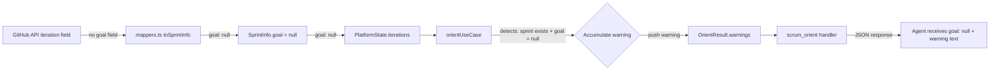

# Sprint Goal Enriched-Error Implementation Strategy

## 1. Problem Statement

The GitHub Projects (V2) iteration field does **not** expose a sprint goal or description. Currently [`toSprintInfo` in `mappers.ts:304`](src/adapters/github/mappers.ts:304) silently hardcodes `goal: null`. This null propagates through `SprintInfo` → `SprintContext` → `OrientResult` without any indication of why it's null — the agent cannot distinguish between "platform doesn't support sprint goals" and "no goal has been set yet".

**Goal:** When any tool operation exposes a sprint goal retrieved from the backend, return the partial result (goal = null) **plus** an enriched error explaining the platform limitation.

---

## 2. Surface Area Analysis

### Tools that expose sprint goal

| Tool                                                | Field                                                   | Layer                | Notes                                                          |
| --------------------------------------------------- | ------------------------------------------------------- | -------------------- | -------------------------------------------------------------- |
| [`scrum_orient`](src/tools/scrum-read.ts:57)        | `platform_state.iterations.active.goal` and `next.goal` | `SprintContext.goal` | **Primary target** — only tool that exposes goal read          |
| [`scrum_plan_sprint`](src/tools/scrum-write.ts:378) | `result.goal` (echo only)                               | Write-side input     | Only echoes back what the agent sent; never reads from backend |

### Tools that do NOT expose sprint goal

- `scrum_find_items` — items have no goal field
- `scrum_get_analytics` — burndown/history have no goal field
- `scrum_get_board_health` — health metrics have no goal field
- `scrum_get_story` — individual stories have no goal field

### Data flow (single path)

```
GitHub API iteration field (no goal)
  ↓
config-loader.ts → IterationEntry { id, title, startDate, duration }
  ↓
mappers.ts → toSprintInfo() → SprintInfo { goal: null }   ← hardcoded
  ↓
backend.ts → getPlatformState() → PlatformState.iterations.{active,next}
  ↓
orient.ts → orientUseCase() → SprintContext { goal: null }
  ↓
scrum_orient handler → JSON result
```

---

## 3. Design Decisions

### Decision 1: Use enriched warnings, not capability flags

Rejected: Adding a `supports.sprintGoals` capability to [`PlatformCapabilities`](src/adapters/capabilities.ts:15). This would be a single-use bool that never gates conditional behavior — the adapter always returns `goal: null`, it just needs to explain why.

**Chosen approach:** Add a `warnings: string[]` accumulation field to the orient response. The orient use-case detects the `goal === null && sprint exists` condition and pushes a formatted warning.

### Decision 2: Keep the mapper unchanged

The GitHub mapper's `goal: null` is correct — the API genuinely doesn't provide a goal. The mapper should remain a pure mapping function. The enrichment belongs in the **use-case layer** where we have all context (sprint info + knowledge of platform limitations).

### Decision 3: Reuse the existing enriched-error format from [`error-enrichment.ts`](src/services/error-enrichment.ts:32)

The warning message should follow the same pattern as `enrichError()` output: `[CODE] message\n\n→ Recovery: instruction`

---

## 4. Implementation Plan

### Step 1: Add `warnings` to `OrientResult` in [`domain/types.ts`](src/domain/types.ts:571)

Add a `warnings` field to the `OrientResult` interface:

```typescript
export interface OrientResult {
  readonly warnings: readonly string[]; // ← NEW: non-empty when the backend cannot provide a requested value
  readonly platform_state: {
    // ... existing fields unchanged
  };
  readonly vocabulary: {
    // ... existing fields unchanged
  };
}
```

**Scope:** Add `warnings` to `OrientResult` only. No changes to `SprintContext`, `SprintInfo`, `PlatformState`, or `BacklogItemListing`.

### Step 2: Detect and warn in [`orientUseCase`](src/scrum/orient.ts:42)

In the orient use-case, after building the sprint contexts, check if the sprint exists but the goal is null, and accumulate a warning:

```typescript
const warnings: string[] = [];

if (state.iterations.active && !state.iterations.active.goal) {
  warnings.push(
    `[SPRINT_GOAL_UNSUPPORTED] The GitHub Projects platform does not expose sprint goals. ` +
      `Goal is null for "${state.iterations.active.name}". ` +
      `Consider setting the sprint goal in scrum_plan_sprint, which echoes it back as metadata.` +
      `\n\n→ Recovery: Use scrum_plan_sprint with a "goal" parameter to record the sprint goal ` +
      `in your planning session.`,
  );
}
if (state.iterations.next && !state.iterations.next.goal) {
  warnings.push(
    `[SPRINT_GOAL_UNSUPPORTED] The GitHub Projects platform does not expose sprint goals. ` +
      `Goal is null for "${state.iterations.next.name}". ` +
      `\n\n→ Recovery: Use scrum_plan_sprint with a "goal" parameter to record the sprint goal.`,
  );
}
```

Append `warnings` to the returned result.

### Step 3: Update tests for [`orientUseCase`](src/scrum/orient.ts)

If tests exist for `orientUseCase`, update them to expect the new `warnings: []` field. No test changes expected for the warning-path tests (they would be new).

---

## 5. Files to Modify

| File                                             | Change                                                       | Impact                                   |
| ------------------------------------------------ | ------------------------------------------------------------ | ---------------------------------------- |
| [`src/domain/types.ts`](src/domain/types.ts:571) | Add `readonly warnings: readonly string[]` to `OrientResult` | Breaking change for all orient consumers |
| [`src/scrum/orient.ts`](src/scrum/orient.ts:42)  | Add warning logic after sprint context building              | Non-breaking logic addition              |
| [`src/scrum/orient.ts`](src/scrum/orient.ts:103) | Include `warnings` in return object                          | Matches new type contract                |

No changes needed to:

- [`src/adapters/github/mappers.ts`](src/adapters/github/mappers.ts:297) — `toSprintInfo` stays as-is
- [`src/adapters/github/backend.ts`](src/adapters/github/backend.ts:119) — no enrichment at platform-state level
- [`src/tools/scrum-read.ts`](src/tools/scrum-read.ts:57) — handler already passes through the full orient result
- [`src/scrum/ports.ts`](src/scrum/ports.ts:92) — `SprintInfo.goal` stays as-is (already `string | null`)
- Any test files — unless new warning-case tests are desired

---

## 6. Future Considerations

1. **Non-GitHub backends:** If a future backend (e.g., Linear, Jira) supports sprint goals, its `toSprintInfo` mapper will return a non-null goal. The orient use-case warning automatically won't fire because `goal !== null`. No changes needed — the enrichment is self-deactivating.

2. **Other unsupported features:** If other fields have similar platform-limitation issues, the same `warnings` accumulation pattern can be extended. For example:
   - Audit-log burndown fallback warning
   - Dependency tracking unavailability

3. **scrum_plan_sprint goal echo:** The existing [`scrum_plan_sprint` handler](src/tools/scrum-write.ts:378) already echoes the `goal` back in the response. The orient warning tells agents to use `scrum_plan_sprint` to record goals, closing the loop.

---

## 7. Architecture Diagram (Data Flow After Change)



No layer-boundary types (`SprintInfo`, `PlatformState`, `SprintContext`) change their goal type. The enrichment is purely additive — a new `warnings` array on the output type.
