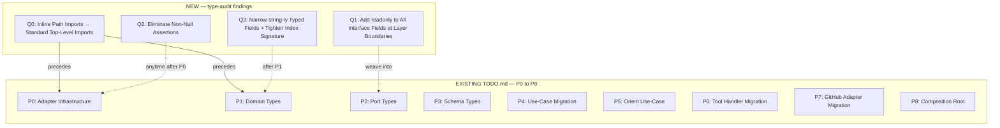

# Type Management Refactoring Plan

**Derived from:** TypeScript type management audit conducted in `project-research` mode (2026-05-24).\
**Predecessor:** `tasks/TODO.md` (covers P0–P8 for infrastructure + type consolidation).\
**Relationship:** This plan **extends** `tasks/TODO.md` — it adds phases for audit findings not covered there.\
**Integration:** Execute new phases (Q0–Q3) either before, alongside, or after `tasks/TODO.md` phases as indicated.

---

## Architecture



**Why this order:**

- **Q0 first** — inline path imports must be converted before any phase that touches those files, because every subsequent edit relies on proper module resolution.
- **Q1 during P2** — the port boundary is where `readonly` matters most; adding it as port types are created is cheaper than a separate pass.
- **Q2 any time** — non-null assertions are mechanical fixes; can be done in any order.
- **Q3 after P1** — tightens existing domain types after P1 adds new ones, ensuring a consistent baseline.

---

## Phase Q0 — Convert Inline Path Imports to Standard Top-Level Imports

**Risk:** 🟢 Low — mechanical, no behavioral change.\
**Dependency:** None.\
**Integration:** Run before P0.

### Problem

Three files use `import("../path/to/module.ts").TypeName` instead of a standard top-level `import type` declaration:

| File                                                                       | Line | Inline Import                                 | Replaces                                                   |
| -------------------------------------------------------------------------- | ---- | --------------------------------------------- | ---------------------------------------------------------- |
| [`src/scrum/ports.ts`](src/scrum/ports.ts:129)                             | 129  | `import("../domain/types.ts").StoryComment`   | `import type { StoryComment } from "../domain/types.ts"`   |
| [`src/scrum/ports.ts`](src/scrum/ports.ts:130)                             | 130  | `import("../domain/types.ts").LinkedArtifact` | `import type { LinkedArtifact } from "../domain/types.ts"` |
| [`src/adapters/abstract-backend.ts`](src/adapters/abstract-backend.ts:122) | 122  | `import("../domain/types.ts").SprintRef`      | `import type { SprintRef } from "../domain/types.ts"`      |
| [`src/adapters/abstract-backend.ts`](src/adapters/abstract-backend.ts:136) | 136  | `import("../domain/types.ts").SprintRef`      | `import type { SprintRef } from "../domain/types.ts"`      |

### Impact

- Inline path imports bypass Deno's module resolution, break IDE find-references, and silently break when the target module is refactored.
- The `ports.ts` case also duplicates what should be a top-level import — `StoryComment` and `LinkedArtifact` are already imported in the `import type` block on lines 13-25? Let's verify.

Let me check what's already imported at the top of `ports.ts`:

From the file read:

```
import type {
  AnalyticsResult,
  BacklogHealth,
  DependencyEntry,
  EpicListing,
  EpicRef,
  EpicSummary,
  ItemSearchResult,
  SprintRef,
  Story,
  StoryRef,
  TemplateUriMap,
} from "../domain/types.ts";
```

`StoryComment` and `LinkedArtifact` are NOT in this list. So the fix is to add them to the top-level import block and replace the inline references.

### Steps

1. **`src/scrum/ports.ts`:**
   - Add `StoryComment` and `LinkedArtifact` to the existing `import type` block from `"../domain/types.ts"` (line 13)
   - Replace inline `import("../domain/types.ts").StoryComment[]` with `StoryComment[]` on line 129
   - Replace inline `import("../domain/types.ts").LinkedArtifact[]` with `LinkedArtifact[]` on line 130

2. **`src/adapters/abstract-backend.ts`:**
   - Add `SprintRef` to the existing `import type` block from `"../domain/types.ts"` (line 22-28)
   - Replace inline `import("../domain/types.ts").SprintRef` with `SprintRef` on line 122
   - Replace inline `import("../domain/types.ts").SprintRef` with `SprintRef` on line 136

### Verification

```bash
deno lint
deno task test
```

---

## Phase Q1 — Add `readonly` to Interface Fields at Layer Boundaries

**Risk:** 🟢 Low — adding `readonly` is backward-compatible (widens the accepted input types).\
**Dependency:** After Q0 (to avoid import path churn). P2 is the natural insertion point.\
**Integration:** Execute during P2 (Port Types) in `tasks/TODO.md`.

### Files to Modify

#### High Priority — Port Boundary Types (`src/scrum/ports.ts`)

These types cross the architectural seam between use-cases and adapters. `readonly` here is a contract: "the adapter will not mutate what the use-case passes, and the use-case will not mutate what the adapter returns."

| Type                                           | Fields to make `readonly` | Rationale                                                 |
| ---------------------------------------------- | ------------------------- | --------------------------------------------------------- |
| [`ItemFilter`](src/scrum/ports.ts:34)          | All 14 fields             | Input type — use-case constructs it, adapter reads it     |
| [`ResolvedItemFilter`](src/scrum/ports.ts:55)  | All 13 fields             | Same                                                      |
| [`AnalyticsQuery`](src/scrum/ports.ts:75)      | All 3 fields              | Same                                                      |
| [`SprintInfo`](src/scrum/ports.ts:84)          | All 5 fields              | Crosses boundary — created by adapter, consumed by domain |
| [`BurndownStoryInput`](src/scrum/ports.ts:138) | All 4 fields              | Same                                                      |
| [`CreateStoryInput`](src/scrum/ports.ts:166)   | All 7 fields              | Input from handler to adapter                             |
| [`StoryUpdates`](src/scrum/ports.ts:179)       | All 6 fields              | Same                                                      |
| [`ImpedimentListing`](src/scrum/ports.ts:227)  | All 5 fields              | Output from adapter to use-case                           |

#### Medium Priority — Domain Output Types (`src/domain/types.ts`)

These are returned to tool handlers and serialized. The tool handler never mutates them, but `readonly` prevents accidental mutation during use-case assembly.

| Type                                          | Fields to make `readonly`                                              | Rationale                  |
| --------------------------------------------- | ---------------------------------------------------------------------- | -------------------------- |
| [`DependencyEntry`](src/domain/types.ts:88)   | All 3 fields                                                           | Crosses layer boundary     |
| [`EpicListing`](src/domain/types.ts:73)       | All 6 fields                                                           | Output type                |
| [`StoryBase`](src/domain/types.ts:308)        | All ~14 fields + `ReadonlyArray<string>` for `assignees`/`labels`      | Base of all story variants |
| [`ItemListing`](src/domain/types.ts:263)      | All 8 fields + `ReadonlyArray<DependencyEntry>` for `has_dependencies` | Output type                |
| [`BurndownResponse`](src/domain/types.ts:363) | All 5 fields + `ReadonlyArray<BurndownDayPoint                         | IdealDayPoint              |
| [`SprintSnapshot`](src/domain/types.ts:458)   | All 4 fields + `ReadonlyArray<ItemListing>`                            | Output type                |
| [`ItemDetailResult`](src/domain/types.ts:514) | All 4 fields + `ReadonlyArray` for arrays                              | Output type                |
| [`OrientResult`](src/domain/types.ts:528)     | All fields + `ReadonlyArray` for arrays                                | Output type                |
| [`BacklogHealth`](src/domain/types.ts:242)    | All fields                                                             | Output type                |

### Pattern

**Before:**

```typescript
export interface DependencyEntry {
  key: string;
  title: string | null;
  ref: ResolvedRef;
}
```

**After:**

```typescript
export interface DependencyEntry {
  readonly key: string;
  readonly title: string | null;
  readonly ref: ResolvedRef;
}
```

For arrays:

```typescript
// Before:
assignees: string[];
labels: string[];

// After:
assignees: readonly string[];
labels: readonly string[];
```

### Pattern for `ReadonlyArray`

**Before:**

```typescript
export interface BurndownResponse {
  stories: BurndownStory[];
  series: BurndownDayPoint[];
}
```

**After:**

```typescript
export interface BurndownResponse {
  readonly stories: readonly BurndownStory[];
  readonly series: readonly BurndownDayPoint[];
}
```

### Verification

No behavioral change. `readonly` is a TypeScript compile-time constraint that doesn't affect emitted JS.

```bash
deno lint
deno task test
```

**Caveat:** If any code currently mutates these arrays (e.g., `items.push(...)` or `story.assignees.push(login)`), those sites will produce compile errors. This is **desirable** — it surfaces latent mutation bugs. Fix each by replacing mutation with immutable patterns (`[...arr, newItem]` or `arr.concat(...)`).

---

## Phase Q2 — Eliminate Non-Null Assertions (`!`)

**Risk:** 🟢 Low — mechanical correctness improvement.\
**Dependency:** Any time after P0. The files will change during P4–P7, so doing this early avoids rework.\
**Integration:** Execute immediately after Q0, before any TODO.md phase that modifies affected files.

### Sites to Fix

#### 1. [`src/scrum/sprint-math.ts`](src/scrum/sprint-math.ts:78,86) — `groupMap.get(statusName)!`

**Current code:**

```typescript
const orderedGroups = statusOrder
  .filter((statusName) => groupMap.has(statusName))
  .map((statusName) => ({
    status: statusName,
    stories: groupMap.get(statusName)!, // ! assertion — line 78
    points_sum: groupMap.get(statusName)! // ! assertion — line 86
      .reduce((acc, s) => acc + (s.story_points ?? 0), 0),
  }));
```

**Fix:** Extract to a local const. The `.filter()` guarantees the key exists, but TypeScript cannot track this across the `.map()` callback boundary. Use a `Map.prototype.get()` guard or restructure:

```typescript
const orderedGroups: Array<{ status: string; stories: Story[]; points_sum: number }> = [];

for (const statusName of statusOrder) {
  const groupStories = groupMap.get(statusName);
  if (!groupStories) continue; // still safe after filter
  orderedGroups.push({
    status: statusName,
    stories: groupStories,
    points_sum: groupStories.reduce((acc, s) => acc + (s.story_points ?? 0), 0),
  });
}
```

**Why:** The `.filter()` + `.map()` pair is not atomic — refactoring could reorder them or remove the filter. A `for` + guard is more robust and equally readable.

---

#### 2. [`src/adapters/github/mappers.ts`](src/adapters/github/mappers.ts:325,328) — `issueIdToItemId.get(e.ref.id)!` / `keyToId.get(e.key)!`

**Current code:**

```typescript
const resolve = (entries: DependencyEntry[]): DependencyEntry[] =>
  entries.map((e) => {
    if (issueIdToItemId.has(e.ref.id)) {
      return { ...e, ref: { id: issueIdToItemId.get(e.ref.id)! } }; // line 325
    }
    if (keyToId.has(e.key)) {
      return { ...e, ref: { id: keyToId.get(e.key)! } }; // line 328
    }
    return e;
  });
```

**Fix:** Use a local const + ternary to eliminate the `!`:

```typescript
const resolve = (entries: DependencyEntry[]): DependencyEntry[] =>
  entries.map((e) => {
    const idFromIssue = issueIdToItemId.get(e.ref.id);
    if (idFromIssue) {
      return { ...e, ref: { id: idFromIssue } };
    }
    const idFromKey = keyToId.get(e.key);
    if (idFromKey) {
      return { ...e, ref: { id: idFromKey } };
    }
    return e;
  });
```

**Why:** Eliminates the assumption that `.has()` + `.get()` are called on the same map state. A `.get()` returning `undefined` followed by a falsy check is identical to a `.has()` + `.get()` pair, but is safe against concurrent modification.

---

### Verification

```bash
deno lint       # catches remaining `!` if no-explicit-any is configured
deno task test  # runtime behavior is identical — assertions were correct
```

---

## Phase Q3 — Tighten `string` Fields and Index Signature

**Risk:** 🟢 Low — strictly narrows existing types.\
**Dependency:** After P1 (domain types stable).\
**Integration:** After P1 in `tasks/TODO.md`, before P2.

### 3a — Narrow `StoryBase.type` from `string | null` to `ItemType | null`

**File:** [`src/domain/types.ts`](src/domain/types.ts:312)

**Current:**

```typescript
export interface StoryBase {
  type: string | null;
  // ...
}
```

**Why:** The `type` field carries the canonical type key (e.g., `"feature"`, `"bug"`), not a display name. `ItemType` is the exact set of valid canonical keys (`typeof ITEM_TYPES[number]`). Using `string | null`:

- Allows invalid values like `"Feature"` (display name) where `"feature"` (canonical key) is expected
- Silently accepts typos at compile time
- Prevents the compiler from narrowing switches over `type`

**After:**

```typescript
export interface StoryBase {
  type: ItemType | null;
  // ...
}
```

**Caveat:** If any adapter code maps a display-name to a canonical key at runtime and the mapping is incomplete, this narrowing will cause casting. That casting already exists in the adapter — the narrowing just makes it visible. Check that the `type` field is always populated with a canonical key by the time it reaches the domain type.

---

### 3b — Remove Index Signature from `GitHubBackendConfig.field_mapping`

**File:** [`src/adapters/github/types.ts`](src/adapters/github/types.ts:42-51)

**Current:**

```typescript
export interface GitHubBackendConfig {
  field_mapping: {
    sprint: string;
    status: string;
    story_points?: string;
    priority?: string;
    item_type?: string;
    epic?: string;
    assignee?: string;
    [key: string]: string | undefined; // ← catch-all index signature
  };
}
```

**Why:** The index signature allows any string key (`sttus`, `sprit`, etc.) without a compile error. The config loader validates `field_mapping` at boot time, so runtime safety is preserved, but type safety is not. Tools like `resolveFieldIds()` in `config-loader.ts` iterate over known keys by name — the index signature does not pay for itself.

**After:**

```typescript
export interface GitHubBackendConfig {
  field_mapping: {
    sprint: string;
    status: string;
    story_points?: string;
    priority?: string;
    item_type?: string;
    epic?: string;
    assignee?: string;
  };
}
```

---

### 3c — Narrow `scope` Field in Filter Types

**File:** [`src/scrum/ports.ts`](src/scrum/ports.ts:35)

**Current:**

```typescript
export interface ItemFilter {
  scope?: "backlog" | "sprint" | "all";
}
```

**Recommendation:** Extract the scope union into a named type so it's reused:

```typescript
export type SearchScope = "backlog" | "sprint" | "all";
```

Then use `SearchScope` in both `ItemFilter` and `ResolvedItemFilter`. Low urgency — additive only.

---

## Summary: Integration with Existing TODO.md

| New Phase                    | TODO.md Insertion Point  | Files Changed            | Est. Effort |
| ---------------------------- | ------------------------ | ------------------------ | ----------- |
| **Q0: Inline imports**       | Before P0                | 2 files                  | 10 min      |
| **Q1: `readonly`**           | During P2                | ~15 types across 2 files | 30 min      |
| **Q2: Non-null assertions**  | Before P4 (file changes) | 2 files                  | 10 min      |
| **Q3a: Narrow `type` field** | After P1                 | 1 file                   | 5 min       |
| **Q3b: Remove index sig**    | After P1                 | 1 file                   | 5 min       |
| **Q3c: Named scope type**    | After P1                 | 1 file                   | 5 min       |

**Total new work:** ~1 hour of mechanical refactoring.

### Recommended Execution Order

```
Q0 → Q2 → P0 → P1 → Q3 → P2 (with Q1 woven in) → P3 → P4 → P5 → P6 → P7 → P8
```

This interleaves the new audit findings with the existing TODO.md phases at the earliest safe insertion points, minimizing rework.

### Testing Strategy

All phases are type-level or mechanical refactorings:

| Phase | Test Strategy                                                                                                             |
| ----- | ------------------------------------------------------------------------------------------------------------------------- |
| Q0    | `deno check src/index.ts` + lint — path resolution verified                                                               |
| Q1    | `deno lint` + `deno task test` — `readonly` is compile-time only, no runtime effect. Fix any mutation sites that surface. |
| Q2    | `deno task test` — runtime behavior identical. Confirm `grep -r 'get(.*)!' src/` returns no remaining sites.              |
| Q3    | `deno lint` + `deno task test` — type narrowing may surface unused branches or casts.                                     |
