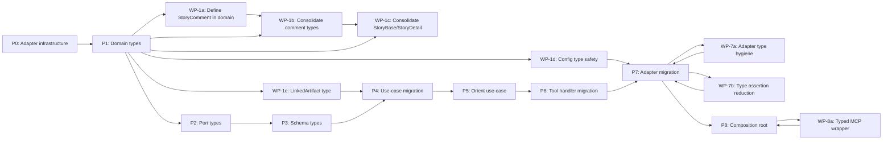

# Type Smell Cleanup — Implementation Plan

> **Traceability:** This plan addresses the 14 type-declaration and reference smells identified in the [comprehensive smell check](../tasks/REFACTORING.md). It augments the existing [P0-P8 implementation strategy](../tasks/TODO.md) with specific type-hygiene work packages. Nothing here contradicts the existing plan — it closes gaps that the existing plan does not cover.

---

## Traceability Matrix

| #  | Smell                                         | Severity | Covered by existing phase?            | Work package                                 |
| -- | --------------------------------------------- | -------- | ------------------------------------- | -------------------------------------------- |
| 1  | `StoryBase` / `StoryDetail` field duplication | High     | P1 (domain types) — partially         | WP-1c: Consolidate StoryBase and StoryDetail |
| 2  | `StoryListing` deprecated duplicate           | High     | P2 (port types) — remove StoryListing | Covered by P2                                |
| 3  | `SprintTotals` dual import path               | High     | P2 (port types) — remove re-exports   | Covered by P2                                |
| 4  | Inline `BackendWithSprintStories`             | Medium   | P6 (tool handler) — remove call       | Covered by P6                                |
| 5  | Inline `GetDraftIssueDetailsResponse`         | Medium   | **NEW**                               | WP-7a: Adapter internal type hygiene         |
| 6  | Multiple inline response interfaces (8 files) | Medium   | **NEW**                               | WP-7a: Adapter internal type hygiene         |
| 7  | 11+ `as` type assertions                      | Medium   | P7 (adapter migration) — partial fix  | WP-7b: Type assertion reduction              |
| 8  | `as unknown as` double assertion              | Medium   | P6 — remove getSprintStories          | Covered by P6                                |
| 9  | `as unknown` MCP server cast                  | Medium   | **NEW**                               | WP-8a: Typed MCP server wrapper              |
| 10 | Deprecated types still exported               | Low      | P2 — remove deprecated types          | Covered by P2                                |
| 11 | `Record<string, unknown>` config erasure      | Medium   | **NEW**                               | WP-1d: Config type safety improvement        |
| 12 | `StoryComment` duplicated across layers       | Medium   | **NEW**                               | WP-1b: Consolidate comment types             |
| 13 | `Comment` triple duplication                  | Medium   | **NEW**                               | WP-1b: Consolidate comment types             |
| 14 | `linkedPrs` GitHub-specific naming in domain  | Medium   | **NEW**                               | WP-1e: Domain-gnostic LinkedArtifact type    |

---

## Dependency Graph



---

## Work Packages

### WP-1a: Add `StoryComment` to domain/types.ts (🟢 Low)

**Prerequisite:** P1 domain types work must be in progress (this adds to the same file).

**Action:** Add an exported `StoryComment` interface to [`src/domain/types.ts`](../src/domain/types.ts) alongside `ItemDetailResult`:

```typescript
/** A comment on a story. Shared across domain, port, and adapter layers. */
export interface StoryComment {
  author: string;
  body: string;
  created_at: string; // ISO-8601
  url: string;
}
```

**Then update [`ItemDetailResult.comments`](../src/domain/types.ts:489-496):**

```typescript
// Before:
comments: {
  author: string;
  body: string;
  created_at: string;
  url: string;
}[];
// After:
comments: StoryComment[];
```

**Files changed:** 1 (`src/domain/types.ts`)

---

### WP-1b: Consolidate comment type references (🟡 Medium)

**Prerequisite:** WP-1a complete.

**Actions:**

1. **Remove** [`StoryComment` from `src/scrum/ports.ts:120`](../src/scrum/ports.ts:120) — make `StoryDetail.comments` reference the domain `StoryComment` type via import.

   ```
   // In StoryDetail, change:
   comments: StoryComment[];
   // to:
   comments: import("../domain/types.ts").StoryComment[];
   // Or better: import and reference directly.
   ```

2. **Replace** [`Comment` in `src/adapters/github/types.ts:201`](../src/adapters/github/types.ts:201) with an import of `StoryComment` from domain. The adapter should import, not define its own:
   ```typescript
   import type { StoryComment } from "../../domain/types.ts";
   ```
   If the adapter produces `StoryComment` directly (from `buildCommentList`), change its return type. If internal GraphQL processing requires an intermediate shape, rename the adapter-internal type to `CommentRaw` or keep it inline.

3. **Check callers** — `buildCommentList` in [`src/adapters/github/mappers.ts`](../src/adapters/github/mappers.ts) and any other comment-construction function — ensure they return `StoryComment[]` from domain.

**Files changed:** 3 (`src/domain/types.ts`, `src/scrum/ports.ts`, `src/adapters/github/types.ts` + potentially `mappers.ts`)

**Verification:** `deno check src/index.ts` — no compile errors. No duplicate `author`, `body`, `created_at`, `url` interface definitions survive.

---

### WP-1c: Consolidate `StoryBase` and `StoryDetail` field definitions (🟡 Medium)

**Prerequisite:** P1 domain types work.

**Action:** [`StoryBase`](../src/domain/types.ts:308) defines the fields that constitute a Story entity. [`StoryDetail`](../src/scrum/ports.ts:128) wraps the same `Story` type. The TODO at line 308 says: `// todo: also a close duplicate of the ports.ts. The type should be uniformed`.

**Analysis:** This is not actually a duplicate — `StoryBase` is the entity, `StoryDetail` is the wrapper that wraps `story: Story` plus associated data. The comment may be stale. Verify during P1 that:

- `ItemDetailResult` (domain) and `StoryDetail` (port) should converge. `ItemDetailResult` is the intended domain type. `StoryDetail` should become an alias or be removed.
- If `StoryDetail` is still needed at the port boundary for adapter implementations, re-export it from domain.
- Otherwise, remove `StoryDetail` and use `ItemDetailResult` everywhere.

**Decision rule:** If `StoryDetail` has no fields beyond `{ story: Story; comments: StoryComment[]; linkedPrs: ... }` that are not already in `ItemDetailResult`, delete `StoryDetail` and point callers to `ItemDetailResult`.

**Files changed:** `src/scrum/ports.ts`, `src/adapters/github/internal/story-query-service.ts` (return type), `src/adapters/github/backend.ts` (port method return type)

---

### WP-1d: Config type safety improvement (🔴 High — design decision needed)

**Prerequisite:** P1 domain types work.

**Problem:** [`ScrumConfig.backends`](../src/domain/config.ts:105) is typed as `Record<string, unknown>`, forcing 10+ `as GitHubBackendConfig` assertions across the adapter layer.

**Options (choose one):**

| Option                                | Effort | Risk   | Trade-off                                                                                                    |
| ------------------------------------- | ------ | ------ | ------------------------------------------------------------------------------------------------------------ |
| A. Do nothing (status quo)            | None   | None   | Perpetuates `as` assertions; acknowledged design trade-off                                                   |
| B. Generic parameter on `ScrumConfig` | 1 day  | Low    | Adds `ScrumConfig<T extends Record<string, unknown>>` — type-safe but verbose                                |
| C. Discriminated union per platform   | 2 days | Medium | `{ platform: "github", config: GitHubBackendConfig } \| ...` — cleanest but forces full platform abstraction |

**Recommendation:** Option B (generic parameter) — minimal change, immediate type safety gain, no behavioral change:

```typescript
export interface ScrumConfig<T extends Record<string, unknown> = Record<string, unknown>> {
  project: { ... };
  backends: T;  // concrete adapter configs pass a typed union
}
```

Then at the adapter factory boundary (`src/adapters/github/factory.ts`):

```typescript
const config = await loadConfig({ github: { graphql } });
// Before:
const gh = config.scrumConfig.backends.github as GitHubBackendConfig;
// After (config loader typed correctly):
const gh = config.scrumConfig.backends.github; // already GitHubBackendConfig
```

**Files changed:** `src/domain/config.ts`, `src/adapters/github/config-loader.ts` (return type), `src/adapters/github/factory.ts`, `src/adapters/github/internal/pagination.ts`, `src/adapters/github/internal/config-reloader.ts`

---

### WP-1e: Domain-gnostic `LinkedArtifact` type (🟡 Medium)

**Prerequisite:** P1 domain types work.

**Action:** [`ItemDetailResult.linkedPrs`](../src/domain/types.ts:497) uses the GitHub-specific term "PRs". The [ports.ts todo at line 131](../src/scrum/ports.ts:131) says: `// todo: instead of linked PRs (a GitHub term), it should be a generalized type of LinkedStory`.

1. Add a platform-agnostic type to domain:

```typescript
/** A linked artifact (pull request, merge request, patch, etc.) associated with a story. */
export interface LinkedArtifact {
  number: number;
  title: string;
  url: string;
  state: string;
  is_draft: boolean;
}
```

2. Rename `linkedPrs` to `linked_artifacts` in `ItemDetailResult`.

3. Keep the `LinkedPr` adapter type in [`src/adapters/github/types.ts:209`](../src/adapters/github/types.ts:209) as a GitHub-specific implementation detail, mapping to `LinkedArtifact` at the boundary.

**Files changed:** `src/domain/types.ts`, `src/adapters/github/types.ts`, `src/adapters/github/mappers.ts` (mapping function), `src/scrum/ports.ts` (if `StoryDetail` survives), `src/scrum/get-story.ts` (if it references the field)

---

### WP-7a: Adapter internal type hygiene (🟢 Low)

**Prerequisite:** P7 adapter migration in progress (adds to existing files).

**Action:** Extract inline response interfaces to named types at file scope in each affected adapter internal file:

| File                                                                                                                    | Inline interface               | Target location                      |
| ----------------------------------------------------------------------------------------------------------------------- | ------------------------------ | ------------------------------------ |
| [`src/adapters/github/internal/story-query-service.ts:191`](../src/adapters/github/internal/story-query-service.ts:191) | `GetDraftIssueDetailsResponse` | Top of same file, exported as needed |
| [`src/adapters/github/internal/resolver.ts:34`](../src/adapters/github/internal/resolver.ts:34)                         | `ItemByIdResponse`             | Top of same file                     |
| [`src/adapters/github/internal/epic-service.ts:25`](../src/adapters/github/internal/epic-service.ts:25)                 | `ListMilestonesResponse`       | Top of same file                     |
| [`src/adapters/github/internal/impediment-service.ts:44`](../src/adapters/github/internal/impediment-service.ts:44)     | `ImpedimentIssuesResponse`     | Top of same file                     |
| [`src/adapters/github/internal/pagination.ts:48`](../src/adapters/github/internal/pagination.ts:48)                     | `ProjectItemsResponse`         | Top of same file                     |
| [`src/adapters/github/internal/vocabulary-manager.ts:26`](../src/adapters/github/internal/vocabulary-manager.ts:26)     | `GetFieldOptionsResponse`      | Top of same file                     |
| [`src/adapters/github/internal/contents.ts:18`](../src/adapters/github/internal/contents.ts:18)                         | `RepoFileResponse`             | Top of same file                     |
| [`src/adapters/github/internal/label-resolver.ts:27`](../src/adapters/github/internal/label-resolver.ts:27)             | `RepoLabelsResponse`           | Top of same file                     |

**Pattern for each:**

```typescript
// Before (inline):
private async someMethod(): Promise<T> {
  interface InlineResponse { ... }
  // ...
}

// After (top of file):
/** Response shape for the [query name] GraphQL query. */
interface InlineResponse { ... }

// In method:
private async someMethod(): Promise<T> {
  // InlineResponse now references the named type
}
```

**Important:** These are adapter-internal types. Do NOT export them from the adapter's public surface. Do NOT move them to `adapter/types.ts` — they are per-service query projections, not shared types.

**Files changed:** 8 files (listed above)

---

### WP-7b: Type assertion reduction (🟡 Medium)

**Prerequisite:** WP-1d (config type safety) and WP-7a (adapter type hygiene).

**Action:** Replace raw `as` assertions with type-narrowing functions where possible:

1. **`as SprintRef`** (4 locations: story-query-service, board-health-service, story-mutation-service)
   - Create a type guard: `const isSprintRef = (v: string): v is SprintRef => ["current", "next", ...].includes(v) || /^Sprint \d+$/.test(v);`
   - Replace `value as SprintRef` with guarded assertions or use the resolved iteration ID directly.

2. **`as GitHubBackendConfig`** (2 locations: factory, config-loader)
   - Fixed by WP-1d (config type safety).

3. **`as ProjectItem["content"]` / `as ProjectItem["type"]`** (3 locations: story-query-service, pagination)
   - Replace with a mapper function in `mappers.ts` that takes the raw GraphQL node and returns `ProjectItem` with proper type narrowing, e.g.:
   ```typescript
   export const rawToProjectItem = (raw: RawProjectItem): ProjectItem => {
     // Type-narrowed construction
     if (raw.content?.__typename === "Issue") {
       return { content: raw.content as ProjectItemIssueContent, ... };
     }
     // ...
   };
   ```

4. **`as ProjectItemIssueContent`** (2 locations: impediment-service, sprint-history-service)
   - Replace with the same `rawToProjectItem` mapper above, then access `.content` through the typed `ProjectItem`.

**Files changed:** `src/adapters/github/mappers.ts` (new mapper), plus 6 consumer files

---

### WP-8a: Typed MCP server wrapper (🟢 Low)

**Prerequisite:** P8 composition root work.

**Action:** The [`as unknown as McpServerInternal` cast in `src/index.ts:50`](../src/index.ts:50) is necessary because the MCP SDK's `McpServer` class does not expose `registerTool` in its public type. However, the inline `McpServerInternal` interface at line 43 can be extracted and the cast made safer:

1. Extract `McpServerInternal` interface to a shared location (`src/services/mcp-server-types.ts` or similar) so it's not buried in the handler.

2. Add a runtime check before the cast:

```typescript
if (typeof (_server as any)["registerTool"] !== "function") {
  throw new Error("MCP server instance does not have registerTool — SDK version mismatch?");
}
```

3. Document the cast with a reference to the SDK issue/PR that would make it unnecessary.

**Files changed:** 1 (`src/index.ts`), plus optionally `src/services/mcp-server-types.ts` (new file)

---

## Verification Gate (run after each work package)

```bash
deno lint
deno task test
deno check src/index.ts
# Verify no new adapter-to-domain leak:
grep -r "import.*from.*adapters/github" src/scrum/ src/domain/ src/schemas/
```

---

## Anti-patterns to Avoid

1. **Over-abstracting inline adapter types** — WP-7a moves types to file scope, NOT to `types.ts`. These are query projections, not shared concepts. If two services use the same shape, THEN promote it.

2. **Breaking the backward compatibility** of `ItemDetailResult.linkedPrs` — WP-1e renames the field. Any external consumer (tests, or future agents reading response shapes) will break. Decide whether to keep an alias or make a clean break.

3. **Generic type complexity** — WP-1d (Option B) adds `ScrumConfig<T>`. Don't over-engineer: one generic parameter for the `backends` field is sufficient. Don't add `T extends Record<string, unknown>` constraints everywhere — only at the point of extraction.

4. **Premature factory extraction** — `rawToProjectItem` in WP-7b should stay in `mappers.ts`. Do NOT jump to a separate factory file unless the mapper exceeds 100 lines.
