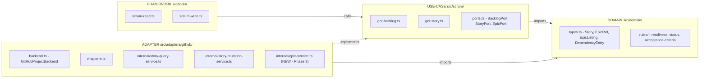
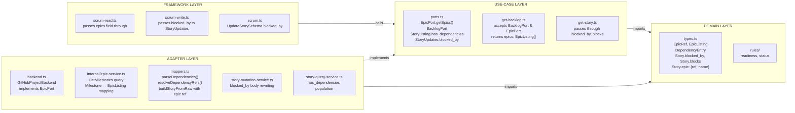

# Architecture Audit — REFACTORING.md: Epics & Story Dependencies

**Date:** 2026-05-19 | **Auditor:** Architect mode | **Subject:** `tasks/REFACTORING.md`

## Summary

The refactoring plan is **architecturally sound** and aligns with the project's established three-layer Clean Architecture. It corrects an existing layer violation (`Story.epic` as a raw GitHub Milestone title), introduces two domain concepts (`EpicRef`/`EpicListing` and `DependencyEntry`) with proper port abstractions, and extends the tool surface without adding new MCP tools — a disciplined choice that respects the existing contract surface. Five enhancements are recommended; none are blockers.

---

## Architecture as Found

The codebase has three clean dependency layers, verified against [`docs/proj-diagram.md`](../docs/proj-diagram.md):



**Current layer violation:** [`IssueStory.epic`](../src/domain/types.ts:85) is typed `string | null` — a GitHub Milestone title has leaked into the domain entity layer. Line 22 carries a stale `// todo: need to handle epics as first-class object` comment confirming this is known debt. The plan directly addresses this.

**Current dependency convention:** Dependencies between stories exist only as prose in the story body. No structured representation exists. The plan introduces parsing with proper isolation in the adapter layer.

---

## Design Decision Evaluation

Each of the eight locked design decisions (D1–D8) was evaluated against the Dependency Rule, SOLID, and ISP.

### D1 — Epics in `scrum_get_backlog`, not a dedicated tool ✅

**Verdict: Correct.** The agent needs epics during backlog orientation. Adding `scrum_get_epics` would require a separate orchestration call in every planning workflow. The [`GetBacklogResult`](../src/scrum/get-backlog.ts:22) return shape is owned by the use-case layer — adding an `epics` field here is an extension of an existing contract, not a new tool. This follows the existing pattern where `orphan_impediments` was added to the same response rather than given its own tool.

### D2 — Epic writes through existing story tools ✅

**Verdict: Correct.** [`scrum_create_story`](../src/tools/scrum-write.ts) and [`scrum_update_story`](../src/tools/scrum-write.ts) already accept `epic?: string`. The plan extends the input to also accept the opaque `EpicRef.id`. Adding dedicated `scrum_create_epic` / `scrum_update_epic` tools would violate YAGNI at the tool surface level — epics are created implicitly when a story is assigned to a new Milestone title.

### D3 — `Story.epic` type changes from `string | null` to `{ ref: EpicRef; name: string } | null` ⭐

**Verdict: The most important architectural improvement in the plan.** The current `string | null` is a Diagnostic Rule violation — a platform-specific concept (GitHub Milestone title) has leaked into [`src/domain/types.ts`](../src/domain/types.ts:85), the innermost layer. The new type `{ ref: EpicRef; name: string } | null` is backend-agnostic. The `EpicRef.id` is an opaque handle; the `name` is a human-readable label. Both are legitimate domain concepts independent of GitHub.

The plan correctly identifies this as a breaking change and contains it to Phase 2 with an atomic fix-everything strategy. Every downstream consumer of `story.epic` is updated in a single phase. The build must pass at the end of Phase 2.

### D4 — GitHub adapter maps Milestones → EpicListing ✅

**Verdict: Classic Adapter pattern.** The port defines `EpicListing` with backend-agnostic fields; the GitHub adapter translates its platform concept (Milestone) to that shape. The mapping table is explicit and complete:

| Milestone field                 | EpicListing field                    | Notes          |
| ------------------------------- | ------------------------------------ | -------------- |
| `milestone.id`                  | `EpicListing.ref.id`                 | Node ID (MI_…) |
| `milestone.title`               | `EpicListing.name`                   |                |
| `milestone.description`         | `EpicListing.description`            | Null if empty  |
| `milestone.state` (OPEN/CLOSED) | `EpicListing.status` ("open"/"done") |                |
| `openIssues + closedIssues`     | `EpicListing.story_count`            |                |

Future non-GitHub adapters map their own concept to the same shape — the Dependency Rule holds.

### D5 — Dependencies stored as `## Dependencies` markdown section ⚠️

**Verdict: Pragmatic compromise, properly isolated.** GitHub has no native project-level dependency field. Parsing markdown body content for structured data crosses a presentation/logic boundary. However:

- The parsing/writing logic is **properly isolated** in the adapter layer ([`mappers.ts`](../src/adapters/github/mappers.ts) and [`story-mutation-service.ts`](../src/adapters/github/internal/story-mutation-service.ts)).
- The port contract (`DependencyEntry`) is backend-agnostic — other backends (Linear, Notion) implement native dependency fields without markdown parsing.
- The convention (`- Blocked by: #N` / `- Blocks: #N`) is simple, unambiguous, and human-editable.

**Risk:** If the agent or a human edits the body outside this convention without updating the `## Dependencies` section, the parsed data goes stale. This is accepted as a limitation of the GitHub adapter.

### D6 — `has_dependencies: boolean` in `StoryListing` ✅

**Verdict: Efficient design.** A cheap parse flag derived from domain data (not adapter data) that avoids the agent fetching full story detail just to discover there are no dependencies. Follows the existing pattern of `StoryListing` carrying lightweight computed fields.

### D7 — `DependencyEntry.ref.id` may be null ⚠️

**Verdict: Acceptable but incomplete.** Best-effort resolution in `getBacklogStories`/`getSprintStories` (where all items are in-memory) is a good optimization. But `getStoryDetail` returns `ref.id = null` with no path to resolution. A follow-up phase for targeted resolution in the detail path would complete this.

### D8 — `scrum_update_story` gains `blocked_by` ✅

**Verdict: Consistent with existing patterns.** Follows the atomic-replace convention used by `labels` and `assignees`. `null` clears all; omitting leaves unchanged. The Zod schema addition follows the established pattern.

---

## Findings

### P0 — None

No cycle violations, no dependency rule breaks, no entities importing frameworks.

### P1 — Fix opportunistically

| #    | Finding                                                                                                                                                                                                            | Recommended action                                                                                                                                                                                                | Location                                        |
| ---- | ------------------------------------------------------------------------------------------------------------------------------------------------------------------------------------------------------------------ | ----------------------------------------------------------------------------------------------------------------------------------------------------------------------------------------------------------------- | ----------------------------------------------- |
| P1.1 | `blocks` field missing from `scrum_update_story` — agent can write `blocked_by` but not `blocks` via the tool. To set downstream dependencies, the agent must manually edit the body, bypassing the tool contract. | Add `blocks?: StoryRef[] \| null` to [`StoryUpdates`](../src/scrum/ports.ts:109) and to [`UpdateStorySchema`](../src/schemas/scrum.ts:221), mirroring the `blocked_by` pattern exactly. Include in Phase 4 scope. | `ports.ts:109`, `schemas/scrum.ts:221`, Phase 4 |
| P1.2 | [`getStoryUseCase`](../src/scrum/get-story.ts:13) types the returned `story` as `unknown`. When `blocked_by` and `blocks` fields are added to `Story`, they will pass through without TypeScript validation.       | Change `GetStoryResult.story` type from `unknown` to `Story`. This is a one-line fix that improves type safety for the new dependency fields and all future `Story` changes.                                      | `get-story.ts:13`                               |

### P2 — Note, may be fine

| #    | Finding                                                                                                                                                                                                              | Recommended action                                                                                                                                                                                                                                            |
| ---- | -------------------------------------------------------------------------------------------------------------------------------------------------------------------------------------------------------------------- | ------------------------------------------------------------------------------------------------------------------------------------------------------------------------------------------------------------------------------------------------------------- |
| P2.1 | `EpicListing.priority` is always `null` for GitHub (Milestones have no priority field). The field exists for future non-GitHub backends but is dead weight for the primary implementation.                           | Accept as forward-looking design given the project's explicit backend-agnosticism goal. Revisit when a second backend is implemented.                                                                                                                         |
| P2.2 | When `DependencyEntry.ref.id` is `null`, the consumer cannot distinguish "resolution attempted and failed" from "resolution never attempted."                                                                        | Add an optional `resolution?: "resolved" \| "unresolved" \| "deferred"` field to `DependencyEntry`. Low priority — can be added in a follow-up.                                                                                                               |
| P2.3 | No dependency cycle detection rule in the domain layer. The plan defers cycle detection to "agent work."                                                                                                             | Consider adding a `detectDependencyCycles(story: Story, allStories: Story[]): string[]` pure function to [`src/domain/rules/`](../src/domain/rules/). Not blocking for this refactoring — file as a future enhancement.                                       |
| P2.4 | Phase 4 makes `blocked_by`/`blocks` required on `Story` before Phase 5 wires the adapter. The plan acknowledges compile errors will guide Phase 5, but the build is broken between phases.                           | Acceptable for a sequential plan executed in a single session. If phases are executed by different agents/days, add a note that Phase 4 and Phase 5 should be paired.                                                                                         |
| P2.5 | `DraftStory.epic` stays `null` — no change needed. But `DraftStory` currently excludes `blocked_by`/`blocks` entirely. Phase 5 adds them as `[]`. Verify the discriminated union on `Story` still narrows correctly. | Add explicit `blocked_by: []` and `blocks: []` to `DraftStory` in [`types.ts`](../src/domain/types.ts:73) during Phase 4, not just in the mapper. Currently `StoryBase` holds the fields; ensure `DraftStory` doesn't accidentally inherit optional versions. |

---

## Recommended Enhancements (Beyond the Plan)

These are suggestions that would strengthen the architecture without changing the plan's direction:

### 1. Epic progress breakdown (Phase 3 extension)

`EpicListing` currently has `story_count` (total across all statuses). For sprint planning, the agent benefits from knowing actionable counts:

```typescript
export interface EpicListing {
  // ... existing fields ...
  completed_count: number; // stories in terminal status
  in_progress_count: number; // stories not terminal, not in backlog
}
```

Both can be derived from the `openIssues.totalCount` / `closedIssues.totalCount` values already fetched in the `ListMilestones` query (Phase 3). The mapping would be: `closedIssues.totalCount → completed_count`, `openIssues.totalCount → in_progress_count`. This adds no additional network calls.

### 2. Symmetric `blocks` write support (Phase 4 extension — see P1.1)

The plan adds `blocked_by` to `scrum_update_story` but not `blocks`. For D8 symmetry, add both. The body rewriting logic in Phase 5 would then handle:

- `blocked_by` provided → rewrite `- Blocked by:` lines, preserve `- Blocks:` lines
- `blocks` provided → rewrite `- Blocks:` lines, preserve `- Blocked by:` lines
- Both provided → rewrite both
- Both `null` → remove entire `## Dependencies` section

### 3. Type-safe story in `getStoryUseCase` (see P1.2)

One-line fix: change `story: unknown` to `story: Story` in [`get-story.ts:13`](../src/scrum/get-story.ts:13).

### 4. `has_dependencies` field placement

The plan adds `has_dependencies` to `StoryListing` in `ports.ts`. Verify that this field is also populated in the [`getSprintUseCase`](../src/scrum/get-sprint.ts) story-to-listing projection (if one exists there), not just `getBacklogUseCase`. Sprint board views also benefit from the flag. If `getSprintUseCase` uses the same `storyToListing` function or a separate one, both need the field.

### 5. Milestone `id` field propagation completeness

Phase 2 requires adding `id` to milestone in two GraphQL operations (the project item fragment and `GetIssueDetails`) and to two type shapes (`ProjectItemIssueContent.milestone` and `IssueDetailsInput.milestone`). Additionally, check [`GetIssueDetailsResponse`](../src/adapters/github/internal/story-query-service.ts:33) — its `milestone` inline type at line 44 also needs `id` added. The plan mentions `operations.graphql` and `types.ts` but doesn't explicitly call out this inline type in `story-query-service.ts`.

---

## Dependency Structure (Post-Refactoring)



All dependency arrows point inward. No new cycles introduced.

---

## Phase Sequence Integrity

The six-phase sequence is well-designed:

| Phase   | Concern                             | Layer                             | Build State                                     |
| ------- | ----------------------------------- | --------------------------------- | ----------------------------------------------- |
| Phase 1 | New types + port signatures         | Domain + Use-Case                 | ✅ Green (passive additions only)               |
| Phase 2 | `Story.epic` type migration         | Domain + Use-Case + Adapter types | ✅ Green (expected error: missing `getEpics()`) |
| Phase 3 | `getEpics()` GitHub implementation  | Adapter                           | ✅ Green                                        |
| Phase 4 | Dependency fields required + schema | Domain + Use-Case + Schema        | ⚠️ Expected errors guide Phase 5                |
| Phase 5 | Dependency parsing/writing          | Adapter                           | ✅ Green                                        |
| Phase 6 | README documentation                | Documentation                     | ✅ Green                                        |

**Phase 4–5 coupling:** The plan correctly acknowledges that Phase 4 will produce TypeScript compile errors (required `blocked_by`/`blocks` fields without adapter implementation). These errors serve as a checklist for Phase 5. If phases are executed by different agents or on different days, pair Phases 4–5.

---

## Recommendations Summary

| Priority | Action                                                                                | Phase        |
| -------- | ------------------------------------------------------------------------------------- | ------------ |
| ✅       | Execute plan as designed — architecture is sound                                      | All          |
| P1.1     | Add `blocks` to `StoryUpdates` and `UpdateStorySchema` for symmetry with `blocked_by` | Phase 4      |
| P1.2     | Change `GetStoryResult.story` from `unknown` to `Story`                               | Phase 2 or 4 |
| P2.1     | Accept `EpicListing.priority` null for GitHub                                         | —            |
| P2.2     | Add `DependencyEntry.resolution` status field                                         | Follow-up    |
| P2.3     | Add dependency cycle detection domain rule                                            | Follow-up    |
| P2.4     | Pair Phases 4–5 if executed separately                                                | Process      |
| P2.5     | Verify `DraftStory` explicitly lists `blocked_by: []`, `blocks: []`                   | Phase 4      |
| Enh.1    | Add `completed_count`, `in_progress_count` to `EpicListing`                           | Phase 3      |
| Enh.4    | Verify `has_dependencies` in `getSprintUseCase` story listing                         | Phase 4      |
| Enh.5    | Add `id` to `GetIssueDetailsResponse.milestone` inline type                           | Phase 2      |
