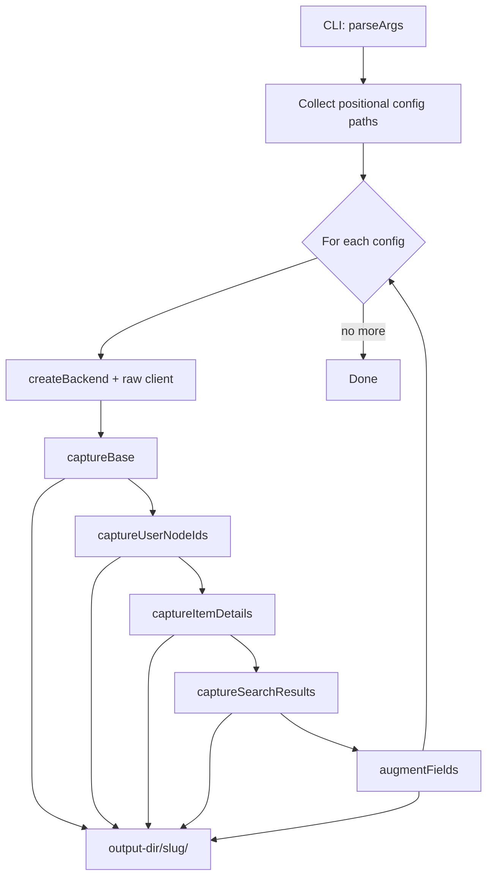
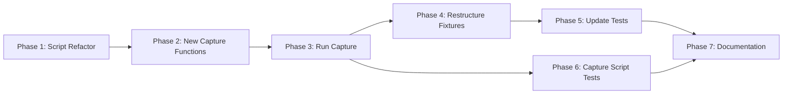

# Fixture Capture Refactoring Strategy

> **Status:** Draft **Scope:** Test fixture capture pipeline &mdash; `scripts/capture-test-fixtures.ts`, `src/adapters/github/internal/_test_fixtures.ts`, `src/scrum/_test_fixtures.ts`, and 13 consuming test files **Principle:** Every fixture that comes from a real API call should be captured via script, not hand-edited into TypeScript. Synthetic fixtures (error paths, terminal states) remain hand-authored but are explicitly documented as such.

---

## Table of Contents

1. [Gap Analysis](#section-1-gap-analysis)
2. [Proposed Capture Script Enhancements](#section-2-proposed-capture-script-enhancements)
3. [Test-Side Fixture Restructuring](#section-3-test-side-fixture-restructuring)
4. [Implementation Plan](#section-4-implementation-plan)

---

## Section 1: Gap Analysis

### 1.1 Current Capture Pipeline

The script at [`scripts/capture-test-fixtures.ts`](scripts/capture-test-fixtures.ts) runs the production adapter pipeline and dumps three JSON files to [`scripts/capture-output/`](scripts/capture-output/):

| Output File           | Source Method                         | Content                                                                          |
| --------------------- | ------------------------------------- | -------------------------------------------------------------------------------- |
| `platform-state.json` | `backend.getPlatformState()`          | Vocabulary maps, field presence, active/next/completed iterations, epics, labels |
| `items.json`          | `backend.findItems({ scope: "all" })` | Up to 50 board items as `ItemSearchResult`                                       |
| `templates.json`      | `fileReader.fetchContent()` per type  | Template YAML content keyed by canonical type                                    |

### 1.2 Test &rarr; Fixture Dependency Map

Thirteen test files consume fixtures from two fixture modules. The table below maps each test file to every fixture it imports and categorizes the fixture source.

#### Adapter-layer tests (11 files)

| #  | Test File                                                                                                                  | Imports From `_test_fixtures.ts`                          | Fixture Category                          |
| -- | -------------------------------------------------------------------------------------------------------------------------- | --------------------------------------------------------- | ----------------------------------------- |
| 1  | [`pagination.test.ts`](src/adapters/github/internal/pagination.test.ts)                                                    | `FIXTURE_PAGE_1`, `FIXTURE_PAGE_2`                        | Page envelope (built from captured items) |
| 2  | [`project-items-cache.test.ts`](src/adapters/github/internal/project-items-cache.test.ts)                                  | `FIXTURE_PAGE_1`, `FIXTURE_PAGE_2`                        | Page envelope                             |
| 3  | [`result-normalizer.test.ts`](src/adapters/github/internal/result-normalizer.test.ts)                                      | `FIXTURE_ITEM_WITH_CUSTOM_FIELDS`                         | Augmented real item                       |
| 4  | [`field-value-mutator.test.ts`](src/adapters/github/internal/field-value-mutator.test.ts)                                  | `FIXTURE_USER_ID`, `USERNODE_IDS`                         | User node ID resolution                   |
| 5  | [`story-query-service.test.ts`](src/adapters/github/internal/story-query-service.test.ts)                                  | `FIXTURE_NODES`                                           | All 4 items as array                      |
| 6  | [`item-filter.test.ts`](src/adapters/github/internal/item-filter.test.ts)                                                  | `FIXTURE_NODES`                                           | All 4 items as array                      |
| 7  | [`user-milestone-resolver.test.ts`](src/adapters/github/internal/user-milestone-resolver.test.ts)                          | `FIXTURE_USER_ID`, `USERNODE_IDS`                         | User node ID resolution                   |
| 8  | [`search-api-assembler.test.ts`](src/adapters/github/internal/assemblers/search-api-assembler.test.ts)                     | `FIXTURE_PAGE_1`, `FIXTURE_PAGE_2`                        | Page envelope (fallback path)             |
| 9  | [`direct-lookup-assembler.test.ts`](src/adapters/github/internal/assemblers/direct-lookup-assembler.test.ts)               | `FIXTURE_ITEM_222`                                        | Individual real item                      |
| 10 | [`project-items-assembler.test.ts`](src/adapters/github/internal/assemblers/project-items-assembler.test.ts)               | `FIXTURE_ITEM_222`, `FIXTURE_NODES`, `makePageEnvelope()` | Real item + page builder                  |
| 11 | [`assembler-pipeline.integration.test.ts`](src/adapters/github/internal/assemblers/assembler-pipeline.integration.test.ts) | `FIXTURE_ITEM_222`, `FIXTURE_PAGE_1`, `FIXTURE_PAGE_2`    | Real item + page envelopes                |

#### Scrum-layer tests (2 files)

| #  | Test File                                                          | Imports From `_test_fixtures.ts`                                 | Fixture Category                    |
| -- | ------------------------------------------------------------------ | ---------------------------------------------------------------- | ----------------------------------- |
| 12 | [`template-pipeline.test.ts`](src/scrum/template-pipeline.test.ts) | `TYPE_TEMPLATE_CONTENT`                                          | Template content strings            |
| 13 | [`template-resource.test.ts`](src/scrum/template-resource.test.ts) | `INLINE_LOCATION`, `FILE_YML_LOCATION`, `URL_YML_LOCATION`, etc. | Synthetic ContentLocation constants |

> **Note:** [`search-result-normalizer.test.ts`](src/adapters/github/internal/search-result-normalizer.test.ts) does **not** import `_test_fixtures.ts`. It constructs inline `SearchIssueNode[]` fixtures. This is the gap &mdash; real search API response shapes are never captured or replayed.

### 1.3 Gap Matrix

| Fixture Type                                                         | Currently Captured?             | Consumed By                                                                      | Gap                                                                                    |
| -------------------------------------------------------------------- | ------------------------------- | -------------------------------------------------------------------------------- | -------------------------------------------------------------------------------------- |
| Platform state (vocabulary, fields, iterations, epics)               | **Yes** (`platform-state.json`) | No test currently loads it                                                       | Low priority &mdash; captured for manual review                                        |
| Board items (aggregate listing)                                      | **Yes** (`items.json`)          | No test directly loads it                                                        | Extracted manually into `FIXTURE_ITEM_222`, `FIXTURE_ITEM_192`                         |
| Template content strings                                             | **Yes** (`templates.json`)      | `template-pipeline.test.ts`, `template-resource.test.ts`                         | ✅ Covered                                                                             |
| **Individual item detail** (GetProjectItemById / full story payload) | **No**                          | `field-value-mutator.test.ts`, `story-query-service.test.ts`                     | **High** &mdash; mutation tests need issue-backed field data                           |
| **User node ID resolution** (ResolveActorNodeId)                     | **No**                          | `field-value-mutator.test.ts`, `user-milestone-resolver.test.ts`                 | **High** &mdash; currently hand-edited `USERNODE_IDS`                                  |
| **Search API results** (searchIssues query envelope)                 | **No**                          | `search-api-assembler.test.ts` fallback path, `search-result-normalizer.test.ts` | **Medium** &mdash; search tests use synthetic inline data; no real result shapes       |
| **Non-canonical field augmentation**                                 | **No** (manual)                 | `result-normalizer.test.ts`                                                      | **Low** &mdash; synthetic fields appended by hand to `FIXTURE_ITEM_WITH_CUSTOM_FIELDS` |
| Multiple project configs                                             | **No** (single `--config`)      | N/A                                                                              | **Medium** &mdash; locks capture to one project                                        |

### 1.4 Auto-Capturable vs. Must-Remain-Synthetic

| Fixture                                                                 | Can Be Auto-Captured?                                                | Rationale                                                                                                                          |
| ----------------------------------------------------------------------- | -------------------------------------------------------------------- | ---------------------------------------------------------------------------------------------------------------------------------- |
| `FIXTURE_ITEM_222`, `FIXTURE_ITEM_192`, `FIXTURE_ITEM_187` (real items) | **Yes** &mdash; via `findItems` / item detail                        | Already present in `items.json`; detail can be captured per-item                                                                   |
| `FIXTURE_ITEM_DONE`                                                     | **No** &mdash; synthetic                                             | Requires a terminal-status item with specific field values that may not exist on the real board                                    |
| `FIXTURE_ITEM_WITH_CUSTOM_FIELDS`                                       | **Hybrid**                                                           | Real item #187 + synthetic non-canonical fields appended. The base item is auto-capturable; the augmentation must be config-driven |
| `USERNODE_IDS["hoonsubin"]`                                             | **Yes** &mdash; via GraphQL `ResolveActorNodeId`                     | Real API response                                                                                                                  |
| `USERNODE_IDS["_not_found_"]`                                           | **No** &mdash; synthetic                                             | Error path; no real GitHub login consistently returns null                                                                         |
| `FIXTURE_USER_ID`                                                       | **Yes** &mdash; derived from `USERNODE_IDS["hoonsubin"]`             | Convenience constant                                                                                                               |
| `FIXTURE_PAGE_1`, `FIXTURE_PAGE_2`                                      | **Yes** &mdash; derived from captured items via `makePageEnvelope()` | Builder function stays; items loaded from JSON                                                                                     |
| `TEMPLATE_USER_STORY`, `TEMPLATE_BUG`, `TEMPLATE_IMPEDIMENT`            | **Yes** &mdash; via `fileReader.fetchContent()`                      | Already captured in `templates.json`                                                                                               |
| `INLINE_LOCATION`, `FILE_YML_LOCATION`, `URL_YML_LOCATION`, etc.        | **No** &mdash; synthetic                                             | Test data for ContentLocation type coverage                                                                                        |
| `TYPE_TEMPLATE_CONTENT`                                                 | **Yes** &mdash; derived from template constants                      | Can be built from loaded templates                                                                                                 |

---

## Section 2: Proposed Capture Script Enhancements

### 2.1 Architecture Overview

The refactored capture script uses a single-entry-point design. [`scripts/capture-test-fixtures.ts`](scripts/capture-test-fixtures.ts) accepts any number of scrum config file paths (local or URL) as positional CLI arguments after `--` and runs the full capture pipeline for each config. All capture functions are defined inline within the main script &mdash; not dispatched to separate mode files.



The capture script must access two levels of the adapter:

| Level                    | Interface                          | Used By                                          |
| ------------------------ | ---------------------------------- | ------------------------------------------------ |
| **Port level**           | `ProjectReader` / `ProjectBackend` | Base capture, item detail (via `getStoryDetail`) |
| **GraphQL client level** | Raw `GitHubClient.graphql()`       | User node ID resolution, search API queries      |

This two-level access is acceptable because the capture script lives in `scripts/` (infrastructure, not production code) and the fixture data itself (`_test_fixtures.ts`) already contains raw GraphQL response shapes.

### 2.2 CLI Interface

A single `deno.json` task with positional config arguments:

```bash
# Single config (local file)
deno task capture-fixtures -- .github/scrum/config.yml

# Multiple configs (local + URL)
deno task capture-fixtures -- \
  .github/scrum/config.yml \
  docs/scrum-org-config.yml \
  https://raw.githubusercontent.com/TeamSTEP/Meltdown/refs/heads/main/scrum-config.yml

# With optional flags
deno task capture-fixtures -- --project-name my-slug --user-logins alice,bob .github/scrum/config.yml
```

**Flags:**

| Flag             | Type     | Default                                | Description                                                      |
| ---------------- | -------- | -------------------------------------- | ---------------------------------------------------------------- |
| `--project-name` | `string` | derived from config filename           | Override the output subdirectory slug                            |
| `--user-logins`  | `string` | none (skip user node capture if empty) | Comma-separated GitHub logins for `ResolveActorNodeId`           |
| `--search-query` | `string` | none (skip search capture if empty)    | Issue search query string passed to `SearchIssues` GraphQL query |
| `--output-dir`   | `string` | `scripts/capture-output`               | Parent output directory; per-config slugs go under this          |

**Positional arguments** (after `--`): zero or more scrum config file paths (local path or absolute URL).

### 2.3 Config Slug Derivation

Each config maps to a subdirectory under the output directory. The slug is derived as follows:

1. **`--project-name` flag** (if set): use the explicit value directly (e.g., `--project-name my-team` &rarr; `my-team/`)
2. **Local file**: use the filename without extension (e.g., `config.yml` &rarr; `config`, `.github/scrum/config.yml` &rarr; `config`)
3. **URL**: use the last path segment without extension (e.g., `https://example.com/meltdown-scrum-config.yml` &rarr; `meltdown-scrum-config`)
4. **Duplicate slugs**: append `-2`, `-3`, etc. to avoid overwrites

### 2.4 Capture Pipeline

For each config, the script runs these functions sequentially. Every function is defined inline in [`capture-test-fixtures.ts`](scripts/capture-test-fixtures.ts); the supporting modules [`scripts/capture/infra.ts`](scripts/capture/infra.ts) and [`scripts/capture/types.ts`](scripts/capture/types.ts) provide shared adapter construction and type definitions.

#### `captureBase(backendResult, outputDir)`

Produces the same three files as today's script:

| Output File           | Source Method                         | Content                                                                          |
| --------------------- | ------------------------------------- | -------------------------------------------------------------------------------- |
| `platform-state.json` | `backend.getPlatformState()`          | Vocabulary maps, field presence, active/next/completed iterations, epics, labels |
| `items.json`          | `backend.findItems({ scope: "all" })` | Up to 50 board items as `ItemSearchResult`                                       |
| `templates.json`      | `fileReader.fetchContent()` per type  | Template YAML content keyed by canonical type                                    |

#### `captureUserNodeIds(client, logins, outputDir)`

**Input:** `GitHubClient` from factory, list of GitHub login strings (from `--user-logins` flag) **Output:** `usernode-ids.json`

```json
{
  "hoonsubin": { "user": { "id": "U_kgDOAmfLjQ" } },
  "alice": { "user": { "id": "U_kgDOAnExAmP" } }
}
```

For each login, calls `client.graphql(RESOLVE_ACTOR_NODE_ID, { login })`. Automatically appends the synthetic `"_not_found_": { "user": null }` entry. Skipped if `--user-logins` is not provided.

#### `captureItemDetails(backend, client, owner, repo, projectNumber, keys, outputDir)`

**Input:** Item issue numbers extracted from `items.json` (all discovered items; can be overridden with a future `--item-keys` flag) **Output:** `item-details/<number>.json` per item

```json
{
  "normalized": { "story": {/* StoryDetail */}, "comments": null, "linked_artifacts": null },
  "raw": {/* ProjectItem GraphQL shape */},
  "captured_at": "2026-06-07T17:00:00Z"
}
```

Uses the port-level `backend.getStoryDetail()` for normalized data and raw `GitHubClient` for the un-normalized `ProjectItem` GraphQL response.

#### `captureSearchResults(client, query, outputDir)`

**Input:** Search query string from `--search-query` flag **Output:** `search-results.json`

```json
{
  "query": "custom_fields passthrough",
  "result": { "search": { "nodes": [/* SearchIssueNode[] */], "issueCount": 3 } },
  "captured_at": "2026-06-07T17:00:00Z"
}
```

Executes the `SearchIssues` GraphQL query and preserves the exact envelope shape consumed by [`search-result-normalizer.ts`](src/adapters/github/internal/search-result-normalizer.ts). Skipped if `--search-query` is not provided.

#### `augmentFields(capturedDir, configPath, outputDir)`

**Input:** Previously captured `item-details/` directory and the augmentation config YAML **Output:** `item-details/<number>-augmented.json` per augmentation entry

Loads the augmentation config from [`scripts/capture/augment-config.yml`](scripts/capture/augment-config.yml) (loaded automatically; no CLI flag needed unless overriding the default path), applies synthetic field entries to the raw `ProjectItem` shape, and writes augmented variants. This preserves the original captured data while producing the augmented version for tests like [`result-normalizer.test.ts`](src/adapters/github/internal/result-normalizer.test.ts).

### 2.5 Non-Canonical Field Augmentation Config

The file at [`scripts/capture/augment-config.yml`](scripts/capture/augment-config.yml) describes which items to augment and with what synthetic fields. It is loaded automatically by `augmentFields()` for each project.

```yaml
# scripts/capture/augment-config.yml
# Synthetic field entries appended to captured ProjectItem raw shapes.
# Used by result-normalizer.test.ts to exercise non-canonical field passthrough.
augmentations:
  - item_key: "187"
    append_fields:
      - __typename: "ProjectV2ItemFieldDateValue"
        date: "2026-08-15"
        field:
          id: "PVTF_lAHOAmfLjc4BWiTtzhR1seC"
          name: "Deadline"
      - __typename: "ProjectV2ItemFieldTextValue"
        text: "Q3"
        field:
          id: "PVTF_lAHOAmfLjc4BWiTtzhR1seD"
          name: "Target Quarter"
```

### 2.6 Script Directory Structure

```
scripts/
├── capture-test-fixtures.ts          # CLI entry point — single script with all capture functions
├── capture/
│   ├── infra.ts                      # Shared: adapter construction, graphql client access
│   ├── types.ts                      # Shared capture output types
│   └── augment-config.yml            # Non-canonical field augmentation config
```

All capture functions (`captureBase`, `captureUserNodeIds`, `captureItemDetails`, `captureSearchResults`, `augmentFields`) are defined inline in [`capture-test-fixtures.ts`](scripts/capture-test-fixtures.ts). The `infra.ts` and `types.ts` modules provide shared infrastructure and type definitions. No `capture/modes/` directory &mdash; there is only one mode: run everything.

### 2.7 Output Directory Structure

Each config produces output under a config-slugged subdirectory:

```
scripts/capture-output/
├── config/                           # from .github/scrum/config.yml
│   ├── platform-state.json
│   ├── items.json
│   ├── templates.json
│   ├── usernode-ids.json
│   ├── search-results.json
│   └── item-details/
│       ├── 222.json
│       ├── 187.json
│       ├── 187-augmented.json
│       └── 192.json
├── scrum-org-config/                 # from docs/scrum-org-config.yml
│   ├── platform-state.json
│   ├── items.json
│   └── ...
└── meltdown-scrum-config/            # from URL
    ├── platform-state.json
    └── ...
```

### 2.8 `deno.json` Task Definition

A single task replaces the previous monolithic task:

```jsonc
{
  "tasks": {
    "capture-fixtures": "deno run --allow-env=GITHUB_TOKEN,DEBUG,NODE_ENV --allow-net --allow-read --allow-write scripts/capture-test-fixtures.ts"
  }
}
```

Config files are passed as positional arguments after `--`. The task definition no longer hardcodes a default config path &mdash; the caller always supplies the configs. There are no mode-specific sub-tasks (`capture-fixtures:users`, `capture-fixtures:items`, etc.) and no composite task (`capture-fixtures:full`). A single invocation captures everything:

```bash
# Default project (single config)
deno task capture-fixtures -- .github/scrum/config.yml

# Default project + user nodes + search
deno task capture-fixtures -- --user-logins hoonsubin --search-query "custom_fields" .github/scrum/config.yml

# Multiple projects
deno task capture-fixtures -- .github/scrum/config.yml docs/scrum-org-config.yml
```

---

## Section 3: Test-Side Fixture Restructuring

### 3.1 Design Principles

1. **Real data lives in JSON, not TypeScript.** Captured JSON files are committed alongside the fixture modules and loaded at test time through thin wrapper exports.
2. **Synthetic data stays in TypeScript.** Error paths, terminal states, and hand-crafted edge cases remain as explicit TypeScript constants with clear documentation.
3. **One fixture module per concern.** Split the monolithic `_test_fixtures.ts` into domain-specific modules, organized by what they represent, not by where they happen to be imported.
4. **Backward compatibility via re-exports.** During the transition, the existing `_test_fixtures.ts` files can re-export from the new modules so test files don't need to change their import paths immediately.

### 3.2 Proposed Directory Structure

```
src/adapters/github/internal/
├── _test_fixtures.ts              # Re-export barrel (backward compat)
├── __fixtures__/
│   ├── items.ts                   # FIXTURE_ITEM_222, FIXTURE_ITEM_192, FIXTURE_ITEM_WITH_CUSTOM_FIELDS, FIXTURE_ITEM_DONE
│   ├── items-synthetic.ts         # FIXTURE_ITEM_DONE (synthetic, stays in TS)
│   ├── pages.ts                   # FIXTURE_PAGE_1, FIXTURE_PAGE_2, makePageEnvelope()
│   ├── user-nodes.ts              # USERNODE_IDS, FIXTURE_USER_ID
│   ├── captured/
│   │   ├── items.json             # Auto-captured: items from findItems
│   │   ├── item-details/          # Auto-captured: per-item StoryDetail + raw
│   │   │   ├── 222.json
│   │   │   ├── 187.json
│   │   │   ├── 187-augmented.json
│   │   │   └── 192.json
│   │   ├── usernode-ids.json      # Auto-captured: user node resolution
│   │   └── search-results.json    # Auto-captured: search API results
│   └── loaders.ts                 # JSON loading helpers (import assertions)
└── _test_utils.ts                 # Unchanged

src/scrum/
├── _test_fixtures.ts              # Re-export barrel (backward compat)
├── __fixtures__/
│   ├── templates.ts               # TEMPLATE_USER_STORY, TEMPLATE_BUG, TEMPLATE_IMPEDIMENT
│   ├── locations.ts               # INLINE_LOCATION, FILE_YML_LOCATION, etc. (synthetic)
│   ├── captured/
│   │   └── templates.json         # Auto-captured: template content
│   └── loaders.ts                 # JSON loading helpers
```

### 3.3 JSON Loading Mechanism

Deno supports importing JSON files directly with import assertions:

```typescript
// __fixtures__/loaders.ts
import capturedItems from "./captured/items.json" with { type: "json" };
import capturedUserNodeIds from "./captured/usernode-ids.json" with { type: "json" };

export { capturedItems, capturedUserNodeIds };
```

This avoids runtime `Deno.readTextFile` calls that require `--allow-read` permissions in every test. The JSON is inlined at compile time.

**Caveat:** Deno's JSON import currently requires `--unstable-sloppy-imports` or uses the `"imports"` map. Alternative approaches:

| Approach                                                | Pros                                   | Cons                                                               |
| ------------------------------------------------------- | -------------------------------------- | ------------------------------------------------------------------ |
| Direct `import x from "./x.json" with { type: "json" }` | Zero runtime overhead, type-safe       | Requires Deno 1.36+; may need `--unstable-sloppy-imports`          |
| `Deno.readTextFile` + `JSON.parse` in a loader          | Works on all Deno versions             | Requires `--allow-read`; adds I/O overhead                         |
| Inline as a generated `.ts` file                        | Maximum compatibility, no --allow-read | Captured data in TypeScript defeats the purpose of JSON separation |

**Recommendation:** Use the direct JSON import assertion approach. The project already targets Deno with modern features. Update `deno.json` if needed:

```jsonc
{
  "unstable": ["raw-imports"] // already present
}
```

### 3.4 Fixture Module Refactoring

#### `src/adapters/github/internal/__fixtures__/items.ts`

```typescript
// Auto-captured items (from captured/items.json)
// Manually extracted representative items for focused tests
import type { ProjectItem } from "../../types.ts";

/** Real fixture: Issue #222 — Ready, 3 SP, Could, MCP Tool Surface epic */
export const FIXTURE_ITEM_222: ProjectItem = {/* ... verbatim from captured JSON ... */};

/** Real fixture: Issue #192 — Ready, 2 SP, Could, blocked by #195 and #191 */
export const FIXTURE_ITEM_192: ProjectItem = {/* ... */};

/** Real fixture: Issue #187 — augmented with synthetic non-canonical fields */
export const FIXTURE_ITEM_WITH_CUSTOM_FIELDS: ProjectItem = {/* ... */};

/** All canonical nodes as an array */
export const FIXTURE_NODES: readonly ProjectItem[] = [
  FIXTURE_ITEM_222,
  FIXTURE_ITEM_192,
  FIXTURE_ITEM_WITH_CUSTOM_FIELDS,
];
```

#### `src/adapters/github/internal/__fixtures__/items-synthetic.ts`

```typescript
import type { ProjectItem } from "../../types.ts";

/**
 * Synthetic fixture: a Done-status item in Sprint 4.
 * MUST REMAIN HAND-AUTHORED — no guarantee a terminal-status item exists
 * on the real board with the exact field configuration needed for filter tests.
 */
export const FIXTURE_ITEM_DONE: ProjectItem = {/* ... */};
```

#### `src/adapters/github/internal/__fixtures__/pages.ts`

```typescript
import type { ProjectItem } from "../../types.ts";
import { FIXTURE_ITEM_192, FIXTURE_ITEM_222 } from "./items.ts";
import { FIXTURE_ITEM_WITH_CUSTOM_FIELDS } from "./items.ts";
import { FIXTURE_ITEM_DONE } from "./items-synthetic.ts";

/** Build a full user.projectV2.items GraphQL response envelope from nodes. */
export const makePageEnvelope = (
  nodes: readonly ProjectItem[],
  opts?: { totalCount?: number; hasNextPage?: boolean; endCursor?: string | null },
) => ({/* ... same as current ... */});

export const FIXTURE_PAGE_1 = makePageEnvelope([FIXTURE_ITEM_222, FIXTURE_ITEM_192], {
  hasNextPage: true,
  endCursor: "Y3Vyc29yOnYyOpKrMDAwMDAwMDAuMDHOCzXmIQ==",
});

export const FIXTURE_PAGE_2 = makePageEnvelope([
  FIXTURE_ITEM_WITH_CUSTOM_FIELDS,
  FIXTURE_ITEM_DONE,
]);
```

#### `src/adapters/github/internal/__fixtures__/user-nodes.ts`

```typescript
// Auto-captured: from captured/usernode-ids.json
export const USERNODE_IDS: Record<string, { user: { id: string } | null }> = {
  "hoonsubin": {
    user: { id: "U_kgDOAmfLjQ" },
  },
  "_not_found_": {
    user: null,
  },
};

export const FIXTURE_USER_ID = "U_kgDOAmfLjQ";
```

> **Workflow note:** When re-capturing user nodes, a reviewer runs `deno task capture-fixtures -- --user-logins hoonsubin .github/scrum/config.yml`, verifies the updated `captured/usernode-ids.json` under the config's output subdirectory, and copies the relevant values into `user-nodes.ts`. The `"_not_found_"` entry is always synthetic and preserved manually.

#### `src/adapters/github/internal/_test_fixtures.ts` (barrel re-export)

```typescript
// =============================================================================
// Re-export barrel — backward compatibility for existing test imports.
// New tests should import from __fixtures__/*.ts directly.
// =============================================================================
export {
  FIXTURE_ITEM_192,
  FIXTURE_ITEM_222,
  FIXTURE_ITEM_WITH_CUSTOM_FIELDS,
  FIXTURE_NODES,
} from "./__fixtures__/items.ts";
export { FIXTURE_ITEM_DONE } from "./__fixtures__/items-synthetic.ts";
export { FIXTURE_PAGE_1, FIXTURE_PAGE_2, makePageEnvelope } from "./__fixtures__/pages.ts";
export { FIXTURE_USER_ID, USERNODE_IDS } from "./__fixtures__/user-nodes.ts";
```

### 3.5 Test File Migration Strategy

The 13 test files **do not need to change** their import paths during Phases 1-4 of the implementation plan. The barrel re-export in `_test_fixtures.ts` ensures backward compatibility. In Phase 5 (future cleanup), test files can optionally switch to importing from `__fixtures__/<module>.ts` directly.

Test files that need **new** fixture data (e.g., search results) import directly from the new fixture path:

```typescript
// Example: search-result-normalizer.test.ts after refactoring
import capturedSearchResults from "./__fixtures__/captured/search-results.json" with {
  type: "json",
};
```

### 3.6 Scrum-Layer Fixture Restructuring

The scrum-layer [`_test_fixtures.ts`](src/scrum/_test_fixtures.ts) requires minimal changes:

1. **Template content strings** (`TEMPLATE_USER_STORY`, `TEMPLATE_BUG`, `TEMPLATE_IMPEDIMENT`) remain as TypeScript constants since they must be available at compile time without `--allow-read`. They are regenerated by copying from `scripts/capture-output/<slug>/templates.json` after capture.
2. **ContentLocation constants** (`INLINE_LOCATION`, `FILE_YML_LOCATION`, `URL_YML_LOCATION`, etc.) remain synthetic — they are not derived from any API and exist purely for type coverage.
3. **`TYPE_TEMPLATE_CONTENT`** remains derived from the template constants.

```
src/scrum/
├── _test_fixtures.ts              # Re-export barrel
├── __fixtures__/
│   ├── templates.ts               # TEMPLATE_USER_STORY, TEMPLATE_BUG, TEMPLATE_IMPEDIMENT
│   └── locations.ts               # ContentLocation constants (synthetic)
```

---

## Section 4: Implementation Plan

The implementation is split into seven phases, ordered by dependency and risk. Each phase produces a shippable increment — the test suite must pass after every phase.



### Phase 1: Refactor Capture Script Structure

**Goal:** Restructure `scripts/capture-test-fixtures.ts` to the single-entry-point design with inline functions, without changing behavior.

| Step | Action                                                                                    | Files                      |
| ---- | ----------------------------------------------------------------------------------------- | -------------------------- |
| 1.1  | Create `scripts/capture/` directory with `infra.ts`, `types.ts`                           | New files                  |
| 1.2  | Extract shared adapter construction into `scripts/capture/infra.ts`                       | `capture/infra.ts`         |
| 1.3  | Move existing capture logic into `captureBase()` function                                 | `capture-test-fixtures.ts` |
| 1.4  | Implement positional config arg parsing with slug derivation                              | `capture-test-fixtures.ts` |
| 1.5  | Verify `deno task capture-fixtures -- .github/scrum/config.yml` produces identical output | Validation                 |

**Acceptance criteria:** `deno task capture-fixtures -- .github/scrum/config.yml` produces byte-identical JSON output to the current script.

### Phase 2: Add New Capture Functions

**Goal:** Implement each new capture function inline within the main script.

| Step | Action                                                                     | Files                      |
| ---- | -------------------------------------------------------------------------- | -------------------------- |
| 2.1  | Implement `captureUserNodeIds()` function in `capture-test-fixtures.ts`    | `capture-test-fixtures.ts` |
| 2.2  | Implement `captureItemDetails()` function in `capture-test-fixtures.ts`    | `capture-test-fixtures.ts` |
| 2.3  | Implement `captureSearchResults()` function in `capture-test-fixtures.ts`  | `capture-test-fixtures.ts` |
| 2.4  | Implement `augmentFields()` function in `capture-test-fixtures.ts`         | `capture-test-fixtures.ts` |
| 2.5  | Create `scripts/capture/augment-config.yml` with initial augmentation data | New file                   |
| 2.6  | Update `deno.json` to the single `capture-fixtures` task definition        | `deno.json`                |

**Acceptance criteria:** `deno task capture-fixtures -- --user-logins hoonsubin --search-query "custom_fields" .github/scrum/config.yml` produces all fixture types under `scripts/capture-output/<slug>/`.

### Phase 3: Run Capture and Commit Output

**Goal:** Produce committed JSON fixture files from real API calls.

| Step | Action                                                                                                 | Files      |
| ---- | ------------------------------------------------------------------------------------------------------ | ---------- |
| 3.1  | Run `deno task capture-fixtures -- --user-logins hoonsubin .github/scrum/config.yml` and commit output | New files  |
| 3.2  | Run `deno task capture-fixtures -- --search-query "custom_fields" .github/scrum/config.yml` and commit | New files  |
| 3.3  | Verify all committed JSON matches the expected shapes in `_test_fixtures.ts`                           | Validation |

**Acceptance criteria:** Captured JSON files exist and contain valid data matching existing hand-authored fixture constants.

### Phase 4: Restructure Fixture Modules

**Goal:** Reorganize `_test_fixtures.ts` into domain-specific modules without breaking tests.

| Step | Action                                                                              | Files                     |
| ---- | ----------------------------------------------------------------------------------- | ------------------------- |
| 4.1  | Create `src/adapters/github/internal/__fixtures__/` directory structure             | New directory             |
| 4.2  | Move item fixtures to `__fixtures__/items.ts` and `__fixtures__/items-synthetic.ts` | New files                 |
| 4.3  | Move page fixtures to `__fixtures__/pages.ts`                                       | New file                  |
| 4.4  | Move user node fixtures to `__fixtures__/user-nodes.ts`                             | New file                  |
| 4.5  | Move captured JSON into `__fixtures__/captured/`                                    | New directory, JSON files |
| 4.6  | Create `__fixtures__/loaders.ts` for JSON imports                                   | New file                  |
| 4.7  | Update `_test_fixtures.ts` to be a barrel re-export                                 | Modified file             |
| 4.8  | Create `src/scrum/__fixtures__/` for scrum-layer fixtures                           | New directory             |
| 4.9  | Run `deno task test` to verify no regressions                                       | Validation                |

**Acceptance criteria:** All 13 test files pass without any import path changes in test files.

### Phase 5: Update Test Files

**Goal:** Migrate test files to use new fixture imports where beneficial.

| Step | Action                                                                                        | Files          |
| ---- | --------------------------------------------------------------------------------------------- | -------------- |
| 5.1  | Update `search-result-normalizer.test.ts` to use captured search results                      | Modified file  |
| 5.2  | Update `search-api-assembler.test.ts` to include search result fixture paths                  | Modified file  |
| 5.3  | Update `field-value-mutator.test.ts` to use captured item detail for issue-backed field tests | Modified file  |
| 5.4  | Optionally update remaining test files to import from `__fixtures__/*.ts` directly            | Multiple files |
| 5.5  | Run `deno task test` after each file change                                                   | Validation     |

**Acceptance criteria:** Test coverage does not decrease. Captured search data increases coverage of search result normalization paths.

### Phase 6: Add Capture Script Tests

**Goal:** Tests for the capture script itself to prevent regressions in fixture shape.

| Step | Action                                                                                   | Files                       |
| ---- | ---------------------------------------------------------------------------------------- | --------------------------- |
| 6.1  | Add unit tests for each capture function's output validation                             | `scripts/capture/*.test.ts` |
| 6.2  | Add a shape validation test that checks captured JSON matches expected type structures   | New test file               |
| 6.3  | Add a CI step (manual trigger) that validates `deno task capture-fixtures` doesn't error | CI config                   |

**Acceptance criteria:** Capture functions are independently testable. Shape validation catches drift between captured fixtures and consumer expectations.

### Phase 7: Document Workflows

**Goal:** Ensure future maintainers can regenerate and validate fixtures.

| Step | Action                                                                   | Files                 |
| ---- | ------------------------------------------------------------------------ | --------------------- |
| 7.1  | Add "Regenerating Fixtures" section to this document                     | This file             |
| 7.2  | Add inline documentation in each fixture module explaining its origin    | Fixture `.ts` files   |
| 7.3  | Add a PR checklist item: "If adapter types changed, re-capture fixtures" | `docs/` or `.github/` |

**Acceptance criteria:** A new contributor can follow the documentation to capture fresh fixtures for a new project without tribal knowledge.

### 4.1 Fixture Regeneration Workflow

After the refactoring, the standard fixture regeneration workflow:

```bash
# 1. Capture all fixture types for the default project
deno task capture-fixtures -- --user-logins hoonsubin --search-query "custom_fields" .github/scrum/config.yml

# 2. If adapter types changed, validate captured output shapes
deno test scripts/capture/

# 3. Review the captured JSON for sensitive data
#    (issue bodies, assignee names, field IDs are project-specific but not secrets)

# 4. Run the full test suite to confirm fixtures are compatible
deno task test

# 5. If adding a new user or item to fixtures:
deno task capture-fixtures -- --user-logins new-user .github/scrum/config.yml

# 6. Commit the updated capture output
git add scripts/capture-output/ src/adapters/github/internal/__fixtures__/captured/
```

### 4.2 Risk Assessment

| Risk                                                                        | Likelihood | Mitigation                                                                                  |
| --------------------------------------------------------------------------- | ---------- | ------------------------------------------------------------------------------------------- |
| JSON import assertions incompatible with current Deno version               | Low        | Project already uses `"unstable": ["raw-imports"]`; test before committing                  |
| Captured item data changes shape between runs (field renames, new fields)   | Medium     | Shape validation tests (Phase 6) detect drift; fixture update is intentional                |
| Real API capture leaks sensitive data into committed fixtures               | Low        | Existing fixtures already contain real project data; reviewers check before commit          |
| `createBackend()` doesn't expose raw `GitHubClient` for search/user capture | Medium     | Option A: return client from factory. Option B: construct client directly in capture script |
| Circular imports from barrel re-exports                                     | Low        | Fixtures have no runtime dependencies on production code; strictly data                     |
| Test performance regression from JSON loading                               | Low        | JSON import assertions are compile-time; zero runtime I/O overhead                          |
| Single script grows too large with all inline functions                     | Low        | Functions are independently testable; extract to modules later if needed                    |

### 4.3 Backward Compatibility Commitment

Throughout all phases, the following invariants are maintained:

1. **`import { FIXTURE_ITEM_222 } from "./_test_fixtures.ts"` continues to work** in all existing test files — the barrel re-exports preserve import paths.
2. **`deno task test` passes after every phase** — no phase is considered complete until the full suite is green.
3. **`deno lint` and `deno task depcruise` pass after every phase** — no new layer breaches are introduced.
4. **No test file is forced to change its imports** during Phases 1-4 — changes in Phase 5 are additive and optional.

### 4.4 `deno.json` Task Definition

```jsonc
{
  "tasks": {
    "capture-fixtures": "deno run --allow-env=GITHUB_TOKEN,DEBUG,NODE_ENV --allow-net --allow-read --allow-write scripts/capture-test-fixtures.ts"
  }
}
```

No additional sub-tasks. The single `capture-fixtures` task accepts positional config arguments after `--` and optional flags for user logins and search queries. See [Section 2.2](#22-cli-interface) and [Section 2.8](#28-denojson-task-definition) for usage examples.

---

## Appendix A: Complete Test-to-Fixture Matrix

| Test File                                | `_test_fixtures` Imports                                                                                                                                                                     | Also Uses                                                                     |
| ---------------------------------------- | -------------------------------------------------------------------------------------------------------------------------------------------------------------------------------------------- | ----------------------------------------------------------------------------- |
| `pagination.test.ts`                     | `FIXTURE_PAGE_1`, `FIXTURE_PAGE_2`                                                                                                                                                           | `createGhSpy`, `makeConfig`, `makeCtx` from `_test_utils.ts`                  |
| `project-items-cache.test.ts`            | `FIXTURE_PAGE_1`, `FIXTURE_PAGE_2`                                                                                                                                                           | `createGhSpy`, `makeCtx` from `_test_utils.ts`                                |
| `result-normalizer.test.ts`              | `FIXTURE_ITEM_WITH_CUSTOM_FIELDS`                                                                                                                                                            | `makeConfig` from `_test_utils.ts`                                            |
| `field-value-mutator.test.ts`            | `FIXTURE_USER_ID`, `USERNODE_IDS`                                                                                                                                                            | `createGhSpy`, `makeConfig`, `makeCtx` from `_test_utils.ts`                  |
| `story-query-service.test.ts`            | `FIXTURE_NODES`                                                                                                                                                                              | `createGhSpy`, `makeConfig`, `makeCtx`; `buildStoryFromRaw` from `mappers.ts` |
| `item-filter.test.ts`                    | `FIXTURE_NODES`                                                                                                                                                                              | `buildStoryFromRaw` from `mappers.ts`                                         |
| `user-milestone-resolver.test.ts`        | `FIXTURE_USER_ID`, `USERNODE_IDS`                                                                                                                                                            | `createGhSpy`, `makeCtx` from `_test_utils.ts`                                |
| `search-api-assembler.test.ts`           | `FIXTURE_PAGE_1`, `FIXTURE_PAGE_2`                                                                                                                                                           | `createGhSpy`, `makeConfig` from `_test_utils.ts`                             |
| `direct-lookup-assembler.test.ts`        | `FIXTURE_ITEM_222`                                                                                                                                                                           | `createGhSpy`, `makeConfig` from `_test_utils.ts`                             |
| `project-items-assembler.test.ts`        | `FIXTURE_ITEM_222`, `FIXTURE_NODES`, `makePageEnvelope`                                                                                                                                      | `createGhSpy`, `makeConfig` from `_test_utils.ts`                             |
| `assembler-pipeline.integration.test.ts` | `FIXTURE_ITEM_222`, `FIXTURE_PAGE_1`, `FIXTURE_PAGE_2`                                                                                                                                       | `createGhSpy`, `makeConfig` from `_test_utils.ts`                             |
| `template-pipeline.test.ts` (scrum)      | `TYPE_TEMPLATE_CONTENT`                                                                                                                                                                      | —                                                                             |
| `template-resource.test.ts` (scrum)      | `INLINE_LOCATION`, `FILE_YML_LOCATION`, `URL_YML_LOCATION`, `URL_JSON_LOCATION`, `URL_MD_LOCATION`, `INLINE_YAML_LOCATION`, `INLINE_JSON_LOCATION`, `FILE_JSON_LOCATION`, `FILE_MD_LOCATION` | —                                                                             |
| `search-result-normalizer.test.ts`       | _(none — uses inline data)_                                                                                                                                                                  | _(should use captured search results post-refactor)_                          |

## Appendix B: Key Files Referenced

| File                                                                                                                                 | Role                                            |
| ------------------------------------------------------------------------------------------------------------------------------------ | ----------------------------------------------- |
| [`scripts/capture-test-fixtures.ts`](scripts/capture-test-fixtures.ts)                                                               | Capture script entry point (will be refactored) |
| [`scripts/capture-output/`](scripts/capture-output/)                                                                                 | Current capture output (flat, 3 JSON files)     |
| [`scripts/capture/`](scripts/capture/)                                                                                               | New capture infrastructure directory            |
| [`scripts/capture/augment-config.yml`](scripts/capture/augment-config.yml)                                                           | Non-canonical field augmentation config         |
| [`src/adapters/github/internal/_test_fixtures.ts`](src/adapters/github/internal/_test_fixtures.ts)                                   | Adapter fixture constants (10 exports)          |
| [`src/scrum/_test_fixtures.ts`](src/scrum/_test_fixtures.ts)                                                                         | Scrum fixture constants (10 exports)            |
| [`src/adapters/github/internal/_test_utils.ts`](src/adapters/github/internal/_test_utils.ts)                                         | `createGhSpy`, `makeConfig`, `makeCtx`          |
| [`src/scrum/ports.ts`](src/scrum/ports.ts)                                                                                           | Port interface (THE CONTRACT)                   |
| [`src/adapters/github/backend.ts`](src/adapters/github/backend.ts)                                                                   | GitHub adapter facade                           |
| [`src/adapters/github/internal/user-milestone-resolver.ts`](src/adapters/github/internal/user-milestone-resolver.ts)                 | Resolves user logins to GraphQL node IDs        |
| [`src/adapters/github/internal/search-result-normalizer.ts`](src/adapters/github/internal/search-result-normalizer.ts)               | Converts search API results to `ProjectItem[]`  |
| [`src/adapters/github/internal/field-value-mutator.ts`](src/adapters/github/internal/field-value-mutator.ts)                         | Field mutation operations (uses user node IDs)  |
| [`src/adapters/github/internal/assemblers/search-api-assembler.ts`](src/adapters/github/internal/assemblers/search-api-assembler.ts) | Search → board scan fallback orchestration      |
| [`deno.json`](deno.json)                                                                                                             | Task definitions and import map                 |
