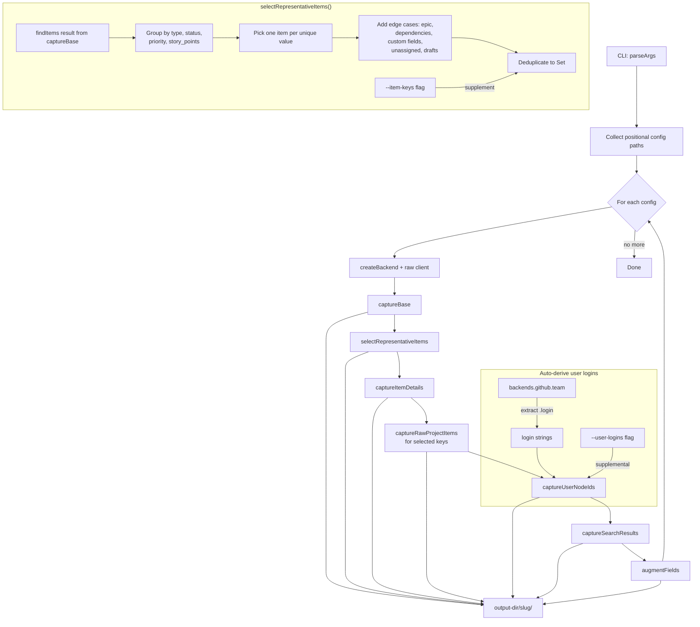
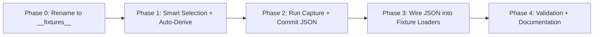

# Fixture Capture Refactoring Strategy

> **Status:** In Progress **Scope:** Test fixture capture pipeline — `scripts/capture-test-fixtures.ts`, `src/adapters/github/internal/__fixtures__/`, `src/scrum/__fixtures__/`, and all consuming test files **Principle:** Every fixture that comes from a real API call should be auto-captured as JSON and loaded at import time — not hand-edited into TypeScript. Synthetic fixtures (error paths, terminal states) remain hand-authored but are explicitly documented as such.

---

## Table of Contents

1. [Current State](#section-1-current-state)
2. [Gap Analysis](#section-2-gap-analysis)
3. [Architecture Overview](#section-3-architecture-overview)
4. [Smart Fixture Selection](#section-4-smart-fixture-selection)
5. [Implementation Plan](#section-5-implementation-plan)
6. [Directory Rename: `fixtures` → `__fixtures__`](#section-6-directory-rename-fixtures-to-__fixtures__)
7. [Fixture Regeneration Workflow](#section-7-fixture-regeneration-workflow)

---

## Section 1: Current State

### 1.1 What's Done

The capture script at [`scripts/capture-test-fixtures.ts`](scripts/capture-test-fixtures.ts) has been refactored to a single-entry-point design:

- **CLI:** Positional config paths after `--`, flags: `--project-name`, `--user-logins`, `--search-query`, `--output-dir`, `--item-keys`
- **All capture functions implemented inline:**
  - `captureBase()` — platform state + items + templates (the original 3 outputs)
  - `captureUserNodeIds()` — resolves GitHub logins to GraphQL node IDs via `ResolveActorNodeId`
  - `captureItemDetails()` — per-item normalized `StoryDetail` + raw reference
  - `captureSearchResults()` — search API results from `SearchIssues` query
  - `captureRawProjectItems()` — raw ProjectItem GraphQL shapes for given issue keys
  - `augmentFields()` — appends synthetic non-canonical fields from `augment-config.yml`
- **Supporting modules:** `scripts/capture/types.ts` (shared types), `scripts/capture/augment-config.yml` (augmentation config)
- **Task definition:** `deno task capture-fixtures` in [`deno.json`](deno.json:18)

### 1.2 What's Already Captured

Running `deno task capture-fixtures -- .github/scrum/config.yml` produces under `scripts/capture-output/config/`:

| File                         | Content                                                                 |
| ---------------------------- | ----------------------------------------------------------------------- |
| `platform-state.json`        | Vocabulary maps, field definitions, iterations, epics, labels           |
| `items.json`                 | Up to 50 board items as `ItemSearchResult` (port-level, **normalized**) |
| `templates.json`             | Template YAML content keyed by canonical type                           |
| `item-details.json`          | Per-item `{ normalized: StoryDetail, raw: StoryDetail, captured_at }`   |
| `captured/items/*.json`      | Raw ProjectItem GraphQL shapes per issue key                            |
| `augmented-items/<key>.json` | Items with synthetic non-canonical fields appended                      |
| `user-nodes.json`            | ResolveActorNodeId responses (requires `--user-logins` flag)            |
| `search-results.json`        | SearchIssues query results (requires `--search-query` flag)             |

### 1.3 What Tests Currently Consume

The fixture modules under [`src/adapters/github/internal/__fixtures__/`](src/adapters/github/internal/__fixtures__/index.ts) are **hand-authored TypeScript constants**. They contain raw `ProjectItem` GraphQL response shapes — **not** the normalized port-level data that the capture script produces:

| Module                                                                               | Exports                                                                   | Source                                   |
| ------------------------------------------------------------------------------------ | ------------------------------------------------------------------------- | ---------------------------------------- |
| [`items.ts`](src/adapters/github/internal/__fixtures__/items.ts)                     | `FIXTURE_ITEM_222`, `FIXTURE_ITEM_192`, `FIXTURE_ITEM_WITH_CUSTOM_FIELDS` | Hand-authored from captured fixture JSON |
| [`items-synthetic.ts`](src/adapters/github/internal/__fixtures__/items-synthetic.ts) | `FIXTURE_ITEM_DONE`, `FIXTURE_NODES`                                      | Synthetic (must stay hand-authored)      |
| [`pages.ts`](src/adapters/github/internal/__fixtures__/pages.ts)                     | `FIXTURE_PAGE_1`, `FIXTURE_PAGE_2`, `makePageEnvelope()`                  | Built from the item constants            |
| [`user-nodes.ts`](src/adapters/github/internal/__fixtures__/user-nodes.ts)           | `USERNODE_IDS`, `FIXTURE_USER_ID`                                         | Hand-authored                            |
| [`index.ts`](src/adapters/github/internal/__fixtures__/index.ts)                     | Barrel re-export                                                          | Re-exports above                         |

These are consumed by 11 adapter-layer test files via `_test_fixtures.ts` barrel, plus 2 scrum-layer test files. The scrum-layer [`__fixtures__/`](src/scrum/__fixtures__/index.ts) module contains `ContentLocation` constants and template content strings — these are synthetic and will remain hand-authored.

### 1.4 Problems with the Current Hard-Coded Approach

The current script relies on a hard-coded default: `--item-keys "222,192,187"`. This has three problems:

1. **Not comprehensive** — The 3 hard-coded keys cover only what was manually verified. They don't guarantee coverage of all board item types, statuses, priorities, story point values, or edge cases like epics, dependencies, or draft issues.
2. **Not portable** — If the capture script is run against a different project (e.g. `--project-name other-project`), the same 3 keys are used. They may not exist or may not represent that project's variety.
3. **Requires tribal knowledge** — A new contributor doesn't know which keys to pass. They must read the test fixtures to discover `"222,192,187"`.

The same problem applies to user logins: `--user-logins` must be passed manually despite the data being available in the scrum config.

---

## Section 2: Gap Analysis

### 2.1 The Core Gap

The capture script captures **normalized** data (port-level `StoryDetail`, `ItemSearchResult`), but the fixture constants contain **raw** GraphQL response shapes (`ProjectItem`). These are different types:

| What                        | Level            | Used By                                                          |
| --------------------------- | ---------------- | ---------------------------------------------------------------- |
| `StoryDetail` (normalized)  | Port level       | Use-case tests                                                   |
| `ProjectItem` (raw GraphQL) | Adapter internal | Paginator, assemblers, normalizer, filter, cache, mutation tests |

To auto-generate the `items.ts` constants, the capture script must also capture **raw `ProjectItem`** GraphQL responses.

### 2.2 Can Be Auto-Captured

| Fixture                               | Source                      | Mechanism                                                  |
| ------------------------------------- | --------------------------- | ---------------------------------------------------------- |
| All raw `ProjectItem` per corner case | Raw `ProjectItem` GraphQL   | `GetIssueProjectItem` query via capture script             |
| Augmented items with custom fields    | Raw item + augmentation     | Capture base item, then merge `augment-config.yml` entries |
| `FIXTURE_PAGE_1`, `FIXTURE_PAGE_2`    | Derived from items          | `makePageEnvelope()` stays — items loaded from JSON        |
| `USERNODE_IDS` for all team members   | `ResolveActorNodeId` query  | Auto-derived from `backends.github.team[].login`           |
| `FIXTURE_USER_ID`                     | Derived from `USERNODE_IDS` | Computed inline                                            |
| `FIXTURE_NODES`                       | Aggregate of items          | Computed from loaded items                                 |

### 2.3 Must Remain Hand-Authored

| Fixture                                                          | Reason                                                                                                 |
| ---------------------------------------------------------------- | ------------------------------------------------------------------------------------------------------ |
| `FIXTURE_ITEM_DONE`                                              | Synthetic terminal-status item. No guarantee the real board has one with the exact field values needed |
| `USERNODE_IDS["_not_found_"]`                                    | Synthetic error path. No real GitHub login consistently returns `null`                                 |
| `INLINE_LOCATION`, `FILE_YML_LOCATION`, `URL_YML_LOCATION`, etc. | Test data for `ContentLocation` type coverage — not derived from any API                               |

### 2.4 The Augmentation Problem

`FIXTURE_ITEM_WITH_CUSTOM_FIELDS` is item #187 (real) + 2 synthetic non-canonical field entries (Deadline, Target Quarter). With auto-capture:

1. Capture raw #187 from the API → `captured/items/187.json`
2. Load it, then spread in the synthetic fields from `augment-config.yml`
3. Export as `FIXTURE_ITEM_WITH_CUSTOM_FIELDS`

The augmentation config must move alongside the captured JSON so the loader can reference it.

---

## Section 3: Architecture Overview

### 3.1 Capture Pipeline Enhancement



### 3.2 `captureRawProjectItems(client, owner, repo, itemKeys, outputDir)`

**Input:** Raw `GitHubClient`, owner/repo strings, list of item issue numbers **Output:** `captured/items/<key>.json` per item — the raw `ProjectItem` GraphQL response shape

Uses the existing `GetIssueProjectItem` query from [`operations.graphql`](src/adapters/github/operations.graphql:438), which returns a `ProjectItem` node with `ItemContent` and `ItemFieldValues` fragments — exactly the shape that [`items.ts`](src/adapters/github/internal/__fixtures__/items.ts) currently contains as hand-authored TypeScript.

```json
{
  "id": "PVTI_lAHOAmfLjc4BWiTtzguSvrg",
  "type": "ISSUE",
  "createdAt": "2026-05-31T12:04:40Z",
  "updatedAt": "2026-06-02T23:10:22Z",
  "isArchived": false,
  "content": { "__typename": "Issue", "id": "I_kwDOSJo3Ms8AAAABD6XGfw", ... },
  "fieldValues": { "nodes": [ ... ] }
}
```

Item keys are **auto-selected** by `selectRepresentativeItems()` — see Section 4. The `--item-keys` flag supplies supplemental keys on top of the auto-selected set.

### 3.3 Fixture Module Structure (after rename)

After the `fixtures/` → `__fixtures__/` rename and JSON migration:

```
src/adapters/github/internal/
├── __fixtures__/                   # ← renamed from fixtures/
│   ├── index.ts                    # Barrel re-export
│   ├── items.ts                    # Thin loader: imports JSON, exports named constants
│   ├── items-synthetic.ts          # FIXTURE_ITEM_DONE (hand-authored, unchanged)
│   ├── pages.ts                    # makePageEnvelope, FIXTURE_PAGE_1, FIXTURE_PAGE_2
│   ├── user-nodes.ts               # Load from JSON + synthetic _not_found_
│   ├── captured/
│   │   ├── items/
│   │   │   ├── <key>.json          # Auto-captured: raw ProjectItem per selected key
│   │   │   └── <key>-augmented.json # Auto-captured base + augmentation merged
│   │   └── usernode-ids.json       # Auto-captured: ResolveActorNodeId responses
│   └── augment-config.yml          # Moved from scripts/capture/ (loads alongside captured JSON)
│
├── _test_fixtures.ts               # Barrel re-export for backward compat
│                                    # (import paths unchanged for current files)
└── _test_utils.ts                  # Unchanged

src/scrum/
├── __fixtures__/                   # ← renamed from fixtures/
│   ├── index.ts                    # Barrel re-export
│   ├── templates.ts                # Template content strings (unchanged)
│   └── locations.ts                # ContentLocation constants (synthetic, unchanged)
│
├── _test_fixtures.ts               # Barrel re-export for backward compat
└── ...
```

### 3.4 JSON Loading via Deno Import Assertions

The project's [`deno.json`](deno.json:60) already enables `"unstable": ["raw-imports"]`. JSON files are imported at compile time — zero runtime I/O, no `--allow-read` needed in tests:

```typescript
// __fixtures__/items.ts — thin loader
import fixture222 from "./captured/items/222.json" with { type: "json" };
import fixture192 from "./captured/items/192.json" with { type: "json" };
import fixture187 from "./captured/items/187.json" with { type: "json" };
import fixture187Augmented from "./captured/items/187-augmented.json" with { type: "json" };

import type { ProjectItem } from "../../types.ts";

/** All auto-captured canonical nodes as an array. */
export const FIXTURE_NODES: readonly ProjectItem[] = [
  fixture222 as unknown as ProjectItem,
  fixture192 as unknown as ProjectItem,
  fixture187Augmented as unknown as ProjectItem,
];
```

User nodes are loaded similarly:

```typescript
// __fixtures__/user-nodes.ts
import capturedUserNodes from "./captured/usernode-ids.json" with { type: "json" };

export const USERNODE_IDS: Record<string, { user: { id: string } | null }> = {
  ...(capturedUserNodes as Record<string, { user: { id: string } | null }>),
  // Synthetic error-path entry — no real GitHub login consistently returns null
  "_not_found_": { user: null },
};

export const FIXTURE_USER_ID = USERNODE_IDS["hoonsubin"]?.user?.id ?? "U_kgDOAmfLjQ";
```

### 3.5 Backward Compatibility

The [`_test_fixtures.ts`](src/adapters/github/internal/_test_fixtures.ts) barrel re-export and [`__fixtures__/index.ts`](src/adapters/github/internal/__fixtures__/index.ts) barrel **preserve all import paths**. No test file needs to change its imports. The only visible change is that `items.ts` loads from JSON instead of containing inline data.

---

## Section 4: Smart Fixture Selection

### 4.1 The Problem

The capture script currently hard-codes three issue keys (222, 192, 187). This is insufficient for comprehensive test coverage because:

- The set may not include every **type** (e.g., no `spike` or `impediment`)
- The set may not include every **status** (e.g., no `in_review` or `blocked`)
- The set may not include every **priority** tier (e.g., no `p3`)
- The set may not include all **story point** values (e.g., no 1-point story)
- The set may miss **edge cases**: items with epics, dependency chains, custom fields, unassigned items, or draft issues

### 4.2 Solution: `selectRepresentativeItems(items)`

A new function that analyzes a board's [`BacklogItemListing[]`](src/domain/types.ts:351) and returns a `Set<number>` of issue keys covering all corner cases.

**Input:** `items: BacklogItemListing[]` — the result of `findItems()` (already fetched in step 3 of the pipeline) **Output:** `Set<number>` — deduplicated set of issue numbers to capture as raw ProjectItems

**Selection dimensions** (in priority order):

| Dimension                  | Values to Cover                                                                      | Why                                                                    | Target Code Path                     |
| -------------------------- | ------------------------------------------------------------------------------------ | ---------------------------------------------------------------------- | ------------------------------------ |
| **Type**                   | Each canonical key in `type_mapping` (user_story, bug, tech_debt, spike, impediment) | Each type normalizes differently, may have different templates         | Type normalizer, field derivation    |
| **Status**                 | Each canonical key (backlog, ready, in_progress, in_review, blocked, done)           | Terminal vs non-terminal, blocking vs non-blocking diverge in behavior | Status normalizer, burndown/velocity |
| **Priority**               | Each priority tier (p0, p1, p2, p3)                                                  | Priority drives ranking, filtering, and sprint planning heuristics     | Priority filter, ordering            |
| **Story Points**           | Each Fibonacci value (1, 2, 3, 5, 8)                                                 | Estimate-dependent logic diverges per value                            | Estimate filter, capacity calc       |
| **Edge: Has epic**         | Items where `epic !== null`                                                          | Epic-linked items follow different aggregation paths                   | Epic linking, hierarchy              |
| **Edge: Has dependencies** | Items where `blocked_by.length > 0`                                                  | Dependency resolution touches different code paths                     | Dependency graph, blocked detection  |
| **Edge: Custom fields**    | Items with non-empty `custom_fields`                                                 | Non-canonical field passthrough is a distinct code path                | Custom field serialization           |
| **Edge: Unassigned**       | Items where `assignees.length === 0`                                                 | Unassigned items trigger different filter paths                        | Assignee filter, board health        |
| **Edge: Draft**            | Items where `ref.key === ""` (Draft Issues)                                          | Drafts have no issue number, different content structure               | Nullable type/sprint paths           |

### 4.3 Algorithm

```
function selectRepresentativeItems(items: BacklogItemListing[]): Set<number>
  selected = Set<number>

  // For each dimension, pick the first item matching the criterion
  for each type in all_present_types:
    item = findFirst(items, type == type)
    if item: selected.add(parseInt(item.ref.key))

  for each status in all_present_statuses:
    item = findFirst(items, status == status AND key not in selected)
    if item: selected.add(parseInt(item.ref.key))

  for each priority in all_present_priorities:
    item = findFirst(items, priority == priority AND key not in selected)
    if item: selected.add(parseInt(item.ref.key))

  for each points_value in all_present_points_values:
    item = findFirst(items, story_points == points_value AND key not in selected)
    if item: selected.add(parseInt(item.ref.key))

  // Edge cases — prefer items not already selected for broader coverage
  if any item with epic !== null: selected.add(parseInt(item.ref.key))
  if any item with blocked_by.length > 0: selected.add(parseInt(item.ref.key))
  if any item with custom_fields non-empty: selected.add(parseInt(item.ref.key))
  if any item with assignees.length == 0: selected.add(parseInt(item.ref.key))
  if any Draft Issue: selected.add(parseInt(item.ref.key)) -- note: Drafts have key="" so use ref.id hash

  // Merge supplemental keys from --item-keys flag
  for each key in CLI_supplement:
    selected.add(key)

  return selected
```

One item can satisfy multiple criteria (e.g., an in_progress 5-point user_story with an epic covers 4 dimensions at once). The algorithm prefers items not yet selected when picking for a new dimension, maximizing coverage breadth.

### 4.4 Gap Warnings

When no item matches a given dimension, a warning is emitted:

```
[selectRepresentativeItems] WARNING: no impediment type found on board — fixture coverage: missing
[selectRepresentativeItems] WARNING: no in_review status found on board — fixture coverage: missing
```

This tells the user which corner cases are **not** covered, so they can add items manually or wait for the board to have them.

---

## Section 5: Implementation Plan

Five phases, each producing a shippable increment — `deno task test` must pass after every phase.



### Phase 0: Rename `fixtures/` to `__fixtures__/`

**Goal:** Rename all fixture directories from `fixtures/` to `__fixtures__/` to follow Deno conventions for test-support directories, and update all import paths that reference them.

| Step | Action                                                                                                                                                                   | Files                                                                         |
| ---- | ------------------------------------------------------------------------------------------------------------------------------------------------------------------------ | ----------------------------------------------------------------------------- |
| 0.1  | Rename `src/adapters/github/internal/fixtures/` → `src/adapters/github/internal/__fixtures__/`                                                                           | Directory rename                                                              |
| 0.2  | Rename `src/scrum/fixtures/` → `src/scrum/__fixtures__/`                                                                                                                 | Directory rename                                                              |
| 0.3  | Update `src/adapters/github/internal/_test_fixtures.ts` barrel to import from `./__fixtures__/index.ts` instead of `./fixtures/index.ts`                                 | `src/adapters/github/internal/_test_fixtures.ts`                              |
| 0.4  | Update `src/scrum/_test_fixtures.ts` barrel to import from `./__fixtures__/index.ts` instead of `./fixtures/index.ts`                                                    | `src/scrum/_test_fixtures.ts`                                                 |
| 0.5  | Update `src/adapters/github/internal/fixtures/index.ts` → now at `src/adapters/github/internal/__fixtures__/index.ts` — update internal relative imports to use new path | `__fixtures__/index.ts`                                                       |
| 0.6  | Update any other files that directly import from `./fixtures/` to `./__fixtures__/`                                                                                      | Search: `from.*fixtures/` in `src/adapters/github/internal/` and `src/scrum/` |
| 0.7  | Run `deno task test` — **all tests must pass**                                                                                                                           | Validation                                                                    |
| 0.8  | Run `deno lint` and `deno task depcruise`                                                                                                                                | Validation                                                                    |

**Acceptance criteria:**

- Directory names changed: `fixtures/` → `__fixtures__/` in both adapter and scrum layers
- All imports updated to point to `__fixtures__/`
- Full test suite passes (257+ tests)
- `deno lint` and `deno task depcruise` pass

### Phase 1: Smart Fixture Selection + Auto-Derive User Logins

**Goal:** Replace hard-coded item keys with automatic selection from board data. Replace `--user-logins` requirement with auto-extraction from config.

| Step | Action                                                                                                                                                                                                         | Files                              |
| ---- | -------------------------------------------------------------------------------------------------------------------------------------------------------------------------------------------------------------- | ---------------------------------- |
| 1.1  | Add `selectRepresentativeItems(items: BacklogItemListing[]): Set<number>` function that analyzes findItems result and picks items covering all types, statuses, priorities, story point values, and edge cases | `scripts/capture-test-fixtures.ts` |
| 1.2  | Integrate into pipeline — replace hard-coded `--item-keys "222,192,187"` default with auto-selected set; merge `--item-keys` as supplemental override                                                          | `scripts/capture-test-fixtures.ts` |
| 1.3  | Add `extractGitHubTeamLogins(scrumConfig): string[]` helper that reads `backends.github.team[].login` from scrum config (mirrors pattern of existing `extractGitHubOwnerRepo()`)                               | `scripts/capture-test-fixtures.ts` |
| 1.4  | Refactor user node ID capture to use auto-extracted logins; keep `--user-logins` as supplemental override                                                                                                      | `scripts/capture-test-fixtures.ts` |
| 1.5  | Move `augment-config.yml` to `src/adapters/github/internal/__fixtures__/augment-config.yml`                                                                                                                    | File move                          |
| 1.6  | Extend `augmentFields()` to also produce augmented raw items (merge `append_fields` into raw ProjectItem's `fieldValues.nodes`)                                                                                | `scripts/capture-test-fixtures.ts` |

_NOTE: `captureRawProjectItems()` already exists in the script (lines 317-378) — no implementation needed, just verification._

**Acceptance criteria:**

- `deno task capture-fixtures -- .github/scrum/config.yml` succeeds without `--user-logins` or `--item-keys`
- Logins auto-extracted from `backends.github.team[].login` in config
- Items auto-selected cover at least one per type, per status, per priority tier, and per unique story point value present on the board
- Gap warnings printed for any missing dimension
- `--user-logins` and `--item-keys` flags still work as supplemental overrides

### Phase 2: Run Capture and Commit JSON

**Goal:** Produce committed JSON fixture files from real API calls.

| Step | Action                                                                                                                | Files         |
| ---- | --------------------------------------------------------------------------------------------------------------------- | ------------- |
| 2.1  | Create `src/adapters/github/internal/__fixtures__/captured/items/` directory                                          | New directory |
| 2.2  | Create `src/adapters/github/internal/__fixtures__/captured/usernode-ids.json`                                         | New file      |
| 2.3  | Run capture: `deno task capture-fixtures -- .github/scrum/config.yml`                                                 | —             |
| 2.4  | Copy captured items JSON from `scripts/capture-output/config/captured/items/*.json` to `__fixtures__/captured/items/` | File copy     |
| 2.5  | Copy captured user nodes to `__fixtures__/captured/usernode-ids.json`                                                 | File copy     |
| 2.6  | Sanity check: verify selection coverage — ensure at least one fixture per type, status, priority, story point         | Validation    |
| 2.7  | Commit the captured JSON                                                                                              | Git           |

**Acceptance criteria:** Committed JSON files contain valid raw `ProjectItem` shapes covering all corner cases present on the board.

### Phase 3: Wire JSON into Fixture Loaders

**Goal:** Replace hand-authored TypeScript in `items.ts` and `user-nodes.ts` with JSON imports. Remove inline data.

| Step | Action                                                                                                                          | Files                              |
| ---- | ------------------------------------------------------------------------------------------------------------------------------- | ---------------------------------- |
| 3.1  | Rewrite `__fixtures__/items.ts` to import from `captured/items/*.json` and export named constants using `with { type: "json" }` | `__fixtures__/items.ts`            |
| 3.2  | Rewrite `__fixtures__/user-nodes.ts` to import from `captured/usernode-ids.json`, append `_not_found_` synthetic entry          | `__fixtures__/user-nodes.ts`       |
| 3.3  | Ensure `FIXTURE_ITEM_WITH_CUSTOM_FIELDS` loads from `<key>-augmented.json` per item selection                                   | `__fixtures__/items.ts`            |
| 3.4  | Update `__fixtures__/pages.ts` import path (source of data changes, import unchanged)                                           | `__fixtures__/pages.ts`            |
| 3.5  | Create `__fixtures__/augment-config.yml` with same content as `scripts/capture/augment-config.yml`                              | `__fixtures__/augment-config.yml`  |
| 3.6  | Update capture script's `augmentFields()` to read from `__fixtures__/augment-config.yml`                                        | `scripts/capture-test-fixtures.ts` |
| 3.7  | Remove `scripts/capture/augment-config.yml` (moved to `__fixtures__/`)                                                          | File delete                        |
| 3.8  | Run `deno task test` — **all tests must pass**                                                                                  | Validation                         |
| 3.9  | Run `deno lint` and `deno task depcruise`                                                                                       | Validation                         |

**Acceptance criteria:**

- `items.ts` no longer contains inline GraphQL response data — it imports from JSON
- `user-nodes.ts` loads real IDs from JSON, appends `_not_found_` programmatically
- All 13 fixture-consuming test files pass without import path changes
- `deno lint` and `deno task depcruise` pass

### Phase 4: Validation and Documentation

**Goal:** Ensure the fixture regeneration workflow is documented and verifiable.

| Step | Action                                                                                                                                                 | Files                                                 |
| ---- | ------------------------------------------------------------------------------------------------------------------------------------------------------ | ----------------------------------------------------- |
| 4.1  | Add inline documentation in `items.ts` and `user-nodes.ts` explaining the auto-capture workflow                                                        | `__fixtures__/items.ts`, `__fixtures__/user-nodes.ts` |
| 4.2  | Add a PR checklist item: "If adapter types changed, re-capture fixtures"                                                                               | `docs/` or `.github/`                                 |
| 4.3  | Verify that augmented fixtures exercise both non-canonical field passthrough and canonical field filtering (validated by `result-normalizer.test.ts`)  | Validation                                            |
| 4.4  | Verify that captured items cover all declared types, statuses, priorities, and story point values per the project's config                             | Validation                                            |
| 4.5  | Add a `deno task validate-fixtures` task that loads captured JSON and asserts shape consistency with ProjectItem type (optional — signpost for future) | `deno.json`                                           |

**Acceptance criteria:** A new contributor can follow the fixture regeneration workflow (Section 7) to capture fresh fixtures without tribal knowledge.

---

## Section 6: Directory Rename: `fixtures` → `__fixtures__`

### 6.1 Why Rename

The `__fixtures__/` naming convention (double-underscore prefix/suffix) is a Deno convention for test-support directories, analogous to Python's `__pycache__/` or `__init__.py`. This explicitly marks the directory as test infrastructure and distinguishes it from production code directories.

### 6.2 Directories to Rename

| Current Path                             | Target Path                                  |
| ---------------------------------------- | -------------------------------------------- |
| `src/adapters/github/internal/fixtures/` | `src/adapters/github/internal/__fixtures__/` |
| `src/scrum/fixtures/`                    | `src/scrum/__fixtures__/`                    |

### 6.3 Import Paths to Update

Every file that imports from the old path must be updated. The files to check:

| Current Import Path             | Target Import Path                  | Likely Files                               |
| ------------------------------- | ----------------------------------- | ------------------------------------------ |
| `./fixtures/index.ts`           | `./__fixtures__/index.ts`           | `_test_fixtures.ts` (both adapter + scrum) |
| `./fixtures/items.ts`           | `./__fixtures__/items.ts`           | Barrel re-export index files               |
| `./fixtures/pages.ts`           | `./__fixtures__/pages.ts`           | Barrel re-export index files               |
| `./fixtures/items-synthetic.ts` | `./__fixtures__/items-synthetic.ts` | Barrel re-export index files               |
| `./fixtures/user-nodes.ts`      | `./__fixtures__/user-nodes.ts`      | Barrel re-export index files               |
| `./fixtures/locations.ts`       | `./__fixtures__/locations.ts`       | Barrel re-export index files               |
| `./fixtures/templates.ts`       | `./__fixtures__/templates.ts`       | Barrel re-export index files               |

### 6.4 Internal Fixture Relative Imports

Within `__fixtures__/items-synthetic.ts`, there are cross-references to other fixture files that must also resolve correctly:

```typescript
// Current (in items-synthetic.ts):
import { FIXTURE_ITEM_192, FIXTURE_ITEM_222, FIXTURE_ITEM_WITH_CUSTOM_FIELDS } from "./items.ts";
// This is a relative import within the same directory — unchanged by the rename
```

These relative imports stay the same because they're internal to the directory. Only imports _from outside_ the `__fixtures__/` directory need updating.

### 6.5 Git Move Command

```bash
# Rename adapter fixtures
git mv src/adapters/github/internal/fixtures src/adapters/github/internal/__fixtures__

# Rename scrum fixtures
git mv src/scrum/fixtures src/scrum/__fixtures__

# After rename, update imports in barrel files
# See Phase 0 step table for the full list
```

---

## Section 7: Fixture Regeneration Workflow

### 7.1 Standard Workflow (after Phase 1)

```bash
# 1. Capture all fixture types for the default project
deno task capture-fixtures -- .github/scrum/config.yml

# 2. Review the captured JSON for sensitive data
#    (issue bodies, assignee names, field IDs are project-specific but not secrets)

# 3. Copy captured files into committed fixture directories
cp scripts/capture-output/config/captured/items/*.json \
   src/adapters/github/internal/__fixtures__/captured/items/
cp scripts/capture-output/config/captured/usernode-ids.json \
   src/adapters/github/internal/__fixtures__/captured/

# 4. Run the full test suite to confirm fixtures are compatible
deno task test

# 5. Commit the updated capture output
git add src/adapters/github/internal/__fixtures__/captured/
```

Item selection and user logins are **auto-derived** — no need to pass `--item-keys` or `--user-logins`. The script picks the most representative set of items from the board and resolves all team members from config.

### 7.2 Supplemental Overrides

If you need to add specific extra items or users:

```bash
# Add extra items on top of auto-selected set
deno task capture-fixtures -- \
  --item-keys "42,99" \
  .github/scrum/config.yml

# Add extra logins on top of auto-extracted team
deno task capture-fixtures -- \
  --user-logins "extra-user" \
  .github/scrum/config.yml
```

### 7.3 Custom Project Name Override

```bash
# Override output slug for a named config
deno task capture-fixtures -- \
  --project-name "my-custom-slug" \
  .github/scrum/config.yml
```

---

## Appendix A: Risk Assessment

| Risk                                                                          | Likelihood | Mitigation                                                                                                    |
| ----------------------------------------------------------------------------- | ---------- | ------------------------------------------------------------------------------------------------------------- |
| JSON import assertions incompatible with current Deno version                 | Low        | Project already uses `"unstable": ["raw-imports"]` in `deno.json`; test before committing                     |
| Captured item data changes shape between runs                                 | Medium     | `GetIssueProjectItem` is a stable query with fragments from `operations.graphql`; shape is version-controlled |
| Real API capture leaks sensitive data into committed fixtures                 | Low        | Existing fixtures already contain real project data; reviewers check before commit                            |
| `GetIssueProjectItem` returns item from wrong project for multi-project repos | Low        | The query filters by owner/repo/number; the capture script already knows the correct project context          |
| `as unknown as ProjectItem` cast masks type mismatches                        | Low        | Already the pattern used in current `items.ts`; runtime tests catch shape mismatches                          |
| Augmented item drifts from base item                                          | Low        | Both captured in the same run; augmentation is deterministic from config                                      |
| Import path updates missed during rename                                      | Medium     | `deno task test` catches all import errors; lint also detects unused imports                                  |
| Auto-selected items shift between captures                                    | Low        | Selection is deterministic from board data; items vary only when board content changes (desired behavior)     |
| No item matches a required dimension (e.g., no spike on board)                | Medium     | Warning emitted; user can add item manually or accept gap                                                     |

## Appendix B: Key Files Referenced

| File                                                                                                                           | Role                                                      |
| ------------------------------------------------------------------------------------------------------------------------------ | --------------------------------------------------------- |
| [`scripts/capture-test-fixtures.ts`](scripts/capture-test-fixtures.ts)                                                         | Capture script entry point                                |
| [`scripts/capture/types.ts`](scripts/capture/types.ts)                                                                         | Shared capture output types                               |
| [`src/adapters/github/internal/__fixtures__/items.ts`](src/adapters/github/internal/__fixtures__/items.ts)                     | Item fixture constants (to become JSON loader)            |
| [`src/adapters/github/internal/__fixtures__/items-synthetic.ts`](src/adapters/github/internal/__fixtures__/items-synthetic.ts) | Synthetic FIXTURE_ITEM_DONE (stays hand-authored)         |
| [`src/adapters/github/internal/__fixtures__/pages.ts`](src/adapters/github/internal/__fixtures__/pages.ts)                     | Page envelope builder                                     |
| [`src/adapters/github/internal/__fixtures__/user-nodes.ts`](src/adapters/github/internal/__fixtures__/user-nodes.ts)           | User node ID fixtures (to become JSON loader + synthetic) |
| [`src/adapters/github/internal/__fixtures__/index.ts`](src/adapters/github/internal/__fixtures__/index.ts)                     | Barrel re-export                                          |
| [`src/adapters/github/internal/_test_fixtures.ts`](src/adapters/github/internal/_test_fixtures.ts)                             | Barrel re-export for backward compat                      |
| [`src/adapters/github/operations.graphql`](src/adapters/github/operations.graphql)                                             | GraphQL operations (includes `GetIssueProjectItem`)       |
| [`src/domain/types.ts`](src/domain/types.ts:351)                                                                               | `BacklogItemListing` type definition                      |
| [`scripts/capture/augment-config.yml`](scripts/capture/augment-config.yml)                                                     | Augmentation config (to move to `__fixtures__/`)          |
| [`.github/scrum/config.yml`](.github/scrum/config.yml)                                                                         | Scrum config with `backends.github.team[].login`          |
| [`deno.json`](deno.json)                                                                                                       | Task definitions and import map                           |
