# Proposed Folder Structure

**Scope:** `src/` — all layers. Focus area is `src/adapters/github/` which has the most structural debt.

---

## Problems with the current structure

### 1. `internal/` is a 35-file flat dump

`internal/` exists as a "don't touch this" marker but carries no semantic meaning. Inside it are at least five distinct concerns with no further grouping:

| Concern                   | Files currently in `internal/` flat                                                                                                                                            |
| ------------------------- | ------------------------------------------------------------------------------------------------------------------------------------------------------------------------------ |
| Board query pipeline      | `project-items-query-builder.ts`, `project-items-cache.ts`, `board-scan-coordinator.ts`, `execution-engine.ts`, `pagination.ts`                                                |
| Pipeline helpers          | `item-filter.ts`, `iteration-classifier.ts`, `result-normalizer.ts`, `assembler-output.ts`                                                                                     |
| Board-scan read services  | `story-query-service.ts`, `board-health-service.ts`, `analytics-service.ts`, `burndown-calculator.ts`, `sprint-history-service.ts`, `impediment-service.ts`, `epic-service.ts` |
| Mutation services         | `story-mutation-service.ts`, `field-value-mutator.ts`, `label-resolver.ts`, `vocabulary-manager.ts`, `user-milestone-resolver.ts`                                              |
| Infrastructure primitives | `infra-context.ts`, `http-client.ts`, `resolver.ts`, `resolve-issue-number.ts`, `display-helpers.ts`, `file-reader.ts`, `config-reloader.ts`                                   |

A new contributor reading the refactoring plan and then looking at the folder cannot see the architecture it describes. The folder contradicts the design.

### 2. `assemblers/` already exists but is incomplete

`result-normalizer.ts` and `assembler-output.ts` are assembler-pipeline output stages but live in `internal/` flat instead of with the assemblers they serve.

### 3. `internal/` nesting makes import paths noisy and inconsistent

Assemblers import `bootstrap.ts` via `../../bootstrap.ts`. Services import it via `../bootstrap.ts`. The two-level nesting is arbitrary — `assemblers/` is a subfolder of `internal/` for no architectural reason.

### 4. `scrum/` mixes use cases with utilities

`listing-mappers.ts`, `sprint-math.ts`, `url-rewriters.ts`, `template-resource.ts`, `fetch-location.ts`, `resolve-location.ts` are shared utilities, not use cases. They're indistinguishable from `orient.ts` and `find-items.ts` by folder position.

### 5. `assemblers/` and `fixture-replay/` are GitHub-specific names under a supposedly generic adapter pattern

`assemblers/` is a GraphQL concept (assembling query documents from fragments). A REST backend like Trello has no assemblers — it has fetch strategies. Using `assemblers/` for GitHub sets a GraphQL-biased precedent that the next adapter cannot follow consistently.

Similarly, `fixture-replay/` is completely generic HTTP recording/replay infrastructure with zero domain knowledge. It lives under `github/` for no reason other than it was first created there.

---

## Target structure

```mermaid
---
config:
  treeView:
    rowIndent: 20
    lineThickness: 1
---
treeView-beta
"src/"
  "server.ts"
  "_deno-shim.node.ts"
  "domain/"
    "types.ts"
    "config.ts"
    "errors.ts"
    "content-location.ts"
    "rules/"
      "acceptance-criteria.ts"
      "readiness.ts"
  "schemas/"
    "inputs.ts"
    "scrum-outputs.ts"
    "scrum.ts"
  "scrum/"
    "ports.ts"
    "orient.ts"
    "find-items.ts"
    "get-board-health.ts"
    "get-analytics.ts"
    "get-story.ts"
    "update-impediment.ts"
    "config-boot.ts"
    "utils/"
      "listing-mappers.ts"
      "sprint-math.ts"
      "template-resource.ts"
      "fetch-location.ts"
      "resolve-location.ts"
      "url-rewriters.ts"
  "tools/"
    "scrum-read.ts"
    "scrum-write.ts"
    "_mcp_result.ts"
    "_snapshot_normalize.ts"
    "handlers/"
      "read.ts"
      "write.ts"
  "services/"
    "logger.ts"
    "error-enrichment.ts"
    "pick-defined.ts"
  "test/"
    "support/"
    "tools/"
  "adapters/"
    "abstract-backend.ts"
    "capabilities.ts"
    "factory.ts"
    "_shared/"
      "fixture-replay/"
        "types.ts"
        "query-hash.ts"
        "load-manifest.ts"
        "recording-client.ts"
        "fixture-replay-client.ts"
    "github/"
      "backend.ts"
      "create-backend.ts"
      "factory.ts"
      "errors.ts"
      "types.ts"
      "queries.ts"
      "mappers.ts"
      "bootstrap.ts"
      "bootstrap-field-sources.ts"
      "query-pipeline/"
        "project-items-query-builder.ts"
        "project-items-cache.ts"
        "board-scan-coordinator.ts"
        "execution-engine.ts"
        "pagination.ts"
        "item-filter.ts"
        "iteration-classifier.ts"
      "query-strategies/"
        "types.ts"
        "filter-strategy-router.ts"
        "project-items-assembler.ts"
        "result-normalizer.ts"
        "assembler-output.ts"
        "search-api-assembler.ts"
        "search-query-builder.ts"
        "search-result-normalizer.ts"
        "direct-lookup-assembler.ts"
        "mixed-assembler.ts"
        "extractors.ts"
      "read-services/"
        "story-query-service.ts"
        "board-health-service.ts"
        "analytics-service.ts"
        "burndown-calculator.ts"
        "sprint-history-service.ts"
        "impediment-service.ts"
        "epic-service.ts"
      "write-services/"
        "story-mutation-service.ts"
        "field-value-mutator.ts"
        "label-resolver.ts"
        "vocabulary-manager.ts"
        "user-milestone-resolver.ts"
      "infra/"
        "infra-context.ts"
        "http-client.ts"
        "resolver.ts"
        "resolve-issue-number.ts"
        "display-helpers.ts"
        "file-reader.ts"
        "config-reloader.ts"
```



---

## Rationale for each decision

### Why `internal/` disappears entirely

`internal/` is a convention meaning "don't import this from outside." But in this project that boundary is already enforced by dep-cruiser Rule 4 (`adapters-must-not-depend-on-tools-schemas-server`) and Rule 5 (`tools-must-not-depend-on-adapters`). The `internal/` directory provides zero additional protection that the rules don't already provide — it only adds one level of noise to every import path. The named subfolders (`query-pipeline/`, `read-services/`, etc.) communicate _purpose_, which `internal/` never did.

### Why `bootstrap.ts` and `queries.ts` stay at `github/` root

Both are imported from ~14–16 files across all five subfolders. Moving them into a `bootstrap/` or `graphql/` subfolder would shorten no logical grouping while forcing every importer to gain a `../` segment. They are the adapter's shared vocabulary — treating them as "root-level shared" is correct. If this adapter ever grew a second implementation layer, revisit.

### Why `assemblers/` is renamed to `query-strategies/`

"Assembler" describes a GraphQL-specific technique: composing a query document from reusable fragments. A REST backend like Trello has no assemblers, but it has the exact same structural role: a router that dispatches `findItems` to different fetch strategies (full board scan, search API, direct lookup). `query-strategies/` names the role rather than the mechanism, so the folder name is valid for any backend. Renaming before the next adapter is added prevents GitHub from setting a GraphQL-biased naming precedent that Trello cannot follow consistently.

`result-normalizer.ts` and `assembler-output.ts` also move here from `internal/` flat, since both are output stages of the findItems assembly pipeline.

### Why `fixture-replay/` moves to `_shared/`

The fixture-replay system records and replays raw HTTP responses. It has no knowledge of GraphQL, GitHub Projects, Scrum vocabulary, or any domain concept. It is purely generic test infrastructure that any future adapter (Trello, Linear, Jira) will need unchanged. Its presence under `github/` was an accident of creation order. Moving it to `adapters/_shared/fixture-replay/` makes it importable by any adapter without cross-adapter imports.

### Why `read-services/` and `write-services/` are separate

This is the single most important separation for enforcing the refactoring plan's dep rules. A dep-cruiser rule can now say: `read-services/ must not import write-services/` and vice versa, and `write-services/ must not import query-pipeline/pagination.ts`. The old `internal/` flat made these rules impossible to express at directory granularity.

### Why `scrum/utils/` for use-case utilities

With utilities extracted, `scrum/` root becomes a table of contents: every file is either `ports.ts` or a use case. The utilities move one level deeper but the dep-cruiser rules don't change — `src/adapters/` importing from `src/scrum/utils/listing-mappers.ts` is still allowed by Rule 4 (adapters can import scrum).

---

## Multi-backend adapter contract

The five subfolder names are a structural contract. Every adapter must provide these five folders with these responsibilities. The dep-cruiser rules enforce the contract identically for each adapter without writing new rules per platform.

| Folder              | Responsibility                                                             | What it must NOT do                                                                       |
| ------------------- | -------------------------------------------------------------------------- | ----------------------------------------------------------------------------------------- |
| `query-pipeline/`   | Own the board scan loop: query building, caching, pagination               | Be imported by anything except `query-strategies/` and `read-services/` (via coordinator) |
| `query-strategies/` | Route `findItems` to fetch strategies; normalize raw pages to domain types | Import `read-services/` or `write-services/`                                              |
| `read-services/`    | Aggregate board data via the coordinator; no direct pagination             | Import `pagination.ts` directly; import `write-services/`                                 |
| `write-services/`   | Mutations only — create, update, set field                                 | Import `query-pipeline/`                                                                  |
| `infra/`            | API client, context, ref resolution — no business logic                    | Import any service folder                                                                 |

Files at the adapter root (`backend.ts`, `types.ts`, `queries.ts`, `bootstrap.ts`, `mappers.ts`) are the adapter's shared vocabulary, imported across all five subfolders. They are not part of any one subfolder's responsibility.

### What a Trello adapter looks like under this contract

The structure is identical; only the implementations differ:

```
src/adapters/trello/
├── backend.ts             # TrelloProjectBackend (implements BackendPort)
├── create-backend.ts
├── factory.ts             # platform: "trello"
├── errors.ts
├── types.ts               # TrelloCard, TrelloList, TrelloLabel, etc.
├── mappers.ts             # TrelloCard → Story, TrelloList → status vocab
├── bootstrap.ts           # TrelloBootState: list→status map, label→type map
│
├── query-pipeline/        # REST board scan (GET /boards/{id}/cards)
│   ├── board-scan-coordinator.ts
│   ├── board-items-cache.ts
│   ├── execution-engine.ts   # offset/before REST pagination (not GraphQL cursor)
│   └── pagination.ts
│
├── query-strategies/      # findItems routing — same role, different protocols
│   ├── filter-strategy-router.ts
│   ├── board-scan-strategy.ts    # full board: GET /boards/{id}/cards
│   ├── search-strategy.ts        # GET /search?query=…
│   └── direct-lookup-strategy.ts # GET /cards/{id}
│
├── read-services/
│   ├── card-query-service.ts
│   ├── board-health-service.ts   # sprint via label convention (EMULATED)
│   └── analytics-service.ts      # burndown via card move timestamps (EMULATED)
│
├── write-services/
│   ├── card-mutation-service.ts
│   ├── label-service.ts
│   └── member-resolver.ts
│
└── infra/
    ├── infra-context.ts
    ├── http-client.ts            # REST client, not GraphQL
    └── config-reloader.ts
```

Note: no `queries.ts` — Trello uses REST, so there are no GraphQL documents. REST endpoint strings live inline in each strategy/service, or centralized in a small `endpoints.ts` if preferred. The absence of `queries.ts` at the Trello root is expected and correct.

Capability differences (no native sprints, no audit log, no dependency graph) are declared in `TRELLO_CAPABILITIES` using the existing `NATIVE/EMULATED/UNAVAILABLE` system in `capabilities.ts`. The use-case layer is unchanged.

---

## Dep-cruiser rule updates required

The rename from `assemblers/` → `query-strategies/` and the `_shared/` extraction require path updates in `.dependency-cruiser.cjs`. No semantic changes to existing rules — only path corrections, plus three new rules that become possible once the subfolders exist.

```js
// ── Existing rules — path corrections only ────────────────────────────────

// Rule 2 (use-case-must-not-depend-on-adapters): no change needed
// Rule 4 (adapters-must-not-depend-on-tools-schemas-server): no change needed
// Rule 5 (tools-must-not-depend-on-adapters): no change needed

// ── New Rule A: only the cache may instantiate the paginator ─────────────
// Enforces REFACTORING.md §3.1 — QueryBuilder is the single board-scan entry point.
// PaginatedProjectItemFetcher must not be instantiated anywhere else.
{
  name: "only-cache-uses-paginator",
  comment:
    "All board scans must route through ProjectItemsQueryBuilder → project-items-cache. " +
    "No file other than project-items-cache.ts may import pagination.ts directly.",
  severity: "error",
  from: {
    path: "^src/",
    pathNot: [
      "^src/adapters/github/query-pipeline/project-items-cache\\.ts$",
      "\\.test\\.ts$",
    ],
  },
  to: { path: "^src/adapters/github/query-pipeline/pagination\\.ts$" },
},

// ── New Rule B: read services must go through the coordinator ────────────
// Services must call BoardScanCoordinator, not reach into the cache directly.
{
  name: "read-services-must-not-bypass-coordinator",
  comment:
    "Board-scan services must use BoardScanCoordinator as their entry point. " +
    "Direct project-items-cache.ts imports from read-services/ bypass the query " +
    "profile abstraction.",
  severity: "error",
  from: {
    path: "^src/adapters/github/read-services/",
    pathNot: "\\.test\\.ts$",
  },
  to: { path: "^src/adapters/github/query-pipeline/project-items-cache\\.ts$" },
},

// ── New Rule C: write services must not touch the board scan pipeline ────
{
  name: "write-services-must-not-use-query-pipeline",
  comment: "Mutation services have no board-scan concern. " +
    "Any import from write-services/ into query-pipeline/ is a design error.",
  severity: "error",
  from: { path: "^src/adapters/github/write-services/" },
  to: { path: "^src/adapters/github/query-pipeline/" },
},
```

When a Trello adapter is added, Rules A, B, and C apply to `trello/` paths with no new rule definitions needed — just duplicate the `from`/`to` path patterns with `trello` substituted for `github`, or generalize the paths to `^src/adapters/[^/]+/`.

---

## Migration sequence

This is a pure rename/move with no logic changes. Safe to do in one PR.

1. Rename `github/assemblers/` → `github/query-strategies/`
2. Move `github/fixture-replay/` → `adapters/_shared/fixture-replay/`
3. Create the remaining new subfolders under `github/`: `query-pipeline/`, `read-services/`, `write-services/`, `infra/`
4. Move files from `internal/` flat into the appropriate subfolder (see table in Problems §1)
5. Move `result-normalizer.ts` and `assembler-output.ts` from `internal/` flat → `query-strategies/`
6. Move `scrum/` utility files into `scrum/utils/`
7. Delete the now-empty `internal/` directory
8. Update import paths (see summary below)
9. Update dep-cruiser path regexes for `query-strategies/` and add Rules A–C
10. Run `deno test` + `depcruise src/` to verify

**Import path change summary:**

| Old path                                                | New path                                     | Who is affected                                         |
| ------------------------------------------------------- | -------------------------------------------- | ------------------------------------------------------- |
| `from "../bootstrap.ts"` (in `internal/`)               | `from "../bootstrap.ts"`                     | No change — new subfolders are same depth               |
| `from "../../bootstrap.ts"` (in `internal/assemblers/`) | `from "../bootstrap.ts"`                     | All files in `query-strategies/` — depth decreases by 1 |
| `from "../queries.ts"` (in `internal/`)                 | `from "../queries.ts"`                       | No change                                               |
| `from "../../queries.ts"` (in `internal/assemblers/`)   | `from "../queries.ts"`                       | All files in `query-strategies/` — depth decreases by 1 |
| `from "../../fixture-replay/..."`                       | `from "../../../_shared/fixture-replay/..."` | Test files that import fixture-replay                   |
