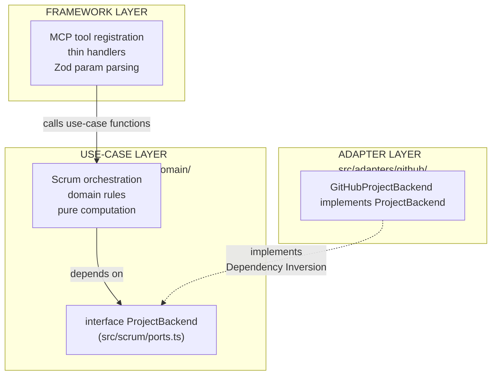

# Refactoring Plan: MCP Server Architecture

This document is the authoritative source of truth for the MCP server's architecture and refactoring roadmap. Update this file whenever a phase is completed, a decision is changed, or new scope is added.

## Table of Contents

1. [Purpose and Scope](#1-purpose-and-scope)
2. [Architecture Vision](#2-architecture-vision)
3. [Stable Tool Surface](#3-stable-tool-surface)
4. [Current Implementation State](#4-current-implementation-state)
5. [Remaining Work](#5-remaining-work)
   - [5b. Backend Code Quality](#5b-backend-code-quality-srcadaptersgithubbackendts)
6. [ProjectBackend Port Interface](#6-projectbackend-port-interface)
7. [Migration Ledger](#7-migration-ledger)
8. [Design Decisions](#8-design-decisions)
9. [Open Questions](#9-open-questions)

---

## 1. Purpose and Scope

### Why this refactoring exists

The MCP server started as a set of GitHub-primitive tools (`github_*`) that exposed GraphQL node IDs, field IDs, and iteration IDs directly to the agent. The current refactoring replaces that surface with a Scrum-vocabulary tool surface (`scrum_*`) where the server owns all ID resolution and the agent speaks only domain concepts: `StoryRef`, `SprintRef`, status names, and vocabulary values.

### Why the architecture goes further than a rename

The Scrum tool surface (`scrum_*`) is the stable contract. The GitHub Projects v2 API is the first and current backend, but it must not be the only possible one. The architecture is designed so that swapping to a different project management platform requires adding one new directory and changing one import in `index.ts` — no changes to the tools, use cases, domain rules, or schemas.

This property is achieved through a `ProjectBackend` interface that sits between the use-case layer and the GitHub-specific adapter layer. Nothing above the interface knows about GitHub; nothing below it knows about Scrum tools or MCP.

## 2. Architecture Vision

### Three-layer model

### Dependency Rules

| What                   | May import                                                    | Must not import                                |
| ---------------------- | ------------------------------------------------------------- | ---------------------------------------------- |
| `src/domain/`          | Nothing (std lib only)                                        | Anything else                                  |
| `src/scrum/`           | `src/domain/`                                                 | `src/adapters/`, `src/tools/`, `src/services/` |
| `src/adapters/github/` | `src/scrum/ports.ts`, `src/domain/`, `src/services/`          | `src/tools/`, `src/scrum/*.ts` (use cases)     |
| `src/tools/`           | `src/scrum/`, `src/domain/`, `src/schemas/`                   | `src/adapters/` directly                       |
| `src/index.ts`         | Everything (Main — the only place that knows all concretions) | —                                              |

## 3. Stable Tool Surface

### Read tools (7)

| Tool                 | Purpose                                                            |
| -------------------- | ------------------------------------------------------------------ |
| `scrum_orient`       | Current platform state + declared vocabulary — agent's entry point |
| `scrum_get_sprint`   | Sprint board: stories grouped by status with point totals          |
| `scrum_get_backlog`  | Unsprinted stories, filterable, with readiness summary             |
| `scrum_get_story`    | Full detail: comments, linked PRs, parsed acceptance criteria      |
| `scrum_get_history`  | Raw completed-sprint snapshots for velocity reasoning              |
| `scrum_get_burndown` | Day-by-day burndown series + ideal line for a sprint               |
| `scrum_get_template` | Fetch a project-configured ceremony artifact template              |

### Write tools (6)

| Tool                   | Purpose                                                          |
| ---------------------- | ---------------------------------------------------------------- |
| `scrum_create_story`   | Create a story and optionally place it on the board              |
| `scrum_update_story`   | Edit story content (title, body, labels, assignees, epic)        |
| `scrum_set_field`      | Single entry point for all board-field mutations                 |
| `scrum_plan_sprint`    | Bulk-assign stories to a sprint                                  |
| `scrum_log_impediment` | Create a blocking impediment linked to an affected story         |
| `scrum_add_vocabulary` | Idempotent add of a field option or label to the platform schema |

### Deprecated

| Tool             | Status                                                                                         |
| ---------------- | ---------------------------------------------------------------------------------------------- |
| `github_graphql` | Kept for diagnostic GraphQL lookups; mutations blocked; to be removed in a future cleanup pass |

## 4. Current Implementation State

### Per-phase summary

| Phase | Description                                            | Status      |
| ----- | ------------------------------------------------------ | ----------- |
| 1     | Domain types, Zod schemas, `loadConfig`, resolvers     | ✅ Complete |
| 2     | All 7 read tools extracted to use-case files           | ✅ Complete |
| 2.5   | `rest<T>()` helper + `scrum_get_burndown`              | ✅ Complete |
| 3     | Write tool implementations                             | ✅ Complete |
| 5     | Backend abstraction layer (`ProjectBackend` interface) | ✅ Complete |
| 4     | Cutover; delete legacy, cleanup types                  | ⏸️ Pending  |

> **Current state:** `index.ts` wires `scrum_*` tools via `registerScrumReadTools` and `registerScrumWriteTools` with `GitHubProjectBackend`. The cutover is **complete** — the server serves the new surface. Phase 4 is now purely cleanup of dead code.

### Per-file state

| File                                      | State        | Notes                                                                                                         |
| ----------------------------------------- | ------------ | ------------------------------------------------------------------------------------------------------------- |
| `src/index.ts`                            | ✅ Complete  | Wires `registerScrumReadTools` + `registerScrumWriteTools`                                                    |
| `src/types.ts`                            | ⚠️ Mixed     | Scrum domain types present; legacy types pending removal in Phase 4                                           |
| `src/schemas/scrum.ts`                    | ✅ Complete  | All 13 schemas (7 read + 6 write)                                                                             |
| `src/schemas/inputs.ts`                   | ⚠️ Legacy    | 28 dead schemas; pending cleanup in Phase 4                                                                   |
| `src/adapters/github/backend.ts`          | ✅ Complete  | `GitHubProjectBackend` implements `ProjectBackend` (all methods)                                              |
| `src/adapters/github/config-loader.ts`    | ✅ Complete  | `loadConfig()`, `RuntimeConfig`, `getBootstrapConfig()`                                                       |
| `src/adapters/github/mappers.ts`          | ✅ Complete  | All mapper functions                                                                                          |
| `src/adapters/github/queries.ts`          | ✅ Complete  | All GraphQL query strings                                                                                     |
| `src/adapters/github/raw-types.ts`        | ✅ Complete  | All raw response interfaces                                                                                   |
| `src/scrum/orient.ts`                     | ✅ Complete  | `orientUseCase()`                                                                                             |
| `src/scrum/get-sprint.ts`                 | ✅ Complete  | `getSprintUseCase()`                                                                                          |
| `src/scrum/get-backlog.ts`                | ✅ Complete  | `getBacklogUseCase()`                                                                                         |
| `src/scrum/get-story.ts`                  | ✅ Complete  | `getStoryUseCase()`                                                                                           |
| `src/scrum/get-history.ts`                | ✅ Complete  | `getHistoryUseCase()`                                                                                         |
| `src/scrum/get-burndown.ts`               | ✅ Complete  | `getBurndownUseCase()`                                                                                        |
| `src/scrum/get-template.ts`               | ✅ Complete  | `getTemplateUseCase()`                                                                                        |
| `src/scrum/ports.ts`                      | ✅ Complete  | `ProjectBackend` interface + all boundary types                                                               |
| `src/scrum/sprint-math.ts`                | ✅ Complete  | Pure computation helpers                                                                                      |
| `src/domain/rules/labels.ts`              | ✅ Complete  | `classifyLabels()`                                                                                            |
| `src/domain/rules/acceptance-criteria.ts` | ✅ Complete  | `parseAcceptanceCriteria()`                                                                                   |
| `src/domain/rules/readiness.ts`           | ✅ Complete  | `computeStoryReadiness()`, `ReadinessLevel`                                                                   |
| `src/services/github.ts`                  | ✅ Complete  | `graphql()`, `rest()`, `fetchRepoFile()`                                                                      |
| `src/services/mutation-validator.ts`      | ✅ Keeper    | `isMutationQuery()` — actively imported by `scrum-write.ts`                                                   |
| `src/services/pagination.ts`              | ✅ Complete  | `PaginatedProjectItemFetcher`                                                                                 |
| `src/services/resolver.ts`                | ✅ Complete  | `resolveSprint()`, `resolveStory()`                                                                           |
| `src/services/logger.ts`                  | ✅ Unchanged | No changes needed                                                                                             |
| `src/services/readiness.ts`               | ⚠️ Dead      | Superseded by `domain/rules/readiness.ts`; no live importers; delete in Phase 4                               |
| `src/services/config_test.ts`             | ⚠️ Broken    | Imports `./config.ts` which no longer exists (moved to `adapters/github/config-loader.ts`); delete in Phase 4 |
| `src/schemas/inputs_test.ts`              | ⚠️ Dead      | Tests `resolveFieldValue` which has no live callers; delete alongside `inputs.ts` cleanup                     |
| `src/tools/scrum-read.ts`                 | ✅ Complete  | 7 thin handlers delegating to use-case functions                                                              |
| `src/tools/scrum-write.ts`                | ✅ Complete  | All 6 write tools + deprecated `github_graphql`                                                               |

## 5. Remaining Work

### 5a. Phase 4 — Dead Code Cleanup (Priority-Based)

| Priority | File                                      | Action                                                                                                                                                                                                                                 | Status     |
| -------- | ----------------------------------------- | -------------------------------------------------------------------------------------------------------------------------------------------------------------------------------------------------------------------------------------- | ---------- |
| P1       | `src/tools/projects.ts`                   | Delete                                                                                                                                                                                                                                 | ✅ Done    |
| P1       | `src/tools/items.ts`                      | Delete                                                                                                                                                                                                                                 | ✅ Done    |
| P1       | `src/tools/repository.ts`                 | Delete                                                                                                                                                                                                                                 | ✅ Done    |
| P1       | `src/tools/projects_test.ts`              | Delete (imports deleted `projects.ts`; broken)                                                                                                                                                                                         | ⏸️ Pending |
| P1       | `src/tools/items_test.ts`                 | Delete (imports deleted `items.ts`; broken)                                                                                                                                                                                            | ⏸️ Pending |
| P1       | `src/tools/repository_test.ts`            | Delete (imports deleted `repository.ts`; broken)                                                                                                                                                                                       | ⏸️ Pending |
| P1       | `src/services/formatters.ts`              | Delete (no live importers)                                                                                                                                                                                                             | ⏸️ Pending |
| P1       | `src/services/readiness.ts`               | Delete (superseded by `domain/rules/readiness.ts`; no live importers)                                                                                                                                                                  | ⏸️ Pending |
| P1       | `src/services/config_test.ts`             | Delete (imports non-existent `./config.ts`; broken)                                                                                                                                                                                    | ⏸️ Pending |
| P2       | `src/schemas/inputs.ts`                   | Delete all except `GraphQLQuerySchema`; delete `inputs_test.ts` alongside                                                                                                                                                              | ⏸️ Pending |
| P3       | `src/types.ts`                            | Remove dead legacy types (see keep-list below)                                                                                                                                                                                         | ⏸️ Pending |
| P4       | `src/services/github.ts`                  | Remove `getToken`, `decodeRepoFileContent`, `enrichError`, `EnrichErrorContext`, `RepoFileResponse`, `GITHUB_API_URL`; trim `github_test.ts` accordingly (keep `formatError` tests — `formatError` IS live)                            | ⏸️ Pending |
| P4       | `src/services/resolver.ts`                | Remove `resolveBacklogItems`, `ResolvedStory`                                                                                                                                                                                          | ⏸️ Pending |
| P4       | `src/services/mutation-validator.ts`      | Remove `export` from `MutationBlockError` (no live importers; `isMutationQuery` is the only used export)                                                                                                                               | ⏸️ Pending |
| P4       | `src/adapters/github/config-loader.ts`    | Remove `export` from `ConfigParams`, `classifyIterations` (no live importers)                                                                                                                                                          | ⏸️ Pending |
| P4       | `src/adapters/github/mappers.ts`          | Remove `export` from `extractBoardFields` — it is imported as `_extractBoardFields` in `backend.ts` (comment: "kept for potential future use in write path") so the symbol is intentionally dormant, not truly dead; decision deferred | ⏸️ Pending |
| P4       | `src/domain/rules/readiness.ts`           | Remove `export` from `computeStoryReadiness` and `ReadinessLevel` — only `computeReadinessSummary` is called externally (by `get-backlog.ts`)                                                                                          | ⏸️ Pending |
| P4       | `src/domain/rules/labels.ts`              | Remove `export` from `STORY_TYPE_LABELS` (no live importers); keep `StoryTypeLabel` — imported by `mappers.ts`                                                                                                                         | ⏸️ Pending |
| P4       | `src/domain/rules/acceptance-criteria.ts` | Remove `export` from `AcceptanceCriterion` (no live importers; only `parseAcceptanceCriteria` is called)                                                                                                                               | ⏸️ Pending |
| P4       | `src/scrum/sprint-math.ts`                | Remove `export` from `SprintWindow`, `IdealDayPoint`, `BurndownDayPoint`, `BurndownStoryInput` (no live importers in any other module)                                                                                                 | ⏸️ Pending |
| P4       | `src/services/pagination.ts`              | Remove `export` from `ItemFetchConfig` (no live importers)                                                                                                                                                                             | ⏸️ Pending |

**Keep in `src/schemas/inputs.ts`:** `GraphQLQuerySchema` only — actively imported by `scrum-write.ts` for the deprecated `github_graphql` tool. `resolveFieldValue`, `FieldValueUnion`, and `ResolvedFieldValue` have no live callers outside `inputs.ts` itself and should be deleted with the rest. `inputs_test.ts` tests only `resolveFieldValue` and should be deleted alongside.

**Keep in `src/types.ts`:** The following types have confirmed live importers and must be retained (or migrated to a more appropriate module before removal):

| Type(s)                                                                                                         | Live importer(s)                                                                               | Notes                                                                                                                  |
| --------------------------------------------------------------------------------------------------------------- | ---------------------------------------------------------------------------------------------- | ---------------------------------------------------------------------------------------------------------------------- |
| `Story`, `StoryRef`, `SprintRef`                                                                                | `scrum/ports.ts`, `scrum/sprint-math.ts`, `adapters/github/backend.ts`, `tools/scrum-write.ts` | Core Scrum domain types                                                                                                |
| `ScrumConfigYml`, `ArtifactType`, `TemplateResponse`, `IterationEntry`                                          | `scrum/orient.ts`, `scrum/get-*.ts`, `tools/scrum-read.ts`, `adapters/github/config-loader.ts` | Config/template types                                                                                                  |
| `GitHubBackendConfig`                                                                                           | `adapters/github/config-loader.ts`                                                             | GitHub backend config shape                                                                                            |
| `GraphQLResponse`                                                                                               | `services/github.ts`                                                                           | Generic GraphQL response wrapper                                                                                       |
| `ItemContentType`, `ProjectV2Item`, `ProjectV2IssueContent`, `ProjectV2PRContent`, `ProjectV2DraftIssueContent` | `services/pagination.ts`                                                                       | Diagram incorrectly flags these as unused (generator bug with multi-line destructured imports); confirmed live by grep |
| `BurndownResponse`, `BurndownSprintMeta`, `BurndownStory`                                                       | `scrum/get-burndown.ts`                                                                        | Diagram incorrectly flags these as unused (same generator bug); confirmed live by grep                                 |

The following types in `src/types.ts` have no external importers but **cannot be deleted without inlining** — remove the `export` keyword only:

| Type(s)                             | Reason to keep                                                                                        |
| ----------------------------------- | ----------------------------------------------------------------------------------------------------- |
| `PriorityTier`, `StatusSemantics`   | Structural base types used inline within `ScrumConfigYml`; not imported by name from any other module |
| `BurndownDayPoint`, `IdealDayPoint` | Embedded as field types in `BurndownResponse`; not imported by name from any other module             |

All remaining types are confirmed dead and safe to delete: `BoardConfig`, `GhFieldBase`, `GhSingleSelectOption`, `GhSingleSelectField`, `GhIterationConfig`, `GhIterationField`, `GhField`, `GhProjectResponse`, `MergedScrumConfig`, `ResolvedScrumFields`, `SprintIteration`, `SprintStatusResult`, `BulkUpdateResult`, `SprintHistoryResponse`, `SprintSnapshot`, `SprintStory`, `SprintSummary`, `StoryReadiness` (becomes dead once `services/readiness.ts` is deleted), `IterationVelocity`, `GetBacklogResult`, `ProjectsV2Connection`, `UserProjectsData`, `OrgProjectsData`, `SingleProjectData`, `ProjectItemsData`, `AddProjectItemData`, `AddDraftIssueData`, `UpdateProjectItemFieldData`, `DeleteProjectItemData`, `ArchiveProjectItemData`, `UpdateProjectData`, `LinkedContentBase`, `ProjectV2ItemFieldValue`, `DefinitionCriteria`, `PageInfo`, `ScrumField`, `StoryType`.

> **Note on `docs/proj-diagram.md` Unused Exports:** The diagram's unused-export analysis has a known generator bug — it misses named imports when the caller uses multi-line destructured `import type {}` blocks. This causes false positives for `types.ts` Burndown types (used by `get-burndown.ts`), `types.ts` ProjectV2 content types (used by `pagination.ts`), `scrum/ports.ts` boundary types (used by `backend.ts`), `adapters/github/queries.ts` and `mappers.ts` (used by `backend.ts`), and `schemas/scrum.ts` schemas (used by `scrum-read.ts`/`scrum-write.ts`). The keep/delete lists above are based on direct grep verification, not the diagram alone.

### 5b. Backend Code Quality — `src/adapters/github/backend.ts`

The `GitHubProjectBackend` class (1,160 lines) has accumulated significant technical debt. Below is the assessment and planned cleanup.

#### Code Smell Inventory

| #   | Smell                                                                                                | Affected Methods                                                                            | Severity |
| --- | ---------------------------------------------------------------------------------------------------- | ------------------------------------------------------------------------------------------- | -------- |
| 1   | **Label creation logic duplicated 3+ times**                                                         | `resolveLabelNodeIds`, `resolveOrCreateLabel`, `addLabel`, `resolveOrCreateMilestoneNodeId` | High     |
| 2   | **String interpolation in GraphQL mutations** (injection risk)                                       | All `setField*` methods, `clearField`                                                       | High     |
| 3   | **`createStory` is 116 lines** doing label resolution, issue creation, board addition, field setting | `createStory`                                                                               | High     |
| 4   | **Burndown completion logic too complex** (audit log + issue close proxy)                            | `fetchAuditLogCompletions`, `fetchIssueCloseCompletions`                                    | Medium   |
| 5   | **`fetchAllItems` duplicates `PaginatedProjectItemFetcher`**                                         | `fetchAllItems`, `getCompletedSprintHistory`                                                | Medium   |
| 6   | **Response types defined inline** instead of in `raw-types.ts\*\*                                    | `GetIssueDetailsResponse`, `GetItemFieldsResponse`, `RawItem`, `RawFieldValue`              | Low      |

#### Planned Refactoring Tasks

| Priority | Task                                                             | Expected Outcome                            | Status     |
| -------- | ---------------------------------------------------------------- | ------------------------------------------- | ---------- |
| P1       | Extract label resolution/creation to `LabelResolver` class       | Single source of truth for label operations | ⏸️ Pending |
| P1       | Replace string interpolation with typed GraphQL variable passing | Eliminate injection risk in mutations       | ⏸️ Pending |
| P1       | Reduce `createStory` by extracting label/assignee resolution     | <60 lines, delegated to helpers             | ⏸️ Pending |
| P2       | Extract burndown completion logic to `BurndownFetcher` service   | Separated from backend concerns             | ⏸️ Pending |
| P2       | Replace `fetchAllItems` with `PaginatedProjectItemFetcher`       | Consistent pagination                       | ⏸️ Pending |
| P3       | Move inline response types to `raw-types.ts`                     | Cleaner backend file                        | ⏸️ Pending |

### 5c. Unit Tests for Use Cases (Optional Future Work)

Phase 5 Step 5.8 specifies: "Write at least one new unit test per use case that stubs `ProjectBackend` with a fake implementation."

No such tests exist. The existing test files (`scrum-read_test.ts`, `scrum-write_test.ts`, `scrum-history_test.ts`) are integration-level tests, not use-case-level unit tests with stubbed backends.

**Recommendation:** Low priority. Add if test coverage becomes a concern.

## 6. ProjectBackend Port Interface

The interface lives in [`src/scrum/ports.ts`](src/scrum/ports.ts). Full definition is in the original plan; the current implementation includes:

- **Read methods:** `getPlatformState`, `getSprintStories`, `getBacklogStories`, `getStoryDetail`, `getCompletedSprintHistory`, `getBurndownInput`, `resolveCompletionTimestamps`, `fetchRepoFile`
- **Write methods:** `createStory`, `updateStory`, `setField`, `addComment`, `addVocabulary`
- **Boundary types:** `SprintInfo`, `PlatformState`, `StoryDetail`, `SprintHistoryEntry`, `BurndownInput`, `CompletionMap`, `CreateStoryInput`, `StoryUpdates`, `VocabularyKind`

## 7. Migration Ledger

| Symbol                              | Current location        | Target location                        | Status     |
| ----------------------------------- | ----------------------- | -------------------------------------- | ---------- |
| `extractBoardFields()`              | `scrum-read.ts`         | `adapters/github/mappers.ts`           | ✅ Done    |
| `buildStoryFromRaw()`               | `scrum-read.ts`         | `adapters/github/mappers.ts`           | ✅ Done    |
| `buildEnrichedStory()`              | `scrum-read.ts`         | `adapters/github/mappers.ts`           | ✅ Done    |
| `buildCommentList()`                | `scrum-read.ts`         | `adapters/github/mappers.ts`           | ✅ Done    |
| `buildLinkedPrList()`               | `scrum-read.ts`         | `adapters/github/mappers.ts`           | ✅ Done    |
| `buildBurndownStoryInput()`         | `scrum-read.ts`         | `adapters/github/mappers.ts`           | ✅ Done    |
| All GraphQL query strings           | `scrum-read.ts`         | `adapters/github/queries.ts`           | ✅ Done    |
| All raw response interfaces         | `scrum-read.ts`         | `adapters/github/raw-types.ts`         | ✅ Done    |
| `loadConfig()`, `RuntimeConfig`     | `services/config.ts`    | `adapters/github/config-loader.ts`     | ✅ Done    |
| `resolveSprint()`, `resolveStory()` | `services/resolver.ts`  | `adapters/github/backend.ts` (private) | ✅ Done    |
| `getBootstrapConfig()`              | `scrum-read.ts`         | `adapters/github/config-loader.ts`     | ✅ Done    |
| `groupStoriesByStatus()` etc.       | `scrum-read.ts`         | `scrum/sprint-math.ts`                 | ✅ Done    |
| `classifyLabels()`                  | `scrum-read.ts`         | `domain/rules/labels.ts`               | ✅ Done    |
| `parseAcceptanceCriteria()`         | `scrum-read.ts`         | `domain/rules/acceptance-criteria.ts`  | ✅ Done    |
| `computeStoryReadiness()`           | `services/readiness.ts` | `domain/rules/readiness.ts`            | ✅ Done    |
| `_classifyReadiness()`              | `scrum-read.ts`         | **Deleted**                            | ✅ Done    |
| `ReadinessLevel` type               | —                       | `domain/rules/readiness.ts`            | ✅ Done    |
| Handler bodies                      | `scrum-read.ts`         | `scrum/*.ts` (one per read tool)       | ✅ Done    |
| `StoryReadiness` interface          | `types.ts`              | **Pending removal**                    | ⏸️ Phase 4 |
| `BoardConfig`, `GhFieldBase`, etc.  | `types.ts`              | **Pending removal**                    | ⏸️ Phase 4 |

## 8. Design Decisions

| Topic                        | Decision                                                                                                                                     |
| ---------------------------- | -------------------------------------------------------------------------------------------------------------------------------------------- |
| **Epic field**               | Maps to GitHub `Milestone` type. `scrum_update_story` creates the Milestone if not found.                                                    |
| **Assignee writes**          | Use `updateIssue` mutation only — not a separate project field.                                                                              |
| **Sprint "next" resolution** | "Next" = the scheduled iteration immediately after the active one, by iteration order.                                                       |
| **Sync script**              | Retired. All information retrievable via GraphQL API.                                                                                        |
| **`github_graphql` tool**    | Kept, deprecated. Mutations blocked at the tool level.                                                                                       |
| **Config file location**     | `.github/scrum/config.yml` in the repo — fetched via GitHub API at invocation time.                                                          |
| **Caching**                  | No server-side config cache in v1. Each tool invocation calls `loadConfig`.                                                                  |
| **Stateless server**         | All tool handlers call `loadConfig` at invocation time. No shared mutable state.                                                             |
| **Backend decoupling mode**  | Source-level (single Deno process). `index.ts` is the only file that knows which concrete implementation is wired.                           |
| **`ReadinessLevel` type**    | Replaced `StoryReadiness` interface with `type ReadinessLevel = "ready" \| "partially_ready" \| "not_ready"` in `domain/rules/readiness.ts`. |

## 9. Open Questions

| Question                                                                                    | Status                                           |
| ------------------------------------------------------------------------------------------- | ------------------------------------------------ |
| Does `projects_v2_item.field_value_updated` exist in the GitHub Enterprise Cloud Audit Log? | Unverified against live schema                   |
| Should `scrum_get_burndown` skip non-working days in the series?                            | Deferred. v1 includes all calendar days.         |
| Should the burndown ideal line use team capacity rather than a straight line?               | Deferred. Straight line is the Scrum standard.   |
| Should `scrum_get_history` support iteration by date range rather than just count?          | Deferred. `window` (count) is sufficient for v1. |
